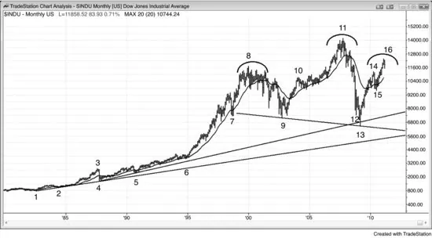
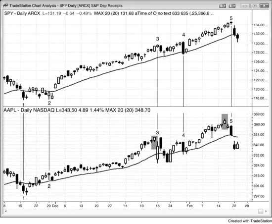
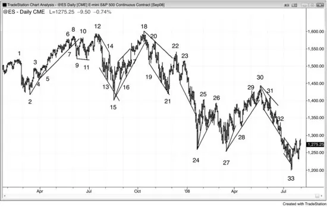
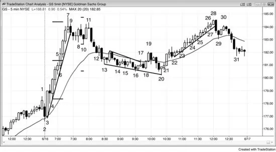
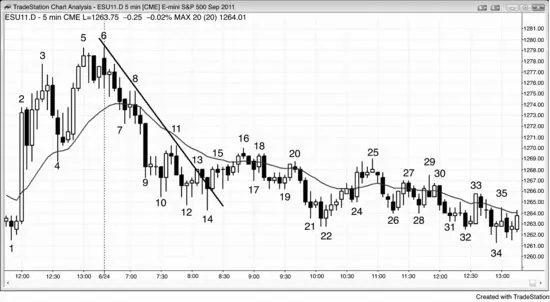

# Part I: Trend Reversals: A Trend Becoming an Opposite Trend

<!-- Source PDF pages 63–101 -->

<!-- PDF page 63 -->

PART I
Trend Reversals: A Trend Becoming an
Opposite Trend
One of the most important skills that a trader can acquire is the ability to reliably
determine when a breakout will succeed or reverse. Remember, every trend bar
is a breakout, and there are buyers and sellers at the top and bottom of every bull
and bear trend bar, no matter how strong the bar appears. A breakout of anything
is the same. There are traders placing trades based on the belief that the breakout
will succeed, and other traders placing trades in the opposite direction, betting it
will fail and the market will reverse. A reversal after a single bar on the 15
minute chart is probably a reversal that took place over many bars on the 1
minute chart, and a reversal that took place over 10 to 20 bars can be a one-bar
reversal on a 120 minute chart. The process is the same on all time frames,
whether it takes place after a single bar or many bars. If traders develop the skill
to know which direction the market will likely go after a breakout attempt
develops, they have an edge and will place their trades in that direction.
Reversal setups are common because every trend bar is a breakout and is soon
followed by an attempt to make the breakout fail and reverse, as discussed in
Chapter 5 of book 2. If the breakout looks stronger than the reversal attempt, the
reversal attempt will usually not succeed, and the attempt to reverse will become
the start of a flag in the new trend. For example, if there is a bull breakout of a
trading range and the bull spike is made of two large bull trend bars with small
tails, and the next bar is a bear doji bar, that bear bar is an attempt to have the
breakout fail and reverse back down into a bear trend. Since the breakout is
much stronger than the reversal attempt, it is more likely that there are more
buyers than sellers below the bear bar, and that the entry bar for the short will
become a breakout pullback buy signal bar. In other words, instead of the
reversal succeeding, it is more likely that it will become the start of a bull flag
and be followed by another leg up. If the reversal setup looks much stronger than
the breakout, it is more likely that the breakout will fail and that the market will
reverse. Chapter 2 in book 2 discusses how to gauge the strength of a breakout.
In short, the more signs of strength that are present, the more likely that the
breakout will succeed and that the reversal attempt will fail and lead to a

<!-- PDF page 64 -->

breakout pullback setup.
Institutional trading is done by discretionary traders and computers, and
computer program trading has become increasingly important. Institutions base
their trading on fundamental or technical information, or a combination of both,
and both types of trading are done by traders and by computers. In general, most
of the discretionary traders base their decisions primarily on fundamental
information, and most of the computer trades are based on technical data. Since
the majority of the volume is now traded by HFT firms, and most of the trades
are based on price action and other technical data, most of the program trading is
technically based. In the late twentieth century, a single institution running a
large program could move the market, and the program would create a micro
channel, which traders saw as a sign that a program was running. Now, most
days have a dozen or so micro channels in the Emini, and many have over
100,000 contracts traded. With the Emini currently around 1200, that
corresponds to $6 billion, and is larger than a single institution would trade for a
single small trade. This means that a single institution cannot move the market
very far or for very long, and that all movement on the chart is caused by many
institutions trading in the same direction at the same time. Also, HFT computers
analyze every tick and are constantly placing trades all day long. When they
detect a program, many will scalp in the direction of the program, and they will
often account for most of the volume while the micro channel (program) is
progressing.
The institutions that are trading largely on technical information cannot move
the market in one direction forever because at some point the market will appear
as offering value to the institutions trading on fundamentals. If the technical
institutions run the price up too high, fundamental institutions and other
technical institutions will see the market as being at a great price to sell out of
longs and to initiate shorts, and they will overwhelm the bullish technical trading
and drive the market down. When the technical trading creates a bear trend, the
market at some point will be clearly cheap in the eyes of fundamental and other
technical institutions. The buyers will come in and overwhelm the technical
institutions responsible for the selloff and reverse the market up. Trend reversals
on all time frames always happen at support and resistance levels, because
technical traders and programs look for them as areas where they should stop
pressing their bets and begin to take profits, and many will also begin to trade in
the opposite direction. Since they are all based on mathematics, computer
algorithms, which generate 70 percent of all trading volume and 80 percent of
institutional volume, know where they are. Also, institutional fundamental
traders pay attention to obvious technical factors. They see major support and

<!-- PDF page 65 -->

resistance on the chart as areas of value and will enter trades in the opposite
direction when the market gets there. The programs that trade on value will
usually find it around the same areas, because there is almost always significant
value by any measure around major support and resistance. Most of the
programs make decisions based on price, and there are no secrets. When there is
an important price, they all see it, no matter what logic they use. The
fundamental traders (people and machines) wait for value and commit heavily
when they detect it. They want to buy when they think that the market is cheap
and sell when they believe it is expensive. For example, if the market is falling,
but it’s getting to a price level where the institutions feel like it is getting cheap,
they will appear out of nowhere and buy aggressively. This is seen most
dramatically and often during opening reversals (the reversals can be up or down
and are discussed in the section on trading the open later in this book). The bears
will buy back their shorts to take profits and the bulls will buy to establish new
longs. No one is good at knowing when the market has gone far enough, but
most experienced traders and programs are usually fairly confident in their
ability to know when it has gone too far.
Because the institutions are waiting to buy until the market has become clearly
oversold, there is an absence of buyers in the area above a possible bottom, and
the market is able to accelerate down to the area where they are confident that it
is cheap. Some institutions rely on programs to determine when to buy and
others are discretionary. Once enough of them buy, the market will usually turn
up for at least a couple of legs and about 10 or more bars on whatever time
frame chart where this is happening. While it is falling, institutions continue to
short all the way down until they determine that it has reached a likely target and
it is unlikely to fall any further, at which point they take profits. The more
oversold the market becomes, the more of the selling volume is technically
based, because fundamental traders and programs will not continue to short
when they think that the market is cheap and should soon be bought. The relative
absence of buyers as the market gets close to a major support level often leads to
an acceleration of the selling into the support, usually resulting in a sell vacuum
that sucks the market below the support in a climactic selloff, at which point the
market reverses up sharply. Most support levels will not stop a bear trend (and
most resistance levels will not stop a bull trend), but when the market finally
reverses up, it will be at an obvious major support level, like a long-term trend
line. The bottom of the selloff and the reversal up is usually on very heavy
volume. As the market is falling, it has many rallies up to resistance levels and
selloffs down to support levels along the way, and each reversal takes place
when enough institutions determine that it has gone too far and is offering value

<!-- PDF page 66 -->

for a trade in the opposite direction. When enough institutions act around the
same level, a major reversal takes place.
There are fundamental and technical ways to determine support. For example,
it can be estimated with calculations, like what the S&P 500 price earnings
multiple should theoretically be, but these calculations are never sufficiently
precise for enough institutions to agree. However, traditional areas of support
and resistance are easier to see and therefore more likely to be noticed by many
institutions, and they more clearly define where the market should reverse. In
both the crashes of 1987 and 2008–2009, the market collapsed down to slightly
below the monthly trend line and then reversed up, creating a major bottom. The
market will continue up, with many tests down, until it has gone too far, which is
always at a significant resistance level. Only then can the institutions be
confident that there is clear value in selling out of longs and selling into shorts.
The process then reverses down.
The fundamentals (the value in buying or selling) determine the overall
direction, but the technicals determine the actual turning points. The market is
always probing for value, which is an excess, and is always at support and
resistance levels. Reports and news items at any time can alter the fundamentals
(the perception of value) enough to make the market trend up or down for
minutes to several days. Major reversals lasting for months are based on
fundamentals and begin and end at support and resistance levels. This is true of
every market and every time frame.
It is important to realize that the news will report the fundamentals as still
bullish after the market has begun to turn down from a major top, and still
bearish after it has turned up from a major bottom. Just because the news still
sees the market as bullish or bearish does not mean that the institutions still do.
Trade the charts and not the news. Price is truth and the market always leads the
news. In fact, the news is always the most bullish at market tops and most
bearish at market bottoms. The reporters get caught up in the euphoria or despair
and search for pundits who will explain why the trend is so strong and will
continue much longer. They will ignore the smartest traders, and probably do not
even know who they are. Those traders are interested in making money, not
news, and will not seek out the reporters. When a reporter takes a cab to work
and the driver tells him that he just sold all of his stocks and mortgaged his
house so that he could buy gold, the reporter gets excited and can’t wait to find a
bullish pundit to put on the air to confirm the reporter’s profound insight in the
gold bull market. “Just think, the market is so strong that even my cabbie is
buying gold! Everyone will therefore sell all of their other assets and buy more,

<!-- PDF page 67 -->

and the market will have to race higher for many more months!” To me, when
even the weakest traders finally enter the market, there is no one left to buy. The
market needs a greater fool who is willing to buy higher so that you can sell out
with a profit. When there is no one left, the market can only go one way, and it is
the opposite of what the news is telling you. It is difficult to resist the endless
parade of persuasive professorial pundits on television who are giving erudite
arguments about how gold cannot go down and in fact will double again over the
next year. However, you have to realize that they are there for their own selfaggrandizement and for entertainment. The network needs the entertainment to
attract viewers and advertising dollars. If you want to know what the institutions
are really doing, just look at the charts. The institutions are too big to hide and if
you understand how to read charts, you will see what they are doing and where
the market is heading, and it is usually unrelated to anything that you see on
television.
A successful trend reversal is a change from a bull market to a bear market or
from a bear market to a bull market, and the single most important thing to
remember is that most trend reversal attempts fail. A market has inertia, which
means that it has a strong propensity to continue what it has been doing and a
strong resistance to change. The result is that there is really no such thing as a
trend reversal pattern. When there is a trend, all patterns are continuation
patterns, but occasionally one will fail. Most technicians will label that failure as
a reversal pattern, but since most of the time it fails as a reversal and the trend
continues, it is really more accurately thought of as just a continuation pattern. A
trend is like a huge ship that takes a lot of force applied over time to change its
direction. There usually has to be some increase in two-sided trading before
traders in the other direction can take control, and that two-sided trading is a
trading range. Because of this, most reversal patterns are trading ranges, but you
should expect the breakout from the trading range to be in the direction of the
trend because that is what happens in about 80 percent of cases. Sometimes the
breakout will be in the opposite direction or the with-trend breakout will quickly
fail and then reverse. When those events happen, most traders will label the
trading range as a reversal pattern, like a double top, a head and shoulders, or a
final flag. All of the reversal patterns listed in Part I can lead to a trend in the
opposite direction, but they can also simply lead to a trading range, which is
more likely to be followed by a trend resumption. In this case, the reversal
pattern is just a bull flag in a bull trend or a bear flag in a bear trend.
When a trend reverses, the reversal can be sharp and immediate and have a lot
of conviction early on, or it can happen slowly over the course of a dozen or
more bars. When it happens slowly, the market usually appears to be forming

<!-- PDF page 68 -->

just another flag, but the pullback continues to grow until at some point the withtrend traders give up and there is a breakout in the countertrend direction. For
example, assume that there is a bear trend that is beginning to pull back and it
forms a low 1 setup, but the market immediately turns up after the signal
triggers. It then triggers a low 2 entry and that, too, fails within a bar or so. At
this point, assume that either the market breaks out of the top of the bear flag or
it has one more push up, triggering a wedge bear flag, the entry fails, and then
the market has a breakout to the upside. A reversal at some point makes the
majority of traders believe that the always-in position has reversed, and this
almost always requires some kind of breakout. This is discussed in detail in
Chapter 15, but it means that if you had to be in the market at all times, either
long or short, the always-in position is whatever your current position is. The
breakout characteristics are the same as with any breakout, and were discussed
in the chapter on breakouts in Part I of book 2. At this point, there is a new trend,
and traders reverse their mind-set. When a bull trend reverses to a bear trend,
they stop buying above bars on stops and buying below bars on limit orders, and
begin selling above bars on limit orders and selling below bars on stops. When a
bear trend reverses to a bull trend, they stop selling below bars on stops and
selling above bars on limit orders, and begin buying above bars on stops and
buying below bars on limit orders. See Part III in the first book for more on trend
behavior.
Every trend is contained within a channel, which is bordered by a trend line
and a trend channel line, even though the channel may not be readily apparent on
a quick look at the chart. The single most important rule in these books is that
you should never be thinking about trading against a trend until after there has
been a breakout of the channel, which means a break beyond a significant trend
line. Also, you should take a reversal trade only if there is a strong signal bar.
You need evidence that the other side is strong enough to have a chance of
taking control. And even then, you should still be looking for with-trend trades
because after this first countertrend surge, the market almost always goes back in
the direction of the trend to test the old trend extreme. Only rarely is the trend
line break on such strong momentum that the test won’t be tradable for at least a
scalp. If the market fails again around the price of the old extreme, then it has
made two attempts to push through that level and failed, and whenever the
market tries twice to do something and fails, it usually tries the opposite. It is
after this test of the old extreme that you should look for countertrend swing
trades and only if there is a good setup on the reversal away from the old
extreme.
It is very important to distinguish a reversal trade from a countertrend scalp. A

<!-- PDF page 69 -->

reversal trade is one where an always-in flip is likely. A countertrend scalp is not
a reversal trade; it usually has a bad trader’s equation and most often forms
within a channel. Channels always look like they are about to reverse, suckering
traders into countertrend trades using stop entries. These traders soon get trapped
and have to cover with a loss. For example, if there is a bull channel, it will
usually have a reasonable-looking bear reversal or inside bar after the breakout
to every new high. Beginners will see that there is enough room to the moving
average for a short scalp and will short on a stop below the bar. They will lose
money on 70 percent or more of their countertrend scalps, and their average
loser will be larger than their average winner. They take the shorts because they
are eager to trade and most of the buy signals look weak, often forcing traders to
buy within a few ticks of the top of the channel. The countertrend setups often
have good-looking signal bars, which convince traders that they can finesse a
short scalp while waiting for a good-looking buy setup. They see all of the prior
bear reversal bars and pullbacks as signs of building selling pressure, and they
are right. However, most short scalps will end up being just micro sell vacuums,
where the market is getting sucked down to a support level, like around the
bottom of the channel, or below a minor higher low. Once there, the strong bulls
begin to buy aggressively. Many take profits at the new high, creating the next
sell signal, which will fail like all of the earlier ones. High-frequency trading
firms pay minuscule commissions and can profitably trade for one or two ticks,
but you cannot. Although there are good-looking reversal bars, these are not
tradable reversals, and traders should not take them. As long as the signal is not
good enough to flip the always-in direction to short, only trade in the direction of
the trend. The institutions are buying below the lows of those sell signal bars. If
you want to trade while the channel is forming, you either have to buy with limit
orders below prior bars, like the institutions, or buy above high 2 signal bars,
which is where the bears usually buy back their losing shorts. However, this is
difficult for many traders, because they can see that the channel has a lot of twosided trading and know that buying at the top of a channel, where there is a lot of
two-sided trading, is an approach that often has only a marginally positive
trader’s equation.
A trend reversal, or simply a reversal, is not necessarily an actual trend
reversal because the term implies that the market is changing from one behavior
to any opposite behavior. It is best thought of as a change from a bull trend to a
bear trend or vice versa, and that is the subject of Part I. Trading range behavior
is arguably the opposite of trending behavior, so if a trading range breaks out
into a trend, that is a reversal of the behavior of the market, but it is more
commonly described as a breakout. A pullback is a small trading range and a

<!-- PDF page 70 -->

small trend against the larger trend, and when the pullback ends, that minor trend
reverses back into the direction of the major trend. Most trend reversals end up
as higher time frame pullbacks in the trend, which means that most end up as
large trading ranges; however, some become strong, persistent trends in the
opposite direction. Even when the reversal leads to a trading range, the reversal
entry will usually go far enough to be a swing trade.
Most trend reversal attempts do not result in a strong, opposite trend and
instead lead to trading ranges. Strictly speaking, the behavior has reversed into
an opposite type of price action (from one-sided trading to two-sided trading),
but the trend has not reversed into an opposite trend. A trader never knows in
advance if there will be a reversal into a new trend, and a reversal into a trading
range often looks the same as a reversal into a new trend for dozens of bars.
Because of this, a trader does not know until much later whether there has been a
reversal into the opposite trend or just a transition into a trading range. This is
why the probability of most trades, where the reward is many times greater than
the risk, is so small at the outset. As the moves becomes more certain, the reward
gets smaller, because there are fewer ticks left to the move, and the risk gets
larger because the theoretically ideal stop for a swing trade goes beyond the start
of the most recent spike (below the most recent higher low in a bull or above the
most recent lower high in a bear, which can be far away). From a trader’s
perspective, it does not matter because traders are going to trade the reversal the
same way, whether it evolves into a strong new trend or simply into a couple of
large countertrend legs. Yes, they would make more money from a huge swing
that does not come back to their breakeven stops, but they can still make a lot of
money if the market stalls and simply becomes a large trading range. However,
in a trading range, traders will usually make more money if they look for scalps
rather than swings. Trading ranges and pullbacks were discussed in book 2. In a
true trend reversal, the new trend can go a long way and traders should swing
most of their position.
If the market does reverse into an opposite trend, the new trend may be either
protracted or limited to a single bar. The market may also simply drift sideways
after a bar or two, and then trend again later, either up or down. Many
technicians will not use the term reversal except in hindsight, after a series of
trending highs and lows has formed. However, this is not useful in trading
because waiting for that to occur will result in a weaker trader’s equation, since a
significant pullback (a greater drawdown) in that new trend becomes more likely
the longer the trend has been in effect. Once a trader is initiating trades in the
opposite direction to the trend, that trader believes that the trend has reversed
even though the strict criteria have not yet been met. For example, if traders are

<!-- PDF page 71 -->

buying in a bear trend, they believe that the market will likely not trade even a
single tick lower; otherwise they would wait to buy. Since they are buying with
the belief that the market will go higher, they believe the trend is now upward
and therefore a reversal has taken place, at least on a scale large enough for the
trade to be profitable.
Many technicians will not accept this definition, because it does not require
some basic components of a trend to exist. Most would agree on two
requirements for a trend reversal. The first is an absolute requirement: the move
has to break a trend line from the prior trend so that the old trend channel has
been broken. The second requirement happens most of the time, but is not
required: after the trend line break, the market comes back and successfully tests
the extreme of the old trend. Rarely, there can be a climactic reversal that has a
protracted initial move and never comes close to testing the old extreme.
The sequence is the same for any reversal. Every trend is in a channel and
when there is a move that breaks the trend line, the market has broken out of the
channel. This breakout beyond the trend line is followed by a move back in the
direction of the trend. The trend traders want this to be a failed reversal attempt
and for the old trend to resume. If they are right, the new trend channel will
usually be broader and less steep, which indicates some loss of momentum. This
is natural as a trend matures. They see this trend line break as simply leading to
another flag that will be followed by an extension of the trend.
The countertrend traders want this reversal back in the direction of the old
trend, after the breakout, to be a breakout test and then be followed by at least a
second leg against the old trend. In a successful breakout, instead of resuming
the trend, the test reverses once more and the test becomes a breakout pullback
in the new trend, or at least in a larger correction. For example, in the breakout
above the bear trend line in a bear trend, at some point the reversal will attempt
to fail and then sell off to a lower low, a double bottom, or a higher low, which is
the test of the bear low. If that test is successful, that test becomes a breakout
pullback in the breakout above the bear trend line and the new bull trend
resumes for at least one more leg. When the reversal up results in a reversal into
a new trend, the rally that broke above the bear trend line is when the bulls
began to take control over the market, even if the pullback from this bull
breakout falls to a lower low. Most traders will see the lower low as the start of
the bull trend, but the bulls often take control during the spike that breaks above
the bear trend line. It does not matter if you say that the bull began at the bottom
of the bull spike or at the bottom of the lower low reversal, because you trade the
market the same. You look to buy as the market is reversing up from the lower

<!-- PDF page 72 -->

low (or double bottom or higher low). The rally that follows could become a
large two-legged correction, the start of a trading range, or a new bull trend. No
matter what the end result is, the bulls have a good chance of a profitable trade.
If the test is unsuccessful, the market will continue down into a new bear leg and
traders have to look for another breakout above the new bear channel and then
another test of the new bear low before looking to buy a bottom. The opposite is
true when there is a bull trend that has a bear spike below the bull trend line, and
then a higher high, double top, or lower high pullback from the breakout. The
bears began to take control over the market during the spike. The test of the bull
high, even if it exceeds the old high, is still simply a pullback from the initial
bear breakout below the bull trend line.
Once there has been a strong countertrend move, the pullback will be a test for
both the bulls and the bears. For example, suppose there was a strong downward
move in a bull market, and the move broke through a trend line that had held for
20 to 40 bars; it then continued down for 20 bars and carried well below the 20bar moving average, and even beneath the low of the last higher low of the bull
trend; in this case the bears have demonstrated considerable strength. Once this
first leg down exhausts itself, bears will begin to take partial profits, and bulls
will begin to reinstate their longs. Both will cause the market to move higher,
and both bulls and bears will watch this move very carefully. Because the down
leg was so strong, both the bulls and the bears believe that its low will likely be
tested before the market breaks out into a new high. Therefore, as the market
rallies, if there is not strong momentum up, the new bulls will start to take profits
and the bears will become aggressive and add to their shorts. Also, the bulls who
held through the selloff will use this rally to begin to exit their longs. They
wanted to stay long until they saw strong bears, and since the bears demonstrated
impressive strength, these bulls will look for any rally to exit. This represents
supply over the market and will work to limit the rally and increase the chances
of another leg down. The rally will likely have many bear bars and tails, both of
which indicate that the bulls are weak. A selloff down from this rally would
create the first lower high in a potential new bear trend. In any case, the odds are
high that there will be a second leg down, since both the bulls and the bears
expect it and will be trading accordingly.
There will still be bulls who bought much lower and want to give the bull
trend every possible chance to resume. Traders know that most reversal attempts
fail, and many who rode the trend up will not exit their longs until after the bears
have demonstrated the ability to push the market down hard. Many longs bought
puts to protect themselves in case of a severe reversal. The puts allow them to
hold on to give the bull trend every possible chance to resume. They know that

<!-- PDF page 73 -->

the puts limit their losses, no matter how far the market might fall, but once they
see this impressive selling pressure, they will then look for a rally to finally exit
their longs, and will take profits on their puts as the market turns back up. Also,
most of their puts expire within a few months, and once expired, the traders no
longer have downside protection. This means that they cannot continue to hold
on to their positions unless they keep buying more and more puts. If they believe
that the market will likely fall further and not rally again for many months, it
does not make sense to continue to pay for ongoing put protection. Instead, they
will look to sell out of their positions. Their supply will limit the rally, and their
selling, added to the shorting by aggressive bears and the profit taking by bulls
who saw the selloff as a buying opportunity, will create a second leg down.
These persistent bulls will each have a price level on the downside that, if
reached, will make them want to exit on the next rally. As the market keeps
working lower, more and more of these bulls will decide that the bull trend will
not resume anytime soon and that the trend might have reversed into a bear
trend. These remaining die-hard longs will wait patiently for a pullback in the
bear swing to exit their longs, and their positions represent a supply that is
overhanging the market. They sell below the most recent swing high because
they doubt that the market will be able to get above a prior swing high and are
happy to get out at any price above the most recent low. Bears will also look for
a pullback from each new low to add to their shorts and place new shorts. The
result is a series of lower highs and lower lows, which is the definition of a bear
trend.
Typically, the initial move will break the trend line and then form a pullback
that tests the end of the old trend, and traders will look to initiate countertrend
(actually with-trend, in the direction of the new trend) positions after this test.
Most traders will want the leg that breaks the trend line and the one that tests the
trend’s extreme to have more than just two or three bars. Is five enough? What
about 10? It all depends on context. A trend line break that has just one or two
exceptionally large bars can be enough to make traders expect at least a second
leg. Is a two-bar pullback enough of a test of the old extreme? Most traders
prefer to see at least five bars or so, but sometimes the trend line break or the
pullback can be only two or three bars long and still convince traders that the
trend has reversed. If one of the two legs is just a couple of bars, most traders
will not trade the new trend aggressively unless the other leg has more bars.
Because of this, the new trend will rarely begin after just a two-bar trend line
break and then a two-bar test of the old trend. Even when one does, the odds are
high that there will be a larger pullback within the next 10 bars or so.

<!-- PDF page 74 -->

The test after the trend line break may fall short of the prior extreme or it may
exceed it, but not by too much. With any countertrend trade, traders should insist
on a strong signal bar, because without it the odds of success are much less. For
example, if there is a bear trend and then a sharp move upward that extends well
beyond the bear trend line, traders will look to buy on the first pullback, hoping
for the first of many higher lows. They will want a strong bull reversal bar or
two-bar reversal before taking the trade. However, sometimes the pullback
extends below the low of the bear trend, running stops on the new longs. If this
lower low reverses back up within a few bars, it can lead to a strong swing up. If,
in contrast, the lower low extends too far below the prior low, it is better to
assume that the bear trend has begun a new leg down, and then wait for another
trend line break, upward momentum surge, and a higher or lower low pullback,
before going long again.
Although traders love to buy the first higher low in a new bull trend or sell the
first lower high in a new bear trend, if the new trend is good, there will be a
series of pullbacks with trending swings (higher highs and higher lows in a bull
trend or lower highs and lower lows in a bear trend), and each of these pullbacks
can provide an excellent entry. A pullback can be a strong bear spike, but as long
as traders think the trend is now upward, they will buy around the close of the
strong bear trend bar, expecting no follow-through and looking for the bear
reversal to fail. The bulls see the strong bear spike as a brief value opportunity.
Beginners unfortunately see it as the start of a new bear trend, ignoring all of the
bullishness of the prior bars and focusing on only this one-or two-bar bear spike.
They short exactly where the strong bulls are buying. The bulls will expect every
attempt by the bears to fail, and therefore look to buy each one. They will buy
around the close of every bear trend bar, even if the bar is large and closes on its
low. They will buy as the market falls below the low of the prior bar, any prior
swing low, and any support level, like a trend line. They also will buy every
attempt by the market to go higher, like around the high of a bull trend bar or as
the market moves above the high of the prior bar or above a resistance level.
This is the exact opposite of what traders do in strong bear markets, when they
sell above and below bars, and above and below both resistance and support.
They sell above bars (and around every type of resistance), including strong bull
trend bars, because they see each move up as an attempt to reverse the trend, and
most trend reversal attempts fail. They sell below bars (and around every type of
support), because they see each move down as an attempt to resume the bear
trend, and expect that most will succeed.
The first pullback after a reversal up into a new bull trend is usually a test of
the bear low, but it may not even get very close to the bear low. It, like all

<!-- PDF page 75 -->

subsequent pullbacks in the new bull trend, can also be a test of a breakout of a
key point like the most recent signal bar high or entry bar low, a trend line, a
prior swing point, a trading range, or a moving average. After the market moves
above the high of the first leg up, bulls will move their protective stops up to just
below this higher low. They will continue to trail their stops to just below the
most recent higher low after every new higher high until they believe that the
market is becoming two-sided enough to start having two-legged corrections
down. Once they believe that the market will have a second leg down that will
likely fall below the low of the first leg down (the most recent higher low), they
will look to exit their longs on strength, like around the close of a bull trend bar
that is at, above, or slightly below the trend’s high, or below the low of the prior
bar. It does not make sense for them to exit below the most recent higher low
once they believe that the market will get there. Instead, they will exit higher and
look to buy again around that higher low. If this bull flag is sideways, it could be
a simple high 2, a triangle, or a double bottom; it could also form a lower low
and be a traditional ABC correction.
All trends are in channels, and most trends end with a breakout of the trend
channel, which may not be obvious on the time frame of the chart in front of
you. For example, a bull trend typically ends in one of two ways. First, there can
be a breakout above the channel in an attempt to create an even steeper bull
trend. This only rarely succeeds and usually fails within one to five bars. The
market then reverses back down below the trend channel line and into the
channel, and then the minimum target is a poke below the trend line at the
bottom of the channel. This will usually have at least a two-legged sideways to
down correction and may lead to a trend reversal or a trading range. The
pullback from the first leg down usually becomes a lower high, and the second
leg down will usually extend to some measured move target, like a leg 1 = leg 2
move or a projection based on the height of the bear spike or of some trading
range within the bull channel.
Alternatively, the market can break below the bull trend line without first
overshooting the trend channel line. The breakout can be a sharp spike down or a
sideways drift into a trading range. In either case, the pullback that tests the bull
high can be either a higher high or a lower high; they occur about equally
frequently. Since at least two legs down will happen in about two-thirds of cases,
a higher high should be followed by two legs down, and a lower high may be
followed by a single leg, since the first leg down already occurred just before the
lower high formed. In the other third of cases, the reversal attempt fails, and the
bull trend resumes or a trading range forms.

<!-- PDF page 76 -->

If the market forms a higher high in its test of the old bull high, one of the best
trades is to look for a short setup on the first lower high, which is a test of the
higher high. In a bear trend where there is an upward momentum surge that
breaks above a major bear trend line, traders will buy the first higher low. Their
buying lifts the market and reinforces everyone’s belief that a new bull trend
might be beginning.
An important point is that trends last much longer than most traders would
ever imagine. Because of that, most reversal patterns fail and evolve into
continuation setups, and most continuation patterns succeed. Traders have to be
very careful when trading countertrend based on a reversal pattern, but there are
price action setups that greatly increase the chances of a profitable trade.
Since most reversal attempts fail, many traders enter in the opposite direction.
For example, if there is a bull trend and it forms a large bear trend bar closing on
its low, most traders will expect this reversal attempt to fail, and many will buy
at the close of the bear bar. If the next bar has a bull body, they will buy at the
close of that bar and above its high. The first target is the high of the bear trend
bar, and the next target is a measured move up, equal to the height of the bear
trend bar. Some traders will use an initial protective stop that is about the same
number of ticks as the bear trend bar is tall, and others will use their usual stop,
like two points in the Emini.
If you find yourself drawing many trend channel lines during a trend and
seeing lots of wedge reversal setups, then you are too eager to find a reversal and
are likely missing many great with-trend trades. Also, since most trend channel
line overshoots and reversals are minor in a strong trend and fail, you will be
trading loser after loser and wondering why these patterns are failing when they
are supposed to be so good. Wait for a strong trend line break before looking for
a countertrend trade; look at all those minor trend channel line overshoots as the
start of with-trend setups, and enter where the losers are exiting on their
protective stops. You will be much happier, more relaxed, and richer, and you
will be entertained by how well they work when intuitively they should not.
One of the reasons it is so tempting for a beginner to sell rallies in a strong
bull trend is that the market spends so much time near the high of the leg, and
one gets impatient waiting for a pullback that never seems to come. Also, there
does not seem to be enough room to the top of the screen for the market to go
any higher, so it is easy to imagine that it has to go lower. The market is so
overdone that there surely has to be an imminent regression to the mean in the
form of a reversal that will fall far enough to make at least a scalper’s profit.
Traders begin to believe that they have to do something in the meantime while

<!-- PDF page 77 -->

they wait for the market to pull back, and as traders, they assume that they must
trade. Instead, they should think of themselves as traders who must make a lot of
money, not a lot of trades. Since they are afraid to buy at the high and they
believe that a pullback is overdue, they short, expecting that they will make
money as the market begins to pull back. Most of the time, the market will pull
back a little but then reverse back up. It does not fall far enough for them to
make a profit on their countertrend short scalps, and they are stopped out with a
loss. The bull trend then resumes again in a quick breakout, and they are on the
sidelines, watching, feeling sad, and a little bit poorer. Experienced traders take
the other side of this trade. Many place limit orders to buy at the low of that
weak bear signal bar, and others place stop orders to get long at one tick above
the high of the prior bar in the small pullback. When the pullback sets up a long,
beginners are still fixated on that top that led to the pullback, and they are afraid
that the market might fall further. Or they are still short, hoping for the market to
drop just a little more so that they can make a profit on their short scalp. Surely
one of their short scalps has to work. They just lost on their last four shorts, and
the market has to realize how unfair it has been, and will now make up for it by
giving them a profit. They do not accept that it is all math and has nothing to do
with fairness or emotion. After several months or years of losing, they decide
that when they see a bull trend, they will not take a single short all day. That is
the day when they stop losing money. After many months, they decide that when
there is a bull trend, they are only going to buy pullbacks and take no other
trades. That is the day that they begin to make money.
In a bull trend, buyers continue to buy until they decide that the trader’s
equation is no longer as favorable as they would like it to be, and at that point
they begin to take partial profits. As the market continues to rise, they continue
to take more profits and are not eager to buy again until there is a pullback. Also,
shorts are being squeezed out of the market as the market continues upward, and
they are being forced to buy back their short positions. At some point, they will
have covered all that they wish to cover, and their buying will stop. There will
also be momentum traders who will continue to buy as long as there is good
momentum, but these traders will be quick to take profits once the momentum
slows. The market will continue up until it overshoots the directional probability
of an equidistant move. The bulls and bears are never sure when that probability
is 50 percent, and the trend will continue until the math clearly favors a move
down. Neutrality is never clear, and excess is much easier to spot. It will always
occur at some magnet area, but since there are so many to choose from, it is
difficult to know which will work. Usually, there has to be a confluence of
magnets before a pullback will develop. Some firms will be placing trades based

<!-- PDF page 78 -->

on one or more magnets, and other firms will use different ones; but once there
is a critical mass of firms expecting a pullback, the market will turn. The critical
mass comes when the selling pressure becomes greater than the buying pressure
and is due to more dollars being traded by traders expecting a pullback. There
will no longer be a shortage of offers, requiring the market to go higher to find
traders to take the other side of the bull trades. Instead, traders will be quick to
place shorts at the offer. In fact, they will start shorting at the bid and the market
will have to go lower to find enough buyers to fill the large number of sell
orders. Those sellers will be a combination of bulls selling out of their longs and
bears establishing shorts.
So who is buying that last tick at the top of a bull trend or selling the low of a
bear trend? Is it the accumulation of countless small traders who are getting
caught up in the panic and either are on the wrong side and being forced to
liquidate in the face of rapidly growing losses or are flat and impulsively
entering late in a rapidly moving trend? If only we could be so influential! That
might have been the case long ago, but not in today’s market. If there is so much
volume at the high and low of the day and the institutions make up most of that
volume, why would they buy the high tick of the day if they are so smart? The
majority of the day’s volume is driven by statistically based mathematical
algorithms, and some of those models will continue to buy until there is a clear
trend change, and only then will they reverse to the short side. These momentum
programs will buy right up to the last tick of a bull trend and short to the very
low of a bear trend because the designers of the systems have determined that
this approach maximizes their profit. Remember, there is inertia in a trend and
trends are very resistant to ending, so betting on them continuing is a good bet.
Because they trade such huge volume, there is an ample supply of buying at the
high to take the other side of the huge volume of shorts that is coming in at the
top (and vice versa at the bottom).
Just because they are very smart and trade huge volume does not mean that
they are making a 5 percent profit a day. In fact, the best of them are netting a
fraction of a percentage point each day, and some of them have determined that
their profit is maximized by continuing to buy, even including the high tick of
the day, because they believe that the market might go at least a tick or two
higher. Many high-frequency trading (HFT) algorithms are designed to make
very small profits on each trade, and if these quant firms have done tests that tell
them that they can make a couple more ticks by buying at the high, they will
continue to buy. Many firms also have complex strategies involving options and
other products, and it is impossible to know what all the factors are at play at the
extremes of the day. For example, they might be expecting a reversal down and

<!-- PDF page 79 -->

be entering a delta-neutral spread where they would buy 200 Emini contracts and
buy 2,000 SPY at-the-money puts. They lose only if the market goes sideways in
a very tight range for several days. If the market goes up, the puts will lose
money at a slower rate than the rate at which the Eminis gain in value. If the
market falls, the puts will increase in value faster than the long Eminis will fall
in value, and their neutral spread becomes increasingly more of a bear play. This
will allow them to profit, even though they bought the Eminis at the high of the
day. All that you need to know is that there is huge volume at the extremes, and
it is coming from institutions, some of which are buying the high while others
are selling it.
Incidentally, there is one other common sign of just how active mathematical,
computer-generated trading is. Just look at correlated markets, like the Emini
and all of the related exchange-traded funds (ETFs) like the SPY, and you will
see that they basically move tick for tick. This is also true for other related
markets. This could not be taking place so perfectly all day long if it was being
done manually. Also, chart patterns would not be as perfect as they are on all
time frames, even down to tick charts, unless a huge volume of the trading was
computer generated. People simply cannot analyze and place orders that quickly
in so many markets simultaneously, so the perfection has to be the result of
computer-generated trades, and they must make up the majority of the trading
volume.
When there is a strong trend with no significant pullbacks, it is common to
start looking for a small reversal because common sense dictates that the market
will eventually have to pull back as traders begin to take partial profits and
enough countertrend traders take new positions. Regression to a mean logic
works everywhere in life and it should in trading as well. And it does, but it
usually occurs after the market has reached a far greater extreme than most
traders could imagine. A trader will have to decide if it is better to look for a
countertrend scalp or to wait for the pullback to end and then enter in the
direction of the trend. If the trend is strong, it is usually better to trade
countertrend only if there are clear signs of a trend reversal, such as a prior
strong trend line breakout and then a test that ends with a strong reversal bar.
However, the temptation is great to do something, and many traders will begin to
look at smaller time frame charts, like a 1 minute or 100 tick chart. Smaller time
frame charts continue to form reversals as the trend progresses, and the vast
majority of the reversals fail. A trader can rationalize taking the countertrend
trade by thinking that a 1 minute chart has small bars so the risk is only about
four ticks, and if this turns out to be the very top of the market, the potential gain
is huge. Therefore, taking a few small losses is worth it. Invariably, the few

<!-- PDF page 80 -->

small losses turn into six or seven and their combined effect is a loss that cannot
be recovered later in the day. When traders get lucky and pick the exact end of a
trend, they will scalp out with a few ticks of profit instead of riding the trade for
a long way, as they originally had planned. This is death by mathematics. It’s
great to feel smart enough to buy the low of a bear trend or short the high of a
bull trend, but if you lose in nine out of 10 attempts, you will slowly go broke. In
general, buying pullbacks in bull trends and selling rallies in bear trends is a
much better approach for most traders. There are far more trades, and the
winning percentage is higher.
If you are becoming agitated because you are not in the market during an
extended trend and you feel like you need to trade so you begin to look at a 1
minute chart, those 1 minute reversals offer a very profitable way to make
money. However, it is by doing the opposite of the obvious. Wait for a 1 minute
reversal to trigger a countertrend entry, which you do not take, and then
determine where you would place a protective stop if you had taken the trade.
Then, place a stop order to enter with trend at that price. You will be stopped into
a with-trend position just as the countertrend traders are getting stopped out. No
one will be looking to enter countertrend at that point and likely not until the
trend has moved far enough to make a profit before the next countertrend setup
begins to form. This is a very high-probability with-trend scalp.
The single most reliable countertrend trade is actually a with-trend trade on a
larger time frame. A pullback is a small trend against the larger trend, and when
you enter against the trend of that pullback, you are entering in the direction of
the larger trend. Once the pullback traders have exhausted themselves and the
trend traders have again demonstrated their resolve by breaking the trend line
that contained the pullback, any small pullback to test this breakout is a great
breakout pullback entry. This entry is counter to the trend of the pullback, but in
the direction of the major trend, and will usually lead to at least a test of the
major trend’s extreme. The more momentum that is present in the trend line
break, the more likely it is that trade will be profitable. For example, if there is a
bull flag, you can buy the bottom of the bull flag, the breakout of the bull flag, or
on a small pullback from that breakout for a test of the high of the bull trend.
Momentum in a reversal can be in the form of a few large trend bars or a
trending series of average-looking bars. The more signs of strength, the more
reliable the reversal will be. These are discussed in more detail in Chapter 2 of
book 2 on the strength of breakouts and in Chapter 19 of book 1 on the strength
of trends. Ideally, the first leg of the reversal will extend for many bars, break
well beyond the moving average, have the majority of the bars be trend bars in

<!-- PDF page 81 -->

the direction of the new trend, and extend beyond swing points in the prior trend
(if the prior trend was a bull trend, then it is a sign of strength if the first leg of
the new bear trend drops below and closes below one or more of the higher lows
of that prior bull trend).
Big traders don’t hesitate to enter a trend during its spike phase, because they
expect significant follow-through, even if there is a pullback immediately after
their entry. If a pullback occurs, they increase the size of their position. For
example, if there is a strong bull breakout lasting several bars, more and more
institutions become convinced that the market has become always-in long with
each new higher tick, and as they believe that the market will go higher, they
start buying. This makes the spike grow very quickly. They have many ways to
enter, like buying at the market, buying a one-or two-tick pullback, buying above
the prior bar on a stop, or buying on a breakout above a prior swing high. It does
not matter how they get in, because their focus is to get at least a small position
on and then look to buy more as the market moves higher or if it pulls back.
Because they will add on as the market goes higher, the spike can extend for
many bars. Beginning traders see the growing spike and wonder how anyone
could be buying at the top of such a huge move. What they don’t understand is
that the institutions are so confident that the market will soon be higher that they
will buy all of the way up, because they don’t want to miss the move while
waiting for a pullback to form. Beginners are also afraid that their stops would
have to be below the bottom of the spike, or at least below its midpoint, which is
far away. The institutions know this, and simply adjust their position size down
to a level where their dollars at risk are the same for any other trade. At some
point, the early buyers take some profits, and then the market pulls back a little.
When it does, the traders who want a larger position quickly buy, thereby
keeping the initial pullback small.
Although the best reversals have strong momentum and go a long way, they
often are very slow to start and can have several small bars before the sharp
moves begin. The result is that most trend reversal setups have a less than 50
percent chance of success. For example, a reversal up in a new bull trend often
starts as a low-momentum rally with overlapping bars and pullbacks, making
many traders believe that another bear flag is forming. The first pullback is a low
1 short setup. However, traders should not short a low 1 unless the market is in a
strong bear spike in a clear bear trend, so this low 1 is likely to fail. Aggressive
traders will instead buy at the bottom and below the low 1 signal bar, expecting
it to fail. There is often then a low 2 short setup. However, if you believe that the
trend has reversed up, this is also likely to fail and again aggressive bulls will
buy with limit orders at and below the low of the low 2 signal bar. Once it does

<!-- PDF page 82 -->

fail, traders will see this failed low 2 as a failed bear flag, and it often leads to a
strong breakout to the upside. That bear flag becomes the final flag in the bear
trend, even though it never broke out to the downside by more than a tick or so.
Sometimes the market has one more push up into a wedge bear flag before the
upside breakout forms.
You can think of the bear flag as an attempt by the market to trap you out of
the long trade that you entered a few bars earlier on the first reversal up so that
you will have to chase the move up and add fuel to the new bull trend. One of
the failed short entries often quickly becomes a strong outside up bar. This
happens so quickly that many bulls who were looking to buy the failed low 1 or
low 2 become paralyzed. They were hoping for a quiet buy signal bar with a
high near the bottom of the low 2 signal bar, and instead they are being forced
into a quick decision. Do they want to buy an outside up bar at what could be the
top of a bear flag? Most traders will hesitate and wait for a pullback to buy, but
at this point everyone believes that the bears have lost and that the market is
going higher. They don’t know if there will be a pullback in the next several
bars, but they do know that if there is, it will be followed by a new high to the
bull leg. When that kind of clear always-in mentality is present, there usually
will not be a pullback until the market is much higher. That is why it is important
to buy at least a small position. The mathematics of bull spikes is discussed in
Part I of book 2 on breakouts and even more so in Chapter 25 in book 2 on the
mathematics of trading, but the important thing to remember is that if you are
trapped out of the market, enter at least a small position at the market or on a
one-or two-tick pullback, and place a very wide stop. The mathematics of this
trade is strongly in your favor.
The low 1, low 2, or wedge bear flag will trap weak new bulls out and force
them to reenter the new bull trend at a much worse price. Some of the strongest
trends come from these traps because they tell traders that the last bear trend
trader just got burned and there is no one left from the old trend. Also, they tell
us that weak bull traders just got out and now will be chasing the new bull trend,
adding orders in the new direction. This gives traders confidence. When this
kind of agitated reversal happens after a trend line break and on the test of the
trend’s extreme, the new trend will usually last for at least 10 bars and it will
retrace a good portion of the most recent part of the old trend.
Even if there are no pullback bars on the 5 minute chart, it is common at the
very start of a trend to find pullbacks on 1 and 3 minute charts, which also trap
traders out. Sometimes traders will enter based on a 5 minute signal and think
they are clever by using a stop based on a smaller time frame chart. When the 5

<!-- PDF page 83 -->

minute signal is strong, this will usually be a mistake. It is better to suffer
through a few bars of anxiety than to exit on a smaller time frame chart, because
you will get trapped out of too many great trends.
If a trader enters early but the move is hesitant (for example, with overlapping
bars) for a few bars, this should not be a concern, especially if those bars are
mostly trend bars in the right direction. This is a sign of strength, and everyone
is watching and waiting for the momentum to begin before entering. A good
price action trader can often get in before that happens and then is able to move
her stop to breakeven soon after the momentum starts, allowing her to make a lot
of money with minimal risk. If you are confident in your read, take your trade,
and don’t worry that no one else sees what you see yet. They eventually will.
Make sure to swing part or even all of your position even though you sometimes
will get stopped out on your breakeven stop once or twice before the trend
begins its run.
So what is the best reversal setup? It is the end of a pullback when the shortterm countertrend move is ending and reversing back into the direction of the
major trend. In other words, the best reversals are a bull flag in a bull trend just
as it is breaking out to the upside and a bear flag in a bear trend just as it is
reversing back down. Major reversals are less common since most reversal
attempts fail and become flags. A reversal trade can be based on a traditional
reversal after a trend line break and then a test of the extreme, followed by a
very strong countertrend spike that leads to an always-in flip to the opposite
trend. If it comes after a trend line break, there is often a second entry. If the
trend was strong, it is usually better to wait for that second entry; but if it does
not come, the market will likely create a strong enough countertrend spike to
make most traders believe that the always-in position has reversed. For example,
if there is a bull trend and traders are looking for a reversal but the setup is not
particularly strong, they should wait to see if the market will give a second entry
in the form of a lower high or a higher high within the next five bars or so. If it
does not and it instead sells off for four or five bars, breaks out of a pattern, and
then has follow-through on the next bar, this will be enough bear strength to
convince most traders that the always-in position has flipped to short. They will
sell either at the market or on pullbacks.
Much of this material is in book 2 on trading ranges, but it is relevant here as
well because of the widespread misconception that reversal patterns are reliable.
Since trends are constantly creating reversal patterns and they all fail except the
final one, it is misleading to think of these commonly discussed patterns as
reversal patterns. It is far more accurate to think of them as continuation patterns

<!-- PDF page 84 -->

that rarely fail, but when they do, the failure can lead to a reversal. It is a mistake
to see every top or bottom as a great reversal setup, because if you take all of
those countertrend entries, the majority of your trades will be losers and your
occasional wins will not be enough to offset your losses. However, if you are
selective and look for other evidence that a trend might reverse, these can be
effective setups.
All head and shoulders tops and bottoms are really head and shoulders
continuation patterns (flags) because they are trading ranges, and like all trading
ranges, they are much more likely to break out in the direction of the trend and
only rarely reverse the trend. The same is true for double tops and bottoms. For
example, if there is a head and shoulders top in a bull market, a breakout below
the neckline will usually fail and the market will most likely then reverse up and
have a with-trend breakout to the upside, above the right shoulder. The pattern is
a triangle, a triple bottom, or a wedge bull flag, and the three pushes down are
the down legs after the left shoulder, the head, and the right shoulder. Other bulls
see the move down from the head to the neckline as a bull flag, and the rally that
forms the right shoulder as the breakout above the bull flag. The selloff from the
right shoulder to the neckline is then either a lower low or higher low pullback
from that breakout, and if the market reverses up, the bulls see the reversal as a
buy setup.
Since the right shoulder is a lower high, the bears see it as the first pullback in
a new bear trend, and therefore the rally to the right shoulder is a bear flag. If the
market trades above the right shoulder, the bear flag will have failed, and the
market usually rallies for a measured move up based on either the height of the
right shoulder or the entire head and shoulders top. Also, if there is a bear market
that is forming a trading range and that trading range assumes the shape of a
head and shoulders top, a break below the neckline is a with-trend breakout of a
bear flag and is likely to lead to lower prices.
Similarly, head and shoulders bottoms are also with-trend setups. A head and
shoulders bottom in a bear trend is usually a triangle or a wedge bear flag and
should break out to the downside, below the right shoulder. A head and
shoulders bottom in a bull market is a bull flag and should break out to the
upside, above the neckline. The right shoulder itself is a smaller bull flag, and if
the market trades below it, it has failed, and a selloff usually ensues.
The vast majority of reversals are related to trading ranges. Since trading
ranges are flags and usually break out in the direction of the trend, most reversal
patterns do not lead to reversals. Therefore, there are no reliable (high
probability) reversal patterns. For example, when there is a bull trend, most

<!-- PDF page 85 -->

double tops, triple tops, head and shoulders tops, and triangle tops break to the
upside instead of the downside, and are bull flags and do not lead to reversals.
Occasionally, one will instead break to the downside and lead to a reversal.
When that happens, traders apply one of the reversal pattern names to refer to
the trading range; they select the name that best describes the shape of the range.
Many upside breakouts of bull flags soon reverse down and then the market
breaks to the downside, creating a reversal. When that happens, the bull flag
becomes the final flag in the bull trend (discussed in Chapter 7). Most climactic
reversals are usually variations of final flag reversals. The opposite is true in
bear trends where most reversal patterns are bear flags and lead to bear
breakouts. When one instead leads to a bull breakout (whether or not it first
breaks to the downside, reverses up, and becomes the final flag in the bear
trend), traders then apply the name of the reversal pattern that best describes the
shape of the trading range.
When a reversal is gradual, like when it comes from a trading range, the
trading range is traditionally called an area of distribution at the end of a bull
trend or an area of accumulation at the end of a bear trend. When there is a
trading range top, the bulls are said to be distributing their longs, which simply
means that they are selling out to take profits. When there is a trading range
bottom, the bulls are said to be accumulating their longs, which means that they
are buying as they build a long position. Since short selling has become so
common, it is logical to refer to the trading range at the top of a bull trend as an
area of distribution by the bulls and an area of accumulation for the bears, who
are building a short position. Likewise, when there is a trading range bottom in a
bear trend, it is an area of accumulation for the bulls and an area of distribution
for the bears who are taking profits on their shorts.
Many days that become reversal days on the daily chart are trending trading
range days on the 5 minute chart. For example, if there is a bear trending trading
range day and later in the day it breaks back into the upper trading range, which
is common, and rallies to the top of that upper trading range and closes near the
high of the day, the day will be a bull reversal day on the daily chart (discussed
more in Chapter 22 of book 1).
Typically, entries in trend pullbacks look bad but are profitable, and entries in
reversals look reasonably good but are losers. If you are looking to buy a
reversal in a bear trend or sell a top of a bull trend, make sure that it is perfect.
Trends constantly form reversals that somehow don’t look quite right. Maybe
there is too much overlap with the prior bars or too many dojis, or the reversal
bar is too small or pulls back several ticks in the seconds before it closes, or

<!-- PDF page 86 -->

there is no prior break of a significant trend line, or there has been no failed
breakout of a trend channel line. These almost perfect reversals sucker you in
and trap you, so you should never take a reversal trade unless it is clear and
strong. Most of the time, you should wait to buy after there is a higher low in a
new bull trend and wait to sell after a lower high in a new bear trend.
Many traders look for countertrend scalps. They become impatient as they
wait for a strong reversal that should have at least two legs and they instead take
a weak signal. For example, they might buy a bull reversal bar at a swing low in
a bear trend. However, if they believe that the trend is still down and they are
only looking for a scalp, they need to have a plan to get out if their trade fails.
Many traders will allow the market to trigger a low 1 short if they believe that
there should be a second leg up. They will hold long and hope for the low 1 short
to fail and form a higher low. If the market then does not go up much and instead
forms a low 2 short setup, most traders would exit if the low 2 triggers. If the
low 2 does not trigger and there is one more small push up, this is a low 3 setup,
which is a wedge bear flag. Bulls must exit if it triggers, because it is a strong
sell signal in a bear trend. They don’t want a trend to attempt to resume twice,
and many will correctly reverse to short as the low 2 or 3 triggers. They needed
the higher low to hold if the market was going to turn up and if it is now forming
a low 2 or 3 short, they don’t want to risk to below that higher low. Rather than
wait for a protective stop below the higher low to be hit, they will exit their long
on the low 2 or 3 short entry because they know that the bears will begin to short
aggressively there, and many more shorts will come in below that higher low.
They know that in about 80 percent of cases, a low 2 or 3 short in a strong bear
trend will hit the stops below the higher low, and they want to minimize their
losses. This is one of the reasons why low 2 and 3 shorts are so reliable in strong
bear trends and high 2 and 3 longs are reliable in strong bull trends. The trapped
countertrend scalpers will take their losses there and not look for another
countertrend trade for at least a couple more bars. This makes the market onesided in favor of the trend traders.
There is a rhythm to the market as it forms alternating trends. One trend will
often end with a trend channel line overshoot and reversal followed by a twolegged move that breaks the trend line. The two legs then allow for the drawing
of a channel for the new trend. Some trends end with simply a trend line break
and then a test, followed by a second leg. Again, these two legs form a new trend
channel that may be the start of a new trend or simply a flag in the old trend. If
the new trend is weak, it will usually just result in a pullback and then a
resumption of the old trend. Traders should always be drawing or at least
visualizing trend lines and trend channel lines and watching how the market

<!-- PDF page 87 -->

reacts when it tests these lines.
Major reversals from bear markets are often volatile with large bars and
several pushes up and down creating one to several sell climaxes. People think
that the worst is over but then realize “Oops, I’m too early,” and they are quick
to sell out. This can happen several times before the final bottom is in and
accounts for why so many major reversals end with large range bars and either a
failed flag or a three-push pattern. Climactic reversals with big bars and huge
volume are more common at bottoms than at tops. More often, a top comes from
a trading range, like a double top or a head and shoulders top, followed by a
downside breakout in the form of a strong bear spike. However, tops can be
climactic, and bottoms can be trading ranges.
When the market is in a bull trend on the higher time frame charts, the 5
minute chart often has a rally into the close, and the bar of the daily chart has a
higher chance of being a bull trend bar. If the market has started to sell off into
the closes of recent days, the market might be transitioning into a bear trend or at
least into a bigger pullback. Pay attention to what the market does in the final 30
to 60 minutes, because it often is a reflection of the higher time frame trend.
That selloff into the close can be from mutual fund redemptions, from long
liquidation by day traders, and obviously from programs, which make up most of
the day’s volume. The programs are based on math and if the math is indicating
that the market should fall into the close, the market might be in the process of
transitioning from a trend into a trading range or even a bear trend. Those low
closes create weak bars on the higher time frame charts, and traders will see
them as a sign of building selling pressure. This will make them hold off buying
until the pullbacks are deeper, and it will encourage bears to short more
aggressively. This is not good for the bulls. The opposite is true of a bear trend
on the 60 minute or daily charts. Strong rallies into the close of the day on the 5
minute chart often mean that the next rally might be large and that it might be
the start of a bull reversal.
Significant tops in the S&P are often presaged by a big down day or two in a
bellwether stock like Apple (AAPL). If the market leaders are selling off, the
market might be topping. Traders usually take profits on their big winners if they
expect a bigger correction in the overall market. In a strong stock market, some
stocks tend to rise faster than others. At these times, traders look for “risk-on”
trades and invest heavily in these stocks (and currencies, like the Australian
dollar, the New Zealand dollar, the Canadian dollar, the Swedish krona). Once
they believe that the stock market is going to turn down, they sell their risk-on
stocks and buy “risk-off” stocks and currencies, like Johnson & Johnson (JNJ),

<!-- PDF page 88 -->

Altria Group (MO), Procter & Gamble (PG), the U.S. dollar, the Swiss franc,
and the Japanese yen. They also invest in risk-off currencies, gold, and Treasury
notes and bonds when they are afraid of some international event and want to
make sure that their money will be safe and readily available whenever they
need it. When a strong bull trend begins to top out, the institutions transition
from overweighting to regular weighting of their stocks, and this often causes
the market leaders to turn down several days before the overall market. For
example, if AAPL is up 40 percent over the past year and the S&P is overbought,
and then Apple loses 3 percent in one day, it might be a sign that big traders
think that the market might turn down in the coming days. There is a natural
tendency to take profits where you have them, and if you have a lot in a major
tech stock like Apple and you are expecting the overall market to pull back 5 to
10 percent, you might first take profits in the stocks where the profits are the
greatest. If many funds do this in one day, Apple can fall 3 percent at the top.
This might be a sign that the funds are ready to start taking profits in their other
stocks as well. If they do, the overall market might correct. As the overall market
falls, traders get margin calls, and they tend to sell out of the stocks where they
have the most profits, which are the market leaders. This can cause the stocks
that rose the fastest in the bull trend to fall the fastest in the correction.
The mathematics of reversals is similar to that of breakouts. In general, if the
setup is strong, you believe that there is at least a 60 percent chance of a
minimum of a two-legged move that will last at least 10 bars. In most cases,
your profit target will be two or more times greater than your risk, and that great
risk/reward ratio, combined with the high probability of success, makes reversal
trades so appealing to traders. The trick is to know when a setup is good, and the
problem is that trends are constantly creating reversal setups that are almost
good enough, but aren’t quite right. These weak setups constantly trap overly
eager reversal traders, and as they are forced out with losses, they add fuel to the
growing trend. However, there are many signs that traders can use to identify
reliable setups, and these signs of strength are detailed in the next chapter.
Most initial entries have relatively low probability (about 40 to 50 percent) of
success. Some traders prefer a higher probability, and they wait for strong
follow-through and a clear always-in flip. The trade-off is a smaller reward for a
higher chance of success. Both approaches can be mathematically sound, and
traders should choose the approach that best suits their personalities. For
example, when the average range in the Emini is about 10 to 15 points, the
probability of a four-point swing on a reasonably good-looking reversal (one
where the context is good and there is a decent signal bar) is often only about 40
percent (it can be 50 to 60 percent when the setup is very strong). However, the

<!-- PDF page 89 -->

chance of a two-point stop being hit before either the profit target is reached or a
reversal signal develops, where the trader can exit with a smaller loss or a small
profit, is often only about 30 percent. This makes the trader’s equation very
favorable for this type of trade. If traders win four points in four out of 10 trades,
they have 16 points of profit off of their swing trades. If their other trades consist
of maybe three losses of two points or less and three wins of about one to three
points, they will end up about breakeven on those trades. This is fairly typical
when traders pick appropriate setups. They then have about 16 points of profit
on 10 trades, or an average of 1.6 points of profit per trade, which is good for a
day trader. Remember, most traders will not take any reversal trade, no matter
how minor, unless there is at least a double top or bottom, a micro double top or
bottom, or a final flag.
FIGURE PI.1 Dow Jones Industrials Monthly Chart

Most reversal patterns fail at least 80 percent of the time, and the large head and
shoulders top on the monthly Dow Jones Industrials chart shown in Figure PI.1
will likely fail as well and become a large wedge bull flag or some other type of
bull flag. With the spike down to bar 13 as strong as it was, it will probably get
tested by a lower low, where the pattern will probably form a wedge bull flag
and be followed by a new high a decade or two later. At the moment, the rally
from bar 13 is a rally from the double bottom with bar 9.
Bar 8 is the top of the left shoulder, bar 11 is the head, and the right shoulder
is in the process of forming at bar 16, but it may extend higher before the market
reverses down, if it reverses down. It might reach a new high and form an
expanding triangle top, or it might break out into a new bull leg and then
continue up for a measured move based on the height of the trading range. This

<!-- PDF page 90 -->

could be from the bar 9 low to the bar 8 or bar 11 high, or the bar 13 low to the
bar 11 high.
Newsletter writers who make their living by selling fear will make a fortune
by scaring people into believing that the Dow will fall for a measured move
down to below 1,000 without understanding that this is a trading range in a bull
trend, and therefore the odds are 80 percent or better that it will break out to the
upside before dropping far below bar 13. For a trader, it is far better to bet on the
80 percent, but newsletter writers who make their living by selling fear make
more money from being right 20 percent of the time or less. They need
catastrophic events to be rare so that people worry about their financial death. If
crashes were common, people would learn to trade them and there wouldn’t be
enough fear for these writers to stay rich.
The market will probably form a dueling lines bottom around the bull trend
line drawn below the bars 1, 2, and 4 lows, which it will probably overshoot, and
the trend channel line drawn below the bars 9 and 13 lows, which is the neckline
of the head and shoulders top. Incidentally, notice how the 2008–2009 crash
reversed up after breaking below the bull trend line drawn from the bar 4 and bar
5 lows, and from below the bars 7 and 9 double bottom. This is what usually
happens. The market has been in a trading range since around bar 7, and most
attempts to break out of a trading range fail. The market has inertia and tends to
continue to do what it has been doing. This also makes most attempts to reverse
a trend fail.
Bears see the right shoulder of a head and shoulders top as a lower high and
the first pullback in a new bear trend. It is therefore a bear flag. If the market
clearly breaks well below the bear flag, whether or not it also breaks below the
neckline of the head and shoulders top, and then reverses up and rallies above
the top of the right shoulder, the pattern will have failed. The rally will usually
reach a measured move target based on the height either of the right shoulder or
of the entire head and shoulders top. Some traders see the neckline as a
horizontal line drawn across the bottom between the head and the right shoulder
(here, the bar 13 low), whereas others see it as the trend channel line drawn
across the lows on both sides of the head (bars 9 and 13).
The move down to bar 13 had such strong momentum that it will likely be
tested, and since the down move was so strong, the test will probably be a lower
low. That should trap bears in and bulls out, and then the odds favor the market
reversing up in a wedge bull flag. If that is the case, the most likely course from
there would be a breakout above bar 11 and a measured move up, but it might
take a decade or two before that happens.

<!-- PDF page 91 -->

In the days leading up to the bar 13 crash low, a trader familiar with a dueling
lines pattern would have seen the potential for a reversal up, especially after the
small final flag from several bars earlier, the consecutive sell climaxes, and the
large expanding triangle bull flag (bars 7, 8, 9, 11, and 13).
If the market does sell off from a lower high around bar 9, it might find
support at the trend line drawn from the bar 1 and bar 4 lows. This is an
especially important line because it involves the 1987 crash low, which was the
most dramatic stock market event since the Great Depression. An event of that
magnitude will make traders respect any technical pattern associated with it.
FIGURE PI.2 Market Leaders Often Lead the S&P

Market leaders are called that because they often lead the overall market in time,
and not just in price. In Figure PI.2, notice how the daily chart of AAPL in the
bottom chart topped out before the SPY at bars 3 and 4. When a market leader
begins to turn down and the overall market does not, it is often a sign that the
market might be about to correct. Traders are switching from risk-on stocks that
go up strongly in a strong stock market to risk-off stocks that will be more stable
and fall less, if at all, in a weak stock market. When traders think that a deeper
market correction is imminent, they take profits first where they have them the

<!-- PDF page 92 -->

most, which is usually in the market leaders. Even if the small selloff in AAPL is
because they are simply transitioning from overweighting the stock to normal
weighting, it can be a sign that they expect trouble ahead in the overall market.
Incidentally, since most reversal attempts fail, many traders look to fade them.
When they see a bull trend with a large bear trend bar closing on its low, like bar
4, especially if it is around the moving average, aggressive bulls will buy the
close of the bear bar and will try to buy below its low. Their initial stop might be
about as many ticks as the bear bar is tall, and their first profit target is often the
high of the bear bar, and then a measured move up. If the next bar has a bull
body, as was the case here, traders will buy its close and above its high. They
wait for bars like this large bear bar, because they see them as brief opportunities
to buy at a great price. Bear scalpers also like these large bear bars and use them
to take profits, buying back their shorts exactly where the bulls are buying the
pullback.
FIGURE PI.3 Reversals in the Daily Emini

When a chart discussion runs for multiple pages, remember that you can go to
the Wiley website (www.wiley.com/go/tradingreversals) and either view the
chart or print it out, allowing you to read the description in the book without
having to repeatedly flip pages back to see the chart.
As shown in Figure PI.3, the daily Emini had many trend changes, all of
which followed standard price action principles.
Bar 2 was a final bear flag reversal (discussed in Chapter 7) leading to a
strong move up to bar 3, which exceeded the last lower high of the bear trend.

<!-- PDF page 93 -->

Anytime the market goes above a swing high, it is a sign of strength, even if that
high was in the prior down move and not part of a series of higher highs in an
uptrend.
Bar 4 formed a higher low buy setup, and it allowed for the drawing of a bull
trend line. It was also a pullback from the breakout above that last lower high in
the bear leg.
Bar 5 pulled back below the trend line and immediately reversed up and set up
a failed wedge bear flag buy (the swing high just before bar 2 was the first of the
three pushes up). However, this now generated a flatter trend line.
Bar 6 was a small wedge top, and the pullback to bar 7 created a new trend
line.
Bar 8 was a reversal down after the bar 6 wedge top, and a wedge reversal
usually leads to two legs down. It was a higher high pullback from the downside
breakout below the bar 6 signal bar at the top of the wedge.
The bar 9 leg fell sharply below the last higher low (bar 7) of the bull trend,
indicating bear strength.
Bar 10 was a strong two-legged rally and a lower high test of the bull high,
and it formed a possible double top with bar 8. It was a pullback from the bar 9
bear spike and would likely be followed by a second leg down that would test
the bar 9 bear spike low. It could then be followed by a bear channel or a trading
range.
Bar 11 reversed back up after falling just a little below bar 9, so this was likely
the end of a two-legged correction in the prior bull trend. It formed a double
bottom with bar 9. However, this correction broke a major trend line from the
bar 2 low, which meant that the market could reverse down after a test of the bar
8 high. Some traders would have used the bull trend line drawn across the bar 4
low to the bar 7 low, and others would have used one drawn from the bar 2 low
to bar 7 low.
Bar 12 formed a two-legged higher high after a break below a bull trend line.
If this were to lead to a trend reversal, the new bear trend should have at least
two legs down. It was also a failed breakout above the bars 8 and 10 double top.
Whenever a breakout above a double top fails, it is a three-push top. The first
two pushes here were the bar 8 and bar 10 tops in the double top. Additionally, it
was a small expanding triangle top (bars 6, 7, 8, 11, and 12).
The first leg down to bar 13 was very strong, dropping well below the bars 8
to 11 bull flag. A strong spike usually leads to a measured move, and here there
was a leg 1 = leg 2 move down to bar 15 where leg 2 (bar 14 to bar 15) was just
a little larger than leg 1 down to bar 13.

<!-- PDF page 94 -->

Once the bar 14 lower high formed, it could be used to create a trend line and
then a trend channel line.
Bar 15 reversed up from its breakout of the trend channel line, so it should
have two legs up and break above the bear trend line, which it did.
Bar 16 broke below the first bull trend line and reversed up, forming a double
bottom bull flag with the higher low from six bars earlier.
Bar 17 was a pullback from the breakout above the bull trend channel line and
from the breakout above the double top formed by the two swing highs just
before bar 16. This double top was seen by some traders as a wedge top, created
by the three small pushes up after the bar 15 low.
This rally ended in a small wedge at bar 18, which formed a nominal new high
and an expanding triangle top (bars 8, 11, 12, 15, and 18). It was also the top of
the bull channel that followed the spike up (the spike just before the bar 17
pullback).
Bar 19 fell below the bull trend line and therefore was a breakout below that
trend line. Bar 19 reversed up in an attempt to have the breakout fail. This failed
breakout then failed to resume the bull trend, and the rally to bar 20 then became
a breakout pullback and a lower high after a break below the bull trend line.
Remember, any failed breakout that fails in its attempt to resume the trend
becomes a breakout pullback in the new trend.
The bar 20 lower high allowed for the creation of a bear trend line and trend
channel line.
Bar 21 fell below a trend channel line and formed a wedge bottom where bar
19 was the first push down. It was also the bottom of a small wedge bear channel
following the small two-legged spike down from bar 20. It formed a double
bottom with bar 15 and a test of the bottom of the trading range that was formed
by the bar 2 and bar 15 lows.
The rally up to bar 22 broke above the last small high of the bear trend, and it
broke above a small double top and above the bear trend line. The test of the bar
22 high failed at bar 23 (it did not go above bar 22), so another down leg was
likely.
Bar 24 reversed up after falling below a trend channel line and breaking out of
the large trading range. This could have set up a lower trading range, and the
chart could have become similar to a trending trading range day on a 5 minute
chart. It was almost an exact measured move down from the bar 20 high to the
bar 21 low. Since this bear spike was down so strongly with large bear trend
bars, it was a sell climax and it might have needed to correct for two legs
sideways to up. The two-legged correction ended at bar 26. A sell climax does

<!-- PDF page 95 -->

not have to lead to a reversal. It just means that the market went too far too fast
and needs to pause as traders decide what to do next.
The rally to bar 25 broke a steep bear trend line and tested the bottom of the
upper trading range.
Bar 26 failed to go above the bar 25 first leg up, and this lower high or double
top bear flag was likely to lead to a leg down and form either a new low (which
it did) or a two-legged pullback bull flag.
Bar 27 was a two-legged lower low following the bar 25 break above the bear
trend line. The second leg down began at bar 26. This could have been a setup
for a trend reversal or for at least a protracted correction. The breakout down to
bar 24 might have been setting up a lower trading range of approximately the
same height as the upper trading range between the bar 15 low and the bar 18
high.
Bar 28 was a pullback from the two legs up, but it formed a second higher
low, so at least two more legs up were likely. The move from bar 27 to bar 28
covered too few bars and too few points to convince enough traders that the
correction was over. It also formed a double bottom bull flag with the slightly
lower swing low that formed after the bar 27 low.
Bar 29 was the third push in a small wedge, but the spike up from bar 28 was
strong enough to make traders wait before shorting aggressively.
Bar 30 was a breakout pullback to a higher high after that small wedge, and it
also was the top of a larger wedge where the first push up was the high before
the bar 28 low. It was also the second failed attempt to break back into the upper
trading range of the past several months, and whenever the market tries to do
something twice and fails both times, it usually tries the opposite. Here, the
selloff led to a breakout below the lower trading range’s low at bar 27.
Bar 31 formed a double top bear flag following the break of the bull trend
line. Since this was a lower high in a possible resumption of a bear trend, it was
a strong short setup.
Bar 32 tested the wedge bear trend channel line, and it was an attempt to form
a double bottom bull flag with bar 28 or the higher low just before it. The market
was likely to either reverse up or collapse. Traders saw bar 32 as a breakout
pullback in the attempt to break below bar 28. They shorted on a stop at one tick
below bar 32 and below the swing low of one bar earlier, which was the low of
the wedge.
Bar 33 was a reversal up from a bear trend channel line overshoot, and it led
to a small rally above the trend line. It was also a large expanding triangle
bottom (bars 24, 25, 27, 30, and 33).

<!-- PDF page 96 -->

FIGURE PI.4 Consecutive Buy Climaxes and Deep Corrections

A pullback in a bull trend is a smaller bear trend, as was the correction down to
bar 16. The rally to bar 19 broke above the bear trend line and alerted traders to a
possible major trend reversal up after a test of the bar 16 low. Bar 20 was the
signal bar. The term “major” gives the false impression that something
exceptional must be happening, but that is usually not the case. It is a relative
term that simply means that a trend is trying to reverse. When each leg has 20 or
more bars, as was the case here, traders don’t usually use the term “major trend
reversal” and instead use some other description. Traders use terms to describe
what is happening on the chart in front of them. If they instead were trading the
15 minute chart, bar 28 would be a double top major trend down, since it tested
the bar 7 bull high after the bar 20 break below the bull trend line.
Consecutive buy climaxes usually are followed by a protracted correction that
has at least two legs. As shown in Figure PI.4, bar 7 in Goldman Sachs (GS) was
about 10 percent above yesterday’s low, capping off a huge two-day bull trend.
The spike up from bar 3 to bar 7 was very strong and therefore likely to be tested
after any pullback. The bar 3 bull spike bar was a buy climax, as was the threebar spike up from bar 4. The bull bodies became progressively smaller in the
spike, and this was a sign of a loss of momentum.
Instead of correcting, however, the market broke out at bar 6 into an
accelerated trend, which ended in a four-bar spike up to bar 7. After a third
consecutive buy climax, a correction lasting at least 10 bars and having at least
two legs was likely. Also, the nine bars up from the bar 2 low all had higher lows
and higher highs, and eight of the nine had higher closes. There was also very
little overlap between adjacent bars. This was unsustainable behavior and

<!-- PDF page 97 -->

therefore climactic, and was therefore likely to correct. Bar 3 was a bull spike,
and the move from bar 4 to bar 7 was a climax type of channel in this spike and
climax bull trend.
Since bar 6 broke the trend into an accelerated trend, it was a breakout and
therefore traders would be looking for a measuring gap and other types of
measured moves where they would take profits and possibly look for shorts. Bar
6 broke above bar 5, which was the third bar with shrinking bodies, and
therefore the bodies had a wedge shape and were likely to have some wedge
behavior. Once bar 6 closed many ticks above the high of bar 5, it was more
likely to be the start of a breakout that would have follow-through over the next
several bars. After the next bar closed and its low was above the bar 5 high, bar
6 became a gap and a possible measuring gap. The top of bar 5 was the breakout
point for the failed wedge top, and, in the absence of an immediate pullback, the
low of the first bar after the breakout was the breakout test. This gap could
function as a measuring gap, and the low of the start of the leg up from bar 4 to
the middle of the measuring gap projected up to just below the bar 7 high. There
were probably other magnets in this area, with different firms relying on
different magnets as signs to take profits or to go short, and the cumulative effect
was to begin the correction.
The market broke the steep trend line when it fell to bar 8. Since the
correction should last at least 10 bars, it was a mistake to buy either the high 1 at
bar 8 or the high 2 at bar 10. Both failed, and the market formed a lower high in
the form of a double top bear flag at bar 11. Once the market broke out below
bar 10, the double top projected down to around the bar 13 low. The move down
to bar 13 was so steep that lower prices were likely.
Bar 16 was arguably an acceptable end of a two-legged correction where the
first leg down ended at bar 10. It was also below the target of the moving
average and it lasted more than 10 bars. This should have been enough to make
many traders start to buy for a test of the bar 7 bull trend high. It was the end of
a wedge bull flag where either bar 13 or bar 14 was the first of the three pushes
down. Some traders saw bar 13 as the first leg and other traders believed that bar
14 was the first leg.
The bar 17 breakout of the wedge bull flag was weak and could have been a
sign that the correction was not over. Bar 18 was an acceptable breakout
pullback long setup, but the breakout of the wedge pulled back again to a lower
low at bar 20. This was a lower low after a trend line break (the move to bar 19
broke above the bear trend line) and a possible end of a pullback in a larger bull
trend. The signal bar had a bull body with a close on its high. The risk/reward

<!-- PDF page 98 -->

ratio was excellent for a long because the bar was only 64 cents high and traders
were buying for a test of the high of the day, which was almost $4.00 higher.
Because they were buying at the bottom of a trading range, the probability of
success was at least 60 percent, meaning that they had a 60 percent chance of
making $4.00 while risking only 66 cents. This is 2 cents more than the height of
the signal bar since they would buy on a stop at one tick above the bar and their
protective stop would be one tick below its low. After the strong bull spike
formed at bar 21, the bulls would have moved their stop to one tick below its
low, which was just about breakeven. Although you don’t have to check other
time frames, the first big pullback in a strong trend usually tests the 15 minute
moving average. This one was an almost exact test, but that information was not
needed to place the trade. As great a price action buy setup as this was, notice
how the entry bar was a small bull trend bar. The market had not yet realized
how good this was. It is natural to become nervous when you take what you
think is a great trade in a major stock, but no one else sees it as great yet.
Sometimes this happens and the market can have several small bars, usually with
bull bodies, before the bull reversal is perceived as having taken place. That
realization occurred during the big bull trend bar, bar 21. It had great momentum
and a shaved top and bottom, meaning that the bulls were extremely aggressive
and higher prices should follow. The bar 21 bull spike was followed by a strong,
tight bull channel up to bar 28, where traders took some profits on the move
above the bar 7 high.
A pullback in a bull trend is a smaller bear trend, as was the correction down
to bar 16. The rally to bar 19 broke above the bear trend line and alerted traders
to a possible major trend reversal up after a test of the bar 16 low. Bar 20 was the
signal bar. It does not matter whether you call this a lower low or a double
bottom (with bar 16). All that matters is that you see it as a test of a bear low
after a break above the bear trend line. That makes it a major trend reversal. The
term “major” gives the false impression that something exceptional must be
happening, but that is usually not the case. It is a relative term that simply means
that a trend is trying to reverse. If the trend is not particularly big, the reversal
might not be impressive either. Here, the trend was a bear trend, which was a
pullback in a bull trend, and the bull trend that followed was simply a test of the
bar 7 bull trend high. Since the pullback down to bar 16 fell well below the bull
trend line, the rally to bar 28 was a test of the bull trend high and a setup for a
major trend reversal down. When each leg has 20 or more bars, as was the case
here, traders don’t usually use the term “major trend reversal” and instead use
some other description. The rally up to bar 28 had enough bars for traders to see
it as a new trend, and the bar 30 lower high was a major trend reversal down

<!-- PDF page 99 -->

after the drop to bar 29 fell below the bull trend line. Traders use terms to
describe what is happening on the chart in front of them. If they instead were
trading the 15 chart, bar 28 would be a double top major trend down, since it
tested the bar 7 bull high after the bar 20 break below the bull trend line, and
each leg would be about 10 bars or less on the 15 minute chart, which is not
enough for traders to see the legs as new trends.
FIGURE PI.5 Uncertainty as a Major Trend Reversal Sets Up

Since markets have inertia and tend to continue what they have been doing, most
attempts at reversing a trend fail. Most reasonable major trend reversal setups
have only a 40 to 50 percent chance of success, except when the setup is
especially strong, where the probability of success can be 60 percent or higher.
Since there was not much buying pressure today (see Figure PI.5), the selling
pressure was strong all the way down to the bar 22 two-bar reversal, and the
rally to bar 16 was not even enough to flip the always-in position to long, the
probability that the bar 22 lower low would lead to a successful reversal was
about 40 percent. Simply breaking above a bull trend line and then forming a
lower low is not enough to have a high probability of success. The bulls tried to
form a double bottom higher low at bar 28, but the setup was weak. Bar 28 had a
bear close and, although the next bar formed a two-bar reversal, it would have
forced bulls to buy at the top of a trading range, which is a low-probability bet
(the trading range was both the small one from bar 26 and the large one from bar
10).
Another problem for the bulls was that the bears had a strong case. Bar 2 was
a huge bull trend bar with huge volume (98,000 Emini contracts), yet the market
could not even get the high of the bar 6 third push up to extend above the bar 5

<!-- PDF page 100 -->

second push up. The attempt to resume the bull trend on the open failed at
yesterday’s high, and the market reversed down. Once the market broke to the
downside at bar 9, traders were looking for either a bear trending trading range
day or a spike and channel bear trend day. In either case, bar 9 was likely to
become a measuring gap and lead to a measured move down. The move down to
bar 10 had many strong bear trend bars and only three bars with bull bodies, and
all three were only one tick tall. Although there were many tails and overlapping
bars during the selloff, the entire move down to bar 10 or bar 14 was strong
enough for many traders to see it as a bear spike. This made them think that
three pushes down and a spike and channel bear trend day were possible. They
sold below the bar 16 gap bar for the second push down. Traders bought as the
market fell below bar 14, which is a sign that the bears were not urgently looking
to short. Instead of selling at the new low, the bears bought to take profits. The
bulls also bought, thinking that bar 22 could be the start of a lower low major
trend reversal, since the move to bar 16 broke the bear trend line. The bull
bodies and the move above the moving average were also signs of strength.
During the rally to bar 25, the bulls had a good argument for the major trend
reversal, and wanted a higher low to follow their bar 22 lower low. The bear
argument for a spike and channel bear trend day and a third push down was still
intact. Both the bull and bear cases were valid, which usually means that the
market is in a trading range, which it was. The bulls were hoping that the trading
range would become a base and be followed by an upside breakout, and the
bears saw the trading range as a broad bear channel following the spike on the
open down to bar 14. The bears shorted again below bar 25, since the rally was
still below the bar 16 pullback from the first push down, and it was a double top
with bar 20. Bar 25 went one tick above bar 20 and ran some stops, but most
bears who were swinging their shorts based on the spike and channel theory
would have had their stops above the bar 16 pullback from the first push down.
They shorted again below the bar 29 low 2. Bar 29 was also a signal bar for a
bear breakout of the triangle where the bar before bar 24 was the first push down
and bars 26 and 28 were the next two pushes down.
The bulls saw bar 28 as a double bottom higher low with bar 26, but were
concerned that it had a bear body. Although the next bar was a bull trend bar and
a two-bar reversal buy setup, it is rarely good to buy at the top of a trading range
(bar 27 was the top of the small trading range). Most bulls would have exited
below the strong bear reversal bar at bar 29. It was a low 2 sell signal and a
failed breakout of the triangle. The bar after bar 31 was a bull doji and followed
three bear bars, and therefore was not a good enough reason for the bulls to buy
again. The bull inside bar that followed bar 32 was a final flag reversal setup

<!-- PDF page 101 -->

from the two-bar final flag that followed bar 31, but the micro channel down
from bar 29 was so tight that the probability of success was not high. Although
bar 33 was a strong bull breakout from that micro channel, there was no followthrough, and the bulls sold out of their longs either below the bar 33 bear inside
bar or one tick below the doji bar that followed. Bulls will sometimes allow one
bar to go against them, but most would not allow two when the original buy
signal was weak and the bar 33 bull breakout did not have any follow-through.
Both the bulls and the bears had swing setups with positive trader’s equations.
The bulls who bought above the bar 22 lower low had about a 40 percent chance
of success, with a risk of about two points and a reward of six to 10 points (a
measured move up from the breakout above the trading range). The bears who
shorted either the bear spike down to bar 14 or below bars 16, 20, or 25 had
about a 50 to 60 percent chance of a third push down, with a risk of about a
couple of points and a reward of four to six points, and possibly more if there
was a bear breakout and measured move down, instead of simply another bear
stair.
Because the spike down to bar 14 was weak, many traders anticipated a
trading range or a weak bear channel. Instead of swinging up or down, they
instead just scalped for two to four points all day long, as many traders do when
they expect predominantly two-sided trading.
Most traders will not take any reversal trade, no matter how minor, unless
there is at least a double top or bottom, a micro double top or bottom, or a final
flag. For example, bars 6, 8, 18, 20, 25, and 29 were double tops or micro double
tops, bars 4, 10, 12, 14, 17, 19, 22, 28, and 32 were double bottoms or micro
double bottoms, and bars 3, 6, 10, 12, 14, 16, 18, 19, 22, 25, and 32 were final
flag reversals (some from one bar final flags).
