# Chapter 5: Wedges and Other Three-Push Reversal Patterns

<!-- Source PDF pages 177–201 -->

<!-- PDF page 177 -->

CHAPTER 5
Wedges and Other Three-Push Reversal Patterns
When the market makes three pushes in one direction and then creates a reversal
setup that triggers the reversal trade, the first target is the beginning of the
pattern, and the next is a measured move based on the height of the pattern. For
example, if there is a wedge top where the third push up ends with a strong bear
reversal bar, and the next bar trades below the reversal bar, the first target is a
test of the bottom of the wedge (the bottom of the pullback from the first push
up), and the next is a measured move down, based on the height from the bottom
to the top of the wedge. All three push patterns are manifestations of the same
underlying market behavior, regardless of the shape that the pattern takes. It does
not matter if it is a wedge, a micro wedge, a parabolic wedge, a wedge with a
fourth push, a wedge pullback in a trend or a trading range, a wedge trend
reversal pattern, another type of triangle (including an expanding triangle), a
triple top or bottom, a double top or bottom pullback, a head and shoulders top
or bottom, or a failed breakout below a double top or above a double bottom. At
some point, the trend traders give up trying for a strong breakout, and the
reversal traders gain control of the market. A third consecutive reversal is
usually enough for that to happen.
Three-push patterns often contain large trend bars and create consecutive
climaxes. If the pushes are strong one-to three-bar spikes, traders will see them
as climaxes. For example, if there is a strong bear spike, and a pullback, and then
another strong bear spike, traders will wonder if the pullback is the final flag in
the bear trend and if the consecutive sell climaxes will be followed by a bigger
pullback. If there is only a small pullback from the second push down instead of
a 10-bar rally, and then there is a third strong bear spike, traders will see this as
three consecutive sell climaxes. They know that the odds are 60 percent or better
that the market will try to have a more complex correction, like two legs up, that
lasts for about 10 or more bars. So, if the pattern has a good signal bar,
reasonable shape, adequate buying pressure, and is not a tight bear channel, they
will consider buying the reversal up from the third push down.
Wedges can be pullbacks or reversals. Wedge pullbacks are discussed in
Chapters 18 and 19 in the second book. When they are pullbacks in trends, they
are with-trend setups and it is reasonable to enter on the first signal. A wedge

<!-- PDF page 178 -->

reversal is an attempt to reverse a trend and it is therefore a countertrend setup.
In general, it is better to wait for a second signal when trading countertrend. For
example, if there is a wedge bottom in a bear trend, buy above the signal bar
only if the pattern is exceptionally strong. It is usually better to wait to see if the
market has a strong bull breakout and then look to buy a pullback, which can be
a higher low or even a lower low. If the bull breakout goes straight up for several
bars without a pullback, then traders should trade it like any other breakout, as
discussed in the second book. Another difference between wedge pullbacks and
reversals is their direction. A wedge bull flag points down, whereas a wedge
reversal at the top of a bull trend points up. A wedge pullback in a bear trend
points up, but a wedge bottom in a bear trend points down. Also, wedge flags are
usually smaller patterns, and most last about 10 to 20 bars. Since they are withtrend setups, they don’t have to be perfect, and many are subtle and look nothing
like a wedge, but have three pullbacks. A reversal usually needs to be at least 20
bars long and have a clear trend channel line to be strong enough to reverse a
trend.
Trends often end with a test of the extreme, and the test often has two legs,
each reaching a greater extreme (a two-legged higher high in a bull trend or
lower low in a bear trend). The first extreme and then those two legs make three
pushes, which is a well-recognized reversal setup with many names. Sometimes
it takes a wedge shape (an ascending triangle in a bull trend or a descending
triangle in a bear trend), but usually it does not. It is not useful for a trader to
draw subtle distinctions among the variations because there are enough
similarities that they trade the same. For simplicity, think of these three-push
patterns as wedges since most of them end in a climactic wedgelike point.
Remember, a wedge is simply a trend channel where there are three pushes and
often the trend line and trend channel lines converge. A trend line and trend
channel line in a three-push pattern can be parallel like a stairs pattern,
convergent like a wedge, or divergent like an expanding triangle. It does not
matter because they all behave similarly and you trade them the same. They are
all climaxes and frequently have a parabolic shape, which at times can be subtle.
For example, if there is a bull wedge and the slope of the trend channel line
drawn across the tops of the second and third legs is steeper than the line drawn
across the highs of the first two legs, the wedge is parabolic. This is climactic
behavior (discussed in the last chapter), and if the market reverses down, it will
usually do so in about two legs and 10 bars.
When a channel has a wedge shape, it is due to urgency (and if it has a
parabolic wedge shape, it is due to extreme urgency), and often leads to a
climactic reversal. For example, in a wedge top, the slope of the trend line is

<!-- PDF page 179 -->

greater than the slope of the trend channel line. The trend line is where the withtrend traders enter and the countertrend traders exit, and the opposite happens at
the trend channel line. So if the slope of the trend line is greater, that means that
the bulls are buying on smaller pullbacks and the bears are exiting on smaller
selloffs. What first distinguishes a wedge from a channel where the lines are
parallel is the second pullback. Once the second push up has begun to reverse
down, traders can draw a trend channel line and then use it to create a parallel
line. When they drag that parallel line to the bottom of the first pullback, they
have created a trend line and a trend channel. That tells bulls and bears where
support is, and bulls will look to buy there and bears will look to take profits
there. However, if the bulls begin to buy above that level and the bears exit their
shorts early, the market will turn back up before it reaches the trend line. Both
are doing so because they feel a sense of urgency and are afraid that the market
will not drop down to that support level. This means that both feel that the trend
line needs to be steeper and that the trend up is stronger.
Once the market turns up, traders then redraw the trend line. Instead of using
the parallel of the trend channel line, they now can draw a trend line using the
bottoms of the first two pullbacks. They now see that it is steeper than the trend
channel line above and they begin to believe that the market is forming a wedge,
which they know is often a reversal pattern. Traders will draw a parallel of that
new steeper trend line and drag it to the top of the second push up, in case the
market is forming a steeper parallel channel instead of a wedge. Both the bulls
and the bears will watch to see whether the original trend channel line will
contain the rally or the new, steeper one will be reached. If the original one
contains the rally and the market turns down, traders will think that although
there was more urgency in the buying on the second pullback, that urgency did
not continue on the third push up. The bulls took profits at the original,
shallower trend channel line, which means that they exited earlier than they
could have. The bulls were hoping that the market would rally to the steeper
trend channel line, but are now disappointed. The bears were so eager to short
that, afraid that the market would not reach the steeper, higher trend channel line,
they began to short at the original line. Now it is the bears who have a sense of
urgency and the bulls who are afraid. Traders will see the turndown from the
wedge top and sell, and most will wait for at least two legs down before they
look for the next major signal up or down.
Once the market makes its first leg down, it will break below the wedge. At
some point, the bears will take profits and the bulls will buy again. The bulls
want to cause the wedge top to fail. When the market rallies to test the wedge
top, the bears will begin to sell again. If the bulls begin to take profits, they

<!-- PDF page 180 -->

believe that they will be unable to push the market above the old high. Once
their profit taking combined with the new selling by the bears reaches a critical
mass, it will overwhelm the remaining buyers, and the market will turn down for
that second leg. At some point, the bulls will return and the bears will take
profits, and both sides will see the two-legged pullback and wonder if the bull
trend will resume. At this point, the wedge has played itself out and the market
will be looking for the next pattern.
Markets often reverse after a test of the trend’s extreme. For example, when a
bull trend is at its strongest, bulls will buy above the prior high since they
believe that there will be a successful breakout and another leg up. However, as
the bull trend weakens and gets more two-sided trading, the strong bulls will see
a new high as a place to take profits instead of a good location for more longs,
and they will buy only on a pullback. As selling pressure builds, strong bears
will dominate at the next new high and will try to turn this higher high into the
top of the rally. If they are able to push the market down in a strong bear spike,
traders will watch the following rally carefully to see if it reverses down once it
gets back up to around the old high. The reversal might come at a lower high, a
double top, or a higher high. Most will buy back their shorts if the market rallies
to just above their short entry price or above that higher high. However, they are
aware of the possibility of a wedge top, and if the breakout above the second
high does not look too strong, they will look to short again.
When the up and down swings are especially sharp and when the first or
second push down doesn’t clearly break below a major bull trend line or hold
below the moving average, the bears will see the reversal down as weak.
However, those two pushes down represent selling pressure, and they tell
everyone that the bears might be able to take control of the market. The bears
know that the market might need a third push up to exhaust itself. However, they
saw that they were able to turn the market down at the new high on the second
push up and they believe that they might be able to do it again. The bulls took
profits above the first high and will likely be quicker to take profits as the market
goes above the second high. If the bull trend was very strong, the bulls would
have bought more on a breakout above the first high. When traders instead see
the market sell off, they know that the strong bulls are taking profits instead of
buying the breakout, and this tells them that the strong bulls do not believe that
the market is going up without more of a pullback.
Both the bulls and the bears know that markets often reverse after a third push
up, and they will need a strong breakout well beyond the second high for them to
believe that the market is not topping. They view the second high as a large low

<!-- PDF page 181 -->

2 short setup. If the low 2 fails and the breakout above the low 2 top is strong,
the market will likely have at least two more legs up. If it is not strong, the
market will probably form a wedge top. The breakout above the second high is
often sharp, but it will reverse down quickly if the bulls and the bears think that
it is forming a top instead of a new breakout. The sharp poke above the second
top might be due more to short covering than to aggressive buying by the strong
bulls, and if there is not immediate follow-through, traders will assume that the
strong bulls will buy only a deep pullback. If the strong bulls are stepping aside,
then the bears will have the confidence to short aggressively. If they can push the
market down far and fast enough, the bulls might wait for a more protracted
selloff before looking to buy. This can create a sell vacuum where the market
falls quickly until it reaches a price at which traders are willing to buy again (the
bulls initiating new longs and the bears taking profits). If the bulls take profits on
their new longs on a rally that stalls below the top of the wedge, the market will
form a lower high and it will likely fall for at least a second push down. The
strong bears will be shorting more at the lower high, exactly where the strong
bulls are covering their longs. It will always be at a resistance area where there is
a confluence of reasons to sell.
These fast reversals that quickly cover a lot of points represent the urgency
that everyone is feeling, and this often makes it difficult for traders to make their
trading decisions fast enough to get the best entry. However, if traders
understand what the market is doing, they can often get short very early in the
reversal down. The move down is often fast and they can move their stops to
breakeven after the first strong leg down and the subsequent lower high.
The majority of three-push patterns reverse after overshooting a trend channel
line and that alone can be a reason to enter, even if the actual shape is not a
wedge. However, the three pushes are often easier to see than is the trend
channel line overshoot, and that makes the distinction from other trend channel
line failures worthwhile. These patterns rarely have a perfect shape, and often
trend lines and trend channel lines have to be manipulated to highlight the
pattern. For example, the wedge might be only with the candle bodies, so to
draw the trend line and trend channel line in a way to highlight the wedge shape,
you have to ignore the tails. Other times, the end point of the wedge won’t reach
the trend channel line. Be flexible and if there is a three-push pattern at the end
of a big move, even if the pattern is not perfect, trade it as if it is a wedge.
However, if it overshoots the trend channel line, the odds of success with the
countertrend trade are higher. Also, most trend channel line overshoots have a
wedge shape, but it is often so stretched out that it is not worth looking at it. The
reversal from the overshoot can be reason enough to enter if the pattern is strong.

<!-- PDF page 182 -->

It is important to remember that a wedge reversal is a countertrend setup. It is
therefore usually better to wait for a second entry, like a lower high (less often, a
higher high breakout pullback short setup) after a wedge top or a higher low
(less often, a lower low) after a wedge bottom. This is unlike trading wedge
pullbacks where you are entering in the direction of the larger trend. Then,
entering on the first signal is a reliable approach. In general, if you are trading a
wedge reversal and it is not as strong as you would like, it is better to wait for a
second signal before taking the trade. If the initial breakout is strong, entering on
the pullback has a higher chance of success. If there is a wedge reversal in a
trading range, it may look and act more like a wedge pullback because there is
no trend to reverse. When that is the case, taking the first signal is usually a
profitable approach.
If a wedge triggers an entry, but then it fails and the market extends one or
more ticks beyond the wedge extreme, it will often run quickly to a measured
move based on the height of the wedge. Sometimes, just after failing, it reverses
back and creates a second attempt at reversing the trend; when this happens, the
new trend is usually protracted (lasting at least 10 bars) and it usually has at least
two legs. The new extreme can be thought of as a breakout pullback. For
example, if there is a wedge top that begins to reverse down and the downside
breakout fails and then the bull trend resumes and reverses down again at a new
high, that new high is a higher high pullback from the initial break below the
wedge.
When the wedge reversal fails and the market reaches a new extreme, watch
to see if the market reverses on this fourth push. Sometimes what appears to be a
fourth push is really just a third push in the eyes of most traders. If, after the
pullback from the first push, the market creates an especially strong second push,
many traders will reset the count and consider it to be the new first push. The
result is that many traders won’t look for a reversal after the third push and
instead will wait for the fourth push before looking for a reversal trade. In
hindsight, the decision about whether most traders reset the count is clear, but
when you are trading, you cannot always be certain. The stronger the momentum
is on the second push, the more likely it is that the market will have reset the
count and the more likely it is that there will be a fourth push.
After the first leg of any new trend, the test of the old extreme sometimes
assumes a wedge shape, and the wedge pullback from that first leg of the new
trend may or may not exceed the extreme of the old trend. In either case, a trader
should be looking to enter in the possible new trend as the wedge pullback
reverses back in the direction of the new trend (for example, in a new bull trend,

<!-- PDF page 183 -->

the wedge pullback can be a higher low or a lower low).
When there is a trend in the first hour, the market often has a trading range
that lasts for several hours, followed by a resumption of the trend into the close.
That trading range will often have three pushes, but usually not a wedge shape.
For example, in a trend-resumption bear trend day, the trading range might be a
bear channel that slopes up slightly, and it might have three pushes but not a
wedge shape. It does not matter whether you call it a low 3 short setup or a
wedge, but it is important to be aware that the day might have a bear trend
resumption into the close and that this three-push, low-momentum rally might be
the setup for the short. View this as a type of wedge because it has three pushes,
there is often a trend channel line overshoot, it sometimes has the shape of a
wedge, and it has the same behavior as a wedge. Remember, if you see
everything in shades of gray, you will be a much better trader.
When there are three or more pushes and each breakout is smaller, then this is
a shrinking stairs pattern in addition to being a wedge. For example, if there are
three pushes up in a bull trend and the second push was 10 ticks above the first
and the third was only seven ticks above the second, then this is a shrinking
stairs pattern. It is a sign of waning momentum and increases the odds that there
will be a two-legged reversal. The bulls are taking profits sooner and the bears
are shorting at less of a breakout than last time because they believe the market
might not break out as much this time. Sometimes there will be a fourth or fifth
step in a strong trend, but since the momentum is waning, countertrend trades
can usually be taken. In contrast, if the third step is significantly beyond the
second and then reverses, this is likely to become a trend channel line overshoot
and reversal setup.
A wedge top fails if, after triggering the entry, the breakout fails to go far and
the trend resumes and goes beyond the wedge. For example, if there is a wedge
top and the market falls below the signal bar and triggers a short entry, but this is
soon followed by a rally that goes above the top of the wedge, then the wedge
has failed. When traders are unclear about whether the second push up was
strong enough to reset the count, they will watch to see if the breakout is actually
the third push of the wedge that began with that second push. When a wedge is
very clear and traders were expecting the top to hold, many traders will reverse
to long on a stop above the top of the wedge. When a wedge top succeeds, the
first target is a test of the bottom of the wedge, and the next target is a measured
move down from there. When a wedge top fails, the first target is a measured
move up, again using the height of the wedge. Remember, a wedge is an area of
two-sided trading, so it acts like a trading range and therefore sets up a breakout

<!-- PDF page 184 -->

mode situation. Whether the breakout is above or below, the target is a measured
move equal to about the height of the wedge. As with any breakout, it could fail.
For example, if the wedge top triggers, but the market quickly reverses back up
and breaks out above the wedge top, the wedge has failed. However, the bull
breakout should be viewed like any other breakout. If it is strong, it is likely to
be followed by a measured move up. If it is weak, it will likely fail and the
market will reverse back down. If that happens, the bull breakout above the
wedge becomes simply a higher high pullback from the original breakout below
the wedge.
In the Emini, if there is a wedge top and then a brief selloff, the pullback often
tests the top of the wedge to the exact tick, forming a perfect double top. If the
market reverses back down, this is a second-entry short opportunity. In the SPY
and in many stocks, the pullback will sometimes go above the wedge by a few
ticks and traders will not see this as a failure. However, if it races above the
wedge by many ticks, this is a sign that traders are buying aggressively and they
are looking for a strong leg up and no longer looking for a top. When this is
happening, look to buy quickly to catch this fast breakout. Most wedge tops that
fail are very steep and tight and occur in strong bull trends. When a bull trend is
strong, it will always be forming trend channel line overshoots and three-push
patterns, but the pullbacks between the pushes are small and the pushes are very
strong. It is a mistake to be looking for reversals in strong trends, because most
reversal attempts fail. Instead of seeing everything as a possible wedge top, look
to buy the pullback from each new high. Also, wedge tops in strong bull trends
often correct in two sideways legs to the moving average, setting up a high 2
buy. This is a reliable entry. A wedge that corrects sideways is a sign that the
trend is very strong. The opposite is true for wedge bottoms. As with any
breakout, the breakout could fail. For example, if the wedge top triggers, but the
market quickly reverses back up and breaks out above the wedge top, the wedge
has failed. However, the bull breakout should be viewed like any other breakout.
If it is strong, it is likely to be followed by a measured move up. If it is weak, it
will likely fail and the market will reverse back down. If that happens, the bull
breakout above the wedge becomes simply a higher high pullback from the
original breakout below the wedge.
Wedges most often fail when traders are overly eager to enter countertrend, do
not wait for a clear trend line break and countertrend strength, and fade the first
small three-push pattern that appears. Three pushes alone, especially when
small, will rarely reverse a trend in the absence of a prior trend line break or a
major trend channel overshoot and reversal. If the channel is tight, even if it has
a wedge shape, it is almost always better not to enter on the reversal. Instead,

<!-- PDF page 185 -->

wait for the reversal and see how strong the breakout is. If it is strong, trade it
like any other breakout. It is usually best to enter on a breakout pullback, but
when the spike is very strong, traders will enter on the closes of the bars and at
the market. If the breakout is weak, traders assume that it will fail and they look
for the channel to continue. They will then enter in the direction of the wedge
channel and not in the countertrend direction. For example, if there is a wedge
bottom in a bear trend but the upside breakout is weak, traders will look to short
the low 1 or low 2 that is created by the failed upside breakout. These smart
traders will enter where the countertrend traders will be taking their losses.
Wedges are often opening reversal patterns. Opening reversals can follow very
strong moves in the first hour or so, and sometimes there will be a very steep
wedge with only slight pauses after the first two pushes, yet the market will
abruptly reverse and trend for the rest of the day. The first pause might be a
small final flag, and then there is an even smaller final flag after the second
push. Although you should never look for a reversal from such a steep, tight
wedge after the first hour or two, they can be reliable opening reversal setups.
A micro wedge is a wedge that is formed by three consecutive bars or three
out of four or five consecutive bars. Since the pattern is so small, it usually
results in only a minor correction. Usually the bars have tails and a micro trend
channel line can be drawn across those tails, and there usually is a clear wedge
on a smaller time frame like a 1 minute chart. For example, if the market is
selling off and has a bear trend bar with a moderate tail on the bottom, and this is
followed by another bear trend bar with a slightly lower low and an obvious tail
on the bottom, and then by a third bar with a lower low and a tail, this is a micro
wedge reversal pattern. If the bear trend is strong, you should not buy above the
high of the third bar, because it will likely lead to a loss. If the micro wedge
forms in a trading range day near the bottom of the range and the third bar is a
bull reversal bar, this might be a reasonable setup for a buy scalp.
There is a special type of wedge that is really just a three-push pattern and
usually does not have a wedge shape, but it is important because it is a reliable
breakout setup. If the market is in a trading range and then has a one-tick
breakout beyond a minor swing high or low that reverses for maybe three to 20
bars, and then the market again has another one-tick or sometimes a two-tick
breakout that once again pulls back, those three pushes set up the pattern. If the
market then breaks again beyond that second minor breakout, it usually leads to
a significant breakout and an approximate measured move equal to the height of
the pattern. It is as if the three pushes constitute a wedge, and then, instead of
leading to a reversal, the wedge failed. As is the case with all failed wedges, the

<!-- PDF page 186 -->

market typically breaks out and runs for about the same number of points as
there are from the bottom to the top of the wedge. Sometimes the market breaks
out after only going beyond a single one-tick failure.
A related pattern is a failed double top or bottom breakout. For example, if
there is a double top and then the market breaks above the double top but
reverses back down within a few bars, this can function like a wedge top (a
wedge is a type of triangle, and some traders would call it a triangle). The first
two pushes up are the highs of the double top, and the third push up is the
breakout above the double top. If the market reverses down, it will usually go far
enough for at least a scalp. A double top is a trading range, and the failed
breakout is just a failed breakout of a trading range that is usually followed by
just more sideways trading. It usually falls enough for at least a scalp, but
sometimes it will be followed by a quick breakout of the opposite side of the
trading range and a measured move down based on the height of the trading
range. In this case, the bulls who bought the breakout and were stopped out on
the reversal will look to buy again only after a substantial pullback.
FIGURE 5.1 Wedge Top

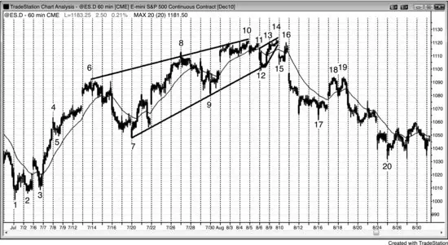

As shown in Figure 5.1, the 60 minute Emini had a wedge reversal top and then
a smaller wedge pullback to a lower high or double top, followed by two legs
down to bar 20.
A wedge does not have to have a perfect shape to be effective. For example,
the trend channel line is a best fit line from the bar 6 high to the bar 10 high, and
the bar 8 second push up is above the line. After the market reversed down from
bar 10 to bar 12, it formed a wedge bear flag that also had an imperfect shape.
The three pushes up were the high of bar 11 on the open of the day and then bars

<!-- PDF page 187 -->

13 and 14. The high was slightly below the bar 10 high. It does not matter if you
call this a double top or a lower high. What matters is that you see the large three
pushes up and then the reversal down.
This is also a spike and channel bull trend where there was a sharp spike up to
bar 4 and then a steep channel to bar 6. The move from the bar 3 low to bar 6
was in such a tight channel that it became a large spike. The bar 7 pullback that
led to the channel was tested by the bar 20 selloff. The bull channel had three
pushes and a wedge shape, which is common in spike and channel patterns.
FIGURE 5.2 First-Hour Wedge

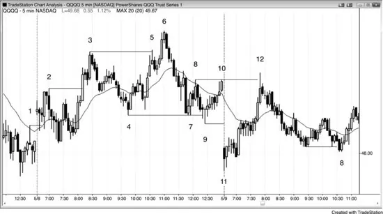

If a three-push move is too steep, it is usually not a good reversal pattern except
sometimes in the first hour when it can create an opening reversal. As shown in
Figure 5.2, the market rallied strongly from bar 11 to bar 12 in three pushes, and
although this was a steep channel, it was an acceptable parabolic wedge opening
reversal. Bar 12 broke above the bar 8 and bar 10 double top and was followed
by a bear inside bar. Bar 12 was both a failed breakout of the double top and a
double top with either of those bars. The rally was to a price level where sellers
came in several times yesterday, and it was reasonable to think they might return
again today around the top of the trading range from yesterday.
In trading range markets, fading breakouts is a good strategy. For the shorts,
enter on a stop at one tick below the failure bar near the top of the range, and for
longs, buy on a stop at one tick above the failed breakout bar near the low of the
range. Breaking out beyond any swing high or low, even if it was part of an
earlier and opposite trend, is a sign of strength and a potential trade setup. There
were many examples of failed breakouts and reversals over these two days,
including failed trend line and failed trend channel line breakouts.

<!-- PDF page 188 -->

Bars 2, 3, and 6 also represent a shrinking stairs pattern, which often leads to a
good reversal. You could also call it a wedge, because of the three pushes up
(bars 2 and 3 were the first two, and it was also the third push up from bar 4).
With shrinking stairs, the second breakout is smaller than the first, indicating
loss of momentum. Here, bar 3 was 19 cents above bar 2, but bar 6 was only 12
cents above bar 3. Whenever shrinking stairs are present, the trade becomes
more likely to be successful and usually signals an imminent two-legged
pullback in a strong trend.
Bars 4 and 7 formed a double bottom, and bar 9 was a failed breakout below
that double bottom. Bars 4 and 7 were two pushes down, and bar 9 was a third
push down and therefore a reversal up, which is a variant of a wedge bottom.
FIGURE 5.3 Shrinking Stairs

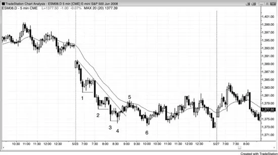

As shown in Figure 5.3, shrinking stairs, with each breakout extending less than
the prior one, signal waning momentum and increase the odds that a profitable
countertrend trade is near. After the bar 4 step, the move to bar 5 broke the trend
line, setting the stage for a test of the low and a likely two-legged rally (which
occurred after the bar 6 lower low and two-bar reversal). The loss of momentum
is a sign that the trend is weakening and becoming more two-sided, which
increases the chances that it will transition into a trading range, as it did here.
Bars 3 to 5 formed a small wedge bear flag. The first push up was followed by
the bar 4 lower low, which is a common wedge variant. The move up to bar 5
had the other two small pushes. Bar 4 was a successful final flag scalp, and the
pattern grew into the larger final flag that ended at bar 5 (a wedge), which is a
frequent occurrence.
When there is a strong breakout after the pullback from the first push down, it

<!-- PDF page 189 -->

is unclear whether there will be only two more pushes or the momentum is
strong enough to restart the count. For example, is bar 3 the third push down, or
should you have restarted the count on the strong move down to bar 2? In
hindsight, the answer is clear, but when you are trading, you cannot be certain.
The stronger the downward momentum is, the more likely it is that the most
traders will reset the count and the more likely it is that there will be a fourth
push. That fourth push down to bar 4 was really just the third push down in the
wedge bottom that began with the spike down to bar 2.
Once bar 6 fell below the bar 4 bottom of the wedge, the wedge bottom failed.
Bar 6 should be viewed like any other breakout. It was immediately followed by
a bull reversal bar, setting up a two-bar reversal and a failed breakout. Some
traders saw this buy setup as a lower low major trend reversal, while others saw
it as a lower low pullback from the breakout above the bar 4 wedge bottom. It is
also a shrinking stairs buy setup and a failed breakout below a trading range.
Finally, it is a small final flag reversal (there was a two-bar bear flag before bar
6). All of these are reasonable reasons for traders to consider buying above the
bull bar that followed bar 6.
FIGURE 5.4 Wedge Lower High

The daily SPY topped in March 2000 and then there was a three-push rally to the
bar 8 lower high, as shown in Figure 5.4. Bar 8 also formed a double top bear
flag with bar 2 (it slightly exceeded the bar 2 high). Bar 8 did not quite reach the
dashed bear trend channel line. This wedge bear flag was followed by a huge
bull trend. At the time that it formed, it was unclear whether a trend reversal was
taking place, but following the three pushes up to bar 1, the market was likely to
have at least two pushes down. The move down to bar 3 was the first, and the

<!-- PDF page 190 -->

rally to bar 8 was therefore the pullback, setting up the selloff to at least one
more leg down. Although most trading ranges after bull trends are simply bull
flags on higher time frame charts, most trend reversals come from trading
ranges. The market usually has to transition into a two-sided market before it
changes direction. As the market began to fall from bar 8, it was more likely to
find support around the bar 3 low at the bottom of the developing trading range.
However, the leg to below bar 3 was so steep that it was clear that there were not
many buyers and that the market had to go lower to find traders willing to buy.
Strong bulls did not appear until the double bottom pullback and higher low
major trend reversal in early 2003.
FIGURE 5.5 Wedge Lower High in the Dow

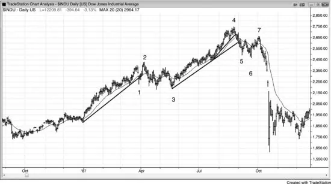

A wedge bear flag lower high in the daily Dow Jones Industrial Average
following the break below the bull trend line led to the 1987 crash, as shown in
Figure 5.5. The move down to bar 6 was strong and broke well below the trend
line and the moving average. Some traders saw the first push up of the wedge
bear flag as the rally after bar 5, and the second and third pushes up as any two
of the three pushes up to bar 7. Others saw bar 7 as a two-legged lower high
major trend reversal and therefore a low 2 short setup, with the first leg up being
the rally after bar 5. Still others saw the three small pushes up to bar 7 as a small
channel that followed the small spike up from bar 6. Most traders saw all of
these factors and attached a different significance to each.
Bar 1 was the first push down of a wedge bull flag. There were two more
pushes down and then a small breakout, and this was followed by a higher low
breakout pullback to bar 3. Some traders saw bar 3 as a double bottom bull flag
with the bottom of the wedge bull flag. Many wedge bull flags are head and

<!-- PDF page 191 -->

shoulders tops that fail, as was the case here.
The rally up before the bar 1 selloff had four pushes up and was an example of
how three pushes alone do not provide a reversal setup. When the three pushes
are in a tight bull channel, it is more likely that there will be a fourth or fifth
push up than a reversal. The channel up to bar 4 had three pushes in the final
segment and again was in a tight bull channel. When the channel is tight, bears
should not short the reversal down from the third push up. They should wait to
see how strong the bear breakout is.
Bar 1 was a strong bear spike, and many traders then shorted the higher high
at bar 2, which they saw as a higher high pullback from the bear breakout down
to bar 1. Bar 1 broke the bull trend line, so traders were looking to short a higher
high or lower high test of the bull high.
The bar 5 breakout of the bull channel was strong enough to clearly break the
bull trend line, so traders were looking to short the breakout pullback. It was a
lower high at bar 7, which formed a double top with the small rally after bar 5.
Most trading ranges in bull trends become bull flags and are just pullbacks on
higher time frame charts. Although the market did not have to reverse up from
bar 3, that was the most likely outcome, since bar 3 was at the bottom of a
trading range in a bull trend. The market could have continued to fall from the
lower high major trend reversal that formed after bar 2 (there was a double top
bear flag and lower high), but most major trend reversals are followed by trading
ranges and not actual reversals into opposite trends. This entire setup was similar
to that at bar 7, which was followed by a big bear trend.
FIGURE 5.6 Reversal Just Shy of Trend Channel Line

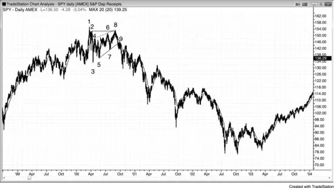

When there is urgency on the part of the bears, they will short aggressively just

<!-- PDF page 192 -->

below the trend channel line. They are afraid that the market will not get above
the line and they don’t want to risk missing the selloff. In Figure 5.6, bars 3, 4,
and 5 formed a wedge top, but bar 5 did not overshoot the trend channel line.
Because this was a wedge reversal setup, it was better to wait for a second
signal, like a lower high. Bar 5 and the bar after it formed a small bear spike. Bar
6 was a second entry on the failed high 2, and bar 6 was the start of a larger,
three-bar bear spike. After a one-bar pullback, there was a five-bar bear spike
and a collapse into a strong bear trend. Since the channel up from bar 2 had large
swings and therefore had a lot of two-sided trading, this spike and channel bull
was not a strong trend. The spike was the low of the day up to bar 1. When there
is significant trading range behavior, aggressive traders could short the first
entry, which was the two-bar reversal at bar 5. Incidentally, the bar 1 high at the
top of the wedge was a micro wedge top, and the selloff to bar 2 was a double
bottom bull flag with the bottom of the wedge, which was the start of the wedgeshaped channel. Bar 2 was also a test of the breakout above the first bar of the
day.
Bars 7, 8, and 9 created a three-push long setup with an entry above the bar 9
bull reversal bar, even though the close was midrange. The day was clearly not a
trend day, so a weaker reversal bar was reasonable. This pattern had diverging
lines, although it was not an expanding triangle since the high after bar 8 was
below the high after bar 7. Bar 9 did not overshoot the trend channel line, but it
was still a good long setup on a trading range day. If you were concerned that it
was risky after the strong selloff down to bar 7, you could have waited for a
higher low before going long. The outside up bar three bars later was a higher
low, but when entering on outside bars, you have to be fast because they often
reverse up quickly.
The bar before bar 9 was a big bear trend bar and therefore a breakout attempt.
However, there was no follow-through selling on the next bar. Instead, it was a
small bull bar and therefore a buy setup for a failed breakout. Even though it fell
below the bar 8 low, the rally that preceded it had five or six consecutive bull
bodies and therefore was a reasonably strong bull breakout attempt. The selloff
was simply a brief, sharp pullback from that bull breakout. A breakout pullback
sometimes forms a lower low, as it did here. Never be frightened by a single big
bear trend bar. Always view every trend bar as a breakout, and realize that most
breakout attempts fail.
FIGURE 5.7 Parabolic Wedge

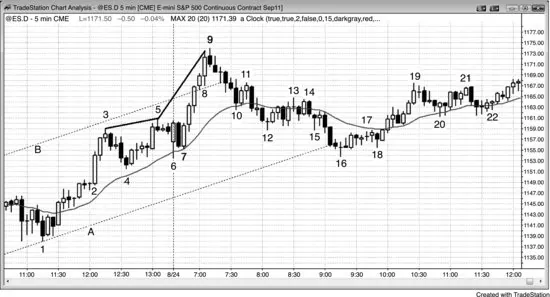

<!-- PDF page 193 -->

As shown in Figure 5.7, the Emini reversed down from the bar 5 higher high and
formed a trading range, but the market broke out strongly from the range and
above the line B top of the bull channel. Remember, every reversal is simply a
failed breakout of something. It then reversed down at bar 9, which was the third
push up. The slope of the wedge increased and was therefore parabolic (the slope
of the trend channel line from bar 5 to bar 9 was steeper than the slope of the line
from bar 3 to bar 5). As with any wedge top, two pushes down was likely.
The strong rally to bar 9 broke above the bull channel (dashed line), but then
reversed back into the channel on the selloff to bar 10. Whenever there is a
breakout above a bull channel and then a strong reversal back into the channel,
there is about a 50 percent chance that the bear swing will continue and break
below the bottom of the bull channel, as it did here. When a breakout is going to
fail, it usually does so within about five bars of breaking above the channel, as it
did here. The bears bought back their shorts and aggressive bulls went long
around bar 16, which formed a double bottom with the bar 6 low of the day, and
was the first reversal after reaching the target (a poke below the channel).
The bar before bar 8 had a smaller body than the bar before it, which meant
that the momentum was waning. Bar 8 had a big body. What did this mean? Bar
8 was an attempt to accelerate the trend again after a pause. Many traders
interpreted the large size of bar 8 as indicating climactic behavior, with the pause
perhaps being the final flag in the rally, before a two-legged pullback. Traders
sold the close of bar 8, above its high, and especially the close of the bar 9 and
below its low, because the bear close indicated that the sellers were getting
strong. Bulls sold to take profits on their longs and some bears shorted for a
scalp, expecting a relatively large (maybe five to 10 bars) pullback after the

<!-- PDF page 194 -->

small buy climax (the small final flag). Other bears shorted for a swing down,
based on the parabolic wedge.
Bar 16 was the bottom of a second leg down, where bar 8 was the first. This
would be an obvious high 2 pullback on a higher time frame chart. It was also a
double bottom test of the low of the day, which occurred at bar 6. The bears were
hoping for a reversal day, but the bulls came in and overwhelmed the bears. The
rally into the close tested the top of the very strong bull spike that ended at bar 9.
Although the rally was not strong and the selloff to bar 8 was deep, the day was
a bull trend day on the daily chart.
FIGURE 5.8 Bull and Bear Parabolic Wedges

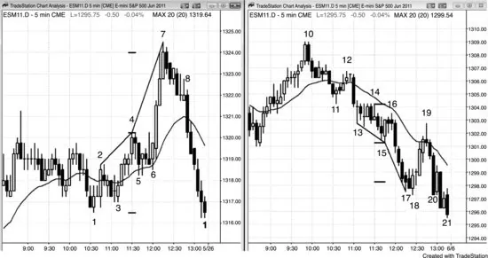

As shown in Figure 5.8, the chart on the left was in a trading range and triggered
a low 2 short below bar 4. Most traders would not have shorted this weak setup,
because bar 4 was a doji bar and it followed six consecutive bars without a bear
body. Bar 6 formed a high 2 buy setup (also a breakout pullback buy setup from
the high 1 and failed low 2 that followed bar 5), which led to a strong bull
breakout. A rally always reaches some resistance area, like a measured move or
a trend line, where traders will take partial or full profits, and aggressive bears
will short for a scalp down. This rally overshot a measured move target by a
couple of ticks, but there were probably other targets in the area as well. Both the
bulls and the bears expected only a pullback, and both planned to buy when the
pullback ended (which would always be at a support level, which may not be
obvious). The reason moves end at targets is that most trades are being done by
computers, and their algorithms are based on math and logic. They only buy at
support and sell at resistance. These potential levels are usually visible to
experienced traders.

<!-- PDF page 195 -->

The trend channel line from bar 4 to bar 7 was steeper than the one from bar 2
to bar 4, which means that the move up was parabolic. The bar before bar 7 had
a big tail, which usually means that traders who bought the close of that bar were
looking for just a scalp up and then a pullback. The high of bar 7 was a second
push up. The next bar was a bear inside bar and the signal bar for the short. With
that much strength after the failed low 2 at bar 4, most traders correctly assumed
that there would be a second push up, which happens in over 60 percent of the
cases. The market pulled back for six bars in a bull flag (here, a bear micro
channel), but instead of breaking out to the upside, the flag broke to the
downside on the bar after bar 8. This bull flag was then the final flag of the rally,
and its downside breakout was a final flag reversal, even though the flag never
had an upside breakout. Astute traders were aware of this possibility and shorted
below the bear bar that followed bar 7, and on the breakout below bar 8. The
traders who took the first entry knew that it had only about a 40 percent chance
of success, but they were looking for a reversal down and a reward that was at
least twice the size of their risk, and therefore had a positive trader’s equation.
The traders who shorted on the downside breakout, either as the bar was forming
or on its close, or on the close of any of the following bars, had proof that the
market was going down, and therefore their shorts had at least a 60 percent
chance of success (for them, they wanted a reward that was at least as large as
their risk). They traded off a smaller profit for a higher probability, and their
trader’s equation was also positive.
The chart on the right is a parabolic wedge bottom. Bar 15 was a strong bull
reversal bar at a double bottom, and a buy setup for a reversal up from the low 2
final flag that broke out below bar 14. Bar 14 can be viewed as a second entry
low 2 short, a breakout pullback from the low 2 short that triggered on the prior
bar, or as a triangle short (the three pushes up were the high of the doji that
formed two bars after bar 13, the bull inside bar that followed, and the tail at the
top of bar 14). The bears saw bar 16 as a pullback from the breakout of the bear
triangle. Both bulls and bears sold below bar 16, the bull entry bar after bar 15,
and the bar 15 buy signal bar. The bulls were exiting their longs and the bears
were initiating shorts. When bulls get stopped out of a bull reversal up from a
double bottom, they often expect a breakout and measured move, and don’t look
to buy again for at least a couple of bars. This allowed the market to fall quickly.
Bar 17 had a tail on the bottom, which alerted traders that the market might
have only one more push down before forming a pullback. It also had a close in
the middle, which made it a reversal bar, although weak. This was the first
attempt to reverse up from a spike, which is a type of micro channel, and first
attempts to reverse usually fail. There were more sellers above bar 17 than

<!-- PDF page 196 -->

buyers, as expected. Scalpers shorted the close of bar 17, hoping for one more
small push down before a pullback began. Because only a scalp down was likely,
shorting the low 1 below the next bar was risky. The market turned up in a small
double bottom at bar 18 (bar 17 was the first push down). The low of bar 18 was
four ticks below the close of bar 17, so most of those shorts from the close of
that bar were trapped and bought back their shorts above bar 18. Bar 18 had a
strong bull body and most traders expected a reversal up to around the moving
average and maybe to the high of bar 15. Bar 15 was a reasonable buy signal, so
some bulls scaled in lower and planned to exit their entire position at their first
entry, which was the high of bar 15. The bulls thought that the rally could reach
the bar 16 or bar 14 highs. The bar 18 low was at one or more support levels,
although none are shown here.
The move down to bar 18 went beyond a reasonable measured move target,
which meant that the computers were looking at something else. Most measured
move targets do not lead to reversals, but it is still helpful to draw them, because
all reversals happen at support and resistance levels. When a reversal happens at
one of these levels, and the level is especially obvious, it is a good place for
trend traders to take profits and often a reasonable place for countertrend traders
to take reversal trades. The final low of the day was also at a support level,
whether or not it was obvious. The low of bar 21 was one tick below the earlier
low of the day and the close of bar 21 was exactly at the open of the day.
Because the move up was a climactic reversal, it had about a 60 percent
chance of having at least two legs up and lasting 10 bars. This means that it had
a 40 percent chance of not reaching those goals.
Since bar 18 was a reasonably strong buy signal, most traders entered above
its high. This left fewer traders to buy as the market went up. The tail on the top
of bar 18 and the doji bar that followed were signs that the market lacked
urgency for the bulls, which means that the buy setup was not as strong as it
could have been. When the bulls fail to create signs of strength, traders are
quicker to take profits. Bar 19 reached 14 ticks above the bar 18 high and had a
bear close. This means that many bulls took profits at exactly three points.
Instead of finding new buyers as the market rallied, it found profit takers at the
moving average, and two ticks below the low 2 short that was triggered two bars
after bar 13. The bears saw this as a breakout test that missed the breakeven
stops by one tick, and therefore a sign that the bears were aggressively defending
their stops. Although the odds still favored a second leg up after a pullback to a
higher low, most bulls exited their longs during and below bar 19, and were only
looking to buy again on a stop above the high of a bar in the pullback. The

<!-- PDF page 197 -->

higher low never formed and the market fell below the bar 17 bear spike low and
closed on the low of the day. The bulls did not get as much profit as they had
hoped to make when they took their trade, but this often happens and is not a
surprise. Traders always have a plan when they enter a trade, but if the premise
changes, they change their plan. Many trades end up with smaller profits or
losses than what traders expected when they entered. Good traders just take what
the market gives them and then move on to the next trade.
Traders were especially wary of the possibility of a selloff into the close of the
day, because the market had a bear breakout on the daily chart two days earlier
after rallying for two years. When a market might be reversing down on the
daily chart, many traders look for a selloff into the close (just like they look for a
rally into the close in a bull trend). This made traders unwilling to buy on limit
orders as the market traded down below bar 19. They were cautious and only
wanted to buy after a reversal bar formed. With so few traders willing to buy on
limit orders as the market was selling off into the close on a bear day, the higher
low signal bar never formed.
FIGURE 5.9 Failed Wedge

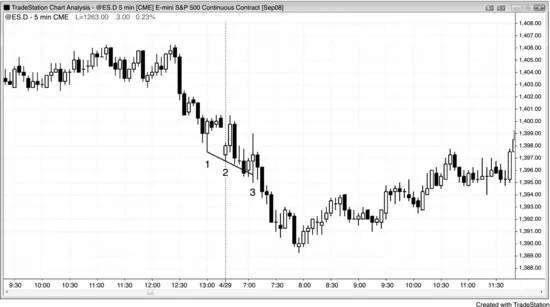

When there is a bottom setup and the market goes sideways instead of up, the
market is accepting the lower prices instead of rejecting them and therefore
might be in the middle of the move instead of at the bottom. A failed wedge
often falls for a measured move.
As shown in Figure 5.9, the market tried to form a wedge reversal, but bar 3
was the fourth consecutive bar that mostly overlapped the prior bar. This was
acceptance of the lower price and not rejection, so it made a reversal up unlikely.
Also, the channel down was steep, and when this is the case, it is usually safer to

<!-- PDF page 198 -->

wait for a higher low before going long. The bar 3 entry bar was an outside up
bar that trapped bulls who overlooked the steepness of the bear trend channel
line and only saw the three pushes. Patient traders would not have bought this
wedge, because there was no higher low.
When a wedge fails, the move will usually be an approximate measured move
equal to the height of the wedge. Here, the move down below bar 3 was about
the same number of points as there were from the top of the wedge just after bar
1 to the bottom at the low of bar 3.
FIGURE 5.10 Wedge That Is Too Tight

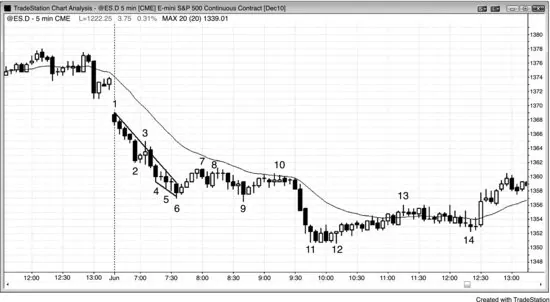

A wedge bottom that is in a tight channel in a bear trend and without prior bull
strength is not a buy setup. As shown in Figure 5.10, the market was in a bear
trend from the open on a gap down day. Overly eager bulls would have
rationalized buying the bar 6 wedge reversal by convincing themselves that it
was the end of a two-legged move down and there was a trend line break at bar
3. However, bar 3 was a failed trend line break and did not represent the bulls
taking control of the market with any momentum. The bar 6 wedge long entry
above the inside bar was a successful scalp, but not a setup that would likely turn
into anything more. The move down to bar 6 did not have a meaningful trend
line break or upward momentum in the middle and therefore looked more like a
single leg down made up of two smaller legs in a tight bear channel. There was
likely to be a second leg down after a break of the bear trend line. Some traders
saw bar 6 as the end of a wedge with its first push down as bar 2, its second push
down as bar 4, and the final push down as bar 6. It was also a five-bar-long
micro wedge formed by bars 4, 5, and 6. Since a trend channel line can be drawn
across the bottoms of the bars, this small pattern can be thought of as a little

<!-- PDF page 199 -->

wedge and therefore should have behaved like one and should have had a
correction that reached to about the start of the wedge at the top of the bar that
created the first push down.
There was then a low 2 short at bar 8. This little rally did break a trend line, so
buyers could look for a scalp up on a failed new low, which occurred at bar 9.
However, in the absence of a strong bull reversal bar, this long was likely to fail,
which it did at the bar 10 low 2 short, and the market then broke down into the
second bear leg that ended at the bar 12 final flag one-tick false breakout. The
bar 10 short was a double top with bar 8 and a 20 gap bar short setup, and it
resulted in a trend-resumption bear trend down to the low of the day.
FIGURE 5.11 Wedge but Tight Channel

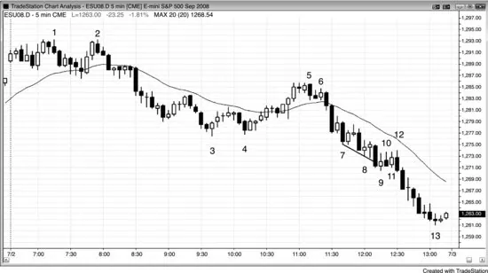

A wedge bottom is not a buy signal when it is in a tight bear channel. As shown
in Figure 5.11, bar 9 was a bear trend channel line overshoot reversal and a third
push down (a wedge). However, it was not a strong bull signal bar because it
was in a tight bear channel, it overlapped the prior bar too much, and it had a
weak close (small bull body). There was no clear rejection of excessive selling,
and you should never buy the first breakout attempt of a tight bear channel since
most fail before going far enough to make a scalp. At best, you should wait for a
second entry before buying. Strong traders would short at and above the high of
the prior bar in a bear channel, and they would not be looking to buy.
Bar 10 was a one-tick failure for any traders who bought the wedge. It was the
third sideways bar, so smart traders were now seeing a trading range in a bear
trend, which is usually a continuation pattern. Overlapping bars mean that the
market is accepting these lower prices, not rejecting them. You need a sign of
rejection before you buy in a bear trend. Basing a trade on a belief that the

<!-- PDF page 200 -->

market is overdue for a correction is a losing approach to trading. Trends can go
much further than most traders could ever imagine.
A trader could have shorted the low 1 at bar 11, but this was a trading range
and smart traders would not have shorted at its low without a stronger bull trap.
It was a second one-tick failed breakout. Also, a wedge usually makes two
attempts to rally (two legs up) so they would have shorted only if the wedge
failed (i.e., fell below the bar 9 low), or if the second attempt to rally failed.
Bar 12 was a third one-tick failed breakout in a row, but this time it followed
two legs up (bars 9 and 11) and was a low 2 short. This was the first trade that
smart traders would have taken, because it was a low 2 in a bear flag. What
made it especially good was that there were two failed attempts to make the
wedge reverse upward (bars 10 and 12) and both failed. These represented the
two legs up from the wedge and they were clearly weak. Also, it is very rare to
have three one-tick failures in a row, so it was likely that the next move would
run.
A trader could also have waited to short below the low of bar 9, because it was
only then that the wedge definitively failed. The heavy volume on the breakout
(14,000 contracts on the 1 minute chart) confirmed that many smart traders
waited until that point to short. A failed wedge bottom often falls for about a
measured move, as it did here.
To buy, you first needed a trend line break and it was better to have a reversal
bar. Since bar 9 was a weak reversal bar and you would be more inclined to buy
after a trend channel line overshoot and reversal, you could have waited for a
second long entry. Bar 12 was a second entry, but it was a purchase at the top of
a four-bar trading range, and you should never buy above a bear flag in a bear
trend. Once that weak second entry failed, the bears took control. That was the
trade that you needed to take instead of spending too much energy convincing
yourself that the long setups were adequate.
Traders would have recognized this day as a trending trading range day
shortly after the breakout from the double top at bar 2. It is usually safe to trade
in both directions on this type of bear trend day, but the longs are countertrend so
the setups must be strong, like at bar 3 and two bars after bar 4 (second-entry
long). The move down to bar 7 was a breakout, but instead of forming much of a
third trading range, the market formed a tight bear channel and then broke to the
downside again. This became a bear channel down from the spike down to bar 7.
Other traders saw the spike as the move from bar 2 to bar 3 and the channel as
the move down from bar 5. It does not matter as long as you recognize the day as
a bear trend and work hard to stay short.

<!-- PDF page 201 -->

Incidentally, the three doji bars that formed the swing low before bar 2 created
a micro wedge.
FIGURE 5.12 Successive One-Tick Breakouts

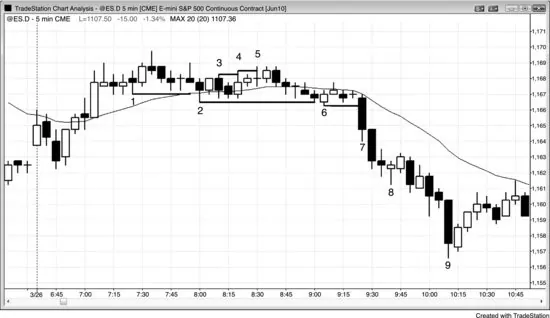

One-tick breakouts can be important, especially if there are two in succession,
because that creates a three-push pattern. In Figure 5.12, bar 4 was one tick
above bar 3, and bar 5 was 1 tick above bar 4. If there was then a pullback or
some sideways trading and then the market moved above bar 5, there would
likely have been an upside breakout and the micro wedge would have failed to
reverse the market.
Bar 2 was a couple of ticks below bar 1, and bar 6 was one tick below bar 2.
After several more bars, bar 7 fell below the bar 6 low and led to a downside
breakout. When the market breaks out of these micro three-push patterns, there
is usually at least a measured move, using the top to the bottom of the trading
range for the measurement. Here, the breakout went much further.
Bar 8 was a micro wedge bottom, setting up a one-bar bear flag. It was a sign
that the market was pausing; it was not a reversal pattern in a strong bear trend.
