# Chapter 9: Failures

<!-- Source PDF pages 238–264 -->

<!-- PDF page 238 -->

CHAPTER 9
Failures
A failure is any trade that does not reach its goal, resulting in either a smaller
profit or, more commonly, a loss. For a scalper, the goal is a scalper’s profit, but
if traders were expecting more and the market failed to meet their expectations,
even if it provided a scalper’s profit, it is still a failure. Every failed bull setup is
a sign of weakness by the bulls and strength by the bears and every failed sell
setup is a sign of weakness by the bears and strength by the bulls. Since the most
common good setups have about a 60 percent success rate, they have about a 40
percent failure rate. When a setup fails, it often creates an excellent setup for a
trade in the opposite direction. The traders who were just forced out will be
hesitant to reenter in the same direction, making the market one-sided. In
addition, as they exit with their losses, they drive the market even further in the
opposite direction.
This chapter discusses some of the more common occurrences of patterns that
fail and reverse enough for a scalp. When the pattern is large enough and the
context is right, they sometimes can even lead to a major trend reversal. It is
critical to understand that every pattern fails some of the time, and traders should
accept that as a normal occurrence. Look at a failure as a potential opportunity,
because, as mentioned, it will often set up a profitable trade in the opposite
direction. At other times the failure will result in a second signal in the direction
of the original setup.
Here are some of the common failures that often lead to trades in the opposite
direction:
Failed high 1, high 2, low 1, or low 2.
Failed breakout of anything, like a swing high or low, a trend line, or a
trend channel line.
Failure to break through a magnet, like a measured move target, a prior
swing high or low, a trend line, or a trend channel line.
Failed final flag (the reversal attempt fails and sets up a breakout pullback).
Failed wedge.
Failed signal bar or entry bar.
Failed one-tick breakout.

<!-- PDF page 239 -->

Failed reversal, like a failed double bottom or top or a failed head and
shoulders pattern.
Failure to reach a profit target, like a five-, nine-, or 17-tick failure in the
Eminis or an 11, 51, 99, or 101 cent failure in a stock.
Some failures are a sign of a strong trend and set up a with-trend trade:
Failure to fall below the low of the prior bar in a strong bull trend or to rally
above the high of the prior bar in a strong bear trend. This indicates urgency
and a strong trend.
Failure of a pullback to reach the moving average. This indicates urgency
and a strong trend.
Failure to reach a magnet, like a measured move target, a prior swing high
or low, a trend line, or a trend channel line. This often leads to a pullback
and then another attempt to reach the magnet.
If a trade makes a scalper’s profit (and therefore the trader exited some or all
of the position) and then comes back and takes out the original signal or entry
bar stops, there is much less fuel left in the market to drive the market in this
new, opposite direction because there are far fewer traders who are trapped in the
trade (they already exited with profits). Also, many of the scalpers would exit
the balance of their positions at breakeven after taking partial profits, so their
stops would be tighter than the original ones beyond the entry or signal bars.
Although a minor reversal might just be a reversal in a trading range that is
good for only a scalp, it can sometimes turn into or be a part of a major reversal
of a trend. The single most reliable failure is a flag in a trend. As a flag is
forming, countertrend traders are hoping for a trend reversal, which is a lowprobability bet because markets have inertia and trends resist reversal attempts.
For example, if there is a strong bull trend and then a reversal setup, some
traders will go short. However, if the trade instead goes sideways to down to the
moving average and sets up a high 2 there with a bull signal bar, that bear
reversal attempt will likely fail. This is a great buy signal because you are
entering in the direction of a larger trend and it is reasonable to expect at least a
test of the prior extreme of the trend. Any reversal pattern, including major
reversal patterns, can fail and result in the resumption of a trend.
When traders enter a trade, many place a protective stop at one tick beyond
the signal bar. After the entry bar closes, if it is strong, many move it to one tick
beyond the entry bar. How do you know this? By simply looking at charts. Look
at any chart and find possible signal and entry bars and see what happens when a

<!-- PDF page 240 -->

bar reverses beyond them. So much of the time, the reversal will be in the form
of a strong trend bar, and most of the time the move will be enough for at least a
scalper’s profit. This is because once traders get flushed out of a new position
with a loss, they become more cautious and want more price action before
reentering in the same direction. This leaves the market in the hands of just one
side, so the move is usually fast and big enough for a scalp.
Why is a one-tick failed breakout so common, especially in the Eminis? With
stocks, failures often come on 1 to 10 cent breakouts, depending on the price of
the stock and the personality of the stock. Every stock has distinct characteristics
in its trading, presumably because many of the same people trade it every day, so
a small group of traders trading sufficient volume can move the market enough
to create recurring patterns. If the market is sideways to down in a weak bull
trend, many traders will believe that if the current bar extends one tick above the
prior bar, traders will buy there on a stop. Most smart traders will expect this.
However, if enough other traders with enough volume feel that the correction
has not extended deep enough or long enough (for example, if they believe that a
two-legged move is likely), those traders might actually go short at the high or at
one tick above the prior bar. If their volume overwhelms the new longs and not
enough new longs come to the rescue, the market will likely trade down for a
tick or two.
At this point, the new longs are feeling nervous. If their entry was at such a
great price, why didn’t more buyers come in? Also, now that the market is even
a tick or two cheaper, this should look like even better value to traders looking to
get long. This should quickly drive the price up, but the longer the market stays
down even just a couple of ticks, the more new bulls will become concerned that
they may be wrong. Some will start selling out at the market, adding to the
offers, and others will place sell exit orders at one or two ticks lower, maybe
basing these orders on a 1 or 3 minute chart, with the order one tick below the
most recent bar. Once these are hit, these new buyers will also become sellers,
pushing the price further down. Also, the original shorts will sense that the new
longs are trapped, and many will increase their short positions. As price falls
three, four, or five ticks, the stopped-out buyers will switch from looking to buy
to waiting for more price action to unfold. In the absence of buyers, the price
will continue to fall in search of enough bids to satisfy the sellers. At some point,
sellers will begin to cover and take profits, slowing the price fall, and buyers will
again begin to buy. Once the buying pressure overtakes the selling pressure, the
price will then go up again.
A one-tick failed breakout on the 5 minute chart when it occurs in a trading

<!-- PDF page 241 -->

range is often also a one-tick failed breakout on a higher time frame, like a 15 or
60 minute chart. If that is the case, why doesn’t the 60 minute chart have a lot of
one-tick failed breakouts? That is because many of the one-tick failed breakouts
pull back for many bars on the 5 minute chart and then break out again. The
result is that even though there was a one-tick failed breakout of the 60 minute
chart as the 60 minute bar was forming, by the time the bar closed, the breakout
extended to more than one tick.
A one-tick failure is a common source of losses for new traders. They will see
what they believe is a good setup—for example, a buy—and they confidently
place a buy stop order at one tick above the high of the prior bar. Maybe there is
a two-bar reversal just above the moving average, but it overlaps the prior two
bars completely and the long entry is at the top of the small trading range.
Novice traders will see the strong bull trend bar and buy, but experienced traders
know that this type of two-bar reversal is usually a bull trap, and they are likely
shorting where the novice traders are buying. As expected, the market ticks up
and hits the entry buy stops of the novices, making them long. However, the very
next tick is one tick lower, then two, then three, and within 30 seconds they lose
two points as they watch their protective stops get hit. They wonder how anyone
could be selling exactly where they were buying. It was such a great setup!
These traps are common. Another example is a novice buying in a bear trend
before there was a sign of bullish strength, like a prior surge above a bear trend
line, or traders buying above a huge doji with a tiny body at the top of barbwire
or a bear flag that they misread as a reversal, overcome by their eagerness to get
in early in what they perceive as an overdone bear trend.
Another common situation is when there is a huge trend bar with a tiny tail or
no tail. If it is a bull trend bar, lots of traders will put their protective stops at one
tick below the bar. It is common for the market to work its way down over the
next five to 10 bars, hit the stops and trap traders out, and then reverse back up
in the direction of the trend bar.
What that novice trader doesn’t realize is that lots of big traders view these as
great short setups and they are happy to short, knowing that only weak hands
would be buying, and as they are flushed out, they will help drive the market
down. A one-tick failure is a reliable sign that the market is going the other way,
so look for setups that allow you to enter. All of the preceding is true for down
markets as well, and all of the one-tick failures can sometimes be two ticks, and
even five to 10 ticks in a $200 stock.
Breakout tests often test the entry price to the exact tick, trapping out weak
hands who will then have to chase the market and reenter at a much worse price.

<!-- PDF page 242 -->

A breakout test may miss the breakeven stop by one tick and at other times it
will go beyond it for a couple of ticks, but in either case, if the market reverses
back into the direction of the trend, this failed attempt to reverse the market
beyond the original entry price is a reliable with-trend setup. For example, if
there is a strong buy setup above a bull reversal bar in the Emini and the market
trends up for 10 bars but then later sells off, look to see what happens when the
selloff gets near the high of that original bull signal bar. If there is a bar that
turns up at two ticks above the high of the signal bar, then it missed the
breakeven stops by a tick. The market failed to flush the bulls out. Traders will
then buy above this breakout test bar because they will see the failure to hit the
protective stops as a sign that the bulls were aggressively buying around the
original entry price, protecting their stops and making a statement that they are
strong.
Most days have a lot of trading range price action and offer many entries on
failed swing high and low breakouts. When the price goes above a prior swing
high and the momentum is not too strong, place an order to short the higher high
at one tick below the low of the prior bar on a stop. If the order is not filled by
the time the bar closes, move the order up to one tick below the low of the bar
that just closed. Continue to do this until the current leg gets so high and has so
much momentum that you need more price action before shorting. Wait for
another pullback that breaks at least a minor trend line and then look to short a
new swing high. You can also fade new swing highs and lows on trend days after
a minor trend line break and when there is a strong reversal bar.
Similarly, the first failed breakout below a prior swing low is a lower low buy
setup. Place an order to buy at one tick above the high of the prior bar on a stop.
If it is not filled, keep lowering the order to one tick above the high of the prior
bar, but if the market drops too far or too fast, start the process over; wait for a
small rally that breaks a minor trend line and then consider buying a failed
breakout to a new low.
In the Emini, a popular trade is a scalp for four ticks when the average daily
range is about 10 points. In a trend, there may be a series of successful scalps,
but when one hits the limit order and does not get filled, this five-tick failure is a
sign of a loss of momentum. These are also common on 1 and 3 minute charts.
Since a six-tick breakout is needed to make a four-tick scalp (one tick for the
stop entry, four ticks of profit, and usually one more tick to be sure the profit
target limit order is filled), a move that goes only five ticks and then reverses
often indicates that the trend traders have lost control and a pullback or reversal
is imminent. Since many traders also place limit orders to capture two-, three-, or

<!-- PDF page 243 -->

four-point profit targets, if the market reverses at one tick shy of these targets, it
is also a sign of weakness. For example, if the market makes a significant
intraday low and then rallies 17 ticks above the signal bar high, most traders
trying to exit on limit orders with four points of profit will not get filled unless
the market goes 18 ticks above the signal bar.
If instead the market hits 17 ticks and then the next bar trades below that bar,
the remaining longs who did not exit one tick early will now think about exiting,
and this often results in at least a downward scalp. Traders will assume that the
bulls were taking their profit at one tick early, which means that the longs were
not confident that the market would give them the full four points. This lack of
confidence can lead to profit taking by the longs and aggressive shorting by the
bears. Bulls could continue to rely on their trailing stops and hope that the
market soon fills their four-point limit orders, but most traders would not be
willing to risk having a 15-tick open profit turn into a two-or three-tick profit in
an attempt to win that extra tick. This is the same as scalping for a one-tick profit
while risking 10 or more ticks and is a losing strategy. Once the market hits 17
ticks and pulls back a few ticks, if traders’ profit-taking limit orders are not
filled, they would most likely lower their profit targets by a couple of ticks and
raise their trailing stops to one tick below the low of the prior bar. If neither
order is filled and the bar had a weak or bear close, they might just exit at the
market. Incidentally, if the market goes 16 ticks above the signal bar high, it has
about an 80 percent chance of reaching 17 or 18 ticks. This means that it is
usually unwise to exit after 16 ticks unless the market trades below the low of
the prior bar, especially if that bar is a short signal.
Most traders handle potential nine-tick failures in a similar way. If traders
bought the Emini and were trying to exit with a two-point profit, their limit
orders would be nine ticks above the high of the signal bar. The market usually
has to go one more tick to fill the order, which is 10 ticks above the signal bar
high. If the market hits the order but does not fill it and begins to trade down,
they have to decide whether to rely on their initial stop or a trailing stop, like one
tick below the low of the most recent bar with a decent-sized bull body. If their
limit order is exactly at a resistance level, like a prior swing high, and it does not
quickly break above, they might also quickly lower their limit order by a few
ticks. Once it hits nine ticks, they should never allow the trade to turn into a loss,
because they would then be risking eight or more ticks to make one tick, and this
has a terrible trader’s equation.
There are comparable failures in other markets that have many scalpers, like
the SPY and the QQQ. For both, a common profit target is 10 ticks, which

<!-- PDF page 244 -->

usually requires a 12-tick move beyond the signal bar. If the move reaches only
10 or 11 ticks (or even eight or nine) and then reverses, it usually leads to at least
a profitable scalp in the opposite direction, since the scalpers are trapped and
will get out on the reversal of the signal or entry bar. This type of failure is
common with stocks as well. For example, if a stock reliably reaches more than
a dollar on a scalp, but then falls just short on two attempts at the $1.00 target,
then this is often a good scalp in the opposite direction.
One of the most common and reliable failures is the first spike through the
trend line. Stock traders look for these all the time on daily charts, but it happens
on all time frames. For example, if AAPL is in a strong bull market and has a
bad earnings report, it might sell off 8 percent in one day and hit the moving
average on the daily chart. Instead of looking for shorts, experienced traders will
often buy on the close of that spike down or on the open of the next day. They
see this just like a shopper sees a sale at the mall. The stock just got marked
down 8 percent and the sale won’t last long, so they quickly buy it. They know
that most attempts to reverse fail and the first attempt almost always is followed
by a new high, so they buy it even though they are buying at the bottom of a
strong bear spike.
All patterns often fail, no matter how good they look. When they do, there
will be trapped traders who will have to exit with a loss, usually at one tick
beyond the entry or signal bars. This is an opportunity for smart traders to enter
for a low-risk scalp. Place your entry stop order at exactly the same place that
these trapped traders are placing their protective stops, and you will get in where
they will get out. They won’t be eager to enter again in their original direction,
which makes the market one-sided in your direction and should lead to at least a
scalp and usually a two-legged move.
FIGURE 9.1 Small False Breakouts

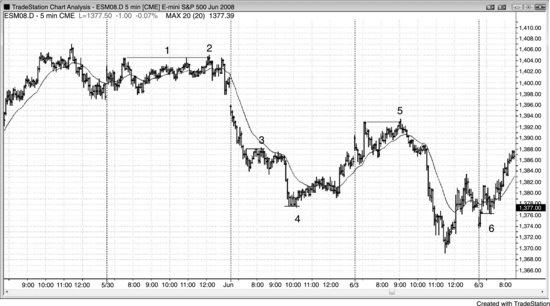

<!-- PDF page 245 -->

One-and two-tick false breakouts leading to reversals are common in the 5
minute Emini. Figure 9.1 presents six examples (the label for bar 1 is well above
the bar). Once the breakout traders enter on their stop and discover that the
market is pulling back by a tick or two instead of immediately continuing in their
direction, they start to place protective stops. Countertrend traders smell the
blood and will enter just where the trapped traders are taking their losses. Most
breakout attempts fail, especially when the market is in a trading range, and the
failures are often in the form of one-tick false breakouts. Experienced traders use
the breakouts to take profits or to trade in the opposite direction, expecting that
most breakouts in a trading range will fail. For example, if a trader bought near
the bottom of a trading range, he will likely be scalping for a test of the high of
the range and will often have a limit order to sell out of his long and take profits
at the top of the range. In a strong trend, they do the opposite. For example, if
the market is in a bull trend, traders instead will buy on a stop above the top of
the range, since they expect another leg up.
FIGURE 9.2 One-Tick Traps in the Emini

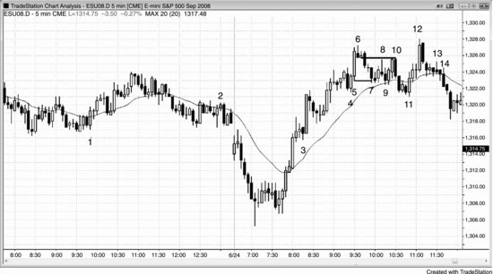

<!-- PDF page 246 -->

As shown in Figure 9.2, there were many examples of one-tick traps in these two
days in the Emini.
Bar 1 was a one-tick failed low 2 and became a breakout pullback entry for
the wedge bull flag that began at 8:55 a.m. PST.
Bar 2 was a one-tick failed high 2 in barbwire that trapped traders who
thought that they were being conservative by waiting to buy above the large
outside bar, only to be trapped buying at the top of a trading range below a flat
moving average. This became a double top bear flag.
Bar 3 was a one-tick failed reversal in a runaway bull trend where smart
traders were eagerly waiting for any pullback to buy. They were buying below
the low of the bar, exactly where weak bears were shorting the reversal down
from the breakout above the high of the open.
Bar 4 broke one tick below the small swing low of four bars earlier and set up
a high 2 long.
Bar 5 was a large bull trend bar, and there would therefore be stops at one tick
below its low. These were run by one tick on bar 7. The bulls were able to hold
the market above the bar 4 bottom of the bull spike.
Bar 9 went one tick lower, trapping traders into what they thought was a lower
high short, but actually was a sideways bull flag.
Bar 10 ran the breakeven protective stops for the bar 6 shorts by two ticks. It
set up a double top bear flag with bar 8.
Bar 14 was one of the most reliable one-tick failures—a failed high 2 in what
novice traders erroneously assumed to be a bull pullback. This was a perfect trap
and led to a strong down move (not shown). They missed noticing the trend line
break by the pullback to bar 11 and then the higher high test at bar 12. Also,

<!-- PDF page 247 -->

there were five bear trend bars and one doji down from the high and no trend
line break after the bar 13 high 1. This was a bear channel after a two-bar
reversal from a higher high, and therefore it was more likely that there would be
more shorts than buyers above the high 2 signal bar. Remember, a high 2 alone is
not a buy signal. It is a buy signal at the top of a bull trend, but here the bull
trend was over. The market was now either in a trading range or in a bear trend.
A high 2 is also a buy signal in a trading range, but only at the bottom of the
range, not this close to the top.
FIGURE 9.3 Breakouts beyond Signal and Entry Bar Protective Stops

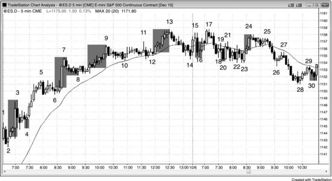

Look at what happened in Figure 9.3 as the market broke through the horizontal
lines, which were one tick beyond signal and entry bars and were likely places
where traders would place their protective stops. Most of the time, there was a
trend bar and the move was big enough for a scalper to make a profit. Many of
the failures on this chart were for weak setups that smart price action traders
would not have taken. However, enough traders took them so that they moved
the market in the opposite direction as they were forced out with a loss. For
example, traders who went long off the bar 4 reversal bar would have had their
stops below either the entry bar or the signal bar. Both were run by the big bar 5
bear trend bar, and smart shorts who had their entry stops at those exact locations
made at least a scalper’s profit.
As a corollary, if the extreme of the bar is tested but not exceeded, then the
stops are tested but not hit, and the trade will often be profitable. If it is a
protective stop on a long entry that is missed by one tick, the test effectively
forms a double bottom bull flag, with the first bottom being the bottom of the
signal or entry bar and the second one being the bar that came back to that level

<!-- PDF page 248 -->

but failed to reach the protective stops.
FIGURE 9.4 Failed Profit Targets

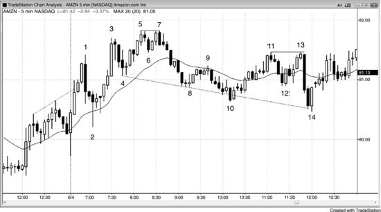

When the market hits a profit-taking limit order price and then pulls back, most
traders would not have their limit orders filled. When the market then stalls or
pulls back for a few ticks, many of these traders will exit at the market because
they do not want to risk giving back any more of their open profit. This adds fuel
to any correction and is often a sign that the market is trying to reverse.
As shown in Figure 9.4, the market rallied for 21 ticks above bar 2 and then
reversed down. Some traders who bought one tick above the bar 2 signal bar had
limit orders to exit their longs with five points of profit, 21 ticks above the signal
bar high, but most would not have been filled unless the market went one tick
higher. Instead, the market reversed, and many of those traders quickly got out of
the market as they tried to salvage as much profit as they could before waiting to
see if the market would go all the way back to their entry price.
Bar 7 was a 17-tick failure for bulls who had bought one tick above the bar 6
buy signal bar. Many traders who were trying to make a four-point profit saw the
market reach their limit order at 17 ticks above the signal bar high and exited
once the market fell below the low of that bar. Traders who correctly believed
that the trend was strong, and were, instead, swinging their longs and not trying
to exit at four points, would rely on a breakeven stop. Once the market moved
above the bar 7 high, they would then trail their stops to one tick below bar 8,
the most recent higher low.
Bars 4, 8, 20, and 30 were examples of five-tick failures on short trades. Most
shorts needed the market to fall six ticks below the bottom of the signal bar for
their profit-taking limit order for a four-tick scalp to get filled. Some traders

<!-- PDF page 249 -->

would have had their orders filled, but most would not have been filled.
Bar 9 was a 13-tick failure for longs who bought above bar 8, hoping to make
a three-point profit.
Bars 16 and 24 were nine-tick failures for traders who tried to make two
points. They would not let those trades turn into a loss and would trail their
stops. For example, they would exit the bar 16 signal bar long at one tick below
the bar 17 low, or possibly on the bear close of bar 17. They might exit the long
from above the bar 23 buy signal at one tick below the bear bar that formed two
bars after bar 24.
FIGURE 9.5 Trading Range Breakouts Usually Fail

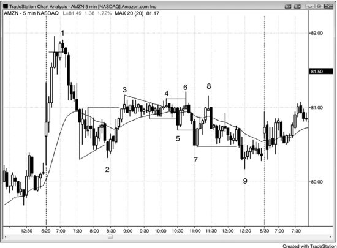

When there is strong two-sided trading, breakouts above swing highs and below
swing lows usually fail.
As shown in Figure 9.5, the rally to bar 1 was strong, but since opening
reversals are often sharp and it was a higher high (above the swing high near
yesterday’s close) that broke above a bull trend channel line, it was a reasonable
short.
The bar 2 pullback after the bar 1 swing high was deep, and the bars since the
open had been large with big tails. There was two-sided volatile trading and until
a bull trend clearly developed, traders should have assumed that both bulls and
bears were active. Since this had not proven itself yet to be a bull trend day, it
should have been traded as a trading range day.
Bar 3 was a higher high since it was a swing high that was above an earlier
swing high. The momentum up to bar 3 was too strong to consider a short
without a second entry or a strong reversal bar, but if a trader shorted, the move

<!-- PDF page 250 -->

down was 26 cents, so it could have been minimally profitable.
Bar 5 was a higher high and a reasonable short, especially since it had two
small legs (there was a bear trend bar in the middle that represented the end of
the first leg up from bar 4). The market dropped only 18 cents before going back
up. A nimble trader might have taken some off, but most would have just
scratched the trade with a 4 cent loss.
Bar 7 was part of this same up move so it was a second-entry (a low 2) short.
Bar 7 was a double top with bar 5 to the penny, and essentially a truncated threepush up pattern (bars 3, 5, and 7), so two down legs were likely.
Bar 10 was a lower low and the second leg down in a possible larger bull
trend. Its low was above the bar 2 low, so the market might still have been
forming large bull trending swings. Two legs down in a bull trend or sideways
market, especially two pushes below a flat moving average, are always a good
long.
Bar 11 was a higher high because it was above the bar 9 swing high, even
though bar 9 was part of the prior down leg. There would still have been traders
who would have traded there (there would have been stops on shorts, stops to
buy the breakout, and new shorts), because going above any prior swing high is
a sign of strength and a potential fade on a trading range day (look for breakouts
to fail and signs of strength to lack follow-through).
Bar 13 was one tick below bar 11 and was a double top bear flag and therefore
a short setup. It was two legs up from bar 10 and the second leg above a flat
moving average (bar 11 was the first).
Bar 14 was a lower low for both the swing lows at bars 10 and 12.
Incidentally, the longs from bars 10 and 14 were both failed overshoots of a
bear trend channel line drawn from bars 4 and 8. This increased the chances of
successful long trades. Both had two-bar reversal setups. Bar 10 was the bottom
of a wedge bull flag, and bar 14 was the bottom of an expanding triangle bull
flag.
FIGURE 9.6 Failed Breakouts in AMZN

<!-- PDF page 251 -->

Amazon (AMZN) had many large one-bar failed breakouts beyond swing highs
and lows on the 5 minute chart shown in Figure 9.6. After the climactic run-up
on the open and then the large reversal down, the bulls and the bears both
demonstrated strength and increased the odds that any move by one side would
be reversed by the other throughout the day. This made a trading range likely.
All of the labeled bars were failed breakouts. The tight trading range began after
bar 3, and turned into a small expanding triangle top that ended at bar 6 and then
an expanding triangle bottom that ended at bar 7. The rally from the bottom
failed to break out of the top and instead formed a double top with bar 6, and the
market sold off into the close.
FIGURE 9.7 Trading Range Breakouts Usually Fail

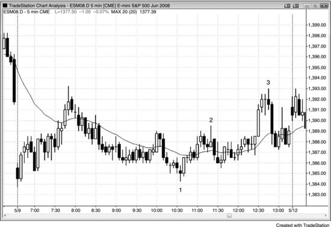

<!-- PDF page 252 -->

When a day appears to be developing into a trading range day, traders expect
breakouts to fail and they look to fade them. As shown in Figure 9.7, by midday
it was clear that the day was small and sideways, which greatly increased the
chances that breakouts would likely fail. Bars 1, 2, and 3 were second entries on
breakout fades. The trend bar leading up to the bar 3 top was large and had big
volume, sucking in lots of hopeful bulls who bet that there might finally be a
trend. This is always a low-probability bet on a small day, and it is much better
to fade the breakouts or look for strong breakout pullbacks. The breakouts to the
bar 1 low and the bar 2 high were weak (prominent tails, overlapping bars), so it
was likely both times that the breakouts would fail. The breakout that ended in
bar 3 never had a breakout pullback to give the bulls a low-risk long, so the only
trade was the second-entry short.
FIGURE 9.8 Trapping Traders out of Good Trades

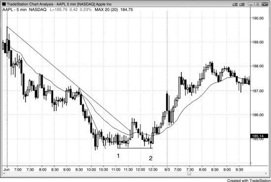

<!-- PDF page 253 -->

Apple (AAPL) has been one of the best-behaved stocks for day traders, but like
many other stocks, it sometimes traps traders out of great trades by running stops
at the start of a reversal, as shown in Figure 9.8.
Traders bought the double bottom bull flag at bar 1 by entering either three or
six bars later as the market went above the high of the prior bar. There was a
rally above the moving average that broke the trend line, and the moving average
gap bar short led to the bar 2 test of the bear low. Many bulls had their protective
stops below the bar 1 double bottom bull flag. Bar 2 dipped below bar 1 by a tick
and trapped the longs out, but it formed a double bottom bull flag with bar 1,
which led to a reversal that carried into the next day. The one-tick failed
breakout below bar 1 trapped bulls out and bears in. The move down to bar 2
was in a tight bear channel, and it was the third push down and therefore a high 3
buy setup. A high 3 is a more reliable setup in a tight channel than a high 2,
because channels often reverse up after a third push down. What made this long
especially good was that it trapped new longs out and immediately reversed up
on them, so psychologically it would have been difficult for them to buy. They
would have chased the market up, entering late, thereby adding fuel to the
upswing.
FIGURE 9.9 Double Tops and Bottoms in the First Hour

<!-- PDF page 254 -->

Stocks commonly form double top or bottom flags in the first hour (see Figure
9.9). Most are tradable, but always scalp out part of your position and move your
stop to breakeven in case the pattern fails.
Bars 2 and 4 formed a double top bear flag that failed. The market then
formed a bars 3 and 5 double bottom bull flag.
You then had to reverse again at the bar 4 and 6 double top bear flag, but you
would have netted 70 cents from your long. At this point, you knew that the
market was forming a trading range, likely a triangle.
Bar 7 was another failure, but a good long since trading ranges following a
strong move (the rally to bar 1) are usually continuation patterns, and bars 3, 5,
and 7 all found support at the moving average.
The selloff to bar 9 was seven bars long with no bullish strength, so it would
have been better to wait for a second entry, despite bar 9 being a higher low
(compared to bar 7). It was likely to fail to go far.
The breakout pullback at bar 10 was a perfect second entry.
FIGURE 9.10 Failed Double Bottom Bull Flag

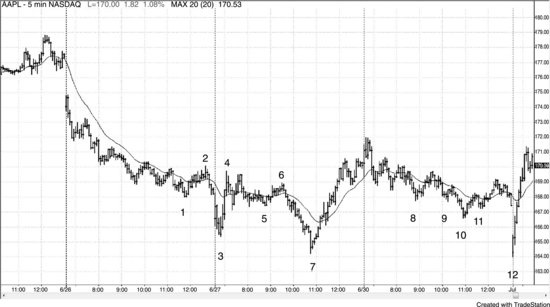

<!-- PDF page 255 -->

As shown in Figure 9.10, bar 4 was a setup for a double bottom bull flag entry,
but it failed with the bar 5 low 2, which was a pullback from the strong bear
spike down to bar 4. This led to a breakout below the double bottom and then a
two-legged move to bar 7. There were several choices for getting short, like
below bar 5, one or two ticks below the bar 4 low, on the close of the bar that
broke below bar 4, or on the close of the next bar, which was a strong followthrough bar.
FIGURE 9.11 Most Head and Shoulders Patterns Fail

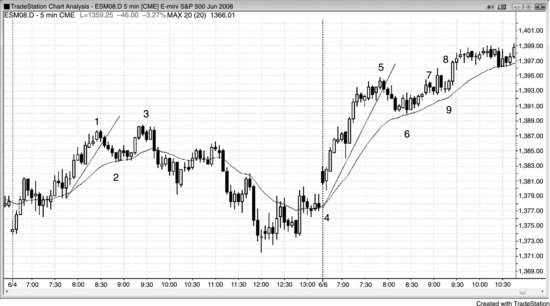

As shown in Figure 9.11, bars 5 and 11 were right shoulders of head and
shoulders bottoms, most of which fail, as they did here (bars 1 and 9 were the
left shoulders). The shape alone is not enough reason to place a countertrend

<!-- PDF page 256 -->

trade. You always want to see some earlier countertrend strength prior to the
reversal pattern. Even then, there are no guarantees that the trade will be
successful. Bar 2 broke a trend line and the rally to bar 4 was strong, although its
failure to exceed the bar 2 high was a sign of weakness. Although most smart
traders would not have reversed to short at the bar 6 failure after the bar 5 double
bottom bull flag and long entry, they would have moved their stops to
breakeven, thinking that if the stops were hit but the trade was still good, the
stop run would set up a breakout pullback long setup. Here, the stops were hit
but the market kept selling off. The one-bar breakout pullback just after the
breakout below bar 5 was a great short. Bar 5 was also the third push down in a
triangle after the bar 4 spike, and the triangle was also a wedge bull flag.
The bar 11 right shoulder was a buy, but again the breakeven stop would have
been hit.
FIGURE 9.12 Two-Legged Test of Trend Extreme

As shown in Figure 9.12, the selloffs to bar 2 and to bar 6 broke major trend
lines, so, in each case, a two-legged test of the prior high should set up a good
short. The bar 3 low 2 short was successful, either by shorting below bar 3 or by
taking the second entry two bars later.
The bar 8 short was less certain because the test was a large bull trend bar
(almost an outside bar, since it had the same low as the prior bar). The traditional
way to enter after an outside bar is on a stop at one tick beyond both extremes,
getting filled in the direction of the breakout. However, outside bars are basically
one-bar trading ranges, and most trading range breakout entries fail. You should
only rarely enter on a breakout of an outside bar because the risk is too great (to
the opposite side of the bar, which is large). Since this was a two-bar reversal,

<!-- PDF page 257 -->

the safest entry was below the lower of the two bars, which was the large bull
trend bar, because very often the market goes below the bear bar, but not below
both bars, and that happened here.
If you shorted at the bar 8 breakout of the inside bar, you would have been
nervous by the bar’s close (a doji bar, indicating no conviction). However, most
traders would not have taken that short, because three or more sideways bars, at
least one of which is a doji, usually creates too much uncertainty (barbwire). The
two small bars before the outside bar were small enough to act like dojis, so it
was best to wait for more price action. However, if you did not short on bar 8,
you would have to believe that many did and the doji close of their entry bar
made these traders feel uncomfortable with their positions. They would have
been quick to exit, thereby becoming trapped. They would likely have bought
back their shorts at one tick above the bar 8 entry bar and then be reluctant to
sell again until they saw better price action. With the shorts out of the market and
with them buying back their positions, going long exactly where they were
exiting (bar 9, one tick above the short entry bar) should have been good for a
scalp and likely two legs up. A trader could have bought either at one tick above
bar 9 or above the bar after bar 9, relying on bar 9 being a bull trend bar and
therefore a good long signal bar.
FIGURE 9.13 Five-Tick Failure

<!-- PDF page 258 -->

Scalping short for four ticks was a successful strategy for almost two hours in
Figure 9.13. However, the short from the bar 4 inside bar dropped only five ticks
and reversed up. This meant that many shorts did not get filled on their profittarget limit order and that the shorts were quick to exit at breakeven and
certainly above bar 5. The market was testing yesterday’s low, and it was the
second probe below the trend channel line (based on the trend line from bar 1 to
bar 3). The bulls were looking for reasons to buy, and the failed short scalp was
the final thing that they were hoping to find.
FIGURE 9.14 Failed Signals in QQQ

<!-- PDF page 259 -->

As shown in Figure 9.14, each of these 5 minute QQQ trades reached between 8
and 11 ticks before failing. The protective stops would get scalpers out at around
breakeven in all of them, but it still was a lot of work with little to show for it.
Clearly, however, there were many other profitable scalps, but it is tiring to scalp
if there are too many unsuccessful trades. This often makes a trader lose focus
and then miss profitable trades. On a clear bear trend day, the best approach is to
trade only with the trend and look to sell low 2 setups, especially at the moving
average. Your winning percentage will be high, allowing you to have a healthy
attitude and continue to take entries, preferably swinging at least part of your
position.
FIGURE 9.15 Switch to a Smaller Target

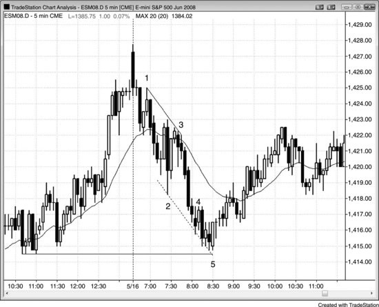

<!-- PDF page 260 -->

AAPL usually yields $1.00 scalps (the moves are usually more than $1.00,
allowing a scalper to take partial profits on a $1.00 limit order). As shown in
Figure 9.15, however, bar 2 extended only 93 cents above the entry above bar 1,
and then set up a low 2 short. This low 2 meant that the market failed twice to
reach the target. With the market largely sideways and just missing a $1.00
scalp, traders would likely have reduced their profit target to about 50 cents.
They would have been able to take partial profits on this 61 cent drop.
FIGURE 9.16 A Bear Spike Can Be a Buying Opportunity

As shown in Figure 9.16, NetApp Inc. (NTAP) went on sale twice during this
bull trend on the daily chart, and traders bought the markdown aggressively. Just
because there is a strong spike down below the trend line does not mean that the
trend is over. Most reversal attempts look great and most fail. Because of this,
experienced traders will buy sharp markdowns aggressively, even at the bottom
of a bear spike. Bar 11 was at the bottom of a 16 percent selloff, but it was still a
higher low and a double bottom bull flag with bar 7. Since the channel down
lasted so many bars, it was safer to wait to buy the bar 13 higher low or the
breakout above the bar 14 low 2 setup, which was a failed double top bear flag.
Bar 22 was a very strong bear trend bar down to the moving average, but the
rally up from bar 15 to bar 19 was very strong. The bear trend bar was probably
based on some scary news report, but one strong bear trend bar does not create a
reversal. Most of the time, it will fail and lead to a new trend high. Bulls thought
that a trading range and a new high were more likely than a successful reversal,
and they bought the bottom of the bar. Its low also formed a double bottom with
bar 20 and was probably going to be the bottom of a trading range or a double
bottom bull flag. The bear bar had weak follow-through and went sideways for

<!-- PDF page 261 -->

four overlapping bars, which had prominent tails. This is not how a bear reversal
usually looks, and the bears bought back their shorts. Their buying, combined
with the bulls buying here, led to the new trend high.
FIGURE 9.17 Most Trend Reversal Attempts Fail

When a bull trend is strong like it was on the 60 minute chart of the SPY shown
in Figure 9.17, it has inertia and will resist attempts to end. Overly eager bears
looked at strong bear spikes below the moving average and below trend lines as
signs that the market was reversing into a bear trend. Bulls saw each bear spike
as a buy setup. They knew that a successful reversal requires more than simply a
strong bear spike. They believed that each reversal would fail, because most do,
and that the market was going higher, so they were eager to buy pullbacks. When
the SPY went on sale by just 1 or 2 percent, bulls quickly bought it since they
knew that the sale wouldn’t last long. Many of the spikes were created by
vacuums. The bulls wanted to buy a pullback, so they stopped buying if they
thought that the market would go a little lower. This allowed the bears to drive
the market down quickly. Once it was low enough and the bulls thought that it
wouldn’t go lower, they appeared out of nowhere and bought aggressively. They
overwhelmed the bears, who then had to buy back their shorts, adding to the
rally, and the huge bear spike had no follow-through.
While the spikes were scary as they were forming, if traders understood what
was going on, they would be eager to buy at the bottom. If they did not want to
have a huge overnight risk, they could buy calls at the bottom of each bear spike
and take profits on each new high a few days later.
FIGURE 9.18 Failures Can Sometimes Be a Sign of Strength

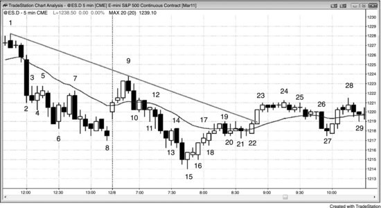

<!-- PDF page 262 -->

As shown in Figure 9.18, the lower low major trend reversal up from bar 15 was
strong and was likely to have at least two legs up. However, the rally to bar 19
failed to reach the bear trend line. It pushed above the moving average and came
close enough to the line to be within its magnetic field. This gave traders
confidence to buy the bar 22 high 2 setup because they thought that the market
should test above the trend line.
Bar 4 was a bull reversal bar after a strong bear spike. The spike was strong
enough to convince traders that the market was always-in short, so traders were
looking to sell rallies. Since they did not think that bar 4 was going to lead to a
significant reversal, many bears placed limit orders to short at and above its
high. Enough traders were so eager to short that they shorted at one tick below
its high. The market never made it to above the high of the bull signal bar, which
was a sign that the bears were strong. The market sold off below the bar 5 low 2
short signal bar. A similar situation formed at the high of the bar after bar 10, and
at bars 11, 13, and 26. Bar 18 was the bullish equivalent. Traders were so eager
to get long that they had buy limit orders at and below the low of the bar before
bar 18, and the most aggressive bulls with limit orders at one tick above the bar
18 low were likely the only ones who got long. The others had to chase the
market higher.
Bar 27 turned up at one tick above the low of bar 21, preventing a perfect
double bottom bull flag. This was a sign of eager bulls who placed buy limit
orders at one and two ticks above the bar 21 low as the market was trading down
from the bar 24 high. They were so eager to get long that they did not want to
risk having unfilled buy limit orders at and one tick above the bar 21 low. The
opposite situation happened when bar 7 turned down at one tick below the bar 5

<!-- PDF page 263 -->

high. It failed to reach the bar 5 high because the bears felt an urgency to get
short, so the failure was a sign that the bear trend was strong. Bar 7 was a test of
the moving average, but the bears were so eager to get short that they placed
their sell limit orders at two ticks below the moving average instead of at one
tick below. This prevented the high of the bar from reaching the moving average
and was a sign of a strong bear trend.
The low 1 after the bar 15 bottom failed to lead to a new bear low and was a
sign that the reversal up was strong.
FIGURE 9.19 Just Missing a Target and Then Reaching It

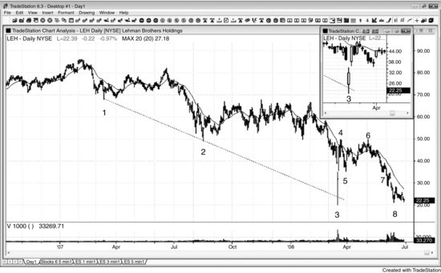

When there is a fairly obvious measured move target and the market comes close
enough to be within its magnetic pull, but not close enough for traders to believe
that it was adequately tested, the market often pulls back and then makes a more
convincing test. As shown in Figure 9.19, today was a trending trading range day
in the Emini and the obvious measured move target was a measured move up
based on the opening range. Bars 7 and 9 came within three ticks, but most
traders would not feel that the test is complete unless the market comes within
one tick. The test failed to reach the target, but it was close enough to make
traders believe that the magnet was influencing the price action. Traders wanted
to see whether the market would fall back after testing it or it would break above
and rally to some higher target. The market pulled back to a small expanding
triangle bull flag at bar 14 and tested the target to within a tick on the final bar of
the day. Incidentally, if the test goes four or more ticks above the measured move
target, that usually means that the market is ignoring the target and is heading
toward a higher target.
Bar 14 was also the signal bar for a larger wedge bull flag where bar 8 was the

<!-- PDF page 264 -->

first push down and bars 10 or 12 formed the second. Some traders thought the
flag ended at bar 12, but the distance between bar 10 and bar 12 was small
compared to the distance between bar 8 and bar 10, so many traders were not
convinced that the correction was over. This resulted in the lower low final push
down to bar 14.
The three-bar bull spike up from bar 14 broke above the high of the prior 60
minute bar (not shown) by one tick. When the market reversed down two bars
later in a 5 minute wedge bear flag, the 60 minute traders were wondering if they
were in a 60 minute one-tick bull trap. Some 60 minute traders bought on a stop
at one tick above the high of the prior 60 minute bar and now the market was
turning down. However, most of the time when there is a developing one-tick
failed breakout on the 60 minute chart, the market reverses back above the onetick failed breakout before the 60 minute bar closes. The result is that although
the one-tick failed breakout was present for many bars on the 5 minute chart, it
disappeared from the 60 minute chart by the time the 60 minute bar closed, as
was the case here. The 60 minute bar closed on the bar after bar 15, and the final
high of the 60 minute bar was three ticks above the high of the prior 60 minute
bar.
