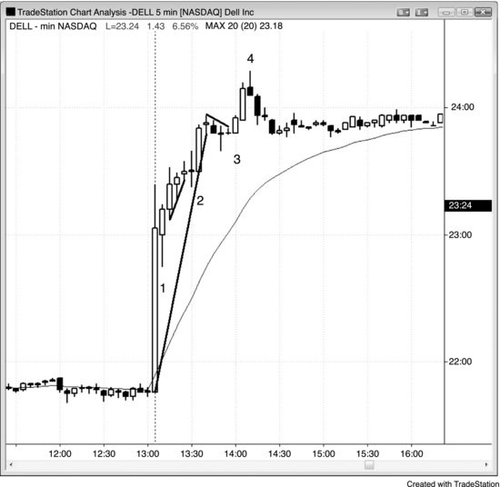

# Chapter 14: Globex, Premarket, Postmarket, and Overnight Market

<!-- Source PDF pages 292–296 -->

<!-- PDF page 292 -->

CHAPTER 14
Globex, Premarket, Postmarket, and Overnight Market
The same price action techniques apply in all markets at any time of the day or
night. There are so many sophisticated international traders that many markets
are traded 24 hours a day. The premarket extremes are often targets that get
tested during the day session, but it is not necessary to look at Globex prices
when trading the day session since very little is gained and the day session price
action will give adequate signals. Many traders use the Globex chart throughout
the day when they are day trading, and that is perfectly reasonable. I prefer the
day session chart, since trend lines and trend channel lines that extend over two
or more days are very reliable on the day session charts, and important to my
trading.
When a stock has an earnings report after the close, some traders try to trade
them because the big moves appear to offer great profit potential, but these
moves are very difficult to scalp and most traders should not attempt it. The
moves are frequently too fast to read and allow proper order placement, have big
slippage on stop entries, have pullbacks that are large, and have reversals, and
the market often suddenly stops moving as soon as you understand what it has
been doing.
FIGURE 14.1 Trading after the Close

<!-- PDF page 293 -->

As shown in Figure 14.1, Dell had an earnings report after the close and
appeared to offer some postmarket trading opportunities, but the moves are
usually too difficult to trade profitably for most traders. Bar 1 was a high 1 bull
inside bar after the upside breakout and set up a long at one penny above its
high.
Bar 2 was a long at 1 cent above the high of the outside bar, which also broke
below a bull micro trend line and reversed up.
Bar 3 was a high 1 breakout long after a major trend line break.
Bar 4 was a bear reversal bar and a setup for a final flag short following a buy
climax after a breakout above a bull channel. Also, the bar 3 flag broke a big bull
trend line, indicating that the bears were gaining a little strength. Fade a strong
trend only if there was first a trend line break. Also, a countertrend trade in a
strong trend needs a 5 minute (not a 3 or 1 minute) reversal bar. The market went
sideways in a tight trading range for the rest of the postmarket session.
FIGURE 14.2 Trading the Premarket

<!-- PDF page 294 -->

The premarket is tradable, but there are usually not many entries in the hour or
two before the New York Stock Exchange opens at 6:30 a.m. PST (see Figure
14.2). There are often reports at 5:30 a.m. that result in quick trends and
reversals, though.
Bar 1 was a wedge long and a double bottom, but traders would have had to
hold through the bar 2 pullback to make a profit. A wedge bottom (or three
pushes down, or any of many other names for this pattern) usually leads to two
legs up.
Bar 2 was a higher low and a small trend line reversal.
Bar 3 was a high 2 at the moving average.
A report resulted in a false breakout to the upside and then an outside down
bar (bar 4). Traders would have shorted below bar 3, where many longs would
have placed their stops.
Bar 5 was a breakout pullback.
Bar 6 was a second entry for a second attempt to reverse up from a new swing
low (bar 5 was the first).
FIGURE 14.3 Tick Charts Have More Bars in a Fast Market

<!-- PDF page 295 -->

As shown in Figure 14.3, the Emini reacted poorly to the 5:30 a.m. PST
unemployment report. This is a 100 tick chart where each bar represents 100
trades, independent of the volume of the trades or the time. Note that the 30 bars
between bars 1 and 5 all occurred within one minute due to the fast action off the
report. These bars were forming so rapidly that it would have been difficult or
impossible to trade anything other than market orders. It was theoretically
possible to make many profitable scalps based on the price action, but most
traders should never attempt to trade this. The only purpose of showing it is to
demonstrate that standard patterns were present throughout.
The thumbnail charts are the 1 and 5 minute charts for the same 30 minutes of
trading.
FIGURE 14.4 The Globex and Day Session Often Have Different Setups

<!-- PDF page 296 -->

As shown in Figure 14.4, the bar chart of the Globex 24-hour session had an
expanding triangle ending at the bar 5 high (bars 1 and 3 were the first two
pushes up), and the thumbnail shows the day session with the same numbering.
A day session trader did not need to see the Globex expanding triangle to go
short at bar 5. Bar 5 took out yesterday's high and pulled back to the moving
average. The market then bounced to a lower high and had a short setup at the
bar 6 double top bear flag (the first top was six bars earlier).
