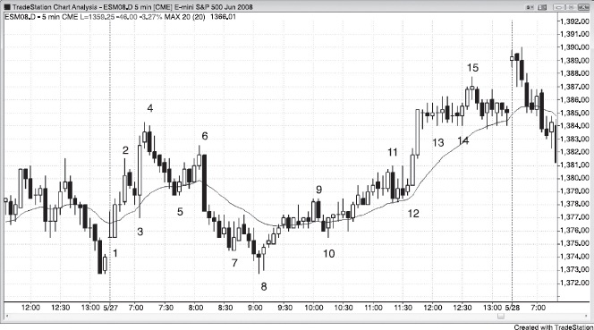
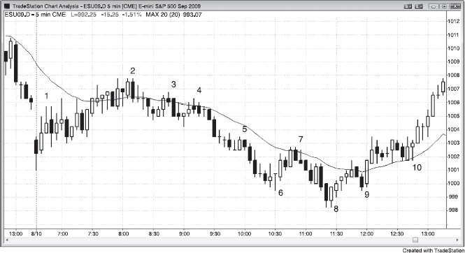

# Part III: The First Hour (The Opening Range)

<!-- Source PDF pages 334–355 -->

<!-- PDF page 334 -->

PART III
The First Hour (The Opening Range)
I once had many online discussions with a trader who traded 100 Treasury bond
futures contracts at a time, but he disappeared every day by 7:30 to 8:00 a.m.
PST. He said that he studied his results and discovered that he made 85 percent
of his profits in the first hour and decided that he just drained himself
emotionally during the rest of the day, and sometimes this carried over into the
next day. Because of this, he stopped trading after the first hour or so several
years ago and was doing very well trading just the first hour.
Here are some of the characteristics of the first hour:
What is referred to as the first hour is rarely an hour. It is the time before
the first good swing begins and can be 15 minutes or two hours; it is often
called the opening range.
It is the easiest time to make money. Experienced scalpers know that
reversals are common. These traders can often make many carefully
selected scalps, betting that breakout attempts will usually fail, as is typical
of breakout attempts at any time of the day. They look to buy low and sell
high. In general, they avoid doji signal bars, but will often short below
either a bull or a bear trend bar after a move up, or buy above a bull or a
bear trend bar after a move down. Consecutive trend bars in the same
direction often indicate the direction of their next scalp. Two consecutive,
strong bull trend bars will usually make scalpers look to buy, and
consecutive bear trend bars will bias them in favor of shorts.
It is the easiest time to lose money. Beginners see large trend bars and are
afraid of missing a huge breakout. They buy late, at the top of strong bull
spikes, and short late, at the bottom of strong bear spikes, only to take
repeated losses. There are more variables to consider, and the setups come
faster. Because they often confuse swing and scalp setups, they end up
managing their trades wrong. They should never scalp, especially in the
first hour.
When the bars are big, traders should use wider stops and trade smaller
size.

<!-- PDF page 335 -->

Yesterday's always-in direction going into the close often carries over into
the open of today.
Reversals are common, abrupt, and often large. If you can't read the price
action fast enough, wait until the market slows down and the always-in
direction becomes clear.
The first bar of the day is the high or low of the day only about 20 percent
of the time, so don't feel a need to enter on the second bar. In fact, there is
no need to rush to take any trade, because before long the always-in
direction will be clear, and the probability of a successful trade will be
higher.
Either the high or low of the day usually forms within the first hour, so
swing traders patiently wait for a setup that can be one of the extremes of
the day. The setup for the high or low of the day often has only a 40 percent
probability of success. Since the reward can be many times larger than the
risk, the trader's equation can still be excellent for a swing trade. Most
traders should focus on a logical reversal in the opening range for their
most important trade of the day. The trade often looks bad for five or more
bars, but then suddenly breaks out and the always-in direction becomes
clear to most traders. On most days, a trader will have to take more than
one reversal before catching a successful swing, but even the ones that don't
go far usually make a small profit or have only a small loss. This creates a
favorable trader's equation for this particular type of relatively lowprobability trade.
The high of the day usually begins with some type of double top, although
it is rarely exact. The low of the day usually begins with an imperfect
double bottom of some type.
Once the always-in direction becomes clear, traders can enter at the market
or on any small pullback for a swing. Experienced scalpers look for
pullbacks to scalp in the direction of the trend.
Trading in the minutes after a report is dominated by computer programs,
many of which get a nearly instantaneous numerical version of the report
and use the data to generate trades. Other programs trade off statistics and
not fundamentals. It is very difficult to compete in an environment where
your opponent has the edge of being much faster at making decisions and
placing trades. It is better to wait for a bar or two before entering.
Gap openings are present on most days (see Chapter 20 on gap openings).
The open often foretells the type of day. If the first bar is a doji or the first
several bars overlap and have prominent tails, the day is more likely to have

<!-- PDF page 336 -->

lots of two-sided trading.
There are often reports at 7:00 a.m. PST. Even if a report is not listed on the
Internet, the market usually behaves as if there was a report. Computers have a
clear edge in speed of analysis and order placement, and they are your
competitors. When your competition has a big advantage, don't compete. Wait
for their edge to disappear and trade when speed is no longer important.
The first hour or, more accurately, the opening range is the time when the
market is setting up the first trend of the day, and it ends once that trend begins.
It often lasts for a couple of hours and sometimes is as short as 15 minutes. It is
the easiest time to make money, but is the easiest time to lose money as well.
This is because many traders cannot process all of the variables fast enough, and
the information is limited, since there are not many bars yet in the day. They
have to decide on whether to treat a trade as a swing, a scalp, or both, and have
to base the decision on the three trader's equation variables of probability, risk,
and reward, in an environment when there are usually economic reports, where
reversals and therefore decisions come often, and where the bars are often
unusually large and therefore require them to adjust their risk to much larger
than normal, as opposed to other times during the day when risk is a variable that
is usually fixed at a certain size and does not usually require much thought. Get
the picture? A trader has more to think about and less time to do the thinking.
Computers have a clear edge in speed of analysis and order placement, and they
are your competitors. When your competition has a big advantage, don't
compete. If you are thinking, “Boy, I wish that I had the speed advantage that the
firms using computers for program trading have,” then you realize that you are at
a disadvantage. Wait for their edge to disappear and trade when speed is no
longer important.
Trading is difficult enough and the edge is always small, and the added
complexity of the first hour can push traders beyond their ability to trade
effectively. If there are too many variables to consider to trade profitably, traders
can increase their chances of success by reducing the number of variables. For
example, they can decide to look only for high-probability scalps or for only
likely swing setups, or they can wait until there is a clear always-in trade and
then swing, or take scalps in that direction, entering on pullbacks. They can also
trade half to a quarter of their normal size and use a protective stop that is
beyond the signal bar, which often requires a stop that is two or more times
larger than their usual size.
One of the biggest causes of losses is a trader's inability to distinguish
between swing and scalp setups. From the trader's equation, readers know that

<!-- PDF page 337 -->

scalpers generally have to win on 60 percent or more of their trades, since the
risk usually has to be about the size of the reward. Scalp setups are much more
common than swing setups, but most scalp setups do not have a 60 percent
probability of success and should be avoided. However, reversals are common in
the first hour, and traders often do not have enough time to adequately assess the
trader's equation. If their default is to take every reversal and then do the math
after they are in, they will lose over time. The high or low of the day often
follows a setup that has less than a 50 percent chance of success, and is therefore
a terrible setup for a scalp, but it can still be a great setup for a swing.
Experienced traders can usually find four or more scalps in the first hour and
even make a living off those trades. For example, if they average two profitable
scalps a day of two points each and trade 25 Emini contracts, they could make a
million dollars a year. Since most traders cannot process the risk, reward, and
probability reliably when they have to do it quickly and with only five or 10 bars
of information, they should not scalp in the first hour when reversals come
quickly and abruptly. Instead, they should wait patiently for a setup that is likely
to lead to an always-in swing, or wait until the swing has begun and the market
has a clear always-in direction, and then take a swing trade. They will then have
a reward that is larger than their risk (it may be two or three times as large), and
since the always-in direction is clear, they'll have a 60 percent or better chance of
the market going at least as many ticks in their direction as they have at risk
from their stop, at which point they can move their stop to breakeven.
Many experienced traders look for a strong trend bar or consecutive trend bars
in the first hour, and then will scalp a pullback. For example, if there are two
consecutive strong bull trend bars and then a doji bar, they might place limit
orders to buy at or below the low of the doji bar. Since they see it as a weak
reversal signal, especially after such a strong bull spike, they expect it to fail.
This means that the bears who sold below the bar will have to buy back their
shorts and probably won't want to sell again for at least a bar or two. This
removes bears from the market and turns some bears into buyers, which gives
the bull scalpers a good chance to make a profit. The protective stop size and
target size depend on how large the bars are. If the Emini has had an average
daily range of about 15 points and the bull trend bars are about two points tall,
traders might risk about two points to make two points, if they believe that there
is a 60 percent chance of success, which there often is in these circumstances.
Other bulls might scale in lower and risk to below the bottom of the bull spike.
Only very experienced traders should be fading breakouts of bars in the first
hour, because the moves can be fast and go very far, and traders have to be very
confident of their read and their ability to manage their trades in a fast, volatile

<!-- PDF page 338 -->

market.
The moves in the first hour can be fast, and traders often get caught up in the
excitement of big trend bars and enter late. They know that a trend will soon
begin and are fearful of missing it, and instead get caught in a reversal. Since the
market is searching for direction in the first hour, reversals are common. Traders
might take a trade and think that they will swing it, only to discover that it
reverses on the next bar. They then have to decide whether to exit or to rely on a
stop beyond the signal bar. Invariably, as they are making that decision, they
realize that the reversal trade is better than the trade they took, and they struggle
with trying to figure out how to minimize their loss and get into a trade in the
other direction. They hold too long, hoping for a pullback, and then exit with a
larger loss than they planned on taking. Not only that; they are upset by the large
loss and need to recover before taking the next trade. Once they are ready to
trade again, the market has moved so far in the new direction that they are afraid
to take the trade, even though the trend looks strong. At the end of the day, they
print the chart out and cannot believe how clear the setups actually were. But
hindsight is very different from real time.
Traders can also lose money on scalps that should be swings. If they lost
several times earlier in the week on what they thought were good swing trades,
they will be wary of swing trading on the open today. Assume that several times
this week the market went far enough for a scalper's profit, but quickly reversed
and stopped them out with a loss. Today, they decide to scalp every trade in the
first hour. They lose on the first two scalps, but when they were stopped out on
the second trade, the bar that hit the stop reversed into an outside bar and led to a
very strong trend in the direction of the trade that they no longer held. Since they
decided that they wanted to trade only scalps on reversals, they are on the
sidelines as the market trends relentlessly, bar after bar. The trend runs for eight
points before there is a pullback, and they suddenly realize that this one swing
trade offered as much profit as four successful scalps.
After several days of losing when they tried to scalp because they took lowprobability setups, and having given up on trying to swing because they got
stopped out so often (only to miss a big trend after they gave up), they are
confused and upset. They feel like they did everything right but still lost, and
that trading is so unfair: “Why can other people do so well in the first hour, yet I
lose no matter what I do?” It is because they are trying to do too much. They are
buying at the top and selling at the bottom of the developing range, hoping for a
successful breakout, denying the reality that most breakout attempts fail. They
then do not take the best swing setup, because it looks weak and it looks like it

<!-- PDF page 339 -->

will probably fail, just like the past five reversals in the past hour. When traders
feel this way, they should take a break from trading the opening range until the
always-in position is clear. Yes, they will be entering after the trend has already
gone a couple of points and they stand to make less, but the chance of success is
much greater. It is far better to win a little, but win frequently, than it is to lose
several times a day while hoping to finally figure out how to trade the first hour
profitably.
Traders who can scalp successfully often have to make adjustments in the first
hour. In general, scalpers usually have to risk about as much as their reward, but
since it is always best to begin by looking at what risk is required, they can set a
reasonable reward after determining their risk. For example, if the bars in the
Emini are usually about two points tall, but they are about four points tall today,
a trader might have to risk about four points. The market is moving quickly and
it is difficult to spend time doing exact math while trying to read the charts and
to place orders. Scalpers should just quickly cut the position size in half or by
two-thirds. It doesn't matter what they do. What matters is that they do it quickly,
stop thinking about it, and concentrate on what is much more important: reading
correctly and placing orders. If they are unwilling to use a larger stop when it is
necessary, they should not take the trade. Also, once traders are in the trade and
the market pulls back further than they think it should have (but does not hit
their stop), and then the move resumes but looks weaker than they think it
should, they have to be willing to get out at a smaller profit target. For example,
the large bars might force them to risk four points instead of two on an Emini
trade, but once the move has gone their way, it looks weak. If they believe that
their premise is no longer valid, they have to be able to change their goal, and it
is often worth exiting with just a point or two profit and then waiting for more
information.
Only experienced traders, who can handle changing position, stop, and profit
target sizes quickly, should attempt it. Because scalping usually requires a risk
that is as large as the reward, and therefore a high winning percentage, most
traders should avoid scalps, especially in the first hour. Most traders have a
better chance of being profitable in the long run if they can wait for a clearly
always-in market and then take a swing trade. This means that the probability of
an equidistant move is 60 percent or more. They can then use a profit target that
is at least as large as the risk, and preferably twice the size of the risk, and have a
favorable trader's equation.
Because the first hour has many reversals, it is better to look to buy low and
sell high until the market becomes clearly always-in long or short. Unfortunately,

<!-- PDF page 340 -->

many traders do the opposite. They see large trend bars up or down and are
afraid that they are missing a breakout, which almost always fails. They have to
learn to wait for a confirmed breakout and a clear always-in market. Then they
should switch to a swing approach and become willing to buy near the top when
the market is always-in long, or sell near the bottom when it is always-in short.
If traders cannot quickly distinguish swing setups from scalp setups, they should
not make rash decisions. Instead, they should wait patiently for a clear always-in
signal and then begin trading. Most traders cannot successfully scalp in the first
hour, and certainly are unable to scalp initially and then switch to swing trading
when the time is right. They should instead wait patiently for swing setups.
Since the first hour or two frequently provides setups that result in great swing
trades, traders must be ready to take them. Although there is a tendency to think
that the patterns are different in the first hour, the reality is that from a price
action perspective, they are not. The setups are the same as during any other time
of the day and on any time frame. What is different is that the volatility is often
greater and therefore the patterns run further, and the reversals are often
unexpectedly abrupt. It is common for reversals to look weak and have two or
three weak doji bars before the trend breaks out. Realize that this is common
and, if you entered and see this weakness, don't scratch out. Rely on your read
because you will likely be right, and you stand to make a large swing profit.
One other difference about the open is that many trades set up based on
yesterday's price action. There will often be a channel that develops in the final
couple of hours of yesterday followed by either a breakout or a market gap well
beyond that flag on today's open. In either case, watch for reversals and
continuations. Remember, a channel is just a flag, so a bull channel is a bear flag
and a bear channel is a bull flag. Also, if the market ended clearly always-in long
or short, traders should assume that the trend will continue on the open until they
see evidence to the contrary.
A final important difference is that the high or low of the day occurs in the
first hour or so on most days, and it is beneficial to try to swing part of any trade
that might be the high or low of the day. If you are in a trade with such potential
and the market moves strongly in your direction, use a breakeven stop to allow
yourself to collect the windfall profits that often happen off the open.
Although any reversal in the first hour or so can create the high or low of the
day, the probability of any one particular reversal doing so is usually not more
than 50 percent. If a trader instead waits for clear follow-through and a clear
always-in move after the reversal, the probability that the reversal will be the
high or low of the day is often more than 60 percent. The traders who wait for

<!-- PDF page 341 -->

the always-in confirmation pay for that increased probability with smaller
profits, but traders who prefer to take only high-probability trades are happy
with the trade-off. Since the high or low of the day setup is often only 40 to 50
percent certain, it is usually a bad scalp setup, even though it has a strong trader's
equation for a swing trade. The trend, as it begins, often starts slowly and does
not look like a trend at all, but usually within five bars or so has a breakout into a
clear always-in market. Most of the time, the setup for a bull trend day is part of
a double bottom of some type, even though it is usually so imperfect that it does
not look like a double bottom. Likewise, the setup for a bear trend day is usually
part of an imperfect double top. For example, if there is a series of strong bull
trend bars off the open and then a partial pullback that gets tested five to 10 bars
later, this forms a double bottom flag entry and has a good chance of leading to a
new high of the day. The breakout then might run for a measured move up and
lead to a bull trend.
Traders often enter on the second bar of the day as it breaks beyond the high
or low of the first bar, but the probability of a successful scalp is often under 50
percent, depending on the situation. That means that the trader's equation makes
sense only for a swing, but traders often mistakenly treat the trade like a scalp,
which is a losing approach when the probability is about 50 percent and the risk
is as large as the reward. They convince themselves that they will swing and
hold through pullbacks, but within a bar or two, they grab a small profit and feel
relieved. They really intended to scalp but did not realize it, and they will
wonder at the end of the month why they lost money. It is because they took a
trade that had a losing trader's equation. Some reversals in the first hour have a
70 percent chance of reaching a scalper's target, but only a 40 percent chance of
reaching a swing target. Traders have to know in advance how they plan to
manage the trade before they take it, because changing goals after entering is a
losing strategy. You can't have one premise and then manage the trade as if it
was based on a different premise, but it is common for traders to confuse scalps
and swings in the first hour when everything happens so quickly and the bars are
large and have big pullbacks within the bars as they are forming.
The first bar of the day has about a 20 percent chance of being either the high
or low of the day (except on days where there is a large gap opening, when the
probability can be 50 percent or more if the bar is a strong trend bar). Also, the
bar is often large, frequently about 20 percent of an average day's ultimate range.
For example, if the average range in the Emini has been about 10 points and the
first bar of today is two points tall, a trader who buys as the second bar breaks
above the first bar has about a 20 percent chance of making eight points while
risking a little more than two points. This is a losing trader's equation. If traders

<!-- PDF page 342 -->

are very good at subjectively evaluating all of the variables and selecting trades
with a higher probability, they can have a mathematical edge, but these highprobability trades based on the first bar of the day happen only about once a
month. Even if traders take profits once the reward is twice the size of the risk,
they will be successful only a couple of times a month, so looking for a swing
entry on the second bar of the day is rarely worthwhile. However, since a reliable
swing in the first hour, where the reward is twice the size of the risk, occurs on
most days, if there is a strong reversal setup early on, traders should consider
swinging the trade. Once the trend reaches about twice the size of their stop, they
can move their stop to breakeven and swing part of the trade until there is an
always-in reversal.
Sometimes the market trends for the first bar or two of the day and that first
bar ends up as one of the extremes of the day. When the market trends from the
open, it is important to enter early, but not necessarily on the second bar. This
pattern is most common with gap openings, large or small. When you enter a
trade where you might be at the start of a huge trend, it is particularly important
to try to swing some contracts. If the pattern is very strong, you could swing
most of your contracts and then quickly move your stop to breakeven.
However, if the strong opening is reversed (a breakout to a new extreme of the
day in the opposite direction), then the day might trend in the opposite direction
or it could turn into a trading range day. A strong trend off the open, even if it is
reversed, still means that there were traders willing to trade aggressively in that
direction, and they will be quick to trade again in that direction later in the day if
the reversal falters.
If you think that a reversal down is not the high of the day, you should never
be more than 30 percent certain, because you would then be at least 70 percent
certain that it is not, and the market is never that certain when the opening range
is forming. In fact, rarely is anything that certain at any time of the day. That
edge is simply too large, and traders would quickly neutralize it long before it
got that certain. Don't get too committed to an opinion, especially in the first
hour, because even the strongest moves can reverse sharply on the next bar.
However, although a reversal in the first couple of hours might have only a 30 to
40 percent chance of becoming the high or low of the day, if there is good
follow-through, the odds can quickly increase to 50 to 60 percent.
Even though most early reversals are good for scalps and not swings, when
one is particularly strong, a trader should try to swing at least half of the
position. As mentioned earlier, there is a tendency for the first hour or two to be
the most likely time of the day to find a trade where a trader can make two to

<!-- PDF page 343 -->

three times the risk. In general, most traders should work very hard to take
potential swing trades in the first hour or two because those trades have the best
trader's equation combination of reward, risk, and probability.
Why does the market make a big move over the first several bars and then
reverse? Why doesn't it simply open at the low or high of the day? The location
of the open of the day is not set by any firm or group of firms; instead, it
represents a brief equilibrium between buyers and sellers at the instant of the
open, and it is usually determined by the premarket activity. For example, the
Emini is basically a 24-hour market and trades actively, uninterrupted, for hours
leading up to the open of the New York Stock Exchange. If the institutions have
a large amount of buying planned for the day, why would the market ever open a
stock above yesterday's close and then sell off before rallying to a new high? If
you were an institutional trader and had a lot of buy orders to fill today, you
would love the market to open above where you wanted to buy and then have a
sharp move down into your buy zone where you could aggressively buy along
with all the other institutions that likely also have lots of similar buy orders from
their clients; you would then hope to see a small sell climax that will form a
convincing low of the day. The lack of buying by the bullish institutions creates
a sell vacuum that can quickly suck the market down into their buy zone, which
is always at an area of support, where they will buy aggressively and relentlessly,
often creating the low of the day.
If the reversal back up from that sell climax on the open is strong enough,
very few traders will be looking to short, because there will be a general feeling
that the upward momentum is sufficiently strong to warrant at least a second leg
up before the low is tested, if it gets tested. Would there be anything that you, if
you were an institutional trader, could do to make this happen? Yes! You could
buy into the close of the premarket to push the price up and fill some of your
orders. Not as much volume is needed in stocks to move the price before the
6:30 a.m. PST open. Then, once the market opens, you could liquidate some or
all of your longs and even do some shorting. Since you want to buy lower, you
will not start buying until the market falls to an area that you consider represents
value, which will be at a support area. This is a vacuum effect. The buyers are
there, but they will step aside if they think that the price will be lower in a few
minutes. Why buy now if you can buy for less in a few minutes? This absence of
buying despite the existence of very strong bulls allows the price to get sucked
down quickly. Once it is in their buy zone, they see value and doubt the market
will fall further. They appear as if out of nowhere and buy relentlessly, causing a
very sharp bull reversal. The shorts will also see the support, and if they believe
that the leg down is likely over, they, too, will become buyers as they take profits

<!-- PDF page 344 -->

on their shorts.
Price action is very important. A trader wants to see how the market responds
once it gets down to some key support price, like the moving average, or a prior
swing high or low, or the low of yesterday, or a trend line or trend channel line.
Most of the trading is done by computers, which use algorithms to calculate
where these support levels are. If enough firms are relying on the same support
levels, the buying will overwhelm the selling and the market will reverse up. It is
impossible to know in advance how strong the buying will be, but since the
support is always based on mathematics, an experienced trader can usually
anticipate areas where reversals might occur and be ready to place trades. If the
downward momentum begins to wane and the market starts to reverse up from
the key price, institutions will liquidate any shorts and aggressively buy to fill
their orders. Since most firms will have similar orders, the market will start to
rally. If a firm believes that the low of the day might be in, it will continue to buy
as the market rallies and will aggressively buy any pullbacks. Since its order size
is huge, it doesn't want to buy all at once and risk causing a spike up and then a
buy climax. Instead, it would rather just keep buying in an orderly fashion all
day long until all of its orders get filled. As they get filled, the relentless buying
causes the market to go up more, which attracts momentum traders who will also
buy throughout the day, adding to the buying pressure.
Is this what actually happens? Traders at institutions know if this is what they
do, but no one ever knows for certain why the market reverses on any given day.
The reversal is due to countless reasons, but those reasons are irrelevant. All that
matters is price action. Reversals often happen seconds after a report is released,
but an individual trader is unlikely to understand how the market will respond to
a report by simply watching CNBC. The market can rally or sell off in response
to either a bullish or a bearish report, and a trader is simply not qualified to
reliably interpret a report in the absence of price action. The best way to know
how the market will respond is simply to watch it respond and place your trades
as the price action unfolds. Very often, the bar before the report is a great setup
that gets triggered on the report. If you feel compelled to trade on the release of
the report, place your order and then your stop and trust your read. Since
slippage can be significant on a report, it is almost always better to wait until
after the report is released. If you enter on the report, you might find that you got
a few ticks of slippage on the entry, and then the market violently reverses and
you get additional slippage on your exit. What you thought was a trade with a
risk of eight ticks ends up as a trade where you lost 16 or more ticks. If you trade
thinner markets, your slippage could be much worse and you could be so far
down in the first hour that you will not get back to breakeven by the close.

<!-- PDF page 345 -->

When the market rallies sharply on a 7:00 a.m. PST report, it is usually
because the institutions were already planning on buying, but were hoping to
buy lower. When the report appeared sufficiently bullish for them to believe that
they would not be able to fill their orders lower, they bought on the report. If
they have enough buying to do, they will continue to buy all day, and the day
will become a bull trend day. If, on the other hand, their initial buying is
overwhelmed by other institutions who were hoping for a rally that would allow
them to short at a higher price, the upside breakout will fail and the market will
trend down. These bears were invisible because they were waiting for a rally to
short and their power became evident only once they began to aggressively short
the rally and turn the market back down. Obviously, countless other factors are
always in play, and there are huge momentum traders who have no opinion about
a report and simply trade heavily in the direction of the move as it is unfolding.
However, the institutional bias going into the report is an important component.
The institutions already knew what they wanted to do before the report was
released, although all would have contingencies if the report was a complete
surprise.
About 70 percent of all trading is automated, and this computer-generated
buying and selling will become increasingly important. Dow Jones & Company
now has a news service called Lexicon that transmits machine-readable financial
news to its subscribers. Lexicon scans all of the Dow Jones stories about stocks
and converts the information into a form that the algorithms can use to make
decisions to buy and sell stocks in a fraction of a second. Some of the algorithms
are based on the fundamental components in the report. How many new jobs
were created last month? What was the core consumer price index (CPI)? What
was the bid-to-cover ratio in the bond auction? Other algorithms operate on a
longer time frame and analyze stock performance and earnings statements, in
addition to the news feeds, to make trading decisions. Still other algorithms are
purely statistical, like if the Emini rallied 10 ticks without at most a one-tick
pullback, then buy at the market and exit with a two-tick profit. Another firm
might find a statistical reason to short that rally for a three-tick profit. It is
impossible to know what any firm is doing, but if someone can think of an idea
and it can be tested and found to be mathematically sound, their computers are
probably trading it. Some firms might have algorithms that are hybrids of the
fundamental and statistical approaches. Maybe if the economic number is
favorable, the programs will buy immediately, but if they have statistical
evidence that tells them that the Emini will then reverse to a new low after
rallying three points on this particular economic number, the program might take
profits and even reverse for a scalp.

<!-- PDF page 346 -->

Some programs use differential evolution optimizing software to generate data
that is used to generate other data. They can continue to refine the data until it
reaches some level of mathematical certainty, and then the result is used to
automatically buy or sell stocks. Some orders are so huge that they take time to
place, and algorithmic trading software breaks the orders into small pieces to
conceal the trading from traders who would try to capitalize on the incipient
trend. Predatory trading algorithms try to unravel what the algorithm trading
programs are trying to hide. Everyone is looking for an edge, and more and more
firms are using computers to find the edges and place the trades.
Since computers can analyze the data and place trades far faster than a trader
can, and the computers are running programs that have a mathematical edge, it is
a losing proposition to try to compete with them at the moment a report is
released. These are very high-powered computers and are located very close to
the exchanges, and can trade huge volumes in a fraction of a second. The result
is price movement that is often too fast to read. In fact, the price movement can
be so fast that your computer at home may be several seconds behind what is
actually taking place. Too often the moves are very large in the first second or
two, only to reverse a few seconds later, and then maybe reverse again. Traders
simply cannot make decisions and place orders fast enough to trade this situation
profitably. It is better to wait to see if a clear always-in move comes from the
report and then trade in that direction. When your opponents have an edge over
you—in this case, speed—it is better to wait for their edge to disappear before
trading again. Most traders should not trade in the seconds after a report but
should wait for the price action to return to normal, which often takes one to
about 10 minutes.
No one knows in advance whether the sum total of all the buy orders at all of
the major institutions would be enough to overwhelm the institutions that were
looking to short, or whether the shorts represented vastly more dollars and would
be able to drive the market down. On most days, the action is two-sided for a
while as the bulls continue to buy and the bears continue to sell. The market
probes up and down in buy and sell vacuums, looking for one side to take
control over the market when the market reaches an extreme. When it is low
enough, strong bulls, who have been waiting for the market to reach a level that
they see as value, will buy aggressively. The market then races up to an area
where the bulls no longer feel that the price represents good value, and they stop
buying and begin to take profits. The strong bears, who have been waiting for
higher prices to sell, appear out of nowhere and short aggressively. At some
point, one side decides that they are unwilling to continue trading aggressively at
the current price, and this creates an imbalance that allows the other side to

<!-- PDF page 347 -->

begin to move the market in their direction. The losing side begins to cover, and
this adds to the trend. The winning side sees the market moving their way and
they add to their positions, creating a stronger trend. At some point, they will
begin to take profits and this will result in a pullback. Once the market comes
back far enough to represent value to these firms, they will once again begin to
add to their positions and the result will usually be a test of the trend's extreme.
Sharp reversals are common on economic reports, and the reversals may not
make sense to you, but that is irrelevant. How can a bullish report lead to a rally
and then seconds later be followed by a new low of the day? If the market was
so bearish a couple of minutes ago, how can it be so bullish now? Don't give it
any thought. Instead, just look for standard price action setups and trade them
mindlessly without giving any consideration to the reasons why the reversal is
taking place. All that you need to know is that it is in fact taking place and you
must enter. You don't need to understand it, but it is important to realize that it
can happen quickly and you might not react fast enough to avoid losing money.
Although the 5 minute chart is the easiest to read and the most reliable, the 3
minute chart trades well, particularly in the first hour. However, it is prone to
more losers, and if you like the highest winning percentage and don't want the
negative emotion that comes from losing, you should stick to trading the 5
minute chart and work on increasing your position size.
As a trader, it is best to keep your analysis simple, especially in the first hour
when the market is moving quickly. The vast majority of opens are related to the
price action of the final hour or so of the prior day and take the form of a
breakout, a failed breakout, a breakout pullback, or a trend from the open, and
any of these can move very fast.
One of the most difficult aspects of day trading is maintaining focus. Most
traders simply cannot stay intensely connected to the market for the entire
session, and they succumb to boredom and distractions and often suspect that
this is a major obstacle to them becoming consistently profitable. And they are
right. The first hour provides you with a great opportunity to remedy this
problem. Even if you think that watching every tick or at least every 5 minute
bar is impossible for you for an entire day, you might believe that you can do it
for an hour. This has to become one of your primary goals because it is a great
way to make money. The volume is huge and there are several trades every day
in that first hour. If you simply trade the first hour and increase your position
size once you become consistently profitable, you might discover that the
intensity is needed for only that hour. Then, for the rest of the day, just look for
two or three major reversals, which you can almost always anticipate 10 or more

<!-- PDF page 348 -->

minutes in advance, especially if you are waiting for second entries (once you
see the first one, get ready to take the second, which will usually follow within a
few bars). Once you can trade the first hour well, look to trade the first two
hours, which usually provide the best trading of the day and can very often give
you all of the profit that you expect from the entire day.
When trading around holidays like Christmas week and the week of the
Fourth of July, the first hour is often very important because often that is the
only time when the market behaves like a normal day. It then frequently enters a
tight trading range for the rest of the day. If you want to trade around holidays,
you have to be particularly alert to setups in the first hour.
When trading the 5 minute chart, it is easy to not be thinking about the many
institutional traders who are also paying attention to 15 minute charts. The first
15 minute bar closes at the close of the third 5 minute bar and therefore activity
around this third bar will influence the appearance of the first 15 minute bar. For
example, if the first two bars of the day move in one direction and then the third
bar is a smaller pause bar, the breakout of the bar will determine whether there is
a 15 minute breakout or there could be a failure. Therefore, trading the breakout
of the third bar of the day often leads to a big move. Do not place a trade on the
third bar alone on most days, but be aware of its extra significance. If it is an
important bar, there will usually be other price action to support the trade, and
that additional information should be the basis for the trade.
Similar logic can also be used for the last 5 minute bar of the 30 and 60
minute charts (for example, the 60 minute chart is made of 12 bars on the 5
minute chart, so the final one closes when the 60 minute bar closes), but
focusing on such longer time frames and their infrequent entries increases the
chances of missing one or more profitable 5 minute trades and therefore is not
worthwhile.
Barbwire represents two-sided trading, and when it develops in the first hour,
it often will be followed by a day where bulls and bears alternate control of the
market. If there is a trend after the barbwire, there will usually be a tradable
countertrend setup at some point.
The first bar of the day often shows what the day will be like. If it is a doji in
the middle of a tight trading range from the final hour of yesterday and the
moving average is flat, the odds favor a trading range day. If the bar is a trend
bar but has prominent tails, it is a one-bar trading range. Since most trading
range breakouts fail, the market will probably not be able to move above or
below the bar for more than a bar or two before there is a reversal. Some traders
fade the breakouts of the first bar if it has prominent tails, and they will scale in

<!-- PDF page 349 -->

once or twice. For example, whether the market gaps up or down or has a bull or
bear body, if the tails are fairly prominent, many traders will short above the bar
and buy below the bar for a scalp, since they know that reversals usually
dominate the first hour and that the breakout of a trading range, even if the
trading range is a single bar, is likely to fail. Therefore, they bet that it will fail
and trade in the opposite direction. Since they see that bar as a one-bar trading
range, they are in trading range mode, which means that they will usually scalp
most or all of their position.
The next several bars can also show the bias of the day. If dojis continue and
there are five reversals in the first hour, the odds of a trading range day go up. If
there is a large gap opening and the market trends for the first four bars, the odds
of a trend day are good. Traders will be ready for a trend from the first bar trend,
and those first bars might be the spike of a spike and channel trend day.
However, they will be ready if the first pullback becomes a small final flag. This
can lead to a spike in the opposite direction, a breakout of the opposite end of the
opening range, and then a trend in the opposite direction.
The strongest swing trades in the first couple of hours come from a confluence
of patterns, but the patterns are sometimes subtle and traders should look for
them before the open and think about what might happen. Always consider both
the bull and bear case for everything, because there is smart money on both
sides. As always, traders are looking for breakouts and failed breakouts. For
example, was there an 18-bar long bear flag at the end of yesterday that pulled
back to the bear trend line, and if so, did today open just below the bear flag and
below the moving average, creating a breakout of the flag, but then rally for two
bars to the moving average where it formed a bear reversal bar? If so, this is an
opening reversal down at the moving average and a breakout pullback short,
after a test of the bear trend line, with a good signal bar, creating a high
probability swing (and scalp) short. The more factors that are present, the higher
the probability, and when there is a swing setup with a high probability, the setup
is very strong. Alternatively, did yesterday end with a bull breakout from a 25bar long trading range in a three day weak bull trend that had a wedge shape, and
was the market near the top of a two week long trading range, and did the
breakout have two legs up and did the market close at the trend channel line
above the three day wedge rally? Is so, did today open a few ticks below the
close of yesterday, trade up, and then reverse down into a strong bear reversal
bar, creating a second entry sell signal on the failed breakout above yesterday's
high and the trading range (a likely final flag) and above the top of the wedge
bull channel? If so, this is a high probability swing (and scalp) short.

<!-- PDF page 350 -->

FIGURE PIII.1 Failed Early Reversal

The market often abruptly reverses after the first few bars, but always be
prepared for the reversal to fail and set up a breakout pullback. As shown in
Figure PIII.1, bar 1 was the third bar of the day and it was a small bull reversal
bar. It reversed up from the moving average and a swing low from yesterday.
This was a great opening reversal long entry, and it also prevented the first 15
minute bar from being a strong bear trend bar.
The market had four consecutive bull trend bars starting at bar 1. After the
second one, some bulls started placing buy limit orders at the low of the prior
bar, expecting the first attempt to reverse down to fail. They were filled on the
small bear bar that formed three bars after bar 2.
The next day, bar 3 also reversed a swing low from the day before and led to a
scalper's profit, but the bull entry bar reversed down in a two-bar reversal for a
short entry. Note that bar 3 was a bear trend bar and not a strong reversal bar, so
this was not a good countertrend long setup. The bulls were hoping for a wedge
reversal, where the first two pushes occurred in the final couple of hours of
yesterday. However, bar 3 and the bar before it were small trading range bars.
The bars were too small and lacked sufficient bullish strength to have much
chance of reversing that strong selloff. The bulls tried to create that strength on
the bar after bar 3, but the bears quickly reversed the market down with an even
larger bear trend bar.
The break below the bar 3 low was also a break below the first 15 minute bar

<!-- PDF page 351 -->

of the day on a day with a large gap down, increasing the odds of a tradable
downswing.
Notice that yesterday's close was just below its open and well below the high
of the day. This created a reversal bar on the daily chart, even though it had a
small bull body. Some traders who trade off of the daily chart would then have
placed sell stops to go short if today fell below yesterday's low. Because there
were so many traders willing to sell down there, the market gapped down today
and traded below yesterday's low on the first bar, triggering the sell signal on the
daily chart. The breakout attempted to fail at bar 3, but the reversal up failed and
created a double top bear flag and breakout pullback short, with an entry below
the bar 4 two-bar reversal.
FIGURE PIII.2 The First Few Bars Can Set the Tone

As shown in Figure PIII.2, the price action in the first several bars often
foreshadows what happens later. The rally from the open to the bar before bar 4
had several large bull bars and only two small bear bars, showing that the bulls
were willing to be aggressive. This was something to remember later in the day
in case another buy setup appeared. Keeping that in mind, traders should have
been more willing to swing part of their longs because the trend was more likely
to resume.
The high of the day usually comes from some kind of double top that rarely
looks like a double top. Here, bar 6 was the end of a second test up and therefore
was the signal for a double top short. Bar 4 became the possible high of the day.

<!-- PDF page 352 -->

Bar 8 was a double bottom with the closing low of yesterday, and it formed the
low of today. Even though the probability of a successful swing on an opening
reversal might be only 40 percent, many of the trades result in a small profit or a
small loss. These small trades usually balance out, and the 40 percent that reach
four or more points become the source of a trader's profit. Trading these opening
moves should be a cornerstone for most traders as they try to build a business in
day trading.
Experienced scalpers expect most breakout attempts to fail, and look to buy
low and sell high in the first hour or two. Possible scalps included: selling above
the first bar, which was a doji bar, and scaling in higher (exiting the first entry at
breakeven and the second and third entries with a profit); buying above the bar 1
bull trend bar; shorting below the bear inside bar that followed bar 2 (a failed
breakout above the trading range of yesterday); buying on bar 3 as it broke
above the high of the prior bar (since the spike up to bar 2 was strong and was
likely to be followed by a second leg up); shorting below the two-bar reversal
that followed the bar 3 breakout to a new high of the day (a low 2 short); and
shorting below the bar 6 bull trend bar, since it was a two-legged breakout of the
bear micro channel down to bar 5 and the bottom of the strong bear micro
channel down to bar 5 was likely to be tested.
Bar 8 was a successful second attempt to reverse the breakout to a new low of
the day and a double bottom with the close of yesterday, so it was likely to lead
to a rally that had at least two legs. In fact, the two-legged rally only had a small
sideways pause and therefore the move up was mostly in a channel. When a rally
is mostly in a channel, even if there is a pause and a small second leg, most
traders will see the entire channel as the first leg and expect a more obvious
second leg to follow. The move up to bar 11 was just an extension of that
channel with no significant pullback, and therefore many traders would have
considered the rally from bar 8 to bar 11 to be just one leg. However, as with
most channels, there were many overlapping bars, prominent tails, and bear
trend bars. A bull channel is a bear flag, so traders were looking for a downside
breakout, which could have led to a pullback that was large enough to make
traders believe that the first leg up was clearly over. They then needed to decide
whether a second leg up was still likely or the correction had lasted long enough
for the bears to feel that the market would not go much higher, thereby
convincing them that this was a good price level to again aggressively short.
Instead of breaking to the downside, the market broke strongly to the upside and
the bears who had been shorting for the past couple of hours had to quickly buy
back their shorts. The bulls saw how strong the bull spike was, and they bought
at the market all of the way up because when a spike is this strong, the odds

<!-- PDF page 353 -->

favor higher prices.
Bar 12 was a high 2 buy for a second larger leg up, which also had two
smaller legs.
FIGURE PIII.3 Don't Scalp Stocks with Small Ranges

Traders should not often scalp stocks with average daily ranges under a dollar,
but price action entries still work. As shown in Figure PIII.3, Intel (INTC) had
two large bear trend bars in the first 15 minutes and then formed a double top
bear flag (bars 3 and 5). This is a reliable pattern that often leads to a bear trend
day, and here it led to a spike and climax bear trend. Yesterday's bull trend was
so strong that today's two-legged selling reversed back up at bar 6, likely at the
moving average on the 15 or 60 minute charts, but it was good for at least a 10
cent scalp.
Whenever the moving average is as steeply up as it was yesterday, any strong
selloff below it will almost always be followed by a tradable rally back up. Bar 6
was the signal for a double bottom bull flag with yesterday's 11:35 pullback from
a strong spike up. It then formed an even stronger bull spike into the close and
the entire move up became a spike and climax bull trend. Since the second spike
is comparable to the channel in a traditional spike and channel bull trend, its
bottom usually gets tested, as it did here.

<!-- PDF page 354 -->

FIGURE PIII.4 Early Barbwire Often Leads to a Trading Range Day

Barbwire type (tight trading range with big tails and big bars) of trading with
prominent tails, overlapping bars, and many reversals for the first 90 minutes of
the day is a sign of intense two-sided trading and uncertainty, and the day usually
becomes a trading range day. As shown in Figure PIII.4, today was a trending
trading range day, but since the market closed at the top of the upper trading
range, it was also a bull reversal day.
When barbwire develops at the open, it is usually followed by tradable swings
in both directions at some point in the day. By the third bar of the day, barbwire
was likely because about half of its range was overlapped by the prior bar and it
closed in its middle, meaning that the following bar would also likely overlap
about half of its range. The barbwire continued right through the entire weak
rally to bar 2. It was followed by a break of the bear trend line, a lower high, and
then a second entry to the lower high at bar 4, which formed a double top with
bar 3. The breakout to the downside over the next several bars made a trending
trading range likely, especially since the range to that point was only slightly
more than half of that of recent days and was likely to increase in a channel
down after the spike. Traders were looking for a downside breakout and then a
measured move down for their swing shorts. The downside breakout made the
market always-in short, and follow-through selling was likely. The channel down
to the bar before bar 6 was likely the start of a trading range. Bar 9 was the first
of a two-bar bull spike after the higher low, and once that spike completed, most
always-in traders would have concluded that the market was then always-in up.

<!-- PDF page 355 -->

The rally to bar 7 broke the bull trend line and was followed by a lower low
and a two-bar reversal buy entry at bar 8, and then the bar 9 higher low rally into
the close.
The two consecutive bull trend bars at bar 1 were enough for some bull
scalpers to place buy limit orders at the low of bar 1 and protective stops below
the bull bar before it. They got long on the bear bar that followed and could have
scalped out with one or two points of profit over the next couple of bars.
