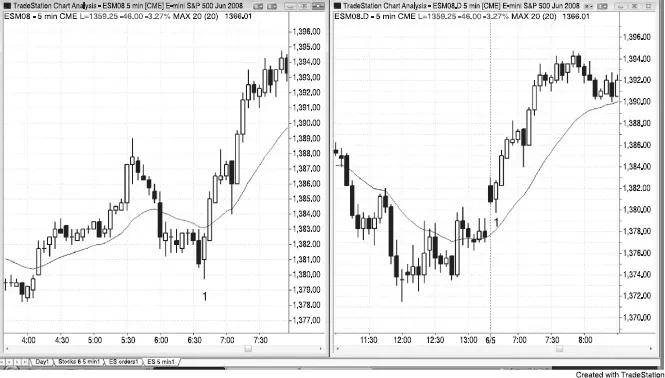
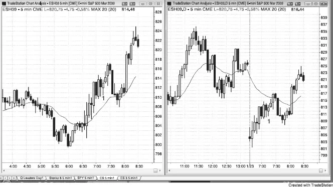

# Chapter 17: Patterns Related to the Premarket

<!-- Source PDF pages 356–358 -->

<!-- PDF page 356 -->

CHAPTER 17
Patterns Related to the Premarket
When looking at tick or volume charts of the Globex Emini, the open is not easy
to spot because it is just part of the 24-hour trading day and appears
indistinguishable from the rest of the chart. In fact, the bar that contains the open
of the day session will almost always contain ticks from before that open. There
is a tendency for the Globex highs and lows to get tested in the day session, and
there are patterns in the Globex that get completed during the first many bars of
the day session. The first hour or so usually moves quickly, and the day session
alone provides great price action. Since most traders are not capable of trading
two charts well, especially in a fast market like after the open, just choose either
the Globex or day session 5 minute chart. It is a matter of personal preference.
Some successful traders watch the Globex all day, but I prefer to watch the day
session. Other traders watch the Globex chart for an hour or so and then switch
to the day session chart. Most trades that set up on the Globex chart will have
price action reasons for traders who watch only the day session to take the same
entry. You should be willing to miss an occasional trade rather than risk losing
money while being confused as you quickly try to analyze two charts while you
place entry, stop, and profit-target orders.
When the market has a large gap on the day session and moves to close it in
the first 30 minutes or so, the moving average on the Globex is often in the
opposite direction to that in the day session during this time. For example, if
there is a large gap down, the moving average for the day session will be down,
but if there was a lower low on the Globex and the market had been rallying for
the 30 minutes before the open, the Globex moving average can be rising and the
Globex prices can be above the moving average. If you look at only the day
session and see a large gap and the market is trending strongly to close it off the
open, look at the momentum and not the moving average, since the momentum
is a reflection of the actual price action that is taking place. Traders who watch
only the day session have to be aware that the moving average is often unreliable
for the first hour or so.
FIGURE 17.1 The Globex and Day Session Usually Give Related Signals

<!-- PDF page 357 -->

As shown in Figure 17.1, the Globex and day session charts usually give signals
at the same time, but often from different patterns. Bar 1 on both the Globex
chart on the left and on the day session chart on the right is the 6:35 a.m. PST
bar. The Globex had a final flag reversal buy signal, and the day session had a
bear trend bar reversal that was a breakout pullback above the two-legged up
move into yesterday's close. Remember that if the first bar of the day is a trend
bar, it is usually a setup for a scalp. If it fails, especially with an opposite trend
bar, it is a setup in the opposite direction.
In the Globex session, bar 1 was below a falling moving average, but bar 1
was above the moving average in the day session. It can take an hour or two
before the moving average is the same in both sessions, and it can provide
different and equally valid setups in each. However, nothing is gained by most
traders who watch both charts, and doing so usually increases the chances that a
trader will not be quick enough to take all of the available trades and will make
mistakes in order placement.
FIGURE 17.2 The Moving Average Is Different on the Globex

<!-- PDF page 358 -->

Sometimes the moving average on the day session is not helpful in the first 30
minutes when there is a large gap. In Figure 17.2, the day session on the right
gapped down and the market could not push above the falling moving average
for more than 90 minutes. However, the rally in the Globex (it trades almost 24
hours a day) on the left began 30 minutes before the open, and the market was
above the rising moving average from 6:30 a.m. PST onward and appeared more
bullish. The 7:20 a.m. barbwire setup at bar 1 was above the moving average and
therefore bullish in the Globex, but below the moving average on the day
session. However, the upward momentum was strong in both, and traders should
have been looking for buy setups.
