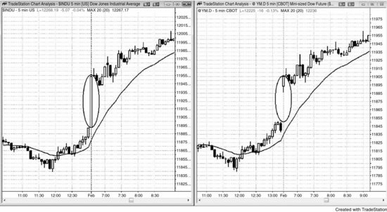
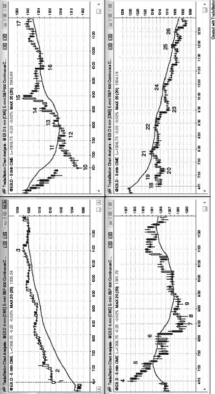

# Chapter 20: Gap Openings: Reversals and Continuations

<!-- Source PDF pages 389–393 -->

<!-- PDF page 389 -->

CHAPTER 20
Gap Openings: Reversals and Continuations
A gap opening on any time frame means that once the bar in question closes, it
does not overlap the bar before it. On most days, there are gap openings on the 5
minute chart. They can be thought of as simple breakouts since the market broke
out of the final bar of the prior day. They should be traded like any other
breakout except traders know that large gaps increase the chance that the day
will become a trend day. The larger the gap, the more likely the day will be a
trend day and the more likely the gap will function as a spike and be followed by
a trending channel in the same direction. For example, a large gap up has
perhaps a 50 percent chance of being followed by a bull channel, a 20 percent
chance of being followed by a trading range, and a 30 percent chance of being
followed by a bear trend. These probabilities are only guidelines because using
computer testing to find exact numbers is subject to too many variables. How big
does a gap have to be to be thought of as large? How much of a rally after the
gap up constitutes a channel instead of just a slightly upward-sloping trading
range? How much of a selloff constitutes a reversal compared to just a deep
pullback? As another guideline, if the gap is the largest gap of the past five days
or so, or if it is larger than about half of the average daily range, it can be
considered to be a large gap.
A large gap opening on the 5 minute chart from yesterday's close represents
extreme behavior and often results in a trend day in either direction. It does not
matter whether there is also a gap on the daily chart, since the trading will be the
same. The only thing that matters is how the market responds to this relatively
extreme behavior—will it accept it or reject it? The larger a gap is, the more
likely it will be the start of a trend day away from yesterday's close. The size,
direction, and number of trend bars in the first few bars of the day often reveal
the direction of the trend day that is likely to follow. Sometimes the market will
trend from the opening bar or two, but more commonly it will test in the wrong
direction and then reverse into a trend that will last all day. Whenever you see a
large gap opening, it is wise to assume that there will be a strong trend.
However, sometimes it might take an hour to begin, and the trend often begins
with a two-legged countertrend move, like a two-legged pullback to the moving
average or a double bottom or top. Sometimes it has a third push and forms a

<!-- PDF page 390 -->

wedge flag. Make sure to swing part of every trade, even if you get stopped out
of your swing portion on a few trades. One good swing trade can be as profitable
as 10 scalps, so don't give up until it is clear that the day will not trend.
The gap should be looked at as if it is one huge, invisible trend bar. For
example, if there is a large gap up and it is followed by a minor pullback and
then a channel type of rally for the rest of the day, this is likely a gap spike and
channel bull trend, with the gap being the spike. For the Emini, you can look at
the S&P cash index and see that the first bar of the day is a large trend bar, and it
corresponds to the gap on the Emini.
Trade the open like any other open and look for a trend from the open, a failed
breakout (a reversal), or a breakout pullback. The only difference from other
days is that you should look to swing more aggressively; and if the day begins to
trend, look for pullbacks where you can add onto your position. You should
always look to take partial profits along the way, which can be scalps, but as
long as the trend is strong, keep looking to take more entries in the direction of
the trend.
Just because there is an increased chance of a trend day does not mean that
there will be a trend day. Most big gap days have some trading range behavior
for the first five to 10 bars as the bulls and bears fight over the direction of the
trend, and some continue as trading range days all day long. Be open to all
possibilities, and don't get locked into a belief. Your job is to follow the market.
You have no ability to influence it and certainly zero chance of telepathically
making it go in the direction that you want. If you are wrong, get out and stop
hoping that the market will do the low-probability thing and suddenly go your
way. If there is a big gap but the price action is unclear, assume that the market is
forming a trading range and look to buy low and sell high. There might be
several scalps before there is a setup that has a good chance of leading to a
swing.
FIGURE 20.1 A Gap Is Just a Spike

<!-- PDF page 391 -->

As shown in Figure 20.1, a gap opening on a 5 minute chart is just another form
of a breakout and a spike. The Dow Futures contract gapped up on the open on
the chart on the right, but that gap on the Dow Jones Industrial Average cash
index on the left was just a large bull trend bar.
FIGURE 20.2 A Gap Can Lead to a Trend Up or Down

<!-- PDF page 392 -->

A big gap opening increases the odds that the day will be a trend day (the trend
can be up or down), but it still can become a trading range day. As shown in the
lower right-hand chart in Figure 20.2, the sideways move from bar 18 to bar 22

<!-- PDF page 393 -->

is an example of several hours of sideways movement after a large gap.
The larger the gap, the more likely the day will be a trend day in the direction
of the gap. For example, bar 1 in the upper left-hand chart was a large gap up
and the day became a bull trend day.
The two charts on the left show large gap up openings; the upper became a
bull trend and the lower became a bear trend. The two charts on the right were
gap down openings; the upper chart became a bull trend and the lower chart
became a bear trend.
Bar 1 was bull trend bar on a large gap up day. The day became a trend from
the open, gap spike and channel bull trend.
Bar 4 was a doji, but it had a bull body. The market trended down for a couple
of hours. The price action down to the bar 7 low of the day had prominent tails,
overlapping bars, and several bull trend bars, all indicating two-sided price
action. The bulls were able to consistently create some buying pressure and
controlled the market in the second half of the day.
Bar 10 was a bull trend bar on a large gap down day, and the day became a
trend from the open bull trend day.
Bar 18 was a doji bar on a large gap down day. The market continued the
sideways price action until the market broke to the downside on the bar 23 bear
spike. The opening doji was a sign of two-sided trading, which continued for
several hours. After the bear spike, the day became a bear trend day, and the
shorts overwhelmed the longs on moving average tests at bars 24, 25, and 26.
Although the shorts were strong at the bars 21 and 22 moving average tests, they
were not yet strong enough to break the market out of the trading range and into
a bear trend.
When there is a large gap up or down and no strong reversal, the trader's
equation can be strong for the with-trend traders. For example, when the market
had the large gap up at bar 1 and it then went sideways, the odds of a bull trend
day went up, maybe to 60 percent or higher. Traders expected the range to reach
about average for recent days, which was about 20 points. The odds of the
market going 20 points higher before closing the gap were probably 60 percent
or better, and therefore traders who bought during those first several bars were
risking about 10 points to make about 15 to 20 points, and they had a 60 percent
chance of success, which is a great trade. They probably could have risked to a
move below the middle of the gap, so their risk might have been six points
instead of 10. In any case, this excellent math is why large gap openings can
offer great trades.
