# Chapter 24: The Best Trades: Putting It All Together

<!-- Source PDF pages 439–504 -->

<!-- PDF page 439 -->

CHAPTER 24
The Best Trades: Putting It All Together
The market is linear—it can only go up or down. When you plot it on a
conventional chart with time on the horizontal axis, you add a second dimension,
but the market itself is only price, which means that it has only one dimension.
You can make bull and bear bodies have different colors, incorporate volume
into the widths of the bodies, or add all kinds of indicators, increasing the
number of dimensions, but the market itself is one-dimensional. The recurring
theme of these books is that the market is basically simple. It moves up or down
because it is constantly searching for the best price, which changes constantly
because of unending changes in countless fundamentals. The fundamentals are
anything that traders feel are important, and include data on every stock, the
overall market, politics, natural and manmade events from earthquakes to wars,
and international factors. This results in the market always trying to break out
from a trading range (its current area of agreement on the value of the market)
into a trend, as it searches for the appropriate instantaneous value for the market.
If the breakout is to the upside, the bulls are momentarily successfully asserting
their opinion that the market is too cheap. If there is instead a downside
breakout, then the bears at least briefly are winning their argument that the
market is too expensive. Every breakout attempt is met by traders holding the
opposite belief, and they will try to make the breakout fail and the market
reverse. This is true on every time frame and on every bar and series of bars. The
trading range can be a single bar or a hundred bars, and the breakout can last one
bar or many bars. The key to trading is developing the ability to assess whether
the bulls or bears are stronger. When a trader believes that the odds favor one
side over the other, he has an edge. The “odds” refers to the trader's equation. An
edge (positive trader's equation) exists if the probability of a trade reaching his
profit target before hitting his protective stop is greater than the probability of
the market hitting his stop before reaching his target. Having an edge gives him
an opportunity to make money by placing a trade.
Every type of market does something to make trading difficult. The market is
filled with very smart people who are trying as hard to take money from your
account as you are trying to take money from theirs, so nothing is ever easy. This
even includes making profits in a strong trend. When the market is trending

<!-- PDF page 440 -->

strongly with large trend bars, the risk is great because the protective stop often
belongs beyond the start of the spike. Also, the spike grows quickly, and many
traders are so shocked by the size and speed of the breakout that they are unable
to quickly reduce their position size and increase their stop size, and instead
watch the trend move rapidly as they hope for a pullback. Swing traders are
often uncomfortable entering on the spike because they prefer trades where the
reward is two or more times the size of the risk. They are willing to miss a highprobability trade where the reward is only equal to the size of the risk.
Once the trend enters its channel phase, it always looks like it is reversing. For
example, in a bull trend, there will be many reversal attempts, but almost all
quickly evolve into bull flags. Most bull channels will have weak buy signal bars
and the signals will force those bulls who prefer stop entries to buy at the top of
the weak channel. This is a low-probability long trade, even though the market is
continuing up. Swing traders who are comfortable taking low-probability buy
setups near the top of weak bull channels love this kind of price action, because
they can make many times what they are risking and this more than makes up for
the relatively low probability of success. However, it is difficult for most traders
to buy low-probability setups near the top of a weak bull channel. Traders who
only want to take high-probability trades often sit back and watch the trend grind
higher for many bars, because there may not be a high-probability entry for 20 or
more bars. The result is that they see the market going up and want to be long,
but miss the entire trend. They only want a high-probability trade, like a high 2
pullback to the moving average. If they do not get an acceptable pullback, they
will continue to wait and miss the trend. This is acceptable because traders
should always stay in their comfort zone. If they are only comfortable taking
high-probability stop entries, then they are correct in waiting. The channel will
not last forever, and they will soon find acceptable setups. Experienced traders
buy on limit orders around and below the lows of prior bars, and they will
sometimes take some short scalps during the bull channel. Both can be highprobability trades, including the shorts, if there is a strong bear reversal bar at a
resistance level, and some reason to think that a pullback is imminent.
Once the channel phase ends, the market enters a trading range, where there
are many strong bull spikes that race to the top and strong bear spikes that race
to the bottom. Traders often focus on the strong spike and assume that the
breakout will succeed. They end up buying high and selling low, which is the
exact opposite of what profitable traders do. Also, the reversals down from the
top and up from the bottom usually have weak signal bars, and traders find it
hard to take the entries that they have to take if they expect to make money in a
trading range. Within a trading range, the probability for most trades hovers

<!-- PDF page 441 -->

around 50 percent, and only occasionally gets to around 60 percent. This means
that there are few high-probability setups. Also, lots of low-probability events
happen, like reversals that don't look good but still lead to big swings, and no
follow-through after strong spikes.
All of this makes it sound impossible to make money as a trader, but if you go
back to each relevant section, you will remember that there are profitable ways
to trade the market, no matter how it is behaving. Your edge is always going to
be small, but if you are a careful, unemotional, and objective reader of the chart
in front of you, and only look to take the best trades, you are in a position to
make a living as a trader.
There are traders trading for every reason and on all time frames at every
second on every chart. What generalities can be made about how discretionary
traders, whether institutional or individual, will trade a bull trend? A bull trend
begins with a breakout, which is a spike up, and can contain one or many bull
trend bars. If the breakout fails, the market will fall back into the trading range,
and traders will fade the breakout (it will be a final flag reversal) and continue to
trade the trading range. When a breakout is strong and successful, most
discretionary traders will buy with a sense of urgency. They will buy at the
market, on small pullbacks, at the close of the bar, and above each prior bar.
Once the market transitions into a channel, they will buy below the low of the
prior bar, like below low 1 and low 2 signal bars, expecting reversal attempts to
fail (in a trend, most reversal attempts fail), and above the high of the prior bar,
like above high 1, high 2, and triangle buy setups. They will then buy pullbacks
from the breakouts of these small bull flags. They will even buy the first
breakout of a bear micro channel in a strong bull trend, knowing that there might
not be a breakout pullback setup until after the market has rallied many bars.
Early on, when the trend is strong, they will buy on new breakouts above prior
swing highs, but as the two-sided trading (selling pressure) increases, as seen by
more and larger bear trend bars and more bars with tails on their top, traders will
begin to sell above prior swing highs. Most will be selling to take profits on their
longs, but as the slope of the channel becomes flatter and the pullbacks become
deeper, more traders will start to short above swing highs, looking for scalps.
When the two-sided trading increases to the point that the bears are about as
strong as the bulls, traders will see the market as having entered a trading range.
This means that they are much less certain that the trend will resume on each
rally attempt (they no longer are looking for pullbacks in a strong bull trend,
where the breakout usually quickly tests the old high). They will buy low, sell
high, and most will scalp. They will look for high 1 and high 2 buy setups near
the top of the range, and will short above the signal bars, instead of buying up

<!-- PDF page 442 -->

there. At first, they will only look for scalps, like pullbacks to the moving
average, the bottom of the trading range, or the bottom of the bull channel. Once
they see increasing selling pressure, they will begin to swing some and
eventually all of their shorts, and will only look to buy deep pullbacks, lasting 10
or more bars and having two or more legs. After there has been one or more
pullbacks where the selling was strong enough to break below the trend line and
below the moving average, some bears will look to short the test of the bull trend
high, expecting a major trend reversal. They will short a reversal setup at a lower
high, a double top, or a higher high, even though they realize that the chance of a
swing down might be 40 percent or less. As long as the reward is much larger
than the risk, they have a positive trader's equation, even though the chance of
success is relatively low. Bulls will buy reasonable setups at the bottom of the
trading range, like on larger high 2 buy setups, wedge bull flags, higher time
frame trend lines, and measured move targets. Traders realize that a trading
range is simply a pullback on a higher time frame chart. When the spike and
channel are steep on a 5 minute chart, they together form a simple spike on a
higher time frame chart, like a 15 or 60 minute chart. The trading range on the 5
minute chart is usually just a pullback on a 15 or 60 minute chart. When bulls
buy near the bottom of a 5 minute trading range, many will hold for a swing up,
a breakout to a new high, and a measured move up, even though the probability
may be less than 50 percent. This relatively low-probability swing long has a
positive trader's equation because the reward is much larger than the risk.
While in the trading range phase, signals are often unclear, and there is a sense
of uncertainty. Most of the signals will be micro double bottoms and tops, and
small final flag reversals. This is lower probability trading, and traders have to
be careful and quick to take profits (scalp). They must force themselves to buy
low and sell high, not buy strong bull spikes near the top of the range and short
strong bear spikes near the bottom. Invariably, the spikes look strong, but don't
overlook all of the bars before them—in a trading range, most breakout attempts
fail. Once the market has entered a trading range, if a leg is in a strong micro
channel, lasting four or more bars, don't enter on the breakout. Wait to see if the
breakout is strong. If so, enter on the pullback from the breakout. If there is a
bear micro channel down to the bottom of the range, wait for the bull breakout
and look to buy the pullback, whether it forms a higher low, a micro double
bottom, or a lower low. If there is a bull micro channel up to the top of the range,
wait to sell a lower high, micro double top, or higher high pullback. As with all
trades, always make sure that there is an appropriate signal bar.
If the market enters a tight trading range, wait for the breakout, because tight
trading ranges trump everything, including every logical reason to take a trade.

<!-- PDF page 443 -->

Using stop entries in a tight trading range is a losing strategy, but the setups
always look worthwhile. Instead, patiently wait for the breakout and then decide
if it is likely to succeed or fail.
If there is a successful breakout of the top of the entire trading range, the
process starts all over again. Traders will see the breakout as a spike and they
will look for at least a measured move up. If there is an upside breakout, but it
fails and the market reverses, traders will view the trading range as the final flag
in the bull trend. If there is then a breakout below the trading range, traders will
evaluate the strength of the breakout, and if it is strong, they will repeat the
entire process in the opposite direction. The downside breakout from the trading
range can occur without first having a failed upside breakout. Instead of a final
flag reversal, the trading range can be some other kind of reversal setup, like a
double top, a triple top, a head and shoulders top, or a triangle. All that matters is
that there is a strong downside breakout, and traders will then expect pullbacks
and a bear channel to follow the bear breakout, and then the market to evolve
into a trading range, which can be then followed by a bull or bear breakout.
Examples of best trades include:
Opening reversals where the setup is strong:

Swing for a reward that is at least twice the risk: the probability of
success is 50 to 60 percent.
Scalp for a reward that is at least as large as the risk: the probability is
about 60 to 70 percent.
Strong reversals, where the reward is at least twice the risk and the
probability is 50 to 60 percent:

Major trend reversal: Following a strong break of the trend line, look
for a weak trend resumption to fail on a test of the trend's extreme; the
reversal signal bar should be strong. After a bear trend, look to buy a
higher low, double bottom, or lower low. After a bull trend, look to
short a higher high, double top, or lower high.
Strong final flag reversal after a swing up or down in a trading range
or weak channel.
Buying a third or fourth push down in a bear stairs pattern for a test of
the low of the prior push down.
Selling a third or fourth push up in a bull stairs pattern for a test of the
high of the prior push up.
Trading when the channel in a spike and channel day or the breakout
in a trending trading range day reaches a measured move target and the

<!-- PDF page 444 -->

move is weakening.
Buying a high 2 pullback to the moving average in a bull trend.
Selling a low 2 pullback to the moving average in a bear trend.
Buying a wedge bull flag pullback in a bull trend.
Selling a wedge bear flag pullback in a bear trend.
Buying a breakout pullback after a breakout from a bull flag in a bull trend.
Selling a breakout pullback after a breakout from a bear flag in a bear trend.
Buying a high 1 pullback in a strong bull spike in a bull trend, but not after
a strong buy climax.
Selling a low 1 pullback in a strong bear spike in a bear trend, but not after
a strong sell climax.
Shorting at the top of a trading range, especially if it is a second entry.
Buying at the bottom of a trading range, especially if it is a second entry.
Entering using limit orders requires more experience reading charts, because
the traders are entering in a market that is going in the opposite direction to their
trade. Traders should only use limit orders to trade in the direction of the trend.
For example, if a trader is thinking about using a limit order to buy at the low of
the prior bar, he should only do so if the market is always-in long, or he thinks
that it is likely to immediately switch to always-in long. He should never buy
with the intention of scalping the long and then shorting once the low 2 sell
setup forms if he believes that the market is still always-in short and is likely to
have only one more small push up. The probability of success is simply too low
when using limit orders to trade countertrend. The low probability results in a
losing trader's equation and you will lose money, unless you are an exceptional
profitable and experienced scalper. Surprises in trends are usually in the
direction of the trend, so when you think that the low 1 in a bear trend is weak
and that the market should have one more push up, the odds are too great that it
will not. However, experienced traders can reliably use limit or market orders
with these potential best trade setups:
Buying a bull spike in a strong bull breakout at the market or on a limit
order at or below the low of the prior bar (entering in spikes requires a
wider stop and the spike happens quickly; this combination is difficult for
many traders).
Selling a bear spike in a strong bear breakout at the market or on a limit
order at or above the high of the prior bar (entering in spikes requires a
wider stop and the spike happens quickly; this combination is difficult for

<!-- PDF page 445 -->

many traders).
Buying at or below a low 1 or 2 weak signal bar on a limit order in a
possible new bull trend after a strong reversal up or at the bottom of a
trading range.
Shorting at or above a high 1 or 2 weak signal bar on a limit order in a
possible new bear trend after a strong reversal down or at the top of a
trading range.
Buying at or below the prior bar on a limit order in a quiet bull flag at the
moving average.
Shorting at or above the prior bar on a limit order in a quiet bear flag at the
moving average.
Buying below a bull bar that breaks above a bull flag, anticipating a
breakout pullback.
Selling above a bear bar that breaks below a bear flag, anticipating a
breakout pullback.
When trying for a swing in a bull trend, buying or buying more on a
breakout test, which is an attempt to run breakeven stops from an earlier
long entry.
When trying for a swing in a bear trend, selling or selling more on a
breakout test, which is an attempt to hit breakeven stops from an earlier
short entry.
Buying a pullback in a strong bull trend at a fixed number of ticks down
equal to or slightly less than the average prior pullbacks.
Selling a pullback in a strong bear trend at a fixed number of ticks up equal
to or slightly less than the average prior pullbacks.
When a bear trend is about to break into a bull trend and needs one more
bull trend bar to confirm the always-in reversal, and the breakout does not
look strong, sell the close of the bull breakout bar, expecting the followthrough bar not to confirm the always-in flip and the bear trend to resume.
When a bull trend is about to break into a bear trend and needs one more
bear trend bar to confirm the always-in reversal, and the breakout does not
look strong, buy the close of the bear breakout bar, expecting the followthrough bar not to confirm the always-in flip and the bull trend to resume.
Here are some guidelines that beginners should consider following until they
are consistently profitable (at that point, they can expand their repertoire):
Take a trade only where you are going for a reward that is at least as large

<!-- PDF page 446 -->

as your risk. When starting out, focus on trades where the reward is at least
twice as large as the risk.
Take trades only if you think they probably will work. Don't even worry
about how far the move might go. You have to simply ask yourself if the
setup looks good. If so, you should assume that the probability is at least 60
percent (the directional probability of an equidistant move was discussed in
Chapter 25 on mathematics in the second book). With the potential reward
at least as large as the risk, this creates a positive trader's equation.
Enter only on stops.
Always have a protective stop in the market, because belief and hope will
not protect against a premise that is failing.
Have a profit-taking limit order in the market so that you will not get
greedy and watch your profit disappear as you hope for more.
Buy only above bull bars and short below bear bars.
Trade only a small position size. If you think that you can trade 300 shares,
you should trade only 100 shares so that you are in “I don't care” mode.
This will allow you to be more objective and less easily swayed by
emotions.
Look for only three to five reasonable trades a day. If in doubt, stay out.
Look for simple strategies. If something is not clear, wait.
The best choices for a trader starting out are trends that develop in the
opening range, strong trend reversals, and pullbacks in strong trends.
Most traders starting out will experiment with scalping for a profit target that
is about as large as the risk, or swinging for a target that is at least twice as large
as the risk, or a combination of the two, because they want to see if they can be
successful and if one style better suits their personalities. There is no one right
way, since all three have positive trader's equations when traded properly. The
single best trade is a high-probability swing, because it gives traders flexibility,
creating a bigger margin for error. The high probability allows scalpers to take
partial or full profits and enables swing traders to make larger profits, giving all
traders a good chance of making money, even if they take profits too early or too
late. There are usually two or three a day. Most are either always-in reversals or
pullbacks in strong trends.
If you are willing to take low-probability trades where the reward is at least
twice the risk, you need to take every reasonable setup, because the math is
against you if you cherry-pick. The trader's equation for these trades is positive
for a basket of them, but the odds are that any one trade will lose (the probability

<!-- PDF page 447 -->

is less than 50 percent, so most will lose). There will usually be only one or two
choices a day where the reward is several times as large as the risk, but the signal
is not strong (so the probability is low), and if you are patient, you will be able to
anticipate them. Remember, the probability is low because the setup looks bad.
If the setup is strong, then the probability might be 60 percent or greater. When
that is the case, each trade has a positive trader's equation and cherry-picking is
mathematically acceptable. Until a trader is reasonably successful, when he takes
reversal trades, he should only trade them if the setups are especially strong (like
a 60 percent probability). Every one of these reversals is likely to result in an
always-in flip. However, it is important to realize that not all always-in reversals
happen as reversals trades. Many often come as strong breakouts that have
follow-through.
The mathematics of every trade is critical, and not thinking about it is the
main reason people lose money. They see a strong bull reversal bar and quickly
enter one tick above its high, ignoring that it is the fourth large overlapping bar
in a tight trading range. They see four consecutive, large, bear trend bars creating
a strong bear spike, and they short on the close of the fourth bar, ignoring that
the spike is a simple bear leg that is testing the bottom of a trading range. They
see a bull spike that is soon followed by a low 2 signal bar. They short below it,
expecting a reversal, but not realizing that the market is more likely in the early
stages of a strong bull channel. The market can change quickly when a person is
considering a trade, and traders often struggle to give adequate attention to the
strength of the signal and entry bars, the placement of their orders, the overall
risk, where they should take profits, whether they are up or down on the day, and
all sorts of personal issues. They often cannot process anything else, and that can
leave them ignoring the most important consideration—does their plan have a
positive trader's equation? Is the probability of success times the reward greater
than the probability of failure times the risk? There is a natural tendency to
assume that if most of what they are studying looks good that the trade should
work, which is a proxy for thinking about the specific math, but it is always
better to make sure that your plan is logical. For example, I saw a video on
YouTube where the trader carefully explained that he always traded a second
Emini contract, scalping it at a one tick profit, so that it would cover his
commissions. He had a website and claimed that he was a profitable trader, and
he might well have been, but it was not because of this second contract. He was
risking to his protective stop, about eight ticks away, on both contracts. That
means that he was risking eight ticks to make one tick on his second contract.
This requires the market to move three ticks beyond the signal bar before hitting
his protective stop in 90 percent of his trades just to break even on that second

<!-- PDF page 448 -->

contract. Since it is very unlikely that this happens, then his second contract is
losing money on average, even if it makes money on it 80 percent of the time!
He might make enough on his first contract to more than overcome his losing
strategy on the second contract, resulting in him being profitable at the end of
the month, but he would be more so if he understood the math. If a trader has
any strategy, he has to consider the math. If the market is moving too fast for a
trader to consider the math of the current setup, he should not take the trade.
Instead, he should wait to enter later, and only if he can convince himself that his
strategy has a positive trader's equation.
Any kind of trade can be a best trade in the right circumstances, and some of
the best traders have personal preferences. Paul Tudor Jones reportedly likes to
trade reversals, Richard Dennis was a well-known breakout trader, Paul Rotter is
a scalper, John Henry traded a basket of markets using an always-in approach,
and just about all traders like to trade pullbacks. I prefer high-percentage trades,
and my most common trades are pullback entries and trading range fades. I
especially like breakouts because when they are strong the probability of followthrough is often more than 70 percent. I look less often for reversal trades,
because most reversal attempts fail, but I will take a strong reversal setup.
After reading three books and 570,000 words, where does a trader begin?
Book 1 dealt with trends, which is when the market is largely one-sided. Book 2
discussed trading ranges, where the trading is two-sided, and breakouts, which
are transitions from trading ranges into trends. Book 3 has handled reversals,
where a trend transitions into an opposite trend, or at least into a trading range.
There is far more information than anyone can process all at once, and it is best
for traders to pick one or a few approaches starting out. Some trades are
illustrated in this chapter, and a trader who is interested in a particular setup can
find more information about it in the relevant chapter of the appropriate book.
As traders become more skilled and learn more about their personality, they will
discover that they are more comfortable and successful with particular patterns
and market conditions. Rather than fighting the market or their emotions, they
should try to stay in their comfort zone and not worry about all of the other great
trades that they are missing. If they followed dozens of markets and time frames
and tried to catch the hundreds of set-ups that they would see every day, they
would still end up trading between five and 20 setups a day and ignoring the rest.
Since the 5 minute chart of any major market has between five and 10 best
trades a day, traders stand a better chance of consistently making money in the
long term if they just focus on a single market and time frame, like 5 minutes,
work hard to spot those best trades as they are unfolding, and then carefully
place their orders and manage their trades. Then they should gradually increase

<!-- PDF page 449 -->

their volume, which will put them in a great position to make more money than
they ever imagined, and all from a single chart. Trading is as simple as that; but
as simple as it is, it is always extremely difficult to do in real time because it is a
zero-sum game with edges that are always small, and the competition is the best
in the world.
The market either is certain that the price is wrong and is moving in a trend in
search of an area of agreement (a trading range), or it is in an area of agreement,
waiting for a disagreement (a breakout) to develop. As a trend progresses, it
pauses and breaks out again. At some point, traders believe that it has gone too
far and they start to fade the breakouts, expecting them to fail and a trading
range to develop. This creates double tops and final bull flags in bull trends and
double bottoms and final bear flags in bear trends. The final bull flags are
usually high 1 or high 2 setups, or triangles, and the final bear flags are low 1 or
low 2 setups, or triangles. With time, disagreement sets in while in the trading
range, and the market breaks out again in search of a new area of agreement. The
breakout sometimes fails, and the market then searches in the opposite direction
in the form of an opposite trend. This same process happens all day long in every
market and on every time frame. The math favors the breakout in about half of
the cases, and the failed breakout and reversal in the other half. The key to
trading is being able to assess if one side has enough of an edge to create a
positive trader's equation.
Making money always has to be a trader's primary objective, and the long,
boring stretches, interrupted by brief moments of anxiety and uncertainty, are
inescapable components of the job. If traders wait several hours and there is no
setup, they will tend to become complacent. Once the trade begins to set up, they
will sometimes not be mentally ready to take the trade. However, that is a
challenge that they must learn to overcome. They are trading to make money,
and they must learn to perform when the time is right. Firefighters wait for days,
never knowing when the alarm will sound, but when it does, they have to act
immediately and perfectly. They are professionals and get paid to do their job
correctly. Traders also wait for events that come only occasionally, but they have
to learn to be professionals and respond quickly and precisely when the time
comes. If they can learn to be comfortable in this environment, they are in a
good position to make a living as a trader.
A friend once told me that he lost money for many years and never made
money until he stopped taking countertrend scalps. He now makes over a million
dollars a year. He discovered the importance of taking the best trades, and that
made all the difference. Other than when traders are taking a strong reversal

<!-- PDF page 450 -->

setup, they should look to buy only when the market is mostly above the moving
average and sell when most of the recent bars are below the moving average. If
the market seems to be going both above and below, they should wait until it
clearly is mostly on one side or the other. They should avoid countertrend scalps
(and all scalps where the risk is greater than the potential reward), which always
look so good and are profitable often enough to make traders believe that they
just need more practice, but have a negative trader's equation and will slowly
make a trader's account disappear. Countertrend scalps are most tempting in
weak channels, where the with-trend setups just don't look strong enough, there
are great-looking reversal bars at every new extreme, and traders are becoming
anxious because they have not taken a trade in so long. For example, if there is a
weak bear channel, there will usually be a bull reversal bar soon after each
breakout to a new low. However, they are caused by profit-taking bear scalpers
who are looking to short again just a few ticks above the high of the bar. An
impatient trader who buys above the bull reversal bar on a stop will consistently
lose money, because he will lose on 70 percent of his trades and his average loss
will be larger than his average win. Always patiently wait for with-trend setups,
and if there are none that you like, don't trade, and never take a tempting
countertrend scalp. Once the market has clearly transitioned into a trading range,
traders can then trade in both directions. However, most beginners start to trade
countertrend while the market is still in a channel, long before it evolves into a
trading range. If a trader cannot confidently make the distinction, he should only
trade with trend.
Another common mistake is to look at 1 minute charts or other smaller time
frame charts, like tick and volume charts where there are one or more bars every
one or two minutes. The trades are very easy to spot at the end of the day and,
because the bars are smaller, the risk is less per trade; but most are hard to trade
in real time. The best ones happen fast and are easy to miss, and most traders
then end up taking the ones that aren't very good. The market is always trying to
reverse, and reversals occur on the 1 minute chart every three to 10 bars.
However, most do not go far enough for a profitable scalp and instead become
flags in the larger trend. A trader who just shorted a 1 minute top in a 5 minute
bull trend will invariably lose and end up missing the 5 minute buy signal that
the failed 1 minute top will create. If your goal is to make money (and that
should be your goal), take only the best trades and avoid 1 minute charts. If,
however, this is just an exciting hobby for you, remember that hobbies cost
money and there may be another one out there for you that is just as much fun
and much less expensive.
When thinking about taking a trade, a trader has to decide whether to buy or

<!-- PDF page 451 -->

sell, enter on a stop or with a limit order, swing or scalp, trade his usual position
size or smaller, and use his usual protective stops and profit targets or ones that
are larger or smaller. This generates far more trader's equations than he could
possibly evaluate in the limited time available. Once he makes all of these
decisions, he then has to correctly place his orders and manage his trades. This is
virtually impossible to do when a trader is starting out, so he should therefore
look for ways to reduce the number of decisions that he has to make.
Most traders should keep things simple and try to do the same thing on every
trade until they are consistently profitable. Stop entries are better than limit
entries for a trader starting out. For example, if the market is in a bull trend and
he is deciding to either buy on a stop above the high of the prior bar or with a
limit order at the low of the prior bar, he should choose a stop entry, because the
market is going his way when he enters and the odds that it will continue are
higher. If he buys using a limit order, there is too much risk that the pullback will
fall so far that he will get upset and exit with a loss just before the trend resumes.
He should also begin by trading the same position size, the same size protective
stop, and the same size profit target on every trade. He should either swing or
scalp, but always use a profit target that is at least as large as his protective stop.
He should not change his plan once he is in the trade, like converting a swing to
a scalp, a scalp to a swing, or, worse, a scalp to one that is smaller than the size
of his risk. If he finds himself changing his plan after he enters, he should just
place his bracket orders, walk away, and come back in an hour. If he is worried
about money as soon as he places his trade, he needs to trade a much smaller
position size. If he has been trading 500 SPY shares, he should trade only 100,
so that he is in “I don't care” mode. It is better for a trader to win on 60 percent
of his trades using 100 shares than losing on 80 percent using 500 shares because
of anxiety that prevents him from following his plan. If he is always eager to
place trades, but constantly wants confirmation, resulting in him only buying at
the top of a strong bull spike or selling at the bottom of a strong bear spike just
before a reversal, then he needs to work on patience. He should avoid entering
on breakouts and only enter on pullbacks. To improve his patience, he could try
limiting himself to three trades a day. Once he has taken them, he would have to
wait until the next day before placing another trade. It takes a long time to
become patient and able to not take trades while watching a lot of great ones go
without you. When he has any doubt about a setup, he should assume that the
confusion is his radar telling him that the market is in or about to enter a trading
range, at which point he should only buy low and sell high. A beginner who is
looking to take his first trade should consider looking for swing trades either in
trends that start in the opening range or in strong trend reversals at any time of

<!-- PDF page 452 -->

the day. The potential reward should be at least twice as large as the risk.
Although the forex market is essentially a 24-hour market and has no real open,
it otherwise behaves like stocks and futures and should be traded in the same
way. If a trader picks setups with strong signal bars and where the context is
good, especially if it is a second signal, the probability of success is often 60
percent, creating a strong trader's equation. The trades that do not reach the
profit target are either small losses or wins that approximately offset one another,
so the overall risk is acceptable. Traders usually can learn to anticipate a setup
many bars before it actually triggers, which enables them to be prepared
emotionally when the setup is about to trigger. With experience, they can take
more trades every day and begin to look for setups where the probability of
success is at least 60 percent and the reward is at least as large as the risk
(instead of at least twice as large, as is the case for swing trades). There are
usually between five and 10 setups like this every day on a 5 minute chart, and
since the reward is relatively small compared to the risk, these are scalps (a
swing has a profit target that is at least twice as large as the risk). A high 2
pullback to the moving average in a bull trend where there is a strong bull signal
bar is an example. A low 2 pullback to the moving average in a bear trend where
there is a bear signal bar is another. After traders gain more experience, they can
begin to enter during strong spikes. Consistently profitable traders can add any
other setup with a positive trader's equation, even if it is not a best trade,
including some scalps where the potential reward is less than the risk and the
probability is 80 percent, and swing setups where the potential reward is much
larger than the risk but the probability is only about 40 percent. They can begin
to fade the tops and bottoms of trading ranges (especially on second signals),
where they have a reasonable expectation that the always-in trade is about to flip
into their direction. Trading breakouts is a good strategy, but is difficult to do for
traders starting out, and most traders should instead wait to enter on pullbacks.
Traders often struggle as they decide what their initial stop should be. If the
context is good, then the probability of an equidistant move up in a bull (or down
in a bear) is 60 percent, as long as the risk is not too big or too small (like using
a two-tick stop when the bars are 50 ticks tall). All trades where a trader chooses
a risk that is not too big will have a positive trader's equation. If the bars are
unusually large, like 50 ticks tall, a trader can use an eight-tick protective stop
and reward, or a 19-tick stop and reward, and have a positive trader's equation. It
does not matter what the trader chooses, as long as the reward is at least as large
as the risk, and the risk is not too big or too small. Most traders instinctively
know what too big is, like having a protective stop that is larger than the tallest
bar on the chart, and what too small is, like using a stop that is smaller than

<!-- PDF page 453 -->

normal when the bars are much bigger than normal. Just use something in
between, like your usual stop, or 50 to 100 percent larger. Knowing this takes
some stress out of the decision making. Just quickly pick a stop size that seems
reasonable. If the bars are very large, you can use your normal stop, like maybe
eight ticks in the Emini, or one that is two to three times bigger, as long as you
use a reward that is at least as big.
Any trade with a positive trader's equation is a mathematically sound trade.
For example, if a trader has a 50 percent chance of making $2.00 in AAPL
before losing $1.00, the trade has a positive trader's equation and is a good trade.
If the trader has a 60 percent chance of making $1.00 before losing $1.00, or a
40 percent chance of making $3.00 before losing $1.00, it also is a good trade.
These are all trades that experienced traders take every day and make consistent
profits by doing so. Among the good trades, there are trades that are especially
good because the setup is unusually strong due to a confluence of supporting
factors and a strong signal bar, and because the trader's equation is very positive.
The very best trades have either a 60 to 70 percent chance of making a reward
that is at least as large as the risk or a 50 to 60 percent chance of making two or
more times the risk. These are the trades that beginners should primarily take,
because trading is difficult and these trades have the biggest margin for error and
offer the best chance of generating profits. For example, suppose there is a bull
trend that has a strong selloff to well below the moving average, then a wedgeshaped rally to a marginal higher high; the rally has several prominent bear
bodies in it, indicating strong selling pressure, and there is a strong bear reversal
bar that pokes above a longer-term bear trend line. Traders shorting below that
bear reversal bar probably have about a 70 percent chance of making two to four
times their risk. A strong reversal setup comparable to this forms several times a
week in every major market, and there are reversals almost every day that are
almost as good.
A trend reversal can be trickier for beginners because most reversals fail, and
beginners tend to be overly eager and enter on weak setups. For a major trend
reversal, there has to be a strong break of a major trend line, with the first
reversal leg showing a lot of momentum and having a strong reversal bar. Smart
traders will then wait for a test of the trend's extreme and enter on a successful
test (a lower high, double top, or higher high in a market top, or a higher low,
double bottom, or lower low in a market bottom). They want the signal bar to be
a strong reversal bar. If the setup does not have every one of these components,
they should not take the trade. The stop management is the same as for the trend
trades described earlier. A major reversal has a potential reward that is many
times as large as the risk. Those with a chance of success of better than 60

<!-- PDF page 454 -->

percent form only a few times a week, but other best trade reversals where the
probability is 50 to 60 percent and the reward is at least twice the risk occur just
about every day in every market. There will usually be a pullback before the
target is hit, and many traders have a hard time holding on to a trade that had a
scalper's profit and now is back to their entry price. However, if the original
premise is still valid, that is the better choice.
There are also strong setups in the opening range on most days. For example,
if the market gaps up on the open, rallies for a few bars, pulls back to the moving
average, forms a double bottom with the first bar of the day, and has a strong
bull reversal bar, there is probably at least a 60 percent chance that a long above
that signal bar will lead to a profit that is several times the risk over the course of
the next few hours. There is a reasonable swing setup that begins during the
opening range on more than 80 percent of the days. A trader will often have to
take several signals before one finally evolves into a trend, but the trades that do
not are usually small profits and losses that offset each other. Most reversals in
the opening range have only a 30 percent chance of generating a reward that is
two or more times greater than the risk. However, there is usually at least one
where the probability is about 60 percent, and traders should work hard to learn
to spot that best setup. When they find one, they have to hold through pullbacks,
since reversals are common in the opening range, even after a strong signal
triggers. It sometimes takes a while before the trend breaks out. Alternatively,
they can trade all of the reasonable reversal setups and scalp for a reward that is
at least as large as the risk. Even though the probability of making twice as much
as the risk may be only 50 percent on a strong setup, the probability of making
as much as they are risking is often 60 percent or more, creating a positive
trader's equation. The setups were described earlier in this book in Part III on
trading the open, and the math is discussed in the second book.
If traders are comfortable trading in a fast market and increasing their risk,
they can enter with the trend during strong spikes. For example, they could sell
the close of the second, third, or fourth bar of a strong bear spike, and use a wide
stop to possibly even above the top of the spike. However, they would rarely
have to risk that much. If they used a wide stop, they would have to reduce their
position size, but would still have at least a 60 percent chance of making as
many ticks as they had to risk. If the spike was very strong and the context was
right, they might be able to risk less than half of the height of the spike and still
have a 70 percent chance of making at least twice as much as they had to risk.
The difficulty is that the spike happens so quickly that beginners are usually not
able to make the adjustments needed in the time that the market is giving them.
They have to increase their risk and reward and have to emotionally adjust to a

<!-- PDF page 455 -->

large, fast move, and this is usually more than most beginners can process. The
key to any of these best trades is the ability to recognize them as they are
forming, and that takes practice. However, if traders learn to recognize just one
and carefully wait for it every day, they are putting themselves in a good position
to make money.
Another example of a best trade occurs after a strong spike ends. For example,
say a market just had a four-bar bear spike that broke far below a trading range
where the bars in the spike had small tails and bear bodies of moderate size (not
so big as to be climactic), and the market is now forming a low 2 pullback to the
moving average with a bear reversal bar for the signal bar. This setup has at least
a 70 percent chance of making a profit that is at least as large as the risk.
Some of the best trades are on strong trend days when most of the bars are on
one side of the moving average, and there are only a couple of moving average
pullbacks during the day. These strongest trend days happen only a couple of
times a month, but there are reliable trends almost every day. Entering on those
pullbacks, especially if they are high 2, wedge, or triangle buy setups at the
moving average in a bull trend, or low 2, wedge, or triangle short setups at the
moving average in a bear trend, are probably the single most reliable day trades
that a trader can make. If traders follow a basket of about five stocks with large
volume (over about five million shares traded each day) and an average daily
range of two dollars or more, then they should be able to make one or two trades
every day where they can net about one-third of the average daily range on the
scalp portion of their trade and usually more on the swing portion, while risking
about half of the reward. After entering, they should place a protective stop
beyond the signal bar (they rarely will have to risk more than one dollar and
usually under 60 cents) until the entry bar closes, and then once there is a trend
bar in their direction, they should move the stop to just beyond the entry bar. For
example, if the stock has an average daily range of three dollars, once the stock
moves about 60 to 80 cents in their direction, they should move the stop to
breakeven, or maybe a few pennies worse. If they bought at $120.10 and the
stock hit $120.80, they should move their stop to around $120.07. After they exit
half or so of the trade on a limit order at one dollar of profit, they should rely on
their breakeven stop. They should trail this protective stop beyond swing lows
on the 5 minute chart, and take a little more off at two dollars’ profit. They
should consider letting the final portion run until the stop is hit or a clear and
strong opposite signal develops.
If buying a pullback in a bull is such a great trade, why is it so challenging to
make money as a trader? It is because there are problems with every setup, and it

<!-- PDF page 456 -->

is often difficult to believe that a setup is really as good as it is until a bar or two
after it triggers and you are on the sidelines, watching regretfully. Every pullback
starts as a reversal, and when it is time to buy that bull flag, you might still be
haunted by that bear reversal and be too afraid to buy. Sometimes as a trend is
starting out, it is still within a larger trading range. Since it is best to buy low and
sell high in a trading range, traders will hesitate to buy a high 2 at the top of a
bull leg because it is at the top of a trading range and has not yet broken out.
However, if the overall context is good and the rally and setup are strong, it is
the right thing to do. Similarly, shorting a low 2 at the bottom of a trading range
is the correct trade when the market is likely beginning a bear trend. If traders
are not certain, they should wait until they are more confident, but as long as
they believe that the trader's equation is strongly in their favor, they must learn to
take the trade. Yes, they will often lose, but the math is on their side. Remember,
a great baseball hitter fails 70 percent of the time, but still makes millions of
dollars from that other 30 percent. An experienced trader can win 60 percent or
more of the time and have an average win that is larger than the risk, and
sometimes two or more times larger. Be patient, but when the setup that you
have waited for finally arrives, learn to take the trade and trust the math.
The sine qua non of trading pullbacks is that the trader believes that the chart
is in a strong trend or swing. Since most traders will not recognize that a day is
trending on a 5 minute chart until after the first hour or two, these trades will
usually not be in the first hour. The easiest setup to recognize is a two-legged
pullback to the moving average. The pullback to the moving average usually
looks like it could never lead to much of a with-trend move, but invariably the
move will take out the old trend extreme and run much further than you would
ever imagine. It is important to swing part of every with-trend entry on a strong
trend day, even though that means that sometimes your breakeven stop will be
hit on the swing portion of your trade. However, the big runs will more than
make up for this. At every new setup, you can either simply add back your scalp
portion or instead place a full position on top of your current open swing
position. Once you scalp out of part, your swing portion is then twice the size of
your normal swing (or three or four times, if you keep adding on at every new
signal). Most traders would find it easier just to add their scalp contracts back or
to simply stick with their original position and scale out at different profit levels.
Otherwise, you will end up with too many contracts to be comfortable, and
discomfort makes it hard to follow your rules.
The market has inertia, and as such, when it is trending, about 80 percent of
attempted trend reversals fail to reverse the trend and become flags (continuation
patterns). Remember, a pullback in a trend is a failed attempt at a trend reversal.

<!-- PDF page 457 -->

Therefore, trading pullbacks is a reliable approach to trading, and it is the
approach used most by the majority of successful traders. Some pullbacks are
large and extend for a couple of days and the entry can appear to be a reversal
entry, but if you look at a higher time frame chart or if you compress the bars on
your current chart to see more days, you will see that it is just a pullback.
Without exception, all strong trends eventually have larger pullbacks that
evolve into trading ranges. Many traders wait for the pullback to become a clear
trading range before beginning to trade the market as a trading range. If traders
are particularly good at reading price action, they will sometimes begin at the
earliest stage of trading range formation, which is at the end of the most recent
trend leg. For example, they could short a minor new high in a weak bull
channel that has been accumulating a lot of selling pressure, where the market is
also at one or more resistance areas, like a measured move target. When shorting
as a trend is temporarily exhausting itself, a trader is expecting a larger pullback
or a trading range. Trading range traders are scalpers, and in the Emini, when the
average daily range has been about 10 to 15 points, they are looking for two to
three points of profit. Trend reversal traders are looking for a large correction, or
even a reversal into a bear trend, and are planning to swing their trade for at least
four points in the Eminis.
If the chart starts near the lower left-hand corner and ends near the upper
right-hand corner and there have not been any bear legs that have dropped below
the midpoint of the screen, or if there have been a number of swings with lots of
bull trend bars and only small pullbacks, traders should buy every high 2 where
the setup bar touches or penetrates the moving average, especially if the signal
bar has a bull close above the moving average. Once long and once the entry bar
closes, if the entry bar is a strong bull trend bar, they should move the stop from
one tick below the signal bar to one tick below the entry bar. They should
consider scalping out of half at a reward that is equal to the risk (they can adjust
this with experience) and then move the stop to breakeven or maybe a tick or
two worse. Add on at every new opportunity. Most markets are in a strong trend
maybe 20 percent of the time or less.
When the market is clearly bullish, buying near the high (buying a pullback
near the high) and exiting higher is an effective strategy, since the market often
goes a long way before there is much of a pullback. When it is in a trading
range, buying near the high is usually a mistake, and traders should instead try to
buy near the low. When traders cannot tell if the market is in a trend or in a
trading range, they should look to enter on pullbacks from strong spikes, which
is an approach that works well in both trends and trading ranges and is why it is

<!-- PDF page 458 -->

the best approach for most traders. If the market is forming a bull flag after a
rally, look to buy. If it is forming a bear flag after a selloff, look to sell.
It is natural to get confident after some success, and most traders will start
looking to add more setups to their arsenal. Also, they hate sitting for an hour or
two waiting for the best setups when they see lots of profitable scalps unfolding
in front of them. The absolute worst thing to do is to start trading in tight trading
ranges. These often occur in the middle of the day after you have been watching
for an entry for a couple of hours. They are usually in the middle of the range
near a relatively flat moving average, and they always look so simple. However,
they will damage your account and your psyche. Unfortunately, everyone thinks
that they can figure them out, and they trade them and wonder at the end of the
month why they are down a couple of thousand dollars.
Notice how buying bull breakouts of trading ranges on stops and shorting bear
breakouts of trading ranges on stops are not in the list of best trades. In fact, the
exact opposites are there. Beginners should not use stops to enter on a breakout
of a trading range, since most breakout attempts fail, no matter how good they
look. Remember from book 2 that a trading range will regularly have a strong
bull spike that races up to the top and looks certain to break out, or a strong bear
spike at the bottom that appears to be the start of a strong downside breakout, but
both fail and soon reverse. In a trading range, look to buy low and sell high, not
buy high and hope for higher, or sell low and hope for lower. If beginners want
to trade a breakout, they should wait until after there is a clear and strong
breakout and then look to enter on pullbacks. With experience, they can enter on
the closes of the bars in the spike and before the close, as the spike is growing.
Selling at the top of a trading range and buying at the bottom of a trading
range is a reasonable approach, especially when a trader is entering on a second
signal. This is a more difficult trade for beginners because it appears to be going
against a trend. The market usually races to the top and to the bottom of trading
ranges, giving the appearance of an impending breakout, but most fail. It is
particularly good when the setup follows a strong move in this direction. For
example, if there was a strong bull spike to the top of the trading range and the
market then forms a low-momentum wedge bull flag to the bottom third of the
range, buying a strong reversal up or buying a breakout pullback from the bull
flag is usually a good trade. Uncertainty, which means relatively low probability,
is the hallmark of a trading range. The market spends most of its time in the
middle of the range where the probability of most trades is about 50 percent, and
when it is at the top or bottom, it usually gets there in a strong spike that looks
certain to lead to a successful breakout. Experienced traders understand that the

<!-- PDF page 459 -->

spikes are simply tests and that 80 percent fail, and even though each leg is
strong, the probability is 60 to 80 percent that the market will soon reverse and
test the opposite end of the range. The difficulty that these setups pose for
beginners is that the bull spikes to the top and the bear spikes to the bottom look
so strong that it is hard to imagine that they could fail. But almost all do, and that
strong momentum traps traders into the wrong direction and out of taking trades
in the right direction. Remember, there is something difficult about every trade,
but traders who understand the difficulty can see the opportunity that it presents.
When the market is not clearly trending, look to short a low 2 on a rally to
around the level of the prior swing high, and buy a high 2 near the prior swing
low (buy low and sell high). These days will have several swings lasting five to
10 or more bars and then the trend line breaks, leading to an opposite swing. If
the momentum on the move to the prior extreme was strong, wait for a second
entry, which usually comes within five bars or so.
Among the best trade setups, beginners should focus on entries that use stops
so that the market is going in their direction when they enter. Also, they should
only buy above a bull signal bar and sell below a bear signal bar. How do you
know if a trade has a 60 percent probability of success? If you believe that the
setup looks good and has a good chance of working, you should assume you
could not have that belief unless the probability is at least 60 percent. When you
feel especially confident about a setup, then you can use 70 percent for the
probability in the trader's equation. Any trade in the three books can be a best
trade if the circumstances are right, but many setups should be traded only by
traders who are consistently profitable and very experienced in reading charts.
Most traders should stick to the best trade setups. Remember, a 60 percent
chance of success means a 40 percent chance of failure, and someone shooting at
you with only a 40 percent chance of hitting you is still a source of great danger.
Always recognize that the 40 percent is very real and dangerous, and always use
a protective stop.
A best trade setup that has a 50 to 60 percent chance of success and a reward
that is twice the risk happens in most markets at least once a day. Another good
option is to take a trade where the chance of success is 60 to 70 percent and the
reward is about the same as the risk. On the 5 minute Emini chart, there are
usually several of these on most days, but most traders have a difficult time
convincing themselves that the probability of success is 60 percent; therefore
these trades are for more experienced traders. Also, there are usually just a few
strong setups a day, so traders will not feel the constant pressure to make
decisions that they would if they were trying to place 15 or more trades a day.

<!-- PDF page 460 -->

This gives them a better chance of being objective and of reading the price
action to the best of their ability.
Traders need to find a style of trading that is compatible with their personality,
because if they plan to trade for a living, they need to be comfortable and happy
with their job. Because everyone sees a dozen or more trades on a printout of the
chart at the end of the day, there is a tendency to think that scalping is a great
strategy. However, very few traders can take all of those trades in real time, and
the best ones often happen too quickly to catch. Traders are then left with taking
the easy ones, and so many fail that they lose money. This makes scalping for a
reward that is less than the risk a bad strategy for virtually all traders. One of the
great problems with scalping is that it is fairly easy to win on 60 percent of
trades. This gives traders hope that they are very close to making a fortune.
However, they actually have to win on about 80 percent of their tiny scalps to
make a living at it, and as close as they think they are to that winning percentage,
they will never get there. Another problem with small scalps is that beginners
will often be wrong about what they think is an 80 percent setup. Many of their
trades will actually be only 60 percent certain at best, although they seemed
much more certain at the time that they took them. Beginning traders will
probably think that they just need a little more experience to increase their
winning percentage to 80 percent, where they know that the math would then be
on their side. The reality is that they will never become that good because very
few of even the best traders ever get there. That is the simple truth. Also, they
will never become good enough to place 20 to 40 trades a day, which requires
incredible focus and an exceptional ability to read charts quickly for hours at a
time. Even if they could trade well enough to win with lots of small scalps for 10
days in a row, that is more likely to be the result of a statistical aberration than an
ability to sustain that level of success for years. The result is that they will win
most of the time, but their losses will be larger than their wins and their accounts
will slowly disappear.
At the other extreme from scalping is swing trading for a profit that is at least
twice as large as the risk and looking for only one or two good trades a day.
Most of these setups are only 40 to 50 percent certain, but that is enough to have
a favorable trader's equation. When one looks like it has a 50 to 60 percent
chance of success, it is a best trade. On most days, there are usually a couple of
setups, but sometimes there are five or more. This is the most reliable strategy,
but most traders are uncomfortable sitting in front of a screen for hours at a time,
waiting for a great trade to set up. Also, since it might set up and trigger in a
one-or two-minute window, it is easy to miss it when it happens. Another
approach that focuses on major swings is to try to be always in the market,

<!-- PDF page 461 -->

looking for one to five reversals a day and trying to stay in the market in either
direction for the entire day. However, most traders need to take breaks during the
day and they have a difficult time placing reversal trades. Although they will
take many always-in reversal setups, they usually trade each as a swing trade,
and focus more on making a profit that is at least as large as the risk, rather than
on reversing on the next opposite signal. Remember, if a signal is convincing
enough to be an always-in reversal setup, it probably has at least a 60 percent
chance of success, on average. This means that a trader taking these signals and
using a profit target that is at least as large as the stop has a positive trader's
equation.
The middle ground is what is probably best for most day traders, and is what
most experienced day traders choose. They take about five to 10 trades a day and
trade only when the reward is at least as large as the risk and the probability is at
least 60 percent. Aggressive, experienced traders who are trying to catch these
tradable swings look for micro double tops to short and micro double bottoms to
buy. They do not think about the actual percentage, and instead simply decide if
the trade looks good. If a trader thinks that a setup is strong and will likely yield
a reward that is at least as large as the risk, then it has a probability of success of
at least 60 percent (as explained in Chapter 25 of book 2). This allows the trader
to have a stop that is the same size as the profit target and still have a favorable
trader's equation. Although this is the style that most successful traders adopt,
most beginners should instead look for strong swing trades, even though the
chance of success is often only 50 to 60 percent. This is because when the
reward is two or more times the size of the risk, the trader's equation is even
stronger, despite the smaller probability of success. In the Emini, when the
average daily range is about 10 to 15 points, look for trades with a good chance
of a four-point (twice the size of the initial risk) or more swing, and exit some or
all at four points. With experience, traders can scalp out part for two to four
points and then swing the balance. If they focus on these setups, they are giving
themselves a reasonable chance to become profitable. If they find that they often
exit too soon, they should consider placing one cancels the other (OCO) orders
(one to take profit at two to four points, the other to get stopped out with a loss
of two points or less); they should then walk away and come back in an hour.
They might be surprised that they have suddenly become successful. Once the
trend is established, look for additional entries in the direction of the trend,
scalping most for two points while risking about two points and, if the trend is
very strong, swinging some. As simple as this sounds, trading is never easy,
because you are competing against very smart people in a zero-sum game, and
what looks so obvious at the end of the day is usually not very obvious at all in

<!-- PDF page 462 -->

real time. It takes a long time to learn to trade profitably, and even once you do,
you have to stay sharp and maintain your discipline every day. It is challenging,
but that is part of the appeal. If you become successful, the financial rewards can
be huge.
You have to consider the trader's equation and take a trade only if you believe
that the chance of success times the potential reward is significantly greater than
the chance of failure times the risk. You determine the reward by your profittaking limit order and you determine the risk by where you place your stop,
although slippage can make the risk worse than what your stop might indicate.
The difficult part of the equation is the probability, which can never be known
with precision. You usually have very little time to make your determination.
Since trading can be easier if you have only two choices, in general, if you are
not certain, assume that there is a 50 percent chance that your limit order will be
filled before your stop is hit. If you are confident about the trade, assume that the
odds are 60–40 in your favor, although they are often higher.
This math has important implications. For example, say you are trading AAPL
on a 5 minute chart and are risking $1.00 to make 50 cents, and your chance of
success is 60 percent; if you take this type of trade 10 times, you will probably
win six times and make $3.00 and you will lose four times and lose $4.00, which
means that you are losing 10 cents per trade, plus commissions. This is the
scalper's dilemma and is the reason that you should avoid scalps where the risk is
more than the reward. With experience you might be able to find scalps with an
80 percent chance of success and be able to use an 80 cent stop and a 40 cent
profit target. If you can, then you will average only 16 cents per trade, which is a
weak strategy; however, most traders cannot do that and should restrict
themselves to trades in which the reward is at least as large as the risk. For
example, if you know that you have to risk $1.00 in an AAPL trade, do not take
the trade unless you believe that you have at least a 60 percent chance of making
$1.00. Whenever you use a swing target, you have to allow for pullbacks,
because you will usually need more bars before the target is reached, and when
you are waiting for more bars, the chance of a pullback goes up.
Channels are hard to trade, and since the market spends most of its time in
channels, the market is difficult to trade during most of the bars of the day. For
example, if a trader is entering on stops, a bull channel is always forcing traders
to buy at the top. Just after the bull spike ends and the channel begins, there are
often one or more good high 1 or high 2 buy signals. However, later in the
channel, if the channel is weak, it is better to not buy above bars. A bull channel
is a weak bull trend, especially when the slope is shallow, and the trader's

<!-- PDF page 463 -->

equation is rarely better than marginal when buying at the top of a weak bull
trend. How to trade channels was discussed in the first book. They rarely offer
best trades for most traders, especially when the channel is tight. If the channel
has broad swings, it will usually create pullbacks that qualify as best trade
setups. When it is tight, most traders should wait for the bear breakout of the bull
channel, and then assess the strength of the breakout. If the breakout is strong
and the market flips to always-in short, then look for short setups. If the market
is in its bear spike phase, the probability of successful shorts during the spike is
usually 60 percent or better, and these are often best trades. The first pullback
after a strong bear spike usually becomes a reliable low 1 or low 2 short setup,
especially if the signal bar is a strong bear bar at the moving average. These, too,
are usually best trades. Once the trend slows down and enters a bear channel,
especially if it is tight and shallow, most traders do not have enough experience
to find best trades, and they should wait for the process to reverse, and then look
for longs.
If you trade a 5 minute chart, there is at least a 90 percent chance that there
will be at least one trade every day where the reward can be at least twice the
risk and the chance of success is at least 50 percent. These trades are always easy
to spot on a printout at the end of the day, but as they are happening they rarely
look as good as you would like. The key to making money for most traders is to
work very hard at spotting those trades as they are setting up, and to restrict
themselves to only those trades, at least until they are consistently profitable. It
can be very difficult to sit for several hours and not place a trade, but your goal
should be to make money. If you are not currently achieving that goal, you
should give serious thought to reducing the number of trades that you are taking
and to just trying for one to three trades a day. Also, those trades should be the
very best trades, like a two-legged pullback in a strong trend, a strong opening
reversal, a trend reversal after a very strong trend line break, or entering on a
very strong spike. With all swing trades, traders have to sit through pullbacks
and not be too eager to stop themselves out. As long as the original premise
remains valid, stay with the trade. Once the trend resumes after a test of the entry
price (this will often run the breakeven stops of traders who tightened their
protective stops too soon), then tighten the stop to breakeven.
When you read charts bar by bar, you will find an incredible number of setups,
but just because there is a setup does not mean that you should place a trade.
There are setups that form on every couple of bars of every chart on every
market on every time frame. For example, on the 5 minute Emini chart, there are
often 15 trades where a stop entry order would result in a two-point profit and
another 20 to 30 where a limit order would result in a two-point profit, but the

<!-- PDF page 464 -->

majority of these happen too quickly or are unclear as they are setting up, and
most traders cannot expect to make a living by trying to trade all of them. A
trader should not try to take 40 trades a day. However, beginners with a little
practice usually can find three to five best trades a day. Even then, they do not
have to take all of them, and should not worry about missing lots of great swings
that they see after the fact. Great traders don't take most of the setups that they
see during the day. They understand that it is not the number of trades that
determines profitability. It is simply a matter of taking trades with a positive
trader's equation, and you can take few or many.
One or more of the setups in this chapter occur every day on the 5 minute
Emini chart and on the 5 minute chart of just about every market. If traders have
the patience to wait possibly hours for one to develop and they restrict
themselves to only the trades in this chapter, they would be very successful.
However, learning to limit themselves to the very best trades is perhaps the most
difficult part of trading. If they are not making money yet, it is something that
they seriously need to consider trying. One important component to making
money is avoiding bad trades that invariably erase much more than what a trader
has earned from good trades. The single most important trade to avoid until one
is a skilled, profitable trader is any setup in a tight trading range, especially when
it is in the middle of the day's range, near a flat moving average, and the day is
not a clear and strong trend day.
The first thing that traders should do when trying a new approach is to print
out weeks of charts of the time frame and market they plan to trade and see if
their setups appear to be valid. When they begin to trade, they should trade only
one futures contract or 100 shares of stock, no matter how large their account is.
If they have some experience and are determined to trade larger size, once they
decide how large a position they can trade, they should trade only about a quarter
of that size. If they think they can trade 10 Emini contracts, they should trade
only two or three. They need to be able to not care about losses so that they can
remain objective and continue to trade after a couple of consecutive losses. It is
unlikely that they will be able to do that if they are trading their maximum size.
Only after consistently making a profit for several weeks to months should they
begin to increase their position size. However, most traders take many years to
become consistently profitable.
The most difficult part of trading is deciding whether a setup is good enough
to warrant placing a trade. It is especially difficult to do in real time when you
always feel like you need one more bar to be sure, but once that bar forms,
you've missed the best entry. It takes many years of practice to be able to look at

<!-- PDF page 465 -->

a chart and instantly see what is happening, and even then nothing is ever
perfectly clear. However, some things are easier to recognize than others, and a
beginner is wise to focus on just a couple of setups that are easy to anticipate.
Fortunately, there are many setups that are easy to spot and have excellent odds
for success.
Once you are consistently netting a couple of points every day in the Emini or
50 cents or a dollar in AAPL, you should focus on increasing your volume rather
than adding lots of new setups. These are the very best setups, and if you trade
25 Emini contracts and net just two points a day, you will make $500,000 a year.
If you trade 100 contracts and net four points, you will make $4 million a year.
Many stocks, like AAPL, GS, RIMM, and QQQ, can handle 3,000 or more
shares without significant slippage most of the time. If you average 50 cents a
day on 3,000 shares of just one stock, that is about $300,000 a year.
One of the most difficult things for beginners is waiting for hours for a trade
to set up, and when it finally does, it is so easy to deny how good it really is. For
example, if the market has been trading down for 40 bars, rallies to above the
moving average, and then sells off to a lower low but forms a strong bull
reversal bar, it can be hard to believe that the market might rally for the next 20
bars, but it can. If you cannot pull the trigger, greatly reduce your position size to
the point that you really don't care if you lose (the ``I don't care'' size). As a
trader, you must take trades if you are to make money. Keep the math simple and
if you think that a trade will probably work, assume that the probability is 60
percent, although it might actually be 80 percent. Then, as long as your reward is
as large as your risk, you will have a positive trader's equation. If you are
uncertain, assume that the probability is 50 percent, but then use a reward that is
at least twice as large as your risk.
If a trader looked at all of his trades over the past year, he might find that one
particular setup contributed more to his profits than any other. Why not simply
wait to trade only that one pattern? In fact, why not wait for only a perfect
version of that setup? It is because you might only take one trade a week, and
you stand to make far more money by trading as many good setups from reliable
patterns that you can find. No one pattern is best. They all can be the best when
the conditions are right. As long as a trade has a strong trader's equation, a trader
will make more money trading it than by waiting patiently for the absolute
perfect trade that might come only once a week. You make money by trading,
not by waiting. The very best trade is a swing setup where the probability is at
least 60 percent, because you will have a lot of flexibility in how you manage the
trade and can make money by scalping, swinging, or doing some of both.

<!-- PDF page 466 -->

FIGURE 24.1 Best Trades in a Strong Bull Trend

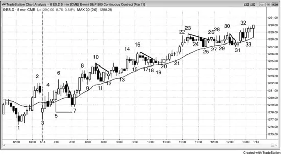

Once a trader believes that the market is always-in long, the best trade is almost
always buying a pullback, especially near the moving average and when the
signal bar has a bull body. As shown in Figure 24.1, yesterday ended with a
strong rally, and the market was always-in long at the close. The two consecutive
bull trend bars on the open were enough to make traders suspect that the alwaysin position was still long. The four-bar bull spike up to bar 6 was further
evidence of buying pressure. Bar 7 was a two-bar reversal buy setup because it
was a high 2 down from bar 6 and a double bottom bull flag with bar 5. The bar
7 low was three ticks above the bar 5 low, which was a sign of urgency on the
part of the bulls. They were so eager to get long that they were afraid that the
market might not get all the way to the bottom of bar 5, so they bought several
ticks above. This was also a breakout test of the bar 3 high (even though bar 7
fell one tick below the bar 3 high). The four consecutive bull trend bars up from
bar 7 probably convinced most traders that the market was always-in long, and
therefore they were looking to buy pullbacks, especially two-legged pullbacks to
the moving average where the signal bar had a bull body, like at bars 7, 12, 20,
25, and 31. Bar 31 was a larger high 2 since it was the bottom of the second leg
down from bar 23. Bar 25 signaled the end of the first leg down. By bar 24, the
market had entered a tight trading range. At that point, most traders should have
either taken any buy signal and been waiting patiently or been waiting with no
position. The probability of an upside breakout falls to 55 percent or less once a
tight trading range forms, even if the trend before it was strong.
There are often many ways to interpret a signal, and different traders will see
it in different ways. For example, the bar 12 buy signal was a triangle breakout

<!-- PDF page 467 -->

buy setup, where bars 9 and 11 were the first two pushes down. It was also a
breakout pullback from the bar 11 two-bar reversal high 1 (bar 11 was the first of
the two bars), which was also a double bottom with bar 9. Some traders saw it as
a high 2 at the moving average, where the bar 11 two-bar reversal was the high
1. Bar 12 was a micro double bottom with the bull trend bar from two bars
earlier. Most tradable bottoms come from some form of micro double bottom (or
a simple double bottom, like the two-bar reversal at bar 7 with bar 5), just as
most tradable tops come from some form of micro double top, like bar 6 with the
bear bar three bars later, the bar 10 final flag and bar 8, the bar 16 final flag and
bar 14, and the bar 23 double top with bar 22 (and final flag). In a strong bull
trend like this, however, most traders should ignore these countertrend scalps
and only look to buy.
Notice how the only bar below the moving average was the first bar of the
day, and after the bar 5 bull spike, only two bars were able to close below the
moving average, and they were quickly reversed up on the next bar. This is a
sign of strength. At the end of the day, it is easy to see that this was a bull trend
day (a trend from the open bull, a spike and channel bull, and a trending trading
range bull). This was not so obvious as the day was unfolding because trend
days always look like they are setting up reversals. However, each pullback
becomes just another bull flag. Traders must constantly look for signs of
strength, and if those signs are present, as they were today, they must try very
hard to buy pullbacks because these are the best trades. The probability of
success is 60 percent or higher, and the potential reward is at least as large as the
risk. If traders held the trades as swings, the reward ended up being several times
as large as the risk.
The market probably became always-in long as it traded above the strong bar
5 reversal bar. If a trader bought above bar 5, his initial stop was below bar 5,
giving him a planned risk of 14 ticks. Once the market traded above the strong
bar 7 two-bar reversal, he would tighten his stop to one tick below the bar 7 low,
which was 11 ticks below his entry. At this point, the trader knew that the actual
risk to stay in the trade was only 11 ticks. Since he thought that the market was
always-in long, he believed that the probability of an equidistant move was at
least 60 percent. When the probability was 60 percent, the minimum profit that
he needed to create a positive trader's equation had to be at least as big as his
actual risk of 11 ticks. This means that his strategy would be profitable as long as
he took profits at 12 ticks above the bar 5 signal bar high, which meant that the
rally had to reach at least 13 ticks above bar 5. This happened during bar 10 (it
reached 15 ticks above bar 5), and this profit taking was part of the reason why
bar 10 had a bear body. Many traders would have swung part or all of the trade

<!-- PDF page 468 -->

for a larger profit.
FIGURE 24.2 Best Trades in the 10-Year U.S. Treasury Note Futures

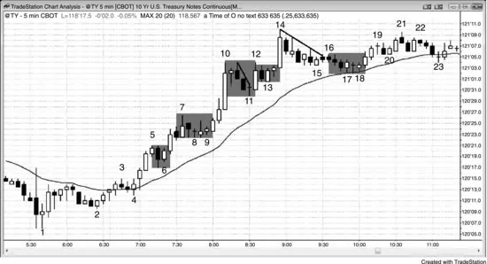

The 10-Year U.S. Treasury Note Futures market is one of the best markets for
entering on stops when there is a pullback in a clear always-in trend. As shown
in Figure 24.2, some traders saw the market as becoming always-in long on the
two-bar bull spike that began at bar 1, and others saw it as flipping to long on the
failed low 2 at bar 4, especially after the four bull trend bars up from bar 2.
When the market broke out strongly to the upside from bar 4 to bar 5, it was
clearly always-in long. At that point, traders were buying pullbacks. Bar 6 was a
high 1 long buy setup. Some traders are hesitant to buy high 1 setups because the
pullback often grows into a high 2 or a wedge bull flag. If traders do not want to
buy the high 1 setup and also do not want to risk missing a strong trend, they can
put a buy stop above the trend high. Here, as the bar 6 high 1 was setting up,
cautious bulls could have placed a buy stop at one tick above the bar 5 high. This
would have ensured that they would get long if the high 1 at bar 6 resulted in
trend resumption instead of being followed by a more complex pullback.
Bars 9 and 11 were high 2 buy setups. Bar 9 was also a micro double bottom
with bar 8, a pullback from the bar 8 high 1 or high 2 (some traders saw the bear
bar before bar 7 as a high 1 pullback), and a triangle breakout setup (the three
pushes down were the bear bar before bar 7, bar 8, and bar 9). Bar 12 was a large
bull trend bar with a small tail on top and no tail on the bottom. This indicated
that the bulls were strong. Bar 13 was then a reliable breakout pullback buy
setup.
Bar 14 was a large bull trend bar after a protracted move and after a small
trading range (bar 10 to bar 13), which could have been a final flag. After a final

<!-- PDF page 469 -->

flag, traders usually wait for at least a 10-bar, two-legged pullback to the moving
average before buying again. The move down to bar 15 formed a wedge bull
flag, but since it was a micro channel, most traders saw it as just one leg and
were hesitant to buy. Most breakouts above bull micro channels are followed by
pullbacks, so the strongest bulls waited to see whether the pullback would find
support at the moving average or the move below bar 16 would lead to another
leg down. The latter was less likely since the bull trend was so strong, the market
was just above the moving average, and the market was still always-in long. The
bull ii pattern at bar 18 was an excellent buy setup, since it was a micro channel
breakout pullback, it was at the moving average, it had a bull signal bar, it
formed a micro double bottom with the bull bar two bars earlier, and it was a 20
gap bar buy setup.
Experienced traders saw bar 14 as the second, third, or fourth buy climax and
expected a trading range to follow. Although shorting here is not a best trade for
most traders, very experienced traders would have shorted on the close of bar 14,
at the close of the bear bar that followed, below that bear bar, or below the doji
bar that followed, expecting at least a two-legged pullback to the moving
average. Some of these traders might have shorted using a small position either
because they were willing to scale in higher or because if they were stopped out,
they would become even more confident of the next signal, which they would
have traded with their usual size. Once bar 14 closed, some traders immediately
placed limit orders to short at that closing price. Most of those orders would not
have been filled, because the high of the bear bar that followed never went above
the close of bar 14. This was a sign of urgency by the sellers, and it gave the bear
scalpers more confidence to short the close of the bear inside bar or below it,
expecting at least a test of the moving average. The next bar also failed to get
above the bar 14 close, and its tail at the top created a small double top with the
bar 14 high.
One of the reasons why many traders like to buy pullbacks is because the risk
is smaller. Rather than having to risk to below the bottom of the bull spike, the
trader can risk to the bottom of the pullback. There is usually less profit
remaining, but that is the trade-off for the reduced risk. For example, a trader
could have bought at the close of bar 10, but his theoretical protective stop
would have been below the bar 8 bottom of the bull spike. If he instead waited to
buy a pullback, like above bar 11, his stop would have been below the low of bar
11 and he would be risking much less.
The market is always trying to keep the probability around 50 percent,
because then the bulls and bears are balanced. There always has to be an

<!-- PDF page 470 -->

institution willing to take the other side of your trade, and it does not want to
give you a 60 percent chance of success. However, it is unable to contain the
probabilities perfectly, and they often reach 60 percent, giving traders a strong
trader's equation.
FIGURE 24.3 Best Trades on a EUR/USD Chart

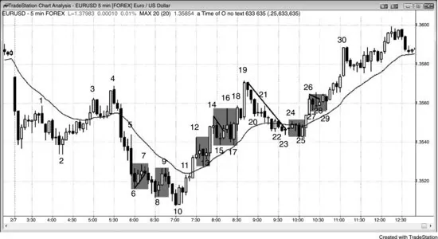

As shown in Figure 24.3, the 5 minute EUR/USD forex chart, once the market is
clearly always-in long or short, traders look to enter on pullbacks. The first two
bars of the day were big bear trend bars below the moving average and made the
market always-in short. Bar 4 was a wedge (with bars 1 and 3) lower high, and a
second entry for a moving average gap bar short in the bear trend, which at this
point had evolved into a trading range (bar 3 was the first bar with a gap above
the moving average in the bear trend). Bar 5 was a large bear trend bar that was
an outside down bar and a failed attempt to form a double bottom, so most
traders saw the market as always-in short. Shorting below the bar 7 low 1 setup
and below the bar 9 double top bear flag (double top with bar 7), which was also
a breakout pullback short from the breakout below the bar 7 bear flag, were both
reasonable trades. The reversal up at the bar 10 two-bar reversal was an example
of a setup with about a 60 percent chance of making a swing profit, and therefore
was a great setup for all traders, including beginners. Bar 4 was a gap bar in a
bear trend, and that often leads to a test of the bear low (bar 2, as this point) and
then a rally that has about ten bars and two legs as minimum objectives. The
bear spike down to bar 6 was too strong for traders to buy. Bar 8 was a
reasonable buy, since it was a second reversal attempt from the breakout below
bar 2, an expanding triangle bottom (the third bar of the day was the first push
down and bar 2 was the second), a final flag reversal from the bar 7 bear flag,

<!-- PDF page 471 -->

and a strong bull reversal bar. Expanding triangle bottoms are always major
trend reversal setups. However, since the legs up to bar 4 and down to bar 6 were
so large, most traders would not call this a major trend reversal and instead
would refer to it in other terms (although it was almost certainly a great looking
major trend reversal on the 15 minute chart). Bar 10 was the second entry in an
already strong pattern. Traders bought above the bar 10 high, which was the
second bar of the two-bar reversal, and their initial protective stop was below its
low. They took partial or full profits once the market reached twice the risk, and
let the remainder of their position swing up, trailing stops below the most recent
higher low. Some would have exited below the bar 19 double top (with bar 4),
and wedge (bars 12, 14, and 19, and bars 14, 16, and 19), and others would have
held, keeping their stops below bar 17.
The market was clearly always-in long by bar 12, and traders expected at least
one more leg up and possibly a measured move up based on the height of the
strong bull spike from bar 10 to bar 12. Bulls could have bought either the bar 13
high 1 or the breakout above bar 12.
Bar 15 was another high 1, but at this point the bull spike was not as strong,
since it already had one high 1 buy setup, and the market was potentially near
the top of a trading range. Bar 17 was a safer buy setup since it was a high 2 at
the moving average and the signal bar was a strong bull trend bar (a two-bar
reversal with the bar before it).
The pullback to the moving average at bar 22 was a bear micro channel, so the
first breakout above the channel was likely to have a breakout pullback before
the market rallied very far. Bar 25 was the breakout pullback buy setup.
Bar 25 was a two-bar reversal, and it formed a double bottom with bar 23.
Some traders might call it a micro double bottom, since it included only four or
five bars. It was also a pullback from the bar 24 breakout of the bear micro
channel from bar 19 to bar 23, and an approximate double bottom with bar 17,
and the first moving average gap bar in the larger bull trend, which is often a buy
signal. Since the channel down was tight, waiting for the second entry above the
bar 25 two-bar reversal was a higher-probability approach.
The bull spike up to bar 26 was made of three consecutive strong bull trend
bars, so higher prices were likely to follow. The worst-case protective stop on
any long was below the bar 25 bottom of the spike, but most traders would have
exited sooner, like below the bar 26 low or the bar 25 signal bar high. The
market triggered a high 1 long above bar 27 and then a high 2 long above bar 28.
The market was still clearly always-in long, so traders should not have been too
eager to exit on the pullbacks. Bar 29 was a wedge bull flag buy setup (bars 27,

<!-- PDF page 472 -->

28, and 29 were the three pushes down); it was also a double bottom with bar 27,
a breakout pullback buy setup from the breakout above the bar 28 high 2 bull
flag, and a failed lower high (the bar before was a small lower high and a failed
high 2 buy setup).
FIGURE 24.4 Best Trades in IBM

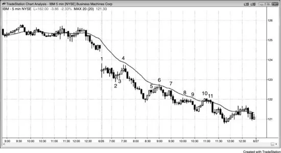

As shown in Figure 24.4, the best trades on this 5 minute chart of IBM include
the bar 2 opening reversal and gap spike and channel bottom, the bar 4 double
top at the moving average, the bar 6 low 2 at the moving average after a strong
bear spike, the bar 7 low 2 and micro channel failed breakout, the bar 9 small
triangle or sideways wedge bear flag, and the bar 11 low 2 at the moving
average.
There were several moving average pullbacks in a strong bear trend. After the
breakout below bar 2, traders would have assumed that today was a trending
trading range day or possibly even a stronger trend from the open day. By bar 6,
traders were shorting two-legged moves to the moving average and every low 2
that they saw.
Bar 6 was a low 2 short at the moving average (bar 5 was a small bear bar,
ending the first leg up). It was a micro double top with the high of two bars
earlier, and a one-bar final flag reversal from the inside bar just before it.
Bar 7 was a reversal down from the test of the breakeven stops below bar 6. It
was also a pullback from the breakout below the bear flag that ended at bar 6.
Bar 9 was a low 2 short, and bar 11 was a low 2 short at the moving average,
as well as a micro double top with bar 10. Neither looked good, but you must
trust that a low 2 short at the moving average has a very high probability of
success during a strong bear trend day.

<!-- PDF page 473 -->

The two-bar bull spike before bar 5 was very strong, and most beginners saw
it as the start of a sharp bull reversal. In the move up to bar 6, there were seven
bars, and only one had a bear body. It is easy to focus on this strength and deny
what took place before it. This sharp rally was the first pullback to the moving
average in over 20 bars, and experienced traders saw it as a sell signal.
Beginners only saw the strength and looked to buy the higher low that followed,
expecting a trend reversal or at least a second leg up. They dismissed the three
strong bear trend bars down from bar 6 as just a sharp test of the breakout above
the low of the day, and bought for the next leg up. Experienced traders saw this
as simply an attempt to reverse a strong trend, and therefore most likely just a
bear flag. They shorted the two-legged sideways correction at bar 7, correctly
anticipating that the bear trend would resume.
FIGURE 24.5 Best Trades in USO

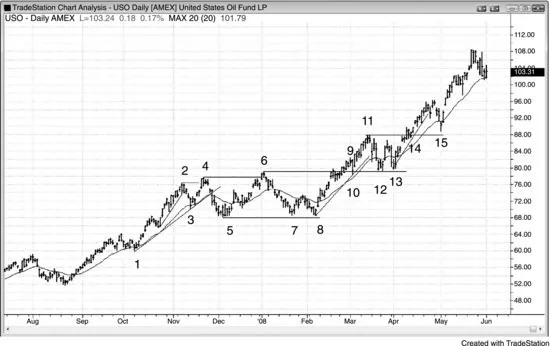

As shown in Figure 24.5, the best trade setups today on the daily United States
Oil Fund LP (USO) include the bar 1 wedge bull flag; the bar 3 high 1 test of the
moving average; the bar 5 second entry in a large high 2 (bar 3 was the first push
down); the bar 6 expanding triangle and higher high major trend reversal; the bar
8 double bottom (with bar 5) and the micro channel breakout pullback (the rally
from bar 7 broke above the micro channel); the bar 10 failed micro channel
breakout; the bar 12 second-entry moving average gap bar, double bottom (with
bar 10), high 2, and breakout test of bar 6; the bar 13 double bottom and high 2;
and the bar 15 high 2 at the moving average and breakout test of bar 11.
The market was clearly in a bull trend, so the best trade was likely to be any

<!-- PDF page 474 -->

high 2, especially near the moving average, like at bars 1, 5, and 12. Bar 1 was a
high 2 at the moving average, and some traders saw it as a small wedge bull flag.
Bar 5 was the second leg down in a larger high 2 buy setup where bar 3 was the
first leg down.
Aggressive traders saw the small sideways move to the moving average
around bar 1 as a quiet bull flag and not a reversal pattern. They therefore would
have placed limit orders to buy at or below the low of the prior bars rather than
waiting for the market to resume the bull trend.
Bar 6 was a higher high major trend reversal and expanding triangle top, and a
reasonable short. However, most major trend reversals do not lead to trends in
the opposite direction. Instead, they more often evolve into trading ranges, but
usually have enough room for a small swing trade (a reward that is at least twice
as large as the risk).
Bars 8 and 13 were two-legged pullbacks below the moving average (gap
bars).
Bar 8 was the second test of the bar 5 trading range low, and bar 13 was the
second test of the bar 6 trading range high breakout; both formed double bottom
bull flags.
Bar 10 set up a second long entry on a breakout pullback (and a failed
expanding triangle top from bars 2, 3, 4, 5, 6, 8, and 9).
Note that even though this was a clear bull trend, bar 6 was a good short
because there was a trend line break down to bar 5. Bar 6 was a two-legged,
wedge-shaped rally to a new high and the top of an expanding triangle (bars 2, 3,
4, 5, and 6).
Bar 15 was a breakout test of bar 11. Many with-trend setups will look
terrible, but you have to trust your read and place your orders, or else you will be
trapped out of great trades like so many other weak hands.
In a strong bull trend, you do not need strong setups to buy. You can buy at the
market anywhere and make money, but setups allow you to use tighter stops.
Some traders move their protective stop to breakeven once the trade reaches
about halfway to their profit target. For example, if a trader bought above bar 8,
expecting an upside breakout of the trading range and then a measured move up,
he might move his stop to breakeven once the market reached the bar 9 area,
where the market was more than half of the way to his target and there had been
several closes above the top of the trading range. If his protective stop gets hit,
he should never get upset because it is doing exactly what it is supposed to be
doing, which is limiting his losses, which come in at least 40 percent of his
trades.

<!-- PDF page 475 -->

FIGURE 24.6 Best Trades in the UltraShort S&P 500 ProShares (SDS)

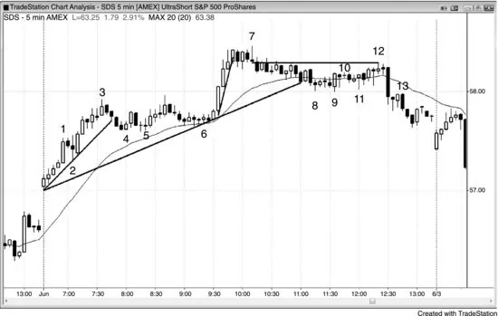

As shown in Figure 24.6, the best trade setups on the 5 minute SDS chart today
include the bar 2 first pullback in a trend from the open bull, the bar 5 high 2,
and the bar 6 wedge bull flag or triangle second entry at the moving average.
This was a trend from the open day. There was strong up momentum with the
first major leg ending at bar 3. When there is a strong bull trend, look to buy a
high 2. Bars 5 and 6 were great high 2 long entries, and bar 6 was also a moving
average pullback. The bar 6 high 2 was for the micro double bottom that formed
two and four bars earlier, and for the large two-legged move down from bar 3,
where bar 4 was the high 1 buy setup.
Bar 7 was the second leg up and a failed flag breakout (a final flag reversal)
that drifted down and broke the major trend line of the day.
When the market enters a tight trading range or a tight channel, most traders
should stop trading. Some experienced traders will buy at the low of the prior
bar and short at the high of the prior bar, and buy small bull bars at the bottom
and short small bear bars near the top like after bar 12.
Since there was no clear rally in the move down to bar 8 and the bears had
been in control for over an hour, it was reasonable to look for a second leg down.
Bar 10 was a small leg up and bar 12 was a second leg up, and it had a low 2 on
its rise from bar 11. Also, bar 12 was a small bar that gapped above the moving
average. It was also a small, almost horizontal wedge top where bar 10 was the
first push up and two bars after bar 11 was the second. It was also a low 4 setup,
a lower high major trend reversal, and a test of the bar 7 low.

<!-- PDF page 476 -->

Bar 13 was a breakout pullback of the bar 9 breakout and a failed bull reversal
bar, trapping longs.
Just before bar 7, the market entered a tight trading range and it continued
until just after bar 12. This is the worst environment for stop entries because that
is the exact opposite of what the institutions are doing, and your job is to copy
them, whenever you can. As a beginner, you cannot enter with limit orders and
scale in, so you have to wait. They are buying below bars and that is why the
market goes up after falling below the low of the prior bar. You also know that
they are selling above the high of the prior bar because the market then goes
down on the next bar or two. Since beginners should only be entering on stops,
they should never trade once they see any sign that the market is entering a tight
trading range, because entering on stops will result in repeated losses. If you are
a beginner and decide to take no more than three trades a day, what are you
thinking during the bars after bar 7? Are you telling yourself that this is exactly
what you have been waiting for all day … a nice, quiet market that is no longer
scary? Or, are you thinking that the probability is so low that you would be
foolish to waste one of your three trades here? Since clearly this is a terrible
environment for entering on stops, a best trade will virtually never develop until
after a breakout, and you will lose money by taking trades as you hope that your
trade will result in a successful breakout, even though the prior 5 to 10 signals
did not. Never trade in a tight trading range until you are consistently profitable,
and even then it is better to wait. You could trade like an institution and enter
with limit orders, scaling into shorts above and longs below as the market goes
against you, but that is emotionally draining. The drawdowns get uncomfortably
large and you will end up making mistakes, like exiting with a big loss just
before the market reverses and goes your way. It is far better to enter on stops
and wait for an environment where the probability is often 60 percent, and not
trade in a tight trading range.
FIGURE 24.7 Best Trades in an AAPL Bear Trend

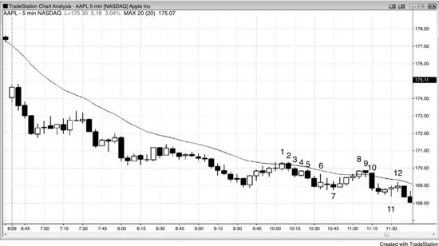

<!-- PDF page 477 -->

As shown in Figure 24.7, the best trade setups on this 5 minute chart of AAPL
include the 20 gap bar short at bar 1 and below the bar 2 two-bar reversal, and
the bar 7 double bottom.
AAPL was in a trend from the open bear. Bar 2 was a two-bar reversal setup
for a 20 gap bar short. The bar 2 entry price was $169.88, and the initial stop was
above the entry bar at $170.38. The entry bar was an outside down bar, and
traders put their protective stops above its high as soon as they entered, probably
before the bar closed. This was reasonable because it defined their risk, and they
would not have wanted to be short if the market immediately reversed above the
high of the bar. If it was not an outside bar, they would have placed their stops
above the signal bar. The initial risk here was 50 cents.
Aggressive traders would have placed limit orders at the bar 3 and 4 highs,
expecting any move up to fail and become a breakout pullback short setup for
the bar 3 breakout of the bear flag. They saw this as a quiet bear flag and not a
bull reversal, and expected more selling, so shorting above the high of any bar
was a reasonable trade.
Bar 5 was a bad high 1 since the market was in a strong bear trend, and traders
would not have exited their shorts and would not have reversed to long. The
market ran 7 cents above the bar, but traders would not yet have moved their
protective stops down because the largest open profit was only 38 cents, and
they would have wanted to give the trade time to work. Typically, traders should
not move their stops to breakeven on a trade like this until there has been about
60 to 80 cents of open profit.
On bar 6, traders would have been able to exit half of their shares with $1.00
profit using a limit order (the bottom of bar 6 was $1.07 below their entry price).

<!-- PDF page 478 -->

As you can see by the outside up nature of the bar, lots of traders likely covered
part or all of their shorts here. At this point, they would have moved their
protective stop to breakeven or maybe a few pennies worse ($170.91 was
reasonable, since AAPL rarely runs stops by more than a penny) and would not
have exited unless there was a clear and strong reversal, which was unlikely on
such a strong bear trend day. They expected pullbacks that scare weak shorts out.
For example, the rally to bar 9 hit breakeven stops to the penny ($170.88) and
then reversed back down.
If traders were stopped out, they could have shorted again on bar 10, off the
bar 9 moving average test and breakout test. Bar 10 showed that the breakout
test accomplished its goal of scaring traders out, because clearly lots of shorts
came in. If traders let themselves be stopped out, they would now be short again,
but at 41 cents worse!
FIGURE 24.8 Best Trades in a Strong GS Bear Trend

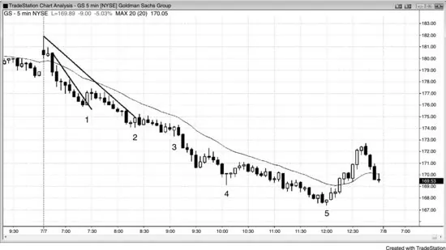

As shown in Figure 24.8, the best trade setups on this 5 minute chart of Goldman
Sachs Group (GS) include the micro channel failed breakout that formed two
bars after bar 1, the breakout pullback short (here, a low 2) below the bar after
bar 3, and the second-entry long above the bar 5 bull reversal bar after the spike
and channel down from the 11:10 a.m. PST bear spike.
A small pullback trend is the strongest type of bear trend and, since there was
no prior bull strength, traders should only have considered shorting all day,
unless there was some sign of a setup for a bounce into the close. Traders could
have shorted any small pullback until the potential bottom at bar 5. By bar 1, the
biggest prior pullback was a little more than a dollar, so traders could have
placed limit orders to short at one dollar above the most recent low. They would

<!-- PDF page 479 -->

have needed to determine where their protective stops needed to be in order to
calculate a minimum reasonable profit goal. Since this is often difficult, they
needed to think about a worst-case situation. For example, if the market traded
above the fourth bar of the day, then the bear case would have been much
weaker. Therefore, they could have used protective stops just above its high at
around $179.50. Since they would have been shorting at around $177, they
would have been risking about $2.50 on their trade. If they normally don't risk
more than $500 on a trade, then they could only have traded 200 shares. Since
this was a trend, they had to assume that there would be at least a 60 percent
chance of a new low, or about a $1.00 profit, but they should take only trades
where the potential reward is at least as large as the risk. This means that they
should have been trying to take maybe half off (100 shares) at $2.50 below their
entry price, or around $174.50. They would have been filled on the bear trend
bar that formed two bars before bar 2. At that point, they could move their stop
to breakeven and hold until the always-in position reversed to long, until their
stop was hit, until any reasonable reversal up in the final hour or so, or until the
close of the day. If they exited above bar 5, they would have made $900 on their
second 100 shares. If they exited when the market became always-in up on the
bull spike up to $170, they would have made $700, and if they held until the
close, they would also have made about $700 on those second 100 shares.
This was a perfect example of reversal entries to be avoided. Every day, you
should be examining the chart throughout the day, and especially in the first
couple of hours, to determine whether the day is a trend day (the major types
were described in the first book of this series). If it is, you should not be trading
countertrend. A trend from the open day like this is the easiest trend day to see.
You would have suspected it by the third bar of the day (a large bear trend bar,
dropping far from the open), and you would have been very confident by the
time the market broke below bar 1.
The bar 1 rally was a big bull trend bar that broke a micro trend line and was
therefore likely to fail. An eager trader might then have bought above the bar 2,
bar 3, and bar 4 reversal bars, thinking that the bulls showed adequate strength
during that trend line break. However, the market had been below the moving
average since the third bar of the day, and traders should remember that on small
pullback bear trend days like this, the first rally to the moving average usually
fails and then the market tests the low. Don't convince yourself that the market
has gone too far and is due for a rally. By definition, you are thinking
countertrend and looking for countertrend scalps on a strong trend day. You are
afraid to sell near the low and instead are hoping for a trend reversal, which is a
low-probability bet. Do the math. Most countertrend scalps will fail, and the

<!-- PDF page 480 -->

amount you lose on each one will be too great to make up with the eventual
winner or two.
However, since GS did not have a tradable low 2 short at the moving average
all day, experienced traders would have been shorting even the tiniest pullbacks,
relying on the typical pullback sequence (described in the second book in the
series) to bail them out if a pullback went further up than they thought was
likely. Every type of first pullback is usually followed by a test of the trend's
extreme (here, the low of the day).
FIGURE 24.9 Best Trades on the Daily Chart of VOD

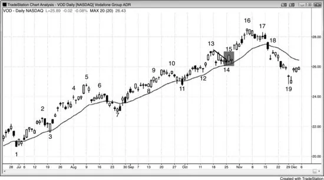

As shown in Figure 24.9, the best trade setups on this daily chart of Englandbased Vodafone Group (VOD), one the world's largest communications services
companies, include the bar 3 high 1 at the moving average, the bar 7 wedge bull
flag and second entry of a moving average gap bar, the bar 8 small triangle, the
bar 11 wedge bull flag to the moving average, the bar 12 high 2, the bar 14
wedge bull flag, and the breakout pullback on a long at the low of bar 15.
When there is a strong bull trend and a breakout of a bull flag and the
breakout bar has a bull body, buying below its low is a reliable strategy. This is
because the pullback usually becomes a breakout pullback long setup and you
are buying at a lower price. VOD was in a strong bull trend on the daily chart.
Bar 15 was a bull trend bar breakout of a wedge bull flag at the moving average,
so the odds were high that any pullback would be brief and become the signal
bar for a breakout pullback buy setup. Traders could have bought on a limit
order at the low of bar 15. Traders who waited with the plan of buying above the
pullback bar were disappointed to see the large gap up on the next day. If they
still wanted to go long, they had to do such at a worse price.

<!-- PDF page 481 -->

Although the market fell from bar 5 to below the trend line (not shown) along
the bottom of the channel up from bar 3, the two-bar selloff did not even touch
the moving average. This made bar 6 a bad candidate for a major trend reversal
lower high, and it was more likely that the market was simply creating a
pullback. It ended at the bar 7 high 2, wedge bull flag, and moving average gap
bar.
FIGURE 24.10 Look to Buy Low, Sell High Most of the Time

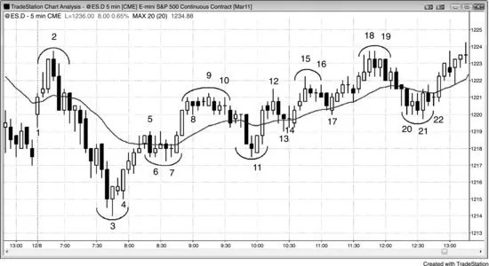

In general, always look to buy low and sell high, except in a strong trend where
you buy high and exit higher in a bull trend or sell low and exit lower in a bear
trend. However, if you short what you think is a minor top, like below bar 15 or
16 in the Emini chart shown in Figure 24.10, and the market then forms a high 2
as it did at bar 17, exit or even reverse to long. This is especially true if the high
2 signal bar is a bull bar that is testing the moving average. Likewise, if you buy
at the bottom of a bear leg and the market then forms a reasonable low 2 with a
bear signal bar testing the bottom of the moving average, exit and consider
reversing to short.
When the average daily range in the Emini is about 10 to 15 points, traders
usually have to risk about two points on a trade. They should look for trades
where the reward is at least as large as the risk and the chance of success is at
least 60 percent. There are usually five or more such setups on most days, like
shorting the bar 1 opening reversal in this chart, buying above the bar 3 low,
buying high 2 pullbacks (bar 7, the bar after bar 14, and bar 17), and the bar 22
micro channel breakout pullback. Remember, if traders think that a setup is
probably good, they should assume that this means that the chance of success is
at least 60 percent. If the reward is at least as large as the risk, this creates a

<!-- PDF page 482 -->

positive trader's equation.
Note that most minor reversals come from micro double tops and bottoms and
small final flags. Scalpers like to see these setups before placing their trades.
FIGURE 24.11 The Reward Should Always Be at Least as Large as the Risk

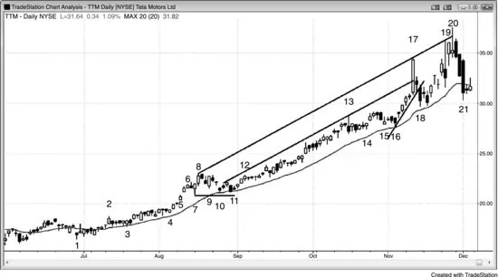

A best trade is one where there is at least a 60 percent chance of success and the
potential reward is at least as large as the risk. As shown in Figure 24.11, the
best trade setups on this daily chart of Tata Motors Ltd (TTM), the carmaker in
India, were the bar 3 and bar 4 high 2 setups, any of the three bars in the bull
spike from bar 5 to bar 6, the bar 10 high 2, the 11 wedge bull flag, the high 1
after the bar 12 breakout, the bar 14 breakout pullback and the high 2 entry on
the bar before it, the bar 16 high 2, and the bar 20 higher high reversal.
A wedge bull flag pullback to the moving average in a strong trend is a
reliable buy setup. TTM was in a strong bull trend from bar 1 and rose almost 40
percent in less than two months to bar 8. The market had a high 2 pullback to the
moving average at bar 10, which was a reasonable buy, and it evolved into a
wedge bull flag buy setup at the bar 11 inside bar, also at the moving average.
Bar 11 was a pullback from the breakout of the bull flag that ended at bar 10, and
it was therefore also a breakout pullback buy setup. If traders bought above bar
10, they could have exited at breakeven on the selloff three bars later, or they
could have relied on their protective stop below the signal bar, which would not
have been hit. They could also have placed their stop a little below the bar 7 low.
Bar 7 was the first pullback in a strong bull spike in a bull trend, and it did not
follow a buy climax. This was an ideal high 1 long buy setup, which was also a
micro channel failed breakout buy setup. It was a breakout pullback buy setup,
since it was the first pullback after the breakout above the tight trading range that

<!-- PDF page 483 -->

ended with the bar 5 breakout.
The huge bull trend bar at bar 17 was a buy climax. Whenever there is a trend
of 10 or 20 or more bars and it then has a huge bull trend bar, the bar often
represents exhaustion. It formed due to some of the last shorts exiting and the
late bulls buying. Both of these groups were weak traders. The strong bulls at
this point would only buy a pullback and the strong bears would be shorting, and
they would short more higher. The bar 17 breakout went far above the trend
channel line of the past couple of months, and it led to the drawing of a higher
trend channel line. The market tried to break above that line on bars 19 and 20
and both times found strong selling, as seen by the large tails on the tops of both
bars, the bear body on bar 19, and the close well below the midpoint of bar 20.
When the market tries to do something twice and fails both times, it usually then
tries to go in the opposite direction. The bear bars starting at bar 18 and the large
tails on the tops of bars 19 and 20 represented accumulating selling pressure, and
the large size of the bars from bar 17 onward indicated that the bulls were trying
exceptionally hard to convert the trend into an even stronger bull trend. Their
efforts led to their exhaustion and the selling pressure wore them down. The
market was likely to have at least a two-legged correction and a possible trend
reversal.
The selloff to bar 18 broke below a bull trend line, and all of the selling
pressure made a selloff likely, so shorting below the strong bear bar after bar 20
was a high-probability trade. This was a large bear trend bar that closed on its
low and formed a large two-bar reversal with bar 20. The size of the bear body
and the tiny tails indicated that the selling was very strong.
FIGURE 24.12 Best Trades in SOLF

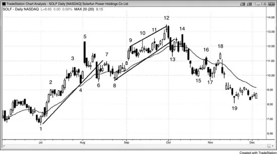

<!-- PDF page 484 -->

As shown in Figure 24.12, the best trade setups on the daily chart of Solarfun
Power Holdings Company Ltd (SOLF), the Chinese manufacturer of
photoelectric cells that are used in solar panels, include the bar 4 high 2 at the
moving average, the bar 5 huge reversal down from the third push up, the bar 7
low 2 after two strong pushes down, the bar 8 double bottom bull flag, the small
high 2 after bar 9 and again after bar 10, the bar 12 higher high, and the bar 14
two-legged lower high.
A higher high reversal is usually followed by a lower high short setup. SOLF
had a strong move down from the bar 5 high. There was a second large bear
trend bar just before bar 6 and several other bear trend bars around bars 3 and 4.
These represented selling pressure, which is cumulative and at some point can
lead to a trend reversal. However, the bears were unable to string together
consecutive bear trend bars after the trend line break, so the always-in position
was still long.
The selloff to bar 8 strongly broke the bull trend line, but the sharp rally to bar
9 broke above the bar 7 right shoulder of the head and shoulders top and was
therefore likely to have follow-through. After the spike up to bar 9, the market
had a channel up to bar 12, which formed a higher high above bar 12. After
strong selling down from bar 5, bears were looking to short and bulls were
looking to take profits. Some traders saw bar 12 as the third push up in the
channel where either bar 9 or bar 10 formed the first push and either bar 10 or
bar 11 formed the second push. The bar 12 signal bar was a doji, so some traders
may have waited for more bear strength to appear.
The strong bear trend bar after bar 12 was a sign of strong selling and gave the
bears the confidence to sell aggressively on the next couple of bars. This threebar bear spike was made of bars with large bear bodies, and the spike broke the
bull trend line. Traders believed that more selling was likely, and since the
market was now always-in short, they were looking to short rallies.
The market formed a two-legged lower high at bar 14 that tested the bar 12
low, and the market sold off from the first tick of the bar. Traders were very
confident that the market was going down. Some traders shorted as the market
went below the low of the bar before it and became an outside down bar, while
other traders shorted the breakout below the bar 13 spike, expecting at least a
measured move down.
The bear spike down to bar 15 was also strong, but some shorts were trapped
out by the sharp rally to bar 18, just above the bar 16 high. Some traders bought
above the bar 15 bull trend bar because it was a double bottom bull flag with bar
8, a two-bar reversal, and a one-bar final flag reversal from two bars earlier.

<!-- PDF page 485 -->

However, the bears returned on the bar after bar 18, which had a large bear body.
It is easy to get trapped out of a great trade, but it is important to try hard to
avoid getting trapped out. Do not tighten your stops too early, and try to hold
some of your position with a breakeven stop until the market clearly becomes
always-in long. The rally to bar 18 was not enough to flip the always-in position,
so swing traders should have stayed short.
The selloff from bar 5 to bar 8 was strong enough to make traders wonder if
the market was evolving from a bull trend into a trading range. The rally to bar
12 had many pullbacks, bear bodies, and bars with tails on the top, which are
signs of selling pressure, indicating a change into a two-sided market. This
looked more like a bull leg in a trading range than a bull trend. Traders were
beginning to sell above swing highs, like when bar 10 moved above bar 9, or
when bar 11 moved above bar 10. Bar 12 was a signal bar for a higher high
(above bar 5) major trend reversal, but most traders assumed that a trading range
and a test of the bar 8 bottom of the range was more likely than a bear trend, as
is always the case (most trading range breakout attempts fail). Although there
was some profit taking in that area between bars 15 and 17, bars 16 and 18
formed a double top bear flag and led to a breakout below the range. Many
traders took partial profits in the bar 15 area and moved their protective stops to
breakeven, hoping for a bigger swing down, but knowing that the probability
was less than 50 percent. However, they sometimes make a windfall profit, as
they did here.
FIGURE 24.13 Best Trades in CX

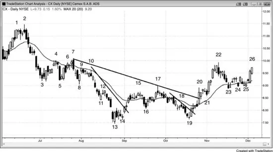

As shown in Figure 24.13, the best trade setups on this daily chart of Cemex
(CX), the large cement producer in Mexico, include the bar 2 final flag reversal

<!-- PDF page 486 -->

and micro double top with bar 1, shorting during any of the three following bars
during the bear spike, the bar 4 wedge bear flag pullback to the moving average,
buying above the small bull inside bar after the bar 5 sell climax (failed bear
breakout) and double bottom, shorting below the bar 7 low 2 and micro double
top or as it went below the low of the bar before it (since that was a low 2 sell
signal bar), buying the bar 8 triple bottom and bull reversal bar, shorting the bar
10 double top bear flag (with bar 9) at the moving average (which was also a
bear reversal bar low 2 at the moving average in a bear trend), shorting the bar
12 micro channel failed breakout and breakout pullback from the breakout below
the triple bottom buying the bar 14 micro double bottom bull flag, and failed low
2 after the strong bar 13 bull reversal bar and big two-legged move down (an
approximate leg 1 = leg 2 move, where leg 1 was the spike from bar 2 to bar 3,
and leg 2 was the bear channel from bar 9 to bar 13, which had three pushes; bar
7 was a smaller bear spike and it shared the same bear channel), and shorting
below the bar 15 moving average gap bar, buying above the bar 16 higher low,
shorting the bar 17 low 2 (there were two pushes up from bar 16, and bar 15 was
the first push up of a larger low 2) and wedge bear flag (the bar after bar 13 was
the first push up), buying the bar 19 higher low major trend reversal, buying the
bar 21 high 2 (it was a micro double bottom with the bull inside bar after bar 20),
and buying the bar 25 triangle (or wedge bull flag) at the moving average where
many bars had bull bodies (buying pressure).
When there is a strong bear spike and traders expect more selling, the market
is always-in down and traders will look for shorts. CX had a strong bear spike
down to bar 3. Traders were expecting lower prices and were looking to short
rallies. They shorted the small two-legged rally to the moving average at bar 4.
Some traders shorted with limit orders at the moving average because this was
the first pullback to the moving average after a strong bear spike. Other traders
shorted on stops below bar 4. Bar 4 traded below the bar before it and was a
first-entry short, and the traders who shorted below bar 4 were taking the second
entry.
The larger two-legged rally at bar 7 was a low 2 short setup. Aggressive bears
shorted on limit orders above the high of the prior bar and above bar 4, and
others shorted as the bar fell below the low of the prior bar and generated a
second-entry short signal (bar 6 was the first signal). Many traders prefer to short
below strong bear trend bars and shorted below bar 7. There were so many
traders looking to short there that the market gapped down the next day.
There was a strong bear spike down to bar 11, and bar 12 broke above the
micro channel. Bears shorted below bar 12, expecting the first micro channel

<!-- PDF page 487 -->

breakout attempt to fail.
Although the sideways move to bar 17 broke above a steep bear trend line, the
move down to bar 13 was so far below the bar 8 low that traders began the
process of looking for a bottom all over again. They needed another rally to
break above a bear trend line and then another test of the trend's low before they
would be willing to think that the market was reversing and not just forming
another bear rally. The two-legged move up to bar 17 was strong enough to
break well above the moving average and was therefore a sign of buying
pressure. Traders shorted below the bar 17 bear reversal bar because they saw it
as the end of a large two-legged rally and therefore a low 2 short setup. It was
also a moving average gap bar short in a bear trend that had yet to clearly flip
into an always-in bull trend.
The bar 19 outside doji bar was not a strong higher low buy signal bar, but
some traders bought above it and above the strong bull trend bar that followed it,
which broke above a bear trend line. It was a breakout test of the longs above bar
14, and it ran the breakeven stops on those longs. A breakout test that runs
breakeven stops and then reverses back up in the direction of the new trend is a
good risk/reward setup. The risk is to the bottom of the signal bar, and the
reward is that of a new bull trend, which is many times larger.
The bull spike up to bar 20 broke strongly above the moving average and
above a long bear trend line. Some traders saw this as a break above the neckline
of a sloping head and shoulders bottom. Most traders saw the bull spike from bar
19 to 20 as strong enough so that it should be followed by higher prices. This
means that they saw the market as always-in long. They bought above the bar 21
high 2 setup and again above the bar 24 high 2. It was safer to buy above the bull
bars at the bar 25 wedge bull flag pullback to the moving average.
Other traders interpreted the move down to bar 23 as a bear micro channel,
but since it was still above the moving average and in a strong bull trend, they
believed that it was likely to become part of a bull flag. Therefore, rather than
looking for the breakout to fail and then shorting below it, it made more sense to
assume that the breakout would fail but the failure would not go far and instead
would become a breakout pullback buy signal. Remember, when a failed
breakout of a bear micro channel fails, it becomes a breakout pullback long
entry. Bar 24 was the breakout pullback, but it had a bear body, so most traders
would not have bought above its high. However, the pullback became a twolegged pullback to bar 25, which was also a double bottom bull flag.
FIGURE 24.14 Best Trades in GOOG

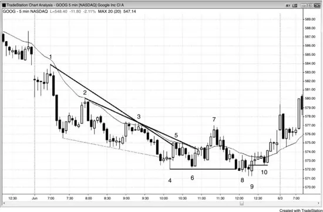

<!-- PDF page 488 -->

As shown in Figure 24.14, the best trade setups on this 5 minute chart of Google
(GOOG) include the bar 2 and bar 3 low 2 pullbacks to the moving average;
buying the bar 4 final flag and wedge bottom reversal; shorting the bar 7 moving
average gap bar, low 2, and double top; buying the bar 9 major trend reversal
lower low; and buying the bar 10 higher low and stop-running breakout test.
When there is a strong break above the bear trend line, traders will look to buy
a test of the bear low, as long as the test does not fall too far below. GOOG had a
strong rally to bar 7, composed of bull trend bars with small tails. It broke above
the bear trend line and above the moving average, and there had been several
strong bull trend bars in the move down after the bear spike down from bar 1.
Those large bull trend bars with small tails signify that the bulls are willing to
buy. That buying pressure is cumulative and, at some point, it can wear down the
bears enough so that the bulls can take control of the market.
Aggressive traders would have shorted on a limit order at the high of the bear
bar after bar 5. There were three consecutive overlapping bars, and any longs
were being forced to buy at the top of this trading range. That is an especially
bad idea, given that it was right at the bottom of the moving average in a bear
day. Since it was likely to fail as a buy, astute traders instead shorted just where
the weak bulls were buying.
The selloff from bar 7 had many overlapping bars and several bull bars, which
indicated that there was two-sided trading. The bears were not in total control.
As soon as the market fell below the bar 4 bear low, buyers came in on bar 8.
They were not able to reverse the market, and the market fell again below the

<!-- PDF page 489 -->

bear low. Bar 8 was the first break above the bear channel down from bar 7 and
therefore not likely to have follow-through. However, on the bar 9 second
attempt to reverse the trend, the bulls were able to own the next three bars. Bar 9
was a breakout pullback from the bar 8 breakout above the bear micro channel,
and a bear channel is a bull flag.
When the bears tried to turn the rally from bar 9 into a three-bar bear flag, the
bulls overwhelmed them at the bar 10 higher low. Bar 10 reversed back up at 8
cents (8 cents is tiny for a $500 stock) above the signal bar for the bar 9 long and
was an excellent breakout test, allowing traders to add on above its high. It also
trapped longs out, and they would now chase the market higher. The bulls saw
bar 9 as likely leading to at least two legs up, and they therefore placed limit
orders to buy at or below the low of the prior bar during the next several bars.
They expected any low 1 short to fail and to become a higher low. Their buy
limit orders would have been filled on bar 10. Their protective stops would have
been below the bar 9 low.
The bears had good shorts earlier in the day. The market gapped down and
formed a low 2 short just below the moving average at bar 1. Aggressive bears
would have shorted during the formation of the two large bear trend bars down
from bar 1, on their closes, and at one tick below their lows.
The bear spike was so strong that there was likely to have been followthrough selling, most likely in the form of a bear channel, and the day would
probably become a spike and channel bear trend day. The bears would have
looked to sell rallies, which would be at the top of the developing bear channel.
Bar 2 was a low 2 short at the moving average and a test of the breakout below
the first bar of the day.
Bar 3 was another low 2 short at the moving average, despite the strong bull
trend bars in this bear flag.
Bar 4 was a reversal up from a two-bar final bear flag and the third push down
in the bear channel, which often leads to at least a two-legged reversal. At a
minimum, this wedge bottom was likely to behave like a bear stairs pattern and
test the low of the prior push down (the swing low at the bottom of the selloff
from bar 2). It was also a second attempt to reverse up where the first was two
bars earlier. Although a doji signal bar is not ideal, the selloff had many bull
trend bars, so not as much force was needed to turn the market up. The bear
trend was not all that strong and had a lot of two-sided trading within it.
When buying a low in a bear trend, it is usually good to scalp at least a part of
the trade so traders would have exited some on the test of the moving average,
which was also just above the prior swing low. They then could have moved

<!-- PDF page 490 -->

their protective stops to breakeven. Most traders would have exited once the
market fell below the two bear trend bars that began with bar 5, but some would
have kept their stops below the bar 4 bear low. This was not yet a strong bottom
because the rally to bar 5 barely broke above the trend line, and therefore the
market was still always-in short. It was prudent for bulls to be cautious and get
out early.
Bar 7 was an acceptable moving average gap short, a double top bear flag
with bar 3, and two legs up in a bear trend. However, it would have been risky to
short below a bull trend bar, especially following a three-bar bull spike. It would
have been better to look to buy a higher low or lower low test of the bear low.
FIGURE 24.15 A Lower High in AAPL

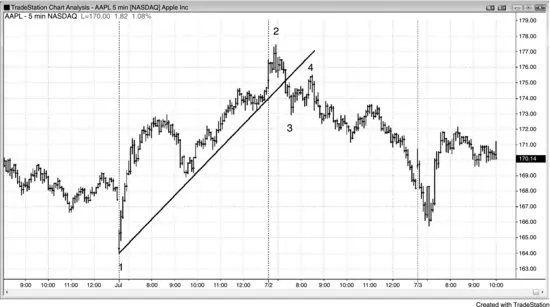

As shown in Figure 24.15, the best trade setup on this 5 minute chart of Apple
(AAPL) was the bar 4 lower high major trend reversal and breakout test after the
bear spike down to bar 3. Aggressive traders could have bought during any of
the bull trend bars in the bull spike up from bar 1, but since their protective stops
would have been further away, traders needed to trade smaller positions.
Once the market breaks below a steep channel after a spike and channel top,
traders will often look to short a lower high. The move down to bar 3 had strong
momentum and broke well below the bull trend line. Traders suspected that the
always-in position had flipped to short and were looking for a lower high sell.
The two-legged lower high rally to bar 4 was a test of the breakout below the bar
2 two-bar reversal, and it was a low-risk sell signal for at least a second leg
down and possibly a trend reversal.
FIGURE 24.16 Best Trades in AMZN

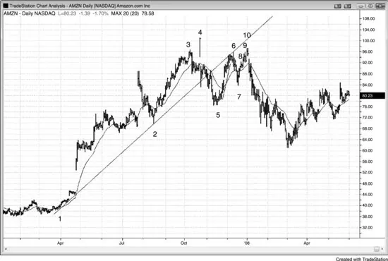

<!-- PDF page 491 -->

As shown in Figure 24.16, the best trade setup on this daily chart of Amazon
(AMZN) was the bar 10 two-legged lower high major trend reversal, which had
several other supportive features that are described in the next paragraphs. Other
good trades included the wedge bull flag, moving average gap bar, double
bottom bull flag at bar 2, and the bar 3 final flag and wedge top. Some traders
saw the first push up as the bull trend high before the bar 2 selloff. Other traders
saw that as the second push up and the June high as the first push up.
After a strong break below a bull trend line, traders will look to short a lower
high. The AMZN daily chart had a two-legged pullback to a lower high at bar
10. Some traders saw it as a double top with the bar 3 or bar 4 high and certainly
with the bar 6 high. It formed a double top bear flag with bar 6 and was therefore
a second-entry short signal. Bar 6 was the first, but the move up to bar 6 had too
much momentum to have much likelihood of being the start of the bear trend.
Other traders ignored bar 4 as an outlier and saw the move up to bar 10 as a form
of a large wedge top where the high before bar 2 was the first push, bar 3 was the
second, and bar 10 was the third.
Bar 7 broke a smaller bull trend line, indicating more bearish strength, and
then again tested the bars 3 and 4 highs on the rally to bar 10.
Bar 10 was three pushes up from a sharp rally off bar 7, and this always has to
be considered a form of a wedge reversal pattern. This was as good a secondentry short that a trader could hope to find: a double top bear flag made of a
small wedge in a two-legged rally to test the trend high (bar 4) after a major

<!-- PDF page 492 -->

trend line break (to bar 5), all occurring at a time when traders were looking for
a setup to allow them to go short with limited risk.
FIGURE 24.17 Best Trades on Daily Chart of GS

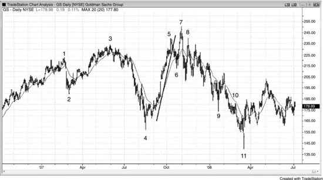

As shown in Figure 24.17, the best trade setups on this daily chart of Goldman
Sachs Group (GS) include the bar 3 higher high major trend reversal and small
wedge top, the higher low and small double bottom bull flag after the bar 4 sell
climax, the bar 7 higher high (above bar 5 and bar 3), final flag, and expanding
triangle top (it was the second entry for a large expanding triangle where bar 1
was the first push and bar 3 was the second, and it was the first entry for a small
expanding triangle where the pause before bar 5 was the first push and bar 5 was
the second), the bar 8 lower high, the low 2 and wedge bear flag after bar 9, the
bar 10 low 2 near the moving average, and the bar 11 island bottom and
expanding triangle bull flag (bar 2 was the first push down and bar 4 was the
second; remember, expanding triangle bull flags often follow expanding triangle
tops).
Although a strong rally can be part of a bull trend, it can also simply be a test
of the top of a trading range, created by a sell vacuum. The bears expected the
market to move above the bar 3 high, so they waited to short until it got there.
They were bearish all the way up from bar 4, but it did not make sense for them
to short until they got the expected breakout above the bar 3 high. If they believe
that the market is going higher, it is foolish for them to short until it reaches a
level where they think it will not go much higher, which was at a new high. They
saw the market sell off when the rally to bar 3 moved above the prior bar 1 high,
and they expected the same to happen this time as well. Since this was the third
push up, they might have been shorting at the start of a protracted selloff that

<!-- PDF page 493 -->

should have at least two legs. Since it was an expanding triangle top (bars 1, 2, 3,
4, and 7), a reasonable objective was a move to below bar 4, where the market
might then form an expanding triangle bull flag.
Bar 11 was a signal for a long entry in the expanding triangle bull flag.
Although that was a reasonable trade, it was not as strong as the other reversals
in this chapter.
FIGURE 24.18 Best Trades in MSFT

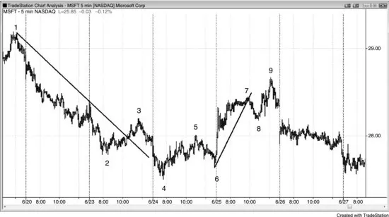

As shown in Figure 24.18, the best trade setups on this 5 minute chart of
Microsoft (MSFT) include the bar 3 wedge bear flag; the bar 4 lower low major
trend reversal and small wedge bottom; the bar 5 small and large low 2; the bar 6
higher low major trend reversal, wedge bull flag, and double bottom bull flag;
and the bar 9 two-legged higher high major trend reversal, small spike and
channel top, and wedge bear flag (bars 3, 7, and 9).
Although the rally to bar 3 broke well above the bear trend line, the selloff
down to bar 4 then went far enough below bar 2 so that traders needed a higher
low before thinking that a trend reversal might be underway. Bar 6 was a higher
low and a two-bar reversal, and alert traders bought on the first bar of the next
day as it traded above the two-bar reversal.
The rally to bar 9 was a two-legged higher high after the move down to bar 8
broke below the bull trend line. It was also three pushes up from the bar 4 low,
with bars 5 and 7 being the first two pushes. Some traders saw the rally as a
large wedge bear flag where bar 3 ended the first push and bar 7 was the second.
FIGURE 24.19 Best Trades in ORCL

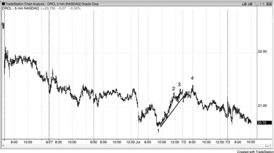

<!-- PDF page 494 -->

As shown in Figure 24.19, the best trade setups on this 5 minute chart of Oracle
(ORCL) include the bar 1 lower low major trend reversal (the rally off the prior
low broke above a steep bear trend line) and the bar 4 two-legged higher high
major trend reversal and small wedge top.
A sharp rally to the top of a trading range is usually due to a buy vacuum
instead of a new trend. The market has inertia, and when it is in a trading range,
most attempts to break out fail. The bears expected a test of the top of Oracle's 5
minute trading range of the past couple of days, so there was no reason to short
until the market reached that area. This made the market one-sided in the rally
up to bar 2, but once the market reached the top of the trading range, the bears
appeared as if out of nowhere. They now doubted the market would go much
higher without a pullback, and they shorted relentlessly. The three-push rally to
bar 4 was an excellent setup to short below the two-bar reversal.
FIGURE 24.20 Emini Opening Reversal

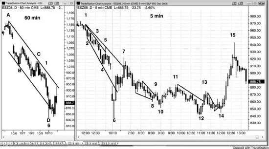

<!-- PDF page 495 -->

The best trade setups on the 5 minute Emini chart on the right in Figure 24.20
include the bar 6 opening reversal, the bar 7 final flag top and wedge top (the
high of the bar before bar 6 was the first leg up, even though it was a bear bar),
the bar 8 wedge bull flag and higher low, the bar 10 breakout pullback from the
bar 9 breakout above the bear micro channel, the bar 11 low 2 and double top
(with the top of the wedge down to bar 8), the bar 12 large two-legged (bar 10
was the first push down) higher low major trend reversal (bar 12 was reversing
up from the small bear trend down to bar 10 and from the large bear trend that
ended at bar 6), and the bar 14 higher low major trend reversal and second entry
breakout pullback buy signal (it was also the right shoulder of a head and
shoulders bottom, where bar 10 was the left shoulder).
Although most academics and television pundits argue that all moves in the
overall market are based on the composite fundamentals of the individual stocks,
politics often creates huge moves. An obvious example is the incredible bull
market that took place when the Republicans took control of Congress in 1994,
often referred to as the Clinton super bull market. The crash of 2008 is another
example. Was this bear trend and panic selloff caused by the subprime mess, or
was it the direct result of the country realizing that Barack Obama was going to
win the White House? Although you have to trade the charts based on what they
show, it is intellectually interesting to try to understand how politics can
influence the market, regardless of your political leanings.
Such a perfect day! If you look at the 5 minute chart on the right, the shape is
unremarkable for a higher low bear trend reversal, but you can see from the price
scale on the right of that chart that some of the bars were more than 30 points
tall, in contrast to a normal day when the bars might have an average range of

<!-- PDF page 496 -->

about two points. This is the market's attempt to put at least a temporary bottom
in after the Dow Jones Industrial Average lost 20 percent this week in the crash
of 2008. I had been telling my friends for over a year that the Dow would fall
below 10,000 in 2008, because it appeared that we might have entered a
multiyear trading range. We might have put in a top and the selling could lead to
much lower prices, but a trading range is a more common and therefore more
likely outcome.
Even though the Dow had a range of 1,000 points today, it was still just
another day at the office for a price action trader. I cut my position size down to
just 20 percent of normal because I had to risk about 10 points on each Emini
trade, yet I still ended the day with more profit than on an average day.
Today was Friday and the Dow had been down 200 to 700 points every day
this week, so an attempt at a reversal was likely. However, you had to be patient
and look for standard price action setups.
The chart on the left is a 60 minute chart, and bar D (it is also bar 6 on the 5
minute chart on the right) fell through the trend channel line built off bars A and
C (it is also bar 1 on the 5 minute chart), and then reversed up.
On the 5 minute chart, bar 6 formed a huge doji bar after the market fell below
the bar 2 to bar 4 trend channel line. Dojis are not great signal bars, but the
market was reversing trend channel line breakouts on both the 5 and 60 minute
charts and the Dow was down 700 points, so a tradable rally was likely.
Bar 7 broke above the bear trend line but formed a final flag top and two legs
up, so a pullback was likely. However, the move up from the bar 6 low was
violent, so it was likely that there would be a second leg up after a test of the
bear trend low. It was prudent to just patiently wait for a higher low (with that
much upward momentum, a lower low was not likely).
Bar 10 was a possible bottom since it was a lower low breakout pullback from
the bar 9 breakout of the wedge. However, the move down from bar 7 lasted
more than an hour or so and was very deep, so a second leg down was likely
before the final bottom was in.
The move up to bar 11 broke another bear trend line, so the bulls were gaining
strength.
Bar 12 was a lower low compared to bar 10 and therefore a possible higher
low on the day, but the move down to bar 12 had too much momentum, so a test
was likely.
The bull leg to bar 13 had several bull trend bars and broke another bull trend
line.
Bar 14 was a good-sized bull reversal bar and a micro trend line pullback, as

<!-- PDF page 497 -->

well as a higher low compared to bar 12, so this could have been the final low,
which it was. This turned bar 12 into the first strong higher low after bar 6 and
an excellent test of that bear low. This was the trade of the day and the one that
you needed to be waiting for all day after the strong move up to bar 7. There
were many other trades today, but this one was easy to anticipate and it unfolded
perfectly. There were trend channel line overshoots on the 5 and 60 minute
charts, a huge move up to bar 7 making a higher low likely, a two-legged
pullback to bar 12 forming a possible 60 minute higher low, followed by a 5
minute higher low at bar 14 that confirmed the bar 12 higher low. You did not
need the 60 minute chart to make this trade, and I did not use it. I am including it
to show that there were longer time frame forces at work here as well and it is
clear from the volume that institutions were paying attention to them.
Bar 15 reversed down after a new high on the day.
The reversal up at the bar 10 two-bar reversal was an example of a setup with
about a 60 percent chance of making a swing profit, and therefore was a great
setup for all traders, including beginners. Bar 4 was a gap bar in a bear trend,
and that often leads to a test of the bear low (bar 2, as this point) and then a rally
that has about ten bars and two legs as minimum objectives. The bear spike
down to bar 6 was too strong for traders to buy. Bar 8 was a reasonable buy,
since it was a second reversal attempt from the breakout below bar 2, an
expanding triangle bottom (the third bar of the day was the first push down and
bar 2 was the second), a final flag reversal from the bar 7 bear flag, and a strong
bull reversal bar. Expanding triangle bottoms are always major trend reversal
setups. However, since the legs up to bar 4 and down to bar 6 were so large,
most traders would not call this a major trend reversal and instead would refer to
it in other terms (although it was almost certainly a great looking major trend
reversal on the 15 minute chart). Bar 10 was the second entry in an already
strong pattern. Traders bought above the bar 10 high, which was the second bar
of the two-bar reversal, and their initial protective stop was below its low. They
took partial or full profits once the market reached twice the risk, and let the
remainder of their position swing up, trailing stops below the most recent higher
low. Some would have exited below the bar 19 double top (with bar 4), and
wedge (bars 12, 14, and 19, and bars 14, 16, and 19), and others would have
held, keeping their stops below bar 17.
FIGURE 24.21 Treasury Note Final Flag

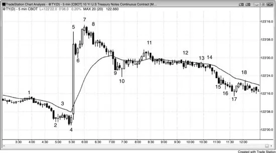

<!-- PDF page 498 -->

As shown in Figure 24.21, the best trade setups on this 5 minute 10-Year U.S.
Treasury Note Futures chart include the final flag reversals at bars 4, 7, and 10;
the small low 2 at bar 3; the high 1 at bar 6; and the wedge bear flag second
entry at bar 11.
Final flags often provide high-probability reversal trades.
Bar 4 was a two-bar reversal after a horizontal bear flag that had only a single
bear body. The bull bodies in the bear flag were a sign of buying pressure.
Although the huge bar 5 bull trend bar was climactic, the bar 6 high 1 was a
reasonable buy setup for at least a scalp up after such strong momentum. Also,
there were trapped bears who shorted below the bear inside bar, and they would
have covered above bar 6.
Bar 7 was the first bar of a two-bar reversal where the second bar was a strong
bear trend bar. The reversal occurred just above the bar 5 high, so the bulls
apparently were eager to take profits, and the bears were just waiting for the
market to get above bar 5 before shorting. This was a good final flag short setup,
especially since the bar before bar 7 was another large bull trend bar and
therefore a second buy climax. Consecutive buy climaxes are usually followed
by at least a two-legged correction.
Bar 10 was a relatively large doji reversal bar and a signal bar for the reversal
up from the ii final flag breakout (ii patterns often become final flags). It was
also a wedge bull flag where bar 6 was the first push down and bar 9 was the
second.
Bar 11 was the second signal for a reversal down from the horizontal final bull
flag that followed the small spike up from bar 10. It was also a wedge bear flag
where the bull inside bar after bar 9 was the first push up and the rally from bar

<!-- PDF page 499 -->

10 was the second. Finally, it was a moving average gap bar short after the
strong trend down to bar 10.
Bars 12 and 13 were setups for two-bar reversals up, but they never triggered.
The market never traded above the signal bars. Bar 12 was seen by some traders
as a setup for a final flag buy where the tight trading range leading up to bar 12
was the potential final flag in the selloff from bar 12.
FIGURE 24.22 Best Trades in the Emini with Two-Sided Trading

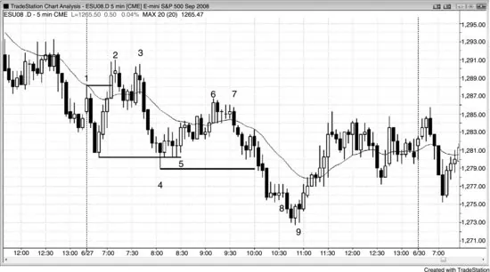

The best trade setups on the 5 minute Emini chart shown in Figure 24.22 include
the two-bar reversal up from the low of the prior day that formed three bars after
bar 1, the double top at bar 3, the wedge bear flag at bar 7, and the bar 9 small
final flag and reversal up in a trending trading range day and stairs pattern.
When a day is not a trend day, it is a trading range day, or at least it will have
a lot of two-sided trading.
Bar 2 took out the high of the open, so smart traders would have been looking
for a second-entry short, which came at the bar 3 double top. The initial swing of
the day often begins with a double top or bottom. The range was about half of an
average daily range, so the day was likely to have a breakout and become a
trending trading range day up or down, and then later have a pullback to test the
breakout of the initial range.
The bear spike to bar 4 turned the market into an always-in bear day, so
traders were looking to short rallies and expected a downside breakout and then
about a measured move down. The bull channel to bar 6 was a three-push rally
and had many overlapping bars and several minor reversal attempts. It was much
weaker than the selloff to bar 4. Once traders decided that there was not going to
be a strong bull breakout above the channel, they believed that the channel was a

<!-- PDF page 500 -->

bear flag and would be followed by a bear trend. Bar 6 missed the breakeven
stops below bar 3 by a tick, which was a sign of strength by the bears. They
successfully defended their stops by aggressively shorting more at bar 6.
Aggressive traders would have placed limit orders to go short at or above the
doji bar that followed the bar 6 two-bar reversal. They saw this as a weak high 1
buy setup that was likely to fail.
Bar 9 was a strong bull reversal bar, but since it overlapped so much of the
prior bar, it functioned as a two-bar reversal. Since its high was at the high of the
prior bar, it did not matter if a trader saw it as a two-bar reversal or as a bull
reversal bar. In either case, it was a strong reversal setup on a trending trading
range day and was in the area of a measured move down, and it followed the bar
8 final flag. It was also the third push down on the day. All of these factors led
traders to believe that the market would have at least a two-legged rally that
would test the bar 4 low. Buying as bar 9 moved above the bull reversal bar
before it was an entry that had about a 60 percent chance of leading to a
profitable swing trade, and therefore was a strong setup for all traders, including
beginners. The bull reversal bar was a strong signal bar for the reversal up from
the low 2 final flag that triggered below bar 8, and for the large parabolic wedge
bottom (the first push down ended three bars after bar 1 and the second push
down ended at bar 4). Although bar 9 was a bear bar, it did not hit the protective
stop below the bull signal bar. Other traders bought above bar 9, since it was a
second-entry buy signal as a micro double bottom with the bull signal bar. It was
likely to go up for at least a measured move based on the height of the micro
double bottom (about twice the height of the move up from the bottom of the
bull bar to the top of bar 9), and since there was a large bottoming pattern, it was
likely to go up much further, like for at least ten bars and two legs.
Note that there were several minor reversals and that most reversals come
from double tops and bottoms, micro double tops and bottoms, and final flags, as
is always the case. Many traders will not take a reversal trade unless one of these
is present.
FIGURE 24.23 Several Best Trades in the Emini with No Clear Trend

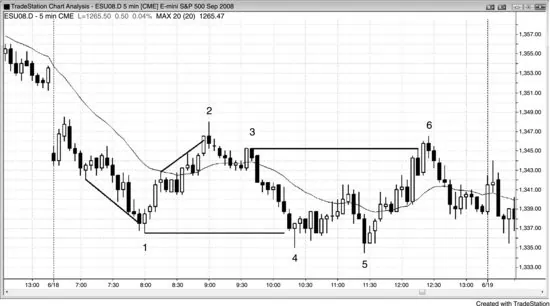

<!-- PDF page 501 -->

As shown in Figure 24.23, the best trades on this 5 minute Emini chart include
the bar 1 two-bar reversal after the gap spike and channel bottom; the bar 2
reversal at a new high of the day and spike and channel top; the bar 3 micro
channel failed breakout (a low 1); the bar 5 third push down on the day, lower
low, and final flag breakout and reversal up at the bottom of a trading range; and
the bar 6 double top, spike and channel top, low 4, and top of a trading range.
On a day that is not a clear trend day, traders should look to fade new
extremes, especially second entries and wedges.
Bar 1 was a wedge reversal with a strong reversal bar.
Bar 2 was a wedge top, a double top, and a second-entry moving average gap
bar short.
Bar 3 was a signal bar for the breakout test, which hit the breakeven stops of
the shorts below bar 2.
Bar 4 was a doji in a steep decline. Since it might have just turned into a oneor two-bar bear flag, traders waited for a second entry to buy. Aggressive traders
would have bought on a limit order at or below the low of the bar after bar 4,
expecting an attempt at a second leg up. They saw this as a weak low 1 short
setup and therefore likely to fail.
Bar 5 was a reversal up from the second attempt to break out to a new low
below low 1. The inside bar that formed the signal bar had a bull close.
Bar 6 was a low 4 short that reversed after breaking out above the bar 3 swing
high.
FIGURE 24.24 With a 50 Percent Chance of Success, the Reward Must Be

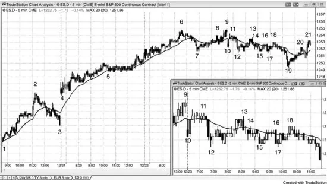

Twice as Large as the Risk

<!-- PDF page 502 -->

Even though selling in the middle of a trading range might have only about a 50
percent chance of success, if the reward is twice the size of the risk, it can be a
best trade. As shown in Figure 24.24, the 5 minute Emini, which had been in a
strong bull trend for several weeks, had a moving average gap bar at bar 7. This
often leads to the final test of the bull high before a deeper correction that has at
least a couple of legs. The small gap opening down to bar 10 was immediately
followed by a rally to just above the moving average. The bears were looking for
a second leg down, but were unsure if the one-bar drop to bar 10 was enough to
constitute a first leg. When a move is unclear, there are usually not enough
traders who believe that it will succeed, and therefore not enough traders are
willing to bet on it. The result is that there is no follow-through until there is
more clarity. The two-legged move to bar 12 led to a two-legged rally to bar 13,
which some traders saw as a small wedge bear flag. Others saw it as the right
shoulder of a head and shoulders top where bar 6 was the left shoulder. Some
also saw it as a double top bear flag with bar 11. It was a high that was below the
bar 9 high and below the high around bar 11, and it could have been the start of a
larger second leg down.
Since shorting below bar 11 was in the middle of a two-day trading range, the
directional probability of an equidistant move was about 50 percent. There was
about a 50 percent chance of a one-point move up before a one-point move
down, and a 50 percent chance of a one-point move down before a one-point
move up. The same was true for two, three, or four points. In general, when the
market is in a trading range and it is up for five to 10 bars, traders should only
look for shorts. Bar 11 was the eighth bar since the opening low, and the bar that
followed it marked the third time that the market had fallen below the low of the

<!-- PDF page 503 -->

prior bar. Traders could have shorted here or even on the first or second attempt
down, hoping that enough traders saw this as a potential lower high so that there
would be more selling. Since it was not convincing, the move down did not
begin until after a clearer lower high at bar 13.
So why was shorting around bar 11 a best trade when there was only a 50
percent chance of success and it was in the middle of a trading range in a bull
trend? Remember that the trader's equation has three variables and that you have
to consider reward and risk in addition to probability. Since the average daily
range in the Emini had been over 10 points for the past month or so and today's
range was only two points, and there were only a handful of days in the past
couple of years when the range was under five or six points, the odds were high
that today's range was going to double or triple before the close. The problem
was that traders did not know if the breakout would be up or down, or both.
Since the market was up for eight bars in a trading range, the odds favored a
move down in the near term. Traders could simply have shorted and put a
protective stop above the bar 11 signal bar, placed a one cancels the other (OCO)
limit order four points below the entry, and then patiently waited. Since there
was so much uncertainty, they could take this trade only if they were willing to
sit through pullbacks, which were inevitable in a trading range. The actual risk
was only four ticks, so traders were risking four ticks to make 16 ticks and they
had about a 50 percent chance of success. This made this an excellent trade even
though it might not have appeared so at the time.
Once there was a large bear breakout bar and then the immediate followthrough at bar 12, the market was always-in short for most traders, and they
would assume that it would stay that way unless there was an always-in buy
signal or until the market went above the top of the bear spike that had begun
with the small bear bar after bar 11. Bar 13 tested the high of that bar to the tick,
and the market eventually sold off to bar 19. The bar 19 low was 17 ticks below
the bar 11 signal bar, and bar 19 had a bull body. This was a possible 17 tick
failure, meaning that many bears were taking profits on their shorts at 16 ticks
below the signal bar instead of 17 ticks below. They were getting out one tick
shy of a four-point move, which was a sign that the bears were weak. The market
hit the limit order for the shorts to exit with a four-tick profit, and the bar turned
into a bull reversal bar. Most bears would have exited above the bar 19 bull
reversal bar because of the 17 tick failure, taking 11 ticks’ profit instead of
hoping for the market to go back down and give them the 16 ticks that they had
originally planned to make.
This was the week before Christmas, and the average daily range around the

<!-- PDF page 504 -->

holidays is usually less. There were several days in the past couple of weeks
when the range was under seven points. Also, since the initial risk was only four
ticks instead of the usually seven or eight ticks, many traders assumed that the
smaller risk and the smaller recent average range meant that the chance of
making four points might also be smaller. Many of these traders bet on the 17
tick failure and placed their limit orders at 15 ticks below their entry price
instead of six ticks below. Whenever a move has an increased chance of coming
up short, many traders will use a limit order that is one tick less than usual,
knowing that the market often hits the obvious target price, but reverses instead
of filling the profit-taking limit orders. Other traders would have instead placed
profit-taking limit orders at three points below their entry price, and they
obviously would have made their three points.
