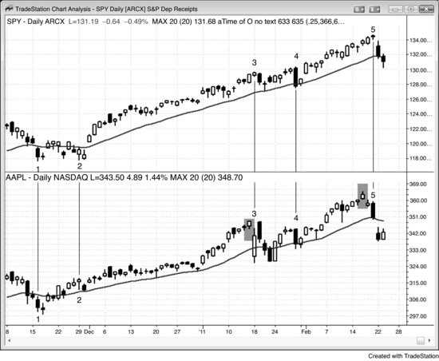
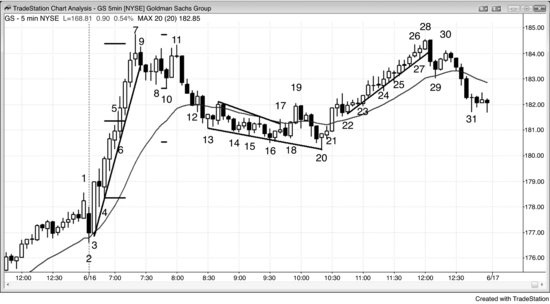
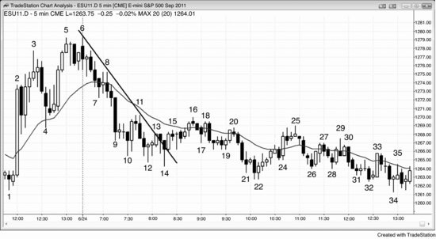

# 第一部分：趋势反转：趋势变成相反趋势

<!-- Source PDF pages 63–101 -->

<!-- PDF page 63 -->

第一部分
趋势反转：趋势变成相反趋势
交易者能获得的最重要技能之一，是可靠判断突破何时会成功、何时会反转。记住，每一根趋势K线都是突破，在每一根多头与空头趋势K线的顶部与底部都有买家与卖家，无论该K线看起来多强。任何事物的突破都一样。有交易者基于突破会成功的信念下单，也有交易者在相反方向下单，赌它会失败、市场会反转。15 分钟图上单根K线后的反转，很可能是 1 分钟图上经过许多根K线才完成的反转；而经过 10 到 20 根K线才完成的反转，在 120 分钟图上可以是单根K线反转。过程在所有时间框架上都相同，无论它发生在单根K线之后还是许多根K线之后。若交易者培养出判断突破尝试展开后市场可能走向何方的技能，他们就有了优势，会朝那个方向下单。
反转形态很常见，因为每一根趋势K线都是突破，且很快会有人尝试让突破失败并反转，如第二册第 5 章所讨论。若突破看起来比反转尝试更强，反转尝试通常不会成功，而这次反转尝试会成为新趋势中旗形的起点。例如，若震荡区间出现多头突破，多头尖峰由两根带小影线的大型多头趋势K线构成，下一根是空头十字星K线，那根空头K线是一次尝试：让突破失败并反转向下进入空头趋势。由于突破远强于反转尝试，更可能在空头K线下方买家多于卖家，而做空的入场K线会成为突破回撤的买入信号K线。换句话说，反转不会成功，更可能成为多头旗形的起点，并随后再有一段上涨。若反转形态看起来远强于突破，更可能突破会失败、市场会反转。第二册第 2 章讨论如何衡量突破的强度。简言之，出现的强度信号越多，突破越可能成功，而反转尝试越可能失败并导致 <!-- PDF page 64 --> 突破回撤形态。
机构交易由裁量交易者与计算机完成，计算机程序交易已变得越来越重要。机构的交易基于基本面或技术信息，或两者结合，两类交易都既有人工交易者也有计算机。总体而言，多数裁量交易者主要基于基本面信息做决策，而多数计算机交易基于技术数据。由于如今大部分成交量由高频交易（HFT）公司交易，且多数交易基于价格行为与其他技术数据，多数程序交易是技术导向的。在二十世纪末，单一机构运行一个大型程序就能推动市场，该程序会创造微型通道，交易者将其视为程序在运行的信号。如今，Emini 多数日子有十几个左右的微型通道，许多有超过 10 万张合约成交。以当前 Emini 约 1200 计，那对应约 60 亿美元，大于单一机构为一笔小交易会交易的规模。这意味着单一机构无法把市场推动很远或很久，图表上的所有运动都是由许多机构同时朝同一方向交易造成的。此外，HFT 计算机分析每一个 tick，整天不断下单。当它们检测到程序时，许多会在程序方向上剥头皮，并在微型通道（程序）进行期间常常占大部分成交量。
主要基于技术信息交易的机构无法永远朝一个方向推动市场，因为到某个点，对基于基本面交易的机构而言，市场会显得提供价值。若技术机构把价格推得太高，基本面机构与其他技术机构会把市场视为平多与启动做空的绝佳价格，它们会压倒多头技术交易并把市场推下。当技术交易创造空头趋势时，到某个点在基本面与其他技术机构眼中市场会明显便宜。买家会进来并压倒造成抛售的技术机构，把市场反转向上。所有时间框架上的趋势反转总是发生在支撑与阻力位，因为技术交易者与程序把它们视为应停止加压押注并开始止盈的区域，许多也会开始在相反方向交易。由于它们都基于数学，产生全部交易量约 70%、机构成交量约 80% 的计算机算法知道它们在哪里。此外，机构基本面交易者也关注明显的技术因素。他们把图表上的主要支撑与 <!-- PDF page 65 --> 阻力视为价值区域，当市场到达那里时会在相反方向入场。基于价值交易的程序通常会在同一区域发现价值，因为几乎总是在主要支撑与阻力附近，以任何衡量标准都有显著价值。多数程序基于价格做决策，没有秘密。当有重要价格时，无论用什么逻辑，它们都看见它。基本面交易者（人与机器）等待价值，一旦检测到就大举投入。他们想在认为市场便宜时买入，在认为昂贵时卖出。例如，若市场在下跌，但正到达机构觉得它开始变便宜的价格水平，它们会从天而降并激进买入。这在开盘反转中最戏剧性、也最常见（反转可以向上或向下，在本书后面交易开盘的部分讨论）。空头会买回空单止盈，多头会买入建立新多单。没有人擅长知道市场何时已走得够远，但多数有经验的交易者与程序通常对自己知道市场何时已走得过远相当有信心。
因为机构会等到市场明显超卖才买入，在可能的底部上方区域买家缺席，市场能够加速下跌到它们确信便宜的区域。有些机构依赖程序决定何时买入，其他是裁量的。一旦足够多的机构买入，市场通常会至少反转向上两段，并在这发生的时间框架图上约 10 根或更多K线。在下跌过程中，机构继续一路做空，直到它们判断已到达可能的目标、不太可能再跌，此时它们止盈。市场越超卖，卖出成交量中技术导向的比例越大，因为基本面交易者与程序在认为市场便宜、很快应被买入时不会继续做空。当市场接近主要支撑位时买家相对缺席，常常导致卖盘加速进入支撑，通常造成卖盘真空，把市场吸到支撑下方形成高潮式抛售，此时市场急剧反转向上。多数支撑位不会阻止空头趋势（多数阻力位也不会阻止多头趋势），但当市场终于反转向上时，它会在明显的主要支撑位，如长期趋势线。抛售的底部与向上反转通常伴随非常大的成交量。市场下跌时，沿途有许多反弹到阻力位、抛售到支撑位，每一次反转都发生在足够多机构判断它已走得过远、在相反方向提供价值时 <!-- PDF page 66 --> 。当足够多机构在同一水平附近行动时，主要反转就发生了。
有基本面与技术方式确定支撑。例如，可以用计算估计，如 S&P 500 市盈率理论上应是多少，但这些计算对足够多机构达成一致而言从未足够精确。然而，传统的支撑与阻力区域更容易看见，因此更可能被许多机构注意到，它们更清晰地界定市场应在何处反转。在 1987 与 2008–2009 年两次崩盘中，市场都崩到略低于月趋势线然后反转向上，创造主要底部。市场会继续上涨，伴随许多向下测试，直到它走得过远，而这总是在显著阻力位。只有那时机构才能确信平多与做空有明确价值。然后过程反向下行。
基本面（买或卖的价值）决定总体方向，但技术面决定实际转折点。市场始终在探寻价值，价值是一种过度，且总是在支撑与阻力位。报告与新闻随时可改变基本面（对价值的感知），足以让市场上涨或下跌数分钟到数日。持续数月的主要反转基于基本面，并在支撑与阻力位开始与结束。这对每个市场与每个时间框架都成立。
重要的是意识到：在市场已从主要顶部开始下跌之后，新闻仍会把基本面报为看多；在从主要底部反转向上之后，仍报为看空。新闻仍把市场视为看多或看空，并不意味着机构仍然如此。交易图表，不要交易新闻。价格是真相，市场总是领先新闻。事实上，新闻在市场顶部最看多，在市场底部最看空。记者陷入狂热或绝望，寻找会解释为何趋势如此强、还会持续更久的评论员。他们会忽略最聪明的交易者，可能甚至不知道他们是谁。那些交易者对赚钱感兴趣，对新闻不感兴趣，不会主动找记者。当记者打车上班，司机告诉他刚卖掉所有股票并抵押房子以便买黄金时，记者兴奋起来，迫不及待要找一个看多评论员上节目，确认记者对黄金牛市的深刻洞见。「想想看，市场如此强，连我的出租车司机都在买黄金！因此人人都会卖掉所有其他资产再买更多， <!-- PDF page 67 --> 市场还得再猛涨好几个月！」对我来说，当连最弱的交易者终于进入市场时，就没有人再留下买入了。市场需要愿意在更高价买入的更傻的人，好让你能带利润卖出。当没有人留下时，市场只能朝一个方向走，而这与新闻告诉你的相反。要抵抗电视上无休止的、有说服力的教授式评论员很难，他们给出博学的论点说明黄金不可能下跌、事实上明年还会再翻倍。然而你必须意识到，他们在那里是为了自我吹嘘与娱乐。网络需要娱乐来吸引观众与广告收入。若你想知道机构真正在做什么，只需看图表。机构太大无法隐藏，若你理解如何读图，你会看见它们在做什么、市场走向何方，而这通常与你在电视上看到的任何东西无关。
成功的趋势反转是从多头市场变为空头市场，或从空头市场变为多头市场，而要记住的最重要一点是：多数趋势反转尝试会失败。市场有惯性，意味着它有强烈倾向继续它一直在做的事，并对变化有强烈阻力。结果是，实际上并不存在所谓的趋势反转形态。当有趋势时，所有形态都是延续形态，但偶尔会有一个失败。多数技术分析师会把那次失败标为反转形态，但由于多数时候它作为反转失败而趋势继续，更准确的看法是它只是延续形态。趋势像一艘巨轮，需要长时间施加大量力量才能改变方向。在相反方向的交易者能取得控制之前，通常必须有某种双边交易的增加，而那种双边交易就是震荡区间。因此，多数反转形态是震荡区间，但你应预期震荡区间的突破朝趋势方向，因为约 80% 的情况如此。有时突破会朝相反方向，或顺势突破会很快失败然后反转。当那些事件发生时，多数交易者会把震荡区间标为反转形态，如双顶、头肩顶或最后旗形。第一部分列出的所有反转形态都可导致相反方向的趋势，但它们也可只导致震荡区间，而震荡区间更可能随后是趋势恢复。在这种情况下，反转形态只是多头趋势中的多头旗形，或空头趋势中的空头旗形。
当趋势反转时，反转可以早期就尖锐、立即且有很多信念，也可以在十几根或更多K线的过程中缓慢发生。当它缓慢发生时，市场通常看起来像在形成 <!-- PDF page 68 --> 又一个旗形，但回撤继续增长，直到某个点顺势交易者放弃，出现逆势方向的突破。例如，假设有空头趋势开始回撤，形成 Low 1 形态，但信号触发后市场立即转上。然后触发 Low 2 入场，那也在一两根K线内失败。此时，假定市场要么突破空头旗形顶部，要么再有一次上推、触发楔形空头旗形、入场失败，然后市场向上突破。反转在某个点使多数交易者相信始终持仓（always-in）仓位已反转，而这几乎总是需要某种突破。这在第 15 章详细讨论，意思是：若你必须始终在市场中，要么做多要么做空，始终持仓仓位就是你当前的仓位。突破特征与任何突破相同，在第二册第一部分关于突破的章节中讨论过。此时有了新趋势，交易者扭转他们的心态。当多头趋势反转为空头趋势时，他们停止在K线上方止损买入、在K线下方限价买入，开始在K线上方限价卖出、在K线下方止损卖出。当空头趋势反转为多头趋势时，他们停止在K线下方止损卖出、在K线上方限价卖出，开始在K线上方止损买入、在K线下方限价买入。关于趋势行为，见第一册第三部分。
每一个趋势都包含在通道内，通道由趋势线与趋势通道线界定，即便通道在快速看图时可能不明显。这些书中最重要的单一规则是：在通道出现突破之前——意味着越过显著趋势线的突破——你绝不应该考虑逆势交易。此外，你只应在有强信号K线时做反转交易。你需要证据表明另一方足够强，有机会取得控制。即便那时，你仍应寻找顺势交易，因为在这第一次逆势冲刺之后，市场几乎总会回到旧趋势方向去测试旧趋势极值。只有极少情况下趋势线突破动量如此强，以至于测试不适合至少做一次剥头皮。若市场在旧极值价格附近再次失败，它就两次尝试穿越该水平并失败，而每当市场两次尝试做某事并失败时，它通常会尝试相反方向。正是在这次对旧极值的测试之后，你才应寻找逆势波段交易，且仅当从旧极值反转离开时有好的形态。
非常重要的是区分反转交易与逆势剥头皮。

<!-- PDF page 69 -->

反转交易是始终持仓翻转很可能发生的交易。逆势剥头皮不是反转交易；它通常有差的交易者公式，且多数形成于通道内。通道总是看起来即将反转，诱骗交易者用止损入场做逆势交易。这些交易者很快被困并以亏损平仓。例如，若有多头通道，它通常在每一次突破到新高后有看起来合理的空头反转或内包K线。初学者会看到到均线有足够空间做空剥头皮，并在该K线下方止损做空。他们会在 70% 或更多的逆势剥头皮上亏钱，且平均亏损会大于平均盈利。他们做空是因为急于交易，且多数买入信号看起来弱，常常迫使交易者在通道顶部几个 tick 内买入。逆势形态常常有好看的信号K线，说服交易者在等待好看的买入形态时可以巧妙做一次空头剥头皮。他们把先前所有空头反转K线与回撤视为累积卖盘压力的信号，他们是对的。然而，多数空头剥头皮最终只是微型卖盘真空，市场被吸到支撑位，如通道底部附近，或次要更高低点下方。一旦到那里，强多头开始激进买入。许多人在新高止盈，创造下一个卖出信号，而它会像所有更早的信号一样失败。高频交易公司支付微不足道的佣金，可以靠一两个 tick 盈利交易，但你不行。虽然有好看的反转K线，这些不是可交易的反转，交易者不应做它们。只要信号不足以把始终持仓方向翻转为做空，就只在趋势方向交易。机构在那些卖出信号K线的低点下方买入。若你想在通道形成时交易，你要么必须像机构一样在前一根K线下方限价买入，要么在 High 2 信号K线上方买入——那通常是空头买回亏损空单的地方。然而这对许多交易者很难，因为他们能看到通道有大量双边交易，并知道在有大量双边交易的通道顶部买入是一种交易者公式往往只有边际正期望的方法。
趋势反转，或简称反转，不一定是实际的趋势反转，因为该术语暗示市场正在从一种行为变为任何相反行为。最好把它想成从多头趋势变为空头趋势或反过来，而这是第一部分的主题。震荡区间行为可以说是趋势行为的反面，因此若震荡区间突破进入趋势，那是市场行为的反转，但更常被描述为突破。回撤是小震荡区间，也是 <!-- PDF page 70 --> 逆着更大趋势的小趋势，当回撤结束时，那个次要趋势反转回主要趋势方向。多数趋势反转最终成为更高时间框架趋势中的回撤，意味着多数最终成为大震荡区间；然而，有些会成为相反方向的强、持久趋势。即便反转导致震荡区间，反转入场通常也会走得足够远成为波段交易。
多数趋势反转尝试不会导致强的相反趋势，反而导致震荡区间。严格来说，行为已反转为相反类型的价格行为（从单边交易到双边交易），但趋势并未反转为相反趋势。交易者事先从不知道是否会有反转为新趋势，而反转入震荡区间在数十根K线内常常与反转入新趋势看起来一样。因此，交易者要到很久以后才知道是反转入相反趋势，还是只是过渡到震荡区间。这就是为何多数交易——其中回报是风险的许多倍——在开始时概率如此之小。随着运动变得更确定，回报变小，因为离运动结束所剩 tick 更少，而风险变大，因为波段交易理论上理想的止损越过最近尖峰的起点（多头中最近更高低点下方，或空头中最近更低高点上方，那可能很远）。从交易者视角，这无关紧要，因为无论它演化成强的新趋势还是只是几大段逆势腿，他们都会以同样方式交易反转。是的，他们会从不回到保本止损的巨大波段中赚更多钱，但若市场停顿并只成为大震荡区间，他们仍可赚很多钱。然而，在震荡区间中，交易者若寻找剥头皮而非波段，通常会赚更多。震荡区间与回撤在第二册讨论。在真正的趋势反转中，新趋势可以走很远，交易者应波段持有其大部分仓位。
若市场确实反转入相反趋势，新趋势可以是持久的，也可以仅限单根K线。市场也可能在一两根K线后只是横盘漂移，然后稍后再次趋势，向上或向下。许多技术分析师除了事后——在一系列趋势高点与低点形成之后——不会使用「反转」一词。然而，这对交易无用，因为等到那发生会导致更弱的交易者公式，因为新趋势中的显著回撤（更大回撤）在趋势已生效越久时越可能发生。一旦交易者在与趋势相反的方向启动交易，该交易者就相信趋势已反转，即便严格标准尚未满足。例如，若交易者在 <!-- PDF page 71 --> 空头趋势中买入，他们相信市场很可能连一个 tick 都不会再低；否则他们会等着买。由于他们带着市场会走高的信念买入，他们相信趋势现在向上，因此至少在足以让交易盈利的尺度上，反转已发生。
许多技术分析师不会接受这个定义，因为它不要求趋势的某些基本组成部分存在。多数人会同意趋势反转的两个要求。第一个是绝对要求：运动必须突破前一趋势的趋势线，使旧趋势通道被打破。第二个要求多数时候发生，但并非必需：在趋势线突破之后，市场回来并成功测试旧趋势的极值。极少情况下，可以有高潮式反转，初始运动持久，且从不接近测试旧极值。
任何反转的顺序都相同。每一个趋势都在通道中，当有运动突破趋势线时，市场已突破通道。这种越过趋势线的突破之后，是回到趋势方向的运动。趋势交易者希望这是失败的反转尝试，旧趋势会恢复。若他们是对的，新趋势通道通常会更宽、更不陡，这表明动量有所丧失。这在趋势成熟时是自然的。他们把这次趋势线突破仅仅视为导致又一个旗形，随后会有趋势的延伸。
逆势交易者希望突破之后这次回到旧趋势方向的反转是突破回测，然后至少再有一段逆着旧趋势的腿。在成功的突破中，市场不会恢复趋势，测试会再次反转，测试成为新趋势中的突破回撤，或至少是更大调整中的回撤。例如，在空头趋势中突破空头趋势线上方时，在某个点反转会尝试失败然后抛售到更低低点、双底或更高低点，这是对空头低点的测试。若该测试成功，该测试成为突破空头趋势线上方的突破回撤，新多头趋势至少再恢复一段。当向上反转导致反转入新趋势时，突破空头趋势线上方的反弹是多头开始取得市场控制的时候，即便这次多头突破的回撤跌到更低低点。多数交易者会把更低低点视为多头趋势的起点，但多头常常在突破空头趋势线上方的尖峰期间取得控制。你说多头始于多头尖峰底部还是更低低点反转底部并不重要，因为你以同样方式交易市场。你寻找从更低 <!-- PDF page 72 --> 低点（或双底或更高低点）反转向上时买入。随后的反弹可以成为大的两段式调整、震荡区间的起点，或新多头趋势。无论最终结果是什么，多头都有很好机会做盈利交易。若测试不成功，市场会继续下跌进入新的空头腿，交易者必须寻找另一个突破新空头通道上方、然后对新空头低点的另一次测试，再寻找买入底部。当多头趋势有低于多头趋势线的空头尖峰，然后有更高高点、双顶或更低高点作为突破的回撤时，情况相反。空头在尖峰期间开始取得市场控制。对多头高点的测试，即便超过旧高，仍只是低于多头趋势线的初始空头突破的回撤。
一旦有了强逆势运动，回撤对多头与空头都是测试。例如，假设多头市场中有强下行动作，该运动突破了维持 20 到 40 根K线的趋势线；然后继续下跌 20 根K线，远低于 20 周期移动平均线，甚至低于多头趋势最近更高低点的低点；在这种情况下空头已展示出相当大的力量。一旦这第一段下跌耗尽自己，空头会开始部分止盈，多头会开始恢复其多单。两者都会使市场走高，多头与空头都会非常仔细地观察这次运动。由于下跌腿如此强，多头与空头都相信其低点很可能在市场突破到新高之前被测试。因此，当市场反弹时，若没有强上行动量，新多头会开始止盈，空头会变得激进并加空。此外，扛过抛售的多头会利用这次反弹开始平多。他们想一直做多直到看见强空头，而由于空头展示了令人印象深刻的力量，这些多头会寻找任何反弹出场。这代表市场上方的供给，会限制反弹并增加再有一段下跌的机会。反弹很可能有许多空头K线与影线，两者都表明多头弱。从这次反弹向下的抛售会创造潜在新空头趋势中的第一个更低高点。无论如何，概率很高会有第二段下跌，因为多头与空头都预期它并会据此交易。
仍会有在低得多的地方买入、想给多头趋势每一种可能机会恢复的多头。交易者知道多数反转尝试失败，许多一路做多上来的人在空头展示出把市场猛烈推下的能力之前不会平多。许多做多者买入看跌期权保护自己以防严重反转。看跌期权让他们能持有，给多头趋势每一种可能机会恢复。他们知道 <!-- PDF page 73 --> 看跌期权限制其损失，无论市场跌多远，但一旦他们看见这令人印象深刻的卖盘压力，他们会寻找反弹最终平多，并在市场转回向上时对看跌期权止盈。此外，他们多数看跌期权在几个月内到期，一旦到期，交易者不再有下行保护。这意味着除非他们继续买越来越多的看跌期权，否则不能继续持有仓位。若他们相信市场很可能进一步下跌且许多个月不会再反弹，继续为持续的看跌保护付费没有意义。相反，他们会寻找平掉仓位。他们的供给会限制反弹，他们的卖出，加上激进空头的做空以及把抛售视为买入机会的多头的止盈，会创造第二段下跌。
这些执着的多头在下行各有一个价格水平，若到达，会让他们想在下一次反弹出场。随着市场继续走低，越来越多这些多头会认定多头趋势不会很快恢复，趋势可能已反转入空头趋势。这些剩余的死硬做多者会耐心等待空头波段中的回撤来平多，他们的仓位代表悬在市场上方的供给。他们在最近摆动高点下方卖出，因为他们怀疑市场能否越过先前摆动高点，并乐意在任何高于最近低点的价格出场。空头也会寻找每一个新低的回撤来加空并建立新空单。结果是一系列更低高点与更低低点，这就是空头趋势的定义。
典型地，初始运动会突破趋势线，然后形成回撤测试旧趋势的末端，交易者会在这次测试之后寻找启动逆势（实际上是顺势，在新趋势方向）仓位。多数交易者希望突破趋势线的腿与测试趋势极值的腿有不止两三根K线。五根够吗？十根呢？这完全取决于背景。仅有一两根异常大K线的趋势线突破可以足以让交易者预期至少第二段。两根K线的回撤是否足够测试旧极值？多数交易者更喜欢看到至少大约五根K线，但有时趋势线突破或回撤可以只有两三根K线长，仍能说服交易者趋势已反转。若两段中有一段只有几根K线，多数交易者不会激进交易新趋势，除非另一段有更多K线。因此，新趋势很少在仅两根K线的趋势线突破然后两根K线测试旧趋势之后开始。即便有时发生，概率很高在接下来约 10 根K线内会有更大回撤。

<!-- PDF page 74 -->

趋势线突破后的测试可能达不到先前极值，也可能超过它，但不会太多。对任何逆势交易，交易者应坚持要强信号K线，因为没有它成功概率小得多。例如，若有空头趋势然后急剧上行，远超空头趋势线，交易者会寻找在第一次回撤买入，希望是许多更高低点中的第一个。他们会想要强多头反转K线或两K线反转再入场。然而，有时回撤延伸到空头趋势低点下方，扫掉新多单的止损。若这个更低低点在几根K线内反转向上，它可以导致强波段上行。相反，若更低低点延伸到先前低点下方太远，最好假定空头趋势已开始新的下跌腿，然后等待另一次趋势线突破、上行动量冲刺，以及更高或更低低点回撤，再再次做多。
虽然交易者喜欢在新多头趋势中买入第一个更高低点，或在新空头趋势中卖出第一个更低高点，若新趋势良好，会有一系列带回撤的趋势摆动（多头趋势中更高高点与更高低点，或空头趋势中更低高点与更低低点），每一个这些回撤都可提供绝佳入场。回撤可以是强空头尖峰，但只要交易者认为趋势现在向上，他们会在强空头趋势K线收盘附近买入，预期没有跟随，并寻找空头反转失败。多头把强空头尖峰视为短暂的价值机会。不幸的是，初学者把它视为新空头趋势的起点，忽略先前K线的所有多头性，只聚焦这一两根K线的空头尖峰。他们正好在强多头买入的地方做空。多头会预期空头的每一次尝试都失败，因此寻找买入每一次。他们会在每一根空头趋势K线收盘附近买入，即便该K线很大且收在最低点。他们会在市场跌破前一根低点、任何先前摆动低点、以及任何支撑位（如趋势线）时买入。他们也会买入市场每一次试图走高的尝试，如多头趋势K线高点附近，或市场越过前一根高点或阻力位上方时。这与交易者在强空头市场中做的完全相反——那时他们在K线上方与下方、以及阻力与支撑上方与下方卖出。他们在K线上方（以及每一种阻力附近）卖出，包括强多头趋势K线，因为他们把每一次上行走动视为反转趋势的尝试，而多数趋势反转尝试失败。他们在K线下方（以及每一种支撑附近）卖出，因为他们把每一次下行走动视为恢复空头趋势的尝试，并预期多数会成功。
反转入新多头趋势后的第一次回撤通常是对空头低点的测试，但它甚至可能不太接近空头低点。它，像所有 <!-- PDF page 75 --> 新多头趋势中随后的回撤一样，也可以是对关键点突破的测试，如最近信号K线高点或入场K线低点、趋势线、先前摆动点、震荡区间或移动平均线。在市场越过第一段上涨的高点之后，多头会把保护性止损上移到这个更高低点正下方。他们会在每一个新的更高高点之后继续把止损跟踪到最近更高低点正下方，直到他们相信市场开始足够双边，开始有两段式向下调整。一旦他们相信市场会有第二段下跌、很可能跌破第一段下跌的低点（最近更高低点），他们会寻找在强度上平多，如在位于趋势高点、略高于或略低于趋势高点的多头趋势K线收盘附近，或在前一根低点下方。一旦他们相信市场会到达那里，在最近更高低点下方出场对他们没有意义。相反，他们会在更高处出场，并寻找在那个更高低点附近再次买入。若这个多头旗形是横盘的，它可以是简单的 High 2、三角形或双底；它也可以形成更低低点并成为传统的 ABC 调整。
所有趋势都在通道中，多数趋势以趋势通道的突破结束，而这在你面前的时间框架图上可能不明显。例如，多头趋势通常以两种方式之一结束。第一，可以有通道上方的突破，试图创造甚至更陡的多头趋势。这只极少成功，通常在一到五根K线内失败。然后市场反转回到趋势通道线下方进入通道，最小目标是刺破通道底部的趋势线。这通常至少有两段横盘到向下的调整，并可能导致趋势反转或震荡区间。第一段下跌的回撤通常成为更低高点，第二段下跌通常延伸到某个等幅运动目标，如腿 1 = 腿 2 运动，或基于空头尖峰高度或基于多头通道内某个震荡区间高度的投射。
或者，市场可以在没有先过度延伸趋势通道线的情况下跌破多头趋势线。突破可以是急剧向下的尖峰，或横盘漂移进入震荡区间。无论哪种情况，测试多头高点的回撤可以是更高高点或更低高点；它们大约同样频繁发生。由于约三分之二情况下至少会有两段下跌，更高高点之后应有两段下跌，而更低高点之后可能只有单段，因为第一段下跌已在更低高点形成之前发生。在另外三分之一情况下，反转尝试失败，多头趋势恢复或形成震荡区间。

<!-- PDF page 76 -->

若市场在对旧多头高点的测试中形成更高高点，最好的交易之一是在第一个更低高点上寻找做空形态，这是对更高高点的测试。在空头趋势中若有突破主要空头趋势线上方的上行动量冲刺，交易者会买入第一个更高低点。他们的买入抬高市场，并强化人人关于新多头趋势可能正在开始的信念。
一个重要观点是：趋势持续的时间远比多数交易者想象的长。因此，多数反转形态失败并演化为延续形态，多数延续形态成功。交易者基于反转形态做逆势交易时必须非常小心，但有价格行为形态可大大增加盈利交易的机会。
由于多数反转尝试失败，许多交易者在相反方向入场。例如，若有多头趋势并形成收在最低点的大型空头趋势K线，多数交易者会预期这次反转尝试失败，许多人会在空头K线收盘买入。若下一根有多头实体，他们会在该K线收盘及其高点上方买入。第一个目标是空头趋势K线的高点，下一个目标是等幅上行，等于空头趋势K线的高度。有些交易者会使用与空头趋势K线高度大约相同 tick 数的初始保护性止损，其他人会使用他们通常的止损，如 Emini 中的两点。
若你发现自己在趋势中画许多趋势通道线并看到许多楔形反转形态，那么你太急于找反转，很可能错过许多绝佳的顺势交易。此外，由于在强趋势中多数趋势通道线过度延伸与反转是次要的且失败，你会一笔接一笔亏损，并想知道为何这些形态在本应很好时却失败。等待强趋势线突破再寻找逆势交易；把所有那些次要趋势通道线过度延伸视为顺势形态的起点，并在输家用保护性止损出场的地方入场。你会更快乐、更放松、更富有，并会因它们在直觉上不应有效却有效得很好而感到有趣。
初学者在强多头趋势中卖反弹如此诱人的原因之一是，市场在腿的高点附近花太多时间，人变得不耐烦等待似乎永远不来的回撤。此外，到屏幕顶部似乎没有足够空间让市场再走高，因此容易想象它必须走低。市场如此 <!-- PDF page 77 --> 过度，肯定必须有即将到来的向均值回归，以反转形式出现，跌得足够远至少让剥头皮者获利。交易者开始相信在等待市场回撤期间必须做点什么，作为交易者他们假定必须交易。相反，他们应把自己想成必须赚很多钱、而不是做很多交易的交易者。由于他们害怕在高点买入并相信回撤已逾期，他们做空，预期在市场开始回撤时赚钱。多数时候，市场会小幅回撤然后反转向上。它跌得不够远让他们在逆势空头剥头皮上获利，他们被止损离场亏损。然后多头趋势再次以快速突破恢复，他们在场外观看，感到悲伤，并略微更穷。有经验的交易者做这笔交易的另一边。许多人限价在那根弱势空头信号K线低点买入，其他人止损在小回撤中前一根高点上方一个 tick 做多。当回撤形成做多形态时，初学者仍盯着导致回撤的那个顶部，害怕市场可能进一步下跌。或者他们仍做空，希望市场再跌一点点以便在空头剥头皮上获利。肯定他们的某个空头剥头皮必须有效。他们刚在最近四次做空上亏损，市场必须意识到这有多不公平，现在会补偿他们一个利润。他们不接受这全是数学，与公平或情绪无关。在数月或数年亏损之后，他们决定当看见多头趋势时，整天不接一笔空单。那就是他们停止亏钱的日子。在许多个月之后，他们决定当有多头趋势时，他们只买入回撤，不做其他交易。那就是他们开始赚钱的日子。
在多头趋势中，买家继续买入，直到他们认定交易者公式不再像他们希望的那样有利，此时他们开始部分止盈。随着市场继续上涨，他们继续止盈更多，并不急于再次买入，直到有回撤。此外，随着市场继续上行，空头被挤压出市场，被迫买回其空单。在某个点，他们会平掉所有想平的仓位，他们的买入会停止。也会有动量交易者，只要有好动量就继续买入，但这些交易者一旦动量放缓会很快止盈。市场会继续上行，直到它过度延伸等距运动的方向概率。多头与空头从不确定那个概率何时是 50%，趋势会继续，直到数学明确有利于向下运动。中性从不明晰，而过度容易得多被发现。它总会发生在某个磁铁区域，但由于可选择的如此之多，很难知道哪个会有效。通常，必须有磁铁的汇合，回撤才会展开。有些公司会基于一个或更多磁铁下单，其他公司会用不同的；但一旦有 <!-- PDF page 78 --> 临界数量的公司预期回撤，市场就会转向。临界数量在卖盘压力变得大于买盘压力时到来，这是由于预期回撤的交易者交易了更多美元。将不再有报价短缺，要求市场走高寻找愿意接多单另一边的交易者。相反，交易者会急于在卖价做空。事实上，他们会开始在买价做空，市场必须走低寻找足够买家来填补大量卖单。那些卖家将是平多的多头与建立空单的空头的组合。
那么谁在多头趋势顶部的最后一个 tick 买入，或在空头趋势低点卖出？是无数被恐慌裹挟的小交易者的累积吗——他们要么在错误一边并在迅速增长的亏损面前被迫平仓，要么空仓并在快速运动的趋势后期冲动入场？但愿我们能如此有影响力！很久以前可能如此，但在今天的市场不是。若在日高低点有如此大成交量且机构构成其中大部分，若他们如此聪明为何会在日高 tick 买入？当日成交量的大部分由基于统计的数学算法驱动，其中一些模型会继续买入，直到有明确趋势变化，只有那时它们才翻转为做空。这些动量程序会一直买到多头趋势的最后一 tick，并一直空到空头趋势的最低点，因为系统的设计者已确定这种方法最大化其利润。记住，趋势有惯性，趋势非常抗拒结束，因此押注它们继续是好赌注。因为他们交易如此巨大成交量，在高点有充足的买入供应来接在顶部进入的巨大做空成交量的另一边（在底部反之亦然）。
仅仅因为他们非常聪明且交易巨大成交量，并不意味着他们每天净赚 5%。事实上，其中最好的每天净赚不到一个百分点的零头，其中一些已确定其利润通过继续买入——甚至包括日高 tick——而最大化，因为他们相信市场可能至少再高一两个 tick。许多高频交易（HFT）算法设计为每笔交易赚非常小的利润，若这些量化公司的测试告诉他们在高点买入可多赚几个 tick，他们会继续买入。许多公司也有涉及期权与其他产品的复杂策略，不可能知道在日极值处起作用的所有因素。例如，他们可能预期向下反转并 <!-- PDF page 79 --> 在进入 delta 中性价差：他们会买入 200 张 Emini 合约并买入 2,000 张 SPY 平值看跌期权。只有当市场在非常窄的区间横盘数日时他们才亏。若市场上涨，看跌期权亏损的速度慢于 Emini 增值的速度。若市场下跌，看跌期权增值快于做多 Emini 贬值，他们的中性价差变得越来越偏空头。这让他们即便在日高买入 Emini 也能盈利。你只需知道在极值处有巨大成交量，它来自机构，其中一些在高点买入而另一些在卖出。
顺便说，还有一个常见信号表明数学化、计算机生成的交易有多活跃。只需看相关市场，如 Emini 与所有相关交易所交易基金（ETF）如 SPY，你会看到它们基本上 tick 对 tick 运动。这对其他相关市场也成立。若这是手工完成的，不可能整天如此完美地发生。此外，图表形态在所有时间框架上——甚至到 tick 图——也不会如此完美，除非巨大成交量的交易是计算机生成的。人根本无法同时在如此多市场中那么快地分析与下单，因此完美必须是计算机生成交易的结果，它们必须构成交易量的大部分。
当有没有显著回撤的强趋势时，开始寻找小反转很常见，因为常识要求市场最终必须回撤，因为交易者开始部分止盈，足够多的逆势交易者建立新仓位。向均值回归的逻辑在生活中处处有效，在交易中也应如此。它确实如此，但通常发生在市场到达远比多数交易者能想象更大的极值之后。交易者必须决定是寻找逆势剥头皮更好，还是等待回撤结束然后在趋势方向入场。若趋势强，通常更好只在有明确趋势反转信号时做逆势交易，如先前的强趋势线突破，然后以强反转K线结束的测试。然而，做点什么的诱惑很大，许多交易者会开始看更小时间框架图，如 1 分钟或 100 tick 图。更小时间框架图在趋势进行时继续形成反转，绝大多数反转失败。交易者可以合理化做逆势交易：1 分钟图有小K线因此风险只有约四个 tick，若这结果是市场的精确顶部，潜在收益巨大。因此，承受几次小亏损是值得的。不可避免地，几次 <!-- PDF page 80 --> 小亏损变成六七次，它们的综合效应是当天晚些时候无法挽回的亏损。当交易者走运并精确抓到趋势末端时，他们会以几个 tick 利润剥头皮出场，而不是像最初计划的那样持有很远。这是数学上的死亡。感觉自己聪明到买入空头趋势低点或做空多头趋势高点很好，但若你在 10 次尝试中亏 9 次，你会慢慢破产。总体而言，在多头趋势中买入回撤、在空头趋势中卖出反弹，对多数交易者是好得多的方法。交易多得多，且胜率更高。
若你因在延伸趋势中不在市场中而变得焦躁，感觉需要交易，于是开始看 1 分钟图，那些 1 分钟反转提供非常盈利的赚钱方式。然而，是通过做与显而易见相反的事。等待 1 分钟反转触发逆势入场——你不做——然后确定若你做了那笔交易会把保护性止损放在哪里。然后，在那个价格放置止损单顺势入场。你会正好在逆势交易者被止损离场时被止损入场进入顺势仓位。此时没有人会寻找逆势入场，很可能直到趋势已走得足够远在下一个逆势形态开始形成之前获利。这是非常高概率的顺势剥头皮。
最可靠的单一逆势交易实际上是更大时间框架上的顺势交易。回撤是逆着更大趋势的小趋势，当你逆着该回撤的趋势入场时，你是在更大趋势方向入场。一旦回撤交易者已耗尽自己，趋势交易者通过突破包含回撤的趋势线再次展示其决心，任何小回撤来测试这次突破都是绝佳的突破回撤入场。这个入场逆着回撤的趋势，但在主要趋势方向，通常至少导致对主要趋势极值的测试。趋势线突破中存在的动量越多，交易越可能盈利。例如，若有多头旗形，你可以买入多头旗形底部、多头旗形突破，或从该突破的小回撤，以测试多头趋势高点。
反转中的动量可以是几根大趋势K线的形式，或一系列看起来平均的趋势K线。强度信号越多，反转越可靠。这些在第二册第 2 章关于突破强度与第一册第 19 章关于趋势强度中更详细讨论。理想地，反转的第一段会延伸许多根K线，远超移动平均线，多数K线是新趋势方向的趋势K线，并越过先前趋势中的摆动点 <!-- PDF page 81 --> （若先前趋势是多头趋势，若新空头趋势的第一段跌破并收在该先前多头趋势的一个或多个更高低点下方，是力量信号）。
大交易者毫不犹豫在趋势的尖峰阶段入场，因为他们预期有显著跟随，即便在他们入场后立即有回撤。若发生回撤，他们增加仓位规模。例如，若有持续几根K线的强多头突破，随着每一个新的更高 tick，越来越多机构确信市场已变为始终做多，当他们相信市场会走高时，他们开始买入。这使尖峰非常快地增长。他们有许多入场方式，如市价买入、买入一两个 tick 回撤、在前一根上方止损买入，或在先前摆动高点上方突破买入。他们如何入场不重要，因为他们的焦点是至少建上小仓位，然后在市场走高时或若它回撤时再买更多。由于他们会在市场走高时加仓，尖峰可以延伸许多根K线。初学交易者看到增长的尖峰，想知道谁会在如此巨大运动的顶部买入。他们不理解的是，机构如此确信市场不久就会更高，以至于他们一路买入，因为他们不想在等待回撤形成时错过行情。初学者也害怕止损必须放在尖峰底部下方，或至少在中点下方，那很远。机构知道这一点，并只是把仓位规模调小到美元风险与任何其他交易相同的水平。在某个点，早期买家部分止盈，然后市场小幅回撤。当它回撤时，想要更大仓位的交易者迅速买入，从而使初始回撤保持很小。
虽然最好的反转有强动量并走很远，它们常常启动非常慢，可以在急剧运动开始前有几根小K线。结果是多数趋势反转形态的成功概率低于 50%。例如，新多头趋势中的向上反转常常以低动量反弹开始，K线重叠且有回撤，使许多交易者相信又一个空头旗形正在形成。第一次回撤是 Low 1 做空形态。然而，交易者不应做空 Low 1，除非市场处于明确空头趋势中的强空头尖峰，因此这个 Low 1 很可能失败。激进交易者反而会在 Low 1 信号K线底部及下方买入，预期它失败。然后常常有 Low 2 做空形态。然而，若你相信趋势已反转向上，这也很可能失败，激进多头会再次在 Low 2 信号K线低点及下方限价买入。一旦它确实 <!-- PDF page 82 --> 失败，交易者会把这个失败的 Low 2 视为失败的空头旗形，它常常导致向上的强突破。那个空头旗形成为空头趋势中的最后旗形，即便它向下突破从未超过大约一个 tick。有时市场在向上突破形成前再有一次上推进入楔形空头旗形。
你可以把空头旗形想成市场试图把你困出几根K线前在第一次向上反转时进入的多单，这样你将不得不追高并给新多头趋势加油。其中一个失败的做空入场常常很快成为强的向上外包K线。这发生得如此快，以至于许多寻找买入失败 Low 1 或 Low 2 的多头变得瘫痪。他们希望有安静的买入信号K线，高点在 Low 2 信号K线底部附近，结果却被迫快速决策。他们想在可能是空头旗形顶部买入向上外包K线吗？多数交易者会犹豫并等待回撤买入，但此时人人相信空头已输、市场会走高。他们不知道接下来几根K线是否会有回撤，但他们知道若有，之后会有到多头腿的新高。当那种清晰的始终持仓心态存在时，通常在市场高得多之前不会有回撤。这就是为何至少买入小仓位很重要。多头尖峰的数学在第二册第一部分关于突破中讨论，更在第二册第 25 章关于交易数学中讨论，但要记住的重要一点是：若你被困在市场外，至少市价或在一两个 tick 回撤上入场小仓位，并放置非常宽的止损。这笔交易的数学强烈有利于你。
Low 1、Low 2 或楔形空头旗形会把弱势新多头困出，迫使他们在差得多的价格重新进入新多头趋势。一些最强的趋势来自这些陷阱，因为它们告诉交易者最后一个空头趋势交易者刚被烧伤，旧趋势中没有人留下。此外，它们告诉我们弱势多头交易者刚出场，现在会追赶新多头趋势，在新方向增加订单。这给交易者信心。当这种焦躁的反转在趋势线突破之后、在趋势极值的测试上发生时，新趋势通常会持续至少 10 根K线，并会回撤旧趋势最近部分的相当大一部分。
即便 5 分钟图上没有回撤K线，在趋势最开始常见在 1 与 3 分钟图上找到回撤，它们也把交易者困出。有时交易者会基于 5 分钟信号入场，并认为通过使用基于更小时间框架图的止损很聪明。当 5 <!-- PDF page 83 --> 分钟信号强时，这通常是错误。宁可忍受几根K线的焦虑，也不要在更小时间框架图上出场，因为你会在太多绝佳趋势中被困出场。
若交易者早期入场但运动犹豫（例如，有重叠K线）几根K线，这不应是担忧，尤其若那些K线多数是正确方向的趋势K线。这是力量信号，人人在观看并等待动量开始再入场。好的价格行为交易者常常能在那发生之前入场，然后能在动量开始后不久把止损移到保本，使她能以最小风险赚很多钱。若你对自己的解读有信心，做你的交易，不要担心还没有其他人看见你所看见的。他们最终会看见。确保波段持有部分甚至全部仓位，即便你有时会在趋势开始其奔腾之前在保本止损上被止损一两次。
那么最好的反转形态是什么？它是回撤的结束，当短期逆势运动正在结束并反转回主要趋势方向时。换句话说，最好的反转是多头趋势中的多头旗形，正当它向上突破时，以及空头趋势中的空头旗形，正当它反转回下时。主要反转不那么常见，因为多数反转尝试失败并成为旗形。反转交易可以基于传统反转：在趋势线突破之后然后测试极值，随后有非常强的逆势尖峰导致始终持仓翻转到相反趋势。若它发生在趋势线突破之后，常常有第二次入场。若趋势曾很强，通常更好等待那第二次入场；但若它不来，市场很可能创造足够强的逆势尖峰，使多数交易者相信始终持仓仓位已反转。例如，若有多头趋势且交易者在寻找反转但形态不是特别强，他们应等待看市场是否会在接下来约五根K线内以更低高点或更高高点的形式给出第二次入场。若它不给，反而抛售四五根K线，突破某个形态，然后在下一根有跟随，这将是足够的空头力量说服多数交易者始终持仓仓位已翻转为做空。他们会市价或在回撤上卖出。
这些材料的大部分在第二册关于震荡区间中，但在这里也相关，因为广泛存在认为反转形态可靠的误解。由于趋势不断创造反转形态且除了最后一个外全部失败，把这些常被讨论的形态想成反转形态是误导的。远更准确的是把它们想成延续形态 <!-- PDF page 84 --> ——它们很少失败，但当它们失败时，失败可导致反转。把每一个顶部或底部都视为绝佳反转形态是错误的，因为若你接所有那些逆势入场，你的多数交易会是亏损，偶尔的盈利不足以抵消亏损。然而，若你有选择性地寻找趋势可能反转的其他证据，这些可以是有效形态。
所有头肩顶与头肩底实际上都是头肩延续形态（旗形），因为它们是震荡区间，像所有震荡区间一样，它们远更可能朝趋势方向突破，只极少反转趋势。双顶与双底也一样。例如，若多头市场中有头肩顶，颈线下方的突破通常会失败，市场最可能然后反转向上并有顺势向上突破，越过右肩上方。该形态是三角形、三重底或楔形多头旗形，三段下推是左肩、头部与右肩之后的下跌腿。其他多头把从头部到颈线的下行走动视为多头旗形，形成右肩的反弹视为多头旗形上方的突破。从右肩到颈线的抛售然后要么是更低低点要么是更高低点作为该突破的回撤，若市场反转向上，多头把反转视为买入形态。
由于右肩是更低高点，空头把它视为新空头趋势中的第一次回撤，因此到右肩的反弹是空头旗形。若市场越过右肩上方，空头旗形会失败，市场通常基于右肩高度或整个头肩顶的高度反弹一个等幅运动。此外，若空头市场正在形成震荡区间且该震荡区间呈头肩顶形状，颈线下方的突破是空头旗形的顺势突破，很可能导致更低价格。
类似地，头肩底也是顺势形态。空头趋势中的头肩底通常是三角形或楔形空头旗形，应向下突破到右肩下方。多头市场中的头肩底是多头旗形，应向上突破到颈线上方。右肩本身是更小的多头旗形，若市场跌破它下方，它已失败，通常会有抛售。
绝大多数反转与震荡区间相关。由于震荡区间是旗形，通常朝趋势方向突破，多数反转形态不会导致反转。因此，没有可靠（高概率）的反转形态。例如，当有多头趋势时，多数 <!-- PDF page 85 --> 双顶、三重顶、头肩顶与三角形顶部向上突破而不是向下，是多头旗形，不会导致反转。偶尔，一个反而会向下突破并导致反转。当那发生时，交易者用某个反转形态名称指称该震荡区间；他们选择最能描述区间形状的名称。许多多头旗形的向上突破很快反转向下，然后市场向下突破，创造反转。当那发生时，多头旗形成为多头趋势中的最后旗形（第 7 章讨论）。多数高潮反转通常是最后旗形反转的变体。在空头趋势中情况相反，多数反转形态是空头旗形并导致空头突破。当一个反而导致多头突破时（无论是否先向下突破、反转向上并成为空头趋势中的最后旗形），交易者然后应用最能描述震荡区间形状的反转形态名称。
当反转是渐进的，如来自震荡区间时，震荡区间传统上在多头趋势末端被称为派发区，在空头趋势末端被称为吸筹区。当有震荡区间顶部时，多头据说在派发其多单，意思只是他们在卖出止盈。当有震荡区间底部时，多头据说在吸筹其多单，意思是他们在买入以建立多头仓位。由于卖空已变得如此常见，合乎逻辑的是把多头趋势顶部的震荡区间称为多头的派发区与空头的吸筹区——空头正在建立空头仓位。同样，当空头趋势中有震荡区间底部时，它是多头的吸筹区与空头的派发区——空头在对其空单止盈。
许多在日线图上成为反转日的日子，在 5 分钟图上是趋势型震荡日。例如，若有空头趋势型震荡日，且当天晚些时候它突破回上方震荡区间（这很常见），并反弹到该上方震荡区间顶部附近收在日高附近，该日在日线图上会是多头反转日（在第一册第 22 章更多讨论）。
典型地，趋势回撤中的入场看起来差但盈利，反转中的入场看起来相当好但是亏损。若你在寻找在空头趋势中买入反转或在多头趋势顶部做空，确保它是完美的。趋势不断形成不知为何看起来不太对的反转。也许与先前K线重叠太多，或十字星太多，或反转K线太小或在收盘前几秒回撤几个 tick，或 <!-- PDF page 86 --> 没有先前对显著趋势线的突破，或没有趋势通道线失败突破。这些几乎完美的反转把你吸进去并困住你，因此你绝不应该做反转交易，除非它清晰且强。多数时候，你应等待在新多头趋势中有更高低点后再买入，等待在新空头趋势中有更低高点后再卖出。
许多交易者寻找逆势剥头皮。他们在等待应至少有两段的强反转时变得不耐烦，反而接弱势信号。例如，他们可能在空头趋势的摆动低点买入多头反转K线。然而，若他们相信趋势仍向下且只寻找剥头皮，他们需要有计划在交易失败时出场。许多交易者若相信应有第二段上涨，会允许市场触发 Low 1 做空。他们会持有多单并希望 Low 1 做空失败并形成更高低点。若市场然后没有涨很多，反而形成 Low 2 做空形态，多数交易者会在 Low 2 触发时出场。若 Low 2 不触发并再有一次小上推，这是 Low 3 形态，是楔形空头旗形。多头必须在它触发时出场，因为这是空头趋势中的强卖出信号。他们不想趋势两次尝试恢复，许多人会在 Low 2 或 3 触发时正确翻转为做空。他们需要更高低点守住若市场要转上，若它现在形成 Low 2 或 3 做空，他们不想冒险到那个更高低点下方。与其等待更高低点下方的保护性止损被打到，他们会在 Low 2 或 3 做空入场时平多，因为他们知道空头会开始在那里激进做空，更多做空会在那个更高低点下方进来。他们知道在约 80% 情况下，强空头趋势中的 Low 2 或 3 做空会打到更高低点下方的止损，他们想最小化亏损。这是 Low 2 与 3 做空在强空头趋势中如此可靠、High 2 与 3 做多在强多头趋势中可靠的原因之一。被困的逆势剥头皮者会在那里止损，并至少再过几根K线不寻找另一笔逆势交易。这使市场在趋势交易者有利的方向单边。
市场在形成交替趋势时有节奏。一个趋势常常以趋势通道线过度延伸与反转结束，随后有两段式运动突破趋势线。然后这两段允许为新趋势画通道。有些趋势仅以趋势线突破然后测试结束，随后有第二段。同样，这两段形成新趋势通道，可能是新趋势的起点，或只是旧趋势中的旗形。若新趋势弱，它通常只导致回撤然后旧趋势恢复。交易者应始终在画或至少在想象趋势线与趋势通道线，并观察市场 <!-- PDF page 87 --> 测试这些线时如何反应。
来自空头市场的主要反转常常波动剧烈，有大K线与数次上下推动，创造一到数个卖盘高潮。人们认为最坏的已过，然后意识到「哎呀，我太早了」，并急于卖出。这可以发生数次，直到最终底部形成，并解释了为何如此多主要反转以大区间K线与失败旗形或三推形态结束。有大K线与巨量的高潮反转在底部比在顶部更常见。更常见的是，顶部来自震荡区间，如双顶或头肩顶，随后是强空头尖峰形式的向下突破。然而，顶部可以是高潮式的，底部可以是震荡区间。
当市场在更高时间框架图上处于多头趋势时，5 分钟图常常有进入收盘的反弹，日线图的K线更可能是多头趋势K线。若市场在最近几天已开始在收盘前抛售，市场可能正在过渡到空头趋势或至少到更大回撤。注意市场在最后 30 到 60 分钟做什么，因为它常常是更高时间框架趋势的反映。进入收盘的抛售可以来自共同基金赎回、日内交易者的多头平仓，以及显然来自程序——它们构成当日成交量的大部分。程序基于数学，若数学表明市场应在收盘前下跌，市场可能正在从趋势过渡到震荡区间甚至空头趋势。那些低收盘在更高时间框架图上创造弱势K线，交易者会把它们视为累积卖盘压力的信号。这会让他们推迟买入直到回撤更深，并鼓励空头更激进做空。这对多头不好。对 60 分钟或日线图上的空头趋势情况相反。5 分钟图上进入收盘的强反弹常常意味着下一次反弹可能很大，可能是多头反转的起点。
S&P 的显著顶部常常由领头羊股票如苹果（AAPL）的一两个大跌日预示。若市场领头羊在抛售，市场可能在见顶。交易者若预期整体市场有更大调整，通常会对其大赢家止盈。在强股票市场中，有些股票往往比其他涨得更快。在这些时候，交易者寻找「风险偏好」（risk-on）交易，大举投资这些股票（以及货币，如澳元、纽元、加元、瑞典克朗）。一旦他们相信股票市场会转下，他们卖出风险偏好股票并买入「风险规避」（risk-off）股票与货币，如强生（JNJ）、 <!-- PDF page 88 --> 奥驰亚集团（MO）、宝洁（PG）、美元、瑞士法郎与日元。当他们害怕某些国际事件并想确保钱在需要时安全且随时可用时，他们也投资风险规避货币、黄金与国债。当强多头趋势开始见顶时，机构从超配过渡到正常权重其股票，这常常使市场领头羊在整体市场之前数日转下。例如，若 AAPL 过去一年涨 40% 且 S&P 超买，然后苹果一天跌 3%，这可能是大交易者认为未来数日市场可能转下的信号。有自然倾向在有利润的地方止盈，若你在像苹果这样的主要科技股中有很多利润，并预期整体市场回撤 5% 到 10%，你可能先在利润最大的股票上止盈。若许多基金在一天内这样做，苹果可以在顶部跌 3%。这可能是基金准备也开始在其他股票上止盈的信号。若他们这样做，整体市场可能调整。随着整体市场下跌，交易者接到追加保证金通知，他们往往平掉利润最多的股票，即市场领头羊。这可使多头趋势中涨得最快的股票在调整中跌得最快。
反转的数学与突破的数学类似。总体而言，若形态强，你相信至少有 60% 概率至少有两段式运动，持续至少 10 根K线。在多数情况下，你的利润目标会是风险的两倍或更多，那种出色的风险/回报比，加上高成功概率，使反转交易对交易者如此有吸引力。诀窍是知道何时形态好，问题是趋势不断创造几乎够好但不完全对的反转形态。这些弱势形态不断困住过于急切的反转交易者，当他们被迫带亏损出场时，他们给增长的趋势加油。然而，有许多信号交易者可用来识别可靠形态，这些强度信号在下一章详述。
多数初始入场的成功概率相对较低（约 40% 到 50%）。有些交易者更喜欢更高概率，他们等待强跟随与清晰的始终持仓翻转。代价是以更小回报换取更高成功机会。两种方法在数学上都可以健全，交易者应选择最适合其性格的方法。例如，当 Emini 平均波幅约 10 到 15 点时，在看起来合理的反转上（背景好且有像样信号K线）四点波段的概率常常只有约 40%（当形态非常强时可以是 50% 到 60%）。然而， <!-- PDF page 89 --> 两点止损在利润目标到达或反转信号展开——交易者可以以更小亏损或小利润出场——之前被打到的机会常常只有约 30%。这使这类交易的交易者公式非常有利。若交易者在 10 笔交易中有 4 笔赢四点，他们从波段交易中有 16 点利润。若他们的其他交易由也许三次两点或更少的亏损与三次约一到三点的盈利构成，他们在那些交易上大约打平。当交易者选择适当形态时这相当典型。他们然后在 10 笔交易上有约 16 点利润，或每笔交易平均 1.6 点利润，对日内交易者很好。记住，多数交易者不会做任何反转交易，无论多次要，除非至少有双顶或双底、微型双顶或双底，或最后旗形。
图 PI.1 道琼斯工业平均指数月线图

多数反转形态至少 80% 的时间失败，图 PI.1 所示道琼斯工业平均指数月线图上的大型头肩顶也很可能失败，并成为大型楔形多头旗形或某种其他类型的多头旗形。以跌到 bar 13 的尖峰之强，它很可能被更低低点测试，形态很可能形成楔形多头旗形，并在一二十年之后被新高跟随。此刻，从 bar 13 的反弹是与 bar 9 的双底反弹。
Bar 8 是左肩顶部，bar 11 是头部，右肩正在 bar 16 形成过程中，但在市场反转向下之前——若它反转向下——它可能延伸更高。它可能到达新高并形成扩散三角形顶部，或它可能突破进入新多头腿，然后基于震荡区间高度继续上行一个等幅运动。这 <!-- PDF page 90 --> 可以是从 bar 9 低点到 bar 8 或 bar 11 高点，或从 bar 13 低点到 bar 11 高点。
靠贩卖恐惧谋生的简报作者会通过恐吓人们相信道指会等幅下跌到 1,000 以下而发财，却不理解这是多头趋势中的震荡区间，因此概率 80% 或更高它会在跌远低于 bar 13 之前向上突破。对交易者来说，押注 80% 好得多，但靠贩卖恐惧谋生的简报作者靠对 20% 或更少的时间正确赚更多钱。他们需要灾难性事件罕见，这样人们担心其财务死亡。若崩盘常见，人们会学会交易它们，就不会有足够恐惧让这些作者保持富有。
市场很可能在画在 bars 1、2 与 4 低点下方的多头趋势线——它很可能过度延伸——与画在 bars 9 与 13 低点下方的趋势通道线——这是头肩顶的颈线——附近形成对决线（dueling lines）底部。顺便注意，2008–2009 年崩盘在跌破从 bar 4 与 bar 5 低点画出的多头趋势线下方、以及 bars 7 与 9 双底下方之后反转向上。这通常就是发生的事。市场自大约 bar 7 以来一直处于震荡区间，多数突破震荡区间的尝试失败。市场有惯性，倾向于继续它一直在做的事。这也使多数反转趋势的尝试失败。
空头把头肩顶的右肩视为更低高点与新空头趋势中的第一次回撤。它因此是空头旗形。若市场明确跌破空头旗形下方——无论是否也跌破头肩顶颈线——然后反转向上并反弹到右肩顶部上方，形态会失败。反弹通常会到达基于右肩高度或整个头肩顶高度的等幅运动目标。有些交易者把颈线视为画在头部与右肩之间底部的水平线（这里是 bar 13 低点），而其他人把它视为画在头部两侧低点（bars 9 与 13）上的趋势通道线。
跌到 bar 13 的运动有如此强的动量，它很可能被测试，由于下行走动如此强，测试很可能是更低低点。那应把空头困入、多头困出，然后概率有利于市场在楔形多头旗形中反转向上。若是那样，从那里最可能的路径会是突破 bar 11 上方并等幅上行，但可能需要一二十年才会发生。

<!-- PDF page 91 -->

在 bar 13 崩盘低点前的日子里，熟悉对决线形态的交易者会看到向上反转的潜力，尤其在数根K线前的小最后旗形、连续卖盘高潮，以及大型扩散三角形多头旗形（bars 7、8、9、11 与 13）之后。
若市场从大约 bar 9 附近的更低高点抛售，它可能在从 bar 1 与 bar 4 低点画出的趋势线找到支撑。这是特别重要的线，因为它涉及 1987 年崩盘低点，那是大萧条以来最戏剧性的股票市场事件。那种量级的事件会使交易者尊重任何与之相关的技术形态。
图 PI.2 市场领头羊常常领先 S&P

市场领头羊之所以被这样称呼，是因为它们常常在时间上领先整体市场，而不仅仅在价格上。在图 PI.2 中，注意底部图中 AAPL 日线图如何在 bars 3 与 4 先于 SPY 见顶。当市场领头羊开始转下而整体市场没有时，常常是市场可能即将调整的信号。交易者从在强股票市场中强劲上涨的风险偏好股票切换到在弱股票市场中更稳定、跌得更少——若有的话——的风险规避股票。当交易者认为更深的市场调整迫近时，他们先在有最多利润的地方止盈， <!-- PDF page 92 --> 这通常在市场领头羊中。即便 AAPL 中的小抛售是因为他们只是从超配该股过渡到正常权重，它也可以是他们预期整体市场前方有麻烦的信号。
顺便说，由于多数反转尝试失败，许多交易者寻找 fade 它们。当他们看见多头趋势中有收在最低点的大型空头趋势K线，如 bar 4，尤其若它在均线附近，激进多头会在空头K线收盘买入并试图在其低点下方买入。他们的初始止损可能大约与空头K线高度相同的 tick 数，他们的第一个利润目标常常是空头K线的高点，然后是等幅上行。若下一根有多头实体，如此处，交易者会买入其收盘及其高点上方。他们等待像这根大型空头K线这样的K线，因为他们把它们视为在绝佳价格买入的短暂机会。空头剥头皮者也喜欢这些大型空头K线并用它们止盈，正好在多头买入回撤的地方买回其空单。
图 PI.3 日线 Emini 中的反转

当图表讨论跨多页时，记住你可以去 Wiley 网站（www.wiley.com/go/tradingreversals）查看图表或打印出来，让你能读书中的描述而不必反复翻页看图。
如图 PI.3 所示，日线 Emini 有许多趋势变化，全部遵循标准价格行为原则。
Bar 2 是最后空头旗形反转（第 7 章讨论），导致到 bar 3 的强上行走动，它超过了空头趋势的最后一个更低高点。

<!-- PDF page 93 -->

任何时候市场越过摆动高点，都是力量信号，即便那个高点是在先前的下行走动中，而不是上升趋势中一系列更高高点的一部分。
Bar 4 形成更高低点买入形态，并允许画出多头趋势线。它也是突破空头腿中那个最后更低高点上方的回撤。
Bar 5 回撤到趋势线下方并立即反转向上，形成失败的楔形空头旗形买入（bar 2 前的摆动高点是三段上推中的第一段）。然而，这现在生成了更平的趋势线。
Bar 6 是小楔形顶部，回撤到 bar 7 创造了新趋势线。
Bar 8 是 bar 6 楔形顶部之后的向下反转，楔形反转通常导致两段下跌。它是低于楔形顶部 bar 6 信号K线下方的向下突破的更高高点回撤。
Bar 9 腿急剧跌破多头趋势最近更高低点（bar 7），表明空头力量。
Bar 10 是强的两段式反弹与对多头高点的更低高点测试，并与 bar 8 形成可能的双顶。它是 bar 9 空头尖峰的回撤，很可能随后有第二段下跌测试 bar 9 空头尖峰低点。然后它可以随后有空头通道或震荡区间。
Bar 11 在仅略低于 bar 9 后反转向上，因此这很可能是先前多头趋势中两段式调整的结束。它与 bar 9 形成双底。然而，这次调整突破了从 bar 2 低点开始的主要趋势线，意味着市场可以在测试 bar 8 高点之后反转向下。有些交易者会用从 bar 4 低点到 bar 7 低点画出的多头趋势线，其他人会用从 bar 2 低点到 bar 7 低点画出的。
Bar 12 在跌破多头趋势线之后形成两段式更高高点。若这导致趋势反转，新空头趋势应至少有两段下跌。它也是 bars 8 与 10 双顶上方的失败突破。每当双顶上方的突破失败时，它是三推顶部。这里前两推是双顶中的 bar 8 与 bar 10 顶部。此外，它是小扩散三角形顶部（bars 6、7、8、11 与 12）。
到 bar 13 的第一段下跌非常强，远跌破 bars 8 到 11 多头旗形。强尖峰通常导致等幅运动，这里有腿 1 = 腿 2 下跌到 bar 15，其中腿 2（bar 14 到 bar 15）仅略大于到 bar 13 的腿 1。

<!-- PDF page 94 -->

一旦 bar 14 更低高点形成，它可用来创造趋势线然后趋势通道线。
Bar 15 从其突破趋势通道线反转向上，因此应有两段上涨并突破空头趋势线上方，它确实如此。
Bar 16 跌破第一条多头趋势线并反转向上，与六根K线前的更高低点形成双底多头旗形。
Bar 17 是突破多头趋势通道线上方与突破 bar 16 前两个摆动高点形成的双顶上方的回撤。这个双顶被一些交易者视为楔形顶部，由 bar 15 低点之后的三次小上推创造。
这次反弹在 bar 18 以小楔形结束，它形成名义新高与扩散三角形顶部（bars 8、11、12、15 与 18）。它也是跟随尖峰上行（bar 17 回撤前的尖峰）的多头通道顶部。
Bar 19 跌破多头趋势线下方，因此是该趋势线下方的突破。Bar 19 反转向上试图让突破失败。这次失败突破然后未能恢复多头趋势，到 bar 20 的反弹然后成为突破回撤，以及跌破多头趋势线之后的更低高点。记住，任何在尝试恢复趋势时失败的失败突破，成为新趋势中的突破回撤。
Bar 20 更低高点允许创造空头趋势线与趋势通道线。
Bar 21 跌破趋势通道线并形成楔形底部，其中 bar 19 是第一段下推。它也是跟随从 bar 20 的小两段式向下尖峰的小楔形空头通道底部。它与 bar 15 形成双底，并测试由 bar 2 与 bar 15 低点形成的震荡区间底部。
到 bar 22 的反弹突破空头趋势的最后小高点上方，并突破小双顶与空头趋势线上方。对 bar 22 高点的测试在 bar 23 失败（它没有越过 bar 22 上方），因此另一段下跌很可能。
Bar 24 在跌破趋势通道线并突破大震荡区间后反转向上。这可能已设定下方震荡区间，图表可能变得类似于 5 分钟图上的趋势型震荡日。它几乎是从 bar 20 高点到 bar 21 低点的精确等幅下跌。由于这个空头尖峰如此强地下跌并有大型空头趋势K线，它是卖盘高潮，可能需要两段横盘到向上的调整。两段式调整在 bar 26 结束。卖盘高潮 <!-- PDF page 95 --> 不一定导致反转。它只意味着市场走得太远太快，需要停顿，让交易者决定下一步做什么。
到 bar 25 的反弹突破了陡峭空头趋势线，并测试了上方震荡区间底部。
Bar 26 未能越过 bar 25 第一段上涨上方，这个更低高点或双顶空头旗形很可能导致一段下跌并形成要么新低（它确实如此）要么两段式回撤多头旗形。
Bar 27 是跟随 bar 25 突破空头趋势线上方之后的两段式更低低点。第二段下跌始于 bar 26。这可能是趋势反转形态，或至少是持久调整形态。跌到 bar 24 的突破可能已设定高度大约与上方震荡区间（bar 15 低点与 bar 18 高点之间）相同的下方震荡区间。
Bar 28 是两段上涨的回撤，但它形成第二个更高低点，因此至少再有两段上涨很可能。从 bar 27 到 bar 28 的运动覆盖的K线太少、点数太少，不足以说服足够多交易者调整已结束。它也与 bar 27 低点之后形成的略低摆动低点形成双底多头旗形。
Bar 29 是小楔形中的第三推，但从 bar 28 的尖峰上行足够强，使交易者在激进做空前等待。
Bar 30 是那个小楔形之后到更高高点的突破回撤，它也是更大楔形的顶部，其中第一段上推是 bar 28 低点前的高点。它也是过去数月上方震荡区间突破回入的第二次失败尝试，每当市场两次尝试做某事并两次失败时，它通常尝试相反方向。这里，抛售导致突破下方震荡区间在 bar 27 的低点下方。
Bar 31 在突破多头趋势线之后形成双顶空头旗形。由于这是可能恢复空头趋势中的更低高点，它是强做空形态。
Bar 32 测试了楔形空头趋势通道线，它是与 bar 28 或略前的更高低点形成双底多头旗形的尝试。市场很可能要么反转向上要么崩塌。交易者把 bar 32 视为试图突破 bar 28 下方的突破回撤。他们在 bar 32 下方一个 tick 以及一根K线前的摆动低点下方止损做空，那是楔形的低点。
Bar 33 是空头趋势通道线过度延伸的向上反转，并导致小反弹到趋势线上方。它也是大型扩散三角形底部（bars 24、25、27、30 与 33）。

<!-- PDF page 96 -->

图 PI.4 连续买盘高潮与深度调整

多头趋势中的回撤是更小的空头趋势，如下跌到 bar 16 的调整。到 bar 19 的反弹突破空头趋势线上方，提醒交易者在测试 bar 16 低点之后可能有主要趋势反转向上。Bar 20 是信号K线。「主要」一词给人虚假印象：必须有什么非凡的事在发生，但通常并非如此。它是相对术语，只意味着趋势在尝试反转。当每一段有 20 根或更多K线时，如此处，交易者通常不使用「主要趋势反转」一词，而用其他描述。交易者用术语描述他们面前图表上正在发生的事。若他们反而在交易 15 分钟图，bar 28 会是双顶主要趋势向下，因为它在 bar 20 跌破多头趋势线之后测试了 bar 7 多头高点。
连续买盘高潮通常随后有至少两段的持久调整。如图 PI.4 所示，高盛（GS）中的 bar 7 约比昨日低点高 10%，为巨大的两日多头趋势画上句号。从 bar 3 到 bar 7 的尖峰上行非常强，因此很可能在任何回撤后被测试。Bar 3 多头尖峰K线是买盘高潮，从 bar 4 的三K线尖峰上行也是。尖峰中多头实体逐渐变小，这是动量丧失的信号。
然而，市场没有调整，反而在 bar 6 突破进入加速趋势，以到 bar 7 的四K线尖峰上行结束。在第三次连续买盘高潮之后，至少持续 10 根K线并至少有两段的调整很可能。此外，从 bar 2 低点上行的九根K线全部有更高低点与更高高点，九根中有八根有更高收盘。相邻K线之间也几乎没有重叠。这是不可持续的行为，因此 <!-- PDF page 97 --> 是高潮式的，因此很可能调整。Bar 3 是多头尖峰，从 bar 4 到 bar 7 的运动是这个尖峰与高潮多头趋势中高潮类型的通道。
由于 bar 6 把趋势突破进入加速趋势，它是突破，因此交易者会寻找度量缺口与其他类型的等幅运动，在那里他们会止盈并可能寻找做空。Bar 6 突破 bar 5 上方，bar 5 是实体缩小的第三根K线，因此实体呈楔形，很可能有某种楔形行为。一旦 bar 6 收在 bar 5 高点上方许多 tick，它更可能是会在接下来几根K线有跟随的突破起点。在下一根收盘且其低点在 bar 5 高点上方之后，bar 6 成为缺口与可能的度量缺口。Bar 5 顶部是失败楔形顶部的突破点，在没有立即回撤的情况下，突破后第一根的低点是突破回测。这个缺口可以充当度量缺口，从 bar 4 到度量缺口中点的腿起点低点投射到仅略低于 bar 7 高点。这个区域可能有其他磁铁，不同公司依赖不同磁铁作为止盈或做空的信号，累积效应是开始调整。
市场在跌到 bar 8 时突破陡峭趋势线。由于调整应至少持续 10 根K线，买入 bar 8 的 High 1 或 bar 10 的 High 2 是错误。两者都失败，市场以 bar 11 双顶空头旗形形式形成更低高点。一旦市场突破 bar 10 下方，双顶投射到大约 bar 13 低点。跌到 bar 13 的运动如此陡峭，更低价格很可能。
Bar 16 可以说是可接受的两段式调整结束，其中第一段下跌在 bar 10 结束。它也在移动平均线目标下方，并持续超过 10 根K线。这应足以让许多交易者开始买入以测试 bar 7 多头趋势高点。它是楔形多头旗形的结束，其中 bar 13 或 bar 14 是三段下推中的第一段。有些交易者把 bar 13 视为第一段，其他交易者相信 bar 14 是第一段。
楔形多头旗形的 bar 17 突破弱，可能是调整尚未结束的信号。Bar 18 是可接受的突破回撤做多形态，但楔形的突破再次回撤到 bar 20 的更低低点。这是趋势线突破之后的更低低点（到 bar 19 的运动突破空头趋势线上方）与更大多头趋势中回撤可能的结束。信号K线有多头实体且收在最高点。风险/回报 <!-- PDF page 98 --> 比对做多极佳，因为该K线仅 64 美分高，交易者买入以测试当日高点，那几乎高 $4.00。因为他们在震荡区间底部买入，成功概率至少 60%，意味着他们有 60% 机会赚 $4.00，同时只冒 66 美分风险。这比信号K线高度多 2 美分，因为他们会在K线上方一个 tick 止损买入，保护性止损在其低点下方一个 tick。在 bar 21 形成强多头尖峰之后，多头会把止损移到其低点下方一个 tick，大约保本。虽然你不必检查其他时间框架，强趋势中的第一次大回撤通常测试 15 分钟移动平均线。这一次几乎是精确测试，但那信息不需要来下单。尽管这是如此出色的价格行为买入形态，注意入场K线是小多头趋势K线。市场尚未意识到这有多好。当你在主要股票中做你认为绝佳的交易、但还没有其他人认为它绝佳时，变得紧张是自然的。有时这会发生，市场可以有几根小K线，通常有多头实体，然后多头反转才被感知为已发生。那种认识发生在大的多头趋势K线 bar 21 期间。它有极好的动量与光头光脚，意味着多头极其激进，更高价格应跟随。Bar 21 多头尖峰之后是到 bar 28 的强、紧多头通道，交易者在 bar 7 高点上方的运动上部分止盈。
多头趋势中的回撤是更小的空头趋势，如下跌到 bar 16 的调整。到 bar 19 的反弹突破空头趋势线上方，提醒交易者在测试 bar 16 低点之后可能有主要趋势反转向上。Bar 20 是信号K线。你称这为更低低点还是双底（与 bar 16）并不重要。重要的是你把它视为突破空头趋势线上方之后对空头低点的测试。这使它成为主要趋势反转。「主要」一词给人虚假印象：必须有什么非凡的事在发生，但通常并非如此。它是相对术语，只意味着趋势在尝试反转。若趋势不是特别大，反转也可能不令人印象深刻。这里，趋势是空头趋势，它是多头趋势中的回撤，随后的多头趋势只是对 bar 7 多头趋势高点的测试。由于跌到 bar 16 的回撤远低于多头趋势线，到 bar 28 的反弹是对多头趋势高点的测试与主要趋势反转向下的形态。当每一段有 20 根或更多K线时，如此处，交易者通常不使用「主要趋势反转」一词，而用其他描述。到 bar 28 的反弹有足够多K线让交易者把它视为新趋势，bar 30 更低高点是 <!-- PDF page 99 --> 跌到 bar 29 跌破多头趋势线之后的主要趋势反转向下。交易者用术语描述他们面前图表上正在发生的事。若他们反而在交易 15 分钟图，bar 28 会是双顶主要趋势向下，因为它在 bar 20 跌破多头趋势线之后测试了 bar 7 多头高点，且每一段在 15 分钟图上大约 10 根或更少K线，这不足以让交易者把这些段视为新趋势。
图 PI.5 主要趋势反转形成时的不确定性

由于市场有惯性并倾向于继续它一直在做的事，多数反转趋势的尝试失败。多数合理的主要趋势反转形态只有 40% 到 50% 的成功机会，除非形态特别强，成功概率可以是 60% 或更高。由于今天没有太多买盘压力（见图 PI.5），卖盘压力一路强到 bar 22 两K线反转，到 bar 16 的反弹甚至不足以把始终持仓仓位翻转为做多，bar 22 更低低点导致成功反转的概率约 40%。仅仅突破多头趋势线上方然后形成更低低点，不足以有高成功概率。多头试图在 bar 28 形成双底更高低点，但形态弱。Bar 28 有空头收盘，虽然下一根形成两K线反转，它会迫使多头在震荡区间顶部买入，这是低概率赌注（震荡区间既是从 bar 26 的小区间，也是从 bar 10 的大区间）。
多头的另一个问题是空头有强论据。Bar 2 是有巨量（98,000 张 Emini 合约）的巨大多头趋势K线，然而市场甚至无法让 bar 6 第三段上推的高点延伸到 bar 5 <!-- PDF page 100 --> 第二段上推上方。在开盘恢复多头趋势的尝试在昨日高点失败，市场反转向下。一旦市场在 bar 9 向下突破，交易者寻找要么空头趋势型震荡日，要么尖峰与通道空头趋势日。无论哪种情况，bar 9 很可能成为度量缺口并导致等幅下跌。跌到 bar 10 的运动有许多强空头趋势K线，只有三根有多头实体，且三根都只有一个 tick 高。虽然抛售期间有许多影线与重叠K线，整段跌到 bar 10 或 bar 14 的运动对许多交易者足够强，可视为空头尖峰。这使他们认为三段下推与尖峰与通道空头趋势日可能。他们在 bar 16 缺口K线下方卖出做第二段下推。交易者在市场跌破 bar 14 时买入，这是空头不急于做空的信号。空头没有在新低卖出，而是买入止盈。多头也买入，认为 bar 22 可以是更低低点主要趋势反转的起点，因为到 bar 16 的运动突破了空头趋势线。多头实体与越过移动平均线上方的运动也是力量信号。在到 bar 25 的反弹期间，多头对主要趋势反转有好论据，并想要更高低点跟随其 bar 22 更低低点。空头关于尖峰与通道空头趋势日与第三段下推的论据仍然完整。多头与空头论据都有效，这通常意味着市场处于震荡区间，它确实如此。多头希望震荡区间成为底部并随后有向上突破，空头把震荡区间视为跟随开盘跌到 bar 14 的尖峰的宽空头通道。空头在 bar 25 下方再次做空，因为反弹仍低于第一段下推的 bar 16 回撤，且它是与 bar 20 的双顶。Bar 25 越过 bar 20 一个 tick 并扫了一些止损，但多数基于尖峰与通道理论波段持有空单的空头会把止损放在第一段下推的 bar 16 回撤上方。他们在 bar 29 的 Low 2 下方再次做空。Bar 29 也是三角形空头突破的信号K线，其中 bar 24 前的K线是第一段下推，bars 26 与 28 是接下来两段下推。
多头把 bar 28 视为与 bar 26 的双底更高低点，但担心它有空头实体。虽然下一根是多头趋势K线与两K线反转买入形态，在震荡区间顶部买入很少是好的（bar 27 是小震荡区间顶部）。多数多头会在 bar 29 强空头反转K线下方出场。它是 Low 2 卖出信号与三角形的失败突破。Bar 31 后的K线是多头十字星，跟随三根空头K线，因此不是多头再次买入的足够好理由。跟随 bar 32 的多头内包K线是 <!-- PDF page 101 --> 跟随 bar 31 的两K线最后旗形的最后旗形反转形态，但从 bar 29 向下的微型通道如此紧，成功概率不高。虽然 bar 33 是从那个微型通道的强多头突破，没有跟随，多头要么在 bar 33 空头内包K线下方、要么在随后十字星下方一个 tick 平掉多单。多头有时会允许一根K线对他们不利，但多数在原始买入信号弱且 bar 33 多头突破没有任何跟随时不会允许两根。
多头与空头都有正期望交易者公式的波段形态。在 bar 22 更低低点上方买入的多头约有 40% 成功机会，风险约两点，回报六到十点（从震荡区间上方突破的等幅上行）。在跌到 bar 14 的空头尖峰或 bars 16、20 或 25 下方做空的空头约有 50% 到 60% 机会第三段下推，风险约一两点，回报四到六点，若有空头突破与等幅下跌而不是仅仅又一个空头阶梯，可能更多。
由于跌到 bar 14 的尖峰弱，许多交易者预期震荡区间或弱空头通道。他们不是上下波段，而是整天只剥头皮两到四点，就像许多交易者在预期主要是双边交易时做的那样。
多数交易者不会做任何反转交易，无论多次要，除非至少有双顶或双底、微型双顶或双底，或最后旗形。例如，bars 6、8、18、20、25 与 29 是双顶或微型双顶，bars 4、10、12、14、17、19、22、28 与 32 是双底或微型双底，bars 3、6、10、12、14、16、18、19、22、25 与 32 是最后旗形反转（有些来自单K线最后旗形）。
