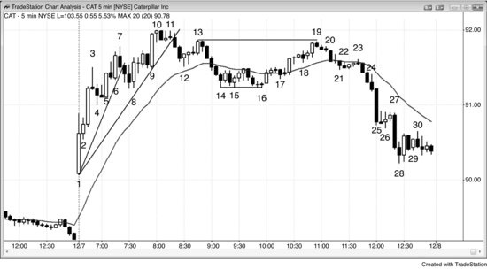

# 第 1 章：如何交易反转的例子

<!-- Source PDF pages 102–107 -->

<!-- PDF page 102 -->

第 1 章
如何交易反转的例子
当交易者进入反转交易时，他们预期趋势的回撤大到足以做波段交易，甚至形成相反方向的趋势。然后，入场、保护性止损与获利了结与任何其他波段或趋势交易相同，这些在前两本书中已讨论。由于交易者预期大运动，成功概率常为 50% 或更低。总体而言，当风险保持恒定时，潜在回报更大通常意味着成功概率更小。这是因为交易中的优势始终很小，若成功概率很高，交易者会很快把它抹平，它会在几根 K 线内消失，结果只有小利润。然而，由于趋势反转交易的回报可能是风险的数倍，它可以有盈利的交易者公式。
交易反转比交易者在日终看图时看起来要难得多。一旦趋势线被强力跌破，然后在趋势极值测试处出现反转，交易者需要强信号 K 线。然而，它通常出现在非常情绪化的市场中，此时新手仍认为旧趋势有效。他们当天也可能在几笔更早的逆势交易上亏了钱，不想再亏更多。他们的否认使他们错过早期入场。然后他们等待评估跟随的强度。它通常是由数根强趋势 K 线组成的大而快的尖峰，迫使交易者迅速决定是否承担比平时大得多的风险。他们往往最终选择等待回撤。即使他们减小仓位规模以使美元风险与任何其他交易相同，想到要多冒两到三倍 tick 的风险也令他们害怕。在回撤处入场很难，因为每一次回撤都以小反转开始，他们害怕回撤可能是先前趋势的恢复。他们最终等到一天几乎结束，然后终于认定新趋势已清晰；但现在已没有时间下单。趋势尽其所能把交易者挡在外面，这是它们能让交易者整天追市场的唯一方式。当形态容易且清晰时，运动通常是小而快的剥头皮。若运动将走得很远，它必须不清晰且难以去做，才能把交易者留在场外并迫使他们追趋势。

<!-- PDF page 103 -->

图 1.1 交易主要反转

如图 1.1 所示，交易者今天有几种方式交易 Caterpillar Inc.（CAT）的反转，我认为值得一提的一种是一位朋友使用的方法。几年前我与这位交易者有过长时间讨论。他专做主要反转。他通常每天只做一两笔交易，且总是想在寻找反转入场之前看到对趋势线的强力突破。例如，在像这样的多头趋势中，他不会在 K 线 3 下方做空，因为没有先前对多头趋势线的突破。他也不会在 K 线 7 反转 K 线下方做空，因为没有先前对多头趋势线的显著跌破。K 线 3 下方的抛售只持续了一根 K 线，甚至没有到达移动平均线。
从 K 线 7 开始的三根空头 K 线跌破了多头趋势线，这是卖盘压力的迹象，但抛售不够强，未能到达移动平均线。然后他会研究测试 K 线 7 趋势高点的反弹。它是两段式的，意味着有一些双边交易，因此空头显示了一定强度，且它是当天第三次向上推动。由于主要反转常发生在开盘后约一小时内，他很可能会在 K 线 11 下方做空，那是第二次入场做空，但他可能不会预期主要反转。由于那天在那一点是尖峰与通道多头，抛售可能只是测试 K 线 4 多头通道的起点，市场可能在那里形成双底然后反弹。因为多头通道是楔形（它有三次推动），它很可能有两段横向到向下。由于我的朋友是波段交易者，只要他认为他的原始前提仍然有效，他会允许回撤。因此他会把止损保持在信号 <!-- PDF page 104 --> K 线上方，或也许在跟随 K 线 11 的强空头 K 线上方，并允许回撤到 K 线 13，预期第二段向下。若他还未做空，他会在 K 线 13 两 K 线反转与更低高点主要趋势反转下方做空，那是对 K 线 11 下方做空的突破回测。
K 线 11 之后的两根空头 K 线会使多数交易者怀疑始终持仓是否已翻转为向下，多数人会在结束于 K 线 14 的五根空头尖峰结束时认定它确实向下。在这一点，若他决定继续持空，他会把保护性止损收紧到仅高于 K 线 13 之后开始的那根空头尖峰的起点。更可能的是，他会在 K 线 16 上方回补大部分或全部空头，因为已发生两段向下（到 K 线 12 的运动是第一段），K 线 16 与 K 线 14 或 15 形成双底，且它是移动平均缺口 K 线做多的第三次入场（其高点低于移动平均线，且它是到 K 线 10 的强反弹之后的第一次回撤）。若他回补了空头，他会观察从 K 线 16 的反弹，评估其强度相对于到 K 线 16 的抛售。若它相对较弱，他会寻找在测试 K 线 10 多头趋势高点时再次做空。测试可以是更低高点、双顶或更高高点的形式。
从 K 线 16 到 K 线 19 的反弹有三段，因此是楔形空头旗形。由于它是强力跌破多头趋势线之后的反弹，它很可能成为更大修正的一部分，至少还有一段向下。概率是市场会形成震荡区间或趋势反转。反弹中没有连续两根强多头趋势 K 线，因此多头未能重新取得对市场的控制。K 线 19 与 K 线 13 形成双顶，由于这现在可能是空头趋势，那是双顶空头旗形，以及相对于 K 线 10 多头趋势顶部的双顶或更低高点主要趋势反转。K 线 19 也是空头反转 K 线，在寻找市场顶部时这很重要。这是当天最强的趋势反转形态，因为到 K 线 14 的空头尖峰使多数交易者确信始终持仓是做空，且只要反弹无法到 K 线 13 之后开始的空头尖峰顶部之上，空头就拥有市场。许多交易者认为，只要市场无法到 K 线 13 之上，空头仍在控制，市场可能在可能的新空头趋势中形成更低高点。空头把保护性止损放在 K 线 13 正上方，因为他们要么想要双顶要么想要更低高点，若两者都得不到，他们会离场并等待另一个卖出信号。许多在 K 线 10 与 13 之间买入的多头在到 K 线 16 的抛售中持有多单，以观察空头有多强。他们认定卖出很强（它跌破了趋势线与移动平均线，并持续了许多根 K 线），且到 K 线 19 的反弹 <!-- PDF page 105 --> 不够强，不足以让他们预期多头趋势在没有至少更多修正的情况下创新高。
这些是最坚定的多头（因为他们愿意在到 K 线 16 的漫长抛售中持有），一旦他们放弃，就没有人再在这些价位买入。市场必须向下试探，以找到多头会回来、空头会回补空头的水平。从 K 线 16 向上的运动中没有连续的强多头趋势 K 线或其他强买入迹象，这使空头更激进，多头更不愿买入。由于多头确信市场很快会更低，他们利用到 K 线 19 的反弹在盈亏平衡附近或以小亏退出多单。这些失望多头的卖出，加上激进空头在努力阻止市场到 K 线 13 之上时大量做空的卖出，导致市场在 K 线 19 转向下。多头愿意在更低处再次买入，但需要市场即将反转向上的迹象。七根 K 线向下之后到 K 线 23 的横向运动不是强底部，因此多数多头不愿买入，除非价格进一步标低。空头愿意在任何时候获利了结，但他们只会在有合理底部迹象时才回补空头。没有底部迹象，多头与空头都不愿买入。此外，剩余的多单继续卖出离场，增加了卖盘压力。空头在看到从 K 线 23 向下运动中增加的卖盘压力时继续卖出。结果是 K 线 16 跌破多头趋势线之后，以 K 线 19 更低高点形式出现的强趋势反转。与所有强趋势中的情况一样，交易者在市场在到 K 线 25 低点与到 K 线 28 低点的尖峰中快速下跌时加仓做空，在那里他们开始获利了结。所有趋势 K 线都是尖峰、高潮、突破与缺口。K 线 25 是一根大空头突破 K 线，很可能将跟随基于震荡区间高度的向下等幅运动。K 线 25 本身有可能成为度量缺口，缺口中点是 K 线 16 低点（缺口顶部）与 27 高点（缺口底部）之间的中点。这可能导致今天或明天向下等幅运动。
到 K 线 19 的反弹是双顶空头旗形、楔形多头旗形，以及空头趋势中的两段向上（K 线 15 与 16 之间的两段式摆动高点是第一段），且它有出色的交易者公式。风险是到 K 线 19 高点之上，约 10 美分，最小回报是到测试 K 线 16 低点再低 50 美分，市场可能在那里形成双底，并可能形成大三角形或多头旗形。由于市场处于空头趋势或至少处于震荡区间顶部，成功机会至少 60%。

<!-- PDF page 106 -->

60% 的成功机会结合 10 美分风险与 50 美分回报，构成绝佳交易。做 10 次这样交易的交易者会赚 3.00 美元并亏 40 美分，平均每笔 26 美分。
交易者认为，若市场跌破 K 线 16，它很可能会从双顶向下走出等幅运动，事实确实如此。K 线 16 区域是突破缺口的突破回测，突破缺口是从 K 线 1 到 K 线 3 的多头尖峰。市场从这一测试反弹之后，多头不希望它跌到该测试之下，因为他们会把那看作弱势迹象。正如空头不希望到 K 线 19 的反弹到 K 线 13 更低高点之上——那可能跟随向上等幅运动——多头不希望从 K 线 19 的抛售跌到 K 线 16 更高低点之下，那可能跟随向下等幅运动。由于我的朋友会把从 K 线 19 的这一向下运动看作趋势交易，他会像交易趋势一样交易它（第一本书讨论如何交易趋势）。初始风险只有 10 美分，且市场至少会测试 K 线 16 低点的几率很好，因此若有停顿 K 线，他会在测试时拿掉约一半。由于没有停顿，没有显著的获利了结，他很可能直到 K 线 28 附近才拿任何利润。这是在可能的最后旗形（结束于 K 线 27 的三根 K 线）之后卖盘高潮 K 线后的停顿。他会在那里以 1.20 美元利润拿掉或许一半，并持有剩余直到收盘前一两分钟，再获得 1.30 美元利润。
顺便说一句，记住强多头与强空头都喜欢在过度延伸的多头趋势中看到大多头趋势 K 线，因为它常导致两段式回撤到移动平均线之下，如这里 K 线 9 处。预期的修正为双方都提供了暂时的交易机会，尽管不是趋势反转交易。K 线 9 是第三次连续买盘高潮而没有多少回撤（K 线 1 到 3 是第一次，K 线 5 到 6 是第二次）。它更可能成为衰竭缺口而不是度量缺口（它更可能是修正的开始而不是新的向上段）。在这种情况下，强多头与强空头都在该 K 线收盘、其高点之上、接下来一两根收盘（尤其因为 K 线 10 之后那根有空头实体），以及前一根低点之下卖出。多头在获利了结时卖出离场，空头在建立空头时卖出。多数空头会选择小于 K 线 9 买盘高潮多头趋势 K 线 tick 数的保护性止损。多头不会再寻找买入，空头也不会在两段式修正完成之前对空头获利了结，那是在 K 线 14 到 K 线 16 区域 <!-- PDF page 107 --> （到 K 线 12 的运动是第一段向下）。抛售足够强，使双方都认为市场在对 K 线 10 多头高点的更低高点或更高高点测试之后，可能有趋势反转进入空头趋势。
