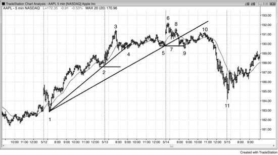
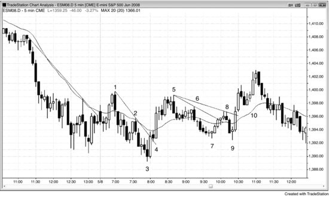
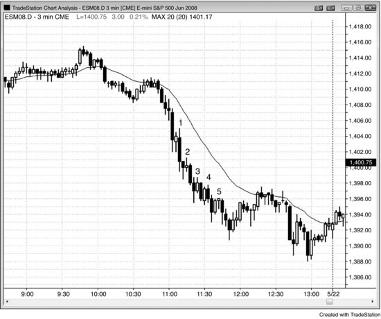
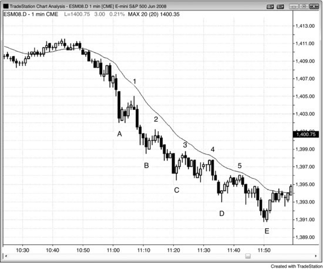

# 第 3 章：主要趋势反转

<!-- Source PDF pages 112–138 -->

<!-- PDF page 112 -->

第 3 章
主要趋势反转
有许多机构做长期投资，并把每一次强突破多头趋势线下方视为买入机会，因为他们知道空头会不断尝试反转趋势但 80% 的时间会失败。即便空头尖峰巨大且强、远跌破趋势线与移动平均线，他们也会买入。他们希望自己的买入能提供其他交易者在也买入之前需要看到的领导力。至少，他们预期反弹会测试市场顶部下方的突破点。一旦到那里，他们会决定趋势是否已反转。若是，他们会停止买入，反而会平掉新多单以及一路买上来的所有其他多单。他们大部分仓位是盈利的，因为很久以前在远低于最后入场的地方买入。然而，由于他们在趋势继续上行时买入，他们在多头顶部买入了部分仓位，出场时会亏损。一旦这些长期投资机构相信市场会走低，趋势会反转，因为他们是先前买入每一次急剧抛售的交易者，现在没有人留下买入强空头尖峰。他们会等到相信空头趋势已到达长期价值区，那总是在长期支撑区，如月趋势线。一旦到那里，他们会再次激进买入，并买入空头每一次进一步延伸空头趋势的尝试。在某个点，其他机构会看到支撑形成，他们也会买入。很快会有强多头尖峰、测试空头低点的回撤，然后反转入新多头趋势。
每一个反转形态都是某种震荡区间，因此有双边交易，直到明确逆势交易者已取得控制。「主要趋势反转」对不同交易者意味着不同事情，在运动至少进行到足够多K线、使多数交易者眼中始终持仓仓位改变方向之前，没有人能确定地说趋势已反转。然而，仅此还不足以把反转标为「主要」。对许多交易者来说，始终持仓仓位随 5 分钟图上每一个可交易波段而改变，意味着多数日子一天改变多次，即便主导趋势通常保持不变。主要趋势反转意味着你面前的图表上有两个趋势，中间有 <!-- PDF page 113 --> 反转，要么多头趋势已反转入空头趋势，要么空头趋势已反转入多头趋势。这类反转不同于图表上许多通常走得足够远可交易、但不足以改变主要趋势方向的上下反转。此外，那些次要反转无论屏幕上是否有明显趋势都会发生。
多数主要趋势反转的最早信号成功概率低，但提供最大回报，常常是风险的许多倍。市场在开始时常常主要横盘，有许多回撤，但若趋势实际在反转，新趋势很快会明显。许多交易者更喜欢等到趋势清晰再入场。这些交易者更喜欢只做至少 60% 成功机会的交易，并愿意为增加的成功机会在交易上赚更少（他们在运动已开始后入场）。由于两种方法在正确做时都有正期望交易者公式，两者都合理。
主要趋势反转需要四件事：
1. 你面前图表上的趋势。
2. 足够强以突破趋势线、通常也突破移动平均线的逆势运动（反转）。
3. 对趋势极值的测试，然后第二次反转（多头趋势顶部的更高高点、双顶或更低高点，或空头趋势底部的更低低点、双底或更高低点）。
4. 第二次反转走得足够远，使人们达成趋势已反转的共识。
首先，你屏幕上必须有趋势，然后有足够强以突破主要趋势的趋势线、最好有说服力地越过移动平均线的逆势运动。接下来，趋势必须恢复并测试旧趋势的极值，然后市场必须再次反转。例如，在多头趋势中有强下行走动跌破多头趋势线之后，交易者会观察下一次反弹。若市场在旧高区域再次转下（从更低高点、双顶或更高高点），测试成功，交易者会开始怀疑趋势在反转。最后，下行走动必须足够强让交易者相信市场处于空头趋势。若下行走动是由许多连续大型空头趋势K线构成的强空头尖峰形式，人人会把市场视为现在处于空头趋势。然而，市场反而常常在 50 根或更多K线的宽空头通道中，没有足够清晰度说服交易者趋势已真正反转向下。他们可能怀疑它是否反而演化成 <!-- PDF page 114 --> 大震荡区间，而这常常会是情况。在没有非常强空头尖峰的情况下，在数十根K线与一系列更低高点与低点之后，才不会有强烈共识认为趋势已反转。此时，市场可以远低于旧多头高点，空头趋势可能所剩不多。
关于反转的共识常常直到市场实际反转很久之后才到来并不重要，因为一路向下都会有交易。若下行走动不清晰且双边，交易者会像任何其他双边市场一样交易它，双向交易。若是非常强的空头趋势，交易者几乎只做空。若一路向下都有交易，那么交易者为何还要考虑主要趋势反转？因为若交易者早期入场——正当市场从对旧高的测试转下时——交易者公式出色。回报常常是风险的许多倍，即便概率只有 40% 到 50%，结果是非常有利的交易者公式。多数导致震荡区间，但仍然是盈利交易。
几乎所有主要趋势反转始于趋势线突破或趋势通道线过度延伸与反转，当有反转时那些最终都会突破趋势线。例如，若多头市场以头肩顶结束，从头部的下行走动通常跌破整个多头趋势的多头趋势线，并总是跌破沿反弹形成头部的K线底部的更小多头趋势线。多头在从头部的抛售到达左肩回撤区域时买入，试图创造双底多头旗形。许多在反弹到头部越过左肩时做空的空头，在同一区域止盈，以防市场进入震荡区间或形成双底多头旗形。空头把创造右肩的反弹视为更低高点突破回撤做空形态，并做空。趋势线突破是空头在对逆势仓位（多头趋势中的做空）感到有信心之前需要看到的，因为它标志着趋势的突破与可能的主要趋势反转的开始。此外，在先前高点（头部）买入、预期再有一段上涨并持有仓位的多头，观察从头部抛售的强度。一旦他们看到它足够强跌破趋势线，他们会利用反弹以小亏损平多。多头与空头双方的卖出使市场下跌并形成更低高点（右肩）。一旦市场抛售到颈线（大致水平线，画在形态底部，沿左肩、头部与最后右肩抛售的最低点），多头与空头都会评估抛售的强度。若它强，空头 <!-- PDF page 115 --> 将不再只是对空单剥头皮出场，认为市场仍在震荡区间。相反，他们会持有空单甚至卖出更多，预期主要趋势反转，尤其在颈线下方突破时及之后。多头会看到卖出的强度，在市场稳定之前不愿买入，他们预期那至少在几根K线之后，可能在等幅下跌之后。
相反，若从头部到颈线的抛售弱，多头与空头都会在测试颈线时买入。多头会买入，因为他们把整个形态视为多头趋势中的震荡区间，因此只是大型多头旗形。他们在预期的多头旗形底部买入，那里有大约三重底（从颈线的三次向上反转）。有些多头在市场测试到震荡区间中部或顶部时剥头皮出场，其他人会持有，寻找多头突破与波段上行。空头会买回其空单，直到能得到更好价格才再寻找做空。他们希望反弹停留在右肩下方，若它如此或若它与右肩形成双顶，他们会再次做空，希望形态成为有两个右肩的头肩顶，这很常见。若市场突破右肩上方，他们会买回其空单并许多根K线不再寻找做空，认定整个形态演化成大型多头旗形，突破很可能至少等幅反弹。多头也会买入右肩上方的突破，知道空头会平空且许多根K线不再寻找做空。他们与空头一样，会预期大约等幅上行，并在新多头腿进行时买入更多。
双顶或更高高点也一样。每当市场在急剧抛售后回到先前高点区域时，在旧高买入的多头因那次抛售失望，并利用反弹平多。这意味着他们成为卖家（他们卖出平多），在价格大幅折价之前不会再买入。在当前价格没有人留下买入，多头与空头都在卖出，市场下跌。
市场底部也发生同样的事。一旦有足够强以突破空头趋势线上方（要么整个空头趋势的趋势线，要么只是头部抛售上方的那条）的反弹，在市场跌破左肩时在底部做空、预期再有一段下跌的空头，会对反弹失望，并预期在向下测试后至少再有一段上涨。交易者会把下一段下跌视为对 <!-- PDF page 116 --> 空头趋势强度的测试。若空头趋势强，市场最终会跌破旧低（头部）许多根K线并再有一段下跌。若趋势在反转，激进多头会在旧低附近买入，在旧低做空的空头会对从头部的强反弹与测试空头低点的更弱下行走动失望，并利用这次下探在大约保本买回其空单。多头与空头都在买入，空头不愿在这个水平附近再卖出，市场会反弹。这个测试可以与旧空头低点形成完美双底、更高低点或更低低点。这不重要，因为它们都是同一过程的表现。若它形成更高低点，有些交易者会把它视为头肩底的右肩，并寻找合理的左肩。若他们找到一个，他们会对这是趋势反转更有信心，因为他们相信许多交易者会认出形态并开始买入。然而，是否有清晰左肩对多数交易者无关紧要。重要的是有强突破空头趋势线上方，随后测试空头低点，然后反转向上进入多头波段或趋势。
顶部来自更高高点、完美双顶还是更低高点无关紧要，因为它们都代表同样的行为。市场在测试旧高，看是否主要是买家与多头突破，还是主要是卖家与空头反转。到顶部有两推：第一是原始多头高点，第二是市场跌破多头趋势线之后对该高点的测试。市场不在乎双顶有多完美；无论外观如何，所有测试都应被视为双顶的变体。市场底部也一样。有市场低点，然后通常足够强以突破空头趋势线上方的反弹。那个低点是双底的第一个底部。在市场突破空头趋势线上方（因此出空头通道）并再次抛售测试第一个底部之后，当市场反转向上时，这个低点是双底的第二个底部，无论它在第一个底部上方、精确相同还是下方。
传统双顶与双底与更高时间框架图上其微型版本之间的关系，与所有微型形态相同。例如，若交易者在 5 分钟图上看到双底然后看更高时间框架图，两个底部会只相隔两三根K线，创造微型双底。类似地，若交易者在 5 分钟图上看到两个底部只相隔两三根K线的微型双底，这个底部在足够小的时间框架图上会是完美趋势反转，其中第一个底部后的反弹突破空头趋势线上方，第二个底部是测试。事实上，每张图上多数可交易反转， <!-- PDF page 117 --> 即便小剥头皮，始于微型双底或双顶，多数交易者除非有一个在场否则不会做反转交易。微型双顶是多头趋势中的失败突破，因此要么是失败的 High 1、High 2 或三角形买入信号，失败的双底是失败的 Low 1、Low 2 或三角形卖出信号。这意味着这些反转是小最后旗形反转（第 7 章讨论）。事实上，最后旗形是双顶或双底的变体。例如，若震荡日有两段式反弹然后市场形成 ii 形态，交易者会对可能的最后旗形突破与向下反转保持警觉。ii 形态前形成的尖峰是第一段上推，小多头突破是第二段。由于那是两段上推，即便高点不在同一水平，它只是双顶的变体。
预期向下反转的交易者会在他们预期将成为最后多头旗形的突破的信号K线高点及上方做空。当它是微型形态时，他们做空的限价单会在信号K线高点及略上方。当它是更大形态时，它会是更高时间框架图上的微型形态，有些交易者会把限价单放在那个更高时间框架信号K线及上方。其他交易者，可能还有许多机构，会在市场移出他们相信将成为最后多头旗形的区域时分批加空。他们在市场底部对双底或他们预期会成为空头腿最后旗形并导致向上反转的微型双底做相反的事。
记住，所有趋势都在通道中，直到有通道的强突破，最好的赌注是反对任何试图突破趋势线的尝试。直到有强突破趋势线之外，多数交易者会把任何逆势交易仅视为剥头皮。在没有趋势线突破的情况下，仍有强趋势生效，交易者应确保接每一个顺势入场，不要担心错过偶尔的逆势剥头皮。最好的概率与最多的钱在顺势交易。没有趋势通道线过度延伸与反转的真正 V 底与 V 顶如此罕见，不值得考虑。交易者应聚焦常见形态，若他们错过偶尔的罕见事件，总会有回撤让他们开始与新趋势一起交易。
趋势线突破不会反转趋势。它只是逆势交易者变得足够强、你应很快开始在他们方向交易的第一个显著信号。然而，你首先应继续顺势交易，因为在趋势线突破之后会有对旧趋势极值的测试。测试可以略微过度延伸或达不到旧极值。

<!-- PDF page 118 -->

你只应在这次测试期间发展出反转形态时做逆势交易。若是这样，逆势运动应形成至少两段，它甚至可能导致新的相反趋势。
多头趋势中越过先前高点上方的运动通常会导致三种结果之一：更多买入、止盈或做空。当趋势强时，强多头会通过在旧高上方突破买入来加压其多单，会有某种等幅上行。若市场在突破上方走得足够远使交易者能在回撤前至少做盈利剥头皮，则假定高点主要是新买入。若它横盘，假定有止盈，多头在略低处寻找再次买入。若市场硬向下反转，假定强空头在新高主导，市场很可能至少两段并至少 10 根K线下跌。
有些交易者喜欢在趋势在反转的最早信号入场，如当它突破通道时。然而，这是低概率交易风格。是的，大回报可以抵消风险与低成功概率，但多数交易者最终挑樱桃，并总是说服自己不接最好的樱桃。与所有突破一样，通常更好等待看突破有多强。若它强，则在回撤上寻找入场。这个概念适用于所有趋势的反转，即便小趋势，如更大趋势中的回撤、微型通道、尖峰后的通道，以及宽通道中的趋势。若逆势突破弱，在反转尝试失败时在趋势方向入场。若突破非常强并在没有回撤的情况下走许多根K线，则像任何强突破一样对待它，市价或在小回撤上进入新趋势，如第二册第一部分所讨论。
在没有某些罕见、戏剧性新闻事件的情况下，交易者不会突然从极度看多切换到极度看空。有渐进过渡。交易者变得不那么看多，然后中性，然后看空。一旦足够多交易者完成这个过渡，市场反转入更深调整或空头趋势。每家公司有自己对过度的衡量，在某个点，足够多公司认定趋势已走得太远。他们相信若他们停止在旧高上方买入，错过大上行走动的风险很小，他们只会在回撤上买入。若市场在旧高上方犹豫，市场正变得双边，强多头在用新高止盈。止盈意味着交易者仍看多并在寻找买入回撤。多数新高随后是止盈。每一个新高都是潜在顶部，但多数反转尝试失败并成为多头 <!-- PDF page 119 --> 旗形的开始，只会被另一个新高跟随。若测试高点的反弹在上行腿中有几个小回撤，有大量重叠K线、几个空头实体与K线顶部的大影线，且多数多头趋势K线弱，那么市场正变得越来越双边。多头在K线顶部止盈、只在K线底部买入，空头开始在K线顶部做空。类似地，多头在市场接近多头趋势顶部时止盈，空头做空更多。若市场越过多头高点上方，很可能止盈与做空会更强，会形成震荡区间或反转。
多数交易者不喜欢翻仓，因此若他们预期反转信号，他们更喜欢平多然后等待那个信号。这些多头在趋势最后一段上行中的缺席，导致到最终高点的反弹的弱势。若市场突破先前高点上方后有强向下反转，强空头至少在近期取得市场控制。一旦那发生，希望买入小回撤的多头反而相信市场会跌得更远。他们因此等到有大得多的回撤才买入，他们不买入使空头能把市场推入更深调整，持续 10 根或更多K线，常常有两段或更多。
有一种情况多头趋势中的突破常规地被激进空头迎接，他们通常会接管市场。回撤是相反方向的次要趋势，交易者预期它很快结束、更大趋势恢复。当强空头趋势中有回撤时，市场常常有两段上行在次要多头趋势中。当市场越过第一段上行的高点时，它是在突破次要多头趋势中的先前摆动高点。然而，由于多数交易者会把上行走动视为很快会结束的回撤，突破上的主导交易者通常会是激进卖家，而不是激进新买家或止盈多头，次要多头趋势通常会在突破回撤中第一或第二摆动高点上方后反转回主要空头趋势方向。
空头趋势中的新低也一样。当空头趋势强时，强空头会在突破到新低时通过再做空来加压其仓位，市场会继续下跌直到到达某个等幅运动目标。随着趋势减弱，新低处的价格行为会不那么清晰，这意味着强空头在用新低作为对其空单止盈的区域，而不是加空的区域。随着空头 <!-- PDF page 120 --> 趋势进一步丧失力量，最终强多头会把新低视为启动做多的绝佳价格，他们能够创造反转形态然后显著反弹。
随着趋势成熟，它通常过渡到震荡区间，但形成的第一批震荡区间通常随后是趋势的延续。强多头与空头在趋势成熟时如何行动？在多头趋势中，当趋势强时，回撤小，因为强多头想在回撤上买更多。由于他们怀疑在市场高得多之前可能没有回撤，他们开始分批但持续地买入。他们寻找任何买入理由，由于市场中有如此多大交易者，对每一个可想象的理由都会有一些买入。他们限价在下跌几个 tick 买入，其他限价在前一根低点上方几个 tick、前一根低点、前一根低点下方买入。他们止损在前一根高点上方与任何先前摆动高点上方突破买入。他们也在任何多头或空头趋势K线收盘买入。他们把空头趋势K线视为在更好价格买入的短暂机会，把多头趋势K线视为市场即将快速上行的信号。
强空头很聪明，他们看见正在发生的事。由于他们与强多头一样相信市场不久就会更高，对他们来说做空没有意义。他们只是靠边站，等到可以在更高处卖出。高多少？每家机构有自己对过度的衡量，但一旦市场到达足够多空头公司相信它可能不会再高的价格水平，他们会开始做空。若足够多的他们在同一价格水平附近做空，形成更多更大的空头趋势K线，K线开始在顶部有影线。这些是卖盘压力的信号，告诉所有交易者多头正变弱、空头正变强。强多头最终停止在最后摆动高点上方买入，反而在市场到新高时开始止盈。他们仍看多，但变得有选择，只在回撤上买入。随着双边交易增加、抛售有更多空头趋势K线并持续更多根K线，强多头会只想在发展中的震荡区间底部买入，并寻找在顶部止盈。强空头开始在新高做空，现在愿意在更高处分批加仓。若他们认为市场可能反转回上并突破到新高，他们可能在发展中的震荡区间底部附近部分止盈，但他们会继续寻找在新高做空。在某个点，市场成为 50–50 市场，多头与空头都不控制；最终空头成为主导，空头趋势开始，相反过程展开。

<!-- PDF page 121 -->

持久趋势常常有异常强的突破，但它可以是衰竭高潮。例如，在持久多头趋势中，所有强多头与空头都喜欢看到一根或两根大型多头趋势K线，尤其若它异常大，因为他们预期它是短暂、异常绝佳的机会。一旦市场接近强多头与空头想卖出的地方，如等幅运动目标或趋势通道线附近，尤其若运动是第二次或第三次连续买盘高潮，他们靠边站。最强交易者不卖出导致市场上方的真空，创造一两根相对大的多头趋势K线。这个多头尖峰正是强交易者一直在等待的信号，一旦它在那里，他们仿佛从天而降并开始卖出。多头对其多单止盈，空头启动新空单，都赌突破会失败。两者都在K线收盘、其高点上方、下一根收盘（尤其若它是更弱K线）以及再下一根收盘激进卖出，尤其若K线开始有空头实体。他们也在前一根低点下方做空。当他们看到强空头趋势K线时，他们在其收盘及其低点下方做空。多头与空头都预期更大调整，多头在至少 10 根K线、两段式调整之前不会考虑再次买入，即便那时也只有在抛售看起来弱时。空头预期同样的抛售，不会急于过早止盈。
弱势交易者以相反方式看待那根大型多头趋势K线。一直在场外坐着、希望有容易的回撤买入的弱势多头，看到市场从他们身边跑开，想确保抓住下一段上涨，尤其因为K线如此强且当天几乎结束。早期做空并可能分批加仓的弱势空头，被K线突破到新高的速度吓坏。他们害怕无情的跟随买入，因此买回其空单。这些弱势交易者基于情绪交易，并在与计算机竞争，计算机的算法中没有情绪作为变量之一。由于计算机控制市场，弱势交易者的情绪注定他们在过度多头趋势末端的大型多头趋势K线上大亏。市场在反转，而不是成功突破。
一旦强多头趋势开始有相对大的回撤，回撤——总是小震荡区间——表现得更像震荡区间而不是多头旗形。突破方向变得不那么确定，交易者开始认为向下突破与向上突破大约同样可能。新高现在是震荡区间上方的突破尝试，概率是它会失败。同样，一旦强空头趋势开始有相对大的回撤，那些回撤表现得更像震荡区间而不是 <!-- PDF page 122 --> 空头旗形；因此，新低是试图突破震荡区间下方，概率是它会失败，震荡区间会继续。
每一个震荡区间都在多头趋势或空头趋势内。一旦双边交易足够强以创造震荡区间，趋势不再强，至少在震荡区间生效时。最终总会有从区间的突破，若它向上且非常强，市场处于强多头趋势。若它向下且强，市场处于强空头趋势。
一旦空头足够强把回撤远推到多头趋势线与移动平均线下方，他们有足够信心市场很可能不会高很多，他们会在旧高上方激进做空。此时，多头会认定他们只应买入深回撤。在新高现在主导新的心态。它不再是买入的地方，因为它不再代表很多力量。是的，多头有止盈，但多数大交易者现在把新高视为启动做空的绝佳机会。市场已到达 tipping point，多数交易者已停止寻找买入小回撤，反而在寻找卖出反弹。空头主导，强卖出很可能导致大调整甚至趋势反转。在下一次强下推之后，空头会寻找更低高点再次卖出或加空，买入回撤的多头会担心趋势可能已反转，或至少会有大得多的回撤。与其希望新多头高点对其多单止盈，他们现在会在更低高点止盈，直到更大调整之后才再寻找买入。多头知道多数反转尝试失败，许多一路做多上来的人在空头展示出把市场猛烈推下的能力之前不会平多。一旦这些多头看到这令人印象深刻的卖盘压力，他们会寻找反弹最终平多。他们的供给会限制反弹，他们的卖出，加上激进空头的做空以及把抛售视为买入机会的多头的止盈，会创造第二段下跌。
若市场进入空头趋势，过程会反转。当空头趋势强时，交易者会在先前低点下方做空。随着趋势减弱，空头会在新低止盈，市场很可能进入震荡区间。在突破多头趋势线与移动平均线上方的强反弹之后，空头会在新低止盈，强多头会激进买入并试图取得市场控制。结果会是更大的空头反弹，或可能反转入多头趋势。
当有足够大的回撤使交易者怀疑趋势是否已反转时，发生类似情况。

<!-- PDF page 123 -->

例如，若多头趋势中有深、急的回撤，交易者会开始认为市场可能已反转。他们在看跌破先前摆动低点的运动，但这是在多头趋势回撤的背景下，而不是作为空头趋势的一部分。他们会观察市场跌破先前摆动低点时发生什么。市场是否会跌得足够远让在该摆动低点下方止损卖出的空头获利？新低是否找到更多卖家而不是买家？若是，那是空头强、回撤可能进一步下跌的信号。趋势甚至可能已反转向下。
突破到新低的另一种可能是市场进入震荡区间，这证明空头止盈且多头买入不令人印象深刻。最后的替代是市场在突破到新低后反转向上。这意味着在那个摆动低点下方有强多头在等待市场测试到那里。这是抛售更可能只是持续多头趋势中大回撤的信号。更高处的空头在突破到新低时止盈，因为他们相信趋势仍向上。强多头激进买入，因为他们相信市场不会进一步下跌，会反弹测试多头高点。
每当有任何突破摆动低点下方时，交易者会仔细观察多头是否已回来或空头是否已取得控制的证据。他们需要决定在新低什么影响最大，他们用市场的行为做那个决定。若有强突破，则新卖出主导。若市场运动不确定，则空头止盈与多头弱势买入正在发生，市场很可能进入震荡区间。若有强向上反转，则多头的激进买入是最重要因素。
强趋势通道线反转来自大大过度延伸的趋势，常常在它们反转穿过通道到对面然后突破趋势线后走很远。反转后的第一次回撤常常浅，因为市场情绪化，人人很快同意趋势已反转。由于信心，交易者会激进得多，在最小停顿时加仓且不止盈，使回撤保持很小。
当有趋势线的强突破时，通常在回撤后会有第二段。回撤常常回撤并测试旧趋势线，但几乎总有更可靠的价格行为理由在那里入场，试图捕捉回撤或新趋势的第二段。穿过趋势线的运动越强，越可能有第二段 <!-- PDF page 124 --> 在回撤之后。若趋势线突破甚至不够强到达移动平均线，它通常不够强以反转趋势，因此先不要开始寻找趋势反转。趋势仍强，你应只做顺势形态，尽管有趋势线突破。
趋势以反转结束，反转是突破趋势线的逆势运动，然后是对最终趋势极值的测试。测试可能过度延伸旧极值，如新多头趋势中的更低低点或新空头趋势中的更高高点，或可能达不到它，如新多头趋势中的更高低点或新空头趋势中的更低高点。极少，测试会形成精确到 tick 的完美双顶或双底。过度延伸严格来说是旧趋势的最后一段，因为它们形成趋势中最极端的价格。达不到是新趋势第一段的回撤。测试本身常常由两段构成（例如，像空头突破后的两段式反弹）。
若过度延伸走得太远且通道太紧，你不应寻找反转。趋势很可能已恢复，不在反转过程中。相反，重新开始过程，等待另一次趋势线突破，然后另一次对趋势极值的测试，再寻找反转交易。
对趋势极值的测试通常是某种通道形式，通道的强度在市场可能处于反转过程中时尤其重要。例如，若有强多头趋势然后有强抛售远跌破多头趋势线，交易者会仔细研究下一次反弹。他们想看那次反弹是否只是对多头高点的测试，还是会强突破高点上方并随后再有强一段多头趋势上涨。最重要的考虑之一是对多头高点那次测试的动量。若反弹处于非常紧、陡的通道，没有回撤，连续K线之间几乎没有重叠，且反弹在有任何停顿或回撤之前远越多头高点上方，动量强，多头趋势恢复的概率增加，尽管先前有强抛售与跌破多头趋势线。相反，若反弹有许多重叠K线、几根大型空头趋势K线、两三个清晰回撤、可能楔形，斜率明显小于原始多头趋势与抛售的斜率，那么概率是对多头高点的测试会导致要么更低高点要么略更高高点，然后另一次抛售尝试。市场可能在反转入空头趋势，但至少震荡区间很可能。
市场有惯性，倾向于继续它一直在做的事。这使多数趋势反转失败。此外，当一个成功反转 <!-- PDF page 125 --> 市场时，震荡区间比相反方向的趋势更可能形成，因为震荡区间代表更少变化。在震荡区间中，旧趋势的交易者仍强，但被相反趋势的交易者平衡。这比市场快速从一组趋势交易者控制切换到相反方向趋势交易者更可能。然而，即便形成震荡区间，它通常会有大的、可交易的逆势波段，可能需要数十根K线交易者才知道市场是否已反转入相反趋势，还是一直在持续趋势中形成大型旗形。
由于趋势线突破后的逆势运动通常至少有两段，若多头反转有更高低点作为对空头低点的测试，它也会是第二段的起点。然而，若它形成更低低点作为测试，那个低点会是第一段的起点；在那第一段之后，很可能有回撤然后第二段。同样，在空头反转中，更低高点是第二段的起点，但更高高点测试是第一段的起点。
一切相对于你面前的图表，在更高与更小时间框架图上看起来不同。若突破趋势线与测试趋势极值的腿在 5 分钟图上只有两根K线，交易者不会把这视为主要趋势反转，尽管那些腿在 1 分钟图上可能有约 10 根K线并创造出色的主要趋势反转形态。类似地，若持续 60 根K线的多头趋势有回撤与测试，其中腿有 20 根或更多K线，它们可能在 15 分钟图上创造主要趋势反转形态，但当腿在 5 分钟图上有那么多K线时，交易者不会使用「主要趋势反转」一词。他们反而会寻找其他形态。例如，若突破多头趋势线的回撤有 30 根K线，交易者会把它视为空头趋势（多头趋势中的所有回撤都是更小的空头趋势），并寻找突破空头趋势线上方然后主要趋势线上行。若反弹也有约 30 根K线，他们会把它视为新多头趋势，并寻找跌破其趋势线与主要趋势反转向下。他们意识到这些腿在 15 分钟图上只有 10 根K线并形成主要趋势反转，但那不是他们在交易的图表，他们会用适合面前图表的术语。
平均形态约有 40% 机会导致盈利波段，30% 机会小亏损，30% 机会小利润。多数导致震荡区间而不是相反趋势，但仍有 70% 机会至少小利润。最好的形态有 60% 机会盈利波段交易。
图 3.1 更高高点后跟随更低高点

<!-- PDF page 126 -->

图 3.1 显示主要趋势反转，全书图表中提到许多其他例子。
若趋势在多头趋势线突破后在更高高点反转向下（主要趋势反转向下），通常有更低高点主要趋势反转，给交易者第二次做空机会。AAPL 有更高高点与更低高点趋势反转。主要反转通常跟随趋势线的强突破，这是相反方向交易者正变强的证据。到 bar 4 的弱势空头腿勉强突破趋势线，它没有接近跌破多头趋势最近更高低点（bar 2）。它甚至无法守在移动平均线下方。然而，它横盘许多根K线，表明空头足够强长时间阻止多头趋势。
Bar 6 是这次趋势线突破后的更高高点做空形态，但由于跌到 bar 4 的运动不是特别强，跌到 bar 9 的抛售停顿。Bar 9 成为楔形多头旗形或多头通道底部与 High 4 买入形态，并与 bar 5 形成双底多头旗形。这导致到 bar 10 的反弹。到 bar 10 的运动是低动量、Low 4 做空形态与楔形空头旗形，第一段上推是 bar 9 低点前的更低高点。它也是头肩顶的右肩，但多数头肩顶失败并成为三角形或楔形多头旗形。在这种情况下，然而，它成为趋势线突破后的第一个更低高点与对多头高点的更低高点测试。
到 bar 9 的空头腿远跌破更长趋势线、移动平均线与多头趋势最近更高低点（bar 5），并跟随先前急剧的趋势反转尝试（跌到 bar 4 的抛售）。此外，它没有 <!-- PDF page 127 --> 接近测试多头趋势线下侧或第一段下跌中 bar 8 第一次回撤。所有这些都是趋势线突破力量的信号，增加至少第二段下跌或实际趋势反转的机会。在 bar 6 多头趋势顶部附近买入的多头，看到跌到 bar 9 的抛售中空头的力量与到 bar 10 的反弹中多头的弱势，对价格行为失望。他们利用到 bar 10 的弱反弹作为以小亏损平多的机会，在市场走低之前不愿再买入。多头想在买入前看到力量信号，但没有来，因此他们在市场抛售到 bar 11 时坐在场外。
有些交易者喜欢在到更低高点的反弹上看到斐波那契 61.8% 回撤。然而，61.8% 回撤从不如数字让人相信的那么精确，可能并不比 60%、63% 或 67% 回撤更可能，现在交易已如此计算机化，它可能已失去价值。例如，若交易者在他认为是空头波段中卖出 50% 回撤，他可能冒险到新高（bar 6 上方）以得到对 bar 9 空头尖峰底部的测试。他的回报等于风险，由于他把反弹视为回撤，他的做空至少有 60% 成功概率。若市场回撤更高，有论据认为 67% 回撤比 61.8% 回撤更重要。一旦回撤反弹到 50% 以上，空头恢复的机会变小，比方说 50%。一旦概率是 50% 或更少，交易者若要做空需要更多回报。由于他们的止损在 bar 6 高点上方，他们可能想要两倍于风险的回报。这意味着他们可能在 67% 回撤做空，因为然后对 bar 9 低点的测试会创造两倍于风险的回报。
图 3.2 更低低点后跟随更高低点

<!-- PDF page 128 -->

Emini 有更低低点然后更高低点主要趋势反转（见图 3.2）。到 bar 1 的反弹突破空头趋势线，bar 3 对空头低点的测试是更低低点。更低低点测试通常导致至少两段逆势腿，这就是这里发生的（从 bars 3 与 9 的上行走动）。Bar 9 是昨日主要空头趋势线突破后的更高低点（被到 bar 1 的反弹突破），作为更高低点，它是第二段的起点，完成的第二段可以是上行走动的结束。震荡区间是比反转入相反趋势更常见的结果。
跌到 bar 7 的通道（从 bar 5 与 bar 6）强。许多交易者更喜欢等待看突破有多强再买入。Bar 7 后的两根多头K线有相对大的实体与小影线，在许多交易者眼中代表强突破。在那一点，许多交易者认为市场已变为始终做多，并等待买入回撤。Bar 8 后的空头K线是试图让跌到 bar 7 的 High 2 多头旗形突破失败（第一段下跌在 bar 5 后三根结束）。空头想要 bar 6 与 bar 8 双顶导致波段下跌。多头预期空头会失败，交易者会进来买入对 bar 7 低点的测试，在到 bar 5 的强多头尖峰后创造更高低点（bar 4 与 bar 3 后的K线足够强让交易者认为至少第二段上涨很可能）。Bar 9 是更低低点突破回撤买入形态（以及与 bar 7 的双底多头旗形），多头激进买入它。
Bar 9 后的多头趋势K线反转了许多先前K线的高点与收盘，这是强多头反转的信号。它收在 bar 6 以来每一根的收盘上方，其高点在 bar 6 后那根以来每一根的高点上方。

<!-- PDF page 129 -->

强多头K线反转的高点与收盘越多，多头反转越强，越可能有跟随买入（更高价格）。
主要趋势反转中的最早入场常常看起来不强，如 bars 3 与 9。这意味着成功概率常常低于 50%。然而，潜在回报处于最大，结果通常是正期望交易者公式。交易者可以等待清晰的始终做多反转再买入，这通常把概率增加到 60% 或更高。在那一点，所剩利润更少，风险通常更大（保护性止损更远），但交易者公式通常仍正。例如，多头可以等待在跟随 bar 3 的多头趋势K线上方买入做波段，或在 bar 4 收盘做剥头皮。他们也可以在 bar 9 后的多头趋势K线收盘或跟随它的多头趋势K线收盘买入。
这是平均主要趋势反转尝试的好例子，形态与背景可接受但不强，向上反转导致震荡区间而不是多头趋势，约 70% 的时间如此。Bar 3 更低低点导致对 bar 1 高点的测试，那是演化中震荡区间的可能顶部。有些交易者在那里全部或部分止盈，其他人持有，预期第二段上涨，并在 bar 10 震荡区间的失败突破出场（当空头K线转下时，或在其低点下方）。Bar 3 更低低点给在 bar 5 转下时出场的交易者带来剥头皮利润，给在 bar 10 后向下反转出场的交易者带来波段利润（回报至少是风险的两倍）。买入 bar 7 两段式更高低点的交易者，若持有到保护性止损被打到则有小亏损，或若在移动平均线上方四K线反弹后把止损移到保本则大约保本出场。买入 bar 9 双底更高低点（高于 bar 3）——它也是从 bar 5 到 bar 7 的小空头趋势（多头旗形）向上反转的更低低点——的交易者，能够以至少两倍于风险的回报（波段利润）出场部分或全部。
在像这样的平均形态中，盈利波段的机会约 40%，约 30% 机会小利润，30% 机会保护性止损被打到（小亏损）。结果仍是盈利策略。在最强形态中，盈利波段的机会是 60% 或更大，保护性止损被打到导致小亏损的机会可能只有 30% 到 40%。因为交易者公式如此强，这对所有交易者包括初学者都是出色形态。

<!-- PDF page 130 -->

图 3.3 仅有趋势线突破不足以构成反转

仅仅因为有多头趋势线突破然后市场到更高高点，并不总是审慎寻找做空。若有趋势线突破，但到更高高点的运动越过旧多头高点五根或更多K线，交易者通常应从头开始过程，等待另一次跌破多头趋势线与另一次对多头趋势高点的测试再做空。图 3.3 所示 AAPL 日线图在跌到 bar 11 时突破多头趋势线（实线 C）。市场然后反弹到 bar 13 的新高。然而，到 bar 13 的运动处于非常陡的多头通道（虚线 D 多头趋势线是通道底部），因此交易者在做空前应等待。总是更好不要做空陡多头通道的第一次突破。等待看是否有到更高高点或更低高点的回撤。市场横盘调整并在 bar 14 形成双底多头旗形（High 2），从未有突破回撤设定做空。到 bar 13 的运动是成功突破导致多头趋势恢复，而不是失败突破导致反转过程。
市场从 bar 3 到 bar 11 一直处于多头震荡区间，从 bar 12 到 bar 13 的运动是突破大型多头旗形上方的强尖峰上行。当到更高高点的运动如此陡峭、重叠如此之少时，概率有利于成功突破与大约等幅上行，而不是反转。一旦这发生，寻找反转的过程再次开始。等待趋势线突破，如跌到 bar 19，然后等待更高高点、双顶或更低高点测试多头高点。虽然 bar 19 后有几个可交易波段，bar 19 是高潮向上反转（向下尖峰然后向上尖峰），这通常随后是震荡区间。在震荡区间期间，创造跌到 bar 19 低点的尖峰的空头继续做空并试图生成空头通道，买入 bar 19 低点的多头继续买入试图以多头通道形式创造向上跟随。顺便说，多头把 bar 19 仅视为对 bars 8 与 9 上方突破的大型突破回测。由于 bar 19 跌破 bar 9 突破点，突破缺口是负的，但因为市场快速反弹，它仍然是一种突破缺口。

<!-- PDF page 131 -->

跌到 bar 5 突破虚线趋势线 A，bar 6 是合理的双顶做空形态。
跌到 bar 7 突破虚线趋势线 B。到 bar 8 的运动处于陡通道，因此更好等待通道下方的突破，然后看是否有突破回撤做空。
Bar 9 是到双顶的两段式上行走动与可接受的做空。
Bar 10 是双顶空头旗形与另一个做空形态。
Bar 19 显然由某个新闻事件造成（它是 2010 年闪崩），但那不重要。始终更重要的是在K线期间与之后谁控制市场。它部分是 bars 4 与 12 之间震荡区间中部的突破回测（从 bar 11 到 17 的通道底部的测试）。许多交易者预期突破会被测试，一旦市场开始快速朝那个方向运动，如 bar 19 形成时，最强多头开始相信市场可能一路跌回那个震荡区间底部。那么，一旦他们相信市场会走低，他们应做什么？当他们很快可以在更低处买入时，继续买入对他们没有意义。这种买入的缺席导致市场在卖盘真空中被快速吸到多头相信会找到支撑的水平。即便他们认为市场在下跌时有价值（你知道这一点是因为市场快速反转到整根K线的大部分上方），他们相信它还有更远要走，等到它到达支撑。由于他们把市场视为提供他们认为会非常短暂的巨大价值，他们从天而降并激进买入。空头看到同样的事，快速止盈，买回其空单。没有人留下卖出，市场强劲反弹。
动量程序加速了下跌与反弹，因为它们检测强动量并在其方向无情交易，直到动量放缓，然后带利润出场。像这样的尖峰在趋势中常见。然而，对通道底部的测试通常导致震荡区间，如此处。大涨 + 大跌 = 大困惑 = 震荡 <!-- PDF page 132 --> 区间。
图 3.4 若测试太强，等待

若对低点的测试有太多动量，另一段下跌比向上反转更可能。在图 3.4 中，GS 突破空头趋势线 A 上方，但从 bar 11 抛售测试 bar 8 空头低点处于陡多头通道。与其在 bar 13 或 bar 14 上方买入并寻找失败突破与趋势反转，交易者必须考虑 GS 可能在成功向下突破。跌到 bar 13 然后到 bar 14 的运动处于陡空头通道，而不是沿途有回撤的低动量抛售。当那发生时，更好等待那个空头通道上方的突破，然后看是否形成突破回撤。若形成，它是更高低点或更低低点趋势反转向上的买入形态。
一旦市场跌破 bar 14 楔形（bars 12 与 13 是这个跟随跌到 bar 12 尖峰的空头通道中的前两段下推），它尖峰下跌到 bar 15，大约等幅运动（用 bars 12 到 14 楔形的高度）。
到 bar 18 的震荡区间突破陡趋势线 B，但市场再次在陡空头通道中向下突破，而不是对 bar 17 空头低点的低动量测试。
到 bar 20 的反弹突破空头趋势线 C，在 bar 21 有更高低点买入形态。跌到 21 有三个小腿与许多重叠K线，表明双边交易。这是更低动量运动，更可能是更高低点主要趋势反转尝试，而不是到另一空头腿的突破。

<!-- PDF page 133 -->

图 3.5 不要在更小时间框架图上寻找反转

当有强趋势时，3 分钟图上会有许多反转尝试（见图 3.5），1 分钟图上更多。直到 5 分钟图上有清晰反转，若你选择看 1 或 3 分钟图，你应把每一次反转尝试视为顺势形态，这里是空头旗形。这张 3 分钟图上五次尝试反转都吸引了急切的多头，他们认为自己风险小，若抓住高潮式 V 底反转——非常罕见的事件——可能赚很多。与其加入他们，想想他们将不得不在哪里平多，并在那个位置放置入场卖出止损。你会持续成功把钱从他们账户转移到你的账户，这是交易的主要目标。例如，一旦多头在 bar 1 前的多头反转K线做多（这次陡抛售中没有先前趋势线突破，因此不应考虑做多），聪明的交易者会在信号K线下方一个 tick 放置止损单做空。与所有空头通道一样，你也可以在前一根高点限价做空。若你在限价单上没有成交，确保在每一个回撤K线低点下方止损做空。

<!-- PDF page 134 -->

Bar 4 的做空在多头入场K线下方，因为多头一旦入场K线收盘会收紧止损。多头入场K线是空头信号K线。由于这是趋势，他们会波段持有大部分仓位。
Bar 5 是 ii 形态，它常常是反转形态（但它需要更早的趋势线突破），它通常是两段式逆势运动前的最后旗形，如此处。它代表多头与空头之间的平衡，突破是移出平衡。常常有强力把它拉回形态，通常穿过另一边。由于没有先前趋势线突破，唯一有效入场的突破是空头突破。然而，ii 形态刚好够宽以突破小趋势线，因此之后几根K线内任何向上反转是有效做多。
有些激进交易者转向更小时间框架图寻找允许他们在趋势方向入场的形态。例如，若交易者在交易 Emini，在 5 分钟图上看到急剧抛售并在寻找做空理由，他可以看上面的 3 分钟图。一旦他看到五根或更多连续空头K线，他然后可以在前一根高点限价做空，预期强空头尖峰后的第一次反转尝试失败。他会在 bar 1 越过前一根高点时做空。
图 3.6 更小时间框架仅用于顺势交易

<!-- PDF page 135 -->

图 3.6 是图 3.5 所示同一空头运动的 1 分钟图，编号K线与前图相同。Bars C、D 与 E 是跟随两段下跌与小趋势线突破的有效逆势形态；每一个都是可交易的做多剥头皮。虽然这些可以交易，但通常太难这么快读第二张图并下单，若你只交易 5 分钟趋势，你很可能赚更多钱。在一天结束时打印的图表上看起来很容易，但在实时中难得多。若你基于 1 分钟图卖出，五个编号K线都提供顺势（在 1 与 5 分钟趋势上）做空入场，允许波段持有部分仓位。
Bar 1 是小尖峰顶部，但由于它形成于空头趋势中，不需要被测试。这与 C 与 D 的尖峰底部不同。空头趋势中的尖峰底部通常被测试，如此处。
到 bar 4 的两段式横盘运动突破了可画在 bars 1 与 2 高点上的空头趋势线。为何交易者还不应该寻找买入对 bar C 低点的测试？因为趋势线突破必须发生在强上行走动期间。到 bar 4 的运动如此弱，它甚至从未到达移动平均线。若它到达，它会设定 20 缺口K线做空。空头趋势 <!-- PDF page 136 --> 对交易者来说太强了，不应寻找做多。他们应只做空。
图 3.7 更小时间框架反转是亏损

1 分钟图允许更小止损，但仅减少风险本身并不使交易值得做。记住交易者公式。成功机会也下降，事实上这超过抵消减少的风险；结果是亏损策略。
图 3.7 是 5 分钟图上强多头趋势的 1 分钟图（未显示）。盈利交易做空很难（六个做空中没有一个产生四 tick 利润）。远更盈利且压力更小的是只在 5 分钟图上寻找顺势入场，从不看 1 分钟图。
看 1 分钟做空信号的唯一有效理由是找到做多（顺势）入场。一旦做空触发，看保护性止损在哪里，在那里放置买单，因为被困空头在买回其亏损时会把市场推到你的做多利润目标。
图 3.8 微型双底与双顶

<!-- PDF page 137 -->

多数可交易反转至少始于微型双底或双顶、传统双底或双顶，或最后旗形反转——可视为一种双底或双顶。如图 3.8 所示，预期向下反转的交易者在他们认为会成为该腿最后多头旗形的信号K线高点及上方放置限价单，无论形态是 High 1、High 2 还是三角形。当他们预期从下跌腿向上反转时，他们在相信很可能是空头腿最后旗形（Low 1、Low 2 或三角形）的信号K线低点及下方放置限价单。微型双底的例子是 bars 1 与 2、5 与 6、16 与 17（15 与 16，但入场从未触发）以及 19 与 20。微型双顶在 3 与 4、10 与 11 以及 13 与 14。Bar 8 是从 bar 7 单K线最后旗形的反转，与 bar 4 的双顶，空头通道中的更低高点，以及震荡区间中的 Low 2（bar 6 是 Low 1）。
Bar 17 低点在当时很可能是趋势型震荡日的上方震荡区间周围形成小楔形等幅下跌。它也是跟随 bar 15 的 ii 最后旗形下方突破的两段式更低低点，以及与 bar 23 的双顶。
日内反转常常来自更大形态，而不仅仅是微型双底与双顶。Bar 22 是两段式反弹，测试了三角形顶点（这个趋势型震荡日的上方震荡区间是 bar 14 后四根突破的三角形）。Bar 25 是卖盘高潮，以及从到 bar 22 的两段式突破上方的更低低点突破回撤，该突破在 bar 17 结束的多头旗形上方（从开盘跌到 bar 17 的整段运动是大跳空开盘与昨日巨大反弹后的回撤，因此只是大型多头旗形）。

<!-- PDF page 138 -->

跌到 bar 9 的抛售是与 bar 6 的双底多头旗形。Bar 27 是与 bar 24 的双顶，以及从 bar 25 低点的第二段上涨。Bar 27 是微型双顶的第一根，因为其后的K线底部有大影线，表明市场先下后上。那个十字星内包K线的顶部与 bar 27 高点形成微型双顶，激进空头在其低点下方做空，那是微型双顶下方突破的入场。
尽管 bar 25 卖盘高潮如此戏剧性，它在更高时间框架图上只是微型双底（在 60 分钟图上是三K线长的微型双底）。机构预期底部，在 bar 25 形成时分批做多，尤其当它突破 bar 17 低点下方时。他们预期突破会失败，因此提供在非常好价格买入的短暂机会。由于他们控制市场方向，若足够多的他们预期底部，他们的买入会使它发生。到 bar 22 的两段式反弹突破空头趋势线上方，跌到 bar 25 的卖盘高潮是成为主要趋势反转向上底部的更低低点。反弹又持续了两天。
仅仅因为市场形成双底或双顶并不意味着应做反转交易。决定必须基于背景。例如，bar 27 的双顶跟随六根上涨与强卖盘高潮，因此市场很容易横盘。
有几个小最后旗形反转的例子，跟随 Low 与 High 1 形态，导致微型双顶与双底。多头把 bar 1 后的十字星K线视为弱势 Low 1 突破回撤卖出信号。他们在其低点及下方买入，预期多头开盘反转与日低。十字星成为下跌腿中的最后空头旗形，bar 2 与 bar 1 低点形成双底。
Bar 3 后的空头内包K线是 High 1 买入信号，但许多交易者认为若市场能守在开盘强两K线空头尖峰顶部下方，它可以形成双顶然后有向下突破。空头在空头内包K线高点做空，预期它成为失败 High 1，那也是单K线最后旗形与双顶。
Bar 5 后的空头内包K线是突破回撤卖出信号K线。多头认为对移动平均线的测试会守住，内包K线会成为单K线最后空头旗形，导致从移动平均线的双底向上反转。他们在空头信号K线低点买入。
