# 第 4 章：高潮反转：尖峰后跟随相反方向的尖峰

<!-- Source PDF pages 139–176 -->

<!-- PDF page 139 -->

第 4 章
高潮反转：尖峰后跟随相反方向的尖峰
市场始终在试图突破，然后市场又试图让每一次突破失败。这是所有交易最根本的方面，也是我们做的一切的核心。每一根趋势K线都是突破，可能有跟随并成功，或失败并导致反转。即便像 V 底这样的高潮式反转，也只是突破然后失败突破。交易者越擅长评估突破会成功还是失败，就越有条件以交易为生。突破会成功吗？若是，则寻找该方向交易。若否（并成为失败突破，即反转），则寻找相反方向交易。所有交易都归结为这个决定。
许多人把高潮的定义限制为趋势末端的急剧运动，随后有相反方向的急剧运动，导致趋势反转。对交易者更有用的是更宽的定义：任何类型的不可持续行为都应被视为一种高潮，无论是否随后有反转。高潮可以有多小？如第一册第 2 章所提，每一根趋势K线都是高潮，尽管多数不会导致高潮反转。任何相对大区间的趋势K线或一系列趋势K线都是高潮，即便多数交易者不会这样想。高潮一旦有强趋势行为的任何中断就结束，如停顿K线或反转K线的形成。即便单根大趋势K线也可以是高潮。多数高潮通常随后是持续一根或更多K线的震荡区间，而不是相反方向的尖峰，趋势常常恢复而不是反转。高潮反转是很快随后有相反方向急剧运动的高潮，全部都是某物的失败突破。例如，若多头市场中有震荡区间，并从顶部有空头腿下跌，这段下跌是空头通道，因此是多头旗形。若市场有一根或更多多头趋势K线突破通道上方，它是多头旗形的突破。若市场然后反转向下，即便反转来自更低高点（买盘高潮没有突破震荡区间上方），这仍是高潮反转。当市场高潮式运动时，基本面交易者常常称市场为 <!-- PDF page 140 --> 拥挤交易，意思是他们相信太多人已有仓位，可能没有多少交易者留下继续把市场推得更远。例如，若市场抛物线上行，基本面分析师常常会说这是拥挤交易，他们只会寻找买入回撤。多数不会主张做空，即便他们相信显著回撤迫近。买盘高潮的其他例子包括 2006 年房地产泡沫、2000 年科技股崩盘，以及 1637 年郁金香狂热。它们都是「更傻的人」投资理论的例子——高价买入，期望比你更傻的人会从你这里更高价买入，让你带利润出场。一旦没有傻子留下，市场只能朝一个方向走，且常常走得很快。中国与巴西可能正在形成泡沫，因为它们似乎以不可持续的速度增长。动量交易者此时可能要对大部分增长负责，意味着其速度不足够基于基本面。一旦止盈者进来，反转可能快速且深。投资者在试图至少带最小利润出场、并希望避免大亏损时可能恐慌，如任何高潮的情况。
有时当市场处于强趋势时，形成一根有异常大区间与实体的K线，可能在一端附近开盘、另一端附近收盘。这可以是高潮或突破。例如，假设市场在抛售，然后形成一根在高点附近开盘、低点附近收盘的空头趋势K线，实体与区间是下行走动中最大的，也许是许多空头趋势K线的两倍。这根K线可能代表最后绝望的多头，他们如此急于出场以至于市价卖出而不是等待回撤。他们终于放弃，想以任何价格出场。一旦最后一个多头出场，没有人留下做空。机构不在这里做空，因为他们已在高得多的地方做空。事实上，他们在K线底部对其空单止盈，许多很可能在那里做多。一旦交易者感觉没有显著跟随卖出，市场然后可以在接下来几根K线内急剧反转向上。然而，若那根大型空头趋势K线是一个或多个支撑区的突破，它可能在再次尝试反转前生成等幅下跌。
高潮的一个重要组成部分是由相反方向交易者缺席创造的真空效应。例如，若市场加速上行朝多头通道顶部，会有机构空头相信市场很快会反转，但市场很可能先突破趋势通道线上方。当他们相信市场很快会在线上方时，为何在市场冲向该线时选择做空？当他们 <!-- PDF page 141 --> 认为市场很快会更高、他们可以在更好价格做空时，做空对他们没有意义。那么他们做什么？他们等待。强多头也一样。他们在寻找部分或全部止盈，但若他们相信市场很快会略高一点，在市场到达他们认为市场至少暂时不太可能超过的阻力区之前，他们不会卖出。这意味着有一些非常强的空头没有在做空，一些非常强的多头没有在平多，卖出的缺席创造真空，把市场吸到更高——到空头觉得做空有价值、多头觉得止盈有价值的水平。在K线早期检测动量的程序看见这一点，快速反复买入直到动量放缓。因为这些买入程序会买到最后一 tick 且相对无人反对，市场在可持续几根K线的强多头尖峰中猛涨。但一旦市场到达空头觉得有价值、多头觉得在回撤前不太可能再高很多的水平——如那条趋势通道线上方几个 tick——会发生什么？这些巨大机构空头会开始沉重且无情地做空，强多头会平多，因为他们觉得这个价格水平是巨大价值。买入程序会看到动量丧失并平多。由于这对做空与止盈是如此巨大价值，它不能持续很久，因此多头与空头在这个短暂机会上非常激进地卖出。由于强多头与空头都预期更低价格，那就是随后会发生的。随着所有主要交易者卖出并不再买入，市场反转向下，至少约 10 根K线与两段。在那一点，他们会决定回撤是否已结束、多头应买回其多单、空头应对其空单剥头皮出场，还是他们相信抛售还有更远要走。
弱势交易者在市场猛涨时做相反的事：一直在场外坐着的弱势多头终于买入，弱势空头平空，两者都不切实际地害怕再有一大段上涨。有经验的交易者可以精确做机构在做的事。例如，他们可以在那根强多头趋势K线收盘、其高点上方，或在接下来一两根收盘做空。若他们这样做，他们应使用大约与多头趋势K线高度相同 tick 数的止损。若他们等待空头反转K线并在其低点下方止损做空，他们可以冒险到信号K线高点上方。或者，他们可以用更宽的保护性止损允许再有一个次要高点，但若他们这样做，需要减小仓位规模。
强多头在多头尖峰期间继续买入，因为他们也相信市场会走高。然而，在某个点，他们知道市场走得太远、太快，只会有短暂窗口 <!-- PDF page 142 --> 他们可以带暴利平多。若他们等太久，回撤可能成为反转，他们会失去在非常高价出场的机会。他们然后抓住这个短暂时刻平多。他们的激进止盈加上机构空头的激进卖出，使市场非常快速下跌一根或两根甚至更久，这创造高潮反转。多头会试图在更低处买回，希望反转失败，但若他们无法把市场推回上，他们会再次平多。更高处卖出的空头继续在这里卖出，他们与多头在震荡区间中争夺随后通道的方向。若空头赢，通常会有尖峰与通道空头趋势，尖峰是从高潮顶部的急剧下行走动。若多头赢，通常会有尖峰与通道多头趋势，尖峰是到买盘高潮顶部的急剧上行走动。
尖峰是对趋势与逆势交易者双方力量的测试。多头趋势由一系列更高高点与低点构成，两者都可以由尖峰创造。若市场在多头趋势中有向上尖峰然后以向下尖峰形式抛售，概率是市场会测试并超过多头尖峰顶部，但不会回来测试空头尖峰底部。多头尖峰会只是多头趋势中又一段上涨，向下尖峰通常只演化为多头旗形与更高低点，一旦多头趋势恢复很可能不被测试。空头趋势也一样，由更低高点与低点构成。最近新低，无论是否是尖峰形式，很可能在任何回撤后被测试并超过。任何反弹，无论是强多头尖峰还是安静上行走动形式，很可能演化为空头旗形与又一个更低高点，通常不会被测试。有一种广泛持有但不正确的信念：最强反弹发生在空头趋势期间，最强抛售发生在多头趋势期间。虽然这不成立，重要的是意识到逆势尖峰可以异常强，使许多交易者相信趋势已反转。所有尖峰，上行与下行，在多头或空头趋势或震荡区间中，只是对逆势交易者决心与顺势交易者决心的测试。回撤常常接近把始终持仓仓位翻转到相反方向，但没有足够跟随。强交易者喜欢这些反转尝试，因为他们知道多数会失败。每当逆势交易者能够创造一个时，顺势交易者进来沉重对抗反转尝试，通常获胜。他们把这些急剧逆势运动视为在趋势方向以绝佳价格入场的绝佳机会，那个价格很可能只短暂存在，并很快只成为 <!-- PDF page 143 --> 趋势中的尖峰回撤。
每一个回撤都是小趋势，每一个趋势在更高时间框架图上只是回撤。这包括 1987 与 2008–2009 年股票市场崩盘，它们只是对月多头趋势线的回撤。每一个逆势尖峰都应被视为真空效应回撤，许多回撤以或很快在非常强的趋势K线之后结束，那些是反转趋势的尝试。例如，若 5 分钟图上多头趋势中有急剧空头尖峰然后市场突然反转入多头腿，低点有支撑区，无论你是否事先看见它。多头靠边站，直到市场到达他们相信价值巨大、在这个绝佳价格买入的机会会短暂的水平。他们知道多数反转尝试失败，许多反转尝试有强空头趋势K线。他们赌交易者需要看到才能对始终持仓反转有信心的跟随卖出会失败，他们在K线收盘与下一根形成时激进买入。由于没有人留下做空，市场猛涨许多根K线，结束回撤并恢复趋势。聪明的空头意识到那个磁铁，并把它用作对空单止盈的机会。
市场始终在试图反转（尽管多数尝试失败），成功反转需要跟随来说服交易者始终持仓方向已翻转。这些尖峰接近形成有说服力的翻转，但未能有足够跟随。结果是它们使交易者怀疑始终持仓仓位是否会翻转，但当跟随不足时，他们认定反转尝试会失败。多头然后把向下尖峰视为在绝佳价格买入的短暂机会。在空头趋势K线底部及更高处做空的空头也意识到反转尝试在失败，他们快速买回其空单并靠边站，直到看到另一次试图再次取得市场控制的机会。结果是 5 分钟图上的市场底部。那个底部，像所有底部一样，发生在某个更高时间框架支撑位，如多头趋势线、移动平均线，或沿大型多头旗形底部的空头趋势通道线。重要的是记住：若 5 分钟反转强，交易者会基于那个反转买入，无论他们是否在日线或 60 分钟图上看到支撑。此外，交易者不会在那个低点买入，即便他们看到更高时间框架支撑，除非 5 分钟图上有证据表明它在形成底部。这意味着他们不需要看很多不同图表寻找那个支撑位，因为 5 分钟图上的反转告诉他们它在那里。若他们能够跟随多个时间框架，他们会在市场到达它们之前看到支撑与阻力位，这可以提醒 <!-- PDF page 144 --> 他们在市场到达磁铁时在 5 分钟图上寻找形态；但若他们只是仔细跟随 5 分钟图，它会告诉他们所有需要知道的。
股票交易者常规地在多头趋势中买入强空头尖峰，因为他们把尖峰视为价值博弈。虽然他们通常在买入前寻找强价格行为，他们常常会在急剧抛售底部买入他们喜欢的股票，尤其到多头趋势线区域或其他支撑区，如震荡区间低点，即便它尚未反转向上。他们相信市场因某个新闻事件暂时、错误地低估了股票，他们买入是因为他们怀疑它不会长时间保持折价。他们不介意它再跌一点，因为他们怀疑自己能否精确抓到回撤底部；但他们想在抛售期间入场，因为他们相信市场会快速纠正其错误，股票很快会反弹。
高潮只是在交易者眼中走得太远、太快的任何市场。它是一根或一系列几乎没有重叠的趋势K线，可以发生在任何时候，包括作为突破、在趋势开始时，或在趋势已进行许多根K线之后。市场在尖峰后停顿，然后趋势可以恢复或反转。当有大尖峰且它立即或很快随后有相反方向的尖峰时，市场在试图反转。当这发生时，它创造高潮反转，是可能只在更高或更低时间框架图上可见的两K线反转。例如，若多头趋势已进行 20 根K线，现在有整个趋势中最大的多头趋势K线，交易者会怀疑它是否是趋势的高潮式结束（blow off 顶部）。若然后有一根或两根强空头趋势K线向下反转，空头尖峰与高潮的最终多头趋势K线形成两K线反转，无论最终多头趋势K线与第一根空头趋势K线之间是否有几根K线分隔。在更高时间框架图上，交易者可以看到简单的两K线反转。在甚至更高时间框架图上，这会是简单反转K线。只要你理解市场在做什么，没有必要翻看几个时间框架寻找完美两K线反转形态。你从面前图表上看到的知道它存在，那就是你下单所需的全部。
多头与空头都会在第二次或第三次连续买盘高潮、高潮之间没有太多调整时卖出，这种卖出可导致高潮反转。空头卖出是启动做空，他们相信至少会有向下剥头皮。多头把最终大型多头趋势K线 <!-- PDF page 145 --> 或两根视为止盈的绝佳价格，因为他们相信它至少是趋势的暂时结束，以及更深回撤、震荡区间或相反趋势的开始。他们预期市场会下跌约 10 根K线与两段，并害怕多头趋势可能已结束，旧高可能不会被超过。当有第二次买盘高潮然后反转形态时，多头与空头都怀疑市场是否在设定最后旗形反转（第一次买盘高潮后的回撤是最后旗形）。当反转信号K线在第三段上推后形成时，交易者怀疑市场是否在创造楔形顶部。连续卖盘高潮后情况相反，交易者寻找可能的最后旗形与楔形底部。
当高潮非常令人印象深刻且背景正确时，他们会平掉全部多单。若他们认为市场只会跌几个 tick，他们不会出场多单然后试图低几个 tick 买入。他们出场是因为他们预期能够在足够低于出场价的地方买入，额外利润会超过交易成本。他们也担心市场可能反转入空头趋势，或至少进入足够深的回撤，使市场在比他们愿意等待的更多K线内可能不再创新高。因为他们在市场显著下跌之前不寻找买入，买家缺席。此外，强空头会在市场下跌时做空。因为卖家多于买家，回撤可以急剧甚至成为趋势反转。若市场在他们出场后反而继续上行，他们会寻找在更高处或回撤上再次买入。若市场开始转下，他们会在有形态时寻找在更低处买入，但通常约 10 根K线内不会。若约 10 或 20 根K线后没有买入形态，则趋势很可能已反转向下，然后交易者不会寻找买入。若约 10 根K线与两段后有买入形态，多头会恢复其多单，空头会对其空单止盈。
连续高潮增加调整的机会。例如，若有买盘高潮（一根或几根大型多头趋势K线）然后只有短暂停顿或回撤然后第二次买盘高潮，显著调整或反转的概率更高。若反而只有另一个小回撤然后第三次买盘高潮，市场通常会开始至少两段式调整，持续至少 10 根K线。停顿可以是任何不是另一根大多头趋势K线的K线。有空头或多头实体的十字星或空头趋势K线——可能很小——是最常见的停顿。停顿K线有时高点略高于第二次买盘高潮K线的高点，但仍充当单K线最后旗形，并在第三次高潮后导致反转。第三次高潮通常只有一两根大型多头趋势K线。连续高潮表明市场可能走得太远、太快，多头 <!-- PDF page 146 --> 然后可能只愿在低得多的地方买入。两次连续买盘高潮创造两段上推，有效地是双顶，即便第二高点高得多。三次连续买盘高潮是楔形顶部。第二顶可以远高于第一顶，第三顶可以远高于第二顶，形态可以看起来更像多头尖峰而不是楔形。然而，它们有同样含义，可以同样交易。只有非常有经验的交易者应做空买盘高潮，因为容易误读价格行为，最终在真正没有显著高潮或反转形态的强多头中做空。
若买盘高潮后的回撤持续 10 根或更多K线并突破多头通道底部，它通常已充分消化过度，因此若有另一次买盘高潮，过度感更少，大调整的需要更少。有些趋势有一系列强突破然后震荡区间。每一次突破是尖峰因此是买盘高潮，但随后的震荡区间表明强多头仍在高点附近买入。这意味着突破更多由强多头创造，而不是由恐慌中买回空单的弱势空头创造。市场现在横盘，因为强多头相信它会走高且不等待更低价格，强空头不激进做空，因为他们也相信市场会走高。若他们相信可以在更高处建立空单，现在开始建立空单没有意义。
反转尖峰可以比趋势尖峰小或大，若它更大，反转概率更大。在反转尖峰的初始运动之后，市场然后要么停顿要么形成震荡区间，可以短暂或持续数十根K线。在这次停顿期间，多头与空头都在加仓，试图以其方向通道形式获得跟随。例如，若有强向上尖峰然后强下行走动，多头与空头都在激进。向下尖峰可以与向上尖峰在同一根K线中，当那发生时，大K线顶部会有大影线。在更小时间框架上，会有一根或更多多头趋势K线随后一根或更多空头趋势K线。或者，向下尖峰可以在下一根甚至几根K线后。在更高时间框架上，反转会只是多头趋势K线立即跟随空头趋势K线，创造两K线反转。在甚至更高时间框架上，反转会是单根反转K线。向下尖峰可能在下一根或几根K线有跟随。无论是否有，市场很快会停顿或向上回调一些。非常常常，它会形成可以短暂或持续数十根K线的震荡区间。多头在 <!-- PDF page 147 --> 买更多，试图把市场推上进入多头通道，空头在震荡区间中卖出，希望有向下通道。在某个点，一方会赢，另一方会被迫平仓。若多头赢，空头会买回其空单，增加买盘压力并增强反弹力量。若空头赢，多头将不得不平多，这会增强空头通道的力量。
当高潮反转发生在趋势中时，反转通常发生在趋势通道线突破之后。反转回通道常常导致对通道对面的测试，提供好的交易机会。因此，重要的是寻找通道，若你看到穿过趋势通道线的突破与立即且强的反转，准备接反转入场。有时趋势会在一两根K线内恢复并再次突破通道线之外，那第二次突破也会失败。当那发生时，反转交易甚至更可靠。
有时买盘高潮后的震荡区间内形成双顶空头旗形，提供额外理由做空进入趋势反转交易。若反而有双底多头旗形，它是买入形态。卖盘高潮后情况相反。若从低点的向上尖峰后有双底多头旗形，它是买入形态。若向上反转后的震荡区间反而形成双顶，它是卖出形态。
导致震荡区间的反转腿常常相对先前趋势相对较小，但它通常突破趋势线，可以是相反趋势的第一段。尽管如此，它仍可能容易被忽略，因此每当有高潮运动时，这是你应试图找到的。它可能有朝旧极值的低动量漂移，导致失败测试（多头顶部的更低高点或底部的更高低点），或它可以继续到新极值且可能没有反转。若它反而反转，新的相反趋势有时变得非常快非常强，常常形成尖峰与通道趋势形态。
突破K线后的内包K线常常很快随后有相反方向的趋势K线，创造高潮反转形态。与所有高潮反转形态一样，随后的通道可以朝任一方向，重要的是意识到两种可能。一旦趋势开始，寻找顺势形态。
有时可以有令人印象深刻的尖峰，然后回撤，然后通道开始，结果通道失败并反转方向。事后看，那个回撤是相反方向的尖峰，并导致相反方向的通道。然而，一旦你认出它，你就知道有相反的新趋势，应试图接每一个顺势入场。

<!-- PDF page 148 -->

没有对极值显著测试的强高潮反转在 5 分钟图上一个月只发生几次。这些有时被称为 V 底与倒 V 顶，它们只是两K线反转。上下尖峰可以包含许多根K线，但总有更高时间框架，形态是简单两K线反转。然而，与任何类型的反转形态一样，多数形成高潮反转的尝试失败，或市场至少在反转前测试尖峰。在多头市场中，多数尖峰顶部被测试，在空头市场中，多数 V 底被测试，无论反转看起来多情绪化多强。这是因为这些高潮是反转尝试，交易者知道多数反转失败。除非它被测试，他们不愿信任反转。
然而，若多头趋势中回撤以强、情绪化向下尖峰结束，那个尖峰的低点可能被测试也可能不被测试。一旦人人感觉回撤已结束、趋势在恢复，交易者急于买入趋势。没有犹豫或不确定，不需要测试。这里，它是多头旗形底部，而不是试图反转入多头趋势的空头趋势底部。类似地，当空头趋势回撤中有尖峰顶部时，尖峰顶部可能被测试也可能不被测试。它只是空头旗形顶部，而不是处于反转过程中的多头趋势顶部。
高潮、抛物线与 V 顶和 V 底都有一个共同点，那就是它们的斜率。它不是线性的（直线），而是弯曲且增加的。在某个点，市场快速反转方向，通常至少会有持久横盘运动，可能趋势反转。所有这些形态只是趋势通道线过度延伸与反转，因此应如此交易；给它们特殊名称不会增加你的交易成功。在反转时刻趋势通道线可能不明显，但一旦抛物线运动进行中，价格行为交易者不断画与重画趋势通道线，然后观察过度延伸与反转。最好的反转有大反转K线，最好有第二次入场。反转的第一段几乎总会突破趋势线，若没有，反转可疑，震荡区间或延续形态变得更可能。做逆势时，更好等待对旧趋势的测试再在相反方向交易。例如，在卖盘高潮后买入更高低点比买入初始向上反转更盈利的策略，因为太多 <!-- PDF page 149 --> 反转尝试失败。若第二次入场失败，旧趋势很可能至少再跑两段。
抛物线运动常常有三推，因此是楔形顶部，在后面章节更多讨论。第三推是强突破，跑几根K线到支撑或阻力位——可能不明显——然后市场停顿并可急剧反转。突破越过两推形态，交易者在那里预期反转，如震荡区间顶部的更高高点（或底部的更低低点）。记住，更高高点只是两段式反弹，因此向下反转是 Low 2 做空形态。只有有经验的交易者应尝试 fade 强趋势，即便它可能在形成高潮反转。多数交易者应等待看始终持仓方向是否反转再寻找相反方向交易（例如，在抛物线多头趋势足够强向下反转、现在处于空头趋势之后）。若市场在第二次或第三次买盘高潮后触发高潮反转做空，然后反弹到高点上方，有时会有剧烈突破，交易者从震荡区间模式切换回多头趋势模式，预期等幅上行。若市场从买盘高潮向下反转，向下反转通常来自某种双顶，可能只在更小时间框架图上明显，但可以从 5 分钟图推断。反转可以急剧，或市场可能回撤几根K线并形成旗形，然后可能朝错误方向（向下而不是向上）突破，然后市场像它上涨一样快地下跌。趋势线与趋势通道线应守住并导致远离这些线的反转，表明它们成功包含趋势。有时一条会未能守住价格行为，市场在测试线时不会停顿并反转。突破趋势线与突破趋势通道线有相反含义。突破趋势线意味着可能的趋势反转在进行，但突破趋势通道线意味着趋势力量增加，现在更陡。然而，多数趋势通道线突破在约五根K线内失败，市场然后重新进入通道，通常刺破通道另一边（它突破趋势线）。
趋势线突破是趋势反转的第一步，若突破有力量，成功测试趋势极值的概率增加。例如，在空头趋势线突破后，对低点的测试很可能形成更高低点然后至少第二段上涨，或更低低点然后至少两段式上行走动。
有一两根K线假突破的陡趋势线是可靠的顺势 <!-- PDF page 150 --> 形态，因此吸引许多交易者。然而，每当可靠形态失败时，会有异常多被困交易者。反向运动很可能是盈利交易，可以急剧并导致趋势反转。这些反转尝试在 1 分钟图上常见，但远更好不要基于 1 分钟图做逆势交易，因为多数反转失败。你几乎应始终在 5 分钟图方向交易。
每当趋势通道线失败（市场穿过它而不是从它反弹）时，你应假定趋势比你想的强得多，应寻找顺势入场。然而，要意识到趋势通道线突破可能很快失败并导致反转，因此若突破回撤开始失败，准备快速出场任何突破回撤。
趋势通道线过度延伸是抛物线运动，因为市场要越过趋势通道线，市场在加速，意味着它正变得抛物线。若市场反转，它通常至少有 10 根K线与两段式调整。若它重新进入通道，它通常会从通道另一边刺出，越过趋势线，可能成为趋势反转。
传统技术分析教导主要反转伴随异常成交量，尤其在市场底部。这在股票上更常成立，尤其成交量较小的股票，但在巨大市场中不是可靠信号。像 SPY 或 Emini 这样的市场中多数主要向上或向下反转发生在没有清晰可理解成交量模式的情况下，尽管有时在高潮市场底部有巨量，当有卖盘真空进入支撑位且空头终于止盈、多头终于激进买入时。当从底部向上反转时一根或更多K线有最近日子多数K线 10 到 20 倍成交量时，更多跟随买入的概率更大。此外，若有 10 到 20 倍平均成交量且区间是最近日子多数K线五倍或更大的多头尖峰，概率很好接下来许多根K线会有更高价格。市场通常至少等幅上行。少得多的情况下，市场反而跌破多头尖峰然后等幅下跌。
高潮顶部很少同样戏剧性，很少有有用的成交量模式。关注成交量的活跃交易者很可能错过许多好交易，比单纯基于价格行为交易赚更少钱。虽然确实多数可交易顶部与底部在成交量异常高时会在 1 分钟图上有成交量背离，多数 <!-- PDF page 151 --> 交易者若忽略它并仔细看 5 分钟图或其他更高时间框架图上的价格行为会赚更多钱。1 分钟成交量背离意味着最终低点会比最近先前向上反转尝试有更少成交量。通常也有 tick 与振荡指标背离，但有经验的交易者在看到可交易底部时意识到这一点，不会觉得需要检查他们已经知道存在的东西。
理解高潮反转的关键是意识到它们只是失败突破。例如，当多头趋势没有太多回撤进行 40 根K线然后有趋势中最大的多头趋势K线，它有小影线且收盘远在前一根高点上方，看起来像异常强的突破时，跟随买入的概率低于趋势中更早的所有其他突破。这是因为有经验的交易者会预期在趋势没有太多回撤进行数十根K线后过渡到震荡区间。他们知道概率开始有利于此。若市场反而在此时有趋势中最强突破，市场在试图把过度的多头趋势转换为甚至更陡的多头趋势，成功机会可能低于 30%。多头与空头寻找 fade 突破，预期它失败并成为衰竭缺口而不是度量缺口，随后至少两段、十根K线调整到移动平均线。多头平多获取暴利，空头做空。初学交易者做相反的事。空仓并错过整个反弹的那些人害怕现在错过多头趋势最强部分并买入。一直持有、希望反转的弱势空头被吓坏并买回其空单。两者都在做与机构完全相反的事，因此注定亏钱。初学者在市场中是如此小的一部分，他们的影响不显著，尽管几十年前这种初学者与有经验交易者的反向行为可能是高潮反转的重要组成部分。今天的聪明交易者不会在恐慌中买入，反而 fade 可能的高潮。多数突破失败，有时最强的突破尝试最可能失败。
图 4.1 后期加速可以是衰竭

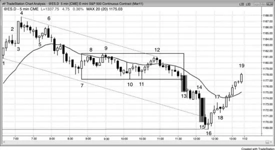

<!-- PDF page 152 -->

若趋势突然加速，它可以是成功突破，导致另一段下跌，或趋势的衰竭式结束。在图 4.1 中，这张 5 分钟 Emini 图上的 bar 13 与 bar 15 有非常大的区间与实体，并跟随其他几根空头K线，但表示相反状况。Bar 13 是可能趋势恢复空头趋势日中震荡区间下方的突破。它成为度量缺口。强突破通常至少有两段，如此处。第二次卖盘高潮后的回撤可以是单根或几根K线，一根或更多那些K线的低点可以在卖盘高潮低点下方，如此处到 bar 14 的空头旗形。Bar 15 是更大的空头趋势K线，因此代表甚至更激烈的卖出，市场几乎垂直。最后的多头已平掉，没有人留下卖出。当市场反转到其高点上方时，它成为衰竭缺口。连续卖盘高潮常常随后至少有 10 根K线、两段式反转。（我经常使用「10 根K线、两段」短语，意图是说调整会比小回撤持续更久、更复杂。那类调整通常需要至少 10 根K线与两段。）强多头反转交易回震荡区间，像所有震荡区间一样，它是磁铁。
所有强多头与空头都喜欢在持久趋势后看到像 bar 15 这样异常大的趋势K线，因为他们预期它是短暂、异常绝佳的机会。趋势K线是突破，由于多数突破尝试失败，这个在先前卖盘高潮没有太多调整之后、在没有调整进行数十根K线的多头趋势之后，崩盘的概率非常高。聪明交易者把这视为在更低价格概率非常小——至少许多根K线——时买入的异常机会。

<!-- PDF page 153 -->

空头买回其空单，多头买入新多单。两者都在K线收盘、其低点下方、下一根收盘（尤其若它是不那么强的趋势K线或有相反方向实体）以及再下一根收盘激进买入。那根是 bar 16，有多头收盘。他们也在前一根高点上方买入。当他们看到强多头趋势K线，如 bar 16 后那根，他们在其收盘及其高点上方买入。多头与空头都预期更大调整，空头在至少 10 根K线、两段式调整之前不会考虑再次做空，即便那时也只有在反弹看起来弱时。多头预期同样的反弹，不会急于过早止盈。在 bar 15 收盘买入的激进、有经验多头可以用大约与K线高度相等的保护性止损，那是四点。他们可能至少有 60% 机会市场在止损被打到之前至少测试到K线高点，因此这是数学上健全的交易。一旦市场开始急剧反转向上，他们会至少波段持有部分仓位到收盘。
弱势交易者以相反方式看待 bar 15。一直在场外坐着、希望有容易的回撤做空的弱势空头，看到市场从他们身边跑开，想确保抓住下一段下跌，尤其因为 bar 15 是如此强的K线。他们把大型空头趋势K线视为可能的崩盘。他们知道概率非常低，但不想冒错过巨大回报的风险，他们相信那会超过微小概率。早期买入并可能分批加仓的弱势多头被 bar 15 下跌的速度吓坏，害怕无情的跟随卖出，因此平多。这些弱势交易者基于情绪交易，并在与计算机竞争，计算机的算法中没有情绪作为变量之一。由于计算机控制市场，弱势交易者的情绪注定他们在像 bar 15 这样的K线上大亏。
Bar 11 是更低低点主要趋势反转的第二次入场买入信号。到 bar 9 的两段式反弹突破从 bar 6 到 bar 7 抛售的空头趋势线上方。然而，只有一根K线收在移动平均线上方，因此没有令人印象深刻的买入。到 bar 12 的五K线多头尖峰可能是主要多头趋势反转的起点，但它未能有任何大型多头趋势K线，只是测试了 bar 9 震荡区间顶部，在那里与 bar 9 形成双顶。在这一点，市场要么在经历弱势主要趋势反转向上，要么在空头市场中测试震荡区间顶部（空头旗形）。大型 bar 13 空头趋势K线是空头旗形的突破与空头趋势的恢复。主要趋势反转尝试失败。趋势线突破与从 bar 11 低点的反弹都缺乏连续、大型多头趋势K线，交易者从未把市场视为已翻转为始终 <!-- PDF page 154 --> 做多。
图 4.2 向上尖峰但向下通道

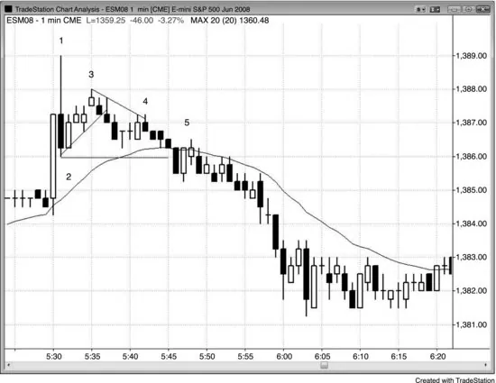

有时市场会有向上尖峰然后向下尖峰。这通常随后是震荡区间，多头与空头争夺形成通道。多头试图创造向上通道，而空头想要向下通道。
如图 4.2 所示，Globex 1 分钟 Emini 在太平洋时间上午 5:30 报告上向上尖峰，但在 bar 1 形成强向下反转K线。Bar 1 是三点高的K线，在 1 分钟图上很大，因此有资格作为可能的向下尖峰。Bar 3 是两段式上行走动，在可能的新空头趋势中形成 Low 2。此外，若你只看实体，bar 2 是 ii 变体（bar 2 的实体在 bar 1 内，而 bar 1 的实体在先前多头突破K线内，ii 形态表明犹豫），到 bar 3 的上行走动是 ii 形态顶部的假突破。市场横盘约 10 根K线，有资格作为向下尖峰后的震荡区间。Bar 4 有最小突破小趋势线上方，然后市场恢复其下降趋势。Bar 5 是第二次机会入场。它是 bar 2 下方突破的回撤与失败的微型通道突破。
作为一般规则，大涨 + 大跌 = 困惑 = 震荡区间，至少有一段时间，如 bar 1 空头反转K线与买盘高潮之后。

<!-- PDF page 155 -->

图 4.3 一根K线内的上下尖峰

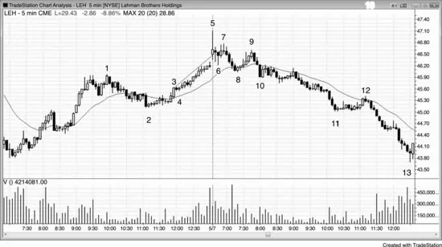

顶部有大影线的大K线是向上尖峰与向下尖峰，但在单根K线中。
有时通道可以非常紧，如图 4.3 中 bar 3 尖峰后。在非常紧的通道中有超过 10 根K线，这是不可持续的活动。几乎每一根都有更高高点、低点与收盘。然而，处于不可持续模式不足以做空，因为市场可以比你维持账户更久地维持这种异常行为。每当市场做极端的事时，很快会随后有相反类型的行为。极端趋势会随后有震荡区间，有时反转，极端震荡区间会随后有趋势。
紧通道基本上是向上倾斜的紧震荡区间，它最终必须突破。它在 bar 5 向上突破，当那失败时，它很可能向下突破，最终确实如此。市场横盘 5 根K线然后在 bar 7 形成更低高点，完成 bar 5 向下尖峰后的小震荡区间（它向上尖峰并向下反转，在 1 分钟图上必须是向下尖峰）。在更高时间框架图上，跌到 bar 2 跌破多头趋势线，到 bar 5 的反弹是更高高点主要趋势反转。
Bar 9 可被视为震荡区间的扩展、bar 8 跌破多头趋势线后的更低高点主要趋势反转，或双顶空头旗形（它大约与 bar 7 同一水平，至少是第二次 <!-- PDF page 156 --> 尝试反弹到 bar 5 高点）。名称无关紧要，但它是好的做空形态。市场然后趋势更低到当天剩余时间，并在下跌时加速。
Bar 10 是三K线空头尖峰，跌到 bar 11 的运动是通道。昨天，bar 3 是尖峰，随后是始于 bar 4 的通道。通道起点通常在一两天内被测试（bar 4 低点在跟随以 bar 5 大影线开始的高潮顶部的空头趋势中被突破，但通道下跌的 bar 10 高点起点在接下来两周内未被测试）。
到 bar 12 的运动勉强突破空头趋势线上方，但它是弱运动。因此，交易者应继续只寻找做空，而不是趋势反转。仅有趋势线突破不足以寻找反转。突破必须强，交易者才会相信多头能够维持强上行走动。
图 4.4 高潮后，通道方向可以一段时间不清晰

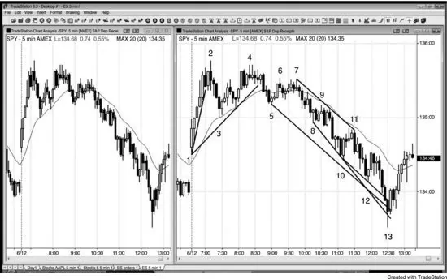

在买盘高潮（向上尖峰然后向下尖峰，有时在单根K线内）之后，常常会有失败的多头通道，然后市场会形成空头通道。图 4.4 中两张图都显示 5 分钟 SPY。到 bar 2 的上行是强多头尖峰。在急剧移动平均线回撤到 bar 3 突破趋势线之后，多头通道开始。然而，它在 bar 4 以两段式更低高点失败。一旦市场以 bar 5 回撤跌破多头通道——它也突破主要多头趋势线——就明显这不是多头尖峰与通道日，市场在形成震荡 <!-- PDF page 157 --> 区间。这成为三角形顶部，然后尖峰与通道向下。有些交易者把跌到 bar 3 的运动视为重要空头尖峰，而其他人把跌到 bar 5 的运动视为更重要。两个尖峰都是导致空头取得市场控制的卖盘压力的一部分。
Bar 8 与 bar 3 形成双底多头旗形，它是移动平均线缺口K线的第二次做多入场。一旦买入失败，就清晰空头在控制，空头通道在进行，跌到 bar 5 的推动是空头尖峰。在这一点，你应试图接所有做空入场，并把任何做多视为剥头皮，直到有空头趋势通道线的高潮过度延伸与向上反转。总体而言，当有像这样的强空头趋势时，更好忽略做多形态，只顺势交易。
Bar 13 从突破三条这样的线反转向上。
连续高潮常常导致显著调整，但若每次高潮后有显著调整，概率下降。有跌到 bar 3 的卖盘高潮与另一次跌到 bar 5，但到 bars 4 与 7 的反弹缓解了卖盘压力，减少了急剧向上反转的需要。然而，在从 bar 7 到 bar 13 的空头通道中，在从 bar 9 到 bar 10 与从 bar 11 到 bar 12 的高潮期间发生的激烈卖出没有缓解。四空头趋势K线暴跌到 bar 13 是显示弱势交易者投降的衰竭卖盘高潮。第三次卖盘高潮通常最戏剧性，它通常有大型空头尖峰，过度延伸趋势通道线并创造通道的抛物线弯曲。抛物线斜率表明动量在市场下跌时增加，抛物线趋势通常处于最后阶段。最后的弱势多头放弃并以任何价格卖出，最后的弱势空头终于在自由落体期间市价做空加入其他空头。这是没有显著中断的第三次连续卖盘高潮，通道常常以第三推结束。紧通道意味着有紧迫感，动量在下行途中增加。到 bar 13 的运动崩穿趋势通道线，这是许多通道结束的方式。
那么强多头与空头呢？他们看到高潮并理解过度。强空头已在更高处做空，对在这里做空不感兴趣。他们只会在显著回撤做空，也许在通道顶部附近他们最初做空的地方。没有更多强或弱势空头做空，没有更多弱势多头出场，卖盘压力消失。强多头看到崩塌并靠边站。他们知道市场会走低，因此在他们相信市场已到最低之前没有动力买入。他们想 <!-- PDF page 158 --> 在最好价格买入，那是在底部。不同机构各有自己对价值与过度的衡量，当足够多的他们同意市场是好价值时，有足够强买入支撑反弹。此外，强空头理解过度并止盈。他们的买入促成了反弹。若市场能够回到大约通道起点——他们更早做空并盈利的地方——他们会考虑再次做空。
底部总是在磁铁汇合处。这里，它刚好越过从 bar 1 多头尖峰开盘到五根后多头尖峰最后一根收盘的等幅下跌。它也是从昨日两个摆动低点（未显示）画出的趋势通道线过度延伸，bar 13 两K线向上反转也是大型、两日扩散三角形底部的信号。Bar 13 也过度延伸了从 bar 7 向下通道创造的三条更小趋势通道线。
图 4.5 相反趋势K线创造高潮反转

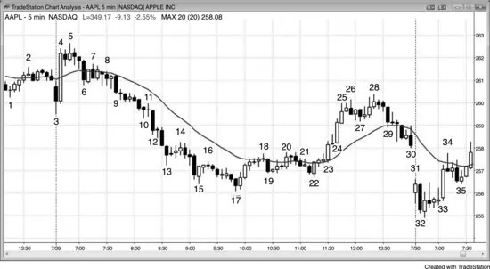

一个方向的趋势K线随后另一个相反方向的趋势K线是高潮反转，随后的通道可以朝任一方向，因为两个方向都有尖峰。在图 4.5 中，AAPL 在这张 5 分钟图上有几个高潮与反转。
Bar 3 是大型空头趋势K线，因此是尖峰、突破与高潮。它立即随后有甚至更大的相反方向趋势K线，那是买盘高潮。假设这代表甚至更强信念很诱人，但你需要耐心让市场向你展示它要去哪里。你的工作是跟随机构，而不是猜测他们可能做什么。

<!-- PDF page 159 -->

到 bar 5 的反弹是 bar 3 空头突破的更高高点突破回撤，以及 bar 4 多头突破后的停顿。Bar 6 是另一个空头尖峰，因此是另一个卖盘高潮。Bar 6 后的紧震荡区间是 bar 4 多头突破的回撤，以及跟随 bar 3 突破与 bar 6 空头尖峰的空头通道可能的起点。在 bar 6 后的紧震荡区间期间，多头在买入试图创造多头通道，空头在做空试图创造空头通道。空头最终获胜。即便 bar 4 买盘高潮是比 bar 3 与 bar 6 空头尖峰更大更强的趋势K线，空头仍能压倒多头。
Bar 15 是多头反转K线，由于它有相当大的区间与大实体，它是买盘高潮。它立即跟随大型空头K线，那是卖盘高潮。由于向下通道如此陡，第一次突破尝试更可能失败。每当强趋势中反转有小入场K线时，概率有利于它只成为顺势旗形。这里，bar 15 反转后的两根K线小，显示多头弱势，它们形成空头旗形。
所有两K线反转都是相反高潮，尽管通常很小。Bar 17 是小空头高潮，立即跟随多头趋势K线，设定两K线反转。向下尖峰是卖盘高潮，向上尖峰是多头突破。向上尖峰持续三根K线。Bar 19 是空头尖峰，是卖盘高潮与空头旗形突破，那也是对移动平均线的回撤。它被 bar 10 买盘高潮反转。
从 bar 23 到 bar 25 或仅由 bars 24 与 25 构成的多头尖峰被更小的 bar 29 空头趋势K线反转。那个卖盘高潮随后有几个十字星然后抛售进入收盘。空头通道在次日结束。
Bar 31 是买盘高潮，随后是 bar 32 卖盘高潮，在下一根被反转。Bar 33 是另一根大型多头趋势K线，因此是买盘高潮，它突破开盘区间上方。它随后有四K线回撤，包含空头突破K线，然后反弹以多头通道形式恢复。
到 bar 18 的反弹突破从 bar 5 到 bar 17 的空头通道上方，但 <!-- PDF page 160 --> 在移动平均线停顿。市场从 bar 20 的双顶转下，但在 bar 22 低点找到买家，市场形成双底多头旗形。那个双底更高低点是主要趋势反转的好形态吗？它不理想，因为虽然空头趋势线上方到 bar 20 的两段式反弹有许多多头K线，它无法守在移动平均线上方，因此不强。从 bar 22 双底到 bar 28 的两段式反弹出人意料地强，但许多交易者把它视为空头趋势中的第一次反弹，因此可能只是空头反弹而不是新多头趋势。然而它足够强，使交易者寻找买入对空头低点的测试。交易者在跟随 bar 32 次日开盘抛售的多头K线上方买入，并在两根后形成的第二个多头信号K线上方再次买入。它创造第二次信号（与 bar 32 后多头K线的微型双底），因此更可靠。结果是强空头趋势线突破后更低低点的主要趋势反转（到 bar 28 的反弹）。因为它在如此多K线上展开，形态可能在更高时间框架图上更容易看见。
图 4.6 V 顶与 V 底罕见

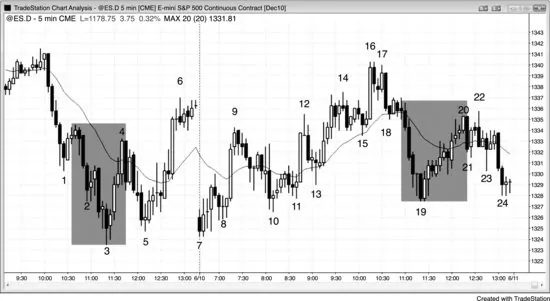

没有先有显著回撤就反转市场的 V 底与倒 V 顶罕见。多数尖峰未能立即反转市场，尖峰末端通常被测试。在图 4.6 中，bar 3 楔形底部导致到移动平均线的反弹。这是潜在 V 底，但跌到 bar 5 更高低点测试了尖峰底部。多数被称为倒 V 顶或 V 底的反转实际上是其他类型的底部，如最后旗形反转或微型双顶或双底。例如，从 bar 3 低点的向上反转是楔形底部，以及基于跟随 bar 2 的两K线空头旗形的最后旗形反转。Bar 19 底部是微型双底，因为 bar 19 前的K线先下后上进入收盘。Bar 19 再次交易向下，其后的K线交易向上，创造微型双底。双底在 1 分钟图上（未显示）可以容易看见，并基于这张 5 分钟图容易推断。

<!-- PDF page 161 -->

Bar 20 是从 bar 19 空头尖峰的持久反弹顶部与 V 底尝试，但 bar 19 尖峰低点在日收盘被测试。
到 bar 4 的运动是空头趋势线上方的强突破，使多头寻找买入更低低点或更高低点测试空头 bar 3 低点。多头想看到趋势线上方的强突破，而不仅仅是横盘漂移突破趋势线。
交易者预期三次连续卖盘高潮跌到 bar 3 会随后有大调整，至少两段横盘到向上，持续至少 10 根K线。最终高潮常常有整段运动中最大的空头趋势K线，如此处 bar 3 前两根。强空头只会在显著回撤后寻找卖出，而强多头激进买入，若市场走低他们会买更多。在从日高向下的紧通道中第三次卖盘高潮后，没有一组强交易者愿意在 bar 3 低点卖出。强空头在买回其空单，强多头在激进买入新多单。
到 bar 6 的两段式反弹远突破多头趋势线上方，提醒交易者下一段下推可以测试 bar 3 空头低点然后反转向上。Bar 7 是双底主要趋势反转。有些交易者把第一个底部视为 bar 3 低点，而其他人把形态视为与 bar 5 低点的双底多头旗形。
由于多数反转尝试失败，包括高潮反转，许多交易者 fade 反转，预期趋势至少恢复到足以交易。例如，尽管到 bar 4 的反弹如此强，许多空头只把它视为对移动平均线的回撤与从 bar 1 回撤的双顶。他们做空他们认为在短暂高价卖出的绝佳机会，并在 bar 5 止盈，如其底部影线与小多头实体所证。
图 4.7 V 底罕见但强

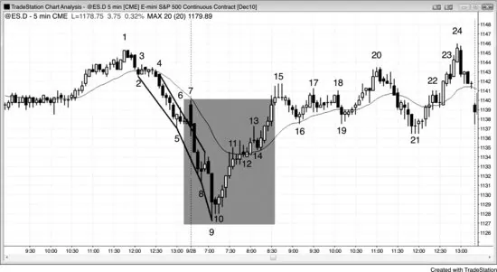

<!-- PDF page 162 -->

没有对尖峰任何显著测试的 V 底或倒 V 顶在 5 分钟图上一个月只发生几次。图 4.7 显示 5 分钟 V 底，它是卖盘高潮与高潮反转。开盘跌到 bar 9 的抛售是抛物线运动，是一种卖盘高潮。你可以看到三条趋势通道线的斜率变得越来越陡（从 bar 2 到 bar 3、bar 5 到 bar 8，以及 bar 8 到 bar 9），表明恐慌。交易者想以任何价格卖出。空头加压其空单，在强空头尖峰中市场下跌时快速加仓。然而，当有连续卖盘高潮时，市场很快耗尽没有显著回撤就急于甚至愿意做空的交易者。这种卖出的缺席创造买入失衡，通常随后有至少持续 10 根K线并至少有两段的反弹。
每当有卖盘高潮或一对连续卖盘高潮如此处（在 bars 8 与 9 结束的空头尖峰），且增加的卖出发生在市场已下跌 10 根或更多K线之后时，有很好机会有强反转。强多头靠边站，因为他们预期市场会交易到某个磁铁汇合处；一旦到达，他们从天而降并激进买入。强空头理解正在发生的事，一旦看到异常大的 bar 9 卖盘高潮K线就快速对其空单止盈，在市场高得多之前不愿考虑再次做空。强多头与空头都在 bar 9 收盘与随后的两K线微型双底买入，市场只能上涨。
当市场看起来跌得太远、太快时有强尖峰，抛售可能是卖盘真空向下测试支撑 <!-- PDF page 163 --> 位的可能，许多交易者会观察高潮反转的信号。有强空头尖峰跌到 bar 8 然后单K线 Low 1 卖出信号。有经验的多头与空头意识到若一两根K线内有特别大的空头趋势K线，它可能是卖出的衰竭式结束。那个 Low 1 信号K线可能是单K线最后旗形（第 7 章讨论）。当 bar 9 收盘且是特别大的空头趋势K线时，它是连续卖盘高潮，可能导致最后旗形反转与可到达 10 根或更多K线并有两段或更多的反弹。许多空头在这种情况下买回其空单，因为他们意识到市场可能急剧反弹。若约 10 根K线后有合理卖出信号，他们会寻找再次做空。在这种情况下，市场强劲反弹，空头没有看到它会抛售的信号，因此他们从未看到合理的做空形态。
激进多头也认为市场很可能反弹，他们也买入。有些多头与空头在 bar 9 收盘买入，风险大约 bar 9 的高度；有些选择风险更少，如也许一两点。其他多头与空头在下一根期间及其收盘买入，因为它是小K线，因此是卖出在减弱的信号。其他人等到 bar 10 有强多头收盘并在收盘或其高点上方买入。最后，剩余空头买回其空单，谨慎多头——想确定市场已翻转为始终做多——在从低点的五K线多头尖峰期间与随后的反弹中买入。许多多头加压其多单，在从 bar 10 低点的快速、强多头尖峰期间加仓。
当市场快速运动且有经验交易者的仓位有立即利润并快速增长时，他们常常会买更多，试图在这个短暂、异常机会期间最大化利润。这与他们在紧震荡区间中会做的相反，如图表左侧前 20 根K线期间。当几乎没有运动时，多数交易者靠边站，在趋势开始前舒适地不交易。然而，机构与高频交易公司整天继续沉重交易，包括在紧震荡区间中。
完美 V 底——市场直下然后上——极其罕见。多数 V 底有微妙的价格行为显示卖出中的犹豫，如此处，提醒交易者可能的反转。Bar 8 后的K线是单K线最后旗形，提醒交易者在另一两次一或两K线卖盘高潮后可能向上反转。Bar 10 与其前一根形成微型双底，并与其前一根及 bar 9 低点形成微型三重底。这是微型三推向下形态，在 <!-- PDF page 164 --> 更小时间框架图上很可能是三角形，并在连续卖盘高潮与单K线最后旗形后给多头低风险、高概率入场。
昨日市场安静时多数K线的成交量约每根 5,000 到 10,000 张合约。Bar 9 有 114,000 张合约。这个成交量规模几乎完全是机构的。它更可能是机构做空——因为他们在市场已下跌许多根K线后终于认定市场会走低——还是由于多头与空头的激进买入——因为他们把这次连续卖盘高潮视为暂时的卖出结束？机构是聪明资金，因此每当他们在持久空头趋势中突然全部同意并极其沉重交易时，概率非常高交易是由于空头（止盈）与多头的激进买入。若机构聪明、盈利且对每一个 tick 负责，他们为何会在空头趋势中卖出最低 tick？因为那是他们的算法一路下行盈利地在做的，有些设计为继续这样做，直到明确空头趋势不再生效。他们在那最后一次卖出上亏损，但在所有更早交易上赚得足够抵消那次亏损。记住，他们所有系统在 30% 到 70% 的时间亏损，这是那些时候之一。也有 HFT 公司会一直剥头皮到空头趋势的最低 tick，甚至只为一个 tick。低点总是在支撑位，许多 HFT 公司会在支撑上方一两个 tick 卖出，试图捕捉那最后一 tick，若他们的系统显示这是盈利策略。其他机构作为另一市场（股票、期权、债券、货币等）对冲的一部分卖出，因为他们感知通过下对冲其风险/回报比更好。成交量不是来自小个人交易者，因为他们在主要转折点负责不到 5% 的成交量。
图 4.8 尖峰回撤比尖峰反转更常见

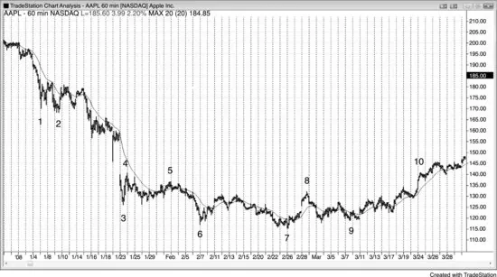

<!-- PDF page 165 -->

尖峰是对趋势与逆势交易者双方力量的测试。多头市场中的向上尖峰与空头市场中的向下尖峰通常被测试，因为尖峰反转比通常被测试并超过的简单暂时趋势极值少得多。多头市场中的向下尖峰与空头市场中的向上尖峰是回撤，可能被测试也可能不被测试。它们已经是测试，测试逆势交易者的决心与顺势交易者的决心。回撤常常接近把始终持仓仓位翻转到相反方向，但没有足够跟随。强交易者喜欢这些反转尝试，因为他们知道多数会失败。每当逆势交易者能够创造一个时，顺势交易者进来沉重对抗反转尝试，通常获胜。他们把这些急剧逆势运动视为在趋势方向以绝佳价格入场的绝佳机会，那个价格很可能只短暂存在，并很快只成为趋势中的尖峰回撤。在图 4.8 中，这张 60 分钟 AAPL 图上的 bar 1、bar 3 与 bar 6 空头尖峰以及 bar 4 与 bar 8 多头尖峰都被测试。
Bar 4 是空头趋势中的多头尖峰，不必被测试，但约 10 根K线后被测试。
Bar 8 是震荡区间中的多头尖峰与主要趋势线突破，因此很可能被测试。
Bar 7 是新摆动低点，但不是尖峰，因此不必被测试。
图 4.9 尖峰回撤通常不被测试

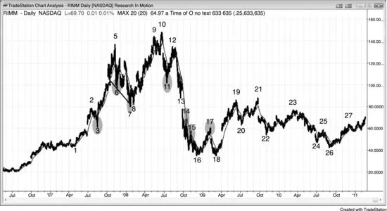

<!-- PDF page 166 -->

尖峰回撤不必被测试，因为交易者同意趋势在恢复并急于上车，但尖峰反转通常被测试，因为它是逆势的，交易者较不愿相信反转会成功。
多头趋势中多数空头尖峰由寻找在更低处再次买入的止盈多头与只寻找空头剥头皮的激进空头造成。当市场急剧下行走动时，如 bar 3，多头激进买入以启动多单或加仓，空头买回其盈利剥头皮。一旦空头能够获得跟随卖出，如他们在跌到 bar 7 的运动中所做，他们预期市场正变得足够双边以过渡到震荡区间甚至主要趋势反转。与其在下一次反弹剥头皮做空，他们会开始持有部分或全部仓位做波段下跌。多头也会预期更深抛售，只会在低得多处买入，且只有在有清晰买入信号时。双方都不愿买入直到市场比过去回撤跌得更远，更深回撤、震荡区间甚至主要趋势反转的机会增加。
图 4.9 中的 bar 3 是强多头趋势中的空头尖峰，不太可能被测试。它只是第一根移动平均线缺口K线，困住了空头。尽管卖出如此强，没有足够跟随卖出说服交易者市场已反转入始终做空方向。在尖峰期间做空的空头意识到这一点，快速买回其空单，靠边站，等待另一个可能反转市场的机会。多头激进买入，因为他们意识到空头已失败，这次折价是在绝佳价格买入的短暂机会。

<!-- PDF page 167 -->

他们期待空头尖峰，因为他们知道多数反转尝试失败，因此成为绝佳买入形态。没有人留下愿意卖出，市场急剧上涨许多根K线。
Bar 6 是跟随楔形顶部的空头尖峰，使它很可能被测试，因为预期至少两段下跌。
Bar 7 是空头腿中的空头尖峰，以更高低点被测试，导致更高时间框架多头趋势的趋势恢复，基于 bars 4、6 与 7 的楔形多头旗形。
Bar 11 是强向下尖峰与可能的新空头趋势第一段下跌，因为它跟随 bar 10 更高高点。在这一点，它不太可能是多头趋势中的回撤，因此很可能被测试。市场在强多头趋势线突破（跌到 bar 7 的运动）然后更高高点后很可能至少有两段下跌。
Bar 13 是更大多头趋势中两段式回撤的底部。这可能导致新多头高点，因为它在 bar 7 低点上方，市场因此仍在创造更高低点与高点，可能仍处于多头趋势。动量下行如此强，更好等待从这里的反弹然后更高低点再做多。市场以大缺口向下突破。
Bars 14 与 15 是强空头趋势中的多头尖峰，不必被测试。
Bar 17 是空头趋势中的多头尖峰，因此不必被测试，它可以只是空头趋势中又一个更低高点，空头趋势有一系列更低高点与低点。然而，它跟随小楔形底部（bar 15 是第一段下推的回撤），那很可能至少有两段上涨，因此到 bar 17 的运动是两段可能腿中的第一段。此外，bar 16 低点在 bar 1 紧震荡区间区域，那是支撑区，因此是震荡区间可合理预期形成的区域。这意味着从 bar 18 双底有第二次反弹的好机会。到 bar 17 的反弹突破空头趋势线（从 bar 12 到 bar 16 的趋势），使交易者怀疑它是否会随后有对空头低点的测试然后要么震荡区间要么主要趋势反转。结果证明是持续到图表末端的大震荡区间的起点。
图 4.10 对多头尖峰的测试

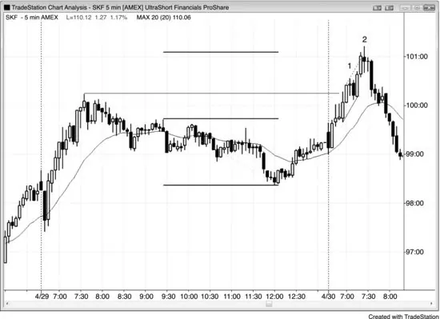

<!-- PDF page 168 -->

如图 4.10 所示，Research in Motion（RIMM）昨日以强多头尖峰收盘，因此概率极好今天会尝试超过它。虽然今天的反弹杂乱且看起来不是特别看多，空头仍无法把两根连续收盘放在移动平均线下方。这张图在上涨，但其力量是欺骗性的。
图 4.11 倒 V 顶

如图 4.11 所示，ProShares UltraShort Financials ETF（SKF）中这个 bar 2 高潮开盘反转（倒 V 顶）

<!-- PDF page 169 -->

只是突破小空头趋势通道线（虚线）顶部后的反转。它也是突破昨日高点上方后的第二次入场，以及始于昨日开盘的腿 1 = 腿 2 趋势恢复的结束。它是开盘以来没有显著回撤的第三次连续买盘高潮，以及可能的单K线最后旗形反转（bar 1 后的空头K线是单K线 High 1 多头旗形）。在更高时间框架图上，昨日的抛售跌破多头趋势线，bar 2 是从更高高点的向下反转。它是从昨日震荡区间的等幅上行，但这本身不足以做空多头趋势。当强趋势到达等幅运动区域时，多头在止盈，但空头只有在有其他因素时才会做空，如此处。
Bar 2 是与其前多头趋势K线的微型双顶。市场在多头趋势K线上涨，然后在 bar 2 顶部影线上再次上涨。它下跌到 bar 2 底部，并有第三段上推到随后小十字星K线的高点，创造微型头肩顶或三角形，很可能在更小时间框架图上可见。顶部也是跟随 bar 1 的单K线最后旗形的单K线最后旗形反转。Bar 2 与随后十字星的实体与 bar 2 前多头K线的实体形成 ii。
图 4.12 有更多反转理由的高潮反转

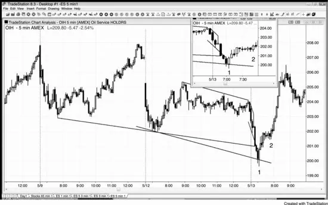

当涉及其他因素时，高潮反转更可靠。如图 4.12 所示，5 分钟 Oil Service HOLDRS（OIH）在昨日低点下方有高潮开盘反转，它也是三条趋势 <!-- PDF page 170 --> 通道线过度延伸的反转。交易者应在 bar 1 大型两K线反转上方买入，并在 bar 2 的 High 2 第一次回撤再次买入，预期至少两段上涨。当两段很可能时总是波段持有部分，因为有时会有新趋势而不仅仅是两段式回撤。
Bar 1 是两K线反转底部。Bar 1 前的K线是大型空头趋势K线，比其前空头K线大且收盘远在其下方。这意味着它是那根K线下方的突破，更小的空头趋势K线是单K线最后旗形的变体。它很可能是更小时间框架图上的小最后旗形。
图 4.13 不要买入空头趋势通道线的测试

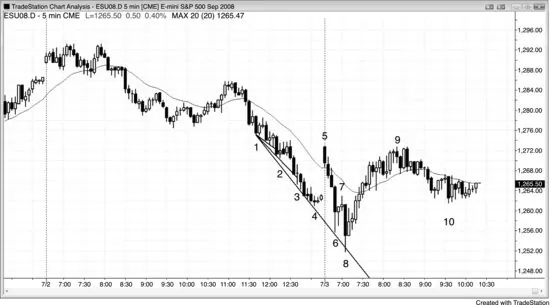

逆势交易者总在画趋势通道线，希望有过度延伸与反转，允许至少剥头皮，最好是两段式逆势运动。当通道陡时，买入每一次从趋势通道线过度延伸的反转是亏损策略。相反，等到有通道的强突破，如图 4.13 中到 bar 5 的大跳空，然后寻找买入突破回撤，如 bar 8 第二次尝试反转昨日低点。
Bar 2 突破小趋势通道线，但没有更早的逆势力量，形态K线只有小多头实体。聪明交易者会等待第二次入场，尤其更高低点，若没有发展，他们会把这视为顺势形态，结果确实如此。注意 bar 2 下方的突破以强空头趋势K线形式。这是因为有许多多头在这个小楔形上早期入场，多数在有运动跌破楔形 bar 2 低点之前不会承认反转已失败。那是他们保护性止损的地方。

<!-- PDF page 171 -->

此外，许多空头在那里也有入场止损，因为失败楔形通常至少跑楔形高度，为等幅下跌创造绝佳做空入场。当空头通道像这样陡时，聪明空头会限价在前一根高点或上方做空，正好在过于急切的多头买入的地方。
Bar 3 过度延伸另一条趋势通道线，但没有入场信号，因此被困多头很少。
Bar 5 开在空头通道远上方，但它是 20 缺口K线做空，本质上是第一根移动平均线缺口K线（足够接近——其实体大且完全在指数移动平均线上方），创造开盘即趋势向下运动。
Bar 6 没有到达趋势通道线，因此虽然它试图反转昨日低点，反转尝试可疑。多数交易者会等待过度延伸，在其缺席时会至少想要第二次入场。此外，信号K线是只有微小实体的十字星，意味着多头不强。
Bar 8 过度延伸空头趋势通道线，信号K线是有像样多头实体的内包K线。这个形态也是第二次尝试反转昨日低点，创造可靠的开盘反转形态，可能是日低。它是从 bar 7 最后旗形的向上反转，以及 bar 5 突破空头通道上方后的更低低点突破回撤。记住，空头通道是多头旗形。有些交易者合理把它视为主要趋势反转，因为到 bar 5 的反弹远突破空头趋势线与移动平均线上方。最后，它是连续卖盘高潮，其实体是抛售中最大的空头实体，这在连续卖盘高潮末端常见。
图 4.14 斜率增加通常意味着高潮情绪

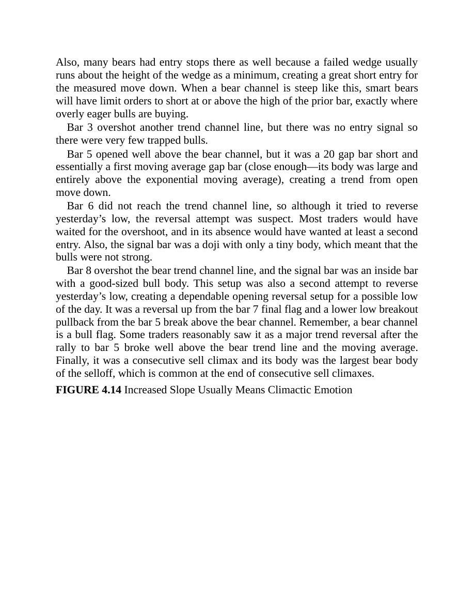

<!-- PDF page 172 -->

一旦斜率增加，趋势在加速，很可能即将调整。这是因为增加的斜率表明增加的情绪，一旦情绪化交易者已出场，既没有人留下出场，也没有人愿意在有回撤之前进入趋势。图 4.15 中从 bar 8 的上行走动比之前的多头趋势更陡，整个多头趋势以 bar 10 的跳空空头反转结束。

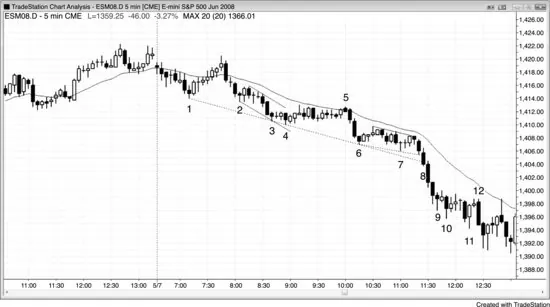

从 bar 13 的下行走动比之前的空头通道更陡，这个卖盘高潮在 bar 15 强多头趋势K线反转向上，它与 bar 4 到 bar 10 多头尖峰起点形成双底。这两天有巨大向上尖峰然后巨大向下尖峰，形成大型买盘高潮。高潮通常随后是震荡区间，如此处到 bar 20 的两段式反弹。
Bar 14 前的大型空头趋势K线当时被视为要么可导致等幅下跌的突破，要么可能导向上反转、持续约 10 根K线与两段的衰竭卖盘高潮。由于它跟随如此陡峭、没有调整的一系列空头K线，它很可能是不可持续因此高潮行为的结束。许多交易者等到看到像这样的大型空头趋势K线才开始买入。有些在K线收盘买入，但昨日低点如此近，许多交易者等待看市场是否可能再跌一点。那些交易者在 bar 15 形成时、在其收盘及其高点上方买入。这是对昨日低点的成功卖盘真空测试（双底主要趋势反转），买家取得市场控制。他们预期空头突破会失败，bar 15 是失败突破的买入信号K线。波段持有空单跌到 bar 15 的空头买回止盈，若他们计划只高几个 tick 与几根K线再做空，他们不会这样做。

<!-- PDF page 173 -->

若他们认为回撤会短暂，他们会持有空单。强多头反转K线与入场K线证明反转强，卖家约十根K线靠边站。这使市场单边并导致大反弹。空头在寻找合理形态把空单放回，直到 bar 20 才得到一个。多头理解空头很可能进来，因此平多止盈，并计划等待约 10 根K线再考虑再次买入。他们七根后在 bar 22 低点买入，它与 bar 17 低点形成双底反转向上。它是更高低点主要趋势反转（到 bar 20 的反弹突破跌到 bar 15 的空头趋势上方）与三角形（bars 4 与 15 是前两段下推）。
图 4.15 反转需要动量
当高潮形态未能形成任何逆势动量时，假定你读错了市场并在错误方向寻找交易。楔形反转与楔形回撤不同，即便它们可以看起来一样。你需要注意背景。若多头趋势中有楔形回撤，你可以在第一个信号买入，因为你在多头趋势中买入。不幸的是，当市场处于空头趋势时，过于急切的多头把所有楔形底部都当作回撤，但多数是反转。当楔形是反转时，它是逆势交易，你应等待更高低点再买入，且只有在有趋势线的强突破之后。试图在强空头趋势中剥头皮做多是亏损策略。
如图 4.15 所示，bar 4 完成从 bars 2 与 3 的三推下行走动，也从 bars 1 与 3 的空头趋势通道线反弹。

<!-- PDF page 174 -->

然而，市场横盘而不是上涨。多头不强，因此看起来像过度看空的东西根本不是过度。每当有强空头趋势时，总是更好只寻找做空，直到有更高低点，即便那时你买入，若空头趋势设定 Low 2，你也需要准备做空。
Bar 8 直到收盘前最后几秒都是多头反转K线，它快速抛售成空头趋势K线。过于急切的多头以为会是楔形底部与两条空头趋势通道线的多头反转K线，变成了空头趋势通道线的空头突破，意味着人人现在同意还有更远要走。这被跟随楔形反转失败的一系列空头趋势K线确认。若你观察市场行为，你会看到多头反转K线崩塌成空头趋势K线，然后你会做空它，知道有被困的早期入场多头买入了他们以为会是从空头趋势通道线的强多头反转K线（不要抢跑K线；总是等它们收盘与下一根确认反转）。即便不知道这一点，在那根空头趋势通道线突破低点下方一个 tick 做空仍是聪明交易。
Bar 11 是另一个三推向下形态，但有所有这些十字星与大、重叠K线，任何做多都需要第二次信号，交易者应寻找铁丝网形态高点附近的小K线做空（如 bar 12，它明确在一根前多头反转K线入场突破上困住多头）。Bar 11 是差的多头反转K线，因为没有以突破空头趋势线上方形式的先前显著多头力量，它与先前K线重叠太多，迫使你在空头震荡区间高点附近买入（记住，低买高卖！）。这是非常强的空头趋势日，最好的交易者不会一直寻找楔形。相反，他们会寻找在移动平均线附近做空。由于做空很少，空头非常强，聪明空头会卖出每一个失败买入信号以及 Low 1 与 Low 2 入场。
有连续卖盘高潮跌到 bars 2、3、6 与 9 以及从 bar 12 下跌。下行走动不在紧通道中，每一次过度被市场横盘约 10 根K线消化。这创造一系列趋势型震荡区间，在强趋势中常见，它阻止了衰竭高潮反转。
图 4.16 太多趋势通道线

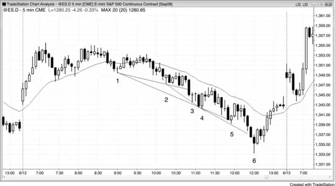

<!-- PDF page 175 -->

每当你发现自己画多条趋势通道线时，你总是被对你不相信正在发生的事的焦虑蒙蔽，看不见眼前的东西（见图 4.16）。即便趋势在空头通道中且通道有大量双边交易，它们可以持续比看起来可能的更久。总是假定任何通道会永远持续，一旦它终于不持续，再改变想法。双边交易给人它很快会反转的外观，但任何事物的多数反转尝试失败。趋势强，你错过所有顺势做空，因为你只看到趋势通道线与你相信是震荡日中过度抛售的潜在反转（尖峰与通道形态中的通道总是看起来那样）。要有耐心，只顺势交易，直到有如此清晰且强的反转，你不需要画线就能看到过度，如大型 bar 6 反转昨日低点并是三推向下形态（bars 4、5 与 6）。不要交易你相信应该发生的事。只交易正在发生的事，即便它看起来不可能。如第一册第 15 章关于通道所讨论，当市场处于空头通道时，聪明交易者只在K线下方买入而不在上方；他们对做空更感兴趣，寻找在先前K线上方做空，而不是下方。
图 4.17 反转处的成交量不是特别有帮助

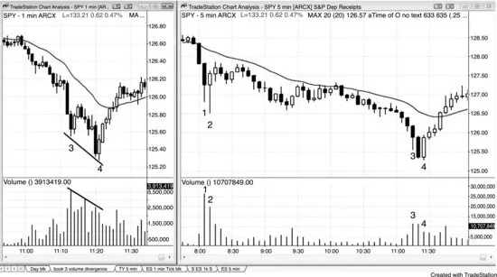

<!-- PDF page 176 -->

如图 4.17 右侧图所示，5 分钟 SPY 在 bar 3 有衰竭卖盘高潮，在 bar 4 有两K线反转，随后有移动平均线上方的强反弹。
左侧图是 1 分钟图，显示低点有成交量背离，这很常见。Bar 4 低点的成交量少于更早 bar 3 低点的成交量，即便 bar 4 在更低价格。可能也有 tick 背离与许多振荡指标上的背离，但有经验的交易者不需要看 5 分钟图以外的任何东西就知道那一点。
传统技术分析教导多头反转上的成交量应大于最终空头K线。这里，在 5 分钟图上，bar 4 多头反转K线的成交量少于前两根空头趋势K线。那使反转不那么可靠吗？一点也不。然而，它可能足以让交易者不在底部买入。我不想要分心，在交易时不看成交量或任何指标，因为图表告诉我所有需要知道的。顺便说，bar 2 的成交量远大于 bar 4 低点，但导致以双顶空头旗形结束的失败反转。
Bar 3 底部的大影线是买家进来的信号；市场通常只再跌一两根K线才尝试调整。Bar 4 是强两K线反转，与 bar 3 低点的微型双底。Bar 3 是一种最后旗形，很可能是更小时间框架图上的最后旗形。
