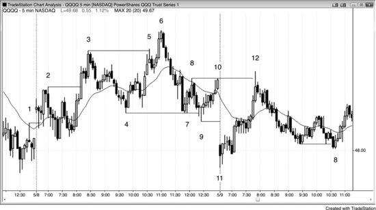
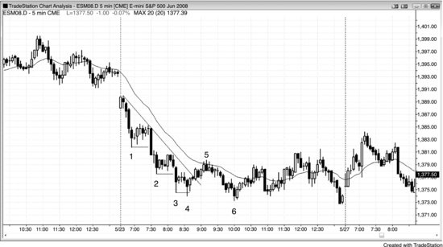
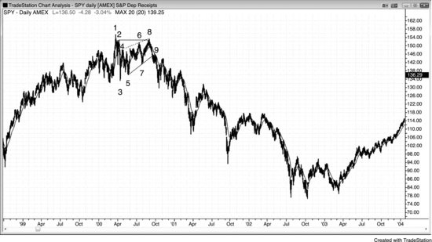
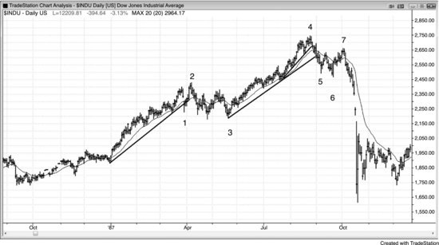
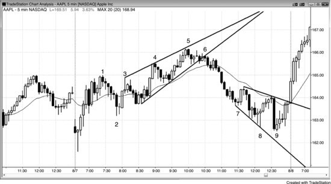
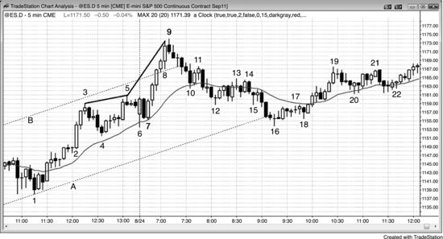
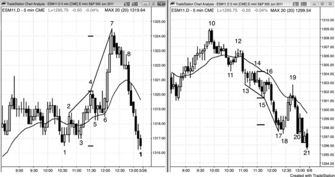
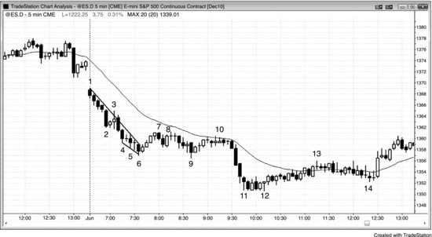
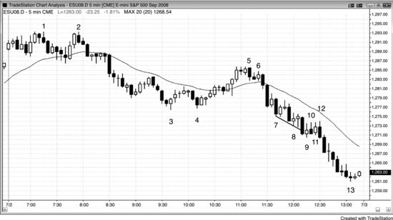
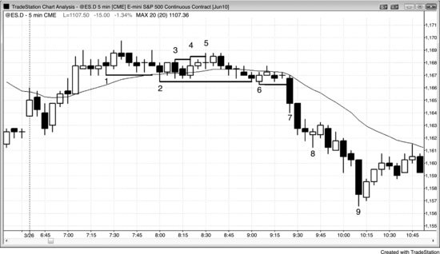

# 第 5 章：楔形与其他三推反转形态

<!-- Source PDF pages 177–201 -->

<!-- PDF page 177 -->

第 5 章
楔形与其他三推反转形态
当市场在一个方向做三推然后创造触发反转交易的反转形态时，第一个目标是形态的起点，下一个是基于形态高度的等幅运动。例如，若有楔形顶部，第三段上推以强空头反转K线结束，下一根交易到反转K线下方，第一个目标是测试楔形底部（第一段上推回撤的底部），下一个是基于从楔形底部到顶部高度的等幅下跌。所有三推形态都是同一潜在市场行为的表现，无论形态呈现什么形状。无论它是楔形、微型楔形、抛物线楔形、有第四推的楔形、趋势或震荡区间中的楔形回撤、楔形趋势反转形态、另一种三角形（包括扩散三角形）、三重顶或底、双顶或双底回撤、头肩顶或底，还是双顶下方或双底上方的失败突破，都不重要。在某个点，趋势交易者放弃试图强突破，反转交易者取得市场控制。第三次连续反转通常足以让那发生。
三推形态常常包含大型趋势K线并创造连续高潮。若推动是强的一到三K线尖峰，交易者会把它们视为高潮。例如，若有强空头尖峰、回撤，然后另一个强空头尖峰，交易者会怀疑回撤是否是空头趋势中的最后旗形，连续卖盘高潮是否会随后有更大回撤。若从第二段下推只有小回撤而不是 10 根K线反弹，然后有第三段强空头尖峰，交易者会把这视为三次连续卖盘高潮。他们知道概率 60% 或更高市场会尝试更复杂调整，如两段上涨，持续约 10 根或更多K线。因此，若形态有好信号K线、合理形状、足够买盘压力，且不是紧空头通道，他们会考虑从第三段下推买入向上反转。
楔形可以是回撤或反转。楔形回撤在第二册第 18 与 19 章讨论。当它们是趋势中的回撤时，它们是顺势形态，在第一个信号入场是合理的。楔形 <!-- PDF page 178 --> 反转是尝试反转趋势，因此是逆势形态。总体而言，做逆势时更好等待第二次信号。例如，若空头趋势中有楔形底部，只有在形态异常强时才在信号K线上方买入。通常更好等待看市场是否有强多头突破，然后寻找买入回撤，可以是更高低点甚至更低低点。若多头突破没有回撤直上几根K线，则交易者应像任何其他突破一样交易它，如第二册所讨论。楔形回撤与反转的另一个区别是它们的方向。楔形多头旗形指向下，而多头趋势顶部的楔形反转指向上。空头趋势中的楔形回撤指向上，但空头趋势中的楔形底部指向下。此外，楔形旗形通常是更小形态，多数持续约 10 到 20 根K线。由于它们是顺势形态，它们不必完美，许多很微妙，看起来一点不像楔形，但有三次回撤。反转通常需要至少 20 根K线长并有清晰趋势通道线才足够强以反转趋势。
趋势常常以对极值的测试结束，测试常常有两段，每一段到达更大极值（多头趋势中两段式更高高点或空头趋势中更低低点）。第一个极值然后那两段构成三推，是有许多名称的公认反转形态。有时它呈楔形（多头趋势中的上升三角形或空头趋势中的下降三角形），但通常不。对交易者来说在变体之间画微妙区别无用，因为有足够相似性它们同样交易。为简单起见，把这些三推形态想成楔形，因为多数以高潮式楔形点结束。记住，楔形只是有三推的趋势通道，常常趋势线与趋势通道线收敛。三推形态中的趋势线与趋势通道线可以像阶梯形态一样平行，像楔形一样收敛，或像扩散三角形一样发散。这不重要，因为它们行为相似，你同样交易它们。它们都是高潮，常常有抛物线形状，有时可以微妙。例如，若有多头楔形，画在第二与第三腿顶部的趋势通道线斜率比画在前两腿高点的线更陡，楔形是抛物线。这是高潮行为（上一章讨论），若市场向下反转，它通常约两段与 10 根K线这样做。
当通道有楔形时，是由于紧迫感（若它有抛物线楔形，是由于极端紧迫感），常常导致高潮反转。例如，在楔形顶部，趋势线的斜率 <!-- PDF page 179 --> 大于趋势通道线的斜率。趋势线是顺势交易者入场与逆势交易者出场的地方，在趋势通道线发生相反的事。因此若趋势线斜率更大，意味着多头在更小回撤上买入，空头在更小抛售上出场。首先把楔形与线平行的通道区分开的是第二次回撤。一旦第二段上推开始向下反转，交易者可以画趋势通道线，然后用它创造平行线。当他们把那条平行线拖到第一次回撤底部时，他们创造了趋势线与趋势通道。那告诉多头与空头支撑在哪里，多头会寻找在那里买入，空头会寻找在那里止盈。然而，若多头开始在那个水平上方买入，空头早期平空，市场会在到达趋势线之前转回上。两者都这样做是因为他们感到紧迫感，害怕市场不会跌到那个支撑位。这意味着双方都觉得趋势线需要更陡，上行趋势更强。
一旦市场转上，交易者然后重画趋势线。不是使用趋势通道线的平行线，他们现在可以用前两次回撤的底部画趋势线。他们现在看到它比上方的趋势通道线更陡，开始相信市场在形成楔形，他们知道那常常是反转形态。交易者会画那条新的更陡趋势线的平行线并拖到第二段上推顶部，以防市场在形成更陡的平行通道而不是楔形。多头与空头都会观察原始趋势通道线是否会包含反弹，还是新的更陡的线会被到达。若原始的包含反弹且市场转下，交易者会认为虽然第二次回撤中买入有更多紧迫感，那种紧迫感在第三段上推上没有继续。多头在原始、更浅的趋势通道线止盈，意味着他们比可以出场的地方更早出场。多头希望市场反弹到更陡的趋势通道线，但现在失望。空头如此急于做空，害怕市场不会到达更陡、更高的趋势通道线，他们开始在原始线做空。现在是空头有紧迫感，多头害怕。交易者会看到从楔形顶部的转下并卖出，多数会等待至少两段下跌再寻找下一个主要向上或向下信号。
一旦市场做第一段下跌，它会跌破楔形下方。在某个点，空头会止盈，多头会再次买入。多头想让楔形顶部失败。当市场反弹测试楔形顶部时，空头会开始再次卖出。若多头开始止盈，他们 <!-- PDF page 180 --> 相信他们无法把市场推到旧高上方。一旦他们的止盈与空头的新卖出达到临界量，它会压倒剩余买家，市场会转下做第二段。在某个点，多头会回来，空头会止盈，双方会看到两段式回撤并怀疑多头趋势是否会恢复。在这一点，楔形已演绎完毕，市场会寻找下一个形态。
市场常常在测试趋势极值后反转。例如，当多头趋势最强时，多头会在先前高点上方买入，因为他们相信会有成功突破与另一段上涨。然而，随着多头趋势减弱并有更多双边交易，强多头会把新高视为止盈的地方而不是更多做多的好位置，他们只会在回撤上买入。随着卖盘压力累积，强空头会在下一个新高主导，并试图把这个更高高点变成反弹顶部。若他们能够在强空头尖峰中把市场推下，交易者会仔细观察随后的反弹，看它是否在回到大约旧高时向下反转。反转可能来自更低高点、双顶或更高高点。多数会在市场反弹到仅略高于其做空入场价或那个更高高点上方时买回其空单。然而，他们意识到楔形顶部的可能，若第二高点上方的突破看起来不太强，他们会寻找再次做空。
当上下波段特别尖锐，且第一或第二段下推没有明确跌破主要多头趋势线或守在移动平均线下方时，空头会把向下反转视为弱。然而，那两段下推代表卖盘压力，告诉人人空头可能能够取得市场控制。空头知道市场可能需要第三段上推才耗尽自己。然而，他们看到他们能够在第二段上推的新高把市场转下，相信他们可能再次做到。多头在第一高点上方止盈，当市场越过第二高点时会更快止盈。若多头趋势非常强，多头会在第一高点上方突破时买更多。当交易者反而看到市场抛售时，他们知道强多头在止盈而不是买入突破，这告诉他们强多头不相信市场会在没有更多回撤的情况下上涨。
多头与空头都知道市场常常在第三段上推后反转，他们需要远超第二高点的强突破才相信市场没有在见顶。他们把第二高点视为大型 Low <!-- PDF page 181 --> 2 做空形态。若 Low 2 失败且 Low 2 顶部上方的突破强，市场很可能至少再有两段上涨。若它不强，市场很可能形成楔形顶部。第二高点上方的突破常常尖锐，但若多头与空头认为它在形成顶部而不是新突破，它会快速向下反转。第二顶上方的急剧刺探可能更多由于空头回补而不是强多头的激进买入，若没有立即跟随，交易者会假定强多头只会买入深回撤。若强多头靠边站，则空头会有信心激进做空。若他们能把市场推得足够远足够快，多头可能等待更持久的抛售再寻找买入。这可以创造卖盘真空，市场快速下跌直到到达交易者愿意再次买入的价格（多头启动新多单，空头止盈）。若多头在反弹停在楔形顶部下方时对其新多单止盈，市场会形成更低高点，很可能至少第二段下跌。强空头会在更低高点做空更多，正好在强多头平多的地方。它总会在有汇合卖出理由的阻力区。
这些快速覆盖许多点的快速反转代表人人感到的紧迫感，这常常使交易者难以足够快做交易决策以获得最佳入场。然而，若交易者理解市场在做什么，他们常常可以在向下反转非常早期做空。下行走动常常快，他们可以在第一段强下跌与随后更低高点后把止损移到保本。
多数三推形态在过度延伸趋势通道线后反转，仅此就可以是入场理由，即便实际形状不是楔形。然而，三推常常比趋势通道线过度延伸更容易看见，那使与其他趋势通道线失败的区分值得。这些形态很少有完美形状，常常必须操纵趋势线与趋势通道线以突出形态。例如，楔形可能只在蜡烛实体上，因此要以突出楔形的方式画趋势线与趋势通道线，你必须忽略影线。其他时候，楔形的终点不会到达趋势通道线。要灵活，若大行情末端有三推形态，即便形态不完美，也把它当作楔形交易。然而，若它过度延伸趋势通道线，逆势交易的成功概率更高。此外，多数趋势通道线过度延伸有楔形，但它常常如此拉伸不值得看。从过度延伸的反转若形态强可以足以入场。

<!-- PDF page 182 -->

重要的是记住楔形反转是逆势形态。因此通常更好等待第二次入场，如楔形顶部后的更低高点（较少见，更高高点突破回撤做空形态）或楔形底部后的更高低点（较少见，更低低点）。这与交易楔形回撤不同，那时你在更大趋势方向入场。然后，在第一个信号入场是可靠方法。总体而言，若你在交易楔形反转且它不如你希望的强，更好等待第二次信号再做交易。若初始突破强，在回撤上入场有更高成功机会。若震荡区间中有楔形反转，它可能看起来并表现得更像楔形回撤，因为没有趋势可反转。当那是情况时，接第一个信号通常是盈利方法。
若楔形触发入场，但然后失败，市场延伸楔形极值之外一个或更多 tick，它常常会快速跑到基于楔形高度的等幅运动。有时，刚失败后，它反转回来并创造第二次尝试反转趋势；当这发生时，新趋势通常持久（持续至少 10 根K线）且通常至少有两段。新极值可被视为突破回撤。例如，若有楔形顶部开始向下反转，向下突破失败，然后多头趋势恢复并在新高再次向下反转，那个新高是从初始跌破楔形下方的更高高点回撤。
当楔形反转失败且市场到达新极值时，观察市场是否在这第四推上反转。有时看起来像第四推的东西在多数交易者眼中实际上只是第三推。若在第一推的回撤后，市场创造特别强的第二推，许多交易者会重置计数并把它视为新的第一推。结果是许多交易者不会在第三推后寻找反转，反而会等待第四推再寻找反转交易。事后，关于多数交易者是否重置计数的决定清晰，但当你在交易时，你不能总是确定。第二推上的动量越强，市场越可能已重置计数，越可能有第四推。
在任何新趋势的第一段之后，对旧极值的测试有时呈楔形，从新趋势第一段的楔形回撤 <!-- PDF page 183 --> 可以是更高低点或更低低点）。
当第一小时有趋势时，市场常常有持续数小时的震荡区间，随后趋势恢复进入收盘。那个震荡区间常常有三推，但通常没有楔形。例如，在趋势恢复空头趋势日，震荡区间可能是略微向上倾斜的空头通道，它可能有三推但没有楔形。你称它为 Low 3 做空形态还是楔形不重要，但重要的是意识到该日可能有空头趋势恢复进入收盘，这个三推、低动量反弹可能是做空形态。把这视为一种楔形，因为它有三推，常常有趋势通道线过度延伸，有时有楔形，行为与楔形相同。记住，若你把一切看成灰色阴影，你会是好得多的交易者。
当有三推或更多且每一次突破更小时，除了是楔形外，这是缩小阶梯形态。例如，若多头趋势中有三段上推，第二推比第一推高 10 个 tick，第三推只比第二推高七个 tick，则这是缩小阶梯形态。它是动量减弱的信号，增加会有两段式反转的概率。多头更早止盈，空头在比上次更小的突破做空，因为他们相信市场这次可能突破不那么多。有时在强趋势中会有第四或第五步，但由于动量在减弱，通常可以做逆势交易。相反，若第三步显著超过第二步然后反转，这很可能成为趋势通道线过度延伸与反转形态。
若楔形在触发入场后，突破未能走远且趋势恢复并越过楔形，楔形顶部失败。例如，若有楔形顶部，市场跌破信号K线并触发做空入场，但这很快随后有反弹到楔形顶部上方，则楔形已失败。当交易者对第二段上推是否足够强以重置计数不清楚时，他们会观察突破是否实际上是以那第二推开始的楔形的第三推。当楔形非常清晰且交易者预期顶部会守住时，许多交易者会在楔形顶部上方止损翻转为做多。当楔形顶部成功时，第一个目标是测试楔形底部，下一个目标是从那里的等幅下跌。当楔形顶部失败时，第一个目标是等幅上行，再次用楔形高度。记住，楔形是双边交易区域，因此像震荡区间一样行为，设定突破模式状况。无论突破向上或向下，目标是大约等于楔形高度的等幅运动。与任何突破一样，它可能失败。

<!-- PDF page 184 -->

例如，若楔形顶部触发，但市场快速反转回上并突破楔形顶部上方，楔形已失败。然而，多头突破应像任何其他突破一样看待。若它强，很可能随后有等幅上行。若它弱，很可能失败，市场会反转回下。若那发生，楔形上方的多头突破只是从原始跌破楔形下方的更高高点回撤。
在 Emini 中，若有楔形顶部然后短暂抛售，回撤常常精确到 tick 测试楔形顶部，形成完美双顶。若市场反转回下，这是第二次入场做空机会。在 SPY 与许多股票中，回撤有时会越过楔形几个 tick，交易者不会把这视为失败。然而，若它猛冲到楔形上方许多 tick，这是交易者在激进买入的信号，他们在寻找强上行走动，不再寻找顶部。当这发生时，快速买入以捕捉这次快速突破。多数失败的楔形顶部非常陡且紧，发生在强多头趋势中。当多头趋势强时，它总在形成趋势通道线过度延伸与三推形态，但推动之间的回撤小且推动非常强。在强趋势中寻找反转是错误，因为多数反转尝试失败。与其把一切视为可能的楔形顶部，寻找买入每一个新高的回撤。此外，强多头趋势中的楔形顶部常常以到移动平均线的两段横盘腿调整，设定 High 2 买入。这是可靠入场。横盘调整的楔形是趋势非常强的信号。楔形底部情况相反。与任何突破一样，突破可能失败。例如，若楔形顶部触发，但市场快速反转回上并突破楔形顶部上方，楔形已失败。然而，多头突破应像任何其他突破一样看待。若它强，很可能随后有等幅上行。若它弱，很可能失败，市场会反转回下。若那发生，楔形上方的多头突破只是从原始跌破楔形下方的更高高点回撤。
当交易者过于急切逆势入场、不等待清晰趋势线突破与逆势力量、并 fade 出现的第一个小三推形态时，楔形最常失败。仅有三推，尤其当小时，在没有先前趋势线突破或主要趋势通道过度延伸与反转的情况下很少反转趋势。若通道紧，即便它有楔形，几乎总是更好不要在反转上入场。相反， <!-- PDF page 185 --> 等待反转并看突破有多强。若它强，像任何其他突破一样交易它。通常最好在突破回撤上入场，但当尖峰非常强时，交易者会在K线收盘与市价入场。若突破弱，交易者假定它会失败，他们寻找通道继续。他们然后在楔形通道方向入场，而不是逆势方向。例如，若空头趋势中有楔形底部但向上突破弱，交易者会寻找由失败向上突破创造的 Low 1 或 Low 2 做空。这些聪明交易者会在逆势交易者止损的地方入场。
楔形常常是开盘反转形态。开盘反转可以跟随第一小时左右的非常强运动，有时会有非常陡的楔形，前两推后只有轻微停顿，然而市场会突然反转并趋势到当天剩余时间。第一次停顿可能是小最后旗形，然后第二推后有甚至更小的最后旗形。虽然你在第一或两小时后绝不应该寻找从如此陡、紧楔形的反转，它们可以是可靠的开盘反转形态。
微型楔形是由三根连续K线或四或五根连续K线中的三根形成的楔形。由于形态如此小，它通常只导致次要调整。通常K线有影线，可以画微型趋势通道线穿过那些影线，在更小时间框架如 1 分钟图上通常有清晰楔形。例如，若市场在抛售并有底部有中等影线的空头趋势K线，随后另一根有略更低低点与底部明显影线的空头趋势K线，然后第三根有更低低点与影线的K线，这是微型楔形反转形态。若空头趋势强，你不应在第三根高点上方买入，因为它很可能导致亏损。若微型楔形在震荡日区间底部附近形成且第三根是多头反转K线，这可能是买入剥头皮的合理形态。
有一种特殊类型的楔形实际上只是三推形态，通常没有楔形，但重要是因为它是可靠的突破形态。若市场处于震荡区间，然后有越过次要摆动高点或低点一个 tick 的突破，反转也许三到 20 根K线，然后市场再次有另一个一个 tick 或有时两个 tick 的突破再次回撤，那三推设定形态。若市场然后再次突破那个第二次次要突破之外，它通常导致显著突破与大约等于形态高度的等幅运动。就好像三推构成楔形，然后，不是导致反转，楔形失败。与所有失败楔形一样， <!-- PDF page 186 --> 市场通常突破并跑大约与从楔形底部到顶部相同的点数。有时市场在只越过单次一个 tick 失败后突破。
相关形态是失败的双顶或双底突破。例如，若有双顶然后市场突破双顶上方但在几根K线内反转回下，这可以像楔形顶部一样作用（楔形是一种三角形，有些交易者会称它为三角形）。前两段上推是双顶的高点，第三段上推是双顶上方的突破。若市场向下反转，它通常走得足够远至少剥头皮。双顶是震荡区间，失败突破只是震荡区间的失败突破，通常随后只是更多横盘交易。它通常跌得足够至少剥头皮，但有时会随后有震荡区间对面的快速突破与基于震荡区间高度的等幅下跌。在这种情况下，买入突破并在反转上被止损的多头只会在大幅回撤后寻找再次买入。
图 5.1 楔形顶部

如图 5.1 所示，60 分钟 Emini 有楔形反转顶部然后更小楔形回撤到更低高点或双顶，随后两段下跌到 bar 20。
楔形不必有完美形状才有效。例如，趋势通道线是从 bar 6 高点到 bar 10 高点的最佳拟合线，bar 8 第二段上推在线上方。在市场从 bar 10 反转下跌到 bar 12 后，它形成也有不完美形状的楔形空头旗形。三段上推是当日开盘 bar 11 的高点然后 bars <!-- PDF page 187 --> 13 与 14。高点略低于 bar 10 高点。你称这为双顶还是更低高点不重要。重要的是你看到大型三推上行然后向下反转。
这也是尖峰与通道多头趋势，有急剧尖峰到 bar 4 然后陡通道到 bar 6。从 bar 3 低点到 bar 6 的运动处于如此紧的通道，它成为大型尖峰。导致通道的 bar 7 回撤被 bar 20 抛售测试。多头通道有三推与楔形，这在尖峰与通道形态中常见。
图 5.2 第一小时楔形

若三推运动太陡，它通常不是好的反转形态，除了有时在第一小时它可以创造开盘反转。如图 5.2 所示，市场从 bar 11 到 bar 12 强劲反弹三段，虽然这是陡通道，它是可接受的抛物线楔形开盘反转。Bar 12 突破 bars 8 与 10 双顶上方，随后有空头内包K线。Bar 12 既是双顶的失败突破，也是与那些K线中任一根的双顶。反弹到卖家昨日数次进入的价格水平，合理认为他们可能在昨日震荡区间顶部附近今天再次回来。
在震荡市场中，fade 突破是好策略。对做空，在区间顶部附近失败K线下方一个 tick 止损入场，对做多，在区间低点附近失败突破K线上方一个 tick 止损买入。突破任何摆动高点或低点之外，即便它是更早相反趋势的一部分，是力量信号与潜在交易形态。这两天有许多失败突破与反转的例子，包括失败趋势线与失败趋势通道线突破。

<!-- PDF page 188 -->

Bars 2、3 与 6 也代表缩小阶梯形态，常常导致好反转。你也可以称它为楔形，因为有三段上推（bars 2 与 3 是前两段，它也是从 bar 4 的第三段上推）。在缩小阶梯中，第二次突破比第一次小，表明动量丧失。这里，bar 3 比 bar 2 高 19 美分，但 bar 6 只比 bar 3 高 12 美分。每当有缩小阶梯时，交易更可能成功，通常信号即将到来的强趋势中两段式回撤。
Bars 4 与 7 形成双底，bar 9 是那个双底下方的失败突破。Bars 4 与 7 是两段下推，bar 9 是第三段下推，因此是向上反转，是楔形底部的变体。
图 5.3 缩小阶梯

如图 5.3 所示，缩小阶梯——每一次突破延伸少于前一次——信号动量减弱，增加盈利逆势交易临近的概率。在 bar 4 阶梯后，到 bar 5 的运动突破趋势线，为测试低点与很可能的两段式反弹设定舞台（发生在 bar 6 更低低点与两K线反转之后）。动量丧失是趋势在减弱并变得更双边的信号，增加它会过渡到震荡区间的机会，如此处。
Bars 3 到 5 形成小楔形空头旗形。第一段上推随后有 bar 4 更低低点，这是常见楔形变体。到 bar 5 的运动有另外两个小推。Bar 4 是成功的最后旗形剥头皮，形态成长为在 bar 5 结束的更大最后旗形（楔形），这是频繁发生的事。
当第一段下推的回撤后有强突破时，不清楚是否只会再有两推，还是动量足够强以重启计数。例如，bar 3 是第三段下推，还是你应在跌到 bar 2 的强运动上重启计数？

<!-- PDF page 189 -->

事后答案清晰，但当你在交易时，你不能确定。向下动量越强，越可能多数交易者会重置计数，越可能有第四推。跌到 bar 4 的那第四段下推实际上只是始于跌到 bar 2 尖峰的楔形底部中的第三段下推。
一旦 bar 6 跌破楔形 bar 4 底部，楔形底部失败。Bar 6 应像任何其他突破一样看待。它立即随后有多头反转K线，设定两K线反转与失败突破。有些交易者把这个买入形态视为更低低点主要趋势反转，而其他人把它视为 bar 4 楔形底部上方突破的更低低点回撤。它也是缩小阶梯买入形态与震荡区间下方的失败突破。最后，它是小最后旗形反转（bar 6 前有两K线空头旗形）。所有这些都是交易者考虑在跟随 bar 6 的多头K线上方买入的合理理由。
图 5.4 楔形更低高点

日线 SPY 在 2000 年 3 月见顶，然后有三推反弹到 bar 8 更低高点，如图 5.4 所示。Bar 8 也与 bar 2 形成双顶空头旗形（它略超过 bar 2 高点）。Bar 8 没有完全到达虚线空头趋势通道线。这个楔形空头旗形随后有巨大多头趋势。在它形成时，不清楚是否在发生趋势反转，但跟随到 bar 1 的三推上行，市场很可能至少有两段下跌。跌到 bar 3 的运动是第一段， <!-- PDF page 190 --> 到 bar 8 的反弹因此是回撤，设定至少再一段下跌的抛售。虽然多头趋势后的多数震荡区间只是更高时间框架图上的多头旗形，多数趋势反转来自震荡区间。市场通常必须过渡到双边市场再改变方向。随着市场从 bar 8 开始下跌，它更可能在发展中震荡区间底部的 bar 3 低点附近找到支撑。然而，跌破 bar 3 的腿如此陡，明确没有很多买家，市场必须走低寻找愿意买入的交易者。强多头直到 2003 年初的双底回撤与更高低点主要趋势反转才出现。
图 5.5 道指中的楔形更低高点

日线道琼斯工业平均指数中楔形空头旗形更低高点，在跌破多头趋势线后导致 1987 年崩盘，如图 5.5 所示。跌到 bar 6 的运动强，远跌破趋势线与移动平均线。有些交易者把楔形空头旗形的第一段上推视为 bar 5 后的反弹，第二与第三段上推视为到 bar 7 的三推中的任两推。其他人把 bar 7 视为两段式更低高点主要趋势反转，因此是 Low 2 做空形态，第一段上行是 bar 5 后的反弹。还有人把到 bar 7 的三个小上推视为跟随从 bar 6 的小尖峰上行的小通道。多数交易者看到所有这些因素，并对每一个赋予不同重要性。
Bar 1 是楔形多头旗形的第一段下推。还有两段下推然后小突破，随后有更高低点突破回撤到 bar 3。有些交易者把 bar 3 视为与楔形多头旗形底部的双底多头旗形。许多楔形多头旗形是失败的头肩 <!-- PDF page 191 --> 顶，如此处。
Bar 1 抛售前的反弹有四段上推，是三推 alone 不提供反转形态的例子。当三推在紧多头通道中时，更可能有第四或第五段上推而不是反转。到 bar 4 的通道在最后一段有三推，再次处于紧多头通道。当通道紧时，空头不应在第三段上推的向下反转做空。他们应等待看空头突破有多强。
Bar 1 是强空头尖峰，许多交易者然后在 bar 2 更高高点做空，他们把它视为跌到 bar 1 的空头突破的更高高点回撤。Bar 1 突破多头趋势线，因此交易者在寻找做空对多头高点的更高高点或更低高点测试。
多头通道的 bar 5 突破足够强明确突破多头趋势线，因此交易者在寻找做空突破回撤。它是 bar 7 更低高点，与 bar 5 后的小反弹形成双顶。多头趋势中的多数震荡区间成为多头旗形，只是更高时间框架图上的回撤。虽然市场不必从 bar 3 反转向上，那是最可能的结果，因为 bar 3 在多头趋势中震荡区间底部。市场本可以从 bar 2 后形成的更低高点主要趋势反转继续下跌（有双顶 <!-- PDF page 191 --> 空头旗形与更低高点），但多数主要趋势反转随后是震荡区间而不是实际反转入相反趋势。整个形态与 bar 7 的类似，后者随后有大空头趋势。
图 5.6 刚好未到趋势通道线的反转

当空头有紧迫感时，他们会在刚好趋势通道线下方激进做空。他们害怕市场不会越过该线，不想冒错过抛售的风险。在图 5.6 中，bars 3、4 与 5 形成楔形顶部，但 bar 5 没有过度延伸趋势通道线。因为这是楔形反转形态，更好等待第二次信号，如更低高点。Bar 5 与其后的K线形成小空头尖峰。Bar 6 是失败 High 2 上的第二次入场，bar 6 是更大三K线空头尖峰的起点。在一根回撤后，有五K线空头尖峰并崩塌进入强空头趋势。由于从 bar 2 上行的通道有大波段因此有大量双边交易，这个尖峰与通道多头不是强趋势。尖峰是日低到 bar 1。当有显著震荡区间行为时，激进交易者可以做空第一次入场，即 bar 5 的两K线反转。顺便说，楔形顶部的 bar 1 高点是微型楔形顶部，跌到 bar 2 的抛售是与楔形底部的双底多头旗形，那是楔形通道的起点。Bar 2 也是当日第一根上方突破的测试。
Bars 7、8 与 9 创造三推做多形态，在 bar 9 多头反转K线上方入场，即便收盘在中段。该日明显不是趋势日，因此更弱的反转K线是合理的。这个形态有发散线，虽然它不是扩散三角形，因为 bar 8 后的高点低于 bar 7 后的高点。Bar 9 没有过度延伸趋势通道线，但在震荡日仍是好的做多形态。若你担心在强抛售跌到 bar 7 后有风险，你可以等待更高低点再做多。三根后的向上外包K线是更高低点，但在外包K线上入场时必须快，因为它们常常快速反转。
Bar 9 前的K线是大空头趋势K线，因此是突破尝试。然而，下一根没有跟随卖出。相反，它是小多头K线，因此是失败突破的买入形态。即便它跌破 bar 8 低点，之前的反弹有五或六根连续多头实体，因此是相当强的多头突破尝试。抛售只是那次多头突破的短暂、急剧回撤。突破回撤有时形成更低低点，如此处。永远不要被单根大空头趋势K线吓到。总是把每一根趋势K线视为突破，并意识到多数突破尝试失败。
图 5.7 抛物线楔形

<!-- PDF page 193 -->

如图 5.7 所示，Emini 从 bar 5 更高高点向下反转并形成震荡区间，但市场强突破区间与多头通道顶部的线 B 上方。记住，每一次反转只是某物的失败突破。它然后在 bar 9 向下反转，那是第三段上推。楔形斜率增加，因此是抛物线（从 bar 5 到 bar 9 的趋势通道线斜率比从 bar 3 到 bar 5 的线更陡）。与任何楔形顶部一样，两段下推很可能。
到 bar 9 的强反弹突破多头通道（虚线）上方，但然后在跌到 bar 10 的抛售中反转回通道。每当有多头通道上方的突破然后强反转回通道时，约有 50% 机会空头波段会继续并跌破多头通道底部，如此处。当突破要失败时，它通常在突破通道上方约五根K线内失败，如此处。空头买回其空单，激进多头在 bar 16 附近做多，它与 bar 6 日低形成双底，是到达目标（刺破通道下方）后的第一次反转。
Bar 8 前的K线实体比其前一根小，意味着动量在减弱。Bar 8 有大实体。这意味着什么？Bar 8 是停顿后再次加速趋势的尝试。许多交易者把 bar 8 的大尺寸解释为表明高潮行为，停顿也许是反弹中的最后旗形，在两段式回撤之前。交易者在 bar 8 收盘、其高点上方卖出，尤其在 bar 9 收盘及其低点下方，因为空头收盘表明卖家正变强。多头平多止盈，有些空头做空剥头皮，预期在 <!-- PDF page 194 --> 小买盘高潮（小最后旗形）后相对大（也许五到 10 根K线）的回撤。其他空头基于抛物线楔形做空做波段下跌。
Bar 16 是第二段下跌的底部，其中 bar 8 是第一段。这在更高时间框架图上会是明显的 High 2 回撤。它也是对日低的双底测试，日低发生在 bar 6。空头希望有反转日，但多头进来压倒空头。进入收盘的反弹测试了在 bar 9 结束的非常强多头尖峰顶部。虽然反弹不强且跌到 bar 8 的抛售深，该日在日线图上是多头趋势日。
图 5.8 多头与空头抛物线楔形

如图 5.8 所示，左侧图处于震荡区间，在 bar 4 下方触发 Low 2 做空。多数交易者不会做空这个弱势形态，因为 bar 4 是十字星K线，它跟随六根连续没有空头实体的K线。Bar 6 形成 High 2 买入形态（也是从 High 1 与跟随 bar 5 的失败 Low 2 的突破回撤买入形态），导致强多头突破。反弹总到达某个阻力区，如等幅运动或趋势线，交易者会在那里部分或全部止盈，激进空头会做空剥头皮下跌。这次反弹过度延伸等幅运动目标几个 tick，但该区域可能也有其他目标。多头与空头都预期只是回撤，两者都计划在回撤结束时买入（那总是在支撑位，可能不明显）。运动在目标结束的原因是多数交易由计算机完成，其算法基于数学与逻辑。它们只在支撑买入、在阻力卖出。这些潜在水平通常对有经验的交易者可见。

<!-- PDF page 195 -->

从 bar 4 到 bar 7 的趋势通道线比从 bar 2 到 bar 4 的更陡，意味着上行走动是抛物线。Bar 7 前的K线有大影线，通常意味着买入那根收盘的交易者只寻找向上剥头皮然后回撤。Bar 7 高点是第二段上推。下一根是空头内包K线与做空的信号K线。在 bar 4 的失败 Low 2 后有那么多力量，多数交易者正确假定会有第二段上推，这在超过 60% 的情况下发生。市场在多头旗形中回撤六根K线（这里是空头微型通道），但不是向上突破，旗形在 bar 8 后的K线向下突破。这个多头旗形然后是反弹的最后旗形，其向下突破是最后旗形反转，即便旗形从未有向上突破。敏锐的交易者意识到这种可能，在跟随 bar 7 的空头K线下方做空，并在 bar 8 下方突破做空。接第一次入场的交易者知道它只有约 40% 成功机会，但他们在寻找向下反转与至少两倍于风险的回报，因此有正期望交易者公式。在向下突破做空的交易者——要么在K线形成时、要么在其收盘，或在随后任何K线收盘——有证据市场在下跌，因此他们的做空至少有 60% 成功机会（对他们来说，他们想要至少与风险一样大的回报）。他们用更小利润换取更高概率，他们的交易者公式也正。
右侧图是抛物线楔形底部。Bar 15 是双底的强多头反转K线，以及从突破 bar 14 下方的 Low 2 最后旗形的向上反转买入形态。Bar 14 可被视为第二次入场 Low 2 做空、前一根触发的 Low 2 做空的突破回撤，或三角形做空（三段上推是 bar 13 后两根的十字星高点、随后的多头内包K线，以及 bar 14 顶部的影线）。空头把 bar 16 视为空头三角形突破的回撤。多头与空头都在 bar 16、bar 15 后的多头入场K线以及 bar 15 买入信号K线下方卖出。多头在平多，空头在启动做空。当多头从双底的多头向上反转被止损时，他们常常预期突破与等幅运动，至少几根K线内不再寻找买入。这允许市场快速下跌。
Bar 17 底部有影线，提醒交易者市场可能在形成回撤前只有再一段下推。它也收在中段，使它成为反转K线，尽管弱。这是从尖峰——一种微型通道——向上反转的第一次尝试，第一次反转尝试通常失败。Bar 17 上方有更多卖家而不是 <!-- PDF page 196 --> 买家，如预期。剥头皮者在 bar 17 收盘做空，希望在回撤开始前再有一小段下推。因为只可能向下剥头皮，在下一根下方做空 Low 1 有风险。市场在 bar 18 小双底转上（bar 17 是第一段下推）。Bar 18 低点比 bar 17 收盘低四个 tick，因此多数从那根收盘做空的空头被困并在 bar 18 上方买回其空单。Bar 18 有强多头实体，多数交易者预期向上反转到移动平均线附近，也许到 bar 15 高点。Bar 15 是合理买入信号，因此有些多头在更低处分批加仓并计划在第一次入场——bar 15 高点——出场全部仓位。多头认为反弹可以到达 bar 16 或 bar 14 高点。Bar 18 低点在一个或多个支撑位，尽管这里都未显示。
跌到 bar 18 的运动越过合理等幅运动目标，意味着计算机在看别的东西。多数等幅运动目标不会导致反转，但画它们仍有帮助，因为所有反转发生在支撑与阻力位。当反转发生在这些水平之一且水平特别明显时，它是趋势交易者止盈的好地方，常常也是逆势交易者做反转交易的合理地方。日最终低点也在支撑位，无论是否明显。Bar 21 低点比更早日低低一个 tick，bar 21 收盘正好在日开盘。
因为上行走动是高潮反转，它约有 60% 机会至少两段上涨并持续 10 根K线。这意味着它有 40% 机会达不到那些目标。
由于 bar 18 是相当强的买入信号，多数交易者在其高点上方入场。这使随着市场上涨留下更少交易者买入。Bar 18 顶部的影线与随后的十字星K线是市场对多头缺乏紧迫感的信号，意味着买入形态不如它本可以的强。当多头未能创造力量信号时，交易者更快止盈。Bar 19 到达 bar 18 高点上方 14 个 tick 并有空头收盘。这意味着许多多头正好在三点止盈。市场反弹时没有找到新买家，它在移动平均线找到止盈者，以及在 bar 13 后两根触发的 Low 2 做空下方两个 tick。空头把这视为差一个 tick 未打到保本止损的突破回测，因此是空头在激进捍卫其止损的信号。虽然概率仍有利于回撤到更高低点后第二段上涨，多数多头在 bar 19 期间及其下方平多，只寻找在回撤中某根高点上方止损再次买入。

<!-- PDF page 197 -->

更高低点从未形成，市场跌破 bar 17 空头尖峰低点并收在日低。多头没有得到他们接交易时期望的那么多利润，但这常常发生，不令人惊讶。交易者入场时总有计划，但若前提改变，他们改变计划。许多交易最终利润或亏损小于他们入场时期望的。好交易者只拿市场给他们的，然后转向下一笔交易。
交易者对进入收盘的抛售可能特别警惕，因为市场在日线图上两天前在反弹两年后有空头突破。当市场可能在日线图上向下反转时，许多交易者寻找进入收盘的抛售（就像他们在多头趋势中寻找进入收盘的反弹）。这使交易者不愿在市场跌破 bar 19 时限价买入。他们谨慎，只想在反转K线形成后买入。在空头日进入收盘抛售时如此少交易者愿意愿价买入，更高低点信号K线从未形成。
图 5.9 失败楔形

当有底部形态且市场横盘而不是上涨时，市场在接受更低价格而不是拒绝它们，因此可能在运动中部而不是底部。失败楔形常常等幅下跌。
如图 5.9 所示，市场试图形成楔形反转，但 bar 3 是第四根主要与前一根重叠的连续K线。这是对更低价格的接受而不是拒绝，因此使向上反转不太可能。此外，向下通道陡，当这是情况时，通常更安全等待更高低点再做多。Bar 3 入场K线是向上外包K线，困住了忽略空头趋势通道线陡峭、只看到三推的多头。有耐心的交易者不会买入这个楔形，因为没有更高低点。

<!-- PDF page 198 -->

当楔形失败时，运动通常是大约等于楔形高度的等幅运动。这里，跌破 bar 3 下方的运动大约与从 bar 1 后不久的楔形顶部到 bar 3 低点的底部相同的点数。
图 5.10 太紧的楔形

空头趋势中处于紧通道且没有先前多头力量的楔形底部不是买入形态。如图 5.10 所示，市场在跳空下跌日从开盘处于空头趋势。过于急切的多头会合理化买入 bar 6 楔形反转，说服自己它是两段式下行走动的结束，bar 3 有趋势线突破。然而，bar 3 是失败的趋势线突破，不代表多头以任何动量取得市场控制。Bar 6 楔形在内包K线上方的做多入场是成功剥头皮，但不是很可能变成更多的形态。跌到 bar 6 的运动中间没有有意义的趋势线突破或上行动量，因此看起来更像由紧空头通道中两个更小腿构成的单段下跌。在突破空头趋势线后很可能有第二段下跌。有些交易者把 bar 6 视为楔形的结束，第一段下推是 bar 2，第二段是 bar 4，最终下推是 bar 6。它也是由 bars 4、5 与 6 形成的五K线长微型楔形。由于可以画趋势通道线穿过K线底部，这个小形态可被视为小楔形，因此应像楔形一样行为，应有到达大约创造第一段下推的K线顶部的楔形起点的调整。

<!-- PDF page 199 -->

然后在 bar 8 有 Low 2 做空。这个小反弹确实突破了趋势线，因此买家可以在失败新低上寻找向上剥头皮，发生在 bar 9。然而，在没有强多头反转K线的情况下，这个做多很可能失败，它在 bar 10 Low 2 做空失败，市场然后向下突破进入在 bar 12 最后旗形一个 tick 假突破结束的第二空头腿。Bar 10 做空是与 bar 8 的双顶与 20 缺口K线做空形态，导致趋势恢复空头趋势跌到日低。
图 5.11 楔形但紧通道

当楔形底部处于紧空头通道时，它不是买入信号。如图 5.11 所示，bar 9 是空头趋势通道线过度延伸反转与第三段下推（楔形）。然而，它不是强多头信号K线，因为它处于紧空头通道，与前一根重叠太多，且收盘弱（小多头实体）。没有对过度卖出的清晰拒绝，你绝不应该买入紧空头通道的第一次突破尝试，因为多数在走得足够远做剥头皮之前失败。最多，你应等待第二次入场再买入。强交易者会在空头通道中前一根高点及上方做空，他们不会寻找买入。
Bar 10 对任何买入楔形的交易者是一个 tick 失败。它是第三根横盘K线，因此聪明交易者现在看到空头趋势中的震荡区间，通常是延续形态。重叠K线意味着市场在接受这些更低价格，而不是拒绝它们。你在空头趋势中买入前需要拒绝的信号。基于市场已逾期调整的信念做交易是亏损的交易方法。趋势可以走得 <!-- PDF page 200 --> 比多数交易者能想象的远得多。
交易者可以在 bar 11 做空 Low 1，但这是震荡区间，聪明交易者不会在其低点做空而没有更强的多头陷阱。它是第二次一个 tick 失败突破。此外，楔形通常做两次尝试反弹（两段上涨），因此他们只会在楔形失败（即跌破 bar 9 低点）时，或第二次尝试反弹失败时做空。
Bar 12 是连续第三次一个 tick 失败突破，但这次它跟随两段上涨（bars 9 与 11）并是 Low 2 做空。这是聪明交易者会接的第一笔交易，因为它是空头旗形中的 Low 2。使它特别好的是有两次失败尝试让楔形向上反转（bars 10 与 12）且两者都失败。这些代表从楔形的两段上涨，它们明显弱。此外，很少连续有三次一个 tick 失败，因此下一次运动很可能会跑起来。
交易者也可以等待在 bar 9 低点下方做空，因为只有那时楔形明确失败。突破上的大成交量（1 分钟图上 14,000 张合约）确认许多聪明交易者等到那一点才做空。失败楔形底部常常大约等幅下跌。

<!-- PDF page 201 -->

图 5.12 开盘楔形反转

开盘第一小时的陡楔形可以是可靠反转形态。如图 5.12 所示，从开盘到 bar 3 有非常陡的三推上行，市场急剧反转并趋势下跌到当天剩余时间。前两次停顿是小最后旗形。虽然你在第一或两小时后绝不应该寻找从如此陡、紧楔形的反转，它们可以是可靠的开盘反转形态。
Bar 3 是抛物线楔形顶部，也是对昨日高点的测试。市场反转并创造开盘即趋势空头日。
