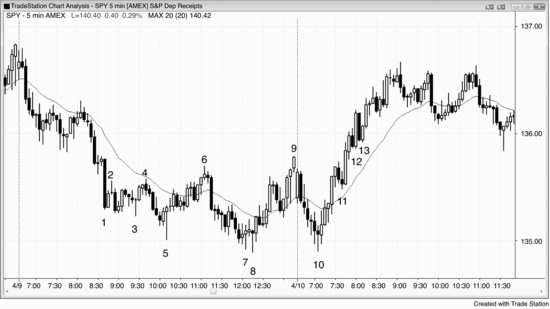
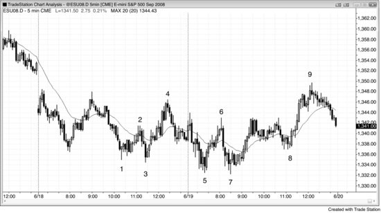

# 第 6 章：扩散三角形

<!-- Source PDF pages 202–206 -->

<!-- PDF page 202 -->

第 6 章
扩散三角形
扩散三角形可以是反转形态也可以是延续形态，由至少五次摆动组成（有时七次，极少九次），每一次都大于前一次。其部分强度来自它在每一次新突破上困住交易者。由于它是三角形，它是震荡区间，而震荡区间中多数突破尝试会失败。这种倾向导致了扩散三角形。在多头反转（扩散三角形底部）中，它有足够强度反弹到最后一个更高高点之上，把多头困在里面；然后崩落到第三个低点，在更低低点把多头困在外面、空头困在里面，然后反转向上，迫使双方追市场向上。新低是第三次向下推动，可被看作一种三推形态，也可被看作突破回撤——市场突破了最后一个摆动高点之上，然后回撤到更低低点。在空头反转（扩散三角形顶部）中，它做相反的事。空头被更低低点困在里面然后被迫出局，多头被更高高点困在里面，然后双方都不得不在市场最后一次反转向下时追市场。初始目标是突破三角形的另一侧，市场在那里常试图再次反转。若它成功，则反转失败，形态成为原趋势中的延续形态。
例如，若多头趋势中有扩散三角形顶部（反转形态），第一个目标是形态下方的突破；在多数情况下，交易就到此为止。若突破成功，向下反转的下一个目标是约等于三角形中最后一段向上高度的等幅运动。若突破失败且市场反转向上，则三角形成为延续形态，在此情况下会是扩散三角形多头旗形，因为它是多头趋势中的三角形。初始目标会是新高，通常交易也大约到此为止。若突破成功，下一个目标是约等于三角形中最后一段向下大小的向上等幅运动。若突破失败且市场转向下，它现在是有七段而不是原来五段的更大扩散三角形顶部。在某个时点，要么突破成功且市场做出近似等幅运动，要么三角形演化为更大的震荡区间。
“三角形”这一术语有误导性，因为该形态常常看起来 <!-- PDF page 203 --> 一点也不像三角形。关键点是：它是一系列逐步更大的更高高点与更低低点，持续困住突破交易者，在某个时点他们认输，然后所有交易者都在同一边，形成趋势。它有三次推动，可被看作三推反转形态的变体，但回撤很深。例如，在空头趋势底部的多头反转中，两次回撤都形成更高高点；然而，在传统三推形态如楔形底部（指向下的收缩三角形）中，两次回撤会形成更低高点（即不是扩散形态）。
所有扩散三角形都是主要趋势反转的变体，因为最后的反转总是跟随强段。例如，在扩散三角形底部中，从最终低点的反弹跟随一次强到足以到先前摆动高点之上的反弹，而那次反弹总是突破某条显著空头趋势线。至少，从第二次向下推动的反弹突破了包含第二次向下段的空头趋势线，因此第三次向下推动是更低低点主要趋势反转买入形态。到第一或第二段的反弹通常也突破其他主要空头趋势线。
图 6.1 Emini 中的扩散三角形底部

空头趋势中的扩散三角形底部常在稍后试图成为扩散三角形空头旗形。在图 6.1 中，Emini 从 K 线 6 缺口回撤测试移动平均线与昨日收盘的开盘反转向上运行。昨日在 K 线 5 的低点与 K 线 1、2、3、4 形成扩散三角形底部。这是反转形态，因为三角形之前趋势向下。第一个目标是新的摆动高点，在 K 线 7 达到。然后市场通常试图形成扩散三角形空头旗形，那是 <!-- PDF page 204 --> 延续形态，因为它是空头趋势中的震荡区间。它在 K 线 7 对多头趋势通道线的超调处做到了（三角形由 K 线 2、3、4、5 与 7 形成）。在趋势通道线失败突破之后，尤其当有扩散三角形时，通常有两段向下运动。顺便说一句，扩散三角形不必有完美形状，也不必触及趋势通道线（K 线 5 未触及）。
到 K 线 7 的反弹非常强，但在这些情况下，震荡区间顶部的 Low 2 做空仍值得去做。K 线 8 是连续第二根十字星，十字星代表空头与多头之间的均衡。由于他们处于平衡，该平衡点常是向下运动的中点，是市场在寻找足够买盘力量把市场转回向上时可能再走多远的粗略指引。目标在 K 线 9 被击中，但市场直到超调空头趋势通道线并在 K 线 10 楔形多头旗形信号 K 线处反转向上之后才反弹。K 线 10 也精确到 tick 地测试了 K 线 6 信号 K 线上方的原始做多入场（完美的突破回测）。
图 6.2 扩散三角形底部反转

在扩散三角形反转形态中，低点不断更低，高点不断更高。典型地，反转前有五次转折，但有时有七次，如图 6.2 中呈现的 5 分钟 SPY 图。通常对每一段都有有效理由做剥头皮（例如，每一段都是震荡区间中的新摆动高点或低点），但一旦第五段完成，可能发展出更大趋势，明智的做法是波段持有部分仓位。此外，一旦形态完成，它通常会设置相反方向的扩散三角形形态。若第一个是反转形态，则该形态的下一部分（将在相反方向），若发展出来，将是 <!-- PDF page 205 --> 延续形态，反之亦然。
K 线 5 是第五段（K 线 1 是第一段），因此是至少两段向上的买入形态。然而，K 线 6 是失败突破做空形态与小楔形（它是 K 线 5 向上尖峰之后通道中三次小推动中的第三次）。这创建了扩散三角形空头旗形，其中五次摆动的第一次是 K 线 2。
第七段在 K 线 8 有第二次入场。K 线 7 是新低处的第一个形态，但它失败了，正如所预期的，因为入场在铁丝网形态中，多数交易者会等待第二次信号。K 线 8 也是从 K 线 6 向下尖峰之后小空头通道中的 High 3 买入形态，第三次向下推动常标志着尖峰与通道空头趋势形态的结束。
K 线 10 测试了 K 线 8 低点，但其低点高一个 tick。它类似于扩散三角形的第九段（在交易中，类似通常就够了）。作为对昨日低点的双底测试以及震荡区间底部的 High 2 买入形态，它是好的开盘反转买入形态。
K 线 11 是突破开盘高点的突破回撤，尽管它没有突破三角形的 K 线 9 高点。它是可能的新多头趋势中强五根多头尖峰之后的 High 1 做多，因此是可靠的买入形态。
K 线 12 是震荡区间顶部的 Low 2（扩散三角形是震荡区间），以及这张 SPY 图上一个 tick 的空头突破失败。然而，Emini 图（未显示）守在反转 K 线低点之上，没有触发该形态。Emini 给出更少假信号，因为每个 tick 相当于 SPY 中的 2.5 个 tick。由于向上动能足够强，多头趋势可能正在进行，交易者应等待看是否形成更低高点再考虑做空。
K 线 13 是 K 线 9 之上突破失败做空的第二次入场，但同样，反弹早期没有趋势线突破，因此在没有一些更早空头强度的情况下做空是不明智的。空头应等待更低高点再做空。
K 线 12 与 13 不是突破失败，而是新多头趋势中的突破回撤。
图 6.3 扩散三角形反转中的第二次入场

<!-- PDF page 206 -->

如图 6.3 所示，K 线 1 到 5 创建了扩散三角形底部的五段。入场是在 K 线 5 更低低点上方一个 tick。K 线 6 在跌到新低之前未能突破 K 线 4 的高点。K 线 7 是扩散三角形的第二次机会入场，但 K 线 5 与 7 之间有这么多 K 线，三角形已失去其影响，这已成为当天新低处的双底反转。
K 线 8 形成了更高低点，也是来自 K 线 5 与 7 双底的双底回撤做多。
在达到新摆动高点的目标之后，K 线 9 设置了扩散三角形空头旗形（K 线 2、3、4、7 与 9），这笔做空的目标是 K 线 7 低点之下。然而最终，这些不断变大的三角形中有一个会失败，趋势开始。顺便说一句，市场在次日开盘跳空到 K 线 7 之下，达到了目标。比例性不好，因为 K 线 4 与 9 之间的间距比 K 线 2 与 4 之间大得多。当形状如此非常规时，更少交易者会信任它，这削弱了形态。然而，交易者仍把 K 线 9 看作空头震荡区间顶部、与昨日高点形成的双顶空头旗形，以及对昨日高点之上缺口的测试，那些理由就足以做空。
