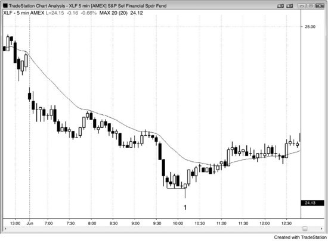
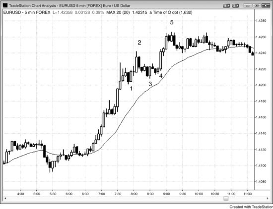
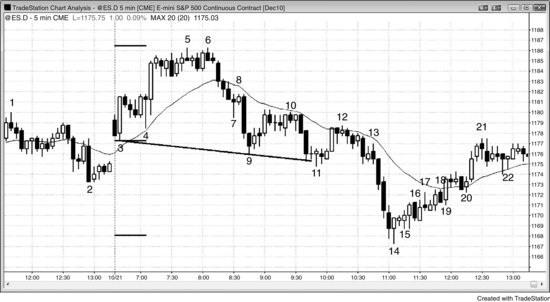
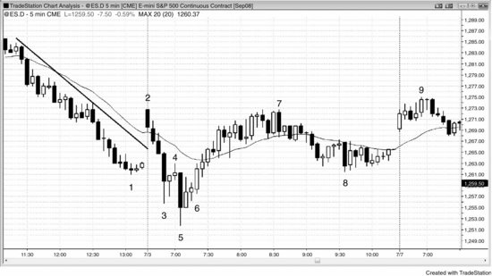
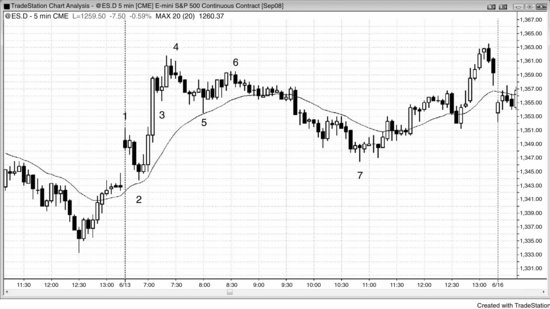
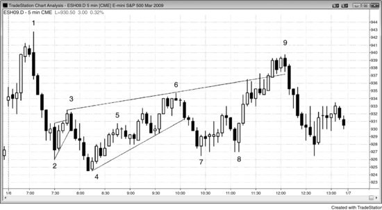
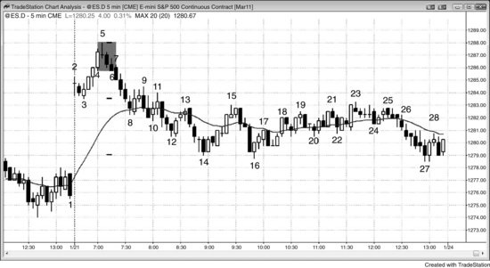
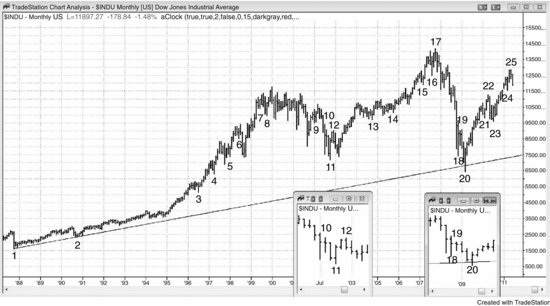

# 第 7 章：最后旗形

<!-- Source PDF pages 207–230 -->

<!-- PDF page 207 -->

第 7 章
最后旗形
一旦趋势结束，交易者可以看图并看到趋势中的最后旗形。最后旗形反转很常见，因为每一次反转都跟随某种旗形，因此是一种最后旗形反转。若交易者理解什么使旗形很可能是趋势反转前的最后一个，他就有条件预期并交易趋势反转。
以下是最后旗形中常见的几个特征：
旗形发生在已进行数十根K线的趋势中；因此趋势交易者可能开始止盈，逆势交易者可能变得更激进。两者都会相信趋势已过度，因此容易有更大的两段式调整并演化成更大震荡区间甚至反转。
旗形主要横盘，有强双边交易的信号，如几根相反方向的趋势K线、有显著影线的K线、几次反转，以及与前一根至少重叠 50% 的K线。第二册第四部分关于震荡区间给出更多双边交易信号。
微型趋势线突破回撤是单K线或微型最后旗形。例如，当有突破空头微型趋势线上方且市场向下反转时，那一或两K线突破常常成为微型空头趋势中的最后空头旗形。若抛售在一两根K线内失败，然后市场从更低低点、双底或更高低点反转回上，这最后一次抛售是突破回撤，原始小突破成为微型空头趋势中的最后旗形。若在突破最后旗形后有反转，但只回撤几根K线然后趋势恢复，回撤已成为持续趋势中的突破回撤而不是反转，最后旗形未能反转市场。
最后旗形有时短暂反转，只为形成更大旗形，它可以突破或反转。你通常能在演化发生前从最后旗形反转入场获得剥头皮利润，演化的形态通常会导致任一方向的另一个信号。

<!-- PDF page 208 -->

有时会有两个连续横盘旗形，第二个更小，从第二个的突破可导致楔形反转。
若最后旗形在高潮后形成，失败突破可能不超过先前趋势极值。例如，若有空头高潮然后低点上方的横盘震荡区间，这可以成为最后旗形，突破在更高低点或更低低点后反转向上。
有时最后旗形可以只有一或两根K线长，在由几根异常大趋势K线构成的强尖峰后发展（潜在衰竭高潮）。从那个小旗形的突破常常在一两根K线后反转，通常导致持续 10 根或更多K线的两段式回撤。这是可交易的逆势形态，但不可靠地导致趋势反转。那些大型趋势K线展示的强动量常常在 10 到 20 根K线内随后有对趋势极值的测试。单K线最后旗形可以是任何类型的停顿K线。例如，若市场刚有两次连续卖盘高潮，下一根是多头十字星，即便其低点在卖盘高潮低点下方，十字星可以成为空头趋势中的最后旗形。若接下来一两根是大型空头尖峰然后市场反转向上，停顿K线是单K线最后旗形。
紧震荡区间常常成为最后旗形。任何横盘交易都有磁吸力。由于突破通常失败，市场通常被吸回区间，多头与空头都同意有价值。有时没有突破，最后旗形只是成长为新趋势。这常常作为连续高潮后的反转发生。
交易者看到市场过度并预期很快调整，但认为突破会走得足够远再做一次剥头皮。他们因此在潜在最后旗形的突破入场，但寻找入场后很快出场，而不是愿意持有做波段。人人都在寻找小利润，突破快速反转。
当你看任何有趋势反转的图表时，你看到趋势由一系列尖峰与回撤构成，回撤是旗形。若你研究那个趋势中的最后旗形，你会发现它给出了线索：趋势即将结束并成为要么震荡区间要么相反趋势。

<!-- PDF page 209 -->

震荡区间可以有持久腿并看起来像趋势反转，但通常在更高时间框架图上只成为大回撤。然而，那些腿通常足够大做盈利波段交易。交易者不确定反转会是新趋势还是大调整，他们以同样方式交易两者。他们在第一或第二段后部分或全部止盈，并寻找在回撤上加仓。若有原始趋势方向的强运动，他们可能持有仓位测试旧趋势极值。
每一个回撤都有双边交易，但当回撤主要横盘、有许多大幅重叠的K线、区间内有几次反转、有几根实体方向与趋势相反的K线时，双边交易特别明显。最后旗形可以是任何规模的震荡区间，包括仅单根K线，尽管它通常至少有五到 10 根K线。双边交易意味着多头与空头都同意在这个水平启动交易有价值。空头激进做空，因为他们相信震荡区间会向下突破，多头激进买入，因为他们相信突破会向上。每当价格漂移到震荡区间顶部或突破区间顶部并跑几根K线时，空头把它视为甚至更好的价值，他们做空更强。多头把区间顶部视为略贵，买入更少。这导致空头能够把价格推回下。当它到达区间底部或有向下突破时，发生相反的事，多头认为价值甚至更好，但空头认为它变得太低无法沉重做空。这使市场回升到区间中部。同样的过程在所有震荡区间中发生，包括多头与空头旗形，结果是这些震荡区间中部有磁吸效应，多数突破尝试在市场被吸回震荡区间之前走不远。
当它在趋势已进行几十根K线后发展时，它常常成为趋势中的最后旗形。在突破后，顺势交易者对止盈更感兴趣，等待深调整再再次入场，逆势交易者会 fade 趋势恢复尝试，因为他们预期至少两段式调整。例如，若有多头趋势已进行数十根K线，可能准备更大调整甚至反转，交易者会观察它是否形成主要横盘的多头旗形。由于多头趋势仍在生效，交易者愿意买入突破，但只寻找剥头皮，不是波段。在旗形期间做空的空头会买回其空单。他们的买入促成上行走动，但他们急于在市场到达某个阻力位时再次做空，那可能是固定 tick 数——他们认为多头会在那里剥头皮平多——或某个等幅 <!-- PDF page 210 --> 运动目标。多头在入场后很快为小利润平多。激进空头看到与多头同样的事，开始正好在多头卖出的地方卖出。多头与空头都预期更低价格，没有人留下买入，市场向下反转，至少剥头皮。若下行走动强，多头不愿买入，空头不急于止盈，直到有信号表明调整在结束。反转可导致回撤、更大调整（如震荡区间）或趋势反转。
如第 3 章关于双底与双顶更早讨论的，最后旗形由同样的基本行为造成。例如，若多头趋势中有潜在最后旗形，旗形形成前有上推。旗形的向上突破是对那个多头高点的测试。若在市场向上测试时卖家多于买家进来，市场会从这第二段上推向下反转。虽然潜在力量相同，最后旗形看起来足够不同并有几个独特属性，值得被分类为单独形态。空头趋势中的最后旗形也一样，只是一对下行走动然后向上反转。最后旗形的空头突破是第二段下行走动，是对停顿创造最后旗形的空头趋势力量的测试。
许多多头与空头会在多头旗形的多头突破后很快卖出，若足够多，市场会开始反转。若发展出空头反转形态，交易者会更确信更大调整会跟随；更多多头会平多，更多空头会开始做空。若反转通过运动到空头反转K线下方一个 tick 触发，市场会被吸回那个最后旗形。它可能停在那里，但市场通常形成至少两段横盘到向下的调整，常常趋势反转。若旗形中或更早有强空头腿（卖盘压力信号）远跌破多头趋势线，趋势反转更可能。若原始趋势持续 50 到 100 根K线，则反转更可能演化成大型旗形而不是相反方向的趋势。记住，趋势有巨大惯性，倾向于抵抗所有反转尝试。然而，每一次反转往往比前一次更大，最终一个会成功把趋势反转入相反趋势。
持久高潮常常在短暂最后旗形突破后结束。例如，若有强四K线多头尖峰，若实体大且第四根异常大，它常常导致短暂卖出，因为交易者会把尖峰视为潜在买盘高潮。多头与空头都等待像这样的大K线。多头会用力量作为在非常高价部分 <!-- PDF page 211 --> 止盈的机会，激进空头会卖出启动空头剥头皮。结果常常是回撤。然而，由于多头尖峰如此强，通常在前一根低点及下方有强买入。多头在买入以重建其全部多单，空头在买回其空头剥头皮。结果是回撤只持续一到几根K线，成为 High 1 或 2 买入形态。多头会在前一根高点上方买入，许多人也会在市场突破原始多头尖峰顶部上方时买入。
由于旗形跟随可能走得太远、太快的强多头尖峰，许多交易者会把多头旗形突破仅视为剥头皮。他们会快速拿走剥头皮利润。他们的止盈，加上激进空头的做空，可以在多头旗形的一或两K线突破后快速把市场转回下。这个短暂突破常常由一根或更多强多头趋势K线构成，因此是另一个潜在买盘高潮。若足够多交易者把这视为连续买盘高潮（原始多头尖峰是第一个），许多人只会在形成至少两段并持续约 10 根K线的回撤后再寻找买入。许多人会做空，预期更大回撤。若向下反转发生在显著阻力位，许多交易者会把上行走动仅视为对阻力位的买盘真空测试，并对趋势反转的可能持开放态度。他们会观察下行走动的力量。若它慢且弱，交易者会预期它成为回撤，会寻找多头趋势不久恢复。若它有许多空头实体，他们不会急于买入，市场然后必须探测更低寻找买家。有时市场会进入空头趋势，这可以发生，即便原始多头尖峰非常强且最后旗形只有单根K线。许多反转发生在第二推后，本质上形成双顶。两个顶部常常在不同价格，形成要么更高高点要么更低高点，但一起像双顶一样行为，应始终被视为同一价格行为的不同表现。
当市场处于强尖峰然后有带影线或相反实体的K线时，交易者常常预期再有一小段最终推动然后回撤。例如，若有强空头尖峰，四根连续大型空头趋势K线多数收在低点附近，许多交易者会在每一根收盘附近做空。若下一根底部有大影线或多头实体，空头趋势完整，但交易者相信回撤迫近。许多人会做空这根的收盘，但只持有做剥头皮，预期交易是尖峰中的最后剥头皮。因为他们把这视为最后剥头皮，他们然后在至少有小回撤之前不会再寻找卖出。没有人愿意在尖峰底部继续卖出，市场会走高寻找 <!-- PDF page 212 --> 足够高让空头再次做空的价格。激进多头知道这一点，会正好在他们认为空头会买回其最后空头剥头皮的尖峰底部买入。多头与空头都在买入，市场走高。上行走动通常至少足够让多头对其多单剥头皮出场，但它可能持续五到 10 根K线。由于它是强空头尖峰中的第一次回撤，上方会有卖家。多头与空头都会在市场越过前一根高点时卖出，并为任何其他小理由卖出，因为双方都确信回撤会短暂的概率高。多头与空头双方的卖出导致至少再一段下推，下行走动甚至可能成为到达等幅运动的通道，基于尖峰高度。在可能性的另一极端，它也可能只是导致向上反转的最后旗形突破。那么那个五K线空头尖峰与最后旗形有何关系？尖峰底部的那个影线或多头K线告诉交易者在回撤前会再有一段下推，它会走得足够低做剥头皮，但市场很可能快速反转向上。这意味着他们把影线或多头实体视为微型最后旗形，它肯定是更小时间框架图上的最后旗形。交易者不必看更小时间框架图来验证这一点，因为他们知道必须如此，否则那个影线或多头实体不会形成。
最后多头旗形有三种突破方式。第一，突破可以足够强越过多头趋势旧高上方，然后市场以更高高点反转向下。或者，突破可以更弱，市场可以以更低高点反转形式在先前高点下方向下反转。最后，可能根本没有多少突破，甚至没有向上突破。例如，多头旗形可能形成 High 2 或 High 3 买入信号，但入场K线在只越过信号K线上方一两个 tick 后向下反转，或它可能只是向下突破而从未越过前一根高点上方。若有多头旗形的向下突破，突破通常是尖峰，然后随后有空头通道延伸某种等幅运动。若没有清晰突破且多头旗形只是继续成长为更大空头通道，在某个点交易者会放弃多头旗形前提，把通道视为空头趋势。当这发生时，通常在开始会至少有单K线空头尖峰。当那根空头趋势K线形成时，有经验的交易者会怀疑它是否足够强导致空头通道，许多人会在先前K线高点上方做空，以防空头趋势发展。多头旗形，即便它从未向上突破，是多头趋势中的最后旗形。
对任何多头旗形，回撤交易者买入并寻找在对趋势极值（最近高点）的测试出场。

<!-- PDF page 213 -->

他们更喜欢在旧高上方止盈，但仔细观察市场是否在其下方停顿。若是，他们快速止盈，只有在有另一个回撤时才再次买入。他们的卖出，以及他们在等待回撤时至少再过几根K线不愿买入，导致更低高点而不是更高高点。因为剥头皮者通常在先前高点及略上方止盈，多头趋势中多数新高找到止盈者而不是新买家。这导致多数新高随后是回撤而不是持久突破与新上行走动。然而，由于多数反转尝试失败，多数新高不会导致反转入空头趋势。反转常常看起来强，但通常随后只是又一个多头旗形。多头会买入回撤，空头会对其空头剥头皮止盈，市场会再次测试高点。最终，一个会是最后多头旗形，随后有更大调整或反转，若有信号表明这会发生，有经验的交易者会做空。
类似地，空头趋势中的最后旗形也可以向下突破并从更低低点或更高低点反转向上，或它可以只是向上突破而从未向下突破。可以有失败 Low 2 或 Low 3 做空然后以大型多头趋势K线形式向上反转。这个多头尖峰成为新多头波段的起点，空头旗形然后会被视为空头趋势中的最后旗形，即便它从未有向下突破。多头突破是交易者相信始终持仓交易已从做空翻转为做多的信号。
若有理由相信空头波段可能在结束，然后它开始形成空头旗形，交易者可能认为从那个空头旗形的 Low 1 或 Low 2 做空入场会失败。若他们预期这个空头旗形不会有显著空头突破，反而认为市场会困住空头然后向上突破，他们可以 fade Low 1 与 Low 2 形态。例如，若震荡日有楔形底部开始向上反转，交易者会预期楔形低点会守住。由于他们相信趋势现在可能向上，他们想买入回撤。回撤可以小到单根K线。由于很可能有两段上涨，第一段下跌不应走远。那个 Low 1 做空应失败并成为新多头腿中的小更高低点回撤，这些多头会预期至少两段式反弹，持续 10 根或更多K线。Low 1 做空可靠的唯一时候是在强空头趋势的尖峰阶段，从不在反转形态之后。那个 Low 1 做空入场很可能不会跌破楔形低点，反而会在两段式向上调整中形成小更高低点。因此， <!-- PDF page 214 --> 交易者会限价在那个做空信号K线低点或下方一到三个 tick 买入，预期形成小更高低点而不是盈利 Low 1 做空。在 Emini 中，他们通常可以只冒四个 tick 风险。随着向上反转继续，他们可能认为可以形成 Low 2 做空形态。然而，由于他们相信趋势已反转入多头趋势，他们预期那个 Low 2 也会失败并随后有更高价格。他们仍处于买入回撤模式，那可以包括像 Low 2 这样的小回撤。这里再次，他们会限价在 Low 2 信号K线低点或下方买入，在 Emini 中冒约四个 tick 风险。他们预期这个空头旗形不会突破超过几个 tick，反而寻找市场继续上行进入多头通道。这是一种最后空头旗形，因为它是空头趋势的最后旗形。空头把它想成空头旗形，但只能把它跌破空头信号K线下方一两个 tick，然后旗形继续向右上方成长，直到交易者意识到它现在是多头通道。在某个点，当足够多交易者意识到正在发生的事时，空头平仓，通常会有向上突破然后等幅上行。
一旦空头相信市场已到达震荡区间顶部，或多头趋势正在向下反转过程中，他们会寻找 High 1 与 High 2 信号K线，限价在那些K线高点或略上方做空。他们在寻找卖出反弹，即便像 High 1 或 High 2 这样非常小的。多头会寻找在震荡区间底部与空头趋势底部买入 Low 1 与 Low 2 入场，当他们觉得市场正在反转入多头波段过程中时。
若 High 2 很可能失败，它为何会首先触发？它触发是因为空头在寻找在K线上方做空，而不是刚好在K线高点下方。他们限价在前一根高点及上方做空。相对缺乏愿意刚好在K线高点下方做空的空头，多头无人反对，能够把市场推到前一根高点上方，希望大量多头在买入止损入场。K线高点充当磁铁，越过K线上方的推动是微型买盘真空。多头发现有压倒性数量的空头在那里等待做空，有大量在更低处买入的多头在那里止盈。结果是 High 2 触发，但市场立即转下。在过去几个 tick 买入的那些多头快速看到前一根高点上方缺乏反弹。因为市场没有做他们预期的事，他们出场，至少几根K线内不再寻找买入。他们平多的卖出促成抛售。
若最后旗形反转触发但反转在几根K线内失败， <!-- PDF page 215 --> 这成为失败的最后旗形。失败的最后旗形是原始趋势恢复的形态，因此是突破回撤。在市场突破潜在最后旗形后，它试图反转，但反而只回撤一点，然后趋势恢复而不是反转。例如，若市场处于多头趋势并有潜在最后多头旗形向上突破然后开始向下反转，但做空入场K线快速成为强多头反转K线，这是突破回撤做多形态。那个多头反转K线是潜在最后旗形突破的回撤，若多头趋势走得足够远，它会越过最后旗形的磁吸，交易者会寻找其他形态。若反弹只走一两根K线并再次向下反转，它从原始潜在最后旗形设定第二次做空入场。若反转成功，它是最后旗形反转。若它失败且市场再次转上，市场很可能处于多头通道，通道可以持续许多根K线。
图 7.1 最后旗形反转

在空头趋势已进行很久后形成的卖盘高潮常常随后有最后旗形反转与至少两段式反弹。在图 7.1 中，bar 1 结束了从开盘的两段下跌，因此是可能的日低。它突破了持久运动后的横盘空头旗形，因此这可能是最后旗形，可能导致向上反转。Bar 1 是好反转K线，触发最后旗形做多，使交易者预期至少两段上涨。一些最好的反转发生在从反转的第一段上涨延伸到最后旗形之外时，如此处。然后常常有旧空头旗形上方的横盘旗形，然后新多头趋势继续。有时有短暂回撤进入旧空头旗形，其他时候新多头腿中甚至没有停顿，它在由一系列多头趋势K线构成的强尖峰中飞升更高。当你看到这种类型的反转时，重要的是波段持有部分或全部仓位，因为概率很好你可能获得暴利。
从约太平洋时间上午 7:30 到约 9:30 的震荡区间有两小时双边、横盘交易，是更大的最后旗形。双边交易施加磁吸力，倾向于在突破后把市场吸回那个水平。
Bar 1 后的入场K线收在前六根高点与前七根收盘上方，因此反转了许多高点与收盘。在那些K线期间做空的交易者要么必须平空，要么持有亏损仓位，他们很快很可能带亏损平仓。此外，他们至少几根K线内不会再寻找做空，多数会等待至少两段式反弹再考虑再次做空。这使市场单边，通常导致至少有 10 根K线与两段的反弹。

<!-- PDF page 216 -->

图 7.2 紧震荡区间作为最后旗形

反弹后的紧震荡区间常常成为最后多头旗形。在图 7.2 中，bar 4 开盘上方的突破有力量，导致紧震荡区间的形成。这里，旗形的强突破在 bar 7 结束，那是两段式上行走动（bar 5 是第一段），与楔形顶部（当日第一根是第一段上推，bar 4 是第二段）。从旗形的两段式运动常常设定通常至少有两段的主要反转。跌到 bar 10 的运动是两段，但它只有单根逆势K线（bar 9），意味着它很可能只是两个更大腿中的第一段。当两段式运动处于紧通道时，整个通道通常成为第一段。无论如何，若做空交易者不确定，他们可以在跌到移动平均线的 bar 10 运动后把止损移到保本。
Bar 9 越过小多头十字星K线高点上方触发 High 1 买入，但有经验的交易者在买盘高潮与最后旗形顶部后预期它失败。Bar 8 与随后两根成为更小最后旗形，bar 9 是三K线最后旗形的更低高点失败突破。有微型买盘真空把市场吸到那个 High 1 信号K线上方一两个 tick。强空头预期 High 1 会失败，等待看他们是否有机会在信号K线高点或上方做空。因此许多人在市场比K线高点低一两个 tick 时停止做空，这种不愿卖出的交易者的缺席把市场吸高寻找空头。一旦市场到达他们的目标（在 High 1 信号K线高点及略上方），空头激进做空并压倒多头，把市场推下。在 High 1 信号K线高点及略上方买入的多头立即看到市场停顿并在反转，因此他们平多，帮助把市场推下。他们变得确信短期顶部已形成，至少几根K线内不会考虑再次买入。没有买家留下，市场快速跌到移动平均线的支撑与最后旗形中部（始于 bar 4 的震荡区间），空头会在那里买回部分空单，多头会开始再次买入。由于抛售强，买家很少，市场无法反弹。这些买家快速成为卖家（多头平掉新多单，空头再次做空），市场进一步下跌寻找足够低以吸引买家的价格。

<!-- PDF page 217 -->

Bar 10 与其后的K线在移动平均线形成两K线反转 High 2 买入信号。有经验的交易者不会买入这个 High 2，因为它跟随四根强空头K线（微型通道）。Bar 11 是 High 2 多头旗形失败突破的信号K线。这是常见情况。有些多头把从 bar 7 高点到移动平均线的回撤视为多头旗形。然而，一旦市场跌破 bar 10，多头放弃那个想法，认定市场很可能等幅下跌并有两段，再形成另一个买入形态。两K线空头尖峰（bar 11 与下一根）随后有空头通道。事后看，bar 4 震荡区间变成从 bar 1 多头上行走动中的最后旗形，但聪明交易者会预期这种可能并波段持有部分空单。Bar 9 前的K线也是最后多头旗形，以及 bar 10 后两根触发的 High 2。
Bar 2 的 Low 2 更低高点是类似情况。空头把它视为从开盘抛售中的空头旗形、可能的更低高点与空头趋势起点，以及至少是可能震荡区间的顶部。一旦做空触发然后市场反弹到 bar 2 高点上方，空头知道他们的前提是错的。空头旗形失败，空头预期会持续至少两段并到达大约等幅上行的反弹。
Bar 7 也是当日第三段上推，其中当日第一根是跳空尖峰上行，bar 4 是在 bar 7 结束的楔形通道中的第二推。
当 bar 9 越过其前多头K线上方时，市场在试图创造失败的最后旗形，那是突破回撤买入形态。然而，由于这个潜在做多的信号K线与前三根中的两根有显著影线，做空者会保持保护性止损在 bar 8 信号K线高点上方，直到市场下跌。一旦强 bar 9 空头趋势K线收盘，他们会把止损移到其高点上方。这是弱势 High 1 买入形态，很可能失败，因此不是买入形态。多数交易者会在其高点或上方做空，这里明显发生了。他们不会做多，也不会平空。
Bar 12 是微型最后旗形的例子。交易者在尖峰下跌中做空空头K线的收盘，但 bar 12 前的K线有大影线。这提醒交易者小回撤可能迫近。激进空头做空那根的收盘，但只预期剥头皮然后回撤。他们在入场后的K线上买回盈利剥头皮，他们的买入创造了 bar 12 反转K线。激进多头理解正在发生的事，因此在他们认为空头会买回其空头剥头皮的地方买入。多头只寻找向上剥头皮。空头波段交易者也预期回撤，因此买回部分仓位止盈。所有有大浮盈的交易者一路部分止盈，他们通常在预期小回撤形成的地方这样做。他们的买入促成回撤。当多头平掉其多头剥头皮、空头在回撤顶部做空时，市场如预期再次抛售。V 底罕见，因此人人急于卖出，知道至少再有一段下推的概率高。交易者限价在前一根高点上方卖出，并在前一根低点下方止损卖出。在每一个其他时间框架与每一种其他类型图表上也有卖出理由。其他交易者做空 bar 12 后四根触发的 Low 2（有些在多头K线下方做空，其他人在两K线空头反转下方做空）。不切实际希望有更大反弹的早期多头在 Low 2 平多，至少再过几根下跌K线不愿再次买入。没有人寻找买入，市场快速下跌几根K线。

<!-- PDF page 218 -->

图 7.3 三角形作为最后旗形

当多头动量异常强时，更好只寻找买入形态，不寻找做空，直到有空头的某种显著力量信号之后。
如图 7.3 所示，欧元/美元外汇在 bar 2 有最后旗形做空形态，但上行动量强，旗形只有四根K线长；它因此没有突破显著多头趋势线。那单根空头趋势K线不足以否定那么多上行动量，很可能市场会横盘调整然后反弹到新高。这很可能未能反转市场，反而只成为 bar 1 两K线反转上方突破的回撤。当最后旗形形态未能反转市场时，它成为失败的最后旗形，那是突破回撤形态。这就是这里发生的。Bar 1 潜在最后旗形在 bar 2 两K线反转有反转信号。反转入场触发，但市场没有跌远。相反，它横盘并形成另一个买入形态，这使 bar 3 上方买入成为失败最后旗形形态的入场。市场突破 bar 1 旗形上方，回撤，然后再次向上突破。
Bar 3 两K线反转设定 High 2 做多与与 bar 1 的双底，这些是在强多头趋势中买入的足够理由。保守交易者把 bar 3 视为从 bar 2 向下小通道的一部分，他们会在 bar 3 两K线多头反转前后K线形成的小双顶空头旗形上方买入。Bar 3 上方的突破弱，市场回撤到小更高低点。这是突破回撤形态，并把形态变成楔形多头旗形，其中 bars 1 与 3 是前两段下推，以及三角形（一旦有第三段下推，震荡区间是三角形）。三角形是横盘的，它在持久反弹后形成。它可能有足够双边交易生成足够磁吸力把任何突破吸回震荡区间。有些交易者把 bar 4 视为 bar 3 多头趋势K线与下一根 High 2 入场的突破回撤。这个多头旗形是潜在最后旗形，bar 5 是反转形态。它是第三段上推与单K线回撤的突破，那是单K线最后旗形。然而，上行动量仍如此强，横盘调整比反转更可能。市场进入紧震荡区间，然后可以再次向上突破或向下反转。若它向上突破，紧震荡区间可能成为最后旗形。

<!-- PDF page 221 -->

图 7.4 最后旗形，然后更低高点

有时最后旗形突破在更低高点而不是更高高点反转。在图 7.4 中，到 bar 2 的反弹强且抛物线，因此很可能随后至少有两段式回撤（多头趋势中的回撤可以横盘或向下），持续至少 10 根K线。它在移动平均线上方形成横盘震荡区间，从中在 bar 3 突破。然而，突破失败，市场以两K线反转向下。Bar 3 突破是更低高点而不是更高高点，但它仍是多头趋势中的最后旗形。交易者会在两K线反转下方做空。Bar 3 也是与跟随 bar 2 的小更低高点的双顶空头旗形。Bar 2 未能越过开盘高点，bar 3 是第二次失败尝试突破到日新高。当市场两次尝试做某事并两次失败时，它通常朝相反方向趋势。
开盘有巨大两K线卖出尖峰然后多头K线。任何趋势K线或一系列趋势K线形成突破、尖峰、缺口与高潮。这个初始卖盘高潮随后在 bar 1 有第二次。连续卖盘高潮常常导致持久调整，有时反转，如此处。跌到 bar 1 的抛售中的最后旗形是 bar 1 前形成的那个单K线停顿。这根K线成为抛售中的单K线最后旗形；即便它是多头反转K线且其低点在其前巨大两K线空头尖峰低点下方，它是空头趋势中的停顿，因此是空头旗形。像这样自由落体市场中的连续卖盘高潮常常有一或两K线最后旗形，随后有大调整甚至反转。知道连续卖盘高潮通常导致大回撤的交易者，在看到那个单K线停顿后愿意在日低买入向上反转。没有人留下在低点卖出。剩余空头只会在至少 10 根K线反弹后的回撤卖出。Bar 1 中断了卖出，把它变成两次单独卖盘高潮而不是单次高潮。若它不在那里，卖出很可能在 bar 1 后继续，至少一两根K线。许多空头会在 bar 1 收盘买回其空单，预期反弹到他们会考虑再次做空的水平。激进多头会在 bar 1 收盘做多，风险大约与 bar 1 高度相同的 tick 数，寻找对 bar 1 高点的测试然后可能基于 bar 1 高度的等幅上行。Bar 1 有 93,000 张合约，约是过去几天安静K线平均成交量的 10 倍，因此支持尖峰与高潮类型的向上反转。尖峰与通道趋势的尖峰与高潮变体在第一册讨论。有向下尖峰、停顿，然后另一次卖盘高潮（bar 1），在尖峰与通道形态中像单K线通道一样作用。

<!-- PDF page 222 -->

Bar 1 后的横盘震荡区间也是最后旗形，尽管它从未向下突破。在卖盘高潮后，市场常常形成可以横盘或处于多头通道的空头旗形，有时会有 Low 1 或 Low 2 做空形态如此处，但没有跟随，因此没有空头突破。相反，空头旗形向上突破，这是趋势反转的常见方式。十字星信号K线在连续卖盘高潮后对做空是弱势信号K线，激进交易者会在其低点或下方买入。由于它是最后空头旗形，它是一种最后旗形。它也是从单K线最后旗形的向上反转，那是大型 bar 1 卖盘高潮前的多头反转K线。太平洋时间上午 8:05 空头旗形上方的多头趋势K线突破完成了反转。
图 7.5 最后旗形有时在先突破前就反转

有时最后旗形不突破，反而只是继续回撤，最终成为相反方向的趋势。如图 7.5 所示，有尖峰与高潮跌到 bar 14，bar 14 是强多头反转K线。有些交易者把尖峰视为始于 bar 6 终于 bar 9，而其他人认为 bar 9 与其前空头K线形成重要尖峰，或 bar 10 后两根形成的两K线尖峰重要。所有空头尖峰都是卖盘压力的重要信号，哪个可能是主要促成跌到 bar 14 的高潮抛售的尖峰（尖峰与高潮类型的尖峰与通道空头趋势）不重要。然后在到 bar 14 的抛物线运动中有三段下推（bars 9 与 11 是前两段）。这常常导致持久反弹，但反弹通常以多头通道开始，如此处。多头通道是空头旗形。
Bar 15 是 Low 1，聪明交易者会预期那个做空失败。

<!-- PDF page 223 -->

事实上，他们会预期 Low 2 失败与楔形空头旗形失败，与所有通道一样，他们会在前一根低点或下方买入。机构不会在通道中K线低点下方卖出，因为那不是他们做的事。我怎么能确定？因为若他们做，市场会下跌，但既然它在上涨，他们必须在买入。在某个点，人人意识到这个空头旗形永远不会向下突破，空头最终买回其空单，有些在失败 Low 2 后，其他人在失败楔形空头旗形后。结果是向上突破，这里发生在 bar 19 多头趋势K线以及 bar 20 上方。
多头把 bars 3、9 与 11 视为形成楔形多头旗形，当市场跌破 bar 11 时，楔形失败，市场崩塌。空头突破只有一段，因为形态演化成尖峰与高潮底部。
始于 bar 14 的四根连续多头趋势K线显示买盘压力。第四根是失败 Low 1 上方的突破。Bar 17 是 Low 2 或 Low 3 形态，不是触发做空，市场两根后向上突破。Bar 18 是楔形空头旗形形态，触发一个 tick，然后市场反转向上并在 bar 19 向上突破。Bar 20 是从移动平均线缺口K线做空的向上反转，它开始由三根多头趋势K线构成的尖峰。与成长中空头旗形中更早的多头突破不同，这个有以连续多头趋势K线形式的跟随。这说服多数交易者市场现在始终做多，他们不再寻找空头旗形的突破。
Bar 12 是多头旗形的起点，跟随从 bar 11 低点的强上行走动。Bar 12 前的空头K线是第一段下推，bar 12 后的两根空头K线形成第二段下推，设定可能的 High 2 多头旗形，可能导致第二段上涨。下一根是多头K线，因此是两K线反转买入信号，但不是向上突破做第二段上涨，市场以强空头趋势K线向下突破。那根K线使多头放弃其前提，他们然后至少再过几根K线不会再寻找买入。Bar 13 是多头旗形空头突破的回撤，它是暴跌到 bar 14 抛物线楔形反转的起点（bars 9、11 与 14 是三段下推）。
当空头旗形向上突破时，如 bar 19，多头需要收在旗形顶部上方至少几个 tick 的多头趋势K线，使空头放弃反弹只是空头中回撤的前提。类似地，当多头旗形向下突破时，交易者想看到收在旗形底部下方几个 tick 的强空头趋势K线， <!-- PDF page 224 --> 如 bar 13 前两根形成的空头趋势K线。交易者看到 High 2 多头旗形在设定，但一旦那根空头趋势K线收在旗形远下方，交易者假定多头前提不再有效，市场很可能至少两小段下跌。
图 7.6 多头最后旗形的空头突破

有时交易者想买入多头旗形，但买入形态从未触发，市场反而向下突破。如图 7.6 所示，有强上推到 bar 20，当市场开始回撤时，交易者在寻找买入形态，因为概率有利于在如此强的多头尖峰后至少测试高点。然而，市场从未突破跌到 bar 22 的微型通道上方，反而在 bar 23 向下突破。这使从 bar 20 到 bar 22 的运动成为多头趋势的最后旗形，即便它从未有多头突破。一旦大型 bar 23 空头趋势K线形成，多头放弃应至少再有一段上推的信念，反而寻找至少基于旗形高度的等幅下跌。空头也看到空头突破并预期同样的事。由于接下来下行几没有人买入，市场快速跌入收盘。随着市场下跌，回撤的缺席触发动量卖出程序，促成抛售的力量。
一旦强多头尖峰有顶部大影线或空头实体的K线，交易者通常可以买入收盘做最后一次剥头皮，然后市场调整。Bar 20 前的K线顶部有大影线，敏锐交易者怀疑它是否是市场可能很快回撤的信号。由于 bar 20 也是从 bar 14 低点的第三段上推，交易者怀疑它可能是高潮顶部。然而，若市场在回撤期间创造合理买入形态，他们会在信号K线上方放置买入止损以确保做多。市场从未交易到任何先前K线高点上方，想在前一根高点上方买入止损入场的多头从未被止损入场进入多单。
Bars 15、17 与 20 形成抛物线楔形顶部，是一种买盘高潮。

<!-- PDF page 225 -->

图 7.7 小最后旗形与大反转

小最后旗形可以设定开盘反转。在图 7.7 中，bar 3 是巨大空头趋势K线，跟随市场跳空突破空头趋势线上方后的另外三根强空头趋势K线。Bar 2 空头通道上方的突破失败。
Bar 4 是从小空头旗形做空的形态。鉴于到此为止市场的高潮行为与昨日趋势线突破，交易者在寻找这成为最后旗形，在测试 bar 1 空头低点后导致向上反转。
Bar 5 是另一根巨大空头趋势K线，bar 6 是 ii 做多入场，预期至少持续 10 根K线并至少有两段上涨的反弹。Bar 5 约有 105,000 张合约，约是最近安静K线平均成交量的 10 倍，因此支持可能的连续卖盘高潮底部。第二段在次日 bar 9 结束。大型空头趋势K线展示的下行动量力量通常导致交易者在一两天内把市场推下测试低点。虽然未显示，bar 9 高点导致当天晚些时候远跌破 bar 5 低点的抛售。交易者寻找连续卖盘高潮作为买入机会。许多空头在 bar 5 收盘附近买回其空单，激进多头做多。其他人在 bar 6 突破多头 ii 形态上方时买入，预期从昨日低点向上反转的第二次尝试可能是日低。他们可能冒与 bar 5 高度相同的 tick 数风险，或也许两三点。他们的利润目标包括 bar 5 高点、对移动平均线的测试、基于 bar 5 高度的等幅上行，以及日新高。
图 7.8 两K线最后旗形

一或两K线最后旗形可导致大反转，即便在强多头之后。

<!-- PDF page 226 -->

在图 7.8 中，bar 3 是两K线最后旗形后的失败突破，导致向下反转。市场在 bar 4 有强空头尖峰，然后在 bar 5 前的K线是第一段上推的地方反转。
Bar 7 从内包K线反转向上，那根K线是抛售的最后旗形。
图 7.9 小最后旗形通常演化成更大最后旗形

如图 7.9 所示，bar 2 是从其前单K线最后旗形突破的成功做空剥头皮。形态然后成长为在 bar 3 结束的更大楔形空头旗形（另一个最后旗形）。第一段上行是第一个小最后旗形的顶部，那是 bar 2 前的多头内包K线。第二段上行是 bar 2 后的大型内包K线。多头K线顶部有小影线，下一根实体更小。那个影线与更小K线创造了从 bar 2 低点到 bar 2 后多头K线顶部的初始上行走动的停顿。最终上推是到 bar 3。这在更小时间框架图上可能更清晰是楔形，但可以从这里存在的东西推断。其他交易者只把这视为 Low 2 做空，其中 bar 2 是 Low 1 入场K线。
市场在 bar 4 反转向上，形态成长为在 bar 6 结束的更大楔形空头旗形。第一段上推是到 bar 3，接下来两段上行在 bar 5（或其后的摆动高点）与 bar 6 结束。其他交易者把 bar 5 视为第一段上推，bar 6 视为第三段。在 bar 5 结束的小尖峰与通道上行有两个小腿，bar 5 后到 bar 6 的反弹有两个更清晰的腿。
空头楔形的突破导致成功剥头皮，但不是新摆动低点。这个 bar 7 更高低点主要趋势反转被 bar 8 测试，它形成双底多头旗形与更高低点主要趋势反转的第二次入场。随后的反弹创造在 <!-- PDF page 228 --> bar 9 结束的更大空头楔形。前两段上行是 bars 3 与 6 高点。第一段上推 bar 3 后在 bar 4 发展出更低低点无关紧要，因为这是常见楔形变体。
为何坚持把一切看成越来越大的空头旗形？因为它们在那里，市场因此告诉交易者它尚未反转入强多头趋势。多头在 bar 8 双底多头旗形与头肩底上方的突破尝试失败。市场在这个尖峰上行后的通道顶部 bar 9 向下反转，失败也来自刚过从 bar 3 到 bar 6 的趋势通道线上方。这个头肩底做了多数头肩底做的事。它成为空头旗形（这个略微向上倾斜，因此更像楔形而不是三角形）与延续形态，而不是反转形态。市场在次日跌破 bar 4 低点。
图 7.10 最后旗形不必在顺势方向突破

如图 7.10 所示，在跳空与强多头尖峰到 bar 5 后，交易者不确定是否会有开盘向下反转与日高，还是 High 1 多头旗形然后多头通道。他们仔细观察市场从 bar 5 高点回撤。从 bar 5 到 bar 6，交易者认为市场可能在形成多头旗形。然而，bar 7 是大型空头趋势K线，收在最低点并在 bar 4 大型多头趋势K线底部下方。Bar 7 收在其前一根下方许多 tick，因此是尝试形成突破缺口。许多交易者一收盘就做空并在其高点上方放止损，预期市场在翻转为始终做空，很可能有好的跟随卖出。Bar 5 <!-- PDF page 229 --> 可能是日高，若市场跌破 bar 3 日低，它可能等幅下跌。多数交易者在这一点相信 bar 5 是日高的好候选。接下来几根K线的跟随说服交易者市场现在始终做空。他们在寻找跌破开盘区间 bar 3 底部然后大约等幅下跌。Bar 14 是从开盘区间突破的精确等幅下跌，许多空头在那里止盈。
由于交易者把 bar 5 到 bar 6 视为多头旗形，它是反弹的最后旗形，即便从未有向上突破。
Bar 16 是双底或略更低低点主要趋势反转，但随后是震荡区间而不是多头趋势。主要趋势反转更常随后是震荡区间而不是相反方向的趋势。
图 7.11 高潮后的小最后旗形

图 7.11 所示道琼斯工业平均指数月线图在高潮后有许多一和两K线最后旗形。有些导致反转，如 bars 8、12、16 与 19（缩略图显示 bars 12 与 19 的特写），而其他导致回撤，如 bars 5、10（左侧缩略图显示特写）、13 与 21。有些最终只是普通旗形而不是运动中的最后旗形，如 bars 4、15 与 23，有些触发但未能反转市场并成为趋势中的回撤（bars 13 与 21 是失败最后旗形的例子，因为市场在旗形后向下反转，但反转失败，多头趋势在 bars 14 与 23 恢复）。一旦有高潮，然后短暂旗形，然后那个旗形的突破，突破常常足够强成为另一次高潮。连续高潮容易随后有可持续约 10 根K线并约有两段的反转。

<!-- PDF page 230 -->

当它们发生在显著支撑或阻力位时，它们可导致强反转，如 bar 20。当市场跌破 bar 19 时，我告诉许多朋友它可导致强多头反转，因为 bar 18 空头低点下方刚好有 20 年长的多头趋势线。也有 bar 11 低点的支撑，导致双底多头旗形。交易者意识到 bar 25 可能的更低高点，许多人会把它视为潜在头肩顶的右肩。过去几个月我一直告诉朋友 bar 24 可能是反弹的最后旗形。若是，反转应持续约 10 根K线（10 个月）并至少有两段。它应在 bar 22 高点、bar 23 低点、移动平均线（未显示）或 bar 20 低点找到支撑。
