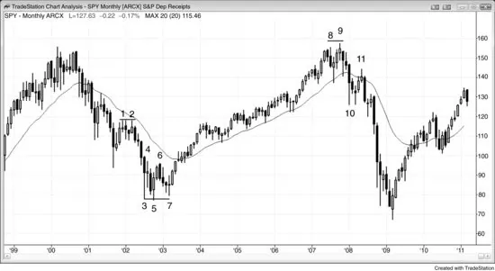
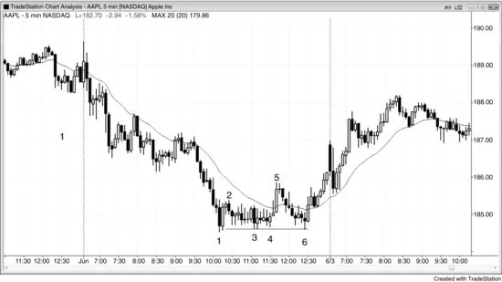
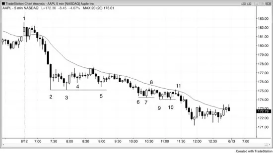
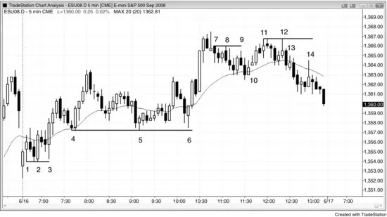

# 第 8 章：双顶与双底回撤

<!-- Source PDF pages 231–237 -->

<!-- PDF page 231 -->

第 8 章
双顶与双底回撤
若市场在抛售后形成双底，且在多头趋势启动之前，然后有一个更高低点回撤，测试刚好在双底低点之上，这是双底回撤做多形态。双底不必精确，第二个底部常略低于第一个，使形态有时也是头肩底。若第二个底部至少没有到达第一个，就有风险底部只是在形成两段式横向到向上的修正，从而使寻找剥头皮做多比波段更好。双底（或双顶）回撤形态可被看作三推底部（或三重底或三角形），其中第三次向下推动没有足够强的卖家来创造新低。该形态总是形成在支撑位，正如空头趋势中每一次向上运动一样。若从三个底部中第一个的向上运动足够强，交易者会怀疑趋势是否正在演化为震荡区间，甚至反转进入多头趋势。在震荡区间中，每一次向下运动都是多头旗形，每一次向上运动都是空头旗形。若市场处于多头趋势的早期阶段，则每一次向下运动也是多头旗形。无论市场是在进入震荡区间还是新的多头趋势，从第一次反弹的抛售都是多头旗形，即使它跌到约第一个底部的水平。从双底的反弹是多头旗形的突破。从双底向上运动的回撤（即第三次向下运动）也是多头旗形，无论它结束于双底之上并形成双底回撤（或三角形），结束于双底水平并形成三重底，还是跌破双底并反转向上形成双底下方的失败突破（基本上是一种最后旗形反转）。它也是第二个多头旗形的回撤，因此从第三次向下推动的反弹是突破第二个多头旗形之上的突破回撤。第三次向下推动结束在哪里并不重要，整体形态看起来像三重底、三角形、头肩底、最后旗形还是双底回撤也不重要，因为意义是相同的。第三次向上反转创造了三推向下反转形态，交易者需要寻找做多的机会。当市场形成双底回撤且形状良好、三个底部的多头反转 K 线很强，尤其若最后一根很强时，

<!-- PDF page 232 -->

该形态是最可靠的买入形态之一。
从第二个底部的向上运动通常是突破，即使它可能只持续几根 K 线。因此回撤是突破回撤，是最可靠的形态之一。它也可被看作两次未能超过先前极值的失败尝试（常是 Low 2），而两次失败尝试通常导致反转。有些技术分析师说三重底与顶总是失败并总是成为延续形态，但他们要求三个极值精确到 tick 相同。用那严格定义，该形态如此罕见，不值得提及。此外，告诉市场你不允许它做某事简直是傲慢，而傲慢总是让你亏钱，因为能说什么可以发生、将发生的是市场而不是你。交易者用宽松定义会赚多得多。当某物类似于可靠形态时，它很可能像可靠形态一样交易。
这是反转形态而不是延续形态，如双底多头旗形。两者都是做多入场形态，但一个是趋势的开始（反转形态），另一个发生在已确立的趋势中（延续形态），或至少在已有一段强段之后。
同样，若多头趋势中有双顶，然后有回撤接近高点，这个双顶回撤是好的做空形态。同样，三推顶部采取什么形状并不重要，因为意义相同。若信号 K 线很强且有良好的卖盘压力，它就是卖出形态，无论它看起来像三重顶、三角形、头肩顶、最后旗形还是双顶回撤。
有时同一震荡区间中会既有双顶又有双底。结果通常是三角形，意味着市场处于突破模式。市场倾向于回到区间中部，然后测试顶部或底部，那第三次推动确立三角形。若区间足够大，交易者可以在市场反转向下时剥头皮做空，在反转向上时做多。若形态好，成功概率对至少与风险一样大的回报约为 60%。若震荡区间太窄，交易者可以选择波段做多或做空，或等待突破。若突破很强，顺着其方向交易，因为回报至少与风险一样大的概率常为 70% 或更高。若它失败，则朝相反方向交易。
图 8.1 月线 SPY 中的双底回撤

<!-- PDF page 233 -->

如图 8.1 所示，月线 SPY 在 K 线 7 外包 K 线到前一根高点之上一个 tick 时有双底回撤买入。若前一根是像样的信号 K 线——如此处的情况——向上外包 K 线可以是可靠的入场 K 线。其他交易者会在外包向上 K 线高点之上买入，在跟随 K 线 7 的多头趋势 K 线收盘买入，在该多头趋势 K 线高点之上买入，以及在下一根多头趋势 K 线收盘买入，那根对许多交易者确认了新趋势。在向上运动开始处强多头趋势 K 线高点之上买入是可靠交易，从随后的强多头趋势 K 线可以看出。
K 线 5 略低于 K 线 3，但这在双底回撤买入形态中很常见，实际上更可取。K 线 6 是双底的突破，K 线 7 是成功测试了突破交易者决心的回撤。许多交易者把这些看作三角形。突破回撤是最可靠的形态之一。突破回撤常是头肩形态。
K 线 11 是来自 K 线 8 与 9 双顶的回撤。有些交易者把它看作更低高点主要趋势反转、移动平均线处的 Low 2，或双顶下方突破的回撤。
K 线 1 与 2 形成双顶空头旗形（延续形态而不是双顶，双顶是多头趋势末端的反转形态）。空头趋势中的双顶总是 Low 2 卖出形态，因为它是两次向上推动。多头做了两次尝试反转趋势并失败，将至少退让几根 K 线。这造成买家缺席，并增加向下运动的速度与规模，因为市场冲向可能再次找到买家的支撑位。

<!-- PDF page 234 -->

图 8.2 作为双底回撤的空头旗形

有时空头旗形可以是双底回撤买入形态。在图 8.2 中，K 线 1 处的两 K 线反转处于当天大的第二段向下的末端，因此是可能的反转形态。然而，两 K 线反转不足以在窄空头通道底部买入。尽管到 K 线 2 的向上运动很小因此较弱，K 线 3 与 K 线 4 都未能突破低点，因此它们形成双底多头旗形。有些交易者把 K 线 3 看作楔形空头旗形的末端，前两次推动在四根与六根 K 线之前。这使 K 线 4 成为来自 K 线 4 前两根形成的多头旗形小突破的小突破回撤买入形态。其他交易者把 K 线 3 看作空头旗形的突破，但突破没有跟随，这使交易者怀疑该旗形是否是最后旗形、市场是否将反转向上。
K 线 6 精确测试了 K 线 3 低点，未能跌到其下（或 K 线 1 低点之下），因此这是更宽的双底多头旗形，K 线 3（或 K 线 3 与 4）形成第一个底部。这也被称为吸筹。机构在捍卫 K 线 1 低点而不是试图扫止损，表明他们相信市场将上涨。
K 线 5 是移动平均缺口 K 线，常提供导致趋势反转所需的逆势动能。它突破了主要趋势线。K 线 6 是对 K 线 1 趋势极值的更高低点测试，以及来自 K 线 5 多头尖峰的突破回撤。K 线 6 也是更高低点主要趋势反转、从 K 线 5 的三推向下，以及单 K 线最后旗形反转（来自两根之前）。
图 8.3 弱双底回撤

<!-- PDF page 235 -->

有些双底回撤看起来就是不强，那通常意味着它们是空头旗形的一部分而不是反转形态。在图 8.3 中，K 线 4 看起来像双底回撤做多的形态，但 K 线 3 在非常强的空头趋势中比 K 线 2 低点高 5 美分。这种略高的低点通常否定该形态，使两段式空头反弹比新多头趋势更可能。此外，强趋势中的第一次回撤（无论 K 线 2 之后会跟随什么小反弹）几乎总是设置顺势入场，因此在这里寻找底部是不明智的。然而，若交易者做了该交易，市场从做多入场反弹超过 1.00 美元。鉴于 K 线 2、3 与 4 上的大影线，以及市场仍在前 90 分钟内因此容易有开盘反转，这是合理的交易。最聪明的交易者会做空移动平均线测试，它以三角形形式出现（有三次向上推动，第一次在 K 线 2 后两根，第二次在 K 线 4 前一根）。若你反而对那笔做多做了剥头皮，可能很难迅速切换到做空心态。
K 线 8 是双底回撤形态，K 线 7 比 K 线 6 低点低 13 美分，但入场从未触发（K 线 8 之后那根未能突破 K 线 8 的高点）。再次，在没有先前强趋势线突破的情况下，在强空头趋势中抄底不是好方法。市场处于窄空头通道中，通道通常比看起来合理的时间持续长得多。交易者应只在先有强多头突破然后有回撤，或其他类型的反转——如结束于 K 线 11 的窄幅震荡区间之后向下尖峰后的最后旗形反转尝试——时才寻找买入。即便如此，在没有先前反弹的情况下，任何反转更可能通向震荡区间而不是多头趋势，因此任何做多都只是剥头皮。

<!-- PDF page 236 -->

K 线 11 是底部形成的第三次尝试。K 线 10 的低点比 K 线 9 的低点高 2 美分。在双底买入的交易者会在 K 线 11 移动平均线处的 Low 2 离场或翻空。最有经验的交易者不会买入弱双底；相反他们会等待，预期它失败，并会在 K 线 11 的 Low 2 做空。
在当天结束时有一个小双底多头旗形，后跟内包 K 线。由于内包 K 线是停顿，因此是一种回撤，内包 K 线完成了小双底回撤买入形态。
K 线 2 与 3 形成双底，但该震荡区间内也有双顶。每当震荡区间内既有双底又有双顶时，通常有回到中部的运动，这确立三角形，如此处 K 线 4 的情况。震荡区间继续横向，并如预期最终朝其之前趋势的方向突破。
图 8.4 双底与双顶回撤

如图 8.4 所示，Emini 今天既有双底也有双顶回撤反转。K 线 1 与 2 形成双底，尽管乍看 K 线 1 可能容易被忽略。入场 K 线底部下方有保护性止损，它常被测试，如被 K 线 2 测试，两次向下运动到同一水平就是双底，即使第一个不是摆动低点。鉴于 K 线 1 底部的大影线，几乎肯定有 1 分钟更高低点（事实上有）。K 线 3 是测试双底的深回撤，因此是第二次尝试扫止损。它甚至不能像第一次在 K 线 2 低点处的尝试那样接近，空头就撤出，多头取得

<!-- PDF page 237 -->

控制。有些交易者把 K 线 2 与 3 看作双底多头旗形，而另一些把它们看作三重底多头旗形或双底回撤。你认为哪个特征更重要并不重要，因为它们都是买入形态。
K 线 4 与 5 在这个趋势型震荡日上创建了双底多头旗形。这个双底被 K 线 6 回撤测试，形成大双底回撤。你也可以称它为三重底，但那个术语在这里不会增加任何交易益处，因此不值得使用。交易者也可能把它看作结束于 K 线 6 的小空头趋势的双底主要趋势反转（所有多头旗形都是小空头趋势）。
K 线 7 类似于 K 线 1，因为它也是入场 K 线。它与 K 线 8 形成微妙的双顶。此外，K 线 7 前的两 K 线反转是一次向上推动，K 线 7 前的十字星 K 线是第二次向上推动；它们一起形成双顶。你认为哪个形态更重要并不重要，因为它们都是顶部形态。你只需知道市场正在试图转向下。
K 线 8 试图扫 K 线 7 做空入场 K 线上方的保护性止损，但失败了。K 线 9 是第二次尝试，并在甚至更低的价格失败，创建双顶回撤做空形态，入场在 K 线 9 低点下方一个 tick 的止损单。这笔做空形成五 tick 失败，并在移动平均线处的两 K 线反转上方止损设置了好的反转到做多。K 线 10 是入场 K 线。这个楔形回撤多头旗形测试了 K 线 4 到 K 线 6 震荡区间的顶部，是突破回测。
K 线 11 与 12 形成双顶空头旗形做空形态，并提醒交易者寻找稍后的双顶回撤做空形态。K 线 13 多头趋势 K 线是反弹并测试双顶以及形成 High 2 的尝试。
K 线 14 是在移动平均线处失败的更低高点回撤，也是双顶回撤做空形态。
