# 第 9 章：失败

<!-- Source PDF pages 238–264 -->
<!-- English: Chapter 9: Failures -->

<!-- PDF page 238 -->

第 9 章
失败失败是任何未达到目标的交易，导致较小利润，或更常见地导致亏损。对剥头皮者，目标是剥头皮利润，但若交易者预期更多而市场未能满足其预期，即便它提供了剥头皮利润，它仍是失败。每一个失败的多头形态是多头弱势与空头强势的迹象，每一个失败的卖出形态是空头弱势与多头强势的迹象。由于最常见的好形态有约 60% 成功率，它们有约 40% 失败率。当形态失败时，它常创造相反方向交易的绝佳形态。刚被强制出局的交易者会犹豫以同一方向重新入场，使市场单边。此外，当他们带着亏损离场时，他们把市场进一步推向相反方向。

本章讨论一些更常见的失败并反转足够做剥头皮的形态。当形态足够大且背景合适时，它们有时甚至可以导致主要趋势反转。关键是理解每一个形态有时会失败，交易者应接受那为正常情况。把失败看作潜在机会，因为如前所述，它常设置相反方向的盈利交易。其他时候失败会导致原始形态方向的第二次信号。

以下是一些常导致相反方向交易的常见失败：

- 失败的 High 1、High 2、Low 1 或 Low 2。
- 任何东西的失败突破，如摆动高点或低点、趋势线或趋势通道线。
- 未能突破磁铁，如等幅运动目标、先前摆动高点或低点、趋势线或趋势通道线。
- 失败的最后旗形（反转尝试失败并设置突破回撤）。
- 失败的楔形。
- 失败的信号K线或入场K线。
- 失败的 1 tick 突破。

<!-- PDF page 239 -->

- 失败的反转，如失败的双底或双顶或失败的头肩形态。
- 未能到达止盈目标，如 Emini 中的五、九或 17 tick 失败，或股票中的 11、51、99 或 101 美分失败。

一些失败是强趋势的迹象并设置顺势交易：

- 在强多头趋势中未能跌破前一根低点下方，或在强空头趋势中未能反弹到前一根高点上方。这表明紧迫性与强趋势。
- 回撤未能到达均线。这表明紧迫性与强趋势。
- 未能到达磁铁，如等幅运动目标、先前摆动高点或低点、趋势线或趋势通道线。这常导致回撤然后另一次到达磁铁的尝试。

若交易赚到剥头皮利润（因此交易者离场部分或全部仓位）然后回来打掉原始信号或入场K线止损，市场中推动这一新的、相反方向的燃料少得多，因为被困在交易中的交易者少得多（他们已带着利润离场）。此外，许多剥头皮者在部分止盈后会在保本平掉剩余仓位，因此他们的止损会比原始的入场或信号K线外的止损更紧。

虽然次要反转可能只是震荡区间中的反转，只适合剥头皮，它有时可以变成或成为趋势主要反转的一部分。最可靠的单一失败是趋势中的旗形。当旗形在形成时，逆势交易者希望趋势反转，这是低概率押注，因为市场有惯性，趋势抵抗反转尝试。例如，若有强多头趋势然后反转形态，一些交易者会做空。然而，若交易反而横盘到下行到均线并在那里以多头信号K线设置 High 2，那个空头反转尝试很可能失败。这是绝佳买入信号，因为你在更大趋势方向入场，合理预期至少测试趋势先前极端。任何反转形态，包括主要反转形态，都可以失败并导致趋势恢复。

当交易者入场交易时，许多人把保护性止损放在信号K线外 1 tick。入场K线收盘后，若它强，许多人把它移到入场K线外 1 tick。你如何知道这一点？只需看图。看任何图并找到可能的信号与入场K线，看当 <!-- PDF page 240 --> K线反转超出它们时发生什么。如此多的时候，反转会以强趋势K线形式出现，多数时候行情足够大至少做剥头皮利润。这是因为一旦交易者带着亏损被冲出新仓位，他们变得更谨慎，想要更多价格行为才以同一方向重新入场。这把市场留在只有一侧手中，因此行情通常快速且足够大做剥头皮。

为何 1 tick 失败突破如此常见，尤其在 Emini 中？对股票，失败常发生在 1 到 10 美分突破上，取决于股票价格与股票个性。每只股票在其交易中有鲜明特征，大概因为许多人每天交易它，因此一小群交易足够成交量的交易者可以足够移动市场以创造反复出现的形态。若市场在弱多头趋势中横盘到下行，许多交易者会相信若当前K线延伸到前一根高点上方 1 tick，交易者会在那里用止损买入。多数聪明交易者会预期这一点。然而，若足够多其他有足够成交量的交易者觉得调整尚未延伸得足够深或足够久（例如，若他们相信两段运动很可能），那些交易者实际上可能在高点或前一根上方 1 tick 做空。若他们的成交量压倒新多头且没有足够新多头来救援，市场很可能下行一两个 tick。

此时，新多头感到紧张。若他们的入场在如此好的价格，为何没有更多买方进来？此外，既然市场甚至便宜了一两个 tick，这对寻找做多的交易者应看起来像更好的价值。这应迅速把价格推高，但市场保持下行哪怕只几个 tick 的时间越长，越多新多头会担心他们可能错了。一些人会开始在市价卖出，增加卖盘，其他人会在低一两个 tick 处挂卖出离场单，可能基于 1 或 3 分钟图，订单在最近K线下方 1 tick。一旦这些被触发，这些新买方也会变成卖家，进一步把价格推低。此外，原始空头会感觉到新多头被困，许多人会增加空头仓位。当价格下跌三、四或五个 tick 时，被止损的买方会从寻找买入切换到等待更多价格行为展开。在买方缺席的情况下，价格会继续下跌以寻找足够买单满足卖家。在某个点，卖家会开始平仓止盈，减缓价格下跌，买方会再次开始买入。一旦买盘压力超过卖盘压力，价格会再次上行。

当发生在震荡区间中时，5 分钟图上的 1 tick 失败突破常也是 <!-- PDF page 241 --> 更高时间框架如 15 或 60 分钟图上的 1 tick 失败突破。若是那样，为何 60 分钟图没有很多 1 tick 失败突破？那是因为许多 1 tick 失败突破在 5 分钟图上回撤许多根然后再次突破。结果是即便在 60 分钟K线形成时有 60 分钟图的 1 tick 失败突破，到该K线收盘时，突破已延伸到超过 1 tick。

1 tick 失败是新交易者亏损的常见来源。他们会看到他们认为是好形态的东西——例如买入——并自信地在前一根高点上方 1 tick 挂买入止损单。可能在均线略上方有两K线反转，但它完全重叠前两根，做多入场在小震荡区间顶部。新手交易者会看到强多头趋势K线并买入，但有经验的交易者知道这种类型的两K线反转通常是多头陷阱，他们很可能在新手交易者买入的地方做空。如预期，市场上行并触发新手的入场买入止损，使他们做多。然而，下一个 tick 就是低 1 tick，然后两个，然后三个，在 30 秒内他们看着保护性止损被打到而亏两点。他们纳闷怎么会有人在他们买入的地方卖出。那是如此好的形态！这些陷阱很常见。另一个例子是新手在空头趋势中在有多头强度迹象（如先前突破空头趋势线上方）之前买入，或交易者在巨大十字星（顶部有小实体）上方买入铁丝网或他们误读为反转的空头旗形，被想要在他们认为过度的空头趋势中抢先入场的渴望所压倒。

另一种常见情况是有巨大趋势K线，影线很小或没有影线。若它是多头趋势K线，许多交易者会把保护性止损放在该K线下方 1 tick。常见的是市场在接下来五到 10 根中一路下行，打到止损并把交易者挡出局，然后向趋势K线方向反转回上。

那位新手交易者没有意识到的是，许多大交易者把这些看作绝佳做空形态，他们乐于做空，知道只有弱手会买入，当他们被冲出时，他们会帮助把市场推低。1 tick 失败是市场在向另一方向走的可靠迹象，因此寻找允许你入场的形态。以上所有对下行市场同样成立，所有 1 tick 失败有时可以是两个 tick，在 200 美元股票中甚至五到 10 个 tick。

突破回测常精确到 tick 测试入场价，把弱手挡出局，他们然后将不得不追赶市场并以差得多的价格重新入场。

<!-- PDF page 242 -->

突破回测可能差 1 tick 未到保本止损，其他时候它会超过几个 tick，但在任一情况下，若市场反转回趋势方向，这一试图在原始入场价之外反转市场的失败尝试是可靠的顺势形态。例如，若 Emini 中多头反转K线上方有强买入形态且市场上行趋势 10 根但然后抛售，看当抛售接近那个原始多头信号K线高点时发生什么。若有一根在信号K线高点上方两个 tick 处转上的K线，则它差 1 tick 未到保本止损。市场未能把多头冲出局。交易者然后会在这一突破回测K线上方买入，因为他们会把未能打到保护性止损看作多头在原始入场价附近激进买入、保护其止损并声明他们很强的迹象。

多数日子有大量震荡区间价格行为，并在失败的摆动高点与低点突破上提供许多入场。当价格走到先前摆动高点上方且动能不太强时，在前一根低点下方 1 tick 用止损挂单做空更高高点。若到该K线收盘时订单未成交，把订单上移到刚收盘那根低点下方 1 tick。继续这样做，直到当前段如此之高且有如此多动能，你在做空前需要更多价格行为。等待另一次至少突破次要趋势线的回撤，然后寻找做空新摆动高点。你也可以在趋势日上次要趋势线突破后、当有强反转K线时 fade 新摆动高点与低点。

类似地，第一次跌破先前摆动低点下方的失败突破是更低低点买入形态。在前一根高点上方 1 tick 用止损挂买单。若未成交，继续把订单下移到前一根高点上方 1 tick，但若市场跌得太远或太快，重新开始过程；等待突破次要趋势线的小反弹，然后考虑买入到新低的失败突破。

在 Emini 中，当平均日波幅约 10 点时，流行的交易是剥头皮四点。在趋势中，可能有一系列成功的剥头皮，但当一个打到限价单却未成交时，这一五 tick 失败是动能丧失的迹象。这些在 1 与 3 分钟图上也很常见。由于需要六 tick 突破才能赚四点剥头皮（1 tick 用于止损入场，四点利润，通常再 1 tick 以确保止盈限价单成交），只走五个 tick 然后反转的行情常表明趋势交易者已失去控制，回撤或反转迫在眉睫。由于许多交易者也挂限价单以捕获两、三或 <!-- chunk continuation: 16-ch09-failures --> <!-- PDF page 243 --> 四点止盈目标，若市场在差 1 tick 到达这些目标时反转，它也是弱势迹象。例如，若市场创造显著日内低点然后反弹到信号K线高点上方 17 个 tick，多数试图以四点利润限价单离场的交易者除非市场走到信号K线上方 18 个 tick 否则不会成交。

若市场反而打到 17 个 tick 然后下一根交易到该K线下方，未提前 1 tick 离场的剩余多头现在会考虑离场，这常至少导致向下剥头皮。交易者会假定多头在提前 1 tick 止盈，意味着多头不确信市场会给他们完整四点。这种缺乏信心可导致多头止盈与空头激进做空。多头可以继续依赖移动止损并希望市场很快成交他们的四点限价单，但多数交易者不愿冒 15 tick 浮动利润变成两或三 tick 利润的风险去试图赢那额外 1 tick。这与冒 10 或更多 tick 风险剥头皮 1 tick 利润相同，是亏损策略。一旦市场打到 17 个 tick 并回撤几个 tick，若交易者的止盈限价单未成交，他们最可能把止盈目标降低几个 tick 并把移动止损抬到前一根低点下方 1 tick。若两个订单都未成交且该K线有弱或空头收盘，他们可能直接市价离场。顺便说，若市场走到信号K线高点上方 16 个 tick，它有约 80% 机会到达 17 或 18 个 tick。这意味着通常不明智在 16 个 tick 后离场，除非市场交易到前一根低点下方，尤其若那根是做空信号。

多数交易者以类似方式处理潜在九 tick 失败。若交易者买入 Emini 并试图以两点利润离场，他们的限价单会在信号K线高点上方九个 tick。市场通常必须再走 1 tick 才能成交订单，那是信号K线高点上方 10 个 tick。若市场打到订单但未成交并开始下行，他们必须决定是依赖初始止损还是移动止损，如最近有像样大小多头实体的K线低点下方 1 tick。若他们的限价单恰好在阻力位如先前摆动高点，且它不迅速突破上方，他们也可能迅速把限价单降低几个 tick。一旦它打到九个 tick，他们绝不应允许交易变成亏损，因为他们然后会冒八个或更多 tick 风险赚 1 tick，这有可怕的交易者公式。

其他有许多剥头皮者的市场有可比的失败，如 SPY 与 QQQ。对两者，常见止盈目标是 10 个 tick，这 <!-- PDF page 244 --> 通常需要信号K线外 12 个 tick 的运动。若行情只到达 10 或 11 个 tick（甚至八或九）然后反转，它通常至少导致相反方向的盈利剥头皮，因为剥头皮者被困并会在信号或入场K线反转时出局。这种类型的失败在股票中也很常见。例如，若股票在剥头皮上可靠地到达超过一美元，但然后两次尝试 1.00 美元目标时都刚好未到，则这常是相反方向的好剥头皮。

最常见且可靠的失败之一是第一次穿过趋势线的尖峰。股票交易者一直在日线图上寻找这些，但它发生在所有时间框架上。例如，若 AAPL 处于强多头市场并有糟糕财报，它可能在一日内抛售 8% 并打到日线图上的均线。有经验的交易者不会寻找做空，而常会在该尖峰下行的收盘或次日开盘买入。他们把这看作就像购物者在商场看到打折。股票刚被标低 8% 且打折不会持续很久，因此他们迅速买入。他们知道多数反转尝试失败，第一次尝试几乎总是后跟新高，因此他们买入它，即便他们在强空头尖峰底部买入。

所有形态常失败，无论看起来多好。当它们失败时，会有被困交易者不得不带着亏损离场，通常在入场或信号K线外 1 tick。这对聪明交易者是低风险剥头皮入场的机会。把你的入场止损单精确放在这些被困交易者放保护性止损的同一地方，你会在他们出局的地方入场。他们不会急于以原始方向再次入场，这使市场对你的方向单边，应至少导致剥头皮并通常两段运动。

图 9.1 小假突破

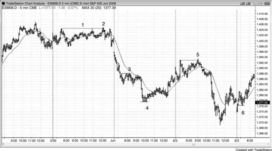

<!-- PDF page 245 -->

导致反转的一与两个 tick 假突破在 5 分钟 Emini 中很常见。图 9.1 呈现六个例子（K线 1 的标签远在该K线上方）。一旦突破交易者在止损上入场并发现市场回撤一两个 tick 而不是立即朝他们的方向继续，他们开始挂保护性止损。逆势交易者嗅到血腥味，会在被困交易者承受亏损的地方入场。多数突破尝试失败，尤其当市场处于震荡区间时，失败常以 1 tick 假突破形式出现。有经验的交易者用突破来止盈或在相反方向交易，预期震荡区间中多数突破会失败。例如，若交易者在震荡区间底部附近买入，他很可能剥头皮测试区间高点，并常在区间顶部有限价单卖出平多止盈。在强趋势中，他们做相反的事。例如，若市场处于多头趋势，交易者反而会在区间顶部上方用止损买入，因为他们预期另一段上行。

图 9.2 Emini 中的 1 tick 陷阱

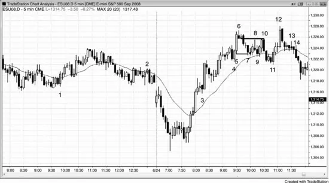

<!-- PDF page 246 -->

如图 9.2 所示，这两日 Emini 中有许多 1 tick 陷阱的例子。

K线 1 是 1 tick 失败的 Low 2，成为始于太平洋时间上午 8:55 的楔形多头旗形的突破回撤入场。

K线 2 是铁丝网中 1 tick 失败的 High 2，困住了以为通过等待大外包K线上方买入而保守的交易者，结果却在平坦均线下方震荡区间顶部买入被困。这成为双顶空头旗形。

K线 3 是失控多头趋势中 1 tick 失败反转，聪明交易者急切等待任何回撤买入。他们在K线低点下方买入，正好在弱空头做空从开盘高点上方突破向下反转的地方。

K线 4 跌破四根前小摆动低点下方 1 tick 并设置 High 2 做多。

K线 5 是大多头趋势K线，因此会在其低点下方 1 tick 有止损。这些在 K线 7 被打到 1 tick。多头能够保持市场在多头尖峰底部 K线 4 上方。

K线 9 走低 1 tick，把交易者困入他们以为是更低高点做空的东西，但实际上是横盘多头旗形。

K线 10 把 K线 6 空单的保本保护性止损打到两个 tick。它与 K线 8 设置双顶空头旗形。

K线 14 是最可靠的 1 tick 失败之一——新手交易者错误地假定为多头回撤中失败的 High 2。这是完美陷阱并导致强下行（未显示）。他们错过了到 K线 11 的回撤对趋势线的突破以及然后在 K线 12 的更高高点测试。此外， <!-- PDF page 247 --> 从高点有五根空头趋势K线与一根十字星下行，K线 13 High 1 后没有趋势线突破。这是更高高点后两K线反转之后的空头通道，因此更可能在 High 2 信号K线上方有更多做空而不是买入。记住，单独的 High 2 不是买入信号。它是多头趋势顶部的买入信号，但这里多头趋势已结束。市场现在要么处于震荡区间要么处于空头趋势。High 2 也是震荡区间中的买入信号，但只在区间底部，而不是这样接近顶部。

图 9.3 信号与入场K线保护性止损外的突破

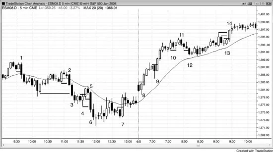

看图 9.3 中当市场突破水平线时发生了什么，水平线在信号与入场K线外 1 tick，是交易者很可能放保护性止损的地方。多数时候，有趋势K线且行情足够大让剥头皮者获利。这张图上许多失败是聪明价格行为交易者不会做的弱形态。然而，足够多交易者做了它们，当他们被迫带着亏损出局时，他们把市场推向相反方向。例如，从 K线 4 反转K线做多的交易者会把止损放在入场K线或信号K线下方。两者都被大 K线 5 空头趋势K线打到，把入场止损精确放在那些位置的聪明空头至少赚到剥头皮利润。

作为推论，若K线极端被测试但未超过，则止损被测试但未打到，交易常会盈利。若是做多入场的保护性止损差 1 tick 未到，测试有效形成双底多头旗形，第一个底是信号或入场K线底部，第二个是回到该水平但 <!-- PDF page 248 --> 未能到达保护性止损的那根。

图 9.4 失败的止盈目标

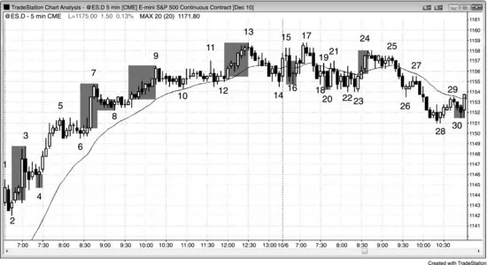

当市场打到止盈限价单价位然后回撤时，多数交易者的限价单不会成交。当市场然后停顿或回撤几个 tick 时，这些交易者中许多人会市价离场，因为他们不想冒回吐更多浮动利润的风险。这给任何调整增加燃料，常是市场在试图反转的迹象。

如图 9.4 所示，市场在 K线 2 上方反弹 21 个 tick 然后向下反转。一些在 K线 2 信号K线上方 1 tick 买入的交易者有限价单以五点利润平多，在信号K线高点上方 21 个 tick，但多数除非市场再高 1 tick 否则不会成交。相反，市场反转，那些交易者中许多人迅速出局，试图在等待看市场是否会一路回到入场价之前抢救尽可能多利润。

K线 7 是在 K线 6 买入信号K线上方 1 tick 买入的多头的 17 tick 失败。许多试图赚四点利润的交易者看到市场到达信号K线高点上方 17 个 tick 的限价单，并在市场跌破该K线低点后离场。正确相信趋势很强、反而波段持有多单而不试图在四点离场的交易者会依赖保本止损。一旦市场移到 K线 7 高点上方，他们然后会把止损跟踪到最近更高低点 K线 8 下方 1 tick。

K线 4、8、20 与 30 是做空交易上五 tick 失败的例子。多数空头需要市场跌到信号K线底部下方六个 tick 才能使他们四点剥头皮的止盈限价单成交。一些交易者 <!-- PDF page 249 --> 会成交订单，但多数不会。

K线 9 是在 K线 8 上方买入、希望赚三点利润的多头的 13 tick 失败。

K线 16 与 24 是试图赚两点的交易者的九 tick 失败。他们不会让那些交易变成亏损并会移动止损。例如，他们会在 K线 17 低点下方 1 tick 离场 K线 16 信号K线多单，或可能在 K线 17 空头收盘离场。他们可能在 K线 24 后两根形成的空头K线下方 1 tick 离场 K线 23 买入信号上方的多单。

图 9.5 震荡区间突破通常失败

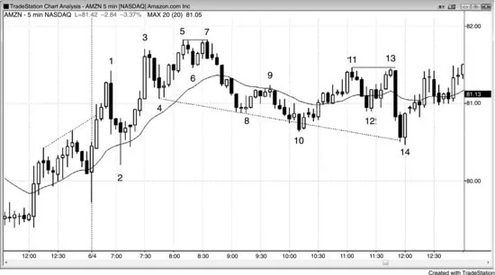

当有强双边交易时，摆动高点上方与摆动低点下方的突破通常失败。

如图 9.5 所示，到 K线 1 的反弹很强，但由于开盘反转常很剧烈，且它是更高高点（昨日收盘附近摆动高点上方）突破多头趋势通道线上方，它是合理做空。

K线 1 摆动高点后的 K线 2 回撤很深，从开盘以来的K线大且有大影线。有双边波动交易，直到多头趋势清晰发展，交易者应假定多头与空头都活跃。由于这尚未证明自己是多头趋势日，它应被当作震荡区间日交易。

K线 3 是更高高点，因为它是高于更早摆动高点的摆动高点。到 K线 3 的上行动能太强，不宜在没有第二次入场或强反转K线时考虑做空，但若交易者做空，行情 <!-- chunk continuation: 16-ch09-failures --> <!-- PDF page 250 --> 下行只有 26 美分，因此本可能最低限度盈利。

K线 5 是更高高点与合理做空，尤其因为它有两小段（中间有一根空头趋势K线代表从 K线 4 上行第一段的结束）。市场在再上行前只跌了 18 美分。敏捷交易者可能已部分止盈，但多数只会以 4 美分亏损 scratch 交易。

K线 7 是这一同一上行的一部分，因此是第二次入场（Low 2）做空。K线 7 与 K线 5 精确到美分是双顶，本质上是截断的三推上行形态（K线 3、5 与 7），因此两段下行很可能。

K线 10 是更低低点，以及可能更大多头趋势中的第二段下行。其低点在 K线 2 低点上方，因此市场可能仍在形成大多头趋势性摆动。多头趋势或横盘市场中的两段下行，尤其平坦均线下方的两次下推，始终是好做多。

K线 11 是更高高点，因为它在 K线 9 摆动高点上方，即便 K线 9 是先前下行段的一部分。仍会有交易者在那里交易（会有空单止损、买入突破的止损，以及新空单），因为越过任何先前摆动高点是强度迹象，以及震荡区间日上的潜在 fade（寻找突破失败与强度迹象缺乏跟随）。

K线 13 在 K线 11 下方 1 tick，是双顶空头旗形因此做空形态。它是从 K线 10 的两段上行，以及平坦均线上方的第二段（K线 11 是第一段）。

K线 14 对 K线 10 与 12 摆动低点都是更低低点。顺便说，来自 K线 10 与 14 的做多都是从 K线 4 与 8 画出的空头趋势通道线的失败超调。这增加了成功做多交易的机会。两者都有两K线反转形态。K线 10 是楔形多头旗形底部，K线 14 是扩张三角形多头旗形底部。

图 9.6 AMZN 中的失败突破

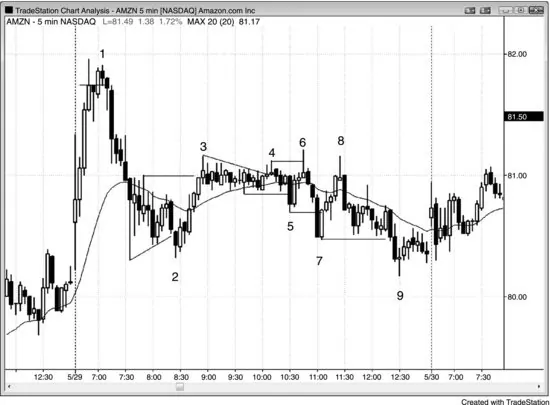

<!-- PDF page 251 -->

亚马逊（AMZN）在图 9.6 所示 5 分钟图上有许多超出摆动高低点的大一根失败突破。开盘高潮式上行然后大向下反转后，多头与空头都展示了强度，增加了全天任一方的任何运动会被另一方反转的几率。这使震荡区间很可能。所有标注的K线都是失败突破。窄幅震荡区间在 K线 3 后开始，变成结束于 K线 6 的小扩张三角形顶，然后结束于 K线 7 的扩张三角形底。从底部的反弹未能突破顶部，反而与 K线 6 形成双顶，市场抛售进入收盘。

图 9.7 震荡区间突破通常失败

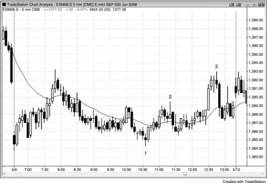

<!-- PDF page 252 -->

当某日看起来在发展成震荡区间日时，交易者预期突破会失败并寻找 fade 它们。如图 9.7 所示，到中午时很清楚当日小且横盘，这大大增加了突破很可能失败的机会。K线 1、2 与 3 是突破 fade 上的第二次入场。通向 K线 3 顶部的趋势K线大且有大成交量，吸入许多希望终于有趋势的多头。在小波幅日这始终是低概率押注，远更好的是 fade 突破或寻找强突破回撤。结束于 K线 1 低点与 K线 2 高点的突破很弱（明显影线、重叠K线），因此两次都很可能突破会失败。结束于 K线 3 的突破从未有突破回撤给多头低风险做多，因此唯一交易是第二次入场做空。

图 9.8 把交易者挡在好交易外

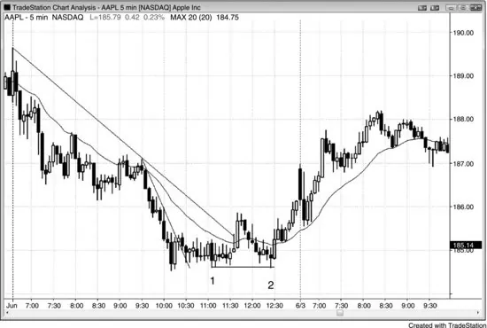

<!-- PDF page 253 -->

苹果（AAPL）一直是对日内交易者表现最好的股票之一，但像许多其他股票一样，它有时通过在反转开始时扫止损把交易者挡在绝佳交易外，如图 9.8 所示。

交易者通过在三根或六根后市场越过前一根高点时入场买入 K线 1 双底多头旗形。有突破趋势线的均线上方反弹，均线缺口K线做空导致对空头低点的 K线 2 测试。许多多头把保护性止损放在 K线 1 双底多头旗形下方。K线 2 比 K线 1 低 1 tick 并把多头挡出局，但它与 K线 1 形成双底多头旗形，导致延续到次日的反转。K线 1 下方 1 tick 失败突破把多头挡出局并把空头困入。到 K线 2 的下行在窄空头通道中，是第三次下推因此是 High 3 买入形态。High 3 在窄通道中比 High 2 更可靠的形态，因为通道常在第三次下推后向上反转。使这一做多特别好的是它把新多头挡出局并立即对他们向上反转，因此在心理上他们很难买入。他们会追赶市场上行，晚入场，从而给上攻增加燃料。

图 9.9 第一小时的双顶与双底

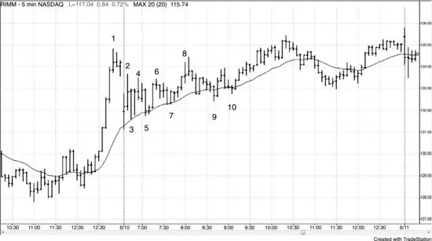

<!-- PDF page 254 -->

股票常在第一小时形成双顶或双底旗形（见图 9.9）。多数可交易，但始终剥头皮部分仓位并把止损移到保本，以防形态失败。

K线 2 与 4 形成失败的双顶空头旗形。市场然后形成 K线 3 与 5 双底多头旗形。

你然后必须在 K线 4 与 6 双顶空头旗形再次反手，但你会从多单净赚 70 美分。此时，你知道市场在形成震荡区间，很可能是三角形。

K线 7 是另一次失败，但是好做多，因为跟随强行情（到 K线 1 的反弹）的震荡区间通常是持续形态，且 K线 3、5 与 7 都在均线找到支撑。

到 K线 9 的抛售是七根长且没有多头强度，因此更好的是等待第二次入场，尽管 K线 9 是更高低点（相对于 K线 7）。它很可能走不远。

K线 10 的突破回撤是完美的第二次入场。

图 9.10 失败的双底多头旗形

<!-- PDF page 255 -->

如图 9.10 所示，K线 4 是双底多头旗形入场形态，但它以 K线 5 Low 2 失败，那是到 K线 4 的强空头尖峰的回撤。这导致双底下方突破然后到 K线 7 的两段运动。有几种做空选择，如 K线 5 下方、K线 4 低点下方一两个 tick、跌破 K线 4 那根收盘，或下一根收盘，那是强跟随K线。

图 9.11 多数头肩形态失败

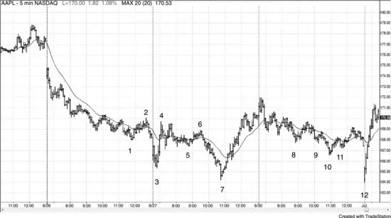

如图 9.11 所示，K线 5 与 11 是头肩底的右肩，多数失败，如这里所做（K线 1 与 9 是左肩）。仅形状本身不是做逆势交易的足够理由。你始终想在反转形态前看到一些更早的逆势强度。即便如此，也没有保证交易会成功。K线 2 突破了趋势线，到 K线 4 的反弹很强，虽然它未能超过 K线 2 高点是弱势迹象。虽然多数聪明交易者不会在 K线 5 双底多头旗形与做多入场后在 K线 6 失败处反手做空，他们会把止损移到保本，认为若止损被打到但交易仍好，止损扫会设置突破回撤做多形态。这里，止损被打到但市场继续抛售。K线 5 下方突破后刚过的一根突破回撤是绝佳做空。K线 5 也是 K线 4 尖峰后三角形中的第三次下推，三角形也是楔形多头旗形。

K线 11 右肩是买入，但保本止损再次会被打到。

图 9.12 对趋势极端的两段测试

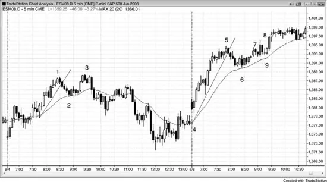

如图 9.12 所示，到 K线 2 与到 K线 6 的抛售突破了主要趋势线，因此在每种情况下，对先前高点的两段测试应设置好做空。K线 3 Low 2 做空成功，要么在 K线 3 下方做空，要么两根后做第二次入场。

K线 8 做空较不确定，因为测试是大多头趋势K线（几乎是外包K线，因为它与前一根有相同低点）。外包K线后的传统入场方式是在两个极端外 1 tick 用止损，在突破方向成交。然而，外包K线基本上是一根震荡区间，多数震荡区间突破入场失败。你应很少在外包K线突破上入场，因为风险太大（到K线另一侧，那很大）。由于这是两K线反转， <!-- PDF page 257 --> 最安全的入场是在两根中较低那根下方，即大多头趋势K线下方，因为市场非常经常走到空头K线下方，但不走到两根下方，这里就是如此。

若你在 K线 8 内包K线突破上做空，到该K线收盘你会紧张（十字星K线，表明没有信念）。然而，多数交易者不会做那个做空，因为三根或更多横盘K线，至少一根是十字星，通常创造太多不确定性（铁丝网）。外包K线前两根小K线足够小以像十字星一样作用，因此最好等待更多价格行为。然而，若你没有在 K线 8 做空，你会不得不相信许多人做了，他们入场K线的十字星收盘使这些交易者对仓位感到不舒服。他们会迅速离场，从而被困。他们很可能在 K线 8 入场K线上方 1 tick 买回空单，然后不愿再卖，直到看到更好的价格行为。空头出局且他们在买回仓位，正好在他们离场的地方做多（K线 9，做空入场K线上方 1 tick）应适合剥头皮并很可能两段上行。交易者可以在 K线 9 上方 1 tick 买入，或在 K线 9 后那根上方买入，依赖 K线 9 是多头趋势K线因此是好做多信号K线。

图 9.13 五 tick 失败

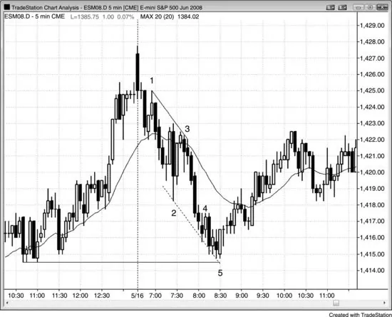

<!-- PDF page 258 -->

剥头皮做空四点在图 9.13 中几乎两小时是成功策略。然而，从 K线 4 内包K线的做空只跌了五个 tick 并向上反转。这意味着许多空头的止盈限价单未成交，空头迅速在保本离场，当然在 K线 5 上方。市场在测试昨日低点，是趋势通道线下方的第二次探底（基于从 K线 1 到 K线 3 的趋势线）。多头在寻找买入理由，失败的做空剥头皮是他们希望找到的最后东西。

图 9.14 QQQ 中的失败信号

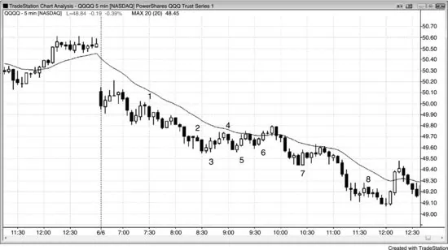

<!-- PDF page 259 -->

如图 9.14 所示，这些 5 分钟 QQQ 交易中每一笔在失败前到达 8 到 11 个 tick 之间。保护性止损会在所有交易中让剥头皮者大约保本出局，但这仍是大量工作几乎没有成果。显然，有许多其他盈利剥头皮，但若有太多不成功交易，剥头皮会令人疲惫。这常使交易者失去专注然后错过盈利交易。在清晰空头趋势日，最佳方法是只顺势交易，寻找卖出 Low 2 形态，尤其在均线处。你的胜率会高，使你有健康态度并继续入场，最好波段持有至少部分仓位。

图 9.15 切换到更小目标

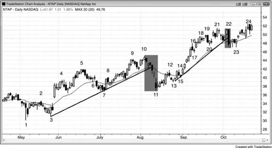

<!-- PDF page 260 -->

AAPL 通常产生 1.00 美元剥头皮（行情通常超过 1.00 美元，允许剥头皮者在 1.00 美元限价单上部分止盈）。然而如图 9.15 所示，K线 2 只延伸到 K线 1 上方入场上方 93 美分，然后设置 Low 2 做空。这一 Low 2 意味着市场两次未能到达目标。市场大体横盘且刚好未到 1.00 美元剥头皮，交易者很可能把止盈目标降到约 50 美分。他们本可以在这一 61 美分下跌上部分止盈。

图 9.16 空头尖峰可以是买入机会

如图 9.16 所示，NetApp Inc.（NTAP）在日线图上这一多头趋势中两次打折，交易者激进买入打折。仅仅因为有跌破趋势线下方的强尖峰并不意味着趋势结束。多数反转尝试看起来很棒且多数失败。因此，有经验的交易者会激进买入急剧打折，即便在空头尖峰底部。K线 11 在 16% 抛售底部，但它仍是更高低点以及与 K线 7 的双底多头旗形。由于下行通道持续如此多根，更安全的是等待买入 K线 13 更高低点或 K线 14 Low 2 形态上方突破，那是失败的双顶空头旗形。

K线 22 是到均线的非常强空头趋势K线，但从 K线 15 到 K线 19 的反弹非常强。空头趋势K线可能基于某个吓人的新闻报道，但一根强空头趋势K线不创造反转。多数时候，它会失败并导致新趋势高点。多头认为震荡区间与新高比成功反转更可能，他们买入该K线底部。其低点也与 K线 20 形成双底，可能成为震荡区间底部或双底多头旗形。空头K线有弱跟随并横盘 <!-- chunk continuation: 16-ch09-failures --> <!-- PDF page 261 --> 四根重叠K线，有明显影线。这不是空头反转通常看起来的样子，空头买回空单。他们的买入，加上多头在这里买入，导致新趋势高点。

图 9.17 多数趋势反转尝试失败

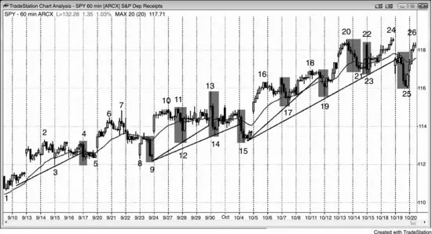

当多头趋势像图 9.17 所示 SPY 60 分钟图上那样强时，它有惯性并会抵抗结束尝试。过于急切的空头把均线下方与趋势线下方的强空头尖峰看作市场在反转成空头趋势的迹象。多头把每一个空头尖峰看作买入形态。他们知道成功反转需要的不只是简单的强空头尖峰。他们相信每一次反转会失败，因为多数失败，且市场会走高，因此他们急切买入回撤。当 SPY 仅 1% 或 2% 打折时，多头迅速买入，因为他们知道打折不会持续很久。许多尖峰由真空创造。多头想买入回撤，因此若他们认为市场会再低一点，他们停止买入。这允许空头迅速把市场打低。一旦它足够低且多头认为它不会更低，他们不知从哪里冒出来并激进买入。他们压倒空头，空头然后必须买回空单，给反弹加力，巨大空头尖峰没有跟随。

虽然尖峰在形成时吓人，若交易者理解正在发生什么，他们会急于在底部买入。若他们不想有巨大隔夜风险，他们可以在每个空头尖峰底部买入看涨期权，并在几天后每个新高止盈。

图 9.18 失败有时可以是强度迹象

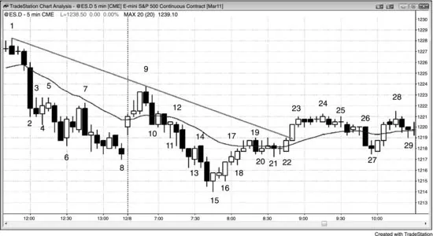

<!-- PDF page 262 -->

如图 9.18 所示，从 K线 15 上行的更低低点主要趋势反转很强，很可能至少有两段上行。然而，到 K线 19 的反弹未能到达空头趋势线。它推到均线上方并足够接近该线以在其磁场内。这给交易者信心买入 K线 22 High 2 形态，因为他们认为市场应测试趋势线上方。

K线 4 是强空头尖峰后的多头反转K线。尖峰足够强使交易者确信市场始终做空，因此交易者在寻找卖出反弹。由于他们不认为 K线 4 会导致显著反转，许多空头在其高点处及上方挂限价单做空。足够多交易者如此急于做空，他们在其高点下方 1 tick 做空。市场从未到达多头信号K线高点上方，这是空头很强的迹象。市场在 K线 5 Low 2 做空信号K线下方抛售。类似情况在 K线 10 后那根高点、以及 K线 11、13 与 26 形成。K线 18 是多头等价物。交易者如此急于做多，他们在 K线 18 前那根低点处及下方有买入限价单，在 K线 18 低点上方 1 tick 有限价单的最激进多头很可能是唯一成交做多的人。其他人不得不追赶市场更高。

K线 27 在 K线 21 低点上方 1 tick 转上，阻止完美双底多头旗形。这是急切多头的迹象，他们在市场从 K线 24 高点下行时在 K线 21 低点上方一两个 tick 挂买入限价单。他们如此急于做多，不想冒在 K线 21 低点处及上方 1 tick 的买入限价单不成交的风险。相反情况发生在 K线 7 在 K线 5 高点下方 1 tick 转下时。

<!-- PDF page 263 -->

它未能到达 K线 5 高点，因为空头感到做空的紧迫性，因此失败是空头趋势很强的迹象。K线 7 是均线测试，但空头如此急于做空，他们把卖出限价单放在均线下方两个 tick 而不是下方 1 tick。这阻止了该K线高点到达均线，是强空头趋势的迹象。

K线 15 底部后的 Low 1 未能导致新空头低点，是向上反转很强的迹象。

图 9.19 刚好未到目标然后到达它

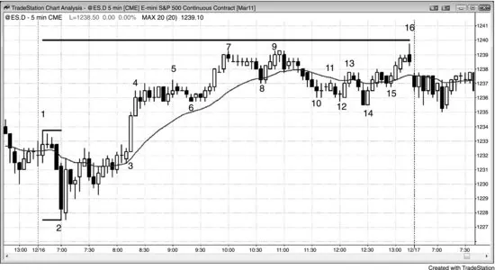

当有相当明显的等幅运动目标且市场足够接近以在其磁拉力内，但不够接近让交易者相信它被充分测试时，市场常回撤然后做更令人信服的测试。如图 9.19 所示，今日是 Emini 趋势型震荡日，明显等幅运动目标是基于开盘区间的等幅上行。K线 7 与 9 差三个 tick 未到，但多数交易者除非市场差 1 tick 内否则不会觉得测试完成。测试未能到达目标，但它足够接近使交易者相信磁铁在影响价格行为。交易者想看市场在测试它后是否会回落，或它是否会突破上方并反弹到某个更高目标。市场回撤到 K线 14 小扩张三角形多头旗形，并在当日最后一根差 1 tick 内测试目标。顺便说，若测试走到等幅运动目标上方四个或更多 tick，那通常意味着市场在忽略该目标并走向更高目标。

K线 14 也是更大楔形多头旗形的信号K线，其中 K线 8 是 <!-- PDF page 264 --> 第一次下推，K线 10 或 12 形成第二次。一些交易者认为旗形在 K线 12 结束，但 K线 10 与 K线 12 之间的距离相对于 K线 8 与 K线 10 之间的距离较小，因此许多交易者不确信调整结束。这导致到 K线 14 的更低低点最后下推。

从 K线 14 上行的三根多头尖峰突破先前 60 分钟K线高点（未显示）上方 1 tick。当市场两根后在 5 分钟楔形空头旗形中向下反转时，60 分钟交易者在纳闷他们是否处于 60 分钟 1 tick 多头陷阱中。一些 60 分钟交易者在先前 60 分钟K线高点上方 1 tick 用止损买入，现在市场在转下。然而，多数时候当 60 分钟图上有发展中的 1 tick 失败突破时，市场在 60 分钟K线收盘前反转回 1 tick 失败突破上方。结果是虽然 1 tick 失败突破在 5 分钟图上存在许多根，它在 60 分钟K线收盘时从 60 分钟图上消失，如这里的情况。60 分钟K线在 K线 15 后那根收盘，60 分钟K线最终高点在先前 60 分钟K线高点上方三个 tick。
