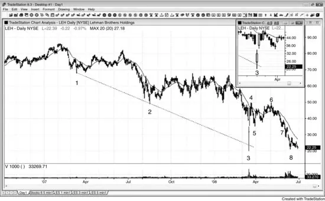
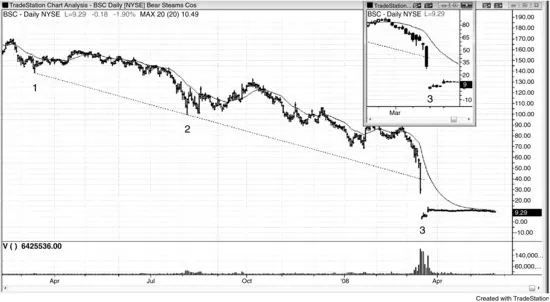

# 第 10 章：日线图上的巨量反转

<!-- Source PDF pages 265–267 -->

<!-- PDF page 265 -->

第 10 章
日线图上的巨量反转
当一只股票在日线图上处于陡峭空头趋势，然后出现成交量达到其最近平均量五到十倍的一天时，多头可能已投降，可交易的底部可能出现。巨量日非常常是跳空低开日，若它有强多头收盘，盈利做多的几率增加。交易者不一定在寻找多头反转，但在高潮式抛售之后，至少有两段运动到至少移动平均线的几率很好，使他们能做一笔从数天到数周的盈利交易。
顺便说一句，在处于强空头趋势的 1 分钟 Emini 图上，若有一根巨量 K 线（约 25,000 张合约），它不太可能是空头趋势的结束，但常是回撤将很快到来的迹象，通常在一两个更低低点、成交量更小（成交量背离）之后。你应极少（如果有的话）在日内图上看成交量，因为它在你应主要用于交易的 5 分钟图上的预测价值不可靠。
图 10.1 巨量反转

有时市场在巨量日反转向上。如图 10.1 所示，雷曼兄弟（LEH）在 K 线 3 以巨大跳空低开，然后

<!-- PDF page 266 -->

跌破空头趋势通道线（来自 K 线 1 与 2），但强劲反弹进入收盘。成交量是前一日的三倍，约过去一个月平均量的十倍。有如此强的多头趋势 K 线（在蜡烛图缩略图上看得更清楚），在收盘买入是安全的，但更谨慎的交易者会等到市场突破这根可能信号 K 线的高点。市场次日跳空高开。交易者可以买入开盘，等待向下测试，然后买入新的日内高点，或在 5 分钟图上寻找抛售，并在试图回补缺口失败后买入反转向上。这种强度几乎总是跟随至少两段向上（到 K 线 6 的第二段向上发生在成功的 K 线 5 缺口测试更高低点之后）以及对移动平均线的穿透。
K 线 4 与 6 形成双顶空头旗形。
K 线 7 试图与 K 线 5 形成双底多头旗形，但反而在三根 K 线后导致突破回撤做空入场。
截至图上最后一根 K 线，市场正在测试 K 线 3 低点，试图捍卫其下方的止损并形成双底。数月后，LEH 倒闭。
图 10.2 无反转的巨量

大阴日上的巨量并不保证反弹。如图 10.2 所示，贝尔斯登（BSC）在周五有一个巨大空头趋势日，成交量约为典型日的 15 倍。该股在前两周已损失约 70% 的价值。然而，成交量仅约为前一日的一倍半，且只有极小的多头影线。价格行为不利于做多，因为没有从空头趋势通道突破处的反转。事实上，巨大空头趋势 K 线收盘远在

<!-- PDF page 267 -->

该线之下，确认了趋势通道线未能遏制空头趋势的强度。该股周一开盘（K 线 3）又损失 80%，但成交量略少。在周五收盘买入、认为高潮底部已在、这个国家第五大投资银行与经纪商不可能再跌的交易者，到周一被摧毁。在没有多头价格行为的情况下，高潮成交量不是 fade 强空头趋势的理由。
这张图覆盖与前一张 LEH 图相同的时间段。然而，LEH 图直到周一才跌破空头趋势通道线（K 线 3），并在那天以巨量反转向上。在这里，在 BSC 图上，巨量日早一天，它也跌破了空头趋势通道线，但该日收在其低点附近，没有多头价格行为。它在 K 线 3 跳空低开，就像 LEH 一样（K 线 3 对两只股票都是周一），但 LEH 强劲反弹而 BSC 几乎无法反弹。BSC 的 K 线 3 仍是跟随空头趋势通道线突破的多头反转 K 线，但任何在那天在买入 LEH 与 BSC 之间选择的交易者，显然更愿意买入 LEH，因为它有非常强的多头反转 K 线。即使交易者在 K 线 3 上方一个 tick 买入 BSC，他们在接下来三天也会赚超过 100%，但 LEH 显然是更确定的多头赌注。
自这张图打印以来，BSC 被摩根大通（JPM）以仅为其几个月前市值的极小部分收购。
