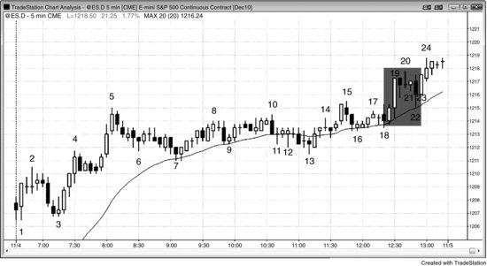
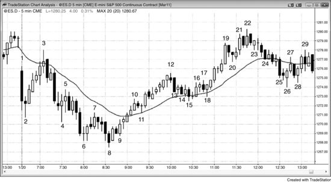

# 第 11 章：一天中的关键时段

<!-- Source PDF pages 270–277 -->

<!-- PDF page 270 -->

第 11 章
一天中的关键时段
交易日可分成三个时段，尽管同样的价格行为原则全天适用，但对每个时段有一些对交易者有用的概括。任何类型的价格行为都可能在一天中的任何时间发生，但有一种倾向：一天中前一两个小时最可能找到风险回报比为两到三倍的交易。这是一天中最重要的时间，对多数交易者来说，这也是最容易赚钱的时间（若交易者不小心，也是最容易亏钱的时间）。总体而言，多数交易者应非常努力地在前一两个小时做交易，因为那些交易有最佳的回报、风险与概率组合的交易者公式。由于其重要性，第三部分的章节详细讨论它。太平洋标准时间（PST）上午 7:00 常有报告，它们常导致当日趋势。计算机在分析与下单速度上有明显优势，它们是你的竞争对手。当你的竞争有大优势时，不要去竞争。等待他们的优势消失，在速度不再重要时再交易。一旦始终持仓方向已确立，就寻找做趋势交易。即使你可能错过前一两根 K 线，若趋势很强，交易中仍会剩下足够多的点数。
在日线图上，强多头趋势 K 线下方与强空头趋势 K 线上方常有小影线。这些常由开盘反转造成。例如，若多头认为当天很可能是强多头趋势日，而它在当天前几根 K 线向下交易，他们中的多数会相信这很可能是当日低点，是在即将消失的巨大价值处买入的绝佳机会。若他们是对的，市场会反弹，他们会在当日低点附近买入。在日线图上，多头趋势 K 线底部会有小影线，来自开盘的三根 K 线抛售。因为他们为那种可能性做好了准备，这些聪明多头在可能至少 50% 成功机会的交易上（记住，由于市场的整体特征，他们相信当天很可能反弹），以小风险获得了巨大回报。
一天的中段，从约 PST 上午 8:30 到 9:30 开始，到约 11:00 到 11:30 结束，有时晚至 12:30，更倾向于双边 <!-- PDF page 271 --> 交易，如震荡区间或通道。这是一天中窄幅震荡区间最常见的时间。这对用止损入场是糟糕的环境。在非常双边的市场中，当市场略微下跌时，买家进入并取得控制，因此在市场下跌时用止损入场，恰恰与机构在这些窄幅震荡区间中所做的相反。买家是剥头皮了结盈利空头的空头，以及买入做向上剥头皮的多头。在顶部，发生相反的事，卖出占主导。多头卖出了结盈利的做多剥头皮，空头卖出以启动做空剥头皮。也有波段交易者，但总体而言，当市场处于震荡区间时，无论是否窄，大部分成交量是剥头皮，机构在低买高卖。作为交易者赚钱的最佳方式是做机构所做的事，因此若你要在震荡区间中交易，就寻找剥头皮，低买高卖。有经验的交易者会在顶部弱 High 1 与 High 2 买入信号 K 线上方用限价单卖出，在底部弱 Low 1 与 Low 2 信号 K 线下方用限价单买入。由于限价单交易更难准确评估，新手应避开它们。对止损入场要非常小心，只有在区间顶部、市场正在转向下时才用止损卖出，只有在靠近底部、市场正在转向上时才用止损买入。市场总是冲向顶部与底部，诱使充满希望的新手在顶部用止损买入、在底部用止损卖出。他们只看向上与向下尖峰的强度，忽略过去 20 根 K 线的震荡区间，结果做了与机构相反的事。由于如此多的交易形态是为剥头皮，而多数交易者无法靠剥头皮谋生，他们在这段时间应非常有选择。由于当日高点或低点在或许 90% 的日子形成于一天的前三分之一，一天的中间三分之一通常是交易者决定初始趋势应恢复还是反转的时候。多头与空头都活跃，各自争夺控制，各自试图在收盘前制造趋势。市场常在 PST 上午 8:30 左右反转，然后在一天中间三分之一的剩余时间趋势运行。交易者需要意识到，开盘时开始的趋势可能不会持续全天，完全相反的情况可能在前几个小时之后发展出来。
新手倾向于在一天的中间三分之一亏钱。他们常亏掉比在一天前三分之一赚的还多，若是这种情况，他们应考虑不在中间三分之一交易，除非信号特别强。许多交易者在一天的前几个小时赚他们大部分钱，然后在一天中段交易少得多或完全不交易。若一个人拥有两家店，一家赚很多钱，但另一家无论老板做什么都持续亏钱，且常比 <!-- PDF page 272 --> 他从好店赚的还多，他应继续经营两家店吗？答案显而易见。你可以把一天的前三分之一与中间三分之一看作两家店。关掉那家亏损的店没有错。你的目标是赚钱，不是全天交易。若全天价格行为都好且你不累，那么全天交易在财务上是明智的。然而，通常并非如此。中间三分之一往往有多得多的双边交易、通道、窄幅震荡区间、许多反转、没有跟随的趋势 K 线，以及大量十字星。除非交易者对止损入场非常有选择，或能靠用限价单 fade 运动赚钱，他们应等待价格行为变得更可预测。不交易总比做亏损大于盈利的交易更好。新手频繁赢的次数刚好够让他们继续所做的事，希望他们所需要的只是经验。然而，无论他们积累多少经验，窄幅震荡区间始终难以交易。几乎总是更好等到始终持仓方向清晰，使跟随的几率足够高以允许盈利交易。
一天的三个时段常创造趋势恢复形态。例如，若有几个小时的抛售，然后反弹到约 PST 上午 11:30，市场可能在那之后再次抛售，恢复一天前三分之一的空头趋势。有时形态清晰地是上-下-上或下-上-下，但更常不那么明显，尽管倾向仍然存在。因此，许多交易者会把一天中间三分之一任何反转一天前三分之一运动的运动，仅仅看作初始趋势的潜在回撤。然后他们会寻找原趋势在约 11:30 a.m. 恢复，若有迹象表明这正在发生，他们会做该交易。即使在形态不清晰的日子，交易者也知道市场常在约 11:30 a.m. 做出某种运动，那常会延续到收盘，因为机构开始他们当天的最后交易。该运动可以是反转，但也可以是突破。例如，若前两个小时有强抛售，然后到 11:30 a.m. 有弱反弹，且看起来像在见顶并反转，市场反而可能向上突破，导致反转日与反弹进入收盘。交易者在进入 11:30 a.m. 时并不与任何特定方向“结婚”，但总是准备好在市场进入一天最后三分之一、机构开始其最后交易时朝任一方向运动。
一天的最后时段持续到收盘；它常恢复当天更早的趋势，如在趋势恢复日，但有时反转趋势并形成反转日。若日线图上有强多头趋势， <!-- PDF page 273 --> 多数日子收盘高于开盘，市场通常会在最后 30 到 60 分钟尝试反弹。空头趋势有更多收盘低于开盘的日子，常在收盘前抛售。
有两种非常不同的价格行为类型，交易者应在最后 30 到 60 分钟寻找，因为若交易者有准备，每一种都提供机会，若他们没有准备，每一种都造成问题。第一，市场有时会在最后半小时有无情的趋势，因为风险经理告诉他们的交易者必须在收盘前平掉亏损仓位。动能程序检测到强趋势，也无情地顺势交易，只要动能继续。在有些日子，许多共同基金会有类似的订单要在收盘前完成。想在回撤处入场的交易者被困在外面，因为回撤永不来。若你看到这一点，在当前 K 线收盘顺势入场，并把保护性止损放在 K 线另一端之外。若趋势继续进入收盘，你可以获得快速的意外利润。值得注意的是，交易者常会累，由于他们的优势很小，若他们不能以最佳状态交易，就应避免交易。交易者可以在一天中任何时间变得疲倦、无聊或分心，在他们恢复正常之前不应交易。计算机不会累，交易到收盘与全天一样好。这是它们相对个人交易者的又一个优势。
当日线图上有多头趋势时，几乎总会有比空头趋势 K 线更多的多头趋势 K 线。空头趋势时则相反。例如，若市场处于强空头趋势，且在最后一小时有中等反弹，许多交易者会预期当天收在其低点附近，且日线图上的 K 线是收在低点附近的强空头趋势 K 线。因此，有经验的交易者会迅速做空任何在临近一天结束时开始反转向下的反弹，预期收在当日低点附近。其他交易者会等待抛售变得清晰然后再做空。结果常是当日线图上有空头趋势时，在空头趋势日收盘前出现强空头趋势。日线图上多头趋势的情况相反，绝大多数 K 线收在高点附近，市场常在最后一小时前的抛售后反弹进入收盘。
另一种收盘类型对交易者更难，因为与其说把他们困在盈利交易之外，不如说倾向于用亏损把他们止损出局。市场会趋势进入收盘，但有大 K 线、大影线，以及两到三次扫止损但没有打到信号 K 线之外原始止损的反转。若你关于有趋势进入收盘的前提是正确的，且市场正在形成一两根有大影线的 K 线，若你波段持有交易并坚持 <!-- PDF page 274 --> 你的初始止损直到回撤之后，然后把止损收紧到仅过回撤，你就能赚钱。
每当发布报告时，无论是 PST 上午 7 点的住房报告还是上午 11:15 的 FOMC 公告，你进出交易时滑点很常见，因此风险常更大、回报常更小。此外，概率只有 50%。结果是糟糕的交易者公式，多数交易者应等待数秒到数分钟，直到市场变得有序再下单。
图 11.1 风险经理对进入收盘的趋势有贡献

如图 11.1 所示，进入收盘的反弹部分是由于风险经理的拍肩。当市场开始转向上并到达 K 线 22 时，所有在 K 线 10 之后做空的交易者都有到收盘成为亏损仓位的危险，所有在 K 线 16 之后做空的交易者已经持有亏损。交易公司的风险经理监控交易者在收盘前持有的仓位。若许多交易者持有突然变成亏损的空头，他们可能在情感上依恋他们的交易，并希望有晚期抛售。他们的奖金取决于他们的表现，他们可能讨厌承认他们突然对今天的空头趋势错了。风险经理的工作是冷静客观，他会告诉交易者回补空头。若这在足够多的公司发生，它可以对无情的上升趋势进入收盘有贡献。在家的交易者希望有回撤，但它永不来。一旦他们意识到发生了什么，他们可以在 K 线 21 与 23 的短暂回撤之上买入，或买入任何 K 线的收盘，然后把保护性止损放在他们入场 K 线低点下方。动能程序检测到无情的买入并也开始买入，并将继续买入，只要 <!-- PDF page 275 --> 向上动能很强。进入收盘的共同基金与对冲基金买入也可以有贡献。当市场抛售进入收盘时，所有这些交易者都在做相反的事。
市场在日线图上处于窄多头通道中（未显示）。过去 32 天中只有两天收在当日低点附近，过去 32 天中有 21 天收在开盘之上。在日线图上的多头摆动中，多数日子有多头实体，交易者急于买入进入收盘的反弹。
市场在前几个小时处于震荡区间；该区间约为平均日波幅的一半，提醒交易者可能突破进入趋势型震荡日。当市场从 K 线 7 与 K 线 2 的双顶向下运动时，交易者更确信突破会向下，卖出增加。市场然后形成更低的震荡区间，但从 K 线 15 移动平均缺口 K 线抛售，向下突破，但反转向上到开盘之上。记住，多数反转日开始时是趋势型震荡日。
如常发生的情况，市场在一天的中间三分之一横向运行，然后从 K 线 7 到 K 线 10 的空头趋势试图在一天的最后三分之一恢复。然而，向下突破失败，K 线 10 到 K 线 16 的震荡区间成为空头趋势中的最后旗形。
图 11.2 进入收盘的趋势可能很吓人

你可以对进入收盘的趋势是对的，但当市场在收盘前有几根十字星时仍会亏钱。如图 11.2 所示，形成到 K 线 19 向上尖峰的两根强多头趋势 K 线很可能有跟随，但对任何做多的保护性止损需要在尖峰下方，或至少在第二根大多头趋势 K 线低点下方。一旦市场 <!-- PDF page 276 --> 开始在 K 线 20 附近形成十字星，就有急剧回撤的风险。若你在 K 线 16 之上买入，你可以用 K 线 20 下方的紧止损或盈亏平衡止损。然而，若你买入 K 线 19 尖峰的收盘或 K 线 21 十字星之上，你需要冒险到尖峰两根 K 线的低点之下，或至少到 K 线 19 之下。影线是市场双边的警告。若你在这种类型的市场中交易——只有非常有经验的交易者才应考虑在一天结束时市场进入窄幅震荡区间时继续持有——你必须为波段交易它，允许双边运动，并使用宽止损。
这是趋势恢复日，大约在一天前三分之一有反弹，结束于 K 线 5，然后一天中段是震荡区间，多头趋势恢复进入收盘。最后的反弹开始于 PST 上午 11:15，尽管向上突破直到下午 12:30 才到来。
图 11.3 午间反转

在当日趋势在开盘后约一小时内确立之后，市场常在一天中间三分之一开始时反转，约在 PST 上午 8:00 到 9:30 之间（通常约 8:30 a.m.）。有时市场反而进入数小时的震荡区间，然后在最后一两个小时的某个时点朝任一方向突破。突破可以导致趋势恢复日或反转日。如图 11.3 所示，从 K 线 8 到 K 线 12 的反弹如此之强，更早的空头趋势无法在进入一天最后三分之一时重新确立自己。取而代之，从 K 线 8 到 K 线 12 的反弹在 K 线 17 弱尝试把市场反转向下之后恢复向上。多头恢复以 K 线 18 回撤开始，来自到移动平均线的 K 线 12 到 K 线 15 <!-- PDF page 277 --> 楔形多头旗形。然而，多头无法继续反弹，市场抛售回到开盘，在日线图上创造十字星日。
K 线 3 是对移动平均线的测试，以及与 K 线 1 的双顶，因此是可能的当日高点。交易者在寻找开盘区间底部的突破，然后约等幅运动向下。取而代之，市场有到 K 线 4 的空头尖峰，然后又两次推动，创造空头尖峰与通道趋势，其中通道是楔形。交易者把这看作一天中间三分之一开始时可能的向上反转，以及潜在的当日低点。买入信号在以 K 线 8 开始的两 K 线反转上方。许多交易者认为市场在 K 线 9 向上外包 K 线上已翻转为始终做多，多数交易者相信到 K 线 10 多头尖峰结束时它是做多。
