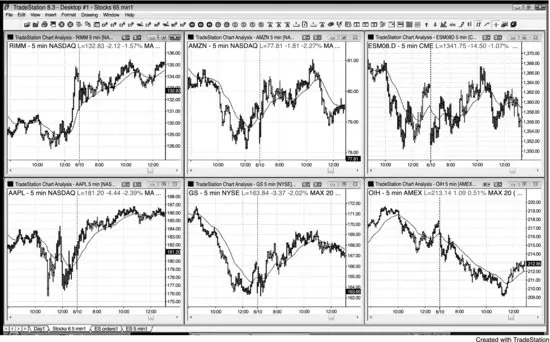
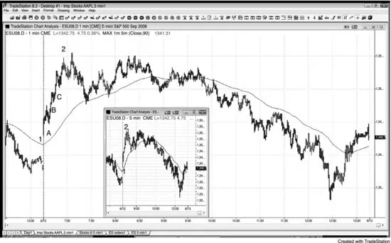
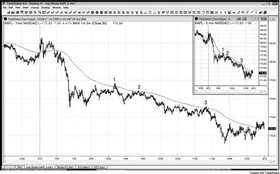
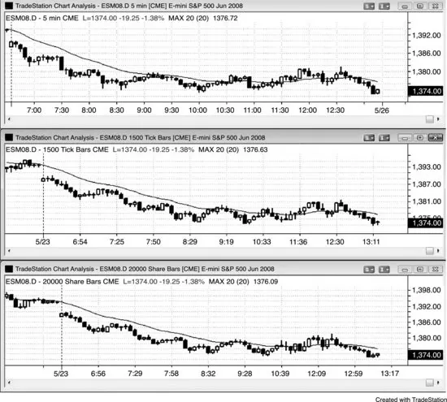
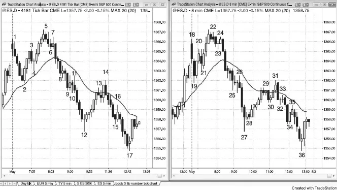
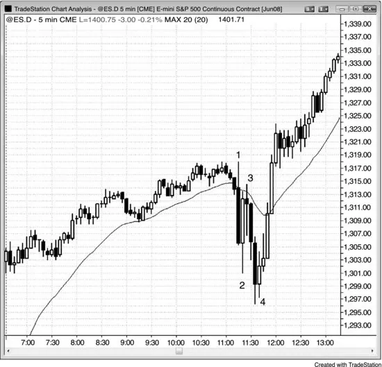
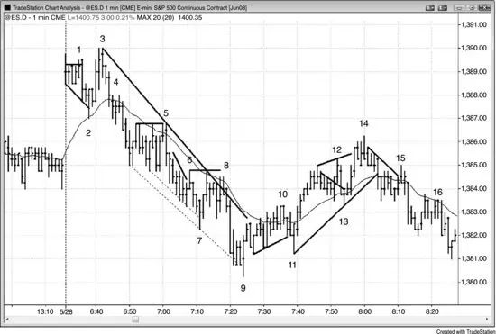

# 第 13 章：时间框架与图表类型

<!-- Source PDF pages 280–291 -->

<!-- PDF page 280 -->

第 13 章
时间框架与图表类型
对剥头皮交易者来说，Emini 最容易使用 5 分钟蜡烛图。然而，对 Emini 或股票的日内波段交易，简单的 5 分钟 K 线图效果很好。这是因为在笔记本电脑或单显示器上，你可以在屏幕上放六张 K 线图，每张对应不同股票，每张图将包含一整天的 K 线。若你使用比 K 线更宽的蜡烛，你的图将只显示约半天的价格行为。提到这一点的一个重要原因是提醒交易者：这种方法与简单 K 线图配合很好，尤其当你试图只波段交易最佳入场时。
蜡烛图对 Emini 剥头皮交易者的优势是，很容易快速看出谁拥有这些 K 线，尤其是设置 K 线。此外，许多 High 与 Low 2 变体在 K 线图上不容易看到。
价格行为交易技术在所有市场与所有时间框架中都有效，因此交易者必须做明显的基本决定：他们应交易哪些市场与时间框架。多数交易者的目标是最大化长期盈利能力，隐含的是每个交易者需要找到适合其性格的方法。
若 5 分钟 Emini 图平均每天提供十几笔好入场，3 分钟图提供 20 笔，1 分钟提供 30 笔，风险（保护性止损大小）在 5 分钟上是八个 tick，3 分钟上是六个 tick，1 分钟上是四个 tick，为何不交易更短的时间框架？更多交易、更小风险、更多钱——对吗？对，若你能在实时中足够快地正确读图，能精确正确地在价格处放置入场、止损与利润目标订单，并全天七小时、年复一年地持续这样做。对许多交易者来说，时间框架越小，他们错过的好交易越多，胜率越低。他们根本无法用这种方法在 1 与 3 分钟图上足够快地剥头皮，以像在 5 分钟图上那样盈利，因此那应是他们的焦点，他们应持续努力增加仓位规模。最佳交易常作为意外到来，形态可能难以信任。多数交易者根本无法足够快地处理信息。不可避免地，他们会挑拣，倾向于不选最好的形态，而这些对他们的底线最重要。最佳交易常如此快速地设置与触发，以至于容易

<!-- PDF page 281 -->

错过，然后你只剩下所有较差的交易，包括所有亏损的。
更高时间框架图上运动的平均规模大于更小时间框架图。然而，几乎每一个更高时间框架波段都从 1 与 3 分钟图上的反转开始。只是很难知道哪些会有效，试图每天做 30 笔或更多交易、希望有大运动，可能令人精疲力尽。1 与 3 分钟图上最好的交易导致 5 与 15 分钟图上的强入场，对多数交易者来说，专注于最佳 5 分钟交易并努力增加仓位规模要有利可图得多。一旦他们能成功交易，他们就能赚难以置信的钱，并有非常高的胜率，这导致压力小得多，并有更好的能力随时间维持表现。
此外，随着你的仓位规模增加，在某个时点，成交量会在 1 分钟图上的太多交易中影响市场。作为一个极端例子，若你有利润目标限价单要在市场上方两个 tick 卖出 5,000 张 Emini 合约，任何有价格阶梯的人都会看到异常，你将很难在每天 10 到 15 笔交易上成交。此外，用止损入场那种规模会导致一两个 tick 的滑点，这会毁掉剥头皮的风险/回报比。交易者甚至可以用价格行为每笔交易 5,000 张合约，但不是用多数交易所需的入场与出场剥头皮技术。愿你有朝一日有因成交量不利影响成交而必须重新思考方法的问题！
1 分钟图在两种情况下可能有帮助。若 5 分钟图处于失控趋势中，你空仓但想入场，你可以看 1 分钟图上的 High/Low 2 回撤以顺势入场。1 分钟图对有经验交易者有帮助的第二种情况是，在 5 分钟图上波段交易趋势股票。当股票在趋势时，它们非常尊重移动平均线，可以在移动平均线处的 High/Low 1 或 2 形态上做顺势交易，风险为信号 K 线的高度。交易者可以通过在 5 分钟图上移动平均线触及或穿透后的第一次反转处，在 1 分钟图上入场，来略微减小该风险。若你在 1 分钟图上绘制 5 分钟 20 根移动平均线，你可以快速看到触及然后下单。你实际上需要在 1 分钟图上绘制 90 根移动平均线，作为 5 分钟 20 根移动平均线的替代。为何是 90 而不是 100 根？因为 1 分钟图上的移动平均线在每根 1 分钟 K 线收盘时重新计算，而不是仅在每第五根收盘时，因此较近 K 线的权重倾向于使 100 根移动平均线有一点点太平。此外，1 分钟图上的前四个收盘

<!-- PDF page 282 -->

不是 5 分钟移动平均线的一部分。为纠正这一点，使用 90 根移动平均线（我使用指数移动平均线，但任何移动平均线都可以），它非常接近 5 分钟 20 根移动平均线。在实际操作中，由于你专注于 Emini，你很少有时间看 1 分钟股票图。然而，当一只股票强趋势时，你可能偶尔在 1 分钟图上快速入场。
这一讨论隐含的是，不同时间框架上可以有相反的趋势。例如，若市场已强劲上涨几周，但过去两天处于趋势性空头通道中，且过去 15 分钟在向下降的 5 分钟移动平均线的向上回撤中，则 5 分钟图处于空头趋势，1 分钟图处于多头趋势，两天的向下运动很可能在 60 分钟图上形成多头旗形。日线图也可能同时看空而月线图看多。试图调和所有这些太令人困惑，等待所有时间框架朝同一方向是浪费时间，因为那很少发生，即使发生，也没有盈利交易的保证。只需选一个时间框架，交易你面前的价格行为。若你读对并交易得好，你无需知道所有其他图上发生了什么也能做得很好。
许多交易者使用基于成交量而非时间的图表。例如，Emini 图可以构建成每根 K 线在发生 5,000 或更多 tick 时收盘，或在交易了 25,000 张合约时收盘。你使用什么类型的图并不重要，只要你对读图与下单所需的速度感到自在。所有图上的形态都基于人类行为，因此相同。趋势线在基于时间的图上往往比基于成交量的图更精确，但许多交易者不担心精确趋势线，而只使用近似。
我有一群朋友使用基于斐波那契数的 tick 图，另一些朋友使用基于奇数时间的时间图，如八或十三分钟。一切有时都有效，但若你只选一张图交易会更容易。它是 tick 图、成交量图还是时间图并不重要，每根有多少 tick、股数或分钟也不重要。整天所有类型的图上都会有绝佳的价格行为信号。重要得多的是交易者实时读图与正确管理交易的能力。你可以用完全随机的每根 K 线 tick、股数或分钟数做实验，你会看到图看起来很好，有很多合理信号。我个人喜欢 5 分钟图，因为趋势线与趋势通道线常很精确，每天有足够多的形态，我能看到 K 线何时

<!-- PDF page 283 -->

即将收盘，这让我能预期交易。用 tick 或成交量图，几秒钟内的一连串交易可能导致 K 线比预期早得多收盘，我发现我最终错过太多那些在日终图打印件上如此容易看到的绝佳信号。此外，趋势线也不那么准确。使用基于 tick 或成交量的图的交易者也有使用更小时间框架图的倾向。他们这样做是为了最小化止损规模，希望减小的风险会导致盈利。不可避免地，他们忽略了更低胜率的权衡，最终亏钱。
图 13.1 用 K 线图做波段交易

像图 13.1 中那些简单的 K 线图，就是用价格行为做波段交易所需的全部。当有趋势时，寻找回撤处顺势入场，如多头趋势中的 High 2 或空头趋势中的 Low 2。此外，在强趋势线突破之后，寻找测试处的逆势入场，如可能的新多头趋势中的更高低点或更低低点，若有强反转 K 线。
图 13.2 1 分钟图上的回撤

<!-- PDF page 284 -->

若 5 分钟图没有回撤，你在为如何做多而挣扎，考虑看 1 分钟图（见图 13.2）。5 分钟 Emini 的缩略图显示它从开盘上涨 11.75 点而没有回撤。若交易者错过了开盘即趋势的做多，他们会错过整个波段，因为没有回撤。然而，若他们反而看 1 分钟图，有三个 High 1 形态（K 线 A、B 与 C）他们本可以入场。激进多头会在 1 分钟图上前一根低点处用限价单买入，预期每一次反转尝试都会快速失败。一旦做多，他们然后会在 5 分钟图上管理交易，不再看 1 分钟，突然意识到那些是可以做空的反转。你看 1 分钟只有一个原因——寻找 High 1 与 2 做多入场，因为 5 分钟图上没有回撤。在 1 分钟图上逆势交易会让你亏钱。事实上，那三个做多形态正好在 1 分钟做空者本会回补的价位，当他们回补时，他们会成为额外买家并帮助推动市场向上。
图 13.3 1 分钟图上的移动平均回撤

<!-- PDF page 285 -->

如图 13.3 所示，这张 AAPL 在强空头趋势日的 1 分钟图，在 90 根指数移动平均线（相当于 5 分钟 20 根 EMA）处提供了三笔好的做空，风险小（K 线高度）。缩略图显示强 5 分钟尖峰与通道空头趋势。多数交易者应只用一张图，不要费心看 1 分钟图。很容易被 1 分钟图上所有小运动迷住，错过 5 分钟图上的大图景，最终赚远少得多的 tick 利润。新手非常容易过度交易、过早出场、不让利润奔跑，最终亏钱，即使他们一路正确地做空。
图 13.4 成交量与 Tick 图在前一小时左右有更多 K 线

<!-- PDF page 286 -->

图 13.4 中显示的三张图来自同一个 Emini 日盘。顶部是 5 分钟图，中间每根 1,500 个 tick（每根 1,500 笔交易），底部每根 20,000 张合约（每根在自该 K 线开始以来使成交量达到 20,000 或更多合约的第一笔交易时收盘）。它们有相似的价格行为，都可交易，但由于最高成交量通常发生在前一小时左右，tick 与成交量图被扭曲，一天更早时段与最后一小时每小时有更多 K 线。
图 13.5 价格行为在任何时间框架与任何类型图上都有效

<!-- PDF page 287 -->

图 13.5 中左侧图有斐波那契 4,181 个 tick 每根，右侧是 8 分钟 K 线图。两者都有许多可靠形态。每一种类型的图有时都给出好信号，但若你只选一张图交易会更容易。它是 tick 图、成交量图还是时间图并不重要，每根有多少 tick、股数或分钟也不重要。你可以选完全随机的数字。重要得多的是交易者实时读图与正确管理交易的能力。所有图上发生的不过是我们基因的表达，你使用那种表达的哪种呈现并不重要。所有图显示同样的行为。
图 13.6 报告期间的大 K 线与反转

<!-- PDF page 288 -->

报告可能导致非常情绪化的运动，有大 K 线、外包 K 线与数次反转。在报告出来后的数秒到数分钟内，机构的计算机化交易在分析与下单速度上给了他们明显优势。当你的竞争有大优势时，不要去竞争。等待他们的优势消失，在速度不再重要时再交易，这通常在前一到三根 K 线之后。尽管快速运动与大 K 线在所有交易者中产生的情绪，价格行为形态仍然非常可靠。总体而言，总是用盈亏平衡止损波段持有部分仓位，因为有时波段会走得比你能想象的远得多。
如图 13.6 所示，联邦公开市场委员会（FOMC）报告在 PST 上午 11:15 发布（它有时晚几分钟出来），并在接下来 30 分钟内导致情绪化交易，表现为大 K 线、外包 K 线与数次反转。然而，记住基本规则的价格行为交易者做得很好。K 线 2 是大多头反转 K 线，但

<!-- PDF page 289 -->

每当与前一根有很多重叠时，可能正在形成震荡区间，你绝不应该在区间顶部寻找买入。相反，寻找被困交易者、小 K 线与第二次入场。
K 线 3 是绝佳的做空剥头皮，因为有被困的过于急切的多头，他们把大反转 K 线误认为合理的做多形态。
K 线 4 是第二次尝试反转开盘时形成的当日低点下方的突破。第二次入场总是值得去做，多头趋势内包 K 线是你在情绪化日子里可能得到的最好的。由于这会导致至少两段向上，你需要波段持有部分仓位。初始止损在信号 K 线中部附近，然后一旦 K 线 4 入场 K 线收盘，就在其下方一个 tick。止损然后可以跟踪在前一根低点下方，最终移到盈亏平衡。
情绪化日子常导致比你预期的远得多的趋势，抓住像这样的一笔，比许多许多剥头皮的合并利润赚钱多得多。这里，多头趋势持续了几乎 30 点，或每张合约约 1,500 美元。
图 13.7 1 分钟图上前一小时的剥头皮

如图 13.7 所示，Emini 的前几个小时在 1 分钟图上为能读价格行为并非常快速下单的人提供了许多盈利剥头皮。在实际操作中很难做到，多数交易者会发现正确做太有压力，导致他们亏钱。

<!-- PDF page 290 -->

K 线 1 是 iii 形态的假向上突破，以及跳空高开日的更低高点。
K 线 2 设置了移动平均线处的 High 2、楔形多头旗形，以及趋势通道线反转。
K 线 3 是跳空高开日对新高失败突破的做空，可能导致对缺口的测试（市场通常试图测试缺口，因此交易者应寻找朝该方向交易的机会）。
K 线 5 是移动平均线处的 Low 3。Low 3 是一种楔形或三角形，这里它也是三重顶空头旗形。
K 线 6 是失败的微型趋势线突破，以及 K 线 5 空头旗形突破的突破回撤。
K 线 7 反转了两条空头趋势通道线，但不是盈利做多，使交易者相信空头很强。因为通道很陡，这是楔形反转而不是楔形多头旗形，因此更好的是在趋势线突破后寻找更高低点买入，或在移动平均线之上运动后买入。
K 线 8 是失败的趋势线突破、双顶回撤、Low 2 做空形态，以及来自 K 线 7 的五 tick 失败做多。有如此多因素有利于做空，市场快速下跌并不令人惊讶。
K 线 9 是第二次尝试从空头趋势通道线超调反转向上，以及空头通道末端卖盘高潮后的向上反转。当空头通道向下突破并反转向上时，它通常导致至少两段反弹，穿过通道顶部。
K 线 10 是糟糕的做空，因为交易者预期更高低点与第二段向上。它在 K 线 11 变成五 tick 失败，那是反转形态。如果有什么，交易者本应在 K 线 10 下方买入，预期第二段向上。
K 线 11 是双底多头旗形与更高低点，应导致第二段向上。
K 线 12 是失败的多头旗形突破，但从 K 线 11 的尖峰向上足够强，交易者应只寻找更低高点做空。
K 线 13 是移动平均线处的 High 2，以及对 K 线 10 之上突破的测试。
K 线 14 是扩散三角形顶部中的第二次入场做空，以及这个空头反弹中的第三次向上推动，因此是楔形做空。它也是趋势通道线反转，以及与 K 线 5 的双顶空头旗形。
K 线 15 是移动平均线处的 Low 2、失败的趋势线突破（从 K 线 14 高点），以及 K 线 11 到 K 线 13 趋势线突破后的更低高点。

<!-- PDF page 291 -->

K 线 16 是移动平均线处的又一个 Low 2 做空，以及双顶空头旗形。
