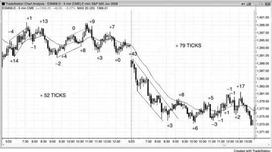
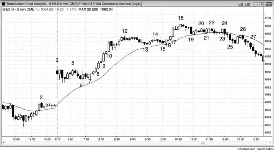
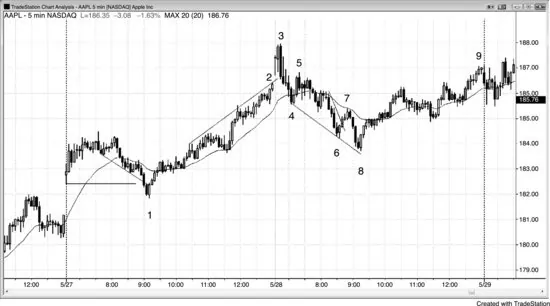
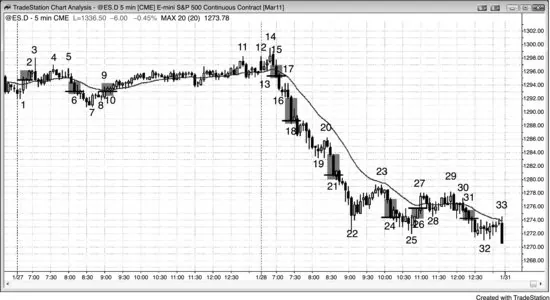
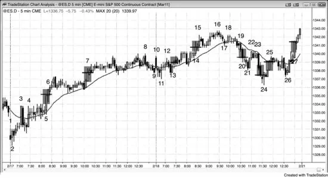

# 第 15 章：始终持仓

<!-- Source PDF pages 297–318 -->
<!-- English: Chapter 15: Always In -->

<!-- PDF page 297 -->

第 15 章
始终持仓这可能是交易中最重要的单一概念。交易者应持续评估市场是否在趋势中，「始终持仓」方法可帮助交易者做出这一重要判断。若你必须始终在市场中，要么做多要么做空，始终持仓仓位就是你当前的仓位。许多交易者包括机构使用某种变体。例如，多数共同基金通常始终做多，多数对冲基金保持接近满仓，但常在某些市场始终做多、同时在其他市场始终做空。若个人交易者倾向于错过太多大行情，应考虑使用始终持仓方法。

判断始终持仓方向不同于问趋势是上还是下，因为多数趋势交易者在市场不清晰时不持仓。市场在任何时候要么始终做多要么始终做空，通常对趋势方向有普遍共识。一天做 20 笔或更多交易的交易者看到始终持仓仓位全天反复翻转，但极少有交易者能日复一日如此频繁反手。然而，只寻找一日最佳三到 10 个摆动、并愿意允许多次回撤而不改变对当前摆动方向看法的交易者，有始终持仓心态。他们可以在每个新信号反手，或在摆动开始减弱时止盈，然后寻找任一方向的交易。极少交易者真正整天留在市场中、在每个相反信号反手。多数交易者需要在白天休息，他们难以下反手单。虽然他们会做许多始终持仓反转形态，他们通常把每一笔当作波段交易，在寻找相反方向交易前离场。他们更专注于赚取至少与风险一样大的利润，而不是在下一个相反信号反手，并把始终持仓信号用作入场形态。一般而言，若信号足够清晰成为始终持仓反转，交易者应假定它至少有 60% 确定性到达至少与风险一样大的止盈目标。即便始终持仓信号的最低标准是市场更可能朝新方向而不是旧方向走，这暗示只需要 51% 确定性，多数 <!-- PDF page 298 --> 此类信号有 60% 或更高确定性。例如，在 Emini 中，若交易者需要用两点止损做交易，他们应使用至少离入场两点的止盈目标，若他们正确读懂价格行为，很可能至少有 60% 成功机会。

若交易者此刻看图并被迫立即建立仓位，要么空要么多，且他们至少可以略微偏向一个方向或另一个，则他们看到始终持仓仓位。这是至少短期趋势的方向。若他们无法形成看法，他们应看均线以及导致当前不确定状态的行情（记住，不确定意味着市场处于震荡区间）。若最近K线多数收盘在均线下方，始终持仓仓位可能是做空。若多数在上方，始终持仓可能是做多。若通向震荡区间的行情是反弹，始终持仓仓位可能是做多。若是抛售，始终持仓可能是做空。若你希望回撤买入，始终持仓仓位可能是做多。若你希望反弹做空，始终持仓可能是做空。若你完全无法决定，则市场处于震荡区间，你寻找低买高卖。你的目标是与市场在做的事同步。就像你还是孩子时，两个朋友在甩跳绳而你准备跑进去开始跳。你会紧张地看它以感觉节奏。一旦你合理有信心，你开始跳。对交易，一旦你对市场去向合理有信心，那就是跳入的时候。

一些交易者用更高时间框架图判断始终持仓方向。例如，若他们交易 5 分钟图，且 60 分钟图处于多头趋势并在均线上方，他们将只在 5 分钟图上寻找买入形态。其他人在更高时间框架图上以同样方式使用指标。例如，若 60 分钟随机指标在上升，他们将只在 5 分钟图上寻找买入回撤。一些交易者对在 5 分钟图上评估一天 10 到 20 次反转感到不舒服，反而更喜欢一天可能只有三到五个决定的更高时间框架图。这是有效方法，但由于K线更大，止损也必须更大，意味着仓位规模应更小。

甚至在开盘前，交易者有偏见：昨日最终始终持仓仓位可能仍在控制市场。然而，一旦有两根连续合理强的同方向趋势K线，它们可能创造新的始终持仓方向。在有突破然后跟随之前不确定，但它是起点。若背景合适， <!-- PDF page 299 --> 它可以导致交易，如在第一次回撤入场。有大量经验，交易者理论上可以整天留在市场中，在每个合理信号反手。

市场始终在试图反转，常非常接近，但缺乏交易者需要以确信反转成功的那最后一点跟随。这些接近翻转是顺势交易者的绝佳机会。例如，若有多头趋势形成强空头突破K线，许多多头会买入该K线收盘，预期不会有跟随卖出。他们正确相信多数反转尝试失败，这将是以绝佳价格买入的短暂机会。其他多头会等待看下一根收盘什么样。若它不是空头收盘，他们会买入收盘，其他多头会在其高点上方以及强空头K线高点上方买入，那里空头可能有保护性止损。当空头得不到他们需要的立即跟随时，他们会买回空单。多头与空头都在买入，市场上行至少几根。空头不愿做空，直到出现另一个合理形态，那常发生在新趋势高点之后。当初学者看到那个强空头尖峰时，他们害怕。他们认为市场在突破，需要立即做空。他们只看到非常强的空头K线，突然忽略了在它之前的强多头趋势。他们最终在失败突破尝试低点附近一两个 tick 做空，并在市场回升时被止损。常地，反弹看起来弱，因此他们不买入。他们继续寻找卖出 Low 1 或 Low 2 做空，预期那个强空头尖峰后有跟随，但 Low 1 失败，他们的止损被打到。然后 Low 2 失败，他们连续第三次亏损。这是因为他们不理解市场始终做多意味着什么。它意味着多头趋势仍有效，虽然它几乎翻转为始终做空，但它没有。直到它翻转，交易的唯一方向是做多。持续押注反转会成功是代价高昂的错误，因为 80% 不会成功。

始终持仓是波段交易方法。要有效，交易者应只寻找一日最重要的三到多达 10 个摆动，不要在每个次要信号反手（许多日子有 20 或更多反转，但多数太小而无法盈利交易）。此外，多数交易者在交易朝他们有利方向移动约两到三倍初始风险的距离后离场部分或全部仓位，他们不担心每时每刻都在市场中。当机构开始止盈时，结果是回撤到这些机构将在趋势方向重新入场的水平，导致趋势恢复。当强趋势过渡到 <!-- PDF page 300 --> 震荡区间时，始终持仓仓位常保持不变。若交易者要在震荡区间中交易，他们应剥头皮多数或全部交易。然而，若始终持仓仓位不变，他们应考虑只在趋势方向剥头皮。例如，若有强空头趋势开始向上调整，但没有强多头尖峰且市场保持在均线下方，始终持仓仓位将保持向下。即便市场处于震荡区间，交易者应只在趋势方向寻找剥头皮，意味着他们应寻找做空。若有强买入形态，它可能使始终持仓仓位翻转为做多，至少足够做剥头皮的几根。然而，任何不够强到使始终持仓方向翻转为向上的买入形态一般不值得交易。

由于这是波段方法，当市场处于窄幅震荡区间时交易者不应使用它。事实上，多数交易者那时不应交易，而应等待突破或失败突破。任一都可以导致始终持仓波段交易。若有经验、盈利的交易者想在窄幅震荡区间中交易，他们应要么做窄幅震荡区间形成前存在的始终持仓交易并持有波段利润，要么简单地用限价入场剥头皮，fade 区间极端以及前一根上方与下方的突破。

在震荡区间日，始终持仓反转常直到市场接近区间另一端才清晰。例如，常直到有冲到区间顶部的多头尖峰才清晰做多，常直到有冲到区间底部的强空头尖峰才清晰做空。然而，在区间顶部附近买入并在底部附近做空正好与交易者应做的相反。始终持仓是适用于趋势的波段概念，在震荡区间内危险，在那里更好的是剥头皮并低买高卖。例如，当市场移向区间顶部时，会有区间内摆动高点上方的突破，可能使一些交易者认为市场在翻转为始终做多，但通常摆动高点不够重要，突破与跟随不够强以说服所有人市场已翻转。若你在看上行并纳闷它是否真正翻转为始终做多行情，则你不确定。由于不确定性是震荡区间的标志，你有了答案。趋势创造持续紧迫感。你确信市场还有更多空间，你绝望地希望回撤以便更低买入。

<!-- chunk continuation: 23-ch15-always-in -->

<!-- PDF page 301 -->

交易者意识到，若上行是新多头趋势而不仅仅是震荡区间中的短暂尖峰上行，行情会有一系列强多头K线，不会在每个摆动高点上方后停顿。共识只有在市场强突破整个区间上方并有跟随时才形成，而不是仅有区间内朝顶部或底部的急剧运动。初学者害怕行情可能所剩不多，但有经验的交易者知道从震荡区间的强成功突破通常至少到达等幅运动目标并提供充足利润空间。

在震荡区间日，最强空头尖峰常因卖盘真空在当日低点附近形成。强多头预期测试震荡区间低点，因此当市场接近低点时他们停止买入。这创造失衡，市场在空头尖峰中迅速下跌。此外，动量程序会感觉到加速，他们也会迅速做空，直到动量减缓或反转。若交易者只看当前下行段，他们会看到强空头尖峰并假定始终持仓交易刚变成强做空。然而，若他们退后看整张图，他们会对可能的卖盘真空起疑。与其寻找做空，他们会寻找买入失败突破尝试。

那么交易者需要看到什么才能选择始终持仓方向？几乎所有始终持仓交易在交易者有信心前都需要尖峰。交易者想看到足够强的突破以预期跟随。突破强度迹象在第二本书中讨论。通常必须至少有两根连续强多头趋势K线，多数交易者才会相信始终持仓方向是做多；至少两根连续强空头趋势K线，他们才会认为始终持仓是做空。在第一小时、清晰趋势建立前，两根连续多头趋势K线会使交易者寻找买入剥头皮，两根连续空头趋势K线会使他们寻找卖出剥头皮。这在第 19 章关于开盘交易中讨论。

若背景合适，即便单根平均波幅的趋势K线也足以使交易者相信始终持仓仓位已翻转到相反方向。通常，然而，需要至少两根或更多连续趋势K线，才有足够多交易者相信方向已反转从而有显著跟随。正如逆势交易者可能愿意扛过一次回撤但不愿意扛两次（例如，买入底部时，若 Low 2 触发，多头会离场并有时反手做空），始终持仓交易者一般更喜欢看到第二根连续强趋势K线才觉得始终持仓仓位已反转。

由于通常需要第二根趋势K线让交易者相信始终持仓仓位已反转，该趋势K线的收盘很重要。

<!-- PDF page 302 -->

例如，若有空头突破K线，交易者会仔细看下一根收盘。空头想要空头收盘，多头想要多头实体。市场有惯性，因此多数试图改变其行为的尝试会失败。这意味着许多交易者会买入空头突破K线收盘，预期跟随K线会有多头收盘且空头会放弃。若突破不太强且有好理由相信突破应失败（如多头旗形底部的突破尝试），这可以是好交易；但由于决定困难，只有有经验的交易者应考虑它。多头想买入回撤，因此他们寻找 fade 空头尖峰。他们把空头尖峰看作站在市场错误一侧的空头的承诺，因此将不得不带着亏损买回空单。此外，那些空头至少一两根内不会再寻找卖出，因此进入市场的空头更少。这增加买入该空头尖峰的多头获利的机会。类似地，当市场始终做空时，空头把小段顶部的多头尖峰看作绝佳做空机会。他们假定多头会被困并很快必须在带着亏损平多时成为卖家。

若跟随K线很强，交易者可以在该K线收盘或小回撤上入场。例如，若有强多头突破且下一根是强多头趋势K线，许多交易者会在该跟随K线收盘买入，或在一两个 tick 回撤买入。若跟随K线弱，如十字星，通常更好的是寻找买入回撤而不是该K线收盘。若跟随K线只走出突破K线外几个 tick，几率偏向失败突破。若它走出许多 tick 之外，几率偏向该K线一旦收盘成为强趋势K线。多数交易者会认为市场有清晰始终持仓方向。有时市场只走出突破K线外几根，然后在与突破方向相反的通道中安静反转，从未清晰确认突破失败且始终持仓方向已翻转。在这种情况下，对多数交易者始终持仓仓位可能未变，但他们会有保护性止损，若回撤走得太远则出局。市场很可能进入震荡区间，因此他们会转为震荡区间交易模式，意味着剥头皮且不允许赢家变成输家。例如，若有多头突破后跟几根弱跟随K线，然后市场开始形成弱空头通道而从未有空头尖峰，市场可以保持始终做多。然而，多头应有保护性止损，以防空头通道在没有清晰空头反转的情况下跌得很远。若多头早期买入并有大浮动利润，他们可以把止损放在保本。若他们晚买入，他们应 <!-- PDF page 303 --> 可能在信号K线下方离场。一般而言，若跟随弱，交易者不应在高点附近买入，而应等待买入回撤。若他们确实在顶部附近买入，他们只能因为感觉到紧迫性才这么做。若没有立即跟随证明紧迫性存在，他们应离场并寻找在回撤买入。

作为指引，始终持仓翻转为做空的最低要求通常是跟随K线没有多头收盘。若它是小空头K线或十字星，这对多数交易者确认空头在控制，但它是新空头趋势不强的迹象。更好的是寻找卖出反弹以及 Low 1 与 Low 2 形态，而不是卖出K线收盘。若跟随K线有强多头实体或是多头反转K线，这可以是失败突破做空的买入信号。若它有小多头实体，多数交易者会等待更多证据再做空，但相信新趋势的机会小得多。当市场突破进入可能的始终持仓多头时，情况相反。跟随K线的最低要求通常是它没有空头收盘。若跟随K线不令人印象深刻，则寻找买入回撤而不是买入该K线收盘。若跟随K线有空头收盘，突破可能是多头陷阱，这常是失败突破做空的信号K线。然而，偶尔市场可能已翻转为多头趋势，但交易者在得出该结论前需要更多确认。

一旦交易者确信突破有跟随，他们然后会寻找等幅运动。例如，若有持续三根并突破震荡区间上方的强多头尖峰，许多交易者会相信很可能有基于尖峰高度或震荡区间高度的等幅上行，许多人会立即至少市价买入小仓位。由于他们有信心，他们对等距运动的方向概率至少 60% 确定（在第二本书讨论），每当如此时，数学偏向做交易。随着尖峰继续，风险保持不变，等距运动的方向概率将保持在 60% 或更好，但回报增长，这使交易在数学上甚至更好。若他们在高盛（GS）强三根尖峰顶部买入且尖峰高 1.00 美元，至少有 60% 机会市场会在跌 1.00 美元到尖峰底部之前上行等幅 1.00 美元。若尖峰在接下来几根增长到 1.50 美元，他们仍冒风险到尖峰底部（他们此刻可能已收紧止损），现在等幅运动目标是当前K线上方 1.50 美元、入场上方 2.00 美元。他们现在至少有 60% 机会在亏损不超过 <!-- PDF page 304 --> 1.00 美元前赚 2.00 美元，意味着他们的交易非常强。若尖峰继续增长，概率会保持良好且回报继续增长。随着交易者收紧止损，风险缩小，交易在数学上变得甚至更好。一般而言，每当市场清晰始终持仓且交易者用交易者公式评估交易时，他们应假定概率至少 60%。

市场通常在第一小时某个点进入始终持仓模式，许多交易者喜欢在那时做始终持仓交易。一些人一旦市场朝他们有利方向移动一到两倍于风险的距离就止盈。例如，若他们在苹果（AAPL）买入始终持仓入场且初始保护性止损在入场价下方一美元，他们会在一或两美元利润后试图离场部分或全部交易。其他人更喜欢持有仓位直到有清晰反转且市场已翻转为相反方向的始终持仓。然后他们会反手仓位并真正始终留在市场中。由于多数交易者没有能力在每个次要反转翻转，他们反而只寻找一日最强的两到五次反转。有时会有回撤只是不断增长，但未清晰创造始终持仓反转。例如，若市场有强多头尖峰且市场清晰始终做多，但然后有持续数小时的低动能回撤，交易者需要重新评估其前提。他们应在市场中保持最坏情况保护性止损，以防回撤继续增长到市场跌破入场价的程度。它有时会在从未有清晰空头尖峰与始终持仓卖出信号的情况下这样做。若他们有几个 Emini 点的浮动利润，他们可能不想让市场回到入场价，他们可能选择使用保本止损。若他们被止损，他们可以等待并寻找任一方向的始终持仓交易。若市场在他们有任何有意义利润前几分钟内回撤，他们的保护性止损应在多头尖峰下方，即便它可能很远。若它很远，他们的仓位规模必须足够小以保持风险在正常限制内。

一旦你相信市场已成为始终持仓，通常最好至少市价或在微小回撤上入场小仓位。当始终持仓方向清晰且强时尤其如此。当动能低且没有那种紧迫感时，一些交易者更喜欢在更大回撤上入场。然而，他们冒错过行情的风险，因为许多绝佳始终持仓交易以低动能开始，但它们只是继续走，直到许多根与许多点后才有回撤。一般而言，每当市场始终做多时，交易者会把空头每一次试图把市场转下的尝试看作买入机会，因为他们知道多数试图反转趋势的尝试会失败。

<!-- chunk continuation: 23-ch15-always-in -->

<!-- PDF page 305 -->

他们会在任何空头趋势K线收盘处及附近、前一根低点或任何先前摆动低点处及下方、以及所有支撑位如下方多头趋势线买入。当市场始终做空时，交易者会把多头每一次试图把市场转上的尝试看作卖出机会，因为他们正确假定多数此类尝试会失败。他们会在任何多头趋势K线高点附近、前一根高点、任何先前摆动高点、以及任何阻力位如空头趋势线做空。

由于你在始终持仓交易期间做波段，你必须允许回撤，它们不可避免。多数回撤不是反转入场，因此你不能允许自己不断担心每一个对你仓位不利的运动。一般而言，若有本会打到保本止损的回撤，然后市场朝你有利方向恢复几根，它不应再次回到你的入场价。因此，在多数情况下，你然后可以把止损移到保本。若它被第二次回撤打到且你不确定市场方向，就保持空仓直到你对另一个始终持仓形态感到自在。记住，不确定性是震荡区间的标志，始终持仓是趋势方法。

若你相信有始终持仓方向，你不应做逆势交易。这是因为它们几乎肯定必须是剥头皮，意味着风险可能大约是回报的两倍，成功机会必须是不现实的 70% 或更高。若你认为会有回撤，在数学上远更好的是等待在回撤结束时按趋势方向入场，而不是押注回撤足够大且数学上足够确定让你做盈利逆势剥头皮。

我有一个朋友，他每天前几小时耐心等待始终持仓形态，当他找到一个时，他预期趋势至少持续几小时并覆盖至少平均日波幅的三分之一。一旦他看到始终持仓形态，他入场市场，然后挂括号单，止损在信号K线外，止盈限价单在某个等幅运动目标或支撑阻力区域，至少是止损距离的两倍。由于他做始终持仓入场，至少等距运动的概率是 60% 或更好。若他在 Emini 中冒两点风险，则他至少有 60% 机会在保护性止损被打到前赚两点。然而，当他冒两点风险时，他的止盈目标始终是四点或更多，且以始终持仓入场，他的成功概率可能至少 50%。虽然概率永远无法 <!-- PDF page 306 --> 确定地知道，对他许多入场可能超过 60%。然而，他像许多交易者一样，不想在小反转常见的日中交易。那么他在等待交易生效时做什么？他去办事或出去锻炼。他几小时后回来，此时寻找进入收盘的始终持仓交易。

什么构成强始终持仓市场？由于始终持仓只能在有趋势或至少潜在趋势时发生，寻找趋势与反转中的强度迹象。本书开头（导论）有列表。存在得越多，你越可能获利。明显的一个是强尖峰，尤其若持续几根。例如，若开盘有强向上反转且此刻尖峰由三根合理大小多头趋势K线组成，交易者在市价买入并在微小回撤买入。他们不想等待回撤，因为他们更确信市场在接下来几根某个点会更高，而不是会有回撤。这种紧迫性是完美的始终持仓情况，若你没有做多，你应考虑至少市价买入小仓位，或在K线高点下方几个 tick 的限价单买入。你可以看到止损必须在哪里，可能在反转入场K线低点。若那意味着你必须冒八点风险而你通常只冒两点，则只取正常仓位的四分之一。对你最重要的考虑是你必须做多，即便是微小仓位，因为你确信市场会走高。若你相信当日正在变成强多头趋势日，尝试至少持有部分仓位到当日收盘，除非发展出清晰且强的空头反转。

对股票，保本止损被打到的机会更小，因此更有利可图的是寻找波段交易。通常，在约 0.5% 到 1% 运动或约两倍初始风险后剥头皮三分之一到一半，然后波段持有余额。若市场看起来在对你的交易反转但尚未反转，如在测试当日高点时，再平掉四分之一到三分之一，但始终尝试让至少四分之一运行直到保本止损被打到、有清晰且强的相反信号，或到收盘。趋势常走得比你能想象的远得多。

通过反复回撤持有仓位，直到在目标价离场、有清晰反转形态，或保护性止损被打到。有时回撤剧烈，但不足以触发始终持仓反转，因此坚持你的原始计划，不要因单根对你仓位不利的大趋势K线而沮丧。若你的止损被打到，在有任一方向另一个清晰且强的形态前保持空仓。

<!-- PDF page 307 -->

若有清晰且强的形态，重复过程。若你的交易规模是两张合约且你在反转形态触发时长一张，卖三张。一张使你平掉剩余多单，另两张在这个新的、相反方向开始过程。第一张剥头皮一到两倍风险大小，第二张波段持有。

这一方法的关键是只在有清晰且强的形态时入场或反手。若没有，依赖你的保本止损，即便你可能回吐波段部分的全部收益。若你观察一小篮子股票，几乎每天至少一只会设置可靠入场，允许你建立波段交易。

在白天任何时刻你可能决定清晰有趋势或有清晰反转。你对任何始终持仓交易需要一个或两个。一方在控制摆动，该方向很可能还有更多空间。想想保护性止损会在哪里，计算若你市价入场需要冒的 tick 数。作为一般规则，趋势很可能继续大约相同 tick 数，成功几率好于 50–50，因为你相信有趋势。若你确信市场始终持仓，概率可能 60% 或更多。趋势继续后，你通常能够移动保护性止损并减少风险。此外，若市场自你入场以来已趋势走了很远，你的原始利润目标可以增加，新的保护性止损位置导致新的利润投射。这导致修订评估，利润潜力大于风险，成功概率仍大于 50–50。趋势中波段交易固有的改善数学是它是最佳交易方式之一的原因，尤其对初学者。

有经验的交易者可以用始终持仓方法在趋势方向分批加仓，但这需要对趋势强度评估的信心。例如，若交易者觉得有强多头趋势，他们可能用基于最近平均日波幅的限价单分批加多。若他们交易 Emini 且最近平均日波幅约 12 到 15 点，过去几小时最大回撤只有两点，他们可能在一点回撤买入小仓位，并在低一两点再买（平均日波幅的 10% 到 20%），然后可能在整个仓位再低几两点用止损。若更早回撤是三点，他们可能改为在低三点挂限价买单并在低两或三点再买， <!-- PDF page 308 --> 并对整个仓位用两点止损。若在任何时候市场翻转为始终做空，他们会平仓并寻找做空。分批加仓在第二本书讨论。

图 15.1 始终持仓波段交易

始终持仓交易可以是在趋势日与震荡区间日都盈利的波段交易方法，若震荡区间日有足够大的摆动。如图 15.1 所示，第一日是震荡区间日，始终持仓方法本可以净赚 52 个 tick，或每合约约 600 美元。第二日开始为开盘即趋势空头然后进入震荡区间。始终持仓交易者本可以净赚 79 个 tick 或每合约约 950 美元。交易两手、一手剥头皮一手波段的交易者每天本可以有 10 次成功剥头皮，每合约每天额外 450 美元。听起来看起来容易，但非常难做。

图 15.2 更高时间框架图

<!-- PDF page 309 -->

5 分钟图，如图 15.2 右侧那张，多数日子有 81 根与超过 20 次反转。对做那么多始终持仓方向决定感到不舒服的交易者可以通过减少图上K线数来减少决定数。三张图编号相同。左上是 15 分钟图，左下是每根 10,000 tick。这两张更高时间框架图反转远更少，但仍有几个好信号，足够交易者谋生。由于K线更大，止损必须更大以给交易机会生效。为保持总风险美元与 5 分钟图交易相同，仓位规模必须更小。

图 15.3 跳空高开，然后回撤

如图 15.3 所示，市场大跳空高开，但后跟强空头 <!-- PDF page 310 --> 反转K线，因此当日可能变成开盘即趋势空头日。这是可靠的始终持仓做空形态。然而，交易者知道每当有大跳空高开时可以发展大的多头趋势日，且市场常横盘到下行一小时才有多头突破。因此，即便他们做空，他们愿意反手做多。K线 4 是空头趋势K线，但它有大影线且接下来几根没有跟随。此外，当日第二根是强多头K线而不是强空头K线，交易者会希望看到那作为入场K线。这不像强空头趋势在表现。许多人会在 K线 4 后内包K线上方离场并等待第二次信号，但技术上市场仍始终做空，因为还没有清晰买入信号。有到 K线 5 的小两段上行，市场可能在试图与当日第一或第二根形成双顶。你选择把哪个看作第一个顶并不重要，因为含义相同。一些交易者把第一个顶看作第一根，其他人对第二根赋予更多意义。K线 5 后那根是空头内包K线与第二次卖出信号，但市场再次未能在接下来几根创造强空头趋势K线。再次，空头会把这看作问题。此时，市场在微小区间中已超过 30 分钟，当那发生时，尤其当有大跳空开盘时，市场处于突破模式。交易者会在区间高点上方 1 tick 挂买入止损，并在区间低点下方 1 tick 用止损做空。这是可靠的突破模式情况。

K线 7 是 K线 5 双顶与 K线 4 与 6 双底后的多头 ii 形态。ii 形态是停顿，是一种回撤，因此这是甚至更小的突破模式形态，因为市场同时设置双顶回撤与双底回撤入场。虽然一些交易者会在 ii 形态突破上入场，多数会等待开盘区间突破。

K线 8 前那根是收在 K线 5 高点上方的强多头趋势K线，许多交易者在那个摆动高点上方做多。K线 8 是甚至更大的多头趋势K线与开盘区间突破。此时，交易者看到强跳空高开日突破模式形态的多头突破，并相信市场现在处于多头趋势。由于他们不知道是否会很快有回撤，且他们确信市场不久会更高，他们在市价买入，这正是机构在做的，因此是正确的事。几率很好波幅至少等于最近平均日波幅，且波幅增加很可能由于更高价格。

<!-- chunk continuation: 23-ch15-always-in -->

<!-- PDF page 311 -->

初学者常被突破的迅速与所需止损大小吓到，但他们应学会至少市价入场小仓位并持有到有强卖出形态，如 K线 18 最后旗形反转。若他们在 K线 8 收盘附近买入，理论保护性止损在最近更高低点 K线 7 下方。若这是他们舒适使用的三倍，他们应只买三分之一仓位。或者，他们可以只冒风险到 K线 8 低点下方，因为强突破应有立即跟随。他们被止损的机会更高，但若市场打到止损并转回向上，他们可以再次买入做波段。

K线 9 与 10 也是大多头趋势K线，但因此它们是买盘高潮，连续买盘高潮通常很快后跟更大的横盘到下行调整。K线变小，市场在接下来几小时进入窄幅震荡区间，但从未回撤到均线。它在到 K线 13 与 15 的回撤时试图，但多头如此激进，他们在均线上方几个 tick 有买入限价单。他们如此害怕市场可能不触及均线，他们把买单放在它上方。这是非常强多头市场的迹象。然而，每当强多头趋势中有长横盘调整时，它会突破多头趋势线，可能成为最后旗形，如这里所做。这使多头准备迅速止盈。K线 11、13 与 15 是窄幅震荡区间中的三次下推，可被视为三角形或楔形多头旗形。

跌破震荡区间的连续空头趋势K线不一定会说服交易者始终持仓方向已翻转为做空。跌破 K线 12 后窄幅震荡区间的两根空头趋势K线很小，且没有先前空头强度。交易者没有做空，反而在寻找买入到均线的 20 缺口K线回撤。跌破 K线 14 更低高点的三根空头趋势K线没有创造令人印象深刻的空头尖峰，多头仍在寻找买入到均线的第一次回撤。通向这里没有显著卖盘压力，没有显著空头强度。交易者相信始终持仓方向仍是做多，他们买入到 K线 15 的两段横盘调整。

K线 17 是另一次强多头突破，因此也是尖峰与高潮，但由于它可能是最后旗形突破，它可能失败并后跟趋势反转。多头与空头在已持续 20 或更多根的趋势中寻找大多头趋势K线，尤其若上行来自潜在最后旗形，如这里。交易者把大趋势K线 <!-- PDF page 312 --> 看作高潮式，并怀疑调整可能很快开始。因此，交易者开始卖出。多头卖出多单止盈，空头卖出启动新空单。他们在K线收盘、其高点上方、任何后跟的小K线上（尤其若有空头收盘）以及前一根低点下方卖出。多头与空头都预期至少两段、持续至少 10 根的调整，可能测试潜在最后旗形底部 K线 15。若下行很强，两者都会等待买入。若它是简单两段调整且市场看起来准备反弹，两者都会买入。多头会恢复多单，空头会买回盈利空单。这里，从 K线 14 下行的系列空头K线很可能后跟更低价格，因此收盘没有显著买入。

K线 18 是当日第三次上推（K线 3 与 12 是前两次），以及可能的最后旗形反转，既来自 K线 11 与 16 之间的大震荡区间（三角形），也来自 K线 17 买盘高潮后的两根小K线。它也是第三次上推，K线 14 与 17 是前两次。市场常在太平洋时间上午 10:30 到 11:00 左右回撤，回撤约在上午 11:30 结束。此外，市场全天未触及均线，虽然在 K线 15 接近。下一次回撤可能更深，因为后续回撤常如此，尤其在太平洋时间上午 11:00 左右之后，更深回撤会如此接近均线，几乎肯定必须穿透它，至少一点点。这些因素的组合使有经验的交易者纳闷强多头趋势是否在过渡到震荡区间。也有机会回撤可以变成大的、深回撤，甚至空头趋势，因为到 K线 15 的三角形突破了 K线 6 与 12 之间多头趋势的陡峭趋势线，K线 18 是可能的更高高点趋势反转。许多人在 K线 18 高点两K线反转下方做最终止盈，并寻找至少两段、10 根触及均线的调整，然后才考虑再次做多进入收盘。

K线 19 是强空头尖峰，提醒交易者回撤后可能有空头通道。一些交易者会在最后旗形顶反手做空，但由于市场全天尚未触及均线，会有 20 缺口K线多单在均线入场。因此，始终持仓仓位可能仍是做多。多头假定下一根很可能不会有空头K线，因此他们在该K线收盘买入。多数试图翻转始终持仓仓位的尝试失败，尤其在强趋势中。

<!-- PDF page 313 -->

K线 23 是均线处双底做多入场，但成为两K线向下反转的第一根。一旦市场交易到 K线 24 低点下方，对多数交易者始终持仓仓位翻转为做空。这是多头陷阱与小最后旗形顶（最后旗形突破可以是更低高点）。K线 25 后那根是第一次均线缺口K线做多形态，但趋势现在向下。有强多头趋势K线，但它不是顶部震荡区间下方的失败突破，它未能有跟随，后跟在均线处的突破回撤做空入场，要么在 K线 26 向下外包时，要么在其低点下方（在均线下方均线测试的空头K线下方做空是可靠交易）。

到 K线 27，市场清晰始终做空，交易者在市价做空以捕捉进入收盘的趋势。风险经理在楼层走动告诉他们的交易者必须平掉多单。交易者讨厌那样，因为他们抱着多头趋势会恢复并救他们的希望，但老板不允许他们等待。他们和风险经理按业绩拿报酬，交易者可能对亏损多单有情感依恋，但风险经理的工作是不带情感，并在合理时接受亏损。老板总是赢，结果是进入收盘的空头趋势。趋势被检测强趋势并在下行动量继续时卖入的动量卖出程序增强。

在从 K线 6 到 K线 12 的反弹中，最大回撤只有大约几点。有经验的交易者可能在任何一两点回撤上挂限价单分批加仓，并在低一到两点加仓，可能在最终入场下方两到三点冒风险。若市场翻转为始终做空，他们会平掉多单并寻找做空。若他们在一点回撤买一张并在低一点再加一张，他们会在 K线 13 长两张。他们可以把保护性止损放在低两到三点，或可能均线下方几点。由于这是多头趋势，他们预期至少测试高点，他们可以在市场到新高时在第一张上赚一点利润，然后要么挂限价单在约四点（该入场初始风险约两倍）离场另一张，要么一旦市场在 K线 18 附近停顿——市场可能从 K线 12 到 16 潜在最后旗形设置最后旗形反转——就离场。

图 15.4 寻找早期波段形态

<!-- PDF page 314 -->

交易者应在日初寻找始终持仓交易，因为它们常导致盈利波段交易。此外，有时仅单根强趋势K线就足以使多数交易者相信市场已建立始终持仓方向。在图 15.4 中，从多头通道上方突破向下反转的 K线 3 强空头向下外包K线可能使多数交易者相信会有跟随，始终持仓仓位现在是做空。这一跟随强多头趋势K线的大空头K线是当日高点与开盘即趋势空头形态的合理候选。

AAPL 在 K线 1 有缺口测试，那是在打到当日新低并跌破空头趋势通道线后向上反转的强反转K线。这是到收盘几乎净赚 4.00 美元的波段做多绝佳入场。跳空高开是尖峰，K线 1 是导致在 K线 3 见顶的通道的回撤。一些交易者假定始终持仓仓位在 K线 1 上方已翻转为做多，其他人在随后两根多头趋势K线任一期间得出该结论。五根多头尖峰抹去了通向 K线 1 低点的五根空头尖峰。这是高潮式反转，几率偏向至少第二段上行。

到 K线 7 的四根多头尖峰很强，但到 K线 6 的四根空头尖峰更强。多数交易者仍相信始终持仓仓位仍是做空，他们想在寻找做多前看到更高低点或更低低点回撤。

K线 8 是楔形多头旗形中的向上反转，以及 K线 1 上方的更高高点。若你只是平掉空单而不是反手做多，交易本可以净赚约 2.40 美元。许多交易者相信始终持仓仓位在市场越过 K线 8 上方时翻转为 <!-- PDF page 315 --> 向上，更多人在随后多头趋势K线中变得确信。到 K线 7 上行上的先前多头强度是买盘压力的迹象，它给多头信心：在这第二次试图把市场转上时买入可能甚至更强。

当市场需要再一根才能翻转始终持仓方向时，交易者常 fade 该行情，预期那根不会出现。例如，若 K线 5 是强多头趋势K线，许多交易者会把始终持仓做空仓位改为做多（多数在从 K线 3 下行五根后认为市场始终做空）。因为他们知道多数试图翻转方向的尝试失败，他们会在 K线 5 前多头趋势K线收盘做空，预期 K线 5 不会是强多头K线且空头摆动会恢复。

图 15.5 跟随常很可能

每当交易者对接下来几根的方向有信心时，就有交易机会。图 15.5 中每个灰色矩形是交易者相信会有跟随的区域。每个框内小水平线在多数交易者分享该信念的价格处，虽然许多交易者更早有信心。当趋势强时，如从 K线 14 的抛售，通常有几个连续突破，交易者在那里发展出新的信心。

虽然一些交易者是严格始终持仓交易者并整天做多或做空留在市场中，多数沿途止盈，每当他们相信市场失去方向时离场。交易者一般会在相反方向信号上离场交易，即便该信号不够强让他们反手。记住，说服交易者是时候平多所需的比让他们做空所需的更少。

<!-- chunk continuation: 23-ch15-always-in -->

<!-- PDF page 316 -->

在 K线 1 收盘或其高点上方 1 tick 买入的人被大 K线 3 空头反转K线担心，尤其因为开盘反转可以有长期跟随。单独 K线 3 不太可能足以让多数交易者认为市场始终做空，但许多人会在 K线 4 小楔形空头旗形更低高点下方平掉多单或反手做空。其他人会在该空头旗形的 K线 5 第二次入场突破回撤下方平掉多单或反手做空。多数交易者会在跌破 K线 5 的空头K线收盘、其低点下方 1 tick，或 K线 6 收盘时认为市场始终做空。

从 K线 7 当日新低的强向上反转对空头是担忧，因为这是另一次开盘反转与可能的当日低点。从 K线 3 有两根尖峰下行，K线 7 是可能尖峰与楔形通道中的第三次下推，其中 K线 3 后那根是第一次下推，K线 6 是第二次。一些空头会在 K线 7 上方离场，多数会在 K线 8 更高低点上方出局。K线 7 是从 K线 5 的微型通道上方突破，K线 8 是突破回撤买入信号。许多交易者在 K线 8 上方看到市场翻转为始终做多，多数在市场在 K线 10 多头 ii 形态上方反转时确信，那也是失败的 Low 2 做空。他们相信空头旗形失败，市场会基于 K线 7 到 K线 9 空头旗形高度至少等幅上行。

在从 K线 14 的自由落体中，有几个其他区域交易者发展出市场会在随后几根跌得更多的新信心，如 K线 18 收盘、其后内包K线下方 1 tick，以及 K线 18 低点下方 1 tick。即便 K线 18 后内包K线有多头实体，交易者仍觉得趋势向下且该K线可能是 Low 1 做空形态。在 K线 21 与 24 也是如此。做空的交易者公式极佳，即便概率感觉只有 50%。它实际上至少 60%，但交易者常害怕并处于否认，得出等距运动概率只有 50% 的结论。这给他们看似合理但错误的理由不做交易。他们应市价做空「我不在乎」大小的仓位，使用任何合适大小的保护性止损，如最近大空头趋势K线高点上方，然后通过回撤持有直到有清晰买入形态，如 K线 25 更低低点主要趋势反转。若风险是正常的四倍，交易不超过正常规模的四分之一。若他们仍害怕，只交易正常规模的 10%。当机构如此激进做空时做空很重要，因为失控趋势有最强的交易者公式。

<!-- PDF page 317 -->

图 15.6 始终持仓形态

如图 15.6 所示，有几个区域交易者对至少接下来几根的方向有信心，每一个都是始终持仓交易的合理入场。激进交易者会更早入场并做更多反转交易，但高亮区域是多数交易者对始终持仓方向有信心的地方。

在 K线 14 收盘或其后十字星 High 1 上方买入的交易者会对 K线 16 更高高点的第二次入场做空担忧。这也是 K线 14 尖峰后通道的潜在顶部，从 K线 11 到 K线 16 的整段行情可能是潜在 K线 7 到 K线 12 最后旗形后的更高高点。多数多头会在 K线 16 下方离场，激进交易者会做空，认为这是合理的始终持仓翻转。只寻找一天三到五次反转的更保守交易者会等待 K线 19 或 K线 20 的强空头收盘，然后才认为市场始终做空。

当交易者有信心时，他们应假定至少 60% 确定。若风险约两点，他们需要至少两点的止盈目标才有有利交易者公式。这意味着他们可以在这些区域每个附近寻找入场，入场后挂括号单离场。止损可以离入场价两点，止盈限价单也可以离两点。若市场接近止盈目标但然后反转，如 K线 7 收盘后的反弹，他们可以收紧止损。在这种情况下，他们会在两K线反转下方大约保本离场。一些交易者不会调整止损，会持有直到前提清晰不再有效， <!-- PDF page 318 --> 沿途允许回撤。其他交易者在认为信号足够强时会尝试三或四点止盈目标，如买入 K线 5 或 K线 6 任一收盘、买入 K线 13 突破回撤上方（来自 K线 9 与 11 High 2 多头旗形）、在 K线 16 小楔形顶下方做空、在 K线 20 收盘做空、在 K线 22 与 23 小 Low 2 突破回撤下方做空，或在 K线 26 突破回撤上方买入。一些交易者会把那些看作最强形态，因此可能 70% 确定在打到两点剥头皮前到达两点止盈目标。他们然后只会做两点，知道数学非常强。

由于多数交易者到 K线 6 认为市场始终做多，他们预期试图把它翻转为做空会失败。他们然后寻找买入强空头趋势K线收盘，如 K线 6 后四根形成的那根，以及 K线 7 前两根测试均线的那根。
