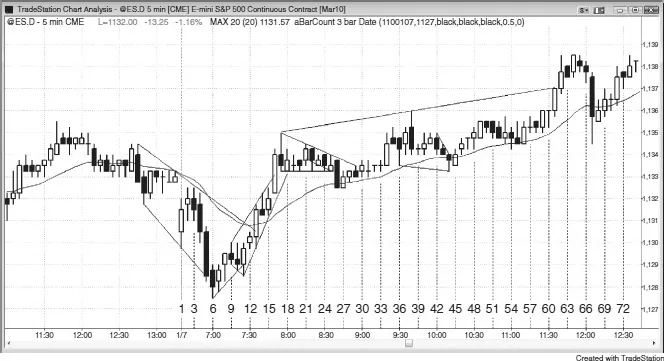

# 第 16 章：极端剥头皮

<!-- Source PDF pages 319–333 -->
<!-- English: Chapter 16: Extreme Scalping -->

<!-- PDF page 319 -->

第 16 章
极端剥头皮

有高频交易公司在 4,000 只股票篮子上每天做数千万笔交易，每笔只剥头皮一美分利润。那种剥头皮形式极端到了极点，但没有紧邻交易所的超级计算机的普通交易者无法指望做到。我有一个朋友是 Emini 中的极端剥头皮者，每天约下 25 笔单，每笔剥头皮两个 tick。我从未能让他告诉我他是否使用保护性止损或允许多大亏损。他也从未清楚回答我关于分批加仓的问题。一些交易者抗拒过多透露他们做什么。我不确定是因为不切实际地害怕世界会复制他们、他们的系统不再有效，还是他们会尴尬让人意识到他们做很多交易但每天仍只净赚几点。然而，他说他每笔交易约一百张合约。一位共同朋友告诉我他去过他 200 万美元的房子，我相信他一年赚超过一百万美元。

虽然我认为这对极少数有允许他们这样做的性格的人是可能的，但对多数交易者实际上不可能，因此多数人绝不应尝试。一般而言，由于剥头皮通常要求风险大于回报，胜率必须至少 70% 才能持续盈利。这对多数交易者、即便非常成功的交易者都不现实。然而，有些人可以靠剥头皮谋生。但多数交易者应只做回报至少与风险一样大的交易，因为至少 60% 的所需胜率现实得多。甚至更好，交易者应专注于回报至少是风险两倍的交易，因为那样即便只赢大约一半时间也能赚钱。

即便交易者应专注于波段，他们可能惊讶地发现 5 分钟图上有远比他们想象更多的剥头皮形态。然而，仅仅因为形态存在不是做交易的充分理由。事实上，几乎没有人应试图做平均日 5 分钟图上存在的 30 到 40 次剥头皮，因为足够准确快速读图以这种方式盈利交易非常困难。约

<!-- PDF page 320 -->

三分之一形态是止损入场，约三分之二是限价入场。这对所有市场与所有时间框架成立；约一半K线有合理剥头皮形态。展示极端剥头皮的例子是展示你面前整天有多少微妙价格行为信息的好方法，它可能帮助你增加专注。一些交易者可能能够一次做一两个小时，但多数应寻找两到四点波段。

有许多时候剥头皮者可以通过在当前价格买入或卖出赚钱，只要他们正确管理交易。这对所有交易成立，初学者可能觉得惊讶。例如，若 Emini 中已确立的多头趋势有大多头趋势K线且很可能有跟随，交易者可以在该K线收盘附近买入并冒约三点风险以允许可能的回撤。若市场直接到他的目标，他们可以带利润离场。若它反而回撤五到 10 根但未打到止损，他们可以扛过回撤等待趋势恢复，然后在原始目标止盈。许多有经验的交易者会在回撤期间与多头旗形突破上分批加仓。一些人会持有全部仓位直到市场到达原始目标，在那里止盈。其他人可能选择在原始入场离场，第一笔保本出局，后续入场带利润。空头本可以在多头买入的完全相同价格做空，预期大K线代表衰竭。若市场在接下来几根抛售，空头会带利润离场。若市场反而再上行一两根，他们可能分批加仓并再卖，可能冒与那根大多头趋势K线 tick 数一样多的风险。例如，若K线高 12 个 tick，他们可能在高四或八个 tick 加空，并对整个仓位从原始入场冒 12 个 tick 风险。若市场在他们分批加仓后转下，他们可以在原始目标或原始入场平掉全部仓位。若在原始入场离场，他们在晚期入场上获利，第一笔保本出局。多头与空头剥头皮者因此可以在完全相同时间入场赚到剥头皮利润，但方向相反。关键是资金管理。

图 16.1 极端剥头皮

<!-- PDF page 321 -->

图 16.1 所示 5 分钟 Emini 图说明极端剥头皮。一日有 81 根，图上每第三根编号。若交易者想用两点止损剥头皮 1 点，今日至少有 40 次机会。记住，用止损入场的交易者通常需要信号K线外六 tick 运动才能用止盈限价单剥头皮四 tick 获利。

K线 1 是多头反转K线，以及昨日收盘空头旗形下方可能的失败突破。然而，它顶部有两个 tick 影线，高点只在昨日收盘与均线下方四个 tick，因此可能没有足够空间做买入剥头皮。在 K线 1 上方买入的交易者看到入场K线弱收盘，许多人会在保本附近离场。

K线 2 是十字星，它无法收在 K线 1 上方。这是多头弱势与空头强势的迹象。这一根反弹本可能发展成突破回撤，本可能后跟另一段下行。交易者本可以在 K线 2 下方 1 tick 挂单做空。

K线 3 没有成交做空单，但它有空头收盘且未能走到 K线 2 上方。它因此与 K线 2 形成双顶，刚好在均线下方，本可能导致下行段。交易者本可以在该K线收盘做空并在其高点上方离场或在那里反手做多，或在其低点下方 1 tick 用卖出止损做空。这也是在 K线 2 做多入场K线下方 1 tick 做空。那些多头中许多很可能

<!-- PDF page 322 -->

在这个精确位置（入场K线下方）离场，给下行加力。若触发，这会创造突破回撤并很可能导致向下摆动。交易者可以考虑剥头皮一或两点、波段持有全部仓位（他们会净赚六个 tick），或部分剥头皮（可能一半）部分波段，希望波段部分赚三或四点。

K线 4 入场K线是强空头趋势K线，很可能至少形成当日新低。市场试图突破 K线 1 上方但失败，现在试图跌破其低点下方。由于市场在均线下方且从昨日空头旗形跳空低开，空头很强，可以创造好的向下摆动做等幅运动。K线 2 本可能最终成为当日高点，当日本可能变成强空头趋势日。有这种空头强度，交易者本可以在 K线 2 做多入场K线下方空头收盘再做空，或在 K线 4 低点下方用止损，或在跌破 K线 1 到当日新低时。

K线 5 在跌破 K线 1 下方时扩展成大空头趋势K线。这本可能是空头增加强度的迹象或高潮式卖出。由于该K线刺破空头趋势通道线下方，若市场从那里向上反转，本可以至少有两段上行。此外，由于那是从昨日低点下方第二次试图向上反转，且也会是楔形反转，本可以形成当日低点。交易者本可以在该K线收盘做空，但若他们做了，他们必须准备若市场在这里停顿则在保本附近离场，并必须准备反手做多。开盘跳空低开然后回撤到均线，现在卖盘高潮。这本可能是尖峰与高潮底部，由于约 90% 的日子当日高点或低点在前 90 分钟左右形成，交易者必须把每一个可能的早期反转看作可能的当日极端。

K线 6 低点只在 K线 5 收盘下方五个 tick，因此那些在 K线 5 下方做空的空头差 1 tick 未能剥头皮 1 点。此时，他们紧张。他们可能在该K线上方离场，一些人甚至可能反手做多。由于该K线是空头趋势K线，空头仍在控制，多数交易者会继续持空。K线 6 低点也是从 K线 1 高低点的精确等幅下行，以及对两日前强上行的完美突破回测（未显示）。

K线 7 是多头两K线反转。这对空头是问题。多数会试图在保本离场，但愿意承受一两个 tick 亏损。一些交易者会买入多头收盘，作为可能的

<!-- PDF page 323 -->

当日低点与很可能两段上行反弹。其他交易者会在更低时间框架图上入场做多，并在其他类型图如成交量或 tick 图上的反转入场。由于 K线 6 约一半波幅被其前一根与后一根重叠，小震荡区间在形成。逆势交易通常有回撤，因此若交易者在 K线 7 上方买入，他们需要在预期回撤期间持有多单，并希望它形成更高低点。

K线 8 收在高点，因此多头买入K线收盘，表明他们急于做多。然而，到 K线 6 的卖出很强，因此第一次向上反转尝试很可能失败，可能后跟试图把市场打低。替代方案是买入这一强收盘。若交易者相信第二段上行很可能且他们预期沿途有回撤，他们可以寻找在接下来几根任一根低点处或下方一两个 tick 买入，预期失败的 Low 1 与更高低点。

K线 9 是空头反转K线，它无法收在强多头K线 K线 8 高点上方。没有跟随买入。也许多头弱，K线 8 向上反转会失败并在跌破 K线 1 下方的突破上变成突破回撤，因此是 Low 1 做空。由于市场在从楔形底部调整，第二段上行很可能，因此与其在 K线 9 下方 1 tick 做空，已做多的人会持有，止损在 K线 5 信号K线下方。因为它只在当日低点上方 1 tick，他们可能把止损放在再低 1 tick 刚好在当日低点下方。一些尚未买入的多头会等待买入更高低点，若形成。激进多头会在 K线 9 低点挂限价单买入，认为市场可能必须在其低点下方刺探 1 tick 才能使那些做多限价单成交，若市场从那里向上反转，空头会在 1 tick 失败上被困做空，他们会非常急于出局并帮助把市场推高。其他多头会在 K线 9 低点下方一、二或三个 tick 挂限价单做多。所有这些订单都会给市场支撑。若市场在 K线 9 下方刺探 1 tick 然后在接下来几秒反弹两三个 tick，一些在低一两个 tick 有限价买单的多头会把做多限价单上移一两个 tick，因为当他们看到市场未能抛售时会更急于入场。K线 9 是差的 Low 1 做空形态，因此更高低点很可能。市场有强空头尖峰，那是 Low 1 需要的，但它不清晰处于空头趋势中，那也是做空 Low 1 前需要的。此外，交易者不应在卖盘高潮后做空 Low 1，而这可能是一个。

<!-- chunk continuation: 24-ch16-extreme-scalping -->

<!-- PDF page 324 -->

空头把 K线 10 看作空头趋势中的双顶，希望它导致与 K线 2 与 3 双顶后类似的行情。然而，他们担心那个楔形底部，若市场不像日初那样急剧下跌，他们会迅速平掉任何新空单。

K线 11 跌到 K线 9 下方两个 tick 然后急剧反弹。试图在 K线 9 低点及其下方 1 tick 买入的多头很高兴做多，那些想在 K线 9 下方两或三个 tick 买入的人害怕错过机会。他们把限价单改为市价单，导致 K线 11 迅速上行。此外，在 K线 9 下方做空的空头害怕 Low 1 会失败且楔形会有第二段上行，因此他们现在市价平仓，或在 1、2 或 3 分钟K线高点上方，或在成交量或 tick 图K线上方。K线 11 收在过去六根收盘上方（强度迹象），它本质上是可能新多头趋势开始时的向上外包K线。一些多头会买入这一强收盘，因为后跟 K线 7 与 8 的强度且趋势可能已向上反转。它未能有高点高于前一根高点，但低点低于前一根且高点在该K线高点，足够接近让市场像外包K线一样对它反应。此时，它是与前两根的三重顶，若市场未能向下反转反而再高 1 tick，形态会变成失败顶并很可能后跟更多买入。K线 11 也跌破从 K线 6 与 7 的趋势线以及从 K线 9 与 10 的趋势通道线下方，创造小的对决线做多形态。K线 9、10 与 11 形成小扩张三角形，应作为多头旗形而不是反转形态作用，因为第二段上行很可能。

K线 12 突破三重顶与 K线 11 向上外包K线高点上方。即便它是小K线，它到达三重顶上方两个 tick。若它在仅 1 tick 突破后向下反转，交易者会把那看作可能的多头陷阱并寻找平多。空头也会把它作为两段空头反弹做空。一些空头会在该K线下方 1 tick 挂单做空，以防它变成 Low 2 做空。然而，由于其高点如此接近均线，若市场先触及均线，他们会对做空更有信心。许多人在均线被触及前不会寻找做空，因为直到被触及，他们会担心市场可能只是横盘直到被测试。当市场在磁铁一两个 tick 内时，交易者对测试没有信心，除非市场得到那额外 1 tick 并实际触及磁铁。直到那发生，他们通常

<!-- PDF page 325 -->

不会激进地把它当作完成的回撤交易。一些多头会在该K线上方加多，认为这是空头取得控制的失败机会，使市场更可能上行。K线 12 高点在 K线 3 低点下方两个 tick，差 1 tick 未到那些空单的保本止损。若市场在这里抛售，这会创造完美突破回测（完美是因为它尽可能近地测试那些止损而实际未打到）。若市场反而再高 1 tick，这一突破回测会失败；那些剩余空头会平仓，他们的买入会推动市场上行。多头知道这一点，会在那个精确价格挂买入止损加多，以从空头平仓获利。

K线 13 是强多头突破K线，市场突破并收在均线、空头趋势线与强 K线 5 空头趋势K线高点远上方。空头旗形失败并向上突破，交易者会寻找大约等幅上行。若它是成功空头旗形，他们会预期测试当日低点。一旦它失败，他们会寻找它上行大约相同点数。多头会买入这一收盘以测试当日高点。当日波幅只有五点，约是最近平均日波幅的一半，因此市场本可以形成等幅上行或下行。此时，由于空头刚平仓，他们不太可能做空，直到至少再两次上行尝试，那会让多头在接下来几根控制。若要有等幅运动，此时上行比下行更可能。

K线 14 是本可能形成更低高点、失败突破与 Low 2 做空的空头反转K线。然而，因上述理由，K线 13 突破后市场更可能至少有两次上行尝试，因此若这一做空触发，更可能失败，失败会创造突破回撤做多。多头因此会试图买入任何其低点下方的运动。若只在其低点下方 1 tick，形成 1 tick 空头陷阱，激进多头会想买入那一运动。为此，他们会在 K线 14 低点挂限价单做多。这是因为可能没有足够空头在 K线 14 下方做空来成交所有那些做多限价单，

<!-- PDF page 326 -->

除非市场再低一个 tick 或更多。一些多头会在其低点下方一两个 tick 挂限价单。

K线 15 是强多头趋势K线，到达当日高点。空头在 K线 14 下方做空被困，现在在市价买回空单。多头在买入，市场急剧上行。由于它是第二段上行（K线 13 是第一段），可能是双顶，空头会寻找在其高点下方做空，作为失败突破与可能的当日高点。

K线 16 是小十字星，可能是小双顶或失败突破。空头会在其低点下方挂做空止损。多头会在其高点上方挂买入止损，预期突破回撤做多。

K线 17 是空头趋势K线，跌破 K线 16 下方并困住在 K线 15 高点附近买入的多头。这可能是双顶做空与 Low 2。然而，从 K线 6 底部的上行强，市场可能只是在做两段回撤。激进多头会在 K线 17 低点处及下方挂限价单买入，预期失败的 Low 2 与更高低点。

K线 18 是多头趋势K线，从可能的更高低点反弹。多头买入收盘，空头在高点处及上方挂限价单做空，预期双顶或更低高点。

<!-- PDF page 327 -->

市场可能在形成震荡区间，两边都在区间极端寻找入场。K线 18 高点在 K线 15 高点下方几个 tick，差一点点未到双顶。一些空头在 K线 18 高点做空，其他人等待更高。多头在寻找买入回撤。

空头在 K线 17 与 18 低点下方挂卖出止损，多头在 K线 18 高点上方挂买入止损。

<!-- chunk continuation: 24-ch16-extreme-scalping -->

<!-- PDF page 328 -->

K线 19 没有成交 K线 18 高点处的做空限价单，也没有触发 K线 17 与 18 低点下方的卖出止损。相反，现在有 ii 形态。然而多头仍不会买入，空头越来越急于做空。

K线 20 现在是 iii 形态且有空头收盘，偏向空头。聪明资金仍在寻找在 K线 17 下方（iii 下方）以及更低高点做空。

K线 21 可能是人人预期的多头陷阱。它是第二段上行（K线 18 是第一段）并延伸到 K线 18 上方 1 tick，其他错误多头也在那里很可能做多。没有被困空头，因为最保守空头会在 K线 17 下方用止损入场，那尚未发生。市场中现在仅有的空头是希望更低高点多头陷阱的聪明、激进者。他们想要被困多头在市场中，因为若市场下行，这些多头将不得不卖出平多，这会增加卖出。此外，在有被困多头后，多头会想等待更多价格行为再寻找买入。聪明多头已在等待两段调整，因此这里没有认真买入。弱多头错误买入 iii 形态。聪明空头在 iii 形态上方 1、2 与 3 个 tick 做空，保护性止损在 K线 17 高点上方。空头会寻找在该K线下方做空，尤其在强空头反转K线 K线 17 下方。多数空头会等待在 K线 17 下方做空，因为他们把那看作顶部确认。然而，聪明空头只寻找剥头皮，因为上行很强，且当日波幅仍小于平均。此时，若波幅要扩大，上行远比下行更可能。此外，人人相信买盘高潮最可能是停顿，后跟至少再一段上行。这一横盘到下行调整有潜力创造最后旗形然后向下摆动，但那只会在上方突破后发生。

K线 22 把 K线 21 变成更低高点最后旗形做空（iii 下降三角形是最后旗形），但该K线未能延伸到 iii 形态下方并带来在旗形与 K线 17 下方用止损入场的额外空头。此外，该K线收在中部，意味着交易者买入K线收盘，这与若空头在控制时本应发生的相反。

横盘调整在 K线 25 继续，市场在形成窄幅震荡区间，那是突破形态。空头会更喜欢市场在形成一两根内跌破 K线 17 下方，那

<!-- PDF page 329 -->

会表明有卖出紧迫性。市场在横盘调整而不是下行，这是多头强度的迹象。此外，市场现在只在均线上方两个 tick，由于市场可能在那里找到支撑且调整已 10 根长，多头会开始寻找恢复多单。这对空头是问题。他们原本预期高概率空头剥头皮，现在成功机会变小。若空头突破停顿，他们会迅速平仓。K线 25 触及 K线 17 与 21 空头趋势线并创造下降三角形，当它发生在多头趋势中时是多头旗形。然而，若你用K线实体，K线 21 到 25 也在小通道中。通道常有三推然后试图反转，就像楔形。K线 22 与 24 是两次下推，因此可能只有再一次下推，因此三角形向下突破可能失败。

K线 26 是收在低点且在均线下方的空头突破。新空头希望市场再低几个 tick 成交他们的止盈限价单。然而，空头趋势K线只收在均线下方 1 tick，强突破会收在下方几个 tick，正如 K线 13 多头突破收在均线上方几个 tick。它也是开盘高点上方突破的精确测试。即便在 K线 21 多头趋势K线收盘做空的激进空头也尚未能剥头皮 1 点；若市场在这里向上反转，他们会有五 tick 失败并会买回空单。在 K线 16 收盘或其高点上方做空的空头在这里买回空单。多头把 K线 26 看作空头试图把市场翻转为始终做空，但他们知道多数反转尝试失败。他们相信空头需要下一根是强空头趋势K线才能说服交易者市场已反转其始终持仓仓位。由于多头趋势如此之强，他们怀疑空头会成功，甚至不确信空头能把市场推到 K线 26 空头趋势K线低点下方。因此，他们在空头趋势K线收盘买入，并会在其低点下方再买。其他多头会在 K线 17 高点下方七个 tick 有限价买单，因为他们在试图买入多头趋势中两与三点回撤。

K线 27 是多头内包K线，本可能在均线设置 High 2 做多。它本会是持续约 10 根的两段调整，对多头足够长。多头想要到 K线 17 高点的尖峰后的通道上行，这一到均线的回撤本可能是开始。它也会是 K线 2 高点的突破回测。

<!-- PDF page 330 -->

它也可以被看作突破回撤，空头会在其低点下方做空，那也会是 K线 26 空头突破K线低点。空头想要空头实体以增加始终持仓方向翻转为做空的机会。一旦交易者看到多头收盘，他们假定空头失败且始终持仓方向保持向上，他们买入收盘与该K线上方。

K线 28 是第二根多头内包K线并形成 ii 形态。此时，交易者在纳闷震荡区间是否继续、突破是否在更多卖出进入前停顿，或突破是否已失败且多头会再次取得控制。

K线 29 是 ii 形态的多头突破，以及对均线与开盘区间突破的成功测试。然而，它只是 1 tick 突破与小空头趋势K线，很容易设置作为 K线 26 空头突破回撤的做空。空头会在其低点下方挂单做空。然而，过去一小时一直做空的所有空头现在担心市场有机会给他们剥头皮利润却失败了。他们不会再持有空单多久。他们会在 K线 26 空头趋势K线高点上方；K线 23、24、25 三重顶；K线 21 更低高点；K线 17 多头高潮高点；以及昨日高点有买入止损。由于所有这些止损彼此在一两个 tick 内，止损可能在连锁扫止损中迅速被打到，导致空头放弃且多头取得市场控制。

K线 30 打掉 K线 29 高点并突破空头趋势线上方 1 tick，但未能突破 K线 26 做空入场K线上方。这是两段上行，空头会把那允许为从空头突破的可接受回撤，但他们会担心空单表现不好。他们会迅速买回空单。多头知道调整有两段且现在已持续约 10 根，因此他们的最低标准已满足，他们准备激进买入，希望等幅上行到 1,127.50 区域。这足够高让他们波段持有部分或全部新仓位。他们会把那些空头止损中每一个看作买入形态，并会在空头平仓的完全相同价格买入。多头与空头在市场上行时在相同价格买入，市场应加速上行。一些多头也把这一震荡区间看作楔形多头旗形，K线 17 是第一次下推，K线 20 是第二次，K线 26 是第三次。他们也把第三次下推看作由更小楔形组成，K线 22、24 与 26 形成三次下推。

<!-- PDF page 331 -->

K线 32 与 33 是小十字星，是交易者决定扫那些买入止损的迹象。此时，空头开始市价平仓，因为他们知道空单只是逆势剥头皮。他们可能乐于在保本甚至一两个 tick 亏损出局。市场保持在均线上方，在大尖峰上行后，那是看多的。

K线 34 是多头趋势K线，但收在高点下方几个 tick。市场在 K线 17 高点与昨日高点区域找到卖家。

K线 35 给多头剥头皮利润，但形成带 1 tick 当日新高的空头反转K线。一些交易者会在该K线收盘做空，其他人会在其低点下方 1 tick 做空。激进多头不会被回撤困扰，希望它成为突破回撤并导致昨日高点上方运动。只要市场保持在均线上方、K线 26 更高低点上方或 K线 34 多头趋势K线低点上方，他们会继续持多。

在 K线 36 做空的空头担心该K线收在他们入场价且他们无法把市场推到 K线 34 多头入场K线下方。他们会在该K线收盘及其高点上方平掉空单。一些多头会在其高点上方做多，但多数不会，因为那会是在当日已横盘几小时时在当日高点附近买入。买入当日高点只在强多头趋势中是好策略，那不是当前价格行为。

K线 37 是多头趋势K线，但在三根大体重叠的大K线上方买入是不好的。三根创造震荡区间，在震荡区间顶部买入有风险，因为多数突破失败。若有什么，更好的是在那里做空。

K线 38 在 K线 36 做多信号K线上方五个 tick 与昨日高点上方 1 tick 向下反转。许多更早做多的多头很可能在昨日高点有限价单止盈，激进空头也会在那里做空。K线 37 多头在五 tick 上行后很可能把止损移到大约保本，市场跌穿那些止损。K线 38 成为大空头反转K线，但由于它与前四根重叠如此之多，它更多在形成震荡区间而不是反转。这是第二次试图反转开盘高点，因此一些交易者会在这一空头反转K线下方 1 tick 挂止损做空。其他人会寻找做空更低高点。到 K线 38 高点的上行可被看作多头趋势线突破后的两段更高高点，因此是可能的趋势反转。因此，多头

<!-- chunk continuation: 24-ch16-extreme-scalping -->

<!-- PDF page 332 -->

可能等待两段调整再买入。

K线 39 是十字星内包K线。空头仍会试图在 K线 38 低点下方做空，现在其他空头会挂限价单做空更低高点。他们会在 K线 39 高点及其上方一两个 tick 有做空限价单。过于急切的多头会把这看作 High 2 买入形态（K线 37 是 High 1），并会正好在激进空头做空的地方做多。市场现在在当日中间三分之一，更可能有震荡区间，因此多头必须耐心，除非市场再次变得非常强，他们必须避免在高点买入。

K线 41 再次缺乏强度，那些买入 K线 40 的抢先多头若市场跌破该K线低点会迅速承受两个 tick 亏损。空头会在那里做空作为可能的更低高点，但他们不会热情，因为市场开始形成带影线的重叠小K线（铁丝网行为），突破入场更可能失败。通常更好的是在铁丝网底部附近买入突破，在顶部附近做空突破。

K线 42 会使那些 High 2 多头中一些人平仓，其余会在 K线 38 与信号K线低点下方平仓。

K线 43 会使交易者纳闷市场是否在设置楔形多头旗形。小的、横盘头肩顶常变成三角形或楔形多头旗形，K线 35 与 40 是肩。由于交易者在寻找楔形多头旗形，他们在试图找到三次下推与 High 3 做多形态。K线 36 与 38 是前两次。K线 42 本可能是第三次下推的开始，若从那里有向上反转，楔形多头旗形（以及失败的头肩顶）会被触发。

K线 44 跌破 K线 36 低点下方 1 tick 并测试 K线 27 上方突破与均线。它可以是信号K线，虽然它有空头实体（信号K线在震荡区间中常看起来差）。交易者真的只在强趋势中寻找逆势交易时才需要好信号K线，其余多数时候信号K线常看起来弱。激进多头有限价单在 K线 36 低点买入，预期任何其下方突破会在几个 tick 内失败。其他多头会在该K线上方买入 High 3，因为那会是楔形多头旗形。若市场走到 K线 44 高点上方，这也会是五 tick 空头陷阱，迫使被困空头买回空单。

K线 45 触发了买入，即便它只走到 K线 44 高点上方 1 tick。市场在日中中间三分之一常缺乏动能，即便

<!-- PDF page 333 -->

价格行为的实际形状通常可靠。其他交易者会在 K线 45 上方买入，因为他们把它看作两K线反转。此外，许多交易者更喜欢在多头K线上方买入，因为多头收盘意味着市场已至少朝他们的方向移动了一点。

K线 49 给多头一点剥头皮，但许多多头继续买入每个信号，部分剥头皮、其余波段。到 K线 17 高点的强抛物线上冲本可能是尖峰，此后的双边交易在均线找到支撑，本可能在形成通道。波段多头继续买入并把保护性止损跟踪在最近摆动低点下方，那是 K线 44。

当日剩余时间有许多更多类似交易，但这说明若交易者有能力强烈专注并清晰阅读，他们可以整天做数十次剥头皮。然而，极端剥头皮对多数交易者会是亏损策略，他们不应尝试，且他们绝不应使用大于回报的风险。相反，他们应把自己限制在任何其他远更可能成功且更容易执行的众多方法之一。本章在此只是为了说明每张图上发生的远比看起来可能的多，以及交易者需要整天不断思考。今日有许多形态交易者可以追求至少与风险一样大的回报，但他应思考看到的每一个形态。这张图说明交易者在白天可以做多少决定。多数有经验的交易者只会做这些交易的一小部分。
