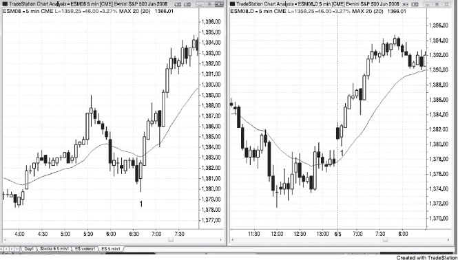
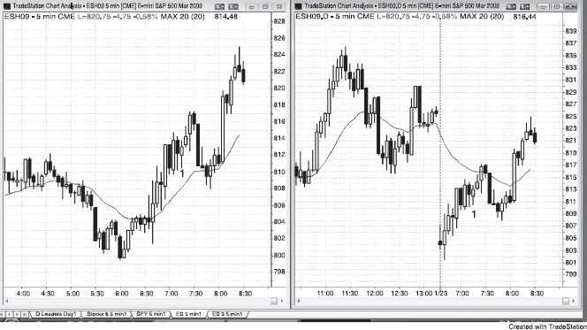

# 第 17 章：与盘前相关的形态

<!-- Source PDF pages 356–358 -->

<!-- PDF page 356 -->

第 17 章
与盘前相关的形态
当看 Globex Emini 的 tick 或成交量图时，开盘不容易发现，因为它只是 24 小时交易日的一部分，看起来与图的其余部分无法区分。事实上，包含日盘开盘的那根 K 线几乎总是包含开盘前的 tick。有一种倾向：Globex 高低点会在日盘被测试，Globex 中的形态会在日盘前许多根 K 线期间完成。前一小时左右通常运动很快，仅日盘就提供绝佳价格行为。由于多数交易者无法同时交易两张图得好，尤其在开盘后那样的快速市场中，只需选择 Globex 或日盘 5 分钟图之一。这是个人偏好问题。有些成功交易者全天看 Globex，但我更喜欢看日盘。其他交易者看 Globex 图一小时左右，然后切换到日盘图。多数在 Globex 图上设置的交易，对只看日盘的交易者也会有价格行为理由做同样的入场。你应愿意错过偶尔一笔交易，而不是冒着在你快速试图分析两张图、同时下入场、止损与利润目标单时因困惑而亏钱的风险。
当市场在日盘有大缺口并在前 30 分钟左右运动去回补它时，Globex 上的移动平均线在这段时间常与日盘方向相反。例如，若有大跳空低开，日盘的移动平均线将向下，但若 Globex 有更低低点且市场在开盘前 30 分钟一直在反弹，Globex 移动平均线可能上升，Globex 价格可能在移动平均线之上。若你只看日盘，看到大缺口且市场从开盘就强劲趋势去回补它，看动能而不是移动平均线，因为动能是正在发生的实际价格行为的反映。只看日盘的交易者必须意识到，移动平均线在前一小时左右常不可靠。
图 17.1 Globex 与日盘通常给出相关信号

<!-- PDF page 357 -->

如图 17.1 所示，Globex 与日盘图通常在同一时间给出信号，但常来自不同形态。左侧 Globex 图与右侧日盘图上的 K 线 1 都是 PST 上午 6:35 的 K 线。Globex 有最后旗形反转买入信号，日盘有空头趋势 K 线反转，那是进入昨日收盘的两段式向上运动之上的突破回撤。记住，若当天第一根是趋势 K 线，它通常是剥头皮形态。若它失败，尤其带相反的趋势 K 线，它是相反方向的形态。
在 Globex 时段，K 线 1 在下降的移动平均线下方，但 K 线 1 在日盘时段在移动平均线之上。可能需要一两个小时，两个时段的移动平均线才相同，它在每个时段可以提供不同且同样有效的形态。然而，多数交易者看两张图没有收获，这样做通常增加交易者不够快去做所有可用交易、并在下单时犯错的机会。
图 17.2 Globex 上的移动平均线不同

<!-- PDF page 358 -->

有时当日盘有大缺口时，日盘上的移动平均线在前 30 分钟没有帮助。在图 17.2 中，右侧日盘跳空低开，市场超过 90 分钟无法推到下降的移动平均线之上。然而，左侧 Globex（它几乎 24 小时交易）中的反弹在开盘前 30 分钟开始，市场从 PST 上午 6:30 起在上升的移动平均线之上，看起来更看多。K 线 1 处上午 7:20 的铁丝网形态在 Globex 上在移动平均线之上因此看多，但在日盘上在移动平均线之下。然而，两边的向上动能都很强，交易者本应寻找买入形态。
