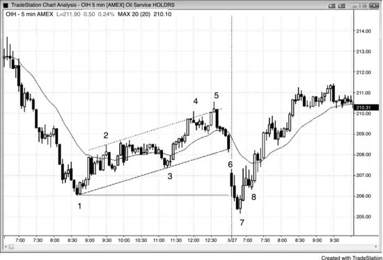
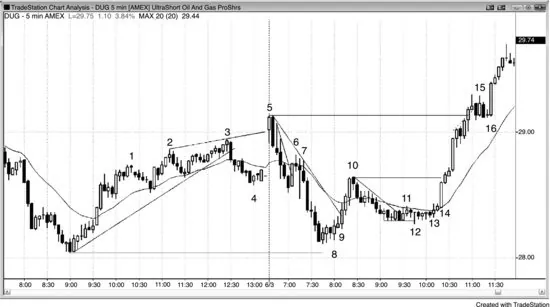
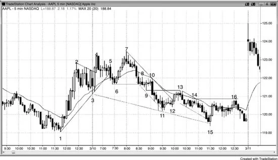
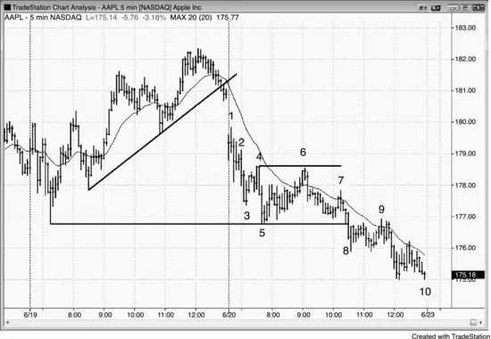
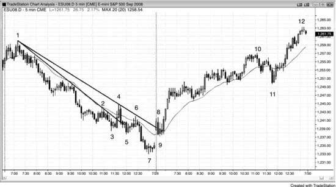
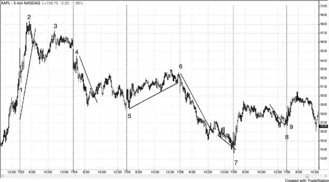

# 第 18 章：与昨日相关的形态：突破、突破回撤与失败突破

<!-- Source PDF pages 359–370 -->
<!-- English: Chapter 18: Patterns Related to Yesterday: Breakouts, Breakout Pullbacks, and Failed Breakouts -->

<!-- PDF page 359 -->

第 18 章
与昨日相关的形态：突破、突破回撤与失败突破

第一小时的许多交易与前一日的形态有关，因此尽量在开盘前预判形态。看昨日最后一两小时，是否有强趋势（可能延续到今日的始终持仓方向）、震荡区间、通道，或任何可能在今日开盘导致突破的形态。虽然有些日子开盘在前一日最后一两小时的安静震荡区间内且均线平坦，但多数日子开盘会有某种突破。当你不确定突破是什么时，只需看均线并用它作代理。若第一根完全在均线上方，把开盘想成跳空高开。若第一根完全在均线下方，假定市场在跳空低开。通常昨日最后一根收盘与今日第一根开盘之间有缺口，单凭这一点就是突破。寻找任何东西的突破，包括进入昨日收盘的通道或旗形。可以是一根最后旗形，或三小时通道。寻找任何摆动高点或低点下方的突破，尤其是昨日高点或低点。

一旦今日开盘且你看到突破，你必须评估它有跟随的可能性有多大。若有大跳空低开且第一根是开盘靠近高点、收盘靠近低点的强空头趋势K线，今日可能是开盘即趋势空头。若它反而强多头反转K线，突破可能失败，当日可能变成开盘即趋势多头。若该空头突破有几根跟随，然后有强多头反转，这可能设置失败突破与可能的当日低点。若反弹只持续一两根，然后又有另一根强空头趋势K线，失败突破可能正在失败。若如此，在该空头K线下方做空是突破回撤入场。市场突破了，然后失败了，但失败变成了空头趋势中的回撤，而不是反转。

当开盘有多头突破时，情况相反。寻找跟随或反转成失败突破做空入场。反转向下是否以两根、三根或更多大空头趋势K线继续，使空头趋势日很可能？还是在一两根内有多头反转K线，导致该失败突破的失败？若如此，形态在演变成突破

<!-- PDF page 360 -->

回撤买入形态。你需要以这种方式评估每一个开盘。寻找突破，然后寻找可能反转成失败突破形态。最后，若有失败突破，看它是否有跟随或它是否在失败。若它在失败，它在设置突破回撤交易与突破的恢复。

图 18.1 多头通道是空头旗形

昨日的多头通道是空头旗形，市场常在开盘向下突破它（见图 18.1）。昨日，石油服务 HOLDRS（OIH）5 分钟图有近四小时、两段式反弹，在到 K线 1 的强下行之后突破了主要空头趋势线（未画出），且反弹两次超调空头趋势通道线并两次反转向下（K线 4 与 5）。这是多头正在失去控制的证据。反弹的长度是多头强度的证据。

从 K线 5 抛售进入收盘使市场翻转为始终做空，交易者假定这一趋势会延续到今日开盘。今日，市场跳空低开，有强空头趋势K线，并迅速交易到昨日低点下方，在那里形成强两K线多头反转。这个大空头旗形失败突破跨越两日，在 K线 7 高点上方 1 tick 提供了绝佳做多入场。这是始于 K线 1 的空头旗形的最后旗形反转，以及更低低点主要趋势反转。反转前一日高点或低点的开盘反转常形成当日高点或低点，因此交易者应波段持有部分或多数合约。这里，保本止损

<!-- PDF page 361 -->

会让交易者在摆动至 K线 5 上方新摆动高点时赚到多达 5.00 美元。

当开盘形成前一日收盘形态的突破时，交易者应在失败突破形态（如 K线 7）入场，然后若失败突破失败并变成突破回撤，则在相反方向入场。这里，随后的三根反弹足够强，使第二段上行很可能，因此交易者此时还不应寻找做空突破回撤。由于第二段上行很可能，更好的是在 K线 8 上方买入，或在前两根任一根低点下方买入。K线 8 是突破回撤做多的信号K线，跟随开盘区间顶部 K线 6 上方的突破。它也是基于失败双顶空头旗形的做多形态，其中 K线 6 是第一个顶。

重要的是认识到，即便市场昨日从 K线 5 急剧抛售进入收盘，市场在 K线 6 开盘时也可能轻易跳空高开。若如此，从 K线 5 的抛售会变成失败突破尝试。

图 18.2 日初失败突破

始终准备好失败突破，无论第一根多强，即便昨日收盘有被困交易者（见图 18.2）。

超空石油天然气 ProShares（DUG）昨日以四小时多头通道收盘，那是空头旗形，并在进入收盘时向下突破。多头通道由尖峰与通道多头趋势组成，到 K线 4 的抛售设置了可能的双底多头旗形。到 K线 4 的抛售跌破多头通道，今日开盘突破通道顶部。虽然当日第一根是强多头反转K线且

<!-- PDF page 362 -->

本可能是开盘即趋势多头的开始，但它后跟强空头趋势K线，创造了两K线反转以及失败突破做空形态与更高高点主要趋势反转。结果是 K线 3 楔形顶与扩张三角形顶（K线 2 与 3 是前两次推进）上方的失败突破，以及开盘即趋势空头。

昨日的尖峰与通道多头趋势以楔形通道结束，因此很可能至少有两段调整，但从到 K线 4 的突破的回撤是到 K线 5 的更高高点。当有像楔形或扩张三角形第二次入场这样的强反转形态时，市场通常至少调整 10 根与两段，这里就是如此。市场大约等幅下跌，测试到昨日低点略上方。低点处两根多头实体是买盘压力的迹象，一些多头在 K线 8 越过那些多头K线上方时用止损入场。其他交易者在 K线 8 向上外包K线上方入场。市场在试图与昨日低点形成双底，若它突破 K线 5 高点上方，可能在接下来几日走高到等幅上行。

K线 9 是向上外包突破K线，它使市场翻转为始终做多。它使交易者认为市场不是在形成空头旗形过程中，而更可能在试图形成当日低点。

到 K线 10 的反弹是三根影线小、多头实体大的多头尖峰，因此第二段上行很可能。回撤很可能保持在 K线 9 低点上方，那是多数交易者确信市场已翻转为多头模式的地方。

到 K线 3 的上行非常强，有许多多头趋势K线，即便它以楔形结束，这种强度使调整后很可能有第二次上行尝试。它可能是某个更高时间框架图上的多头尖峰。

楔形通常在至少两段调整之前不会失败，因此当市场跳空高开并形成多头趋势K线时，多头很兴奋。然而，就在下一根，他们被止损出局，聪明交易者把这看作连续、相反的失败并做空。

K线 6 是陡峭空头趋势中失败的趋势线突破，因此是微型趋势线 Low 1 做空。这是可能的新空头摆动中强空头尖峰上的 Low 1 做空，因此是合理交易。

K线 7 设置了空头 Low 2 做空形态，且是与 K线 6 的小双顶。

K线 8 是价格行为交易者在到 K线 3 的强上行之后寻找的深调整。它也是当日两段下行，以及对昨日低点的测试。一些交易者把到 K线 8 的下行看作两段

<!-- PDF page 363 -->

调整，其中第一段下行到 K线 4，回撤到更高高点。

K线 9 是另一次买入机会，因为它是失败的 Low 2，通常至少导致再两段上行。这是绝佳交易，因为它把多头挡在强上行之外，他们然后将不得不追赶市场上行。像这样的向上外包失败 Low 1 或 Low 2 陷阱在强趋势开始时很常见，是趋势很可能走得很远的迹象。

K线 10 是突破趋势线、突破均线上方并有许多多头趋势K线的强上行段，因此很可能后跟更高低点。K线 10 也是均线缺口K线，但此刻你会寻找买入回撤，且只会在绝佳形态上做空，且只做剥头皮。从 K线 9 起趋势向上，除非证明另有情况。

K线 11 是空头微型通道失败突破，K线 12 成为更低低点突破回撤买入形态。

市场在通往 K线 13 途中形成两根小空头趋势K线，这实际上是从 K线 12 向上反转的两段调整。你可以在 K线 13 上、第二根空头趋势K线上方买入，或在 K线 14 上、充当突破回撤的内包K线之后买入。这是更高低点主要趋势反转。

市场突破 K线 10 上方时没有回撤，表明多头很强。你可以在 1 分钟图上寻找 High 2 做多，或等待 5 分钟停顿或回撤。

K线 15 不是好的 High 1 做多，因为上行不再是强多头尖峰。它后跟从小尖峰与高潮多头行情反转的小趋势通道线超调（虚线），且很可能至少横盘到下行调整几段。此外，信号K线是强空头趋势K线，是更多双边交易的迹象。双边交易的第一个迹象是四根前的空头趋势K线，K线 15 前五根有一些重叠与明显影线。

K线 16 是小内包K线上方突破上的 High 2 做多，允许紧密止损。

图 18.3 第一小时双顶

<!-- PDF page 364 -->

如图 18.3 所示，第一小时市场常形成双顶或双底，成为当日极端或至少接下来几小时的极端。

AAPL 昨日以窄幅震荡区间收盘，本可能是最后旗形形态。在 K线 3、当日第一根上，AAPL 迅速跌破昨日收盘的多头旗形，然后向上突破，形成小楔形多头旗形突破。然而，这一突破也失败了，并在下一根反转回下。虽然 K线 4 处的两K线反转是不错的最后旗形做空入场，但上行动能强，且原始向下侧失败突破意味着做空前最好等待更多价格行为。此时，在向下侧失败突破之后的失败旗形突破以及对昨日高点的反转，使空头理由更可能。

K线 5 出现在困住多头买入 High 2 的铁丝网形态结束处，是在 High 2 信号K线（前一根）低点下方 1 tick 的绝佳做空入场。该K线把多头困在做多，然后迫使他们出局。市场本可能在均线以及 K线 2 与 3 之间的多头旗形内找到支撑，因此交易者对空单谨慎。任何重叠K线区域，尤其当它们很大且窄幅震荡区间有多次反转时，是强双边交易区域。多头会在下方做空而不在上方买入，空头会在上方做空而不在下方。结果是突破倾向于被拉回区间，如 K线 3、9 与 11 的空头突破以及 K线 4 与 7 的多头突破之后。

K线 6 是翻多信号，因为它是失败突破、多头趋势中到均线的第二段下行（多数K线在上升均线上方）、两K线反转，以及回撤到均线的多头K线。

<!-- PDF page 365 -->

注意，到 K线 6 的抛售突破了趋势线，表明空头愿意变得激进，因此交易者准备好对多头趋势 K线 4 顶部的失败测试。

K线 7 是在突破至新高时失败的反转K线。它是第二次试图突破昨日高点上方（K线 4 是第一次），创造了楔形顶与更高高点主要趋势反转。由于当日迄今波幅只有典型最近日的大约一半，任一方向突破很可能使波幅翻倍并至少有两段（趋势交易者在任何回撤后可能足够有信心至少再下推一次）。K线 7 是第二次试图突破昨日高点上方失败，当市场两次尝试做某事并失败时，它通常尝试向相反方向走。K线 7 双顶（以及多头趋势中第三次上推）是当日顶部。

许多交易者会认为，在跌破 K线 7 后四根多头旗形的两根强空头趋势K线上，市场变成了始终做空。一些交易者会想要更多证据。

K线 9 跌破 K线 6 摆动低点，但不是当日低点。由于波幅仍小，且市场两次未能在昨日高点上方突破获得跟随，几率非常高会至少再有一次下推测试当日低点，那是磁铁且非常接近。市场现在在其磁场内。

K线 10 完成了铁丝网形态，但由于人人都确信第二段下行与测试到当日新低，它在小内包K线下方提供了绝佳 Low 2 做空。它也是跌破 K线 6 下方突破的突破回撤入场。最后，由于它是如此大的突破K线且收在低点，想要更多证据表明市场事实上现在始终做空的交易者得到了满足。有很大信心市场会走低，可能到大约等幅下行。

到 K线 10 的铁丝网回撤突破了次要空头趋势线（未画出），因此它可能是结束第一段下行的调整，但下行动能如此之强，多头还不够有信心激进买入。他们需要更多价格行为。

到 K线 11 当日新低的突破本质上是直线下行，因此很可能不是行情的结束（交易者会寻找第二段下行至少测试 K线 11 低点）。由于它是空头趋势通道线的失败突破（该线始于 K线 8 前一根），两段上行很可能

<!-- PDF page 366 -->

先发生。

K线 12 是小 K线 11 双底之后的小双底回撤做多形态，但在没有先前好的趋势线突破或强反转K线的情况下，它只会是剥头皮。此外，由于第二段下行很可能，且没有证据表明始终持仓交易已翻回做多，远更明智的是专注于再次做空或加空，而不是让自己被七根带大影线的横盘K线之后的小多头剥头皮分心。

K线 13 是空头的另一次 Low 2 机会，但到均线的反弹突破了好的空头趋势线。这对多头与空头都是信号：从新摆动低点的下一次向上反转若足够强，很有机会有两段上行。Low 2 做空是第二次入场，且在均线处有空头信号K线，增加了成功机会。

K线 14 是另一次 Low 2 做空，并后跟从 K线 13 下来的相当强的两K线空头尖峰。

K线 15 是从突破至新低向上的两K线反转。它有从新低、在超调两条空头趋势通道线之后的强多头反转K线。它是从第一次趋势线突破回撤到 K线 13 的第二段下行（小尖峰后的通道，尖峰是第一段下行），以及对昨日 K线 1 最低高点的突破回测。一些交易者把它看作双底买入形态，其他人把它看作到 K线 7 强反弹后的更高低点。它是从当日高点的第二段下行，以及大楔形多头旗形的底部，其中 K线 3 与 11 是前两次下推。所有这些都是强度迹象，增加了反弹会有两段的几率。第二段在 K线 16 结束，它突破第一段高点上方并反转。它未能突破 K线 14 高点上方，与 K线 14 形成双顶空头旗形。它也是 K线 13 空头尖峰之后抛物线通道的底部。其他交易者把 K线 8 低点前的两根空头趋势K线看作更重要的尖峰，他们的通道下行始于 K线 10。一些交易者把 K线 10 看作尖峰，从 K线 13 的下行看作通道。一些交易者认为 K线 4 后的空头趋势K线或 K线 5 空头趋势K线是重要尖峰。他们把 K线 7 看作更高高点突破回撤。现实是，那些空头趋势K线中每一根都代表卖盘压力，它是累积的。一旦它达到足以压倒多头的临界质量，市场就下跌。

顺便说，当有以三推结束的强上行、然后以更小动能（更浅斜率、更小趋势K线、更多影线）抛售时，

<!-- PDF page 367 -->

几率很好三推的高点不久会被越过，因为这个底部很可能是更高时间框架的更高低点。市场在次日开盘实现了目标。若市场继续上行，下一个目标会是双底的等幅上行。

图 18.4 昨日形态的突破

如图 18.4 所示，当日第一根常是昨日通道的突破。昨日是多头趋势型震荡日以及有三次上推的尖峰与通道多头趋势。市场在收盘跌破通道，并在跳空开盘时进一步向下突破。K线 1 是突破回撤做空，本可能是开盘即趋势空头的开始。

K线 3 试图形成失败突破开盘反转，但下行陡峭且在通道中。这使 K线 3 成为有风险的买入，尽管当日有小的三推下行。当下行在窄通道中时，更安全的是等待突破然后回撤再买入。

K线 5 是更低低点突破回撤，并试图与昨日低点形成双底（精确到美分）。它导致形成 K线 6 双顶空头旗形的小楔形反弹。

双顶空头旗形是开盘初始下行后的常见形态，尤其在股票中，常后跟长期空头趋势，经常是趋势型震荡空头。K线 6 信号K线是均线

<!-- PDF page 368 -->

缺口K线。

K线 7 是突破回撤做空，即便当日低点的突破尚未发展。足够接近。它也是失败的双底回撤与成功的双顶回撤形态，以及从 K线 6 向下的微型通道的失败突破。

K线 9 是跌破昨日与今日低点下方的两段突破回撤。

昨日全天多头趋势实际上只是大空头旗形，今日是其突破带来的空头趋势。今日是趋势型震荡空头趋势日、开盘即趋势空头趋势日，以及缺口尖峰与通道空头趋势。

图 18.5 空头通道是多头旗形

空头通道是多头旗形，开盘在其上方的突破常后跟突破回撤买入信号。如图 18.5 所示，昨日是强空头趋势日，但 K线 4 突破主要趋势线上方，表明市场可能在测试 K线 3 低点后尝试反转（通常是两段式下跌）。相反，市场以两段抛售进入收盘。

K线 8 突破了由 K线 4 反弹产生的新的、更平坦的主要趋势线，然后在 K线 9 均线处有小的两段突破回撤（两根空头趋势K线由一根多头趋势K线隔开）。这一突破回撤，即更高低点主要趋势反转，导致了开盘即趋势多头趋势日。当最初 5 到 10 根形成横盘区间时，许多机构

<!-- PDF page 369 -->

在区间突破上入场，这一突破常导致趋势日。更早入场风险更小，如本例中均线测试K线上方。

K线 10 是第三次上推（三个趋势型震荡区间），因此预期两段回撤。然而，到 K线 10 的通道很窄，因此通道下方的突破与两段抛售很可能后跟对高点的测试。

K线 11 测试了先前震荡区间低点，是太平洋时间上午 11:45 急剧下行以把多头挡在市场外。它形成了也是 High 2 的均线缺口K线做多，这一最后多头段突破第三个震荡区间顶部并延伸到收盘时几乎等幅上行（K线 10 到 K线 11 抛售高度的两倍）。

这是尖峰与通道多头趋势，后跟双底多头旗形（K线 11 与两小时前震荡区间底部），且是开盘即趋势多头趋势日。

图 18.6 昨日形态很重要

前一日形态几乎总是影响第一小时。看图 18.6，不要担心这张图上的小K线，而要关注概念。

K线 1 是测试昨日强收盘的急剧回撤，它迅速向上反转，在 K线 1 回撤高点上方 1 tick 创造买入入场，并再次在当日第一根高点上方。

K线 4 是突破回撤做空形态。开盘在 K线 3 更低高点主要趋势反转之后产生更低低点，K线 4 设置了 Low 2 做空。

K线 5 是开盘反转，跟随昨日空头趋势线突破后形成的空头低点的更低低点主要趋势反转测试。

<!-- PDF page 370 -->

今日高开并交易下行测试该更低低点。K线 5 上方的突破回撤入场实际上是 High 2，因为 K线 5 是第二段下行（昨日收盘是第一段），以及与昨日最后一根和当日早些时候形成的低点的小双底。

小 K线 6 更低高点然后趋势线突破导致突破回撤做空。当日第一根测试趋势线下方并向上反转，但上行在 K线 6 失败。

K线 7 是楔形做多形态（空头趋势通道线下方与昨日低点下方的失败突破），楔形后跟主要空头趋势线突破。它是从小趋势通道线下方突破的向上反转。

K线 8 是进入昨日收盘的趋势线上方突破的突破回撤。那个空头通道是空头旗形，因此 K线 8 是突破回撤做多形态。它也是昨日开盘强反弹后大两段回撤的结束。K线 8 突破回撤更高低点之后最容易的入场是 K线 9 的 High 2。
