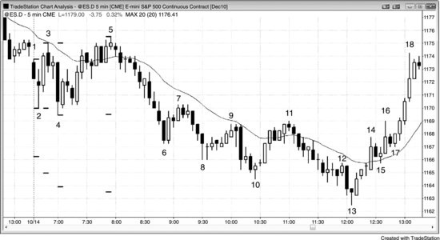
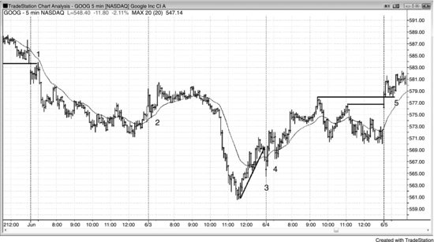
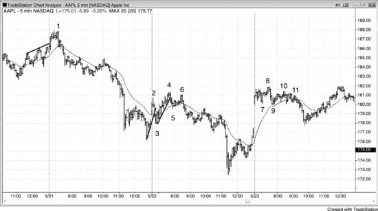
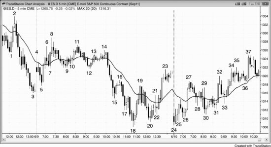
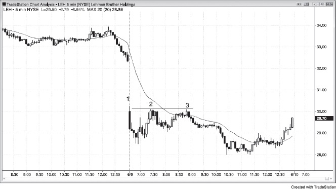
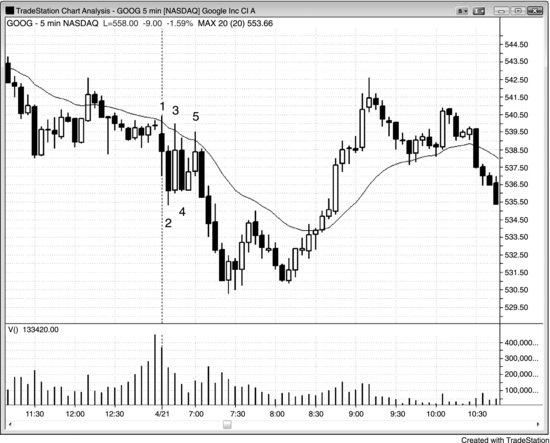
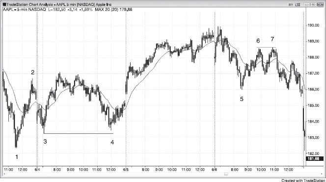

# 第 19 章：开盘形态与反转

<!-- Source PDF pages 371–388 -->
<!-- English: Chapter 19: Opening Patterns and Reversals -->

<!-- PDF page 371 -->

第 19 章
开盘形态与反转机构交易者在开盘前有订单要成交，他们想以最佳可能价格成交。例如，若他们主要有买单且市场大跳空低开，若他们觉得更低开盘代表不会持续很久的绝佳价值，他们会立即买入。若他们相信市场会再低一点交易，他们会等待更低买入。若市场反而跳空高开，他们可能决定市场应回撤。若那是他们的信念，他们现在没有买入的激励，因为他们预期很快能更低买入。这创造卖盘真空，市场可以迅速下行，因为机构多头只是在等待以更有利价格买入。他们总会等待市场到达支撑位，如均线、趋势线、等幅运动或摆动高点或低点。若足够多机构有买入侧订单失衡且他们都在大约同一水平开始买入，急剧抛售可以强力向上反转。抛售与其说由于强空头，不如说由于强多头只是在等待市场跌到支撑位，于是他们不懈买入并压倒空头。这是真空效应；市场被迅速吸到有大量强买方等待的水平。

当机构在开盘有大量卖单时，情况相反。常会有买盘真空把市场迅速吸高，然后突然空头出现并猛烈把市场打低。他们从开盘就看空，但若他们相信市场会交易到某个阻力位，他们会忍住不做空，直到市场到达他们认为不会更高的点。若他们认为市场会再高一点，做空对他们没有意义。在那一点，他们开始做空并压倒多头。结果是开盘向下反转。

这些急剧上下反转是开盘反转，常成为当日高点或低点。若交易者理解正在发生什么，且不被诱骗相信所有急剧行情只是会后跟通道的尖峰，他们会准备在反转上做波段交易，有时可以持有部分仓位当日大部分时间。

<!-- PDF page 372 -->

虽然多数日子有开盘反转或开盘即趋势，有 50% 到 60% 机会赚至少两倍风险，初学者难以确定常有的几个形态中哪个是最佳那个。任何形态的精确概率因有如此多变量而无法高度确定地知道，开盘区间中的形态尤其如此，但我使用的是合理指引。在多数日子，开盘区间有几个合理反转，但它们只有约 30% 机会导致回报至少两倍于风险的波段交易（虽然许多有约 60% 机会赚与风险一样大的回报）。此外，最早的有时是最佳那个，但随后几个反转常回撤超出入场价并把初学者吓出仓位。初学者可以要么做一个他们觉得强的并简单地依赖保护性止损并允许回撤，等待最终突破，要么可以剥头皮与风险一样大的回报，然后若下一个反转形态看起来好就在相反方向交易。多数交易者若做他们认为是好形态的、依赖保护性止损、允许回撤，仅在形成相反方向强信号时离场，则更有机会变得盈利。

当日第一根对所有市场有约 20% 机会成为当日高点或低点。若它是没有大影线的强趋势K线，有 30% 机会。高点或低点在约前五根内形成的日子占 50%，在前一两小时内形成的日子占 90%。即便多数反转不会导致至少两倍于风险的利润，若交易者波段持有它们，多数最终会成为剥头皮。盈利交易的利润通常至少与亏损交易的亏损一样大，偶尔的大赢家使这一方法值得。或者，交易者可以简单地寻找至少与风险一样大的回报做剥头皮。当日高点通常来自某种双顶，即便两个高点常不在同一价格，当日低点通常来自双底。一般而言，若当日有反转，交易者应等待有双顶或双底再寻找波段交易。一旦形成一个，根据背景与形态，它有约 40% 到 50% 机会导致波段，以及当日极端。

多数交易者应努力成为发现并交易最佳开盘反转的专家，并把这些波段交易作为交易的基石。例如，当 Emini 平均波幅约 10 到 15 点时，看起来合理的开盘反转上四点波段的概率 <!-- PDF page 373 --> （背景好且有像样信号K线）常只有约 40%（当形态非常强时可以是 50% 到 60%）。然而，两点止损在止盈目标到达或反转信号发展（交易者可以以更小亏损或小利润离场）前被打到的机会常只有约 30%。这使这类交易的交易者公式非常有利。若交易者在 10 笔中 4 笔赢四点，他们从波段交易有 16 点利润。若他们然后有可能三次两点或更少的亏损与三次约一到三点的赢利，他们在那些交易上最终大约保本。当交易者挑选合适形态时这相当典型。交易者然后在 10 笔交易上有约 16 点利润，平均每笔 1.6 点利润，对日内交易者很好。

当没有反转时，尖峰事实上可以后跟通道，当日可以变成尖峰与通道趋势日。若有反转，但只持续几根然后反转回尖峰方向，反转尝试已失败并变成突破回撤形态，通常会后跟某种通道。例如，若市场在当日前三根强力反弹但然后有空头反转K线，许多交易者会在该K线下方反手做空。然而，若尖峰强且反转K线弱，更多交易者会假定反转 <!-- chunk continuation: 28-ch19-opening-patterns-and-reversals --> <!-- PDF page 375 --> 会失败并成为突破回撤。

开盘区间的大小可以按包含它的K线或形成所需时间分类。一般而言，它是震荡区间（若有）的高度，或前 30 到 90 分钟最大一段的高度。有时该段内部有两三个更小段，有时会有回撤然后短暂更高高点或低点或更低高点或低点。若有那个新极端，一些交易者会用它扩大开盘区间，其他人会继续使用原始区间并把新极端看作无意义超调。

把开盘区间大小分成三类有帮助。若区间只有最近几日波幅的约 25%，交易者会在任一方向区间突破上入场。每月几次，这会变成带小回撤与不懈推进的开盘即趋势日。

若开盘区间是最近几日波幅的约三分之一到一半，交易者会假定波幅会增长到大约平均日大小。当日通常会有一些震荡区间活动然后向上或向下突破。约三分之二时间它会变成趋势日，通常是趋势型震荡日，虽然任何类型趋势日都可能。突破通常到达基于开盘区间高度的大约等幅运动。它通常在日晚些时候回来测试突破点，并常然后突破回更早区间。若回开盘区间的反转很强且市场收在那个更早区间的另一侧，当日变成反转日。这事实上是反转日形成的最常见方式。在另外三分之一情况中，当日只交易到开盘区间外一点，然后反转并突破区间另一侧，然后交易回区间内。当这发生时，当日通常变成小震荡区间日，但有时那个第二次突破可以导致相反方向的趋势型震荡日。

第三种可能是开盘行情很大。这通常由于强尖峰，当日常变成尖峰与通道趋势日，但有时导致高潮式反转，通常在小最后旗形之后。

要认识到的重要一点是，若市场在开盘有强行情然后反转，那个初始强行情表明强度，它可能在日晚些时候回来。例如，若市场在当日前四根强力抛售然后向上反转成强多头趋势，你应记住初始空头趋势，不要假定多头会控制市场直到收盘。那个初始下行强度表明空头愿意在日早些时候激进做空市场，并可能在日晚些时候寻找 <!-- PDF page 376 --> 另一个机会，尽管有多头趋势。因此若多头趋势中有强调整，不要忽略它可能是另一次趋势变化在发生的可能性，这次回到空头趋势。

第一小时形态与日晚些时候相同，但反转常更剧烈，趋势往往持续更久。最大化交易利润的重要关键是波段持有任何可能是当日高点或低点的仓位的一部分。若交易看起来特别强，波段持有全部仓位并在交易运行一到两倍初始风险后在三分之一到一半上部分止盈。若你买入你认为可能是当日低点的东西且初始止损在信号K线下方，约在入场价下方三点，在约两到四点平掉约四分之一到一半，可能在四到六点再平掉四分之一到一半。或者，不用固定限价单，在两点利润后第一次停顿平掉一些，在四点后第一次停顿再平掉一些。持有剩余合约直到有清晰且强的相反信号或直到保本止损被打到。寻找在每个顺势形态加仓，如强趋势中到均线的两段回撤。对这些额外合约，剥头皮多数或全部仓位，但继续波段持有一些合约。

一些反转安静开始，许多根只轻微趋势，看起来只是旧趋势中的另一个旗形，但然后市场有力突破进入相反趋势。例如，空头旗形可以向上突破，市场可以反转成多头趋势。其他反转从入场K线就有强动能。对所有可能性保持开放，尝试做每个信号，尤其若它强。困难之一是反转常很急剧，交易者可能没有足够时间说服自己反转形态实际上可以导致反转。然而，若信号K线是强趋势K线，成功机会好，你必须做交易。若你觉得需要更多时间评估形态，至少做一半或四分之一仓位，因为交易可能突然走得很远很快，你需要参与，即便只是小方式。然后在第一次回撤加仓。

与作为反转形态的双底回撤不同，双底多头旗形是多头趋势已开始后发展的持续形态。在功能上，它与双底回撤相同，因为两者都是买入形态。

<!-- PDF page 377 -->

图 19.1 开盘区间与等幅运动

如图 19.1 所示，开盘区间高度常用于投射等幅运动目标。市场在开盘形成区间，然后突破，目标通常大约是区间高度。当突破强时，交易者可以市价入场或在小回撤入场，并把保护性止损放在开盘区间另一侧或突破点之外。

当日第一小时常有几个反转，交易者必须决定哪个足够强做波段。强趋势K线、两K线反转、以及对昨日高点或低点的测试增加当日极端的几率。

<!-- PDF page 378 -->

图 19.2 跳空开盘与始终持仓

如图 19.2 所示，大跳空常导致开盘反转或开盘即趋势。交易者在第一小时寻找两根连续趋势K线，当它们存在时，许多交易者得出市场有始终持仓仓位的结论。例如，K线 2 处有连续多头趋势K线。由于实体小且影线大，多数交易者在得出始终持仓方向向上前需要更多验证。这随 K线 4 后的两根多头趋势K线而来。此时，许多交易者假定始终持仓方向向上，因此他们波段持有多单，止损在两根尖峰底部下方。K线 5 是强多头突破K线，进一步证明当日是多头趋势日，随后几根多头实体给出额外证据。注意 K线 4 前有三根空头趋势K线，每一根后跟有多头实体的K线。空头无法创造跟随卖出，意味着他们弱。多头把那些空头趋势K线中每一根看作买入机会而不是卖出形态，这是市场很可能上行的强证据，尤其在大跳空高开日。

<!-- PDF page 379 -->

在最后几小时通常有约两倍于更早回撤大小的回撤，那发生在从 K线 14 的抛售上。

<!-- chunk continuation: 28-ch19-opening-patterns-and-reversals -->

<!-- PDF page 380 -->

图 19.3 开盘上的突破回撤

如图 19.3 所示，谷歌（GOOG）在这四日开盘有几个突破回撤。K线 1 是在陡峭均线处的 Low 2 做空，以 6 美分关闭昨日低点下方缺口，设置向下反转形成当日高点。

K线 2 是突破昨日摆动高点上方后的均线回撤。多头 ii 形态是做多形态。K线 2 多头K线后那根与当日第一根形成双顶，这是当日高点。

<!-- PDF page 381 -->

K线 3 是从突破进入前一日收盘的多头趋势线的向上反转（失败突破）。K线 4 是更高低点以及与 K线 3 的大致双底。

K线 5 是 High 2 双底多头旗形（第一个底在两根前），也是突破昨日高点上方后的第一次回撤。这本可能变成开盘即趋势日。

图 19.4 早期失败突破

如图 19.4 所示，苹果（AAPL）在这三日开盘有几个失败突破，它们导致开盘反转。K线 1 是趋势通道线超调开盘反转的第二次入场（Low 2）。

K线 2 是前一日最后一小时震荡区间上方突破（失败突破）以及进入前一日收盘的空头趋势线（未画出）的向下反转。市场然后从均线向上反转，形成 K线 3 更高低点，那也是突破回撤。

K线 4 是尚未成为多头趋势日那天更高高点的向下反转，因此是好做空。它也有楔形形状，是开盘缺口尖峰后通道的顶部。

K线 6 是 K线 5 跌破多头通道后的更低高点最后旗形向下反转。交易者预期测试通道底部 K线 3。

K线 7 是大跳空高开日的 High 2 突破回撤，但市场在 K线 8 更高高点与最后旗形突破向下反转回下。

<!-- PDF page 382 -->

由于此刻这不是多头趋势日，这是好做空。

K线 9 是新低，但带着强动能到来，使第二段下行很可能。跳空高开是多头尖峰，从 K线 8 到 K线 9 的行情是空头尖峰。这是高潮式反转形态，后跟震荡区间，如常发生。在震荡区间期间，多头与空头都在加仓试图获得通道形式的跟随。空头赢了，多头不得不卖出平多，增加卖盘压力。

K线 10 是 Low 2 与两段更低高点。

K线 11 是基于 K线 10 更低高点后失败 High 2 的做空第二次入场。多头做了两次试图反转更低高点的空头含义并两次失败。当市场两次尝试做某事并两次失败时，它通常会向相反方向走。

图 19.5 跳空低开与跳空高开都可以导致开盘反弹

如图 19.5 所示，K线 4 是强空头反转K线以及强空头趋势中的均线测试，为跌破 K线 1 下方的突破设置突破回撤做空。到均线的跳空高开是回撤。

从 K线 2 到 K线 3 的行情是尖峰与通道空头趋势，K线 4 是通道顶部附近的测试。测试常后跟震荡区间价格行为。此外，跳空高开突破了昨日最后一小时的陡峭空头趋势线，多头在寻找突破回撤做多形态。

<!-- PDF page 383 -->

图 19.6 开盘即趋势

如图 19.6 所示，一些日子从第一根或最初几根就趋势，很少或没有回撤。交易者应在第一或第二次回撤入场，并波段持有部分仓位。开盘即趋势日常在第一小时有当日高点或低点，且趋势可以持续到收盘。

<!-- PDF page 384 -->

图 19.7 开盘反转成为当日极端

如图 19.7 所示，强开盘反转常成为当日高点或低点。交易者应在强信号K线上入场，把保护性止损放在信号K线外，并在交易运行至少与风险一样大的距离后部分止盈。若形态非常强，持有部分仓位到收盘或直到清晰相反信号。

<!-- PDF page 385 -->

图 19.8 第一小时双顶与双底

如图 19.8 所示，第一小时双顶与双底是最可靠开盘形态之一。它们常设置当日极端，并应被波段交易。当双顶或双底后有强趋势K线时，几率增加。

<!-- PDF page 386 -->

图 19.9 开盘上的楔形与三推

如图 19.9 所示，开盘楔形与三推形态可以导致强反转。交易者应等待像样信号K线，并准备波段持有，因为这些常形成当日高点或低点。

<!-- PDF page 387 -->

当开盘尖峰失败并反转时，常后跟相反方向通道。初始尖峰表明该方向强度可能在日晚些时候回来，因此交易者在主要趋势中的深调整上应保持警惕。

<!-- PDF page 388 -->

开盘小时是一天中最重要的部分之一，因为机构在成交订单且真空效应常见。交易者应在开盘前准备，看昨日最后一小时，并准备好突破、失败突破与突破回撤。最佳开盘反转提供出色的风险/回报，应是任何价格行为交易者方法的基石。
