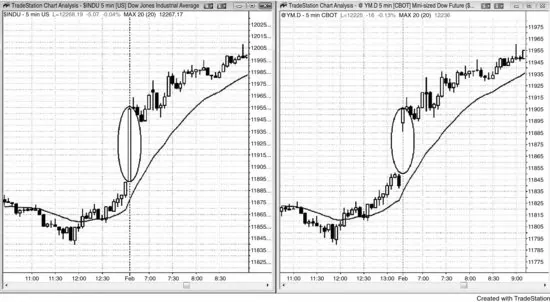
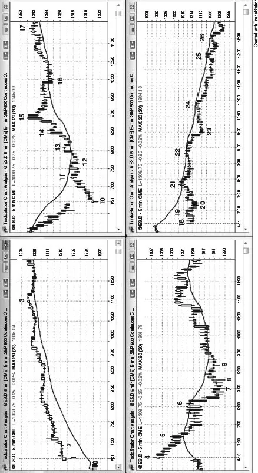

# 第 20 章：跳空开盘：反转与延续

<!-- Source PDF pages 389–393 -->

<!-- PDF page 389 -->

第 20 章
跳空开盘：反转与延续
任何时间框架上的跳空开盘意味着，一旦所讨论的 K 线收盘，它不与前一根重叠。在多数日子，5 分钟图上有跳空开盘。它们可被看作简单突破，因为市场突破了前一日的最后一根 K 线。它们应像任何其他突破一样交易，只是交易者知道大缺口增加当日成为趋势日的机会。缺口越大，当日越可能是趋势日，缺口越可能作为尖峰起作用，并跟随同方向的趋势通道。例如，大跳空高开后或许有 50% 机会跟随多头通道，20% 机会跟随震荡区间，30% 机会跟随空头趋势。这些概率只是指引，因为用计算机测试找精确数字受太多变量影响。缺口要多大才被认为是大？跳空高开后多大的反弹构成通道而不是略微向上倾斜的震荡区间？多大的抛售构成反转而不是深回撤？作为另一条指引，若缺口是过去约五天中最大的缺口，或若它大于平均日波幅的约一半，它可被认为是大缺口。
5 分钟图上相对昨日收盘的大跳空开盘代表极端行为，常导致任一方向的趋势日。日线图上是否也有缺口并不重要，因为交易会相同。唯一重要的是市场如何回应这一相对极端的行为——它会接受还是拒绝？缺口越大，它越可能是远离昨日收盘的趋势日的开始。当天前几根 K 线中趋势 K 线的大小、方向与数量常揭示可能跟随的趋势日的方向。有时市场会从开盘一两根趋势运行，但更常的是它会朝错误方向测试，然后反转进入将持续全天的趋势。每当你看到大跳空开盘，明智的是假定将有强趋势。然而，有时可能需要一小时才开始，趋势常以两段式逆势运动开始，如到移动平均线的两段式回撤或双底或双顶。有时它有第三次推动并形成 <!-- PDF page 390 --> 楔形旗形。确保波段持有每笔交易的一部分，即使你在几笔交易上被止损掉波段部分。一笔好的波段交易可以像 10 笔剥头皮一样赚钱，因此在明确当天不会趋势之前不要放弃。
缺口应被看作一根巨大的、不可见的趋势 K 线。例如，若有大跳空高开，后跟小回撤，然后当天剩余时间是通道型反弹，这很可能是缺口尖峰与通道多头趋势，缺口是尖峰。对 Emini，你可以看 S&P 现货指数，看到当天第一根是大趋势 K 线，它对应于 Emini 上的缺口。
像交易任何其他开盘一样交易开盘，寻找开盘即趋势、失败突破（反转）或突破回撤。与其他日子的唯一区别是，你应更积极地寻找波段；若当天开始趋势，寻找你可以加仓的回撤。你应始终寻找沿途部分获利，那可以是剥头皮，但只要趋势很强，就继续寻找更多趋势方向的入场。
仅仅因为趋势日的机会增加并不意味着会有趋势日。多数大缺口日在前五到十根有一些震荡区间行为，因为多头与空头争夺趋势方向，有些整天继续作为震荡区间日。对所有可能性保持开放，不要被锁进一个信念。你的工作是跟随市场。你没有能力影响它，也绝无可能用心灵感应让它朝你想要的方向走。若你错了，离场，别再希望市场会做低概率的事并突然朝你的方向走。若有大缺口但价格行为不清晰，假定市场正在形成震荡区间，寻找低买高卖。在有好机会通向波段的形态之前，可能有几笔剥头皮。
图 20.1 缺口不过是尖峰

<!-- PDF page 391 -->

如图 20.1 所示，5 分钟图上的跳空开盘不过是突破与尖峰的另一种形式。右侧图上道指期货合约在开盘跳空高开，但左侧道琼斯工业平均指数现货指数上的那个缺口不过是一根大多头趋势 K 线。
图 20.2 缺口可导致向上或向下趋势

<!-- PDF page 392 -->

大跳空开盘增加当日成为趋势日的几率（趋势可以向上或向下），但它仍可能成为震荡区间日。如图 20.2 右下图所示，从 K 线 18 到 K 线 22 的横向运动 <!-- PDF page 393 --> 是大缺口后数小时横向运动的例子。
缺口越大，当日越可能成为缺口方向上的趋势日。例如，左上图中的 K 线 1 是大跳空高开，当天成为多头趋势日。
左侧两张图显示大跳空高开；上图成为多头趋势，下图成为空头趋势。右侧两张图是跳空低开；上图成为多头趋势，下图成为空头趋势。
K 线 1 是大跳空高开日的多头趋势 K 线。当天成为开盘即趋势、缺口尖峰与通道多头趋势。
K 线 4 是十字星，但它有多头实体。市场向下趋势了几个小时。到 K 线 7 当日低点的价格行为有突出影线、重叠 K 线与数根多头趋势 K 线，都表明双边价格行为。多头能持续创造一些买盘压力，并在当天后半段控制市场。
K 线 10 是大跳空低开日的多头趋势 K 线，当天成为开盘即趋势的多头趋势日。
K 线 18 是大跳空低开日的十字星 K 线。市场继续横向价格行为，直到市场在 K 线 23 空头尖峰向下突破。开盘十字星是双边交易的迹象，持续了数小时。空头尖峰之后，当天成为空头趋势日，空头在 K 线 24、25 与 26 的移动平均线测试上压倒了多头。尽管空头在 K 线 21 与 22 的移动平均线测试上很强，他们还不够强到把市场突破出震荡区间进入空头趋势。
当有大跳空高开或低开且没有强反转时，顺势交易者的交易者公式可以很强。例如，当市场在 K 线 1 有大跳空高开然后横向时，多头趋势日的几率上升，或许到 60% 或更高。交易者预期波幅达到最近日子的约平均水平，约 20 点。市场在回补缺口之前向上走 20 点的几率可能是 60% 或更好，因此在前几根买入的交易者冒约 10 点风险去赚约 15 到 20 点，且有 60% 成功机会，这是绝佳交易。他们可能可以冒险到缺口中部之下，因此风险可能是 6 点而不是 10。无论如何，这种出色的数学是大跳空开盘能提供绝佳交易的原因。
