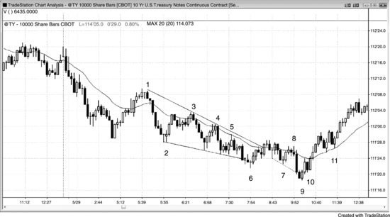
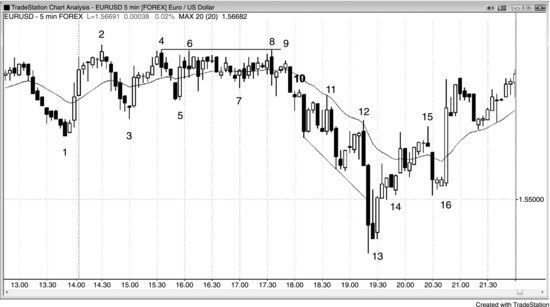
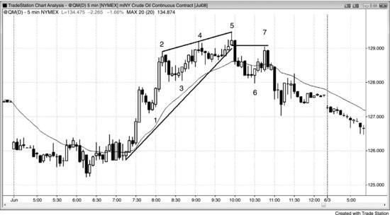
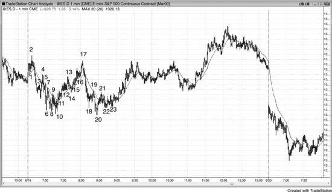

# 第 21 章：详细日内交易例子

<!-- Source PDF pages 395–402 -->
<!-- English: Chapter 21: Detailed Day Trading Examples -->

<!-- PDF page 395 -->

第 21 章
详细日内交易例子本章提供许多合理日内交易的详细例子，整合了全部三本书的基本思想。

图 21.1 十年期国债 10,000 股图

图 21.1 是基于每根 10,000 股的 10 年期美国国债期货图。每根在成交量超过 10,000 合约时收盘。由于每根最后一笔交易可以有任意合约数，多数K线有超过 10,000 合约而不是正好 10,000 合约。K线不基于时间，因此有些K线可能几秒形成，而其他可能需要超过 10 分钟才超过 10,000 合约。

K线 3、4 与 5 是空头趋势中在均线测试上的做空。

K线 6 是第二次入场的空头趋势通道线超调与向上反转，但信号K线弱（小十字星）。然而，从 K线 6 楔形反转的反弹突破了趋势线，设置了在测试低点上的做多。

K线 7 是两段更高低点，但它是十字星，是双边交易而非强买入的迹象，且后跟两根强空头趋势K线。虽然这是最低限度可接受的买入形态，但更好的是等待更强信号。若你做了，你会在 <!-- PDF page 396 --> K线 8 下方离场，因为那是均线处的 Low 2 做空形态且有空头实体。那是强卖出信号，逆势交易者应在空头第二次试图恢复趋势时离场，甚至可能反手。试图在空头趋势中买入的逆势交易者应始终在 Low 2 信号上离场，除非趋势已明显反转且 Low 2 形态很可能失败。K线 11 是这种情况的例子。

K线 9 是更低低点主要趋势反转，以及结束于 K线 6 的楔形底部突破的突破回撤，是可能的强趋势反转的买入形态。它也是空头趋势通道超调与反转，是多头反转K线与两K线反转。从 K线 6 到 K线 9 的震荡区间是窄通道，成为空头趋势的最后旗形。此外，它是跟随到 K线 2 的尖峰下行的更大楔形通道的反转。尖峰与通道空头的通道常以三推结束，这里就是如此（K线 2、6 与 9）。

K线 10 是内包K线上方突破，结束了第一次微小回撤（空头趋势K线），因此交易者可以在其上方做多或加仓 K线 9 上方的多单。在尖峰与通道空头（K线 2 结束尖峰）与三推下行（K线 2、6 与 9 结束它们）之后，很可能发展出长期两段上行，因此 K线 10 停顿很可能只是第一段上行的一部分，而不是第二段上行的开始。在持续 20 或 30 根的空头通道之后，作为一般规则，调整很可能至少有一半那么多K线。若调整太小，空头会犹豫做空，多头会继续买入，因为他们会怀疑调整需要更多K线才能清晰。双方都需要看到市场是否在反转，从 K线 10 上行的四根多头尖峰是它在反转的强证据。尖峰与通道空头形态很可能回撤到大约通道起点 K线 3 附近，它确实如此。多头常在那里止盈。这是一些人开始分批加仓的区域，一旦市场回到他们非常第一次入场，他们常平掉全部仓位。他们以大约保本平掉在 K线 2 与 3 之间建立的原始多单，并在所有更低入场上获利。空头常再次激进做空，因为他们知道市场早些时候从这一区域开始下行，它可能再次如此。当日已结束，没有足够时间让空头获利，因此他们选择不在收盘做空。

K线 11 是强多头尖峰后的 High 2 买入形态（High 1 在两根前）。交易者预期至少两段上行，而这一两段回撤相对于尖峰规模如此之小，它可能没有 <!-- PDF page 397 --> 标志着第一段上行的结束。交易者相信三件事之一在发生：回撤如此之小，它只是复杂第一段的一部分；第一段结束且第二段上行开始；或第一段结束，会有更深回撤，然后移到该段顶部上方。所有三种可能性都意味着市场会走高，因此这是绝佳买入机会。是的，K线 11 是两K线反转顶的入场K线，那是空头趋势中均线缺口K线做空的第二次入场。这本可能导致对空头低点的测试。然而，上行尖峰在多数交易者心中使市场翻转为始终做多，因此做空走得很远的机会很小。多数交易者认为反转比做空形态强得多。

图 21.2 EUR/USD 强开盘

如图 21.2 所示，5 分钟 EUR/USD（外汇）在 K线 2 于新高后向下反转。这一多头段有强动能，证据是连续八根没有空头趋势K线，因此几率很高任何回撤会在跌破多头尖峰底部 K线 1 之前测试 K线 2 高点。K线 3 是均线缺口K线，也是反弹起点 K线 1 的突破回测。它与其前两根形成微型楔形，应至少导致向上反弹。它也是强多头尖峰后的楔形多头旗形。第一段下行是 K线 2 前三根，第二次下推是 K线 2 后两根，第三次是 K线 3。

市场形成三角形，最终成为窄幅震荡区间。三角形至少有一个方向的三次推进，K线 2、4 以及 6 或 8 形成三次上推，而 K线 1 或 3 连同 K线 5 与 7 形成三次下推。当有多种可能性时，一些交易者会对其中一个赋予 <!-- PDF page 398 --> 更多重要性，而其他交易者会对其他感到更强烈。每当有混淆时，市场处于震荡区间，因此处于突破模式，多数交易者应等待突破，而不是在窄幅震荡区间内交易。

K线 8 是失败的上方突破尝试（K线 4 高点下方 1 tick），在空头外包K线中反转穿过区间底部。它与 K线 4 或 K线 6 形成双顶空头旗形。

K线 9 是外包K线中部上方的突破回撤小K线，提供低风险做空。

K线 10 是另一次突破回撤做空。

K线 11 是均线处带空头信号K线的 Low 2 做空，以及第二次试图跌破 K线 3 尖峰低点下方。

K线 12 是均线处的另一次 Low 2 做空。始终继续下单。空头可能因多头十字星更高低点而自满，但你仍需认为市场处于空头摆动中，若它跌破该K线，它会形成 Low 2 做空。

K线 13 是趋势通道线超调与卖盘高潮K线后的 ii 做多形态。这是抛物线楔形底部，意味着行情加速下行到最终低点然后向上反转。从 K线 10 有三次下推，前两次推进（K线 10 与 11 后的摆动低点）的趋势线斜率比第二与第三次推进（K线 11 后的摆动低点与 K线 13 前最终低点）创造的趋势线更平坦。

市场已下行趋势约 20 根，突然有了空头趋势中最大的空头趋势K线（K线 13 前两根）与最大的两K线空头尖峰。这一尖峰很有机会代表衰竭，它可能是最后的弱多头离场与最后的弱空头做空。强多头在这里买入，并会在更低处分批加仓而不是恐慌出局，强空头只会在大回撤后做空。这创造了至少两段持续至少 10 根的反弹的好机会。强多头内包K线是买方在取得控制的迹象，是好信号K线。

K线 15 是三次上推与第一次均线缺口K线。从 K线 13 的两K线多头尖峰是上行尖峰。尖峰与楔形形态通常在向下调整前再有两次上推，如这里所做。

K线 16 是更高低点做多的 ii 形态，因为交易者预期从趋势通道超调与 K线 13 低点入场反转至少有两段上行。它与到 K线 15 的楔形通道底部 K线 14 形成双底多头旗形。大空头趋势K线把空头困入做空，并把弱多头挡在做多之外。

<!-- PDF page 399 -->

图 21.3 大豆开盘买盘高潮

如图 21.3 所示，大豆 5 分钟图开盘有买盘高潮，然后小最后旗形，后来有楔形空头旗形与大的第二段下行。

K线 2 是 K线 1 尖峰上行后的十字星震荡区间，因此是差的买入形态。有太多横盘到下行价格行为的风险。激进交易者在前一根高点处挂限价单做空并在 K线 3 成交，预期 High 1 会失败。K线 3 是 Low 2 做空、更低高点与最后旗形做空。交易者在 K线 1 买盘高潮后寻找更多调整，以及可能的开盘反转与当日高点。

K线 4 超调空头趋势通道线，并从与当日第一根的双底向上反转。这本可能是当日低点。入场在 K线 6 的 ii K线上方，它有多头收盘且收在均线上方。

K线 9 是更低高点楔形空头旗形，以及与 K线 3 的双顶空头旗形。它是从 K线 4 低点的四段上行，使其成为 Low 4 变体。市场可能在从 K线 1 形成大的两段下行，交易者会在 K线 9 下方或其后空头K线下方做空。你可以看到那之后的K线是大空头趋势K线，表明许多交易者在 K线 9 后空头K线下方做空。

K线 10 是趋势线突破的突破回撤。

K线 11 是跟随当日新低的巨大多头反转K线，是两K线反转。然而，K线 12 无法交易到它上方。这使 K线 12 成为 <!-- PDF page 400 --> 绝佳做空信号K线，因为在 K线 11 早期入场的被困多头会在 K线 12 空头趋势K线下方离场。它也是突破回撤做空形态。K线 13 是突破回撤做空入场。

图 21.4 原油楔形顶

如图 21.4 所示，原油 5 分钟图有楔形顶然后更低高点。K线 1 是更早震荡区间突破的 High 1 突破回撤。它是两K线反转，以及突破震荡区间并使市场翻转为始终做多的强两K线多头尖峰后的第一次回撤。

K线 3 是多头趋势K线上方的好 High 2 做多，尽管有铁丝网与第二次买盘高潮，因为 K线 2 顶部不够强到表明空头在控制。

K线 5 是楔形顶以及 K线 2 多头尖峰后通道的顶部。从 K线 2 以来的双边交易以明显影线、重叠K线、回撤与空头实体继续，因此测试通道低点 K线 3 的几率很好。

到 K线 6 的下行突破了趋势线，并略微跌破多头趋势的更高低点 K线 3 下方，表明强空头。

K线 7 是 K线 5 信号K线低点的两段突破回测、跌破多头趋势线后的更低高点因此可能的主要趋势反转、两K线反转做空形态、对均线上方刺探的急剧拒绝，以及楔形空头旗形。楔形空头旗形更低高点中第一次上推是 K线 6 前四根形成的小多头K线，第二次上推是 K线 6 后那根。

<!-- PDF page 401 -->

图 21.5 1 分钟图上的剥头皮

图 21.5 是显示前 90 分钟许多价格行为剥头皮的 1 分钟图。下一张图是这一区域的特写。对多数交易者来说，足够快地正确读图以捕捉这些交易中的多数实际上是不可能的，但该图说明价格行为分析即便在 1 分钟层面也有效。

图 21.6 1 分钟图开盘上的剥头皮

图 21.6 是 1 分钟 Emini 前 90 分钟的特写，突出价格行为剥头皮形态。编号与前图相同。

K线 1 是 High 2 做多（有两次下推）。

<!-- PDF page 402 -->

K线 2 是楔形做空与最后旗形。

K线 3 是突破回撤做空，以及空头尖峰后的 Low 1。

K线 4 是突破回测做空、更低高点，以及 K线 3 为 Low 1 的 Low 2。

K线 5 是更低高点与均线下方的 Low 2 做空。

K线 6 是楔形做多、两K线反转与扩张三角形底部。

K线 7 是失败趋势线突破做空，以及与 K线 5 的双顶空头旗形。

K线 8 是 K线 7 突破趋势线后的两段更低低点，以及震荡区间日上的更低低点。

K线 10 是楔形反转第二次入场与更高低点。更高低点可能意味着多头趋势在形成。

K线 11 是趋势线突破后的第一次回撤。它是 High 2 做多，其中 High 1 在三根前。

K线 12 是另一次多头 High 2。

K线 13 是楔形做空、最后旗形，以及可能的双顶空头旗形（与 K线 4）。

K线 14 是失败多头趋势线突破、震荡区间下方失败突破、双底多头旗形，以及可能的第二段上行起点。

K线 15 是 High 2。两根前有多头旗形突破回撤入场。

K线 16 是多头趋势中的 High 2。

K线 17 是楔形以及对当日高点的失败测试（双顶），因此可能的更低高点。

K线 19 是均线处的空头 Low 2、楔形空头旗形、买入 K线 18 的交易者的五 tick 失败，以及使市场翻转为始终做空的空头尖峰后的第一次回撤。

K线 20 是到当日新低的两次推进（K线 18 是第一次）在震荡区间日（即便从 K线 17 高点有强空头段，此刻它还不是空头日）。它也是当日 1 tick 新低后的向上反转（1 tick 失败突破与双底）。它也是两根最后旗形突破后的楔形与两K线向上反转。

K线 21 是第二段上行、楔形空头旗形（K线 20 前的 ii 形态是第一次上推），以及可能的双顶空头旗形（与 K线 19）。

K线 22 是趋势线突破（K线 17 到 19）后到更高低点的两段回撤，以及双底（K线 10 与 20）回撤做多。

K线 23 是失败趋势线突破与双底（K线 23 比 K线 22 高 1 tick）多头旗形。
