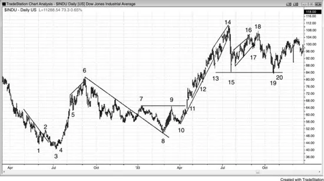
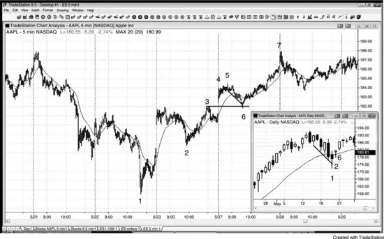
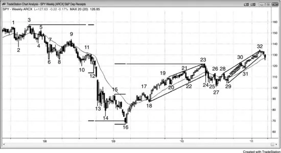
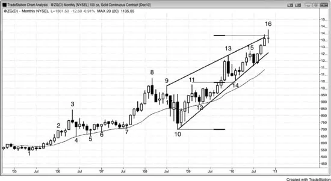
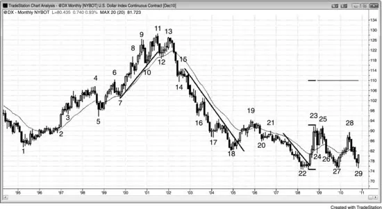
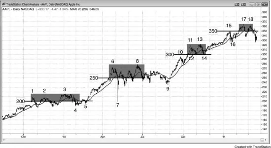
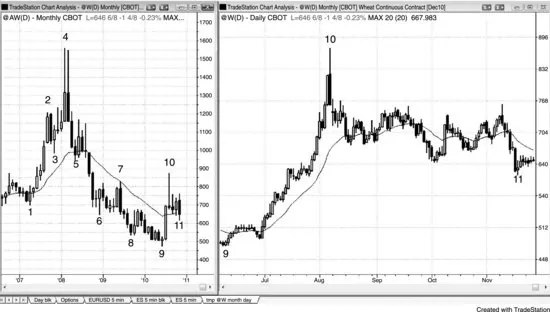
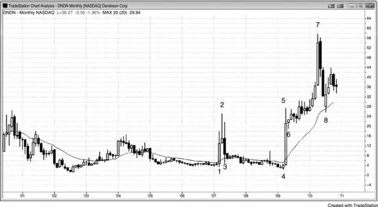

# 第 22 章：日线、周线与月线图

<!-- Source PDF pages 403–415 -->
<!-- English: Chapter 22: Daily, Weekly, and Monthly Charts -->

<!-- PDF page 403 -->

第 22 章
日线、周线与月线图

虽然日线、周线与月线图可以产生日内信号，但它们出现得如此之少，对日内交易者成为分心，应被忽略。最常见的信号是基于昨日高点与低点的信号，你可以在 5 分钟图上看到它们。然而，这些更长时间框架上经常有价格行为入场，但由于信号K线如此之大，若风险要与日内交易相同，可交易的合约数远更少。此外，隔夜风险可能意味着你应进一步减少合约，或考虑使用有限风险的期权策略，如直接买入或价差。日内交易者只有在这些图在交易日不占据其思想时才应交易它们，因为在护理基于日线图的远更少合约或股数的交易时，很容易错过使用大成交量的几笔日内交易，这些错过可以超过日线信号的任何收益。

虽然所有股票形成标准价格行为形态，机构持股很少的非常小公司股票有异常大上下运动的显著风险。它们往往更波动，在股市术语中，这些股票称为高 beta 股票。例如，你不会预期沃尔玛（WMT）在一个月内跳涨 1,000%，但当小制药公司的一种药获 FDA 批准或突然成为收购候选时，这正是可能发生的。一些交易者喜欢巨大、快速的运动，但多数交易者更愿意避免双向突然巨大运动的风险及其交易上的糟糕成交。交易这些特殊情况的交易者必须非常密切地观察股票，这使他们难以同时交易其他股票。由于风险如此之大，他们只能以这种方式交易投资组合的一小部分，这抹去了大行情带来的多数收益。当你加上不可预测性的压力时，多数交易者不应理会这些股票。

当逆强趋势交易时，目标应是 1% 或 2% 的剥头皮，因为多数逆势交易只导致成为顺势入场的回撤。缺口使入场复杂化，一般而言，若市场在昨日区间内开盘然后交易穿过该区间外 1 tick 的入场止损，风险更小。

<!-- PDF page 404 -->

若你无法在日内观察股票且有跳空开盘，最好放弃交易。若你可以观察股票且有跳空开盘，寻找缺口回撤，然后在缺口内失败回撤上入场，当市场恢复远离昨日区间的运动时。换言之，若你在寻找买入但今日跳空高开，寻找今日开盘抛售，然后买入开盘反转回上，把保护性止损放在今日低点下方。若入场失败且你的止损被打到，去别处看，或若有第二次买入形态只再试一次。不要在未做你希望它做的事的股票上花太多时间，因为你会亏钱。亏损后想在同一只股票上赚回钱有自然倾向，但这是你情绪弱点的迹象。若你觉得需要证明你是对的且事实上是伟大的读图者，你可能对此是对的，但你不是伟大的交易者。伟大的交易者接受亏损并继续前进。

日线图上的回撤很少有经典反转K线，使交易者比交易 5 分钟图有更多不确定性。不确定性意味着风险，当有更多风险时，仓位规模需要更小，交易者将不得不考虑建立部分仓位并随价格行为展开而加仓。在多头回撤中，若市场再抛售一点但空头尚未证明他们在控制，可以在更低价格加仓。也可以在趋势恢复且小回撤在你原始入场上方形成更高低点后以更高价格加仓。

当你在日终扫描日线图时，你会经常看到次日可考虑的形态。一旦形态触发，常会有提供许多好的 5 分钟顺势入场的日内趋势。若该股票不是你通常日内交易的，但其成交量约五百万股或更多，值得考虑把它加入你的日内交易股票篮子一两天。然而，有时即便对像石油服务 HOLDRS（OIH）这样流动性非常好的股票，你的经纪商可能没有可供做空的库存，你可能只能交易买入形态。若你真想做空，你可以改为买入看跌期权，即便做日内交易。

由于整数是磁铁，它们可以设置交易。例如，若 Freeport-McMoRan（FCX）过去几个月上涨 20% 且现在交易在 93，许多交易者会假定它会到达 100。因此，空头不会激进做空，因为他们相信很快能在更好价格做空，多头会激进买入，因为他们相信 FCX 会走到磁铁上方。空头的缺席创造真空

<!-- PDF page 405 -->

效应，常导致股票迅速上行到磁铁。它通常会走到磁铁上方 5% 到 10% 然后回撤，并通常至少一次回撤到整数下方，然后决定下一步做什么。多头可以在它反弹进入整数磁场时买入并在略上方止盈，空头可以等到市场在上方再做空，然后在回测下行时止盈。多头通常会在那里再次买入做剥头皮。

图 22.1 价格行为随时间未变

价格行为是大量交易者出于无数理由独立行动以尽可能多赚钱的累积结果。因此，它的指纹保持不变，并将永远为能读懂它的人提供可靠的赚钱工具。图 22.1 是 1932 与 1933 年道琼斯工业平均指数日线图，它看起来像今天任何时间框架上交易的任何股票。

K线 2 是突破趋势线的 Low 2。

K线 3 是小最后旗形反转，以及趋势线突破后对 K线 1 低点的更低低点测试（趋势线突破然后测试可以是主要趋势反转）。

K线 4 是突破回撤与小更高低点。

K线 5 是强多头尖峰中的第一次回撤与 High 2。

K线 6 是多头尖峰后的楔形通道，导致两段大下行，结束于 K线 8。

K线 7 是趋势线突破与两段回撤。它是大楔形多头旗形的突破，第一次下推在 K线 5。

K线 8 是更低低点主要趋势反转与突破回撤、更大

<!-- PDF page 406 -->

楔形多头旗形，以及对 K线 2 的突破回测。

K线 10 是更高低点，以及从 K线 7 到 K线 8 的空头通道上方 K线 9 突破的回撤。空头通道是多头旗形。

K线 11 是失败的 K线 7 与 9 双顶空头旗形上方突破后的小 High 2 突破回撤。

K线 12 与 13 是次要趋势线突破后的向上反转。

K线 14 是楔形与小最后旗形反转。

K线 15 是强动能逆势运动，在反弹测试 K线 14 高点后很可能被测试。它与 K线 13 形成双底多头旗形，但下行足够强，市场可能已翻转为始终做空。交易者会寻找做空更低高点，且若做多会使他们更难在更低高点做空，则不会在这里寻找买入。有时当交易者在寻找做空更低高点时剥头皮做多，他们在做空设置时无法改变心态去做空。

K线 16 是楔形更低高点，K线 17 是楔形的失败突破。

K线 18 是对多头趋势极端 K线 14 的更低高点测试，是楔形更高高点突破回撤上 Low 2 入场做空。楔形下方有失败突破，到 K线 18 的反弹是楔形的更高高点突破回撤。其他交易者把它简单地看作比结束于 K线 16 的更好的楔形。K线 18 也是 K线 14 信号K线低点的突破回测。

K线 19 是对 K线 15 低点的测试，是双底多头旗形。

K线 20 是向上反转中的更高低点回撤。

图 22.2 缺口回撤

<!-- PDF page 407 -->

如图 22.2 所示，当日线图有买入形态且市场跳空到昨日高点上方时，交易者常等待在 5 分钟图上买入回撤。AAPL 在日线图（缩略图）上处于强多头趋势，并在 K线 1 有第一次均线回撤，那是空头趋势通道超调（两张图编号相同）。日线图上 K线 2 有强日内向上反转并收在高点附近。想在日线图 K线 2 高点上方 1 tick 买入是合理的，那是 5 分钟图上 K线 3 的高点。然而，次日跳空到第 2 日高点上方。与其冒可能的反转向下日的风险，审慎的是在 5 分钟图上对缺口的回撤测试后寻找向上反转。

5 分钟图上 K线 6 关闭了缺口，是均线缺口K线以及空头趋势通道超调与向上反转。这是绝佳做多入场，保护性止损在 K线 6 下方。这 62 美分风险导致数美元收益。

图 22.3 周线 SPY

<!-- PDF page 408 -->

如图 22.3 所示，SPY 周线图看起来处于空头反弹中，因为从 K线 16 到 K线 32 的上行斜率比到 K线 16 的抛售更浅。此外，市场没有保持在上方震荡区间底部 K线 6、8 与 10 低点创造的阻力上方。然而，反弹已回撤空头趋势到 K线 16 的如此之多，空头趋势没有留下多少影响力，市场因此变成了大震荡区间。若它是空头反弹，则它最终应测试 K线 16 低点。多头希望市场继续走到从 K线 3 下行的空头趋势中摆动高点上方，并最终突破至新历史高点。空头希望市场在由 K线 21、22、23、27 与 32 形成的扩张三角形中失败，然后跌破三角形底部 K线 27 下方，随后到 K线 16 下方新空头低点。由于反弹如此之大，图表已变得更像大震荡区间，并失去了来自趋势的确定性。不确定性是震荡区间的标志；一旦市场看起来不确定，它通常处于震荡区间，如这里的情况。

在从 K线 3 的下行中，市场开始在 K线 5、9 与 11 形成更低高点，在 K线 6、8、10 与 12 形成更低低点。由于尚未有强空头突破，几率偏向这一抛售是对震荡区间底部的测试或可能的大多头旗形。一些交易者相信到 K线 6 的空头尖峰可能使市场翻转为始终做空，但到 K线 13 的空头尖峰对任何仍有怀疑的交易者把始终持仓仓位翻转为做空。

K线 14 是第二次卖盘高潮的第三根，以及最后旗形两K线反转尝试，但市场从 K线 15 再次在尖峰与高潮空头中下跌。

<!-- PDF page 409 -->

这是第三次卖盘高潮与楔形底部（K线 13、14 与 16）。底部刚好过了基于上方震荡区间高度的等幅运动目标。

到 K线 17 的上行有 12 根多头实体、小影线，且只有几根多头实体，强到足以被多数交易者视为尖峰。在 K线 16 低点的三次卖盘高潮与这一上行尖峰之后，交易者认为应至少有第二段上行，可能基于 K线 16 低点与 K线 15 或 K线 17 高点顶部的等幅上行。

K线 23 刚好略高于等幅运动目标与趋势通道线顶部，是上方震荡区间底部 K线 6、8 与 10 区域的两K线向下反转。第一个目标是跌破通道，发生在 K线 24。第二段下行结束于 K线 27 两K线反转。K线 29 形成了从 K线 23 下行的两段多头旗形在 K线 28 突破后的更高低点突破回撤。它也是头肩底多头旗形的右肩，左肩在 K线 24 与 25 之间形成。K线 21 与 28 之间的震荡区间也是头肩顶，K线 21 是左肩，K线 23 是头部，K线 26 与 28 双顶是右肩。如 80% 的顶部形态所发生的，市场向上突破，空头再次学到多数顶部只是多头旗形。

从 K线 29 到 K线 32 的运动在相当窄的多头通道中，很容易后跟更高价格。然而，由于整张图是大震荡区间，大反弹通常后跟大抛售，市场可能很快开始向下调整到扩张三角形底部 K线 27，甚至到 K线 16 空头低点区域。

K线 16 是等幅下行。多数机构做他们相信会成功的交易，意味着概率至少 60%。他们因此需要至少等幅运动才有正的交易者公式（等幅运动是回报变得与风险一样大、交易者公式开始变得合理盈利的地方）。结果是交易常精确打到目标然后反转或至少停顿，因为许多公司会在那里部分或全部止盈。多数目标，像所有支撑与阻力一样，很快失败，因为等幅运动是最低需要，许多公司会觉得市场足够强以远超。

图 22.4 月线黄金楔形通道

<!-- PDF page 410 -->

如图 22.4 所示，月线黄金图在从 K线 7 到 K线 8 的多头尖峰后处于楔形通道中。一些交易者会把当前运动看作第三次上推，K线 11 与 13 是前两次推进。其他人把 K线 8 或 9 看作第一次推进。

每当五到 10 根接近趋势线时，几率很好市场不久会跌破趋势线。这使从 K线 10 上行的多头趋势线容易受到向下突破。由于市场刚好在趋势通道线与等幅运动目标上方，几率偏向很快开始两段抛售。最低限度，市场应调整到 K线 8 高点略下方，可能调整到楔形底部 K线 10。较不可能的是，会有楔形顶的上方突破与等幅上行。

图 22.5 月线美元指数期货

<!-- PDF page 411 -->

如图 22.5 所示，月线美元期货有几笔可归类为最佳交易的交易。美元与瑞士法郎和日元一样，是避险货币，交易者在认为股市会下跌时倾向于买入它们。

美元在突破 K线 2 空头旗形顶部时有多头尖峰上行，把市场转为始终做多。它然后形成通道，后跟对通道起点 K线 3 底部的 K线 5 测试。这在 K线 5 创造了双底多头旗形，后跟 K线 7 突破回撤买入形态。市场在 K线 11 更高高点见顶。一些交易者把从 K线 3 到 K线 11 的运动看作宽通道，其他人把通道看作始于 K线 5 或 7。所有交易者都怀疑 K线 11 或 K线 13 可能是向通道底部调整的开始，因为市场正变得双边，有几次反转与明显空头实体。这些代表累积的卖盘压力。

到 K线 10 的下行是强空头趋势K线，跌破从 K线 7 上行的陡峭多头趋势线（未画出）。这是足够强的运动，使许多多头在反弹到 K线 11 新高时止盈。空头在那个更高高点开始做空，在 K线 13 更低高点主要趋势反转处甚至更激进。到 K线 12 的下行有两根强空头趋势K线并跌破多头趋势线。市场本应至少有两段下行，但它反而有到 K线 14 的空头尖峰然后到 K线 18 的通道。到 K线 14 的下行使多数交易者确信市场已翻转为始终做空，因此应后跟更多卖出。

空头通道继续下行到 K线 18，那是大空头趋势结束时卖盘高潮中的第五根。

<!-- PDF page 412 -->

交易者预期反弹，至少到均线。它也是与 K线 1 的双底。

在均线处有 20 缺口K线做空，但由于上行尖峰很强，更好的是等待第二次信号。第二次信号随 K线 19 均线缺口K线而来，它与 K线 17 后小反弹高点形成双顶空头旗形。

到 K线 20 的尖峰后跟到 K线 22 的抛物线因此高潮式通道，市场在那里形成更低低点主要趋势反转。在那里，市场在 iii 形态变体中横盘（仅实体）。它有失败的 Low 1 做空，在小双底中向上反转，到 K线 23 的多头尖峰异常强。这可能使市场翻转为始终做多，并使多头尝试保持市场在尖峰底部上方。他们在低点附近激进买入，在 K线 27 与 29 也如此，创造双底多头旗形。K线 27 是双底主要趋势反转，K线 29 是三角形第三次下推后的向上反转，最终可能向上或向下突破。楔形多头旗形（K线 24、26、27）后跟另一次反弹然后 K线 29 双底。这是做多的好风险/回报形态，因为交易者在震荡区间底部买入。等距上行的概率可能是 60%，因为市场在震荡区间底部。风险约 5.00 美元，有 60% 机会测试震荡区间顶部 K线 28。交易者冒 5.00 美元风险赚 10.00 美元，概率 60%，非常好。每笔交易平均利润约 4.00 美元。由于这也是双底多头旗形，几率可能好于 60%。目标会是出这一震荡区间的等幅上行，并会测试到大约空头通道顶部 K线 15。

重要的是认识到这意味着约有 40% 机会市场会跌破 K线 22 低点下方，因此若发生交易者需要离场。若发生，下一个目标会是等幅下行，基于 K线 27 到 28 或 K线 22 到 23 段的高度。

即便市场确实上行，几率偏向它会在 K线 11 高点附近停顿并形成更大震荡区间。

图 22.6 整数可以是支撑与阻力

<!-- PDF page 413 -->

如图 22.6 所示，这张日线图说明处于强多头趋势的 AAPL 如何在显著整数下方停顿，整数常是把市场吸向它们的磁铁。一旦足够多交易者确信磁铁会被到达，空头停止做空，市场在买盘真空中反弹到目标上方。例如，空头相信市场会走到 300 美元上方，可能至少 5% 到 10% 上方，因为那是市场一旦在整数磁拉力中通常会做的。由于空头预期市场到达约 315 美元（整数上方 5%），他们靠边站。在他们相信市场几根内会更高时在到达前做空对他们没有意义。他们的缺席使市场迅速上行，因为多头必须把市场推得更高以找到足够交易者接他们多单的另一边。

一旦市场在目标上方 5% 到 10%，多头开始止盈，空头开始做空以回测整数，整数通常至少一次被穿透。到 K线 12 低点的回撤差 1 美分未到 300 美元（K线 12 低点是 300.01 美元），市场在该日收盘急剧反弹。K线 13 附近的双顶做空成功把 AAPL 打到 300 美元下方，但买方回来形成 K线 14 双底。

图 22.7 日线与月线可以处于相反趋势

<!-- PDF page 414 -->

如图 22.7 所示，小麦在右侧日线图上有急剧反弹，但在左侧月线图上只是熊市反弹，K线 10 在空头趋势中形成均线缺口K线、与 K线 7 的双顶空头旗形，以及对上方震荡区间底部 K线 3 与 5 的突破回测（头肩顶）。两张图编号相同。

在日线图上 K线 10 空头反转K线形成的前一日，一位电视名嘴说小麦会走高得多，他在市价买入并在回撤买入。当趋势在长多头尖峰（10 到 20 根）后形成大多头趋势K线时，有长期两段回撤的巨大风险，因为多数强多头只会买入显著回撤，多数强空头会在市价做空并在更高处分批加仓。电视名嘴最终可能对小麦走高得多是对的，但他通过在抛物线尖峰与高潮顶部买入占用了太多资本。相反，他应做机构在做的事。空头在做空，多头在等待两段回撤再买入。

在 K线 10 前一日，新闻对小麦显然非常看多，但这无关紧要。图表告诉交易者强空头与多头预期大调整。尖峰与抛物线高潮告诉交易者弱多头与空头在做错事，强多头与空头在押注回撤。赚钱交易的最佳方式是做聪明资金在做的事，而不是听电视专家。聪明资金如此巨大，那些聪明交易者无法隐藏他们在做什么。然而，你必须能读图才能理解正在发生什么。

<!-- PDF page 415 -->

图 22.8 新闻可以推动股票

如图 22.8 所示，Dendreon 公司（DNDN）因其前列腺癌药物的新闻发布有急剧上下运动。它在结束于 K线 2 的两个月内跳涨 800%，在接下来几个月回吐该收益的 90%。它然后到 K线 7 跳涨 2,000%，然后在接下来三个月下跌 50%。由于有巨大上下运动的风险，交易者只能交易小成交量，这一减少的仓位规模抵消了他们从大摆动中获得的任何收益。当你加上因不可预测性而来的压力时，多数交易者在处于这样的市场中时几乎不可能交易任何其他东西，他们很可能通过避开这些特殊情况赚更多钱。它们看着有趣，但你的目标是赚很多钱，而不是在罕见大行情后从小仓位赚一点钱后获得情绪兴奋或无意义的权力感。
