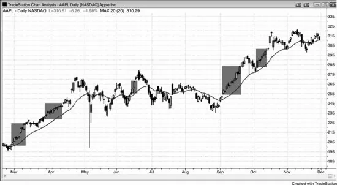
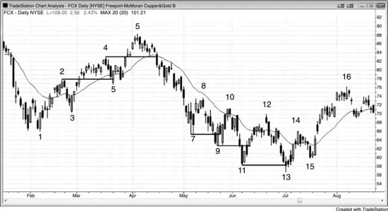
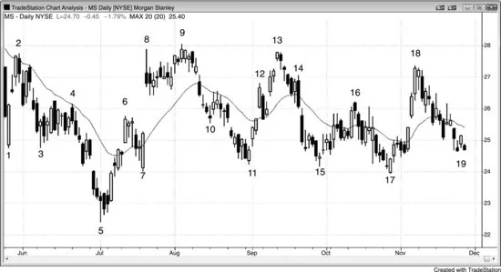
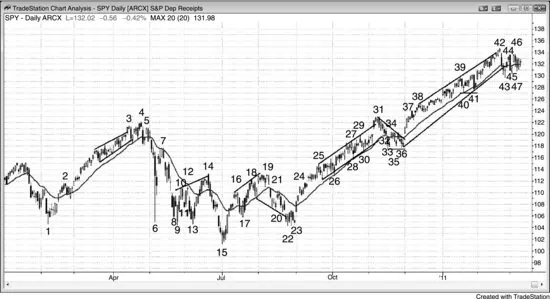
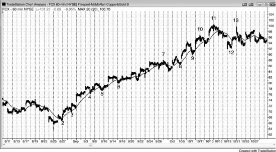
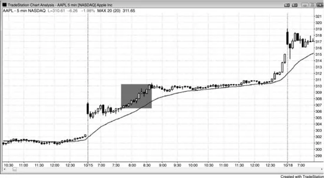
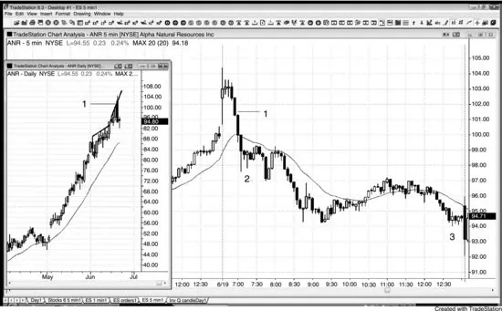
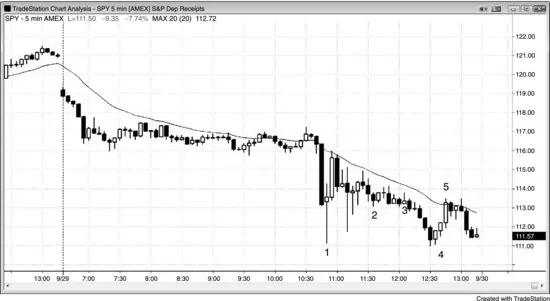
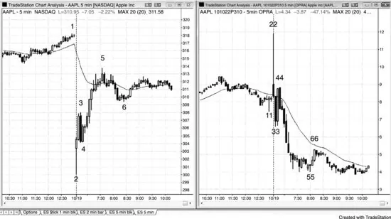

# 第 23 章：期权

<!-- English: Chapter 23: Options -->
<!-- Source PDF pages 416–438 -->

<!-- PDF page 416 -->

第 23 章
期权
我曾与一位女交易者交谈，她是小企业主，为自己和丈夫管理股票组合。有一天，她醒来发现组合自前一天以来下跌了 50 万美元。那天她成了日内交易者，决定再也不把交易过夜持有。她是好的图表阅读者，但不再愿意有任何可能导致巨亏的隔夜敞口。作为替代，她本可对想持有数日到数周的交易改做期权交易。她是强交易者，本可继续用期权交易组合的相当部分，而不是把自己限制在日内交易。我多年没和她谈过，但我相信无论她是否严格只做日内，她都做得不错，但若把期权纳入策略，她可能做得更好。
因为期权的买卖价差常很宽，交易者通常应只考虑更高时间框架图表上的期权交易。任何有显著正交易者公式的形态都合理。以下是交易者可基于 60 分钟或日线图考虑买入看涨或看跌期权的一些情形示例：
多头趋势中回撤到移动平均线时买入看涨期权。
空头趋势中反弹到移动平均线时买入看跌期权。
震荡区间底部买入看涨期权。
震荡区间顶部买入看跌期权。
空头阶梯形态中的新低买入看涨期权。
多头阶梯形态中的新高买入看跌期权。
强多头突破中的多头尖峰期间买入看涨期权。
强空头突破中的空头尖峰期间买入看跌期权。
震荡区间底部疲弱 Low 1 或 Low 2 下方买入看涨期权。
震荡区间顶部疲弱 High 1 或 High 2 上方买入看跌期权。
你也可基于 5 分钟图等更小时间框架交易期权： <!-- PDF page 417 --> 若你是新交易者，账户有限，或想确定风险，可买入 SPY 看跌或看涨期权，而不是交易 SPY 或 Emini。SPY 与许多大盘股的当月平值（ATM）期权买卖价差通常只有一个 tick。这使交易者可在 5 分钟图上下单，仍有有利的交易者公式。
在极少数情况下，当日内价格运动如此巨大，以至于你不愿信任标的（如 Emini、股票、债券、货币或你交易的任何市场）的报价或成交时，你可用限价单买入看跌与看涨期权，基于 5 分钟图做日内交易。
还有许多其他值得交易期权的情形，以及许多其他有用的期权策略，但上述对日内交易者最容易、也最不分散注意力。若交易者能处理其他类型的期权交易，他们应该去做，但多数活跃日内交易者无法在不干扰日内交易盈利潜力的情况下做那些交易。风险逆转、无现金领口与比率价差一般提供出色的交易者公式，但对日内交易者可能太分心。下单相对复杂，需要大量专注才能做对。你有许多行权价与到期日要考虑；买卖价差常很宽，因此交易感觉有点贵；而且你应使用限价单，但它们常不能很快成交。然后你必须管理交易，常会想在交易演化时做调整。外汇交易者在认为股票市场将下跌时，用货币交易对冲股票组合，买入避险货币如瑞士法郎或美元，做空风险货币如瑞典克朗，以获得同样对冲。这避免了期权成本，但需要对外汇市场自在，而外汇大量活动发生在隔夜。所有这些对日内交易者都非常分心，多数人要么专注日内交易，要么只在交易中加入简单的看跌或看涨期权买入。
最容易的是主要买入看跌或看涨期权，有时买价差，并寻求持有一到数日。你可考虑允许一次对你仓位不利的新极端，并愿意加仓，因为这些策略下风险精确已知且有限。在可能的主要趋势反转顶部，你也可只做空少量股票仓位，但你可能倾向于在日内过多关注它，这会使你错过日内交易，最终抵消股票交易的任何收益。

<!-- PDF page 418 -->

期权含有时间价值，每天融化，降低你看跌或看涨期权的价值。若你买入价差，进出时在两个行权价的买价与卖价上都亏损，且佣金翻倍。由于这些成本，交易者必须把自己限制在只交易最好的期权形态。此外，他们只有在真正增加净利润时才应把期权加入日内交易，对多数交易者并非如此。任何东西盈利交易对所有交易者都难，多数盈利交易者通常选择专注期权、期货或股票之一，而不把注意力分散到三者。然而，要知道期权交易者把股票仓位视为交易的组成部分，多数持仓数日到数周，而非像日内交易者那样数分钟到数小时。
还有一种极少数情况，日内期权可比期货与股票更可取。那就是市场处于巨大自由落体且接近跌停时。若可靠反转形态出现，你可能认为即便小仓位买入 Emini 的风险也小，但即便在信誉良好的券商处风险也可能很大。怎么可能？因为系统可能过载，你的订单可能 30 分钟或更久得不到处理或回报。若你刚买入自认为的底部，然后市场跌破你的保护性止损，你可能仍在电脑屏幕上看到止损单是工作中、未成交状态，即使市场已远低于它。那你怎么办？你不知道订单是否成交，打电话问券商时你被挂起 30 分钟。然后约 30 分钟后，电脑屏幕显示你的订单在本应成交时带有一些滑点成交。在巨大空头日券商订单系统不正常时，你无法承受如此长时间活在这种不确定中。你很容易在 Emini 上亏 10 点，因为券商从不对你的订单成交负责。替代是买入看涨期权，这样若你入场后市场自由落体，你确定自己的风险。你可尝试用看涨期权上的止损限制潜在亏损，但即便市场远低于你的止损而未成交，至少你知道即便止损单从未被处理，风险也非灾难性（假设仓位规模合理）。市场如何跌破你的保护性止损却不触发它？止损基于最后成交价，若你的特定期权没有成交发生，买价与卖价可能远低于你的止损，但止损不会成交，你的期权价值会远低于你以为的。重要的是理解期权中的保护性止损常不提供保护，若市场快速对你不利， <!-- PDF page 419 --> 你应尽快用限价单尝试离场。
你也可考虑日内交易 SPY 期权而非 SPY 或 Emini，尤其在起步时且害怕巨亏时。例如，若你买入一个月后到期的 SPY 平值（ATM）看涨期权，可能花费约 250 美元，即便 SPY 跌到零，这是你最多可能亏的（显然这假设你买入看涨期权，没有搞错，比如裸做空看跌或看涨）。即便 SPY 在下一小时跌 1%，你大概能以不到 100 美元亏损离场。若你在多头趋势回撤中买入看涨期权，很有可能能以 10 到 20 美分利润离场，即 10 到 20 美元利润。这大约需要 SPY 移动 25 到 45 美分。若 SPY 反而跌 50 美分，你可能以约 30 美分亏损离场看涨期权，即 30 美元。买入看跌或看涨期权给初学交易者更多关于最多风险多少的确定性，这可能使他们更容易思考如何交易，而不不断担心美元。
若你在期货或股票市场每天只做几笔日内交易，则可在期权市场更活跃，尤其若你也积极波段交易股票。机会可再写一本书，但这里值得说几点。例如，若你做多一只在日线图上筑底的股票并愿意更低加仓，你可在市价下方一个行权价卖出看跌期权。若股票上涨或甚至小跌，你收取权利金；若它跌到看跌期权行权价下方，该看跌期权买方会把股票 put 给你（你将被迫以行权价买入），因此你在该更低价位加仓多头股票仓位。
对做多股票的交易者，另一常见期权用途是卖出虚值（OTM）看涨期权以收取权利金。这种备兑看涨期权卖出每年可给你的组合增加约 10% 回报，但偶尔会把你带出正在爆炸向上的股票。
若你预期股票或期货合约有大行情但不知道方向，可买入跨式（同时买入看跌与看涨），但然后你在两腿上都承受时间衰减、佣金与买卖价差。跨式很少值得。期货交易者的替代是把期货与期权组合成 delta 中性仓位，意味着上涨或下跌机会相等。例如，在 Emini 中，一张多头合约等于买入 500 份 SPY 或 10 张平值看涨期权。若你买入一张 Emini 合约（或 500 SPY）与 10 张 ATM 看跌（或者，你可做空一张 Emini 或 500 SPY 并买入 10 张 ATM 看涨），这在你下单那一刻是 delta 中性仓位。若市场向上或向下移动，delta 改变。若 <!-- PDF page 420 --> 市场上涨，你的 Emini 赚的比看跌期权亏的多；若市场下跌，你的看跌期权赚的比 Emini 亏的多。你只有在市场横盘数日时才亏钱，因为你的期权会衰减。随着市场移动，你可以做许多微调以增加回报，但 Emini 日内交易者太忙，无法把这加入交易。
期权交易者常谈催化剂，即可能导致股票大行情的即将到来的新闻事件。最常见的是即将公布的财报，较少见的包括新产品或可能收购的预期信息。因为存在不确定性且向上或向下大行情的潜力大，权利金通常被大幅抬高。新闻一公布，权利金就被压垮，严重到你可以看到朝你预期方向的大行情却仍亏钱！例如，假设你认为亚马逊（AMZN）财报会强劲，于是前一天以 5.00 美元买入看涨期权，财报确实强劲，AMZN 开盘涨 5%；然而，你的看涨期权可能只以 4.00 美元开盘。你对强财报与强开盘是对的，但权利金抬得如此之高，AMZN 大概必须涨 10% 你的看涨期权才增值。由于这种被大幅抬高权利金的迅速流失，交易者在催化剂前买入期权需谨慎。若波动率太高，它们昂贵，需要巨大行情才能盈利。减少影响的一种方式是买入价差，这样你的空头期权权利金损失大致抵消多头期权损失，但价差通常只有在你计划持仓一周或更久时才值得买，因为它们通常只有在有大行情、或有较小行情且临近到期时才盈利。
许多指数期权交易者关注芝加哥期权交易所市场波动率指数（VIX），它往往与指数反向移动，一般当市场恐慌下跌且交易者买入大量看跌期权对冲多头时大幅上升。其他交易者显然买入看跌期权作为空头趋势将延续的押注。然而，市场开始再次向上后，看跌期权买入也可能增加，但原因不同。不是投机者押注下跌或恐慌多头对冲，而常是因自信多头在保护其新多单。当是这种情况时，看跌期权买入意味着下行风险小得多。这些新多头愿意在抛售中持有股票仓位，因为他们买入了看跌期权作保护，因此若市场下跌，他们会持有股票与期货仓位，而不是恐慌卖出并把市场进一步打下去。换句话说，这种看跌期权买入是下行风险已缩小、多头正变得自信的信号。然而， <!-- PDF page 421 --> 不可能知道市场中整体看跌期权购买是为进一步下跌投机还是为保护新多单。依赖电视名嘴的观点从不是建仓的好基础。若他们能靠交易赚很多钱，他们多数不会浪费时间在 CNBC 上高谈阔论。
许多对冲基金买入股票并用买入看跌期权对冲，要么是组合中的具体股票，要么是整体市场，如 SPY 看跌期权。对冲基金很少完全对冲，多数根据整体市场调整看跌保护数量。一些用波动率指数调整看跌期权。例如，若因过去几周股市跌 10% 而波动率指数上升 20%，他们会买回部分或全部看跌期权，因为看跌已起到作用。他们最初在市场更高时买入看跌，作为股票组合抛售的保护。若市场抛售且股票贬值，看跌期权会增值。他们会在看跌上获利了结，要么在等待市场再反弹时减少对冲，要么买入新看跌把对冲滚动到更远合约，通常更低行权价。若市场强劲反弹且他们对冲相对较少，他们会买入更多看跌以增加下行保护。
若你在日线或 60 分钟图上交易期权，并确信行情将在未来一两天内开始，最好只买入期权而不是价差。然而，若你认为行情可能需要一周或更久才开始，你可通过购买价差减少时间衰减影响。你降低总盈利能力，因为市场朝你方向走时空头期权价值增加，但整体风险/回报比改善。一般而言，选择靠近支撑或阻力区域的空头期权行权价。例如，若 SPY 在 105 且有强买入信号，但 108 附近有阻力，你可买入一个月后到期的 ATM 105 看涨，部分通过做空 OTM 108 看涨融资。多头看涨净成本减去空头看涨收取的权利金可能约 1.20 美元。既然 108 是阻力且阻力起磁铁作用，市场应被吸到 108 区域。两张看涨都会增值，但多头 ATM 105 看涨增值更快，并足以弥补空头 108 看涨的亏损。若市场以非常强的多头尖峰反弹，你认为它会轻松突破 108 阻力区，你可亏损买回空头 108 看涨并持有多头 105 看涨，它的利润足以抵消空头看涨的亏损。若到 108 的反弹疲弱，你认为市场可能抛售，你应带利润离场价差。通常不值得持有价差到到期，即使那时实现最大利润。

<!-- PDF page 422 -->

你的前提已变，因此需要重新评估仓位，这在交易期权时始终要考虑。若 SPY 在到期时在 108，空头 108 看涨将无价值到期，多头 105 看涨将值 3.00 美元，因此你的总净利润可能约 1.80 美元。然而，若市场在到期前还有两周时在 108，你的净浮动利润是 1.50 美元，可能更好直接离场，因为不值得冒着坐穿 105 下方抛售、把 1.50 美元利润变成亏损的风险。随着市场反弹到 108，你的风险/回报情况已变，不再像建仓时那么好。更好是拿走利润并寻找下一笔交易。
交易者可买入或卖出价差。例如，若 SPY 在 130，交易者认为会上涨，他可通过买入 ATM 130 看涨并卖出更高行权价的 OTM 看涨（如 133 看涨）买入看涨价差。他也可通过做空看跌价差做看多押注，如卖出 ATM 130 看跌并买入 OTM 125 看跌。一般而言，多数交易者偏好买入价差而非卖出，因为他们偏好做多而非做空 ATM 期权。若他们做空 ATM 期权且标的甚至略微不利，他们有额外、不想要的工作风险。例如，若他们做空该看跌价差，SPY 跌到 129 并在到期临近时停在那里，股票可能被 put 给他们，意味着券商会自动以 130 卖给他们股票；然后他们必须决定如何处理股票与剩余的多头 OTM 看跌。
买入价差通常最好在你计划持仓数周时，尤其若你能把仓位持入最后一周。因为空头行权价总是更虚值；仓位越虚值，通过时间衰减损失权利金越快，且在最后一周衰减急剧加速。然而，若你预期在该时间内有远超空头行权价的巨大行情，你也可买入价差并打算只持有几天。只有当你认为市场将在那一周内超过你的空头行权价时，才为预期持有不到一周的交易买入价差。否则，只买入简单看涨或看跌。例如，假设 SPY 在 134，你认为未来一周会跌到 130。你可以买入看跌，如 ATM 134 看跌，或考虑价差，如多头 134 看跌与空头 132 或 131 看跌。
由于即便市场不变期权每天也亏钱，你应仅在相信前提仍成立时持有仓位。否则，离场，即便亏损。你如何知道前提是否仍成立？看此时此刻的市场，想象你未持仓。然后问自己是否会建立完全相同的仓位。若不会，则前提无效，你应立即离场。
初学者的常见错误是持有盈利期权仓位太久。例如，若交易者在震荡区间底部买入看涨，目标是下周测试区间中部，但市场仅一天就冲到目标，通常更好在那时拿走大部分或全部利润。是的，强动量可能是多头趋势的开始，但更可能震荡区间会继续，要么市场很快横盘并通过时间衰减侵蚀权利金，要么市场回撤利润消失。期权利润消失很快，因此一旦有利润就拿走非常重要。
不要因为股票知名就假定其期权大量交易。若不是，买卖价差可能大得不可接受。例如，ATM 看涨的买价可能是 1.20 美元，卖价可能是 1.80 美元。这意味着你大概必须付 1.80 美元买看涨，若立即卖出会收到 1.20 美元，瞬间亏 60 美分，或投资的三分之一！一般而言，若你考虑的行权价未平仓合约少于 1,000 或近期日成交量少于 300 张期权，你通常不应下单。你很少、如果有的话，应交易成交稀少的期权。然而，若你做，你应始终用限价单进出。即便如此，你的限价单可能挂数小时等成交，有时你最终会屈服并市价离场，大大降低利润潜力。活跃期权市场如 SPY 的好处之一是，当月 ATM 与近值期权的买卖价差通常只有一美分，因此你可下市价单并得到出色成交。
大买卖价差本身不应阻止买入期权，因为价差与股票价格成比例。当 AAPL 在 300 美元交易时，ATM 看涨买卖价差可能 20 美分，对初学者可能看起来很多。然而，交易者不会犹豫买入 30 美元股票上买卖价差 2 美分的期权。他们可能每买一张 AAPL 看涨就买 10 张 30 美元股票的看涨。这是数学上合适的交易方式。
若你在日线图强尖峰期间入场，且市场离目标还有一段路，价差可能有用。例如，若 SPY 在 118，在新空头趋势中远低于移动平均线急剧下跌，你相信它会在未来几天内触及 115，你可能犹豫买入看跌，因为市场可能突然向上反转到 <!-- PDF page 424 --> 移动平均线然后才跌到目标。作为替代，你可买入 118 看跌并做空 115 看跌。若市场在未来几天不停跌到 115 支撑区，你可带或许 1.50 美元利润离场看跌价差。若它反而反弹到移动平均线处的 120，你的价差可能有一美元浮动亏损。若你相信前提仍完整，你可通过买回空头看跌 leg out 离场价差，或许带 50 美分利润，但持有多头看跌。若你对了且市场随后在下周跌到你的 115 目标，你可能在多头看跌上再赚约 2.00 美元，该笔交易总利润约 2.50 美元。在市场对你不利时 leg out 离场价差需要经验，但若你对读图有信心，这可以是好方法。
顺便说，支撑与阻力位的空头期权增强那些水平的力量，因为期权往往在未平仓量最大的行权价附近到期。任何期权行权价成交量越大，该价格的磁铁效应越强，从而增加该价格的支撑与阻力。若成交量足够大，可在到期附近影响市场。若有明显的支撑或阻力位，成交量可变得巨大，因为该行权价会生成大量期权活动。事实上，SPY 与 QQQ 常在未平仓量最大的看跌与看涨行权价附近到期。期权空头侧通常由机构接手，他们是聪明资金交易者，他们会在期权市场与相关市场尽其所能使空头期权无价值到期，以便保留收取的全部权利金。
VIX 是 S&P 500 指数期权波动率的度量，虽然在强多头尖峰期间当你相信会有跟随时，买入看涨或 SPY 或 Emini 通常是好交易，但与 VIX 相关有风险。顺便说，VIX 每 16 点对应 S&P 500 指数约 1% 的预期平均日波幅（因此 VIX 为 32 意味着 SPY 与 Emini 的平均日波幅约 2%）。若尖峰足够强，VIX 也可能向上尖峰，你买入时看涨成本会抬高。若接下来几小时市场进入安静多头通道，VIX 可能跌到足以使你的看涨不增值。因此，若你想在多头尖峰期间买入看涨或在空头尖峰期间买入看跌，若不是在尖峰早期买入，更好等回撤，以减少在 VIX 短暂向上尖峰期间买入、导致所有期权短暂定价过高的风险。
期权波动率急剧增加通常导致 OTM 期权价格不成比例增加。这称为 skew（偏斜），偏斜定价 <!-- PDF page 425 --> 会令初学价差交易者不安，因为它导致利润小于看似公平或合乎逻辑的水平。若交易者在多头市场震荡区间中 SPY 约 133 时买入 133/128 看跌价差，为 133 看跌付 3.50 美元，空头 128 看跌收 2.00 美元，然后 SPY 在接下来两周因某种世界危机跌 4.00 美元，交易者可能假定价差也会增 4.00 美元。然而，由于市场急剧下跌时许多交易者买入 OTM 看跌保护多头，其价格相对 ATM 看跌不成比例增加，价差可能只增到约 2.50 美元，或 1.00 美元利润。随着市场急剧下跌，波动率急剧增加，这对 OTM 看跌（以及看涨）影响更大。然而，市场可能必须跌到更低行权价下方约 5%，或许到 123，价差在到期前几周才有接近 5.00 美元的利润。价差只有在市场远低于更低行权价、或在到期前最后一周时才接近利润潜力。交易者一般应仅在预期未来几周内的某个点会运动到接近空头腿时买入价差，或若他们愿意持有价差并在到期前一周左右离场。若 SPY 在到期时低于 128（更低行权价），看跌价差在到期时有全部 5.00 美元利润，但多数交易者在那之前离场。
由于日线图大尖峰期间 OTM 期权的偏斜，若交易者预期未来一周左右向上或向下运动，应考虑直接买入期权。若他们计划在到期前数周离场，应考虑不买价差。例如，若市场刚在日线图上强跌 3%，现在回撤到可能的更低高点，交易者预期未来几天内开始强第二段下跌，他们可能更好只买入直接看跌而不是价差。若他们愿意以总价 3.00 美元买入两份看跌价差，他们可能改为考虑以约 3.50 美元买入一张 ATM 看跌。若他们在未来一周左右得到预期的急剧抛售，若市场快速跌到 128，其看跌可能值 7.50 美元。这仍少于他们可能希望赚的 5.00 美元（买入看跌时 SPY 的 133 与当前价 128 之差），但远多于两份看跌价差上会赚的 2.00 美元。若其看跌在几天内快速增值 3.00 或 4.00 美元，他们应卖出仓位，因为市场可能回撤并进入震荡区间。若他们继续持有看跌，4.00 美元利润可能迅速变成 2.00 美元利润。反弹可能说服他们前提不再成立，然后他们以那 2.00 美元利润离场，希望 <!-- PDF page 426 --> 自己没有那么贪心。期权市场常给交易者意外礼物，但很少像初学者以为合乎逻辑的那么多。当它给时，几乎总是更好拿走礼物然后寻找下一笔交易。
图 23.1 多头尖峰期间买入看涨期权

当股票处于强多头尖峰时，交易者可买入看涨或看涨价差。许多在强多头中买入看涨的交易者偏好 OTM 行权价，因为时间衰减略小。如图 23.1 所示，这张 AAPL 日线图有几个由一系列小影线、少重叠的多头趋势K线组成的多头尖峰。动量很强，使概率偏向更高价格。若交易者想参与上涨但限制风险，他们可买入看涨或看涨价差。他们可在几天后拿走部分利润，然后在第一次反转迹象或回撤到接近入场价时离场剩余仓位。
当市场向上趋势且交易者想买入、但希望略低买入时，他们常会刚好在市价下方卖出看跌。例如，在任何阴影多头腿期间，交易者可卖出约 2% OTM、一个月后到期的看跌，收 8 美元。若市场下跌且股票被 put 给他们，他们在当前价下方 2% 入场，会高兴。若市场反而继续上涨，他们保留 8 美元，约一个月 2% 利润。其他交易者会直接卖出 ATM 看跌。例如，当市场在 260 并急剧上涨时，他们可卖出一个月后到期的 260 看跌约 12 美元。若股票被 put 给他们，他们保留 12 美元。这意味着即便它从未远低于 260 而只是继续更高，他们买入股票的净成本是 248。
图 23.2 用期权 fade 阶梯突破

<!-- PDF page 427 -->

当市场处于阶梯形态时，你可用期权 fade 每一次新突破，预期回撤进入前一阶梯。如图 23.2 所示，到K线 4 的反弹后，FCX 日线图有回撤到K线 2 高点下方，意味着多头不是太强。正确假定突破K线 4 上方会跟随回撤到K线 4 高点下方的交易者，可在K线 5 十字星或次日收盘前买入看跌，一旦清楚当日可能是强空头趋势日。
当市场在K线 9 向上并反弹到K线 7 低点上方数美元时，交易者可在K线 11 收盘时或刚好收盘前买入看涨，预期至少在K线 9 低点上方反弹几美元。他们可在K线 13 收盘时再次买入看涨，当他们看到K线底部大影线时。
K线 12 是空头反转K线，可能是最后旗形反转、移动平均线缺口K线、与K线 10 的双顶，以及可能震荡区间顶部的疲弱 High 1 或 High 2 突破。在日末买入看跌合理。由于市场从K线 5 处于宽空头通道，许多交易者在每次反弹到前一段下跌中点上方与移动平均线附近买入看跌。许多人等到接近收盘，确信当日会是空头趋势日，如K线 8、10、12 与K线 14 后那根。他们在最近摆动低点下方获利了结，所有空头的获利了结与多头买入结合，导致每次新低后的向上反转。空头在新低买回空单，而不是在突破上做空更多加码。这是空头趋势正过渡到双向市场（震荡区间）的信号。
图 23.3 用期权 fade 震荡区间极端

<!-- PDF page 428 -->

当市场处于震荡区间时，交易者可在区间顶部附近买入看跌并离场先前买入的看涨，然后在区间底部附近买入看涨并离场看跌。如图 23.3 所示，从K线 5 低点向上反转后，摩根士丹利（MS）在K线 9 后向下反转，那是突破K线 2 高点上方的第二次尝试。由于有到K线 6 的尖峰然后到K线 7 的回撤，到K线 9 的三次向上推动（K线 6 是第一次推动）很可能作为通道运作并跟随对通道底部K线 7 的测试。交易者可在K线 9 后第三根形成的空头K线收盘附近买入看跌。
K线 11 是多头反转K线，与K线 7 形成双底多头旗形，也是到K线 10 空头尖峰后通道的底部。交易者可在该K线收盘时离场看跌并买入看涨。
K线 13 后那根有空头实体，交易者可在区间顶部离场看涨并买入看跌，尤其因为这是楔形空头旗形。K线 10 后两根形成第一次向上推动，K线 12 是第二次。
到K线 15 的下跌跟随非常强的尖峰，即便K线 15 与K线 11 形成双底，市场在能大幅反弹前可能需要更多筑底。在此买入看涨的交易者应在K线 16 楔形空头旗形顶部的反转上获利了结。
K线 17 是多头反转K线，是从K线 9 高点的第三次向下推动。许多交易者把这看作从K线 5 到K线 9 强行情后的可能多头三角形，这是买入看涨的机会。它也是震荡区间底部 Low 2 的向上反转（K线 7、11 与 15 确立区间底部）。震荡区间底部的 Low 2 做空信号 <!-- PDF page 429 --> 通常失败并导致向上反转，与多数试图突破震荡区间的尝试一样。
当专业期权交易者相信市场会反弹时，他们有时会做风险逆转，这超出本书范围。例如，市场从K线 5 低点强劲反弹，然后进入震荡区间。许多交易者会正确断定市场有很好机会再次测试震荡区间顶部，甚至可能突破到新高。在K线 15 双底之后，期权交易者看到 24.00 附近有强买盘，他会高兴能在那里买入。既然他相信市场会走高，他可在市场从三角形底部（与K线 7 与 11）K线 15 反弹时任何点买入看涨。若他以 1.50 买入一个月后到期的 11 月 26 OTM 看涨，他可能通过卖出 OTM 24 看跌完全覆盖该购买成本，后者会给他约 1.50 的贷记。其多头 26 看涨与空头 24 看跌的净成本为零，这种策略称为风险逆转。若市场跌破 24，股票会以 24 被 put 给他，那是他希望能买入的价格。然后他会做多股票且仍做多看涨。若市场急剧下跌，他会亏掉为看涨花的 1.50，以及股票跌破 24 入场价的每一美元。然而，他相信这不太可能，在此情况下有或许 70% 赚钱机会。市场短暂跌破 24，在距到期还有数周时这种单K线小跌，不太可能股票被 put 给他。若被 put，他会做多股票与看涨，并可在K线 18 测试震荡区间顶部附近对两者获利了结。若股票未被 put，他可以多头看涨与空头看跌两者大利润平掉风险逆转，空头看跌会跌到接近零（他卖出时收 1.50，现在可以约 10 美分买回）。风险逆转类似于持有市场可能形成更低低点主要趋势反转的信念。交易者相信市场正在向上反转，若市场跌到更低低点，他自在买入（被 put 股票）。
图 23.4 SPY 是期权的好市场

<!-- PDF page 430 -->

如图 23.4 所示，SPY 日线图定期提供买入期权的机会。
到K线 4 空头反转K线的两段式更高高点是测试移动平均线的良好看跌买入形态。市场正与K线 3 形成小双顶，因此概率良好多头趋势正演化成震荡区间，在此情况下测试区间底部与移动平均线可能。一旦看到该K线可能是强空头K线，交易者可在收盘前买入看跌。K线 3 是买盘高潮与多头通道突破，随后是强空头K线。这显示空头愿意积极。在到K线 4 的两段式更高高点上，认为市场会再次测试移动平均线是合理的。
当K线 6 收盘时，许多交易者假定其低点很可能被测试。更高波动率增加期权权利金，因此因该K线巨大，看跌权利金被大幅抬高。交易者可买入看跌价差，买入一个月后到期的 ATM 113 看跌，并做空约低四个行权价的看跌。若空头看跌太远下方，其价值太小不值得做空。若市场快速跌破 109，交易者可带利润离场价差。然而，若他们持有并看到到K线 7 移动平均线的反弹，他们可买回已大幅贬值的空头 109 看跌，继续持有 113 看跌，即便它们也大幅贬值。然而，看跌会在接下来几根K线上快速增值，交易者然后可在价差两边都赚钱。这称为 legging out 离场价差，因为你在不同时间离场两个部分或两腿。

<!-- PDF page 431 -->

K线 7 是巨大K线 6 空头尖峰后的移动平均线测试。概率偏向至少卖到空头尖峰中部。交易者可在移动平均线买入看跌，或在K线 7 强空头K线收盘前，当他们看到该K线可能成为强空头K线时。
K线 9 是强多头趋势K线，三根K线内第二根强多头趋势K线，因此是买盘压力信号。K线 6 底部的大影线也是该价位强买盘的信号。测试移动平均线的概率良好，因此交易者可在K线 9 收盘时买入看涨，一旦看到它可能成为强多头反转K线。
K线 13 是从巨大空头尖峰下方与三角形底部（K线 6 与 9 形成前两段向下）向上反转的第二次尝试。它也是多头反转K线，是 105 区域买盘压力的另一信号。交易者可在该K线收盘时买入看涨。
K线 14 是强空头反转K线、移动平均线缺口K线与楔形空头旗形顶部，因此交易者可在收盘时买入看跌，一旦看到该K线将成为强空头K线。
K线 15 是风险更大的看涨买入形态，因为向下动量如此强，但它是从K线 4 高点的第三次向下推动，K线 6 是第一次，K线 8 到 13 形成第二次。一旦交易者看到到K线 16 的多头尖峰有多强，他们可在强K线 17 多头反转K线收盘时买入看涨，以在大楔形底部与强多头尖峰后做第二段上涨。
市场在K线 19 前五根K线中停滞，十字星收盘足以在楔形顶部（K线 16、18 与 19）与K线 14 双顶买入看跌。
K线 21 是强空头尖峰后到移动平均线的两段式回撤，因此交易者可在收盘时买入看跌，当他们看到两根十字星未能收在移动平均线上方时。
K线 23 是过去五根中第三根多头K线，是买盘压力信号。市场在到K线 19 的反弹后试图形成更高低点。这也是从K线 19 的尖峰与通道空头，以及与K线 18 后低点、然后K线 20 的楔形多头旗形。交易者可在多头收盘或次日收盘买入看涨，次日是大实体、小影线、收在移动平均线远上方的大多头趋势K线。这是显著底部后强多头尖峰的一部分，很可能跟随更高价格。若他们计划持有超过几周，许多人会买入看涨价差而非看涨，以减少时间 <!-- PDF page 432 --> 衰减影响。
K线 31 是漫长多头通道上方向上突破后的空头反转K线，至少市场应测试移动平均线并刺破通道底部。这是买入看跌的好机会。事实上，交易者可在市场高于前一根高点时在开盘买入看跌。为何是好交易？当市场突破漫长多头通道上方时，通常反转到通道底部，反转一般在五根K线内到来。因此，在第三根上方买入看跌风险有限。
该通道有非常不寻常的特征。过去 10 年只有一次市场连续这么多根K线未触及移动平均线（K线 26、28 与 30 未触及），那一次在大约同样多K线后跟随移动平均线测试。极端行为提供均值回归交易。若市场在做多年未做的事，它很可能很快停止，期权交易者可朝相反方向押注。每当你看到看起来不寻常的事，回看或测试先前数据以感觉它有多不寻常。若你回测过去 10 或 20 年，你会发现超过 95% 的时候，当有 30 或更多连续缺口K线时，市场在 10 根K线内回来触及移动平均线。看到这一点的交易者开始在多头上获利了结，并在前一根高点上方买入看跌，押注测试移动平均线。市场很快触及移动平均线的概率极佳，因此在此买入看跌是好交易，交易者可在K线 32 测试移动平均线时获利了结。例如，一旦市场在K线 31 前形成单K线回撤，交易者会在其高点上方任何运动上买入看跌，这发生在下一根。市场从K线 31 的跳空高开抛售。在窄多头通道持续很久后，空头开始在通道顶部、摆动高点上方与前K线高点上方进入市场。当某事很少发生时，它不可持续，因此是高潮性的，随后回撤通常比多数交易者预期更深、持续更久，因此概率是K线 31 高点至少会撑住数周，并至少有两段式横盘到向下修正。修正规模在K线数与点数上应与图上先前各段相当，因为市场往往继续做它一直在做的事（惯性）。
类似的强、窄多头通道形成在到K线 3 的上涨中，以及从K线 36 到K线 39。交易者在前K线高点上方与强多头趋势K线收盘买入看跌， <!-- PDF page 433 --> 这些是可能的衰竭买盘高潮，以及这些大多头趋势K线后的小K线，预期向下测试一到三天。看跌买家在这些日线图剥头皮上赚 50 美分到一美元。
另一极端行为例子出现在K线 42。虽然这张 SPY 图在从K线 41 上涨中有几根小空头K线，Emini 图没有。相反，它有 15 根连续多头趋势K线，这是多年未发生的事。这意味着它是极端的，因此是高潮性的。聪明空头在K线 42 前几根开始分批进入看跌仓位，预期至少 10 根K线、两段式修正，很可能跌破移动平均线。
图 23.5 多头趋势中回撤到移动平均线时买入看涨

当市场处于强多头趋势时，如在图 23.5 所示的 60 分钟 FCX 图上，交易者可在每次刺破移动平均线下方时买入看涨。约 80% 试图结束强趋势的尝试会失败，因此概率良好看涨会在随后几天盈利。计划持有超过一两周的交易者会买入看涨价差以减少时间衰减影响。
在到K线 11 的三次向上推动后（K线 10 是第二次推动），两段式修正的概率良好，因此交易者不应在随后向下腿中买入看涨。
因为K线 11 是过度多头中的第三次向上推动，它可能跟随趋势反转或至少震荡区间。许多做多的交易者会想持有股票，但保护自己免受大抛售。一种策略超出本书范围，是无现金领口 <!-- PDF page 434 --> （交易者“collar up”）。多头可买入一个月后到期的 OTM 90 看跌付 2.00，并通过卖出 OTM 105 看涨融资，也收 2.00。其在 90 下方保护的净成本为零（“无现金”）。若市场反弹 5%，其股票会被 call 走，但他会赚那额外 5% 利润。许多交易者会不做 collar up，而只卖出看涨（买入写权，或备兑看涨），而不也买入看跌，因为看跌不成比例昂贵，你必须放弃太多上行才能找到与看跌等价格的看涨（看涨通常比看跌更接近平值）。
图 23.6 为日内交易买入看涨

若你不密切跟踪某只股票，但注意到 5 分钟图上大跳空高开后的强多头尖峰（见图 23.6），你可买入看涨并持有到收盘。你可用警报告诉你市场是否跌回你买入看涨时标的价格下方，然后用限价单带小利离场。否则，刚好在收盘前离场看涨。
图 23.7 用期权日内交易失控趋势

<!-- PDF page 435 -->

失控市场常提供用期权盈利 fade 的机会，这类交易对日内交易者不会造成太多分心，因为风险有限。如图 23.7 所示，Alpha Natural Resources Inc.（ANR）在日线图（插图）上处于强多头趋势，四天前突破楔形顶部。昨日，它跳空超过另一条趋势通道线并超过 100，一个心理重要数字，因此是磁铁。5 分钟图一开始下来，测试 100 就可能。一个月后到期的 7 月 100 看跌可以 7.20 美元买入，合理最坏离场是交易到开盘震荡区间顶部上方，在看跌上冒或许一美元左右风险。在K线 2，那些看跌值 8.80 美元。这第一次停顿是拿走部分利润的绝佳位置，因为在测试移动平均线下方与 100 下方后可能有开盘向上反转。然而，开盘后的空头尖峰如此强，很可能至少有向下通道做第二段。若交易者把止损移到约 7.30 美元，它永远不会被打到。到收盘看跌值超过 10.00 美元。不是在市场中挂止损，他们可让软件在 ANR 交易到或许 102 上方时提醒他们；若是，他们可尝试用限价单离场看跌。保护性止损的问题是，若市场强劲反弹且 100 看跌没有成交发生，止损永远不会触发，即使买价与卖价远在止损上方。
在日线图上，当日变成向下外包日。在强多头趋势中，次日通常没有多少跟随（这里是小十字星日），因为大向下外包K线很可能是 <!-- PDF page 436 --> 小震荡区间的开始。然而，近期测试上升日线移动平均线可能。当交易者从期权获得意外利润时，最好平仓，然后明天寻找其他机会。该仓位可能几乎没什么可再赚，持有到次日会分心于日内交易。
图 23.8 在剧烈日内行情中，考虑期权

道琼斯工业平均指数今日（2008 年 9 月 29 日，如图 23.8 所示）下跌 700 点，因众议院未能通过 7000 亿美元华尔街救助法案。因为道指在仅 10 分钟内跌 430 点，订单系统过载锁定的风险真实存在。作为 Emini 与股票的替代，若你想逆势交易，可购买看涨期权。例如，SPY 11 月 114 看涨可在K线 1 收盘以约 6.00 美元买入，然后在移动平均线附近卖出带 80 美分收益（即每张合约 80 美元利润，因为每张股票期权代表 100 股股票）。
若你买入可能的K线 3 双底多头旗形（不理想，因为在强空头趋势中逆势交易时你想要多头信号K线），你可在 6.80 美元买入看涨。我试图从一个券商买入 QLD——这是杠杆为 QQQ 两倍的交易所交易基金（ETF）——但基于空头信号K线立即取消订单。然而，券商的在线订单系统不让我取消订单，也不告诉我是否成交。我以防万一挂了止损单，但现在我有两张不知道是否成交的订单。我立即用另一券商对冲（所有交易者应至少有两家券商，正是为了这个非常重要的罕见原因），我的对冲是两倍规模，即便我不知道 <!-- PDF page 437 --> 原来的多单或止损是否成交。我不断检查，40 分钟后第一家券商给了我原交易与止损的成交。我只亏了 4 美分！对对冲，我可用多种不同工具。我买入 QID——是 QQQ 反向且杠杆两倍的 ETF——以抵消我的 QLD。在当日新低，那是趋势线突破后的更低低点（到K线 3 的横盘动作有资格作为空头趋势突破），有多头内包K线。我以 1.40 美元利润离场对冲，并以 5.80 美元买入 SPY 看涨。我在测试移动平均线时以 50 美分利润离场看涨。
这不是我喜欢的交易方式，即便一切结果良好。我的错误是假定今日技术已足够好，订单系统不再会锁定。只交易看涨更合理，如在K线 4 低点，这样即便订单系统锁定，我的风险也会被界定。
关于在这种巨大日子买入看涨的最后一点：CBOE 波动率指数（VIX）今日触及 50，极为不寻常。VIX 每 16 点意味着 S&P 平均日波幅约 1%。VIX 为 50 意味着平均日波幅约 3%，或当 SPY 约 115 时超过 3 点。这意味着它不可持续。若你买入看涨，其权利金会迅速收缩，使它们不是绝佳隔夜交易。例如，次日 SPY 涨 3.00 美元，但因波动率急剧收缩看涨仅涨约 0.50 美元。平值看涨通常标的每动 1.00 美元约动 0.50 美元，因此当 VIX 高时买入期权，风险/回报比显然差。
图 23.9 AAPL 财报下跌但看跌未升

<!-- PDF page 438 -->

如图 23.9 所示，AAPL 过去两个月涨 40%，昨日收盘后公布财报。一位交易者昨日收盘以约 8.00 美元买入 OTM 310 看跌，预期 AAPL 开盘跌 14.00 美元时获得意外利润。相反，看跌仅短暂盈利，即便 AAPL 数小时仍下跌，它也迅速跌到远低于买入价。催化剂前权利金常被抬高到只有巨大行情才能导向盈利交易。交易者在催化剂前买入期权需非常谨慎，当波动率太高——意味着期权太贵——时不应买入。
左侧图中 AAPL 的K线 2 对应右侧图中 OTM 一个月后到期 11 月 310 看跌的K线 22。
在K线 5，AAPL 仍跌约 5.00 美元，约 1.6%，与此同时K线 55 处的看跌跌 4.00 美元，而看跌买家希望它至少涨一美元到 9.00 美元或更多。这是因为财报前看跌非常昂贵，一旦昨晚财报公布，不确定性蒸发，权利金被压垮。
