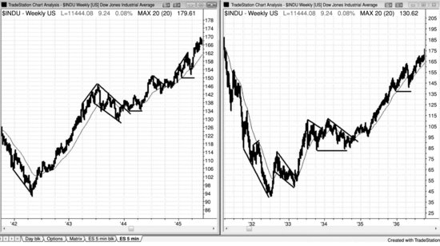
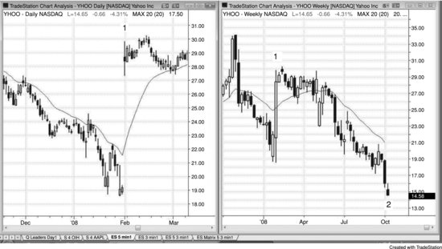
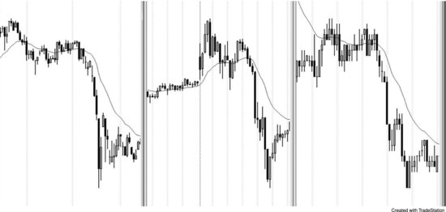

# Introduction

<!-- Source PDF pages 31–59 -->

<!-- PDF page 31 -->

Introduction
There is a reason why there is no other comprehensive book about price
action written by a trader. It takes thousands of hours, and the financial
reward is meager compared to that from trading. However, with my three
girls now away in grad school, I have a void to fill and this has been a very
satisfying project. I originally planned on updating the first edition of
Reading Price Charts Bar by Bar (John Wiley & Sons, 2009), but as I got
into it, I decided instead to go into great detail about how I view and trade
the markets. I am metaphorically teaching you how to play the violin.
Everything you need to know to make a living at it is in these books, but it
is up to you to spend the countless hours learning your trade. After a year of
answering thousands of questions from traders on my website at
www.brookspriceaction.com, I think that I have found ways to express my
ideas much more clearly, and these books should be easier to read than that
one. The earlier book focused on reading price action, and this series of
books is instead centered on how to use price action to trade the markets.
Since the book grew to more than four times as many words as the first
book, John Wiley & Sons decided to divide it into three separate books.
This first book covers price action basics and trends. The second book is on
trading ranges, order management, and the mathematics of trading, and the
final book is about trend reversals, day trading, daily charts, options, and
the best setups for all time frames. Many of the charts are also in Reading
Price Charts Bar by Bar, but most have been updated and the discussion
about the charts has also been largely rewritten. Only about 5 percent of the
120,000 words from that book are present in the 570,000 words in this new
series, so readers will find little duplication.
My goals in writing this series of three books are to describe my
understanding of why the carefully selected trades offer great risk/reward
ratios, and to present ways to profit from the setups. I am presenting
material that I hope will be interesting to professional traders and students
in business school, but I also hope that even traders starting out will find
some useful ideas. Everyone looks at price charts but usually just briefly
and with a specific or limited goal. However, every chart has an incredible

<!-- PDF page 32 -->

amount of information that can be used to make profitable trades, but much
of it can be used effectively only if traders spend time to carefully
understand what each bar on the chart is telling them about what
institutional money is doing.
Ninety percent or more of all trading in large markets is done by
institutions, which means that the market is simply a collection of
institutions. Almost all are profitable over time, and the few that are not
soon go out of business. Since institutions are profitable and they are the
market, every trade that you take has a profitable trader (a part of the
collection of institutions) taking the other side of your trade. No trade can
take place without one institution willing to take one side and another
willing to take the other. The small-volume trades made by individuals can
only take place if an institution is willing to take the same trade. If you want
to buy at a certain price, the market will not get to that price unless one or
more institutions also want to buy at that price. You cannot sell at any price
unless one or more institutions are willing to sell there, because the market
can only go to a price where there are institutions willing to buy and others
willing to sell. If the Emini is at 1,264 and you are long with a protective
sell stop at 1,262, your stop cannot get hit unless there is an institution who
is also willing to sell at 1,262. This is true for virtually all trades.
If you trade 200 Emini contracts, then you are trading institutional
volume and are effectively an institution, and you will sometimes be able to
move the market a tick or two. Most individual traders, however, have no
ability to move the market, no matter how stupidly they are willing to trade.
The market will not run your stops. The market might test the price where
your protective stop is, but it has nothing to do with your stop. It will only
test that price if one or more institutions believe that it is financially sound
to sell there and other institutions believe that it is profitable to buy there.
At every tick, there are institutions buying and other institutions selling, and
all have proven systems that will make money by placing those trades. You
should always be trading in the direction of the majority of institutional
dollars because they control where the market is heading.
At the end of the day when you look at a printout of the day's chart, how
can you tell what the institutions did during the day? The answer is simple:
whenever the market went up, the bulk of institutional money was buying,

<!-- PDF page 33 -->

and whenever the market went down, more money went into selling. Just
look at any segment of the chart where the market went up or down and
study every bar, and you will soon notice many repeatable patterns. With
time, you will begin to see those patterns unfold in real time, and that will
give you confidence to place your trades. Some of the price action is subtle,
so be open to every possibility. For example, sometimes when the market is
working higher, a bar will trade below the low of the prior bar, yet the trend
continues higher. You have to assume that the big money was buying at and
below the low of that prior bar, and that is also what many experienced
traders were doing. They bought exactly where weak traders let themselves
get stopped out with a loss or where other weak traders shorted, believing
that the market was beginning to sell off. Once you get comfortable with the
idea that strong trends often have pullbacks and big money is buying them
rather than selling them, you will be in a position to make some great trades
that you previously thought were exactly the wrong thing to do. Don't think
too hard about it. If the market is going up, institutions are buying
constantly, even at times when you think that you should stop yourself out
of your long with a loss. Your job is to follow their behavior and not use too
much logic to deny what is happening right in front of you. It does not
matter if it seems counterintuitive. All that matters is that the market is
going up and therefore institutions are predominantly buying and so should
you.
Institutions are generally considered to be smart money, meaning that
they are smart enough to make a living by trading and they trade a large
volume every day. Television still uses the term institution to refer to
traditional institutions like mutual funds, banks, brokerage houses,
insurance companies, pension funds, and hedge funds; these companies
used to account for most of the volume, and they mostly trade on
fundamentals. Their trading controls the direction of the market on daily
and weekly charts and a lot of the big intraday swings. Until a decade or so
ago, most of the trade decisions were made and most trading was done by
very smart traders, but it is now increasingly being done by computers.
They have programs that can instantly analyze economic data and
immediately place trades based on that analysis, without a person ever
being involved in the trade. In addition, other firms trade huge volumes by

<!-- PDF page 34 -->

using computer programs that place trades based on the statistical analysis
of price action. Computer-generated trading now accounts for as much as
70 percent of the day's volume.
Computers are very good at making decisions, and playing chess and
winning at Jeopardy! are more difficult than trading stocks. Gary Kasparov
for years made the best chess decisions in the world, yet a computer made
better decisions in 1997 and beat him. Ken Jennings was heralded as the
greatest Jeopardy! player of all time, yet a computer destroyed him in 2011.
It is only a matter of time before computers are widely accepted as the best
decision makers for institutional trading.
Since programs use objective mathematical analysis, there should be a
tendency for support and resistance areas to become more clearly defined.
For example, measured move projections should become more precise as
more of the volume is traded based on precise mathematical logic. Also,
there might be a tendency toward more protracted tight channels as
programs buy small pullbacks on the daily chart. However, if enough
programs exit longs or go short at the same key levels, sell-offs might
become larger and faster. Will the changes be dramatic? Probably not, since
the same general forces were operating when everything was done
manually, but nonetheless there should be some move toward mathematical
perfection as more of the emotion is removed from trading. As these other
firms contribute more and more to the movement of the market and as
traditional institutions increasingly use computers to analyze and place their
trades, the term institution is becoming vague. It is better for an individual
trader to think of an institution as any of the different entities that trade
enough volume to be a significant contributor to the price action.
Since these buy and sell programs generate most of the volume, they are
the most important contributor to the appearance of every chart and they
create most of the trading opportunities for individual investors. Yes, it's
nice to know that Cisco Systems (CSCO) had a strong earnings report and
is moving up, and if you are an investor who wants to hold stock for many
months, then do what the traditional institutions are doing and buy CSCO.
However, if you are a day trader, ignore the news and look at the chart,
because the programs will create patterns that are purely statistically based
and have nothing to do with fundamentals, yet offer great trading

<!-- PDF page 35 -->

opportunities. The traditional institutions placing trades based on
fundamentals determine the direction and the approximate target of a stock
over the next several months, but, increasingly, firms using statistical
analysis to make day trades and other short-term trades determine the path
to that target and the ultimate high or low of the move. Even on a macro
level, fundamentals are only approximate at best. Look at the crashes in
1987 and 2009. Both had violent sell-offs and rallies, yet the fundamentals
did not change violently in the same short period of time. In both cases, the
market got sucked slightly below the monthly trend line and reversed
sharply up from it. The market fell because of perceived fundamentals, but
the extent of the fall was determined by the charts.
There are some large patterns that repeat over and over on all time frames
and in all markets, like trends, trading ranges, climaxes, and channels.
There are also lots of smaller tradable patterns that are based on just the
most recent few bars. These books are a comprehensive guide to help
traders understand everything they see on a chart, giving them more
opportunities to make profitable trades and to avoid losers.
The most important message that I can deliver is to focus on the absolute
best trades, avoid the absolute worst setups, use a profit objective (reward)
that is at least as large as your protective stop (risk), and work on increasing
the number of shares that you are trading. I freely recognize that every one
of my reasons behind each setup is just my opinion, and my reasoning
about why a trade works might be completely wrong. However, that is
irrelevant. What is important is that reading price action is a very effective
way to trade, and I have thought a lot about why certain things happen the
way they do. I am comfortable with my explanations and they give me
confidence when I place a trade; however, they are irrelevant to my placing
trades, so it is not important to me that they are right. Just as I can reverse
my opinion about the direction of the market in an instant, I can also reverse
my opinion about why a particular pattern works if I come across a reason
that is more logical or if I discover a flaw in my logic. I am providing the
opinions because they appear to make sense, they might help readers
become more comfortable trading certain setups, and they might be
intellectually stimulating, but they are not needed for any price action
trades.

<!-- PDF page 36 -->

The books are very detailed and difficult to read and are directed toward
serious traders who want to learn as much as they can about reading price
charts. However, the concepts are useful to traders at all levels. The books
cover many of the standard techniques described by Robert D. Edwards and
John Magee (Technical Analysis of Stock Trends, AMACOM, 9th ed., 2007)
and others, but focus more on individual bars to demonstrate how the
information they provide can significantly enhance the risk/reward ratio of
trading. Most books point out three or four trades on a chart, which implies
that everything else on the chart is incomprehensible, meaningless, or risky.
I believe that there is something to be learned from every tick that takes
place during the day and that there are far more great trades on every chart
than just the few obvious ones; but to see them, you have to understand
price action and you cannot dismiss any bars as unimportant. I learned from
performing thousands of operations through a microscope that some of the
most important things can be very small.
I read charts bar by bar and look for any information that each bar is
telling me. They are all important. At the end of every bar, most traders ask
themselves, “What just took place?” With most bars, they conclude that
there is nothing worth trading at the moment so it is just not worth the effort
to try to understand. Instead, they choose to wait for some clearer and
usually larger pattern. It is as if they believe that the bar did not exist, or
they dismiss it as just institutional program activity that is not tradable by
an individual trader. They do not feel like they are part of the market at
these times, but these times constitute the vast majority of the day. Yet, if
they look at the volume, all of those bars that they are ignoring have as
much volume as the bars they are using for the bases for their trades.
Clearly, a lot of trading is taking place, but they don't understand how that
can be and essentially pretend that it does not exist. But that is denying
reality. There is always trading taking place, and as a trader, you owe it to
yourself to understand why it's taking place and to figure out a way to make
money off of it. Learning what the market is telling you is very timeconsuming and difficult, but it gives you the foundation that you need to be
a successful trader.
Unlike most books on candle charts where the majority of readers feel
compelled to memorize patterns, these three books of mine provide a

<!-- PDF page 37 -->

rationale for why particular patterns are reliable setups for traders. Some of
the terms used have specific meaning to market technicians but different
meanings to traders, and I am writing this entirely from a trader's
perspective. I am certain that many traders already understand everything in
these books, but likely wouldn't describe price action in the same way that I
do. There are no secrets among successful traders; they all know common
setups, and many have their own names for each one. All of them are
buying and selling pretty much at the same time, catching the same swings,
and they all have their own reasons for getting into a trade. Many trade
price action intuitively without ever feeling a need to articulate why a
certain setup works. I hope that they enjoy reading my understanding of and
perspective on price action and that this gives them some insights that will
improve their already successful trading.
The goal for most traders is to maximize trading profits through a style
that is compatible with their personalities. Without that compatibility, I
believe that it is virtually impossible to trade profitably for the long term.
Many traders wonder how long it will take them to be successful and are
willing to lose money for some period of time, even a few years. However,
it took me over 10 years to be able to trade successfully. Each of us has
many considerations and distractions, so the time will vary, but a trader has
to work though most obstacles before becoming consistently profitable. I
had several major problems that had to be corrected, including raising three
wonderful daughters who always filled my mind with thoughts of them and
what I needed to be doing as their father. That was solved as they got older
and more independent. Then it took me a long time to accept many
personality traits as real and unchangeable (or at least I concluded that I was
unwilling to change them). And finally there was the issue of confidence. I
have always been confident to the point of arrogance in so many things that
those who know me would be surprised that this was difficult for me.
However, deep inside I believed that I really would never come up with a
consistently profitable approach that I would enjoy employing for many
years. Instead, I bought many systems, wrote and tested countless indicators
and systems, read many books and magazines, went to seminars, hired
tutors, and joined chat rooms. I talked with people who presented
themselves as successful traders, but I never saw their account statements

<!-- PDF page 38 -->

and suspect that most could teach but few, if any, could trade. Usually in
trading, those who know don't talk and those who talk don't know.
This was all extremely helpful because it showed all of the things that I
needed to avoid before becoming successful. Any nontrader who looks at a
chart will invariably conclude that trading has to be extremely easy, and that
is part of the appeal. At the end of the day, anyone can look at any chart and
see very clear entry and exit points. However, it is much more difficult to
do it in real time. There is a natural tendency to want to buy the exact low
and never have the trade come back. If it does, a novice will take the loss to
avoid a bigger loss, resulting in a series of losing trades that will ultimately
bust the trader's account. Using wide stops solves that to some extent, but
invariably traders will soon hit a few big losses that will put them into the
red and make them too scared to continue using that approach.
Should you be concerned that making the information in these books
available will create lots of great price action traders, all doing the same
thing at the same time, thereby removing the late entrants needed to drive
the market to your price target? No, because the institutions control the
market and they already have the smartest traders in the world and those
traders already know everything in these books, at least intuitively. At every
moment, there is an extremely smart institutional bull taking the opposite
side of the trade being placed by an extremely smart institutional bear.
Since the most important players already know price action, having more
players know it will not tip the balance one way or the other. I therefore
have no concern that what I am writing will stop price action from working.
Because of that balance, any edge that anyone has is always going to be
extremely small, and any small mistake will result in a loss, no matter how
well a person reads a chart. Although it is very difficult to make money as a
trader without understanding price action, that knowledge alone is not
enough. It takes a long time to learn how to trade after a trader learns to
read charts, and trading is just as difficult as chart reading. I wrote these
books to help people learn to read charts better and to trade better, and if
you can do both well, you deserve to be able to take money from the
accounts of others and put it into yours.
The reason why the patterns that we all see do unfold as they do is
because that is the appearance that occurs in an efficient market with

<!-- PDF page 39 -->

countless traders placing orders for thousands of different reasons, but with
the controlling volume being traded based on sound logic. That is just what
it looks like, and it has been that way forever. The same patterns unfold in
all time frames in all markets around the world, and it would simply be
impossible for all of it to be manipulated instantaneously on so many
different levels. Price action is a manifestation of human behavior and
therefore actually has a genetic basis. Until we evolve, it will likely remain
largely unchanged, just as it has been unchanged for the 80 years of charts
that I have reviewed. Program trading might have changed the appearance
slightly, although I can find no evidence to support that theory. If anything,
it would make the charts smoother because it is unemotional and it has
greatly increased the volume. Now that most of the volume is being traded
automatically by computers and the volume is so huge, irrational and
emotional behavior is an insignificant component of the markets and the
charts are a purer expression of human tendencies.
Since price action comes from our DNA, it will not change until we
evolve. When you look at the two charts in Figure I.1, your first reaction is

that they are just a couple of ordinary charts, but look at the dates at the
bottom. These weekly Dow Jones Industrial Average charts from the
Depression era and from World War II have the same patterns that we see
today on all charts, despite most of today's volume being traded by
computers.
Figure I.1 Price Action Has Not Changed over Time

<!-- PDF page 40 -->

If everyone suddenly became a price action scalper, the smaller patterns
might change a little for a while, but over time, the efficient market will win
out and the votes by all traders will get distilled into standard price action
patterns because that is the inescapable result of countless people behaving
logically. Also, the reality is that it is very difficult to trade well, and
although basing trades on price action is a sound approach, it is still very
difficult to do successfully in real time. There just won't be enough traders
doing it well enough, all at the same time, to have any significant influence
over time on the patterns. Just look at Edwards and Magee. The best traders
in the world have been using those ideas for decades and they continue to
work, again for the same reason—charts look the way they do because that
is the unchangeable fingerprint of an efficient market filled with a huge
number of smart people using a huge number of approaches and time
frames, all trying to make the most money that they can. For example, Tiger
Woods is not hiding anything that he does in golf, and anyone is free to
copy him. However, very few people can play golf well enough to make a
living at it. The same is true of trading. A trader can know just about
everything there is to know and still lose money because applying all that
knowledge in a way that consistently makes money is very difficult to do.
Why do so many business schools continue to recommend Edwards and
Magee when their book is essentially simplistic, largely using trend lines,
breakouts, and pullbacks as the basis for trading? It is because it works and

<!-- PDF page 41 -->

it always has and it always will. Now that just about all traders have
computers with access to intraday data, many of those techniques can be
adapted to day trading. Also, candle charts give additional information
about who is controlling the market, which results in a more timely entry
with smaller risk. Edwards and Magee's focus is on the overall trend. I use
those same basic techniques but pay much closer attention to the individual
bars on the chart to improve the risk/reward ratio, and I devote considerable
attention to intraday charts.
It seemed obvious to me that if one could simply read the charts well
enough to be able to enter at the exact times when the move would take off
and not come back, then that trader would have a huge advantage. The
trader would have a high winning percentage, and the few losses would be
small. I decided that this would be my starting point, and what I discovered
was that nothing had to be added. In fact, any additions are distractions that
result in lower profitability. This sounds so obvious and easy that it is
difficult for most people to believe.
I am a day trader who relies entirely on price action on the intraday Emini
S&P 500 Futures charts, and I believe that reading price action well is an
invaluable skill for all traders. Beginners often instead have a deep-seated
belief that something more is required, that maybe some complex
mathematical formula that very few use would give them just the edge that
they need. Goldman Sachs is so rich and sophisticated that its traders must
have a supercomputer and high-powered software that gives them an
advantage that ensures that all the individual traders are doomed to failure.
They start looking at all kinds of indicators and playing with the inputs to
customize the indicators to make them just right. Every indicator works
some of the time, but for me, they obfuscate instead of elucidate. In fact,
without even looking at a chart, you can place a buy order and have a 50
percent chance of being right!
I am not dismissing indicators and systems out of ignorance of their
subtleties. I have spent over 10,000 hours writing and testing indicators and
systems over the years, and that probably is far more experience than most
have. This extensive experience with indicators and systems was an
essential part of my becoming a successful trader. Indicators work well for
many traders, but the best success comes once a trader finds an approach

<!-- PDF page 42 -->

that is compatible with his or her personality. My single biggest problem
with indicators and systems was that I never fully trusted them. At every
setup, I saw exceptions that needed to be tested. I always wanted every last
penny out of the market and was never satisfied with a return from a system
if I could incorporate a new twist that would make it better. You can
optimize constantly, but, since the market is always changing from strong
trends to tight trading ranges and then back again and your optimizations
are based on what has recently happened, they will soon fail as the market
transitions into a new phase. I am simply too controlling, compulsive,
restless, observant, and untrusting to make money in the long term off
indicators or automated systems, but I am at the extreme in many ways and
most people don't have these same issues.
Many traders, especially beginners, are drawn to indicators (or any other
higher power, guru, TV pundit, or newsletter that they want to believe will
protect them and show their love and approval of them as human beings by
giving them lots of money), hoping that an indicator will show them when
to enter a trade. What they don't realize is that the vast majority of
indicators are based on simple price action, and when I am placing trades, I
simply cannot think fast enough to process what several indicators might be
telling me. If there is a bull trend, a pullback, and then a rally to a new high,
but the rally has lots of overlapping bars, many bear bodies, a couple of
small pullbacks, and prominent tails on the tops of the bars, any
experienced trader would see that it is a weak test of the trend high and that
this should not be happening if the bull trend was still strong. The market is
almost certainly transitioning into a trading range and possibly into a bear
trend. Traders don't need an oscillator to tell them this. Also, oscillators
tend to make traders look for reversals and focus less on price charts. These
can be effective tools on most days when the market has two or three
reversals lasting an hour or more. The problem comes when the market is
trending strongly. If you focus too much on your indicators, you will see
that they are forming divergences all day long and you might find yourself
repeatedly entering countertrend and losing money. By the time you come
to accept that the market is trending, you will not have enough time left in
the day to recoup your losses. Instead, if you were simply looking at a bar
or candle chart, you would see that the market is clearly trending and you

<!-- PDF page 43 -->

would not be tempted by indicators to look for trend reversals. The most
common successful reversals first break a trend line with strong momentum
and then pull back to test the extreme, and if traders focus too much on
divergences, they will often overlook this fundamental fact. Placing a trade
because of a divergence in the absence of a prior countertrend momentum
surge that breaks a trend line is a losing strategy. Wait for the trend line
break and then see if the test of the old extreme reverses or if the old trend
resumes. You do not need an indicator to tell you that a strong reversal here
is a high-probability trade, at least for a scalp, and there will almost
certainly be a divergence, so why complicate your thinking by adding the
indicator to your calculus?
Some pundits recommend a combination of time frames, indicators, wave
counting, and Fibonacci retracements and extensions, but when it comes
time to place the trade, they will do it only if there is a good price action
setup. Also, when they see a good price action setup, they start looking for
indicators that show divergences, different time frames for moving average
tests, wave counts, or Fibonacci setups to confirm what is in front of them.
In reality, they are price action traders who are trading exclusively off price
action on only one chart but don't feel comfortable admitting it. They are
complicating their trading to the point that they certainly are missing many,
many trades because their overanalysis takes too much time for them to
place their orders and they are forced to wait for the next setup. The logic
just isn't there for making the simple so complicated. Obviously, adding any
information can lead to better decision making and many people might be
able to process lots of inputs when deciding whether to place a trade.
Ignoring data because of a simplistic ideology alone is foolish. The goal is
to make money, and traders should do everything they can to maximize
their profits. I simply cannot process multiple indicators and time frames
well in the time needed to place my orders accurately, and I find that
carefully reading a single chart is far more profitable for me. Also, if I rely
on indicators, I find that I get lazy in my price action reading and often miss
the obvious. Price action is far more important than any other information,
and if you sacrifice some of what it is telling you to gain information from
something else, you are likely making a bad decision.

<!-- PDF page 44 -->

One of the most frustrating things for traders when they are starting out is
that everything is so subjective. They want to find a clear set of rules that
guarantee a profit, and they hate how a pattern works on one day but fails
on another. Markets are very efficient because you have countless very
smart people playing a zero-sum game. For a trader to make money, he has
to be consistently better than about half of the other traders out there. Since
most of the competitors are profitable institutions, a trader has to be very
good. Whenever an edge exists, it is quickly discovered and it disappears.
Remember, someone has to be taking the opposite side of your trade. It
won't take them long to figure out your magical system, and once they do,
they will stop giving you money. Part of the appeal of trading is that it is a
zero-sum game with very small edges, and it is intellectually satisfying and
financially rewarding to be able to spot and capitalize on these small,
fleeting opportunities. It can be done, but it is very hard work and it
requires relentless discipline. Discipline simply means doing what you do
not want to do. We are all intellectually curious and we have a natural
tendency to try new or different things, but the very best traders resist the
temptation. You have to stick to your rules and avoid emotion, and you have
to patiently wait to take only the best trades. This all appears easy to do
when you look at a printed chart at the end of the day, but it is very difficult
in real time as you wait bar by bar, and sometimes hour by hour. Once a
great setup appears, if you are distracted or lulled into complacency, you
will miss it and you will then be forced to wait even longer. But if you can
develop the patience and the discipline to follow a sound system, the profit
potential is huge.
There are countless ways to make money trading stocks and Eminis, but
all require movement (well, except for shorting options). If you learn to
read the charts, you will catch a great number of these profitable trades
every day without ever knowing why some institution started the trend and
without ever knowing what any indicator is showing. You don't need these
institutions’ software or analysts because they will show you what they are
doing. All you have to do is piggyback onto their trades and you will make
a profit. Price action will tell you what they are doing and allow you an
early entry with a tight stop.

<!-- PDF page 45 -->

I have found that I consistently make far more money by minimizing
what I have to consider when placing a trade. All I need is a single chart on
my laptop computer with no indicators except a 20-bar exponential moving
average (EMA), which does not require too much analysis and clarifies
many good setups each day. Some traders might also look at volume
because an unusually large volume spike sometimes comes near the end of
a bear trend, and the next new swing low or two often provide profitable
long scalps. Volume spikes also sometimes occur on daily charts when a
sell-off is overdone. However, it is not reliable enough to warrant my
attention.
Many traders consider price action only when trading divergences and
trend pullbacks. In fact, most traders using indicators won't take a trade
unless there is a strong signal bar, and many would enter on a strong signal
bar if the context was right, even if there was no divergence. They like to
see a strong close on a large reversal bar, but in reality this is a fairly rare
occurrence. The most useful tools for understanding price action are trend
lines and trend channel lines, prior highs and lows, breakouts and failed
breakouts, the sizes of bodies and tails on candles, and relationships
between the current bar to the prior several bars. In particular, how the
open, high, low, and close of the current bar compare to the action of the
prior several bars tells a lot about what will happen next. Charts provide far
more information about who is in control of the market than most traders
realize. Almost every bar offers important clues as to where the market is
going, and a trader who dismisses any activity as noise is passing up many
profitable trades each day. Most of the observations in these books are
directly related to placing trades, but a few have to do with simple curious
price action tendencies without sufficient dependability to be the basis for a
trade.
I personally rely mainly on candle charts for my Emini, futures, and stock
trading, but most signals are also visible on any type of chart and many are
even evident on simple line charts. I focus primarily on 5 minute candle
charts to illustrate basic principles but also discuss daily and weekly charts
as well. Since I also trade stocks, forex, Treasury note futures, and options,
I discuss how price action can be used as the basis for this type of trading.

<!-- PDF page 46 -->

As a trader, I see everything in shades of gray and am constantly thinking
in terms of probabilities. If a pattern is setting up and is not perfect but is
reasonably similar to a reliable setup, it will likely behave similarly as well.
Close is usually close enough. If something resembles a textbook setup, the
trade will likely unfold in a way that is similar to the trade from the
textbook setup. This is the art of trading and it takes years to become good
at trading in the gray zone. Everyone wants concrete, clear rules or
indicators, and chat rooms, newsletters, hotlines, or tutors that will tell them
when exactly to get in to minimize risk and maximize profit, but none of it
works in the long run. You have to take responsibility for your decisions,
but you first have to learn how to make them and that means that you have
to get used to operating in the gray fog. Nothing is ever as clear as black
and white, and I have been doing this long enough to appreciate that
anything, no matter how unlikely, can and will happen. It's like quantum
physics. Every conceivable event has a probability, and so do events that
you have yet to consider. It is not emotional, and the reasons why
something happens are irrelevant. Watching to see if the Federal Reserve
cuts rates today is a waste of time because there is both a bullish and
bearish interpretation of anything that the Fed does. What is key is to see
what the market does, not what the Fed does.
If you think about it, trading is a zero-sum game and it is impossible to
have a zero-sum game where rules consistently work. If they worked,
everyone would use them and then there would be no one on the other side
of the trade. Therefore, the trade could not exist. Guidelines are very helpful
but reliable rules cannot exist, and this is usually very troubling to a trader
starting out who wants to believe that trading is a game that can be very
profitable if only you can come up with just the right set of rules. All rules
work some of the time, and usually just often enough to fool you into
believing that you just need to tweak them a little to get them to work all of
the time. You are trying to create a trading god who will protect you, but
you are fooling yourself and looking for an easy solution to a game where
only hard solutions work. You are competing against the smartest people in
the world, and if you are smart enough to come up with a foolproof rule set,
so are they, and then everyone is faced with the zero-sum game dilemma.
You cannot make money trading unless you are flexible, because you need

<!-- PDF page 47 -->

to go where the market is going, and the market is extremely flexible. It can
bend in every direction and for much longer than most would ever imagine.
It can also reverse repeatedly every few bars for a long, long time. Finally,
it can and will do everything in between. Never get upset by this, and just
accept it as reality and admire it as part of the beauty of the game.
The market gravitates toward uncertainty. During most of the day, every
market has a directional probability of 50–50 of an equidistant move up or
down. By that I mean that if you don't even look at a chart and you buy any
stock and then place a one cancels the other (OCO) order to exit on a profittaking limit order X cents above your entry or on a protective stop at X
cents below your entry, you have about a 50 percent chance of being right.
Likewise, if you sell any stock at any point in the day without looking at a
chart and then place a profit-taking limit order X cents lower and a
protective stop X cents higher, you have about a 50 percent chance of
winning and about a 50 percent chance of losing. There is the obvious
exception of X being too large relative the price of the stock. You can't have
X be $60 in a $50 stock, because you would have a 0 percent chance of
losing $60. You also can't have X be $49, because the odds of losing $49
would also be minuscule. But if you pick a value for X that is within
reasonable reach on your time frame, this is generally true. When the
market is 50–50, it is uncertain and you cannot rationally have an opinion
about its direction. This is the hallmark of a trading range, so whenever you
are uncertain, assume that the market is in a trading range. There are brief
times on a chart when the directional probability is higher. During a strong
trend, it might be 60 or even 70 percent, but that cannot last long because it
will gravitate toward uncertainty and a 50–50 market where both the bulls
and bears feel there is value. When there is a trend and some level of
directional certainty, the market will also gravitate toward areas of support
and resistance, which are usually some type of measured move away, and
those areas are invariably where uncertainty returns and a trading range
develops, at least briefly.
Never watch the news during the trading day. If you want to know what a
news event means, the chart in front of you will tell you. Reporters believe
that the news is the most important thing in the world, and that everything
that happens has to be caused by their biggest news story of the day. Since

<!-- PDF page 48 -->

reporters are in the news business, news must be the center of the universe
and the cause of everything that happens in the financial markets. When the
stock market sold off in mid-March 2011, they attributed it to the
earthquake in Japan. It did not matter to them that the market began to sell
off three weeks earlier, after a buy climax. I told the members of my chat
room in late February that the odds were good that the market was going to
have a significant correction when I saw 15 consecutive bull trend bars on
the daily chart after a protracted bull run. This was an unusually strong buy
climax, and an important statement by the market. I had no idea that an
earthquake was going to happen in a few weeks, and did not need to know
that, anyway. The chart was telling me what traders were doing; they were
getting ready to exit their longs and initiate shorts.
Television experts are also useless. Invariably when the market makes a
huge move, the reporter will find some confident, convincing expert who
predicted it and interview him or her, leading the viewers to believe that this
pundit has an uncanny ability to predict the market, despite the untold
reality that this same pundit has been wrong in his last 10 predictions. The
pundit then makes some future prediction and naïve viewers will attach
significance to it and let it affect their trading. What the viewers may not
realize is that some pundits are bullish 100 percent of the time and others
are bearish 100 percent of the time, and still others just swing for the fences
all the time and make outrageous predictions. The reporter just rushes to the
one who is consistent with the day's news, which is totally useless to traders
and in fact it is destructive because it can influence their trading and make
them question and deviate from their own methods. No one is ever
consistently right more than 60 percent of the time on these major
predictions, and just because pundits are convincing does not make them
reliable. There are equally smart and convincing people who believe the
opposite but are not being heard. This is the same as watching a trial and
listening to only the defense side of the argument. Hearing only one side is
always convincing and always misleading, and rarely better than 50 percent
reliable.
Institutional bulls and bears are placing trades all the time, and that is why
there is constant uncertainty about the direction of the market. Even in the
absence of breaking news, the business channels air interviews all day long

<!-- PDF page 49 -->

and each reporter gets to pick one pundit for her report. What you have to
realize is that she has a 50–50 chance of picking the right one in terms of
the market's direction over the next hour or so. If you decide to rely on the
pundit to make a trading decision and he says that the market will sell off
after midday and instead it just keeps going up, are you going to look to
short? Should you believe this very convincing head trader at one of Wall
Street's top firms? He obviously is making over a million dollars a year and
they would not pay him that much unless he was able to correctly and
consistently predict the market's direction. In fact, he probably can and he is
probably a good stock picker, but he almost certainly is not a day trader. It
is foolish to believe that just because he can make 15 percent annually
managing money he can correctly predict the market's direction over the
next hour or two. Do the math. If he had that ability, he would be making 1
percent two or three times a day and maybe 1,000 percent a year. Since he
is not, you know that he does not have that ability. His time frame is months
and yours is minutes. Since he is unable to make money by day trading,
why would you ever want to make a trade based on someone who is a
proven failure as a day trader? He has shown you that he cannot make
money by day trading by the simple fact that he is not a successful day
trader. That immediately tells you that if he day trades, he loses money
because if he was successful at it, that is what he would choose to do and he
would make far more than he is currently making. Even if you are holding
trades for months at a time in an attempt to duplicate the results of his fund,
it is still foolish to take his advice, because he might change his mind next
week and you would never know it. Managing a trade once you are in is
just as important as placing the trade. If you are following the pundit and
hope to make 15 percent a year like he does, you need to follow his
management, but you have no ability to do so and you will lose over time
employing this strategy. Yes, you will make an occasional great trade, but
you can simply do that by randomly buying any stock. The key is whether
the approach makes money over 100 trades, not over the first one or two.
Follow the advice that you give your kids: don't fool yourself into believing
that what you see on television is real, no matter how polished and
convincing it appears to be.

<!-- PDF page 50 -->

As I said, there will be pundits who will see the news as bullish and
others who will see it as bearish, and the reporter gets to pick one for her
report. Are you going to let a reporter make trading decisions for you?
That's insane! If that reporter could trade, she would be a trader and make
hundreds of times more money than she is making as a reporter. Why would
you ever allow her to influence your decision making? You might do so
only out of a lack of confidence in your ability, or perhaps you are
searching for a father figure who will love and protect you. If you are prone
to be influenced by a reporter's decision, you should not take the trade. The
pundit she chooses is not your father, and he will not protect you or your
money. Even if the reporter picks a pundit who is correct on the direction,
that pundit will not stay with you to manage your trade, and you will likely
be stopped out with a loss on a pullback.
Financial news stations do not exist to provide public service. They are in
business to make money, and that means they need as large an audience as
possible to maximize their advertising income. Yes, they want to be
accurate in their reporting, but their primary objective is to make money.
They are fully aware that they can maximize their audience size only if they
are pleasing to watch. That means that they have to have interesting guests,
including some who will make outrageous predictions, others who are
professorial and reassuring, and some who are just physically attractive;
most of them have to have some entertainment value. Although some guests
are great traders, they cannot help you. For example, if they interview one
of the world's most successful bond traders, he will usually only speak in
general terms about the trend over the next several months, and he will do
so only weeks after he has already placed his trades. If you are a day trader,
this does not help you, because every bull or bear market on the monthly
chart has just about as many up moves on the intraday chart as down
moves, and there will be long and short trades every day. His time frame is
very different from yours, and his trading has nothing to do with what you
are doing. They will also often interview a chartist from a major Wall Street
firm, who, while his credentials are good, will be basing his opinion on a
weekly chart, but the viewers are looking to take profits within a few days.
To the chartist, that bull trend that he is recommending buying will still be
intact, even if the market falls 10 percent over the next couple of months.

<!-- PDF page 51 -->

The viewers, however, will take their losses long before that, and will never
benefit from the new high that comes three months later. Unless the chartist
is addressing your specific goals and time frame, whatever he says is
useless. When television interviews a day trader instead, he will talk about
the trades that he already took, and the information is too late to help you
make money. By the time he is on television, the market might already be
going in the opposite direction. If he is talking while still in his day trade,
he will continue to manage his trade long after his two-minute interview is
over, and he will not manage it while on the air. Even if you enter the trade
that he is in, he will not be there when you invariably will have to make an
important decision about getting out as the market turns against you, or as
the market goes in your direction and you are thinking about taking profits.
Watching television for trading advice under any circumstances, even after
a very important report, is a sure way to lose money and you should never
do it.
Only look at the chart and it will tell you what you need to know. The
chart is what will give you money or take money from you, so it is the only
thing that you should ever consider when trading. If you are on the floor,
you can't even trust what your best friend is doing. He might be offering a
lot of orange juice calls but secretly having a broker looking to buy 10
times as many below the market. Your friend is just trying to create a panic
to drive the market down so he can load up through a surrogate at a much
better price.
Friends and colleagues freely offer opinions for you to ignore.
Occasionally traders will tell me that they have a great setup and want to
discuss it with me. I invariably get them angry with me when I tell them
that I am not interested. They immediately perceive me as selfish, stubborn,
and close-minded, and when it comes to trading, I am all of that and
probably much more. The skills that make you money are generally seen as
flaws to the layperson. Why do I no longer read books or articles about
trading, or talk to other traders about their ideas? As I said, the chart tells
me all that I need to know and any other information is a distraction.
Several people have been offended by my attitude, but I think in part it
comes from me turning down what they are presenting as something helpful
to me when in reality they are making an offering, hoping that I will

<!-- PDF page 52 -->

reciprocate with some tutoring. They become frustrated and angry when I
tell them that I don't want to hear about anyone else's trading techniques. I
tell them that I haven't even mastered my own and probably never will, but
I am confident that I will make far more money perfecting what I already
know than trying to incorporate non-price-action approaches into my
trading. I ask them if James Galway offered a beautiful flute to Yo-Yo Ma
and insisted that Ma start learning to play the flute because Galway makes
so much money by playing his flute, should Ma accept the offer? Clearly
not. Ma should continue to play the cello and by doing so he will make far
more money than if he also started playing the flute. I am no Galway or Ma,
but the concept is the same. Price action is the only instrument that I want
to play, and I strongly believe that I will make far more money by mastering
it than by incorporating ideas from other successful traders.
The charts, not the experts on television, will tell you exactly how the
institutions are interpreting the news.
Yesterday, Costco's earnings were up 32 percent on the quarter and above
analysts’ expectations (see Figure I.2). COST gapped up on the open, tested

the gap on the first bar, and then ran up over a dollar in 20 minutes. It then
drifted down to test yesterday's close. It had two rallies that broke bear
trend lines, and both failed. This created a double top (bars 2 and 3) bear
flag or triple top (bars 1, 2, and 3), and the market then plunged $3, below
the prior day's low. If you were unaware of the report, you would have
shorted at the failed bear trend line breaks at bars 2 and 3 and you would
have sold more below bar 4, which was a pullback that followed the
breakout below yesterday's low. You would have reversed to long on the
bar 5 big reversal bar, which was the second attempt to reverse the breakout
below yesterday's low and a climactic reversal of the breakout of the bottom
of the steep bear trend channel line.
Figure I.2 Ignore the News

<!-- PDF page 53 -->

Alternatively, you could have bought the open because of the bullish
report, and then worried about why the stock was collapsing instead of
soaring the way the TV analysts predicted, and you likely would have sold
out your long on the second plunge down to bar 5 with a $2 loss.
Any trend that covers a lot of points in very few bars, meaning that there
is some combination of large bars and bars that overlap each other only
minimally, will eventually have a pullback. These trends have such strong
momentum that the odds favor resumption of the trend after the pullback
and then a test of the trend's extreme. Usually the extreme will be exceeded,
as long as the pullback does not turn into a new trend in the opposite
direction and extend beyond the start of the original trend. In general, the
odds that a pullback will get back to the prior trend's extreme fall
substantially if the pullback retraces 75 percent or more. For a pullback in a
bear trend, at that point, a trader is better off thinking of the pullback as a
new bull trend rather than a pullback in an old bear trend. Bar 6 was about a
70 percent pullback and then the market tested the climactic bear low on the
open of the next day.
Just because the market gaps up on a news item does not mean that it will
continue up, despite how bullish the news is.
As shown in Figure I.3, before the open of bar 1 on both Yahoo! (YHOO)

charts (daily on the left, weekly on the right), the news reported that
Microsoft was looking to take over Yahoo! at $31 a share, and the market
gapped up almost to that price. Many traders assumed that it had to be a

<!-- PDF page 54 -->

done deal because Microsoft is one of the best companies in the world and
if it wanted to buy Yahoo!, it certainly could make it happen. Not only that
—Microsoft has so much cash that it would likely be willing to sweeten the
deal if needed. Well, the CEO of Yahoo! said that his company was worth
more like $40 a share, but Microsoft never countered. The deal slowly
evaporated, along with Yahoo!'s price. In October, Yahoo! was 20 percent
below the price where it was before the deal was announced and 50 percent
lower than on the day of the announcement, and it continues to fall. So
much for strong fundamentals and a takeover offer from a serious suitor. To
a price action trader, a huge up move in a bear market is probably just a
bear flag, unless the move is followed by a series of higher lows and higher
highs. It could be followed by a bull flag and then more of a rally, but until
the bull trend is confirmed, you must be aware that the larger weekly trend
is more important.
Figure I.3 Markets Can Fall on Bullish News
The only thing that is as it seems is the chart. If you cannot figure out
what it is telling you, do not trade. Wait for clarity. It will always come. But
once it is there, you must place the trade and assume the risk and follow
your plan. Do not dial down to a 1 minute chart and tighten your stop,
because you will lose. The problem with the 1 minute chart is that it tempts
you by offering lots of entries with smaller bars and therefore smaller risk.
However, you will not be able to take them all and you will instead cherry-

<!-- PDF page 55 -->

pick, which will lead to the death of your account because you will
invariably pick too many bad cherries. When you enter on a 5 minute chart,
your trade is based on your analysis of the 5 minute chart without any idea
of what the 1 minute chart looks like. You must therefore rely on your fiveminute stops and targets, and just accept the reality that the 1 minute chart
will move against you and hit a one-minute stop frequently. If you watch
the 1 minute chart, you will not be devoting your full attention to the 5
minute chart and a good trader will take your money from your account and
put it into his account. If you want to compete, you must minimize all
distractions and all inputs other than what is on the chart in front of you,
and trust that if you do you will make a lot of money. It will seem unreal
but it is very real. Never question it. Just keep things simple and follow
your simple rules. It is extremely difficult to consistently do something
simple, but in my opinion, it is the best way to trade. Ultimately, as a trader
understands price action better and better, trading becomes much less
stressful and actually pretty boring, but much more profitable.
Although I never gamble (because the combination of odds, risk, and
reward are against me, and I never want to bet against math), there are some
similarities with gambling, especially in the minds of those who don't trade.
Gambling is a game of chance, but I prefer to restrict the definition to
situations where the odds are slightly against you and you will lose over
time. Why this restriction? Because without it, every investment is a gamble
since there is always an element of luck and a risk of total loss, even if you
buy investment real estate, buy a home, start a business, buy a blue-chip
stock, or even buy Treasury bonds (the government might choose to
devalue the dollar to reduce the real size of our debt, and in so doing, the
purchasing power of the dollars that you will get back from those bonds
would be much less than when you originally bought the bonds).
Some traders use simple game theory and increase the size of a trade after
one or more losing trades (this is called a martingale approach to trading).
Blackjack card counters are very similar to trading range traders. The card
counters are trying to determine when the math has gone too far in one
direction. In particular, they want to know when the remaining cards in the
deck are likely overweighed with face cards. When the count indicates that
this is likely, they place a trade (bet) based on the probability that a

<!-- PDF page 56 -->

disproportionate number of face cards will be coming up, increasing the
odds of winning. Trading range traders are looking for times when they
think the market has gone too far in one direction and then they place a
trade in the opposite direction (a fade).
I tried playing poker online a few times without using real money to find
similarities to and differences from trading. I discovered early on that there
was a deal breaker for me: I was constantly anxious because of the inherent
unfairness due to luck, and I never want luck to be a large component of the
odds for my success. This is a huge difference and makes me see gambling
and trading as fundamentally different, despite public perception. In trading,
everyone is dealt the same cards so the game is always fair and, over time,
you get rewarded or penalized entirely due to your skill as a trader.
Obviously, sometimes you can trade correctly and lose, and this can happen
several times in a row due to the probability curve of all possible outcomes.
There is a real but microscopic chance that you can trade well and lose 10
or even 100 times or more in a row; but I cannot remember the last time I
saw as many as four good signals fail in a row, so this is a chance that I am
willing to take. If you trade well, over time you should make money
because it is a zero-sum game (except for commissions, which should be
small if you choose an appropriate broker). If you are better than most of
the other traders, you will win their money.
There are two types of gambling that are different from pure games of
chance, and both are similar to trading. In both sports betting and poker,
gamblers are trying to take money from other gamblers rather than from the
house, and therefore they can create odds in their favor if they are
significantly better than their competitors. However, the “commissions” that
they pay can be far greater than those that a trader pays, especially with
sports betting, where the vig is usually 10 percent, and that is why
incredibly successful sports gamblers like Billy Walters are so rare: they
have to be at least 10 percent better than the competition just to break even.
Successful poker players are more common, as can be seen on all of the
poker shows on TV. However, even the best poker players do not make
anything comparable to what the best traders make, because the practical
limits to their trading size are much smaller.

<!-- PDF page 57 -->

I personally find trading not to be stressful, because the luck factor is so
tiny that it is not worth considering. However, there is one thing that trading
and playing poker share, and that is the value of patience. In poker, you
stand to make far more money if you patiently wait to bet on only the very
best hands, and traders make more when they have the patience to wait for
the very best setups. For me, this protracted downtime is much easier in
trading because I can see all of the other “cards” during the slow times, and
it is intellectually stimulating to look for subtle price action phenomena.
There is an important adage in gambling that is true in all endeavors, and
that is that you should not bet until you have a good hand. In trading, that is
true as well. Wait for a good setup before placing a trade. If you trade
without discipline and without a sound method, then you are relying on luck
and hope for your profits, and your trading is unquestionably a form of
gambling.
One unfortunate comparison is from nontraders who assume that all day
traders, and all market traders for that matter, are addicted gamblers and
therefore have a mental illness. I suspect that many are addicted, in the
sense that they are doing it more for excitement than for profit. They are
willing to make low-probability bets and lose large sums of money because
of the huge rush they feel when they occasionally win. However, most
successful traders are essentially investors, just like an investor who buys
commercial real estate or a small business. The only real differences from
any other type of investing are that the time frame is shorter and the
leverage is greater.
Unfortunately, it is common for beginners to occasionally gamble, and it
invariably costs them money. Every successful trader trades on the basis of
rules. Whenever traders deviate from those rules for any reason, they are
trading on hope rather than logic and are then gambling. Beginning traders
often find themselves gambling right after having a couple of losses. They
are eager to be made whole again and are willing to take some chances to
make that happen. They will take trades that they normally would not take,
because they are eager to get back the money they just lost. Since they are
now taking a trade that they believe is a low-probability trade and they are
taking it because of anxiety and sadness over their losses, they are now
gambling and not trading. After they lose on their gamble, they feel even

<!-- PDF page 58 -->

worse. Not only are they even further down on the day, but they feel
especially sad because they are faced with the reality that they did not have
the discipline to stick to their system when they know that discipline is one
of the critical ingredients to success.
Interestingly, neurofinance researchers have found that brain scan images
of traders about to make a trade are indistinguishable from those of drug
addicts about to take a hit. They found a snowball effect and an increased
desire to continue, regardless of the outcome of their behavior.
Unfortunately, when faced with losses, traders assume more risk rather than
less, often leading to the death of their accounts. Without knowing the
neuroscience, Warren Buffett clearly understood the problem, as seen in his
statement, “Once you have ordinary intelligence, what you need is the
temperament to control the urges that get other people into trouble in
investing.” The great traders control their emotions and constantly follow
their rules.
One final point about gambling: There is a natural tendency to assume
that nothing can last forever and that every behavior regresses toward a
mean. If the market has three or four losing trades, surely the odds favor the
next one being a winner. It's just like flipping a coin, isn't it? Unfortunately,
that is not how markets behave. When a market is trending, most attempts
to reverse fail. When it is in a trading range, most attempts to break out fail.
This is the opposite of coin flips, where the odds are always 50–50. In
trading, the odds are more like 70 percent or better that what just happened
will continue to happen again and again. Because of the coin flip logic,
most traders at some point begin to consider game theory.
Martingale techniques work well in theory but not in practice because of
the conflict between math and emotion. That is the martingale paradox. If
you double (or even triple) your position size and reverse at each loss, you
will theoretically make money. Although four losers in a row is uncommon
on the 5 minute Emini chart if you choose your trades carefully, they will
happen, and so will a dozen or more, even though I can't remember ever
seeing that. In any case, if you are comfortable trading 10 contracts, but
start with just one and plan to double up and reverse with each loss, four
consecutive losers would require 16 contracts on your next trade and eight
consecutive losers would require 256 contracts! It is unlikely that you

<!-- PDF page 59 -->

would place a trade that is larger than your comfort zone following four or
more losers. Anyone willing to trade one contract initially would never be
willing to trade 16 or 256 contracts, and anyone willing to trade 256
contracts would never be willing to initiate this strategy with just one. This
is the inherent, insurmountable, mathematical problem with this approach.
Since trading is fun and competitive, it is natural for people to compare it
to games, and because wagering is involved, gambling is usually the first
thing that comes to mind. However, a far more apt analogy is to chess. In
chess, you can see exactly what your opponent is doing, unlike in card
games where you don't know your opponent's cards. Also, in poker, the
cards that you are dealt are yours purely by chance, but in chess, the
location of your pieces is entirely due to your decisions. In chess nothing is
hidden and it is simply your skill compared to that of your opponent that
determines the outcome. Your ability to read what is in front of you and
determine what will likely follow is a great asset both to a chess player and
to a trader.
Laypeople are also concerned about the possibility of crashes, and
because of that risk, they again associate trading with gambling. Crashes are
very rare events on daily charts. These nontraders are afraid of their
inability to function effectively during extremely emotional events.
Although the term crash is generally reserved for daily charts and applied
to bear markets of about 20 percent or more happening in a short time
frame, like in 1927 and 1987, it is more useful to think of it as just another
chart pattern because that removes the emotion and helps traders follow
their rules. If you remove the time and price axes from a chart and focus
simply on the price action, there are market movements that occur
frequently on intraday charts that are indistinguishable from the patterns in
a classic crash. If you can get past the emotion, you can make money off
crashes, because with all charts, they display tradable price action.
Figure I.4 (from TradeStation) shows how markets can crash in any time

frame. The one on the left is a daily chart of GE during the 1987 crash, the
middle is a 5 minute chart of COST after a very strong earnings report, and
the one on the right is a 1 minute Emini chart. Although the term crash is
used almost exclusively to refer to a 20 percent or more sell-off over a short
time on a daily chart and was widely used only twice in the past hundred
