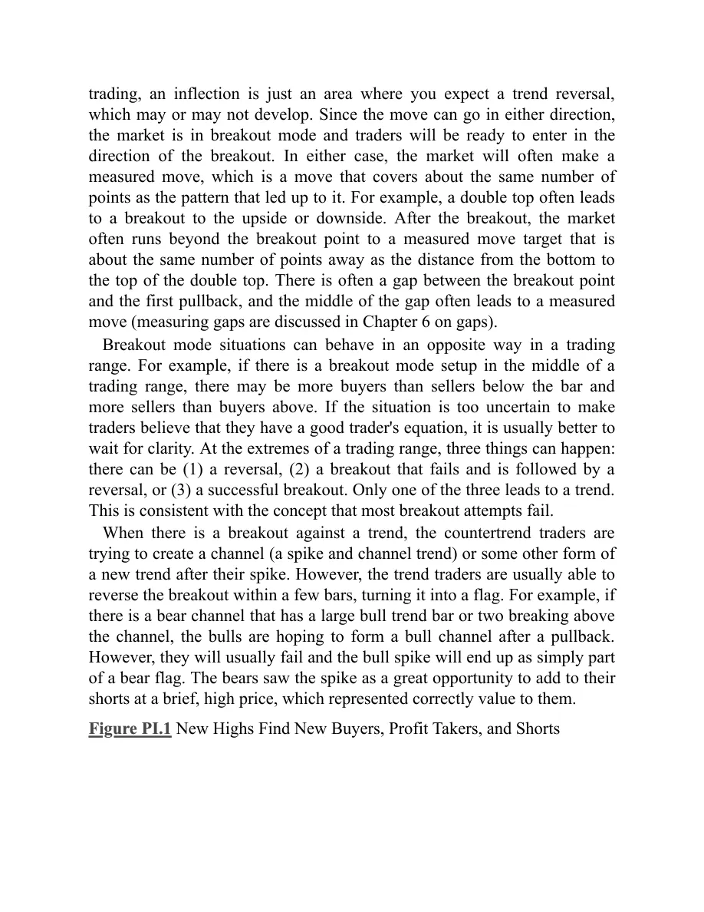
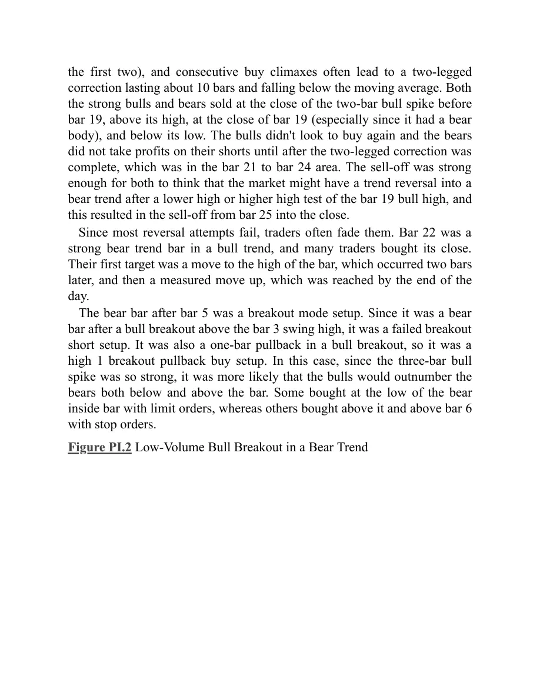

# Part I: Breakouts: Transitioning into a New Trend

<!-- Source PDF pages 74–93 -->

<!-- PDF page 74 -->

Part I
Breakouts: Transitioning into a New
Trend
The market is always trying to break out, and then the market tries to make
every breakout fail. This is the most fundamental aspect of all trading and is
at the heart of everything that we do. One of the most important skills that a
trader can acquire is the ability to reliably determine when a breakout will
succeed or fail (creating a reversal). Remember, every trend bar is a
breakout, and there are buyers and sellers at the top and bottom of every
bull and bear trend bar, no matter how strong the bar appears. Since every
trend bar is a breakout and trend bars are common, traders must understand
that they have to be assessing every few bars all day long whether a
breakout will continue or fail and then reverse. This is the most
fundamental concept in trading, and it is crucial to a trader's financial
success to understand it. A breakout of anything is the same. Even a
climactic reversal like a V bottom is simply a breakout and then a failed
breakout. There are traders placing trades based on the belief that the
breakout will succeed, and other traders placing trades in the opposite
direction, betting it will fail. The better traders become at assessing whether
a breakout will succeed or fail, the better positioned they are to make a
living as a trader. Will the breakout succeed? If yes, then look to trade in
that direction. If no (and become a failed breakout, which is a reversal),
then look to trade in the opposite direction. All trading comes down to this
decision.
Breakout is a misleading term because out implies that it refers only to a
market attempting to transition from a trading range into a trend, but it can
also be a buy or sell climax attempting to reverse into a trend in the
opposite direction. The most important thing to understand about breakouts
is that most breakouts fail. There is a strong propensity for the market to
continue what it has been doing, and therefore there is a strong resistance to

<!-- PDF page 75 -->

change. Just as most attempts to end a trend fail, most attempts to end a
trading range and begin a trend also fail.
A breakout is simply a move beyond some prior point of significance
such as a trend line or a prior high or low, including the high or low of the
previous bar. That point becomes the breakout point, and if the market later
comes back to test that point, the pullback is the breakout test (a breakout
pullback that reaches the area of the breakout point). The space between the
breakout point and the breakout test is the breakout gap. A significant
breakout, one that makes the always-in position clearly long or short and is
likely to have follow-through for at least several bars, almost always
appears as a relatively large trend bar without significant tails. “Always in”
is discussed in detail in the third book, and it means that if you had to be in
the market at all times, either long or short, the always-in position is
whatever your current position is. The breakout is an attempt by the market
either to reverse the trend or to move from a trading range into a new trend.
Whenever the market is in a trading range, it should be considered to be in
breakout mode. There is two-sided trading until one side gives up and the
market becomes heavily one-sided, creating a spike that becomes a
breakout. All breakouts are spikes and can be made up of one or several
consecutive trend bars. Breakouts of one type or another are very common
and occur as often as every few bars on every chart. As is discussed in
Chapter 6 on gaps, all breakouts are functionally equivalent to gaps, and
since every trend bar is a breakout (and also a spike and a climax), it is also
a gap. Many breakouts are easily overlooked, and any single one may be
breaking out of many things at one time. Sometimes the market will have
setups in both directions and is therefore in breakout mode; this is
sometimes referred to as being in an inflection area. Traders will be ready to
enter in the direction of the breakout in either direction. Because breakouts
are one of the most common features of every chart, it is imperative to
understand them, their follow-through, and their failure.
The high of the prior bar is usually a swing high on some lower time
frame chart, so if the market moves above the high of the prior bar, it is
breaking above a lower time frame swing high. Also, when the market
breaks above a prior swing high on the current chart, that high is simply the
high of the prior bar on some higher time frame chart. The same is true for

<!-- PDF page 76 -->

the low of the prior bar. It is usually a swing low on a lower time frame
chart, and any swing low on the current chart is usually just the low of the
prior bar on a higher time frame chart.
It is important to distinguish a breakout into a new trend from a breakout
of a small trading range within a larger trading range. For example, if the
chart on your screen is in a trading range, and the market breaks above a
small trading range in the bottom half of the screen, most traders will
assume that the market is still within the larger trading range, and not yet in
a bull trend. The market might simply be forming a buy vacuum test of the
top of the larger trading range. Because of this, smart traders will not buy
the closes of the strong bull trend bars near the top of the screen. In fact,
many will sell out of their longs to take profits and others will short them,
expecting the breakout attempt to fail. Similarly, even though buying a high
1 setup in strong bull spike can be a great trade, it is great only in a bull
trend, not at the top of a trading range, where most breakout attempts will
fail. In general, if there is a strong bull breakout, but it is still below the
high of the bars on the left half of the screen, make sure that the there is a
strong trend reversal underway before looking to buy near the top of the
spike. If you believe that the market might still be within a trading range,
only consider buying pullbacks, instead of looking to buy near the top of
the spike.
Big traders don't hesitate to enter a trend during its spike phase, because
they expect significant follow-through, even if there is a pullback
immediately after their entry. If a pullback occurs, they increase the size of
their position. For example, if there is a strong bull breakout lasting several
bars, more and more institutions become convinced that the market has
become always-in long with each new higher tick, and as they become
convinced that the market will go higher, they start buying, and they press
the trades by buying more as the market continues to rise. This makes the
spike grow very quickly. They have many ways to enter, like buying at the
market, buying a one- or two-tick pullback, buying above the prior bar on a
stop, or buying on a breakout above a prior swing high. It does not matter
how they get in, because their focus is to get at least a small position on,
and then look to buy more as the market moves higher or if it pulls back.
Because they will add on as the market goes higher, the spike can extend for

<!-- PDF page 77 -->

many bars. A beginning trader sees the growing spike and wonders how
anyone could be buying at the top of such a huge move. What they don't
understand is that the institutions are so confident that the market will soon
be higher that they will buy all of the way up, because they don't want to
miss the move while waiting for a pullback to form. Beginners are also
afraid that their stops would have to be below the bottom of the spike, or at
least below its midpoint, which is far away. The institutions know this, and
simply adjust their position size down to a level where their dollars at risk
are the same as for any other trade.
At some resistance level, the early buyers take some profits, and then the
market pulls back a little. When it does, the traders who want a larger
position quickly buy, thereby keeping the initial pullback small. Also, the
bulls who missed the earlier entries will use the pullback to finally get long.
Some traders don't like to buy spikes, because they don't like to risk too
much (the stop often needs to be below the bottom of the spike). They
prefer to feel like they are buying at a better price (a discount) and therefore
will wait for a pullback to form before buying. If everyone is looking to buy
a pullback, why would one ever develop? It is because not everyone is
looking to buy. Experienced traders who bought early on know that the
market can reverse at any time, and once they feel that the market has
reached a resistance area where they think that profit taking might come in
or the market might reverse, they will take partial profits (they will begin to
scale out of their longs), and sometimes will sell out of their entire position.
These are not the bulls who are looking to buy a few ticks lower on the first
pullback. The experienced traders who are taking partial profits are scaling
out because they are afraid of a reversal, or of a deeper pullback where they
could buy back many ticks lower. If they believed that the pullback was
only going to last for a few ticks, and then the bull was going to resume,
they would never have exited. They always take their profits at some
resistance level, like a measured move target, a trend line, a trend channel
line, a new high, or at the bottom of a trading range above. Most of the
trading is done by computers, so everything has a mathematical basis,
which means that the profit taking targets are based on the prices on the
screen. With practice, traders can learn to spot areas where the computers
might take profits, and they can take their profits at the same prices,

<!-- PDF page 78 -->

expecting a pullback to follow. Although trends have inertia and will go
above most resistance areas, when a reversal finally does come, it will
always be at a resistance area, whether or not it is obvious to you.
Sometimes the spike will have a bar or a pattern that will allow
aggressive bears to take a small scalp, if they think that the pullback is
imminent and that there is enough room for a profit. However, most traders
who attempt this will lose, because most of the pullbacks do not go far
enough for a profit, or the trader's equation is weak (the probability of
making a scalp times the size of the profit is smaller than the probability of
losing times the size of the protective stop). Also, traders who take the short
are hoping so much for their small profit that they invariably end up
missing the much more profitable long that forms a few minutes later.
Traders enter in the direction of the breakout or in the opposite direction,
depending on whether they expect it to succeed or to fail. Are they believers
or nonbelievers? There are many ways to enter in the direction of the
breakout. Once traders feel a sense of urgency because they believe that a
significant move might be underway, they need to get into the market.
Entering during a breakout is difficult for many traders because the risk is
larger and the move is fast. They will often freeze and not take the trade.
They are worried about the size of the potential loss, which means that they
are caring too much to trade. They have to get their position size down to
the “I don't care” size so that they can quickly get in the trade. The best way
for them to take a scary trade is to automatically trade only a third or a
quarter of their normal trade size and use the wide stop that is required.
They might catch a big move, and making a lot on a small position is much
better than making nothing on their usual position size. It is important to
avoid making the mistake of not caring to the point that you begin to trade
weak setups and then lose money. First spot a good setup and then enter the
“I don't care” mode.
As soon as traders feel that the market has had a clear always-in move,
they believe that a trend is underway and they need to get in as soon as
possible. For example, if there is a strong bull breakout, they can buy the
close of the bar that made them believe that the trend has begun. They
might need to see the next bar also have a bull close. If they wait and they
get that bull close, they could buy as soon as the bar closes, either with a

<!-- PDF page 79 -->

limit order at the level of the close of the bar or with a market order. They
could wait for the first pause or pullback bar and place a limit order to buy
at its close, a tick above its low, at its low, or a tick or two below its low.
They can place a limit order to buy any small pullback, like a one- to fourtick pullback in the Emini, or a 5 to 10 cent pullback in a stock. If the
breakout bar is not too large, the low of the next bar might test the high of
the bar before the breakout, creating a breakout test. They might place a
limit order to buy at or just above the high of that bar, and risk to the low of
the breakout bar. If they try to buy at or below a pause bar and they do not
get filled, they can place a buy stop order at one tick above the high of the
bar. If the spike is strong, they can look to buy the first high 1 setup, which
is a breakout pullback. Earlier on, they can look at a 1, 2, or 3 minute chart
and buy at or below the low of a prior bar, above a high 1 or high 2 signal
bar, or with a limit order at the moving average. Once they are in, they
should manage the position like any trend trade, and look for a swing to a
measured move target to take profits and not exit with a small scalp. The
bulls will expect every attempt by the bears to fail, and therefore look to
buy each one. They will buy around the close of every bear trend bar, even
if the bar is large and closes on its low. They will buy as the market falls
below the low of the prior bar, any prior swing low, and any support level,
like a trend line. They also will buy every attempt by the market to go
higher, like around the high of a bull trend bar or as the market moves
above the high of the prior bar or above a resistance level. This is the exact
opposite of what traders do in strong bear markets, when they sell above
and below bars, and above and below both resistance and support. They sell
above bars (and around every type of resistance), including strong bull
trend bars, because they see each move up as an attempt to reverse the
trend, and most trend reversal attempts fail. They will sell below bars (and
around every type of support), because they see each move down as an
attempt to resume the bear trend, and expect that most will succeed.
Since most breakout attempts fail, many traders enter breakouts in the
opposite direction. For example, if there is a bull trend and it forms a large
bear trend bar closing on its low, most traders will expect this reversal
attempt to fail, and many will buy at the close of the bar. If the next bar has
a bull body, they will buy at the close of the bar and above its high. The first

<!-- PDF page 80 -->

target is the high of the bear trend bar, and the next target is a measured
move up, equal to the height of the bear trend bar. Some traders will use an
initial protective stop that is about the same number of ticks as the bear
trend bar is tall, and others will use their usual stop, like two points in the
Emini. Information comes fast during a breakout, and traders can usually
formulate increasingly strong opinions with the close of each subsequent
bar. If there is a second strong bear trend bar and then a third, more traders
will believe that the always-in position has reversed to down, and the bears
will short more. The bulls who bought the bear spike will soon decide that
the market will work lower over the next several bars and will therefore exit
their longs. It does not make sense for them to hold long when they believe
that the market will be lower in the near future. It makes more sense for
them to sell out of their longs, take the loss, and then buy again at a lower
price once they think that the bull trend will resume. Because the bulls have
become sellers, at least for the next several bars, there is no one left to buy,
and the market falls to the next level of support. If the market rallied after
that first bear bar, the bears would quickly see that they were wrong and
would buy back their shorts. With no one left to short and everyone buying
(the bulls initiating new longs and the bears buying back their shorts), the
market will probably rally, at least for several more bars.
Traders have to assess a breakout in relation to the entire chart and not
just the current leg. For example, if the market is breaking out in a strong
bull spike, look across the chart to the left side of the screen. If there are no
bars at the level of the current price, then buying closes and risking to
below the bottom of the spike is often a good strategy. Since the risk is big,
trade small, but because a strong breakout has at least a 60 percent chance
of reaching a measured move that is approximately equal to the size of the
spike, the trader's equation is good (the probability of success times the
potential reward is greater than the probability of failure times the risk).
However, when you look to the left side of the screen, if you see that the
current breakout is still below the high from 20 or 30 bars earlier, the
market might still be in a trading range. Trading ranges regularly have sharp
bull spikes that race to the top, only to reverse. The market then races to the
bottom and that breakout attempt also fails. Because of this, buying the
closes of strong bull trend bars near the top of the trading range is risky, and

<!-- PDF page 81 -->

it is usually better to look to buy pullbacks instead. Traders should trade the
market like a trading range until it is clearly in a trend.
A move above a prior high in a bull trend will generally lead to one of
three outcomes: more buying, profit taking, or shorting. When the trend is
strong, strong bulls will press (add to) their longs by buying the breakout
above the old high and there will be a measured move up of some kind. If
the market goes up far enough above the breakout to enable a trader to
make at least a profitable scalp before there is a pullback, then assume that
there was mostly new buying at the high. If it goes sideways and the
breakout shows signs of weakness (discussed further on), assume that there
was profit taking and that the bulls are looking to buy again a little lower. If
the market reverses down hard, assume that the strong bears dominated at
the new high and that the market will likely trade down for at least a couple
of legs and at least 10 bars.
In the absence of some rare, dramatic news event, traders don't suddenly
switch from extremely bullish to extremely bearish. There is a gradual
transition. A trader becomes less bullish, then neutral, and then bearish.
Once enough traders make this transition, the market reverses into a deeper
correction or into a bear trend. Every trading firm has its own measure of
excess, and at some point enough firms decide that the trend has gone too
far. They believe that there is little risk of missing a great move up if they
stop buying above the old high, and they will buy only on pullbacks. If the
market hesitates above the old high, the market is becoming two-sided, and
the strong bulls are using the new high to take profits.
Profit taking means that traders are still bullish and are looking to buy a
pullback. Most new highs are followed by profit taking. Every new high is a
potential top, but most reversal attempts fail and become the beginning of
bull flags, only to be followed by another new high. If a rally to test the
high has several small pullbacks within the leg up, with lots of overlapping
bars, several bear bodies, and big tails on the tops of the bars, and most of
the bull trend bars are weak, then the market is becoming increasingly twosided. The bulls are taking profits at the tops of the bars and buying only at
the bottoms of the bars, and the bears are beginning to short at the tops of
the bars. Similarly, the bulls are taking profits as the market approaches the
top of the bull trend and the bears are shorting more. If the market goes

<!-- PDF page 82 -->

above the bull high, it is likely that the profit taking and shorting will be
even stronger.
Most traders do not like to reverse, so if they are anticipating a reversal
signal, they prefer to exit their longs and then wait for that signal. The loss
of these bulls on the final leg up in the trend contributes to the weakness of
the rally to the final high. If there is a strong reversal down after the market
breaks above the prior high, the strong bears are taking control of the
market, at least for the near term. Once that happens, then the bulls who
were hoping to buy a small pullback believe instead that the market will fall
further. They therefore wait to buy until there is a much larger pullback, and
their absence of buying allows the bears to drive the market down into a
deeper correction lasting 10 or more bars and often having two or more
legs. Whenever there is a new trend, traders reverse their mind-set. When a
bull trend reverses to a bear trend, they stop buying above bars on stops and
buying below bars on limit orders, and begin selling above bars on limit
orders and selling below bars on stops. When a bear trend reverses to a bull
trend, they stop selling below bars on stops and selling above bars on limit
orders, and begin buying above bars on stops and buying below bars on
limit orders.
There is one situation where the breakout in a bull trend is routinely met
by aggressive shorts who will usually take over the market. A pullback is a
minor trend in the opposite direction, and traders expect it to end soon and
for the larger trend to resume. When there is a pullback in a strong bear
trend, the market will often have two legs up in the minor bull trend. As the
market goes above the high of the first leg up, it is breaking out above a
prior swing high in a minor bull trend. However, since most traders will see
the move up as a pullback that will end very soon, the dominant traders on
the breakout will usually be aggressive sellers, instead of aggressive new
buyers, and the minor bull trend will usually reverse back down into the
direction of the major bear trend after breaking out above the first or second
swing high in the pullback.
The same is true of new lows in a bear trend. When the bear trend is
strong, strong bears will press their shorts by adding to their positions on
the breakout to a new low and the market will continue to fall until it
reaches some measured move target. As the trend weakens, the price action

<!-- PDF page 83 -->

at a new low will be less clear, which means that the strong bears are using
the new low as an area to take profits on their shorts rather than as an area
to add to their shorts. As the bear trend further loses strength, the strong
bulls will eventually see a new low as a great price to initiate longs and they
will be able to create a reversal pattern and then a significant rally.
As a trend matures, it usually transitions into a trading range, but the first
trading ranges that form are usually followed by a continuation of the trend.
How do the strong bulls and bears act as a trend matures? In a bull trend,
when the trend is strong, the pullbacks are small because the strong bulls
want to buy more on a pullback. Since they suspect that there may not be a
pullback until the market is much higher, they begin to buy in pieces, but
relentlessly. They look for any reason to buy, and with so many big traders
in the market, there will be some buying for every imaginable reason. They
place limit orders to buy a few ticks down and other limit orders to buy a
few ticks above the low of the prior bar, at the low of the prior bar, and
below the low of the prior bar. They place stop orders to buy above the high
of the prior bar and on a breakout above any prior swing high. They also
buy on the close of both any bull or bear trend bar. They see the bear trend
bar as a brief opportunity to buy at a better price and the bull trend bar as a
sign that the market is about to move up quickly.
The strong bears are smart and see what is going on. Since they believe,
just like the strong bulls, that the market is going to be higher before long, it
does not make sense for them to be shorting. They just step aside and wait
until they can sell higher. How much higher? Each institution has its own
measure of excess, but once the market gets to a price level where enough
bear firms believe that it might not go any higher, they will begin to short.
If enough of them short around the same price level, more and larger bear
trend bars form and bars start to get tails on the tops. These are signs of
selling pressure, and they tell all traders that the bulls are becoming weaker
and the bears are becoming stronger. The strong bulls eventually stop
buying above the last swing high and instead begin to take profits as the
market goes to a new high. They are still bullish but are becoming selective
and will buy only on pullbacks. As the two-sided trading increases and the
sell-offs have more bear trend bars and last for more bars, the strong bulls
will want to buy only at the bottom of the developing trading range and will

<!-- PDF page 84 -->

look to take profits at the top. The strong bears begin to short at new highs
and are now willing to scale in higher. They might take partial profits near
the bottom of the developing trading range if they think that the market
might reverse back up and break out to a new high, but they will keep
looking to short new highs. At some point, the market becomes a 50–50
market and neither the bulls nor the bears are in control; eventually the
bears become dominant, a bear trend begins, and the opposite process
unfolds.
A protracted trend will often have an unusually strong breakout, but it can
be an exhaustive climax. For example, in a protracted bull trend, all strong
bulls and bears love to see a large bull trend bar or two, especially if it is
exceptionally large, because they expect it to be a brief, unusually great
opportunity. Once the market is close to where the strong bulls and bears
want to sell, like near a measured move target or a trend channel line,
especially if the move is the second or third consecutive buy climax, they
step aside. The absence of selling by the strongest traders results in a
vacuum above the market. The programs that detect the momentum early
on in a bar see this and quickly buy repeatedly until the momentum slows.
Since few strong traders are selling, the result is one or two relatively large
bull trend bars. This bull spike is just the sign that the strong traders have
been waiting for, and once it is there, they appear as if out of nowhere and
begin their selling. The bulls take profits on their longs and the bears
initiate new shorts. Both sell aggressively at the close of the bar, above its
high, at the close of the next bar (especially if it is a weaker bar), and at the
close of the following bar, especially if the bars are starting to have bear
bodies. They also short below the low of the prior bar. When they see a
strong bear trend bar, they short at its close and below its low. The
momentum programs also take profits. Both the bulls and the bears expect a
larger correction, and the bulls will not consider buying again until at least a
10-bar, two-legged correction, and even then only if the sell-off looks weak.
The bears expect the same sell-off and will not be eager to take profits too
early.
Weak traders see that large bull trend bar in the opposite way. The weak
bulls, who had been sitting on the sidelines hoping for an easy pullback to
buy, see the market running away from them and want to make sure they

<!-- PDF page 85 -->

catch this next leg up, especially since the bar is so strong and the day is
almost over. The weak bears, who shorted early and maybe scaled in, were
terrified by the rapidity with which the bar broke to a new high. They are
afraid of relentless follow-through buying, so they buy back their shorts.
These weak traders are trading on emotion and are competing against
computers, which do not have emotion as one of the variables in their
algorithms. Since the computers control the market, the emotions of the
weak traders doom them to big losses on big bull trend bars at the end of an
overdone bull trend.
Once a strong bull trend begins to have pullbacks that are relatively large,
the pullbacks, which are always small trading ranges, behave more like
trading ranges than like bull flags. The direction of the breakout becomes
less certain, and traders begin to think that a downside breakout is about as
likely as an upside breakout. A new high is now a breakout attempt above a
trading range, and the odds are that it will fail. Likewise, once a strong bear
trend begins to have relatively large pullbacks, those pullbacks behave more
like trading ranges than like bear flags, and therefore a new low is an
attempt to break below a trading range and the odds are that it will fail.
Every trading range is within either a bull or a bear trend. Once the twosided trading is strong enough to create the trading range, the trend is no
longer strong, at least while the trading range is in effect. There will always
be a breakout from the range eventually, and if it is to the upside and it is
very strong, the market is in a strong bull trend. If it is to the downside and
strong, the market is in a strong bear trend.
Once the bears are strong enough to push a pullback well below the bull
trend line and the moving average, they are confident enough that the
market will likely not go much higher and they will aggressively short
above the old high. At this point, the bulls will have decided that they
should buy only a deep pullback. A new mind-set is now dominant at the
new high. It is no longer a place to buy, because it no longer represents
much strength. Yes, there is profit taking by the bulls, but most big traders
now look at the new high as a great opportunity to initiate shorts. The
market has reached the tipping point, and most traders have stopped looking
to buy small pullbacks and instead are looking to sell rallies. The bears are
dominant and the strong selling will likely lead to a large correction or even

<!-- PDF page 86 -->

a trend reversal. After the next strong push down, the bears will look for a
lower high to sell again or to add to their short positions, and the bulls who
bought the pullback will become concerned that the trend might have
reversed or at least that there will be a much larger pullback. Instead of
hoping for a new bull high to take profits on their longs, they will now take
profits at a lower high and not look to buy again until after a larger
correction. Bulls know that most reversal attempts fail, and many who rode
the trend up will not exit their longs until after the bears have demonstrated
the ability to push the market down hard. Once these bulls see this
impressive selling pressure, they will then look for a rally to finally exit
their longs. Their supply will limit the rally, and their selling, added to the
shorting by aggressive bears and the profit taking by bulls who saw the selloff as a buying opportunity, will create a second leg down.
If the market enters a bear trend, the process will reverse. When the bear
trend is strong, traders will short below prior lows. As the trend weakens,
the bears will take profits at new lows and the market will likely enter a
trading range. After a strong rally above the bull trend line and the moving
average, the bears will take profits at a new low and strong bulls will
aggressively buy and try to take control of the market. The result will be a
larger bear rally or possibly a reversal into a bull trend.
A similar situation occurs when there is a pullback that is large enough to
make traders wonder if the trend has reversed. For example, if there is a
deep, sharp pullback in a bull trend, traders will begin to wonder if the
market has reversed. They are looking at moves below prior swing lows,
but this is in the context of a pullback in a bull trend instead of as part of a
bear trend. They will watch what happens as the market falls (breaks out)
below a prior swing low. Will the market fall far enough for bears, who
entered on a sell stop below that swing low, to make a profit? Did the new
low find more sellers than buyers? If it did, that is a sign that the bears are
strong and that the pullback will probably go further. The trend might even
have reversed.
Another possibility on the breakout to a new low is that the market enters
a trading range, which is evidence that the shorts took profits and that there
was unimpressive buying by the bulls. The final alternative is that the
market reverses up after the breakout to a new low. This means that there

<!-- PDF page 87 -->

were strong bulls below that swing low just waiting for the market to test
there. This is a sign that the sell-off is more likely just a big pullback in an
ongoing bull trend. The shorts from higher up took profits on the breakout
to the new low because they believed that the trend was still up. The strong
bulls bought aggressively because they believed that the market would not
fall further and that it would rally to test the bull high.
Whenever there is any breakout below a swing low, traders will watch
carefully for evidence that the bulls have returned or that the bears have
taken control. They need to decide what influence is greater at the new low,
and will use the market's behavior to make that decision. If there is a strong
breakout, then new selling is dominant. If the market's movement is
uncertain, then profit taking by the shorts and weak buying by the bulls are
taking place, and the market will likely enter a trading range. If there is a
strong reversal up, then aggressive buying by the longs is the most
important factor.
Sometimes, when the market is in a weak trend, there is a large breakout
bar in the direction of the trend. That breakout bar often acts as a spike, and
it is usually followed by several more trend bars, but they usually overlap
and have tails. These bars create a tight bull channel. Like with any spike
and channel trend, the market often tests back to the start of the channel,
which in this case is the breakout gap area. For example, if there is a
relatively weak bull swing and then the market breaks to the upside with a
large bull trend bar, and this is followed by three or four more smaller bull
trend bars, these bars usually act as a channel. Once the market trades down
to the area of the first of those channel bars, it often goes slightly below its
low, and that puts the market in the gap area that was created by the
breakout bar. The gap is both a measuring gap and a breakout gap, and the
test of the gap is usually followed by a resumption of the trend rather than
the start of a reversal down.
An inflection is a mathematical term that means that there has been a
change of direction. For example, if there is a horizontal wave that goes up
and down repeatedly, when the wave is going down, at some point the slope
changes from steeply down to less steeply down as it begins to form a
bottom. For example, the middle of the letter S is the inflection point in the
curve, because it is the point where the slope begins to change direction. In

<!-- PDF page 88 -->

trading, an inflection is just an area where you expect a trend reversal,
which may or may not develop. Since the move can go in either direction,
the market is in breakout mode and traders will be ready to enter in the
direction of the breakout. In either case, the market will often make a
measured move, which is a move that covers about the same number of
points as the pattern that led up to it. For example, a double top often leads
to a breakout to the upside or downside. After the breakout, the market
often runs beyond the breakout point to a measured move target that is
about the same number of points away as the distance from the bottom to
the top of the double top. There is often a gap between the breakout point
and the first pullback, and the middle of the gap often leads to a measured
move (measuring gaps are discussed in Chapter 6 on gaps).
Breakout mode situations can behave in an opposite way in a trading
range. For example, if there is a breakout mode setup in the middle of a
trading range, there may be more buyers than sellers below the bar and
more sellers than buyers above. If the situation is too uncertain to make
traders believe that they have a good trader's equation, it is usually better to
wait for clarity. At the extremes of a trading range, three things can happen:
there can be (1) a reversal, (2) a breakout that fails and is followed by a
reversal, or (3) a successful breakout. Only one of the three leads to a trend.
This is consistent with the concept that most breakout attempts fail.
When there is a breakout against a trend, the countertrend traders are
trying to create a channel (a spike and channel trend) or some other form of
a new trend after their spike. However, the trend traders are usually able to
reverse the breakout within a few bars, turning it into a flag. For example, if
there is a bear channel that has a large bull trend bar or two breaking above
the channel, the bulls are hoping to form a bull channel after a pullback.
However, they will usually fail and the bull spike will end up as simply part
of a bear flag. The bears saw the spike as a great opportunity to add to their
shorts at a brief, high price, which represented correctly value to them.
Figure PI.1 New Highs Find New Buyers, Profit Takers, and Shorts

<!-- PDF page 89 -->

When a bull trend breaks above a prior swing high, there will be new
buyers, profit takers, and shorts (see Figure PI.1). If the trend that preceded
the breakout is starting out and is very strong, there will be some profit
taking, like after bars 5, 12, and 17, but the new buyers will overwhelm the
bears, and the trend will quickly resume. Later in the trend, there will be
much less new buying and much more profit taking, like after bar 19. There
are many measures of excess, and once enough trading firms believe that
the bull trend is overdone, they will take profits on their longs and buy
again only after about a 10-bar, two-legged correction. I use the phrase “10bar, two-legged” often, and my intention is to say that the correction will
last longer and be more complex than a small pullback. That usually
requires at least 10 bars and two legs, and sometimes can result in a trend
reversal.
Whenever there is a breakout, it might fail and lead to a trend reversal.
The chance of a successful reversal is greater if the context is right and the
reversal bar is strong. If the breakout bar and spike leading to the breakout
is stronger than the reversal bar, and the chance of a climactic reversal is not
great, the odds are that the reversal attempt will fail within a few bars and
form a breakout pullback setup that will lead to a resumption of the trend.
For example, bar 12 was a small bear reversal bar, but it followed a much
stronger three-bar bull spike and the market was trending up in a tight
channel all day following a large gap up. This made the odds of a successful
reversal small, so bulls bought at and below the low of bar 12. The next bar

<!-- PDF page 90 -->

was a doji and therefore a weak entry bar for the bears, so there were almost
certainly going to be more buyers than sellers above its high. It became a
breakout pullback buy signal bar (here, a high 1 buy setup). The next bar
was a bull bar, and more buyers bought above its high. In general, the odds
of a successful buy signal are greater when traders wait to enter above a
bull bar. Bar 14 was the breakout bar, but it closed on its low and formed a
bear doji reversal bar, which is a weak sell signal in the face of such a tight
bull channel. The bulls were so aggressive that they did not want the short
to trigger. They placed limit orders at and above the low of the bear bar, and
there were enough buy orders to overwhelm the bears. The short never
triggered and the market continued to rally. Bar 14 was simply another
pullback from the breakout (and it was also the breakout), and traders
bought above the high of bar 15, which was another breakout pullback buy
signal.
Another example of comparing the strength of the breakout with that of
the reversal occurred on the bar 5 breakout. The bear bar after bar 5 was the
signal bar for the failed breakout of the bar 4 one bar bull flag and the
breakout above bar 3. The bear signal was small compared to the 3 bar bull
spike up from bar 4, and was therefore unlikely to reverse the trend. The
next bar was a breakout pullback buy setup, but had a bear body, which is
not a strong buy signal bar. The bar after had a bull body and therefore
buying above its high had a higher probability of success.
Bar 10 was a breakout of an ii bull flag, but the breakout bar was a bear
reversal bar, which is a weak breakout bar. This increased the chances that
the breakout would fail. The breakout bar was also the signal bar for the
failed breakout.
The correction sometimes breaks the bull trend line and creates enough
selling pressure for the bears to become aggressive at the next new high, as
they were at bar 25. There was still some profit taking by the bulls, but very
little new buying. The bears took control going into the close.
Both the strong bulls and bears looked forward to the final, strong
breakout up to bar 19. They liked seeing a large bull spike after a protracted
bull trend, because the expected correction provided both of them with a
temporary trading opportunity. It was the third consecutive bull climax
without a correction since the bar 11 low (bars 11 to 12 and 15 to 17 were

<!-- PDF page 91 -->

the first two), and consecutive buy climaxes often lead to a two-legged
correction lasting about 10 bars and falling below the moving average. Both
the strong bulls and bears sold at the close of the two-bar bull spike before
bar 19, above its high, at the close of bar 19 (especially since it had a bear
body), and below its low. The bulls didn't look to buy again and the bears
did not take profits on their shorts until after the two-legged correction was
complete, which was in the bar 21 to bar 24 area. The sell-off was strong
enough for both to think that the market might have a trend reversal into a
bear trend after a lower high or higher high test of the bar 19 bull high, and
this resulted in the sell-off from bar 25 into the close.
Since most reversal attempts fail, traders often fade them. Bar 22 was a
strong bear trend bar in a bull trend, and many traders bought its close.
Their first target was a move to the high of the bar, which occurred two bars
later, and then a measured move up, which was reached by the end of the
day.
The bear bar after bar 5 was a breakout mode setup. Since it was a bear
bar after a bull breakout above the bar 3 swing high, it was a failed breakout
short setup. It was also a one-bar pullback in a bull breakout, so it was a
high 1 breakout pullback buy setup. In this case, since the three-bar bull
spike was so strong, it was more likely that the bulls would outnumber the
bears both below and above the bar. Some bought at the low of the bear
inside bar with limit orders, whereas others bought above it and above bar 6
with stop orders.
Figure PI.2 Low-Volume Bull Breakout in a Bear Trend

<!-- PDF page 92 -->

As shown in Figure PI.2, the Emini was in a bear trend on the 60 minute
chart on the left and many traders looked to buy a measured move down,
based on the height of the initial spike down from bar 1 to bar 2. The bears
bought back their shorts to take profits, and aggressive bulls bought to
initiate longs, expecting a possible trend reversal and test of the start of the
bear channel (the lower swing high after bar 2). The chance of at least two
legs up was increased by the reversal down from the bar 3 moving average
gap bar and break above the bear trend line (reversals are covered in the
third book).
The 5 minute chart on the right reversed up after falling one tick below
the 60 minute measured move target (bar 4 is the same time on both charts).
Bar 5 was a large bull reversal bar with a small tail, and bulls were hopeful
for a strong reversal up. However, the bar had only 23,000 contracts, or
about three times as many as an average 5 minute bar. When the average 5
minute bar has 5,000 to 10,000 contracts, most bull reversals with
protracted follow-through have about 5 to 10 times that volume, or at least
40,000 to 50,000 contracts. The most reliable bars have over 100,000
contracts. Traders do not have to worry about volume because the chart will
tell them what they need to know, but seeing huge volume on a large trend
bar that is breaking out increases the chances that there will be followthrough and usually at least some kind of measured move. When there is a
strong bear trend and the reversal up goes for only two bars and then pulls
back, and the second bar up has a large tail, the reversal is not strong. More

<!-- PDF page 93 -->

experienced traders can look at the volume and see it as another sign that
the reversal is not strong, or they can look at the 60 minute chart and see the
strong bear trend. However, all day traders need to see is the 5 minute chart
to place their trades. They would have bought bar 5 as it was forming, as it
closed, and above its high. They would have also bought the bar 7 ioi
(inside-outside-inside) pattern, high 4 bull flag at the moving average. Since
they were buying a strong bull move, they should have assumed that they
had at least a 60 percent chance of making a reward that was at least as
large as their risk. They could have chosen a two-point stop, since that
worked well lately, and then used a two-point profit target. Another trader
who bought at the bar 5 close might have been willing to risk to below the
bar 5 low (about four points), and his profit taking target might have been
as many points as he had to risk. The stop for the trader who bought above
bar 7 would have been below the low of bar 7 or below the bar before it.
Her risk was about two points, and she could have held for either two points
or for a move above the bar 6 high (here, it was also about two points).
