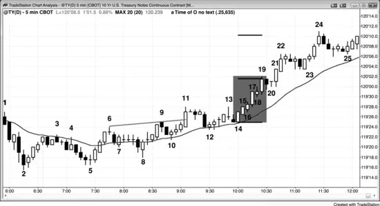
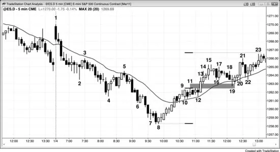

## Chapter 1: Example of How to Trade a Breakout

<!-- Source PDF pages 94–101 -->

<!-- PDF page 94 -->

Chapter 1
Example of How to Trade a Breakout
Many beginners find breakouts difficult to trade because the market moves
fast, requiring quick decisions, and often has large bars, which means that
there is more risk and traders then have to reduce their position size.
However, if a trader learns to identify one that is likely to be successful, the
trader's equation can be very strong.
Figure 1.1 Breakouts Are Reliable Setups

When a chart discussion runs for multiple pages, remember that you can go
to the Wiley website (www.wiley.com/go/tradingranges) and either view the
chart or print it out, allowing you to read the description in the book without
having to repeatedly flip pages back to see the chart.
Successful breakouts, like the bull breakouts in Figure 1.1, have excellent
math, but can be emotionally very difficult to trade. They happen quickly
and traders instinctively know that the risk is to the bottom of the spike
(they put their protective stop at one tick below the low of the lowest bar in
the bull spike, like below bar 14), which is often more than their usual risk

<!-- PDF page 95 -->

tolerance. They want a pullback but know it will likely not come until the
market is higher, and they are afraid to buy at the market because they are
buying at the top of a spike. If the market reverses on the next tick, they
will have bought at the top of a spike and their protective stop is very far
away. However, what they often fail to appreciate is that the math is on their
side. Once there is a strong spike in a breakout like this, the probability of at
least a measured move up based on the height of the spike is at least 60
percent and may even sometimes be 80 percent. This means that they have
at least a 60 percent chance of making at least as much as their initial risk,
and if the spike continues to grow after they enter, their risk stays the same
but the measured move target gets higher and higher. For example, if traders
bought at the close of bar 15 on the 5 minute chart of the 10-Year U.S.
Treasury Note Futures in Figure 1.1, they would risk to one tick (one 64th
of a point) below the bottom of the two-bar spike, which is one tick below
the bar 14 low, or seven ticks below the entry price. At this point, since the
traders believed that the market was always-in long, they thought that there
was at least a 60 percent chance of it being higher within a few bars. They
should also have assumed that there would be at least a measured move up.
Since the spike was six ticks tall, the market had at least a 60 percent
chance of trading up at least six ticks before falling to their protective stops.
At the close of bar 19, the spike had grown to 17 ticks tall and since it
was still a breakout spike, there was still at least a 60 percent chance of at
least a measured move up. If traders were flat at this point, they could have
bought small positions at the market and risked to one tick below the bar 14
bottom of the spike, or 18 ticks, to make 16 ticks (if the market went 17
ticks higher, they could get out with 16 ticks of profit). The traders who
bought the bar 15 close were still risking seven ticks to below the bar 14
low, but now had a 60 percent chance of the market trading 17 ticks above
the bar 19 high, which would be about a 28-tick profit (14 32nds). The
spike ended at bar 19, once the next bar was a bear inside bar instead of
another strong bull trend bar. This was the first in a series of pullbacks in
the channel phase of the bull trend. Bar 24 went above the measured move
target, and the market traded even higher about an hour later.
In practice, most traders would have tightened their stops as the spike
grew, so they would have risked less than what was just discussed. Many

<!-- PDF page 96 -->

traders who bought the bar 15 close might have raised their stops to below
bar 17 once it closed because they would not have wanted the market to fall
below such a strong bull trend bar. If it did, they would have believed that
their premise was wrong and they would not want to risk a larger loss.
When bar 19 closed and traders saw that it was a strong bull trend bar,
many might have put their protective stops in the micro measuring gap
created by the bar 17 breakout. The low of bar 18 was above the high of bar
16, and this gap is a sign of strength. Traders would want the market to
continue up and not trade below bar 18 and into the gap, so some traders
would have trailed their stop to below the bar 18 low. Many experienced
traders use spikes to press their trades. They add to their longs as the spike
continues up, because they know that the spike has an exceptional trader's
equation and that the great opportunity will be brief. A trader needs to be
aggressive when the market is offering trades with strong trader's equations.
He also needs to trade little or not at all when it does not, like in a tight
trading range.
The bull spike up from bar 5 flipped the market to always-in long for
most traders. When the market traded above the bar 11 wedge bear flag
high, it was likely to have approximately a measured move up. Bar 15 was
a second consecutive strong bull trend bar and confirmed the breakout in
the minds of many traders. Both bars 14 and 15 were strong bull trend bars
with good-sized bodies and without significant tails. There was good
buying pressure all of the way up from the bar 5 low, as seen by many
strong bull trend bars, little overlap, and only a few bear trend bars and the
absence of consecutive strong bear trend bars. The market might have been
in the early stages of a bull trend, and smart traders were looking for a bull
breakout. They were eager to get long once bars 14 and 15 broke out, and
traders kept buying relentlessly in pieces all the way up to the bar 19 high.
The most important thing that traders must force themselves to do, and it
is usually difficult, is as soon as they believe that there is a reliable breakout
spike, they must take at least a small position. When they feel themselves
hoping for a pullback but fearing that it won't come for many more bars,
they should assume that the breakout is strong. They must decide where a
worst-case protective stop would be, which is usually relatively far away,
and use that as their stop. Because the stop will be large, their initial

<!-- PDF page 97 -->

position should be small if they are entering late. Once the market moves in
their direction and they can tighten their stop, they can look to add to their
position, but should never exceed their normal risk level. When everyone
wants a pullback, it usually will not come for a long time. This is because
everyone believes that the market will soon be higher but they do not
necessarily believe that it will be lower anytime soon. Smart traders know
this and therefore they start buying in pieces. Since they have to risk to the
bottom of the spike, they buy small. If their risk is three times normal, they
will buy only one-third of their usual size to keep their absolute risk within
their normal range. When the strong bulls keep buying in small pieces, this
buying pressure works against the formation of a pullback. The strong bears
see the trend and they, too, believe that the market will soon be higher. If
they think it will be higher soon, they will stop looking to short. It does not
make sense for them to short if they think that they can short at a better
price after a few more bars. So the strong bears are not shorting and the
strong bulls are buying in small pieces, in case there is no pullback for a
long time.
What is the result? The market keeps working higher. Since you need to
be doing what the smart traders are doing, you need to buy at least a small
amount at the market or on a one- or two-tick pullback and risk to the
bottom of the spike. Even if the pullback begins on the next tick, the odds
are that it won't fall too far before smart bulls see it as value and they buy
aggressively. Remember, everyone is waiting to buy a pullback, so when it
finally comes it will only be small and not last long. All of those traders
who have been waiting to buy will see this as the opportunity that they
wanted. The result is that your position will once again be profitable very
soon. Once the market goes high enough, you can look to take partial
profits or you can look to buy more on a pullback, which will probably be
at a price above your original entry. The important point is that as soon as
you decide that buying a pullback is a great idea, you should do exactly
what the strong bulls are doing and buy at least a small position at the
market.
Some traders like to buy breakouts as the market moves above a prior
swing high, entering on a buy stop at one tick above the old high. In
general, the reward is greater, the risk is smaller, and the probability of

<!-- PDF page 98 -->

success is higher when entering on pullbacks. If traders buy these
breakouts, they usually will then have to hold through a pullback before
they can make much profit. It is usually better to buy the pullback than the
breakout. For example, rather than buying above bar 6 as the market moved
up to bar 9, the trader's equation was probably stronger for a buy above the
bar 10 pullback instead.
The same is true for the bar 11 move above bar 9. With every breakout,
traders have to decide if it will succeed or fail. If they believe that it will
succeed, they will look to buy the close of the breakout or follow-through
bars, at and below the low of the prior bar, and above the high of the prior
bar. If they believe that it will fail, they will not buy and if they are long,
they will exit their positions. If they believe that the failure will trade down
far enough for a scalp, they might go short for a scalp. If they think that the
failure will lead to a trend reversal, they might look to swing a short down.
In this particular case, as the market moved strongly above the bar 9 and bar
11 double top, it was reasonable to buy the breakout, but traders who
bought the close of bar 15 entered around the same price and had a more
sound reason to take the trade (buying the close of a strong bull trend bar in
a strong bull spike).
If any bull trend or breakout that does not look quite strong enough to buy
near the top of the spike, like on the close of the most recent bar, the trader's
equation is stronger if traders instead wait to buy pullbacks. Bar 22 was the
second bar of a breakout from an ii pattern and therefore the beginning of a
possible final flag reversal setup. This was likely a minor buy climax
(discussed in book 3 in the chapter on climax reversals). At this point, the
trader's equation was stronger for buying a pullback than for buying the
close of bar 22. The same was true for bar 24. As a trend becomes more
two-sided, it is better to look to buy pullbacks. Once the two-side trading
becomes strong enough and the prior pullbacks have been deeper and lasted
for more than five bars or so, traders can begin to short for scalps, like at
the two bar reversal at bar 24 (shorting below the low of then bear bar that
followed). After the market has transitioned into a trading range, the bears
will begin to short for swing trades, expecting deeper pullbacks and a
possible trend reversal.

<!-- PDF page 99 -->

Other examples of breakout pullback buy setups in this bull trend include
the bar 8 high 2 bull flag (a pullback from the rally to bar 6, which broke
out of the bear channel from bar 3 to bar 5), the bar 12 high 2 at the moving
average (bar 11 broke above the trading range and out of the bar 10 high 1
bull flag; the first push down was the bear bar that formed two bars after bar
11), the bar 14 outside up bar (traders could have bought as it went outside
up, but the probability of success was higher if they bought above bar 14,
because it was a bull trend bar), the bar 20 ii, the high 2 at bar 23 (bar 23
was the entry bar), and the bar 25 high 2 (all double bottoms are high 2
patterns). The signal bar is more reliable when it has a bull body.
In general, whenever there is an initial pullback in a trend that has just
become strongly always-in long, a trader should immediately place a buy
stop to buy above the high of the spike. This is because many traders are
afraid to buy below the low of the prior bar or above a high 1, thinking that
the market might have a two-legged pullback. However, if they wait for a
two-legged pullback, they will miss many of the very strongest trends. To
prevent themselves from being trapped out of a strong trend, traders need to
get into the habit of placing that last-ditch buy stop. If they buy the high 1,
they can cancel their buy stop. But if they miss the earlier entries, at least
they will get into the trend, which is what they need to do. By bar 19, the
trend was clearly very strong and was likely to continue up for about a
measured move based on the height of the spike. As soon as the market
gave a sign of a possible pullback, traders needed to place their worst-case
entry buy stop orders above the spike high. The bar after bar 19 was a bear
trend bar and a possible start of a pullback. They needed to place a buy stop
at one tick above the bar 19 high, in case the trend quickly resumed. If they
instead bought the bar 20 ii high 1 setup, they would have canceled the buy
stop above bar 19. However, if they missed buying the high 1 for any
reason, at least they would have been swept into the trend as the market
moved to the new high. Their initial protective stop would have been below
the most recent minor pullback, which was the bar 20 low.
Bar 24 was a two-bar bull spike and the third consecutive buy climax
without a correction. There was not enough time left in the day for a 10-bar,
two-legged correction, so not many bears were willing to short it, especially
since the move up from bars 5 and 12 had had so little selling pressure.

<!-- PDF page 100 -->

However, some bulls used it as an opportunity to take profits, which turned
out to be a reasonable decision, since the market did not get back above its
high for the rest of the day.
Traders know that most attempts to reverse a trend fail, and many like to
fade the attempts. The bar before bar 12 was a large bear trend bar, which
was a break below the trend line and an attempt to reverse down from the
bar 11 bull breakout. Bulls bought the close of the bear trend bar, expecting
a move back up to its high, and probably a measured move up equal to the
height of the bar. Once they saw that bar 12 had a bull close, they bought
the close of bar 12 and above its high. A successful bear breakout usually is
followed by another bear trend bar or at least a doji bar, and if there is
instead a bull body, even a small one, the odds of a failed breakout attempt
become higher, especially when the bar is at the moving average in a bull
trend. The bears wanted a bear channel after the bear spike, or some other
type of bear trend, but the bulls saw the bear spike as an opportunity to buy
during a brief discount. Bear spikes, especially on daily charts, can be due
to news items, but most fail to have follow-through, and the longer-term
bullish fundamentals win out, leading to a failed bear breakout and a
resumption of the bull trend. The bears get excited and hopeful because of
the terrible news, but the news is usually a one-day minor event and trivial
compared to the sum of all of the fundamentals.
Figure 1.2 Breakout Pullback

<!-- PDF page 101 -->

Figure 1.2 shows that when a bull swing has a breakout to the upside, the
market usually tests back into the breakout gap. The market sold off down
to bar 8 and then reversed up. Bar 12 was a second-entry moving average
gap bar short, but it failed. Instead of testing the bear low, the market broke
to the upside on bar 13. The low of the bar after the breakout bar and the
high of the bar 11 breakout point created a breakout gap. Either its middle
or the high of the first leg up to bar 11 could lead to a measured move up.
After the bar 13 spike up, there was a tight four-bar channel that ended at
bar 15 and then a test down to the bottom of the channel. The bar 19 test
also tested into the breakout gap, which usually happens in these situations.
The selloff from bar 5 to bar 8 had no pullbacks, and the bar after bar 8
was the first bar that traded above the high of the prior bar. Why would
experienced traders ever buy back their highly profitable shorts when the
first pullback in a strong trend usually fails? They have learned that they
should always look for reasons to take partial or full profits, especially
when they are large, because those profits can vanish quickly, especially
after a possible sell climax. Here, there were three consecutive sell climaxes
(the moves down to bars 6, 7, and 8), and the inside bar after bar 7 was a
potential final flag (these patterns are discussed in book 3). The odds were
high that the market would correct up for about 10 bars, probably to the
moving average, the bar 4 low, or even the bar 5 high. The bears saw this as
a great opportunity to lock in their profits around bar 8, expecting at least a
10-bar rally, and then look to sell again much higher, if a sell setup
developed. The move up was so strong that there was no sell pattern, and
the bears were happy that they wisely took their profits, and they were not
concerned about the absence of another good chance to short. Had they held
onto their shorts, all of their profits would have turned into losses. Profit
taking is the cause of the first pullback in any strong trend. The bears who
missed the selloff were hoping for a pullback that would allow them to
short, but they never got that opportunity.
The bears who missed the selloff to bar 4, or who took profits at bar 4 and
were looking to sell again on a pullback, got their chance at the bar 5 low 2
at the moving average. It had a bear body and was also a 20-gap bar short
setup (discussed later in this book).
