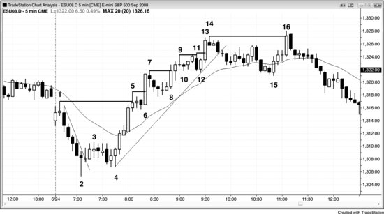
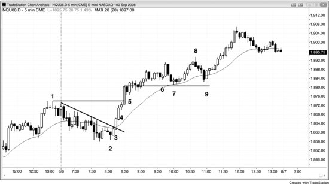

## Chapter 4: Breakout Entries in Existing Strong Trends

<!-- Source PDF pages 134–139 -->

<!-- PDF page 134 -->

Chapter 4
Breakout Entries in Existing Strong Trends
When a trend is strong and there is a pullback, every breakout beyond a
prior extreme is a valid with-trend entry. The breakout usually has strong
volume, a large breakout bar (a strong trend bar), and follow-through over
the next several bars. Smart money is clearly entering on the breakout.
However, that is rarely the best way to trade a breakout, and price action
traders almost always find an earlier price action entry like a high 1 or 2 in
a bull trend. It is important to recognize that when a trend is strong, you can
enter at any time and make a profit if you use an adequate stop. Once
traders see that a trend is strong, some traders do not take the first entries
because they are hoping for a larger pullback, like a two-legged pullback to
the moving average. For example, if the market just became clearly alwaysin long and the initial bull spike has three good-sized bull trend bars with
small tails, a trader might be afraid that the move was a little climactic and
decide that he wants to wait for a high 2 buy setup. However, when a trend
is very strong like this, the first couple of entries are usually just high 1 buy
setups. Aggressive traders will place limit orders to buy below the low of
the prior bar, expecting any reversal attempt to fail. Once the market trades
below the low of the prior bar, they will expect a high 1 buy setup to lead to
at least a new high and probably a measured move up, based on the height
of the bull spike. If traders fail to take either of these two early entries, they
should train themselves to guarantee that they get into this strong trend.
When they are looking at the pullback beginning, they should put a buy
stop at one tick above the high of the spike, in case the pullback is only one
bar and reverses up quickly. If they fail to take either of the early pullback
entries and the market begins to race up without them, they will be swept
into the trade and not be left behind. On the strongest trades, you will
usually see that the bar that breaks above the bull spike is usually a large
bull trend bar, and this tells you that many strong bulls believe that there is

<!-- PDF page 135 -->

value buying the new high. If it is a great entry for so many of them, it is a
great entry for you as well.
One quick way to determine the strength of a trend is to see how it reacts
after it breaks beyond prior trend extremes. For example, if a bull trend has
a pullback and then breaks above the high of the day, does it find more
buyers or sellers on the breakout? If the market moves far enough up for the
breakout buyers to make at least a scalper's profit, then the breakout found
more buyers than sellers. That is one of the hallmarks of a strong trend. By
contrast, if the market raced to a new swing high but then reversed down
within a bar or two, then the breakout found more sellers than buyers,
which is more characteristic of trading ranges, and the market could be
transitioning into a trading range. Watching how the market behaves at a
new high gives a clue as to whether there is a still strong trend in effect. If
not, even though the trend may still be in effect, it is less strong and longs
should be taking profits at the new extreme and even looking to go short,
instead of buying the breakout to the new high or looking to buy a small
pullback. The opposite is true in bear trends.
In general, if you are entering on a stop at a new extreme, you should
scalp most or all of your trade unless the trend is especially strong. If so,
you can swing most or all of your position. For example, if the market is in
a strong bull trend, bulls will buy above the most recent high on a stop but
most will scalp out of their trade. If the market is extremely strong, they
might swing most of their position. If not, bears will be shorting on every
new swing high with a limit order at the old swing high or slightly above,
and they will add on higher. If the market drops after their first entry, they
will exit with a profit. If instead the market continued up, they expect the
old high to be tested by a pullback within a few bars, and this would allow
them to exit their first entry at breakeven and to exit their higher entry with
a profit.
Figure 4.1 Strong Breakouts Have Many Consecutive Strong Trend Bars

<!-- PDF page 136 -->

As shown in Figure 4.1, the rally from the bar 4 higher low became a strong
bull trend (higher low after a trend line break), with seven bull trend bars in
a row as the market reversed through the bar 1 high of the day. With that
much momentum, everyone was in agreement that bar 5 would be exceeded
before there was a sell-off below the start of the bull trend at bar 4. The
market was in always-in mode and would likely have approximately a
measured move up based on the bull spike from bar 4 to bar 5 or from the
opening range from bar 1 to bar 2, and therefore bulls could buy at the
market, on any pullback, at or below the low of any bar, above the high of
any pullback, on the close of any bar, and on a stop above the most recent
swing high.
Breakout traders would have bought above every prior swing high, such
as on bars 5, 6, 8, 11, 13, and 16. By bar 5, the market was clearly strongly
always-in up. Aggressive bulls placed limit orders to buy at the low of the
prior bar, expecting the initial pullback to only be a bar or so long and for
the market to reverse up in a high 1. Buying below the prior bar is usually a
lower entry than buying above the high 1. If traders preferred to enter on
stops and did not buy at the low of the bar after bar 5, they would have
bought on the bar 6 high 1 entry as it moved above the prior bar. If they
instead were hoping for a deeper pullback like a high 2 at the moving
average and did not take either of these two entries, they needed to protect
themselves from missing the strong trend. They should never let themselves

<!-- PDF page 137 -->

get trapped out of a great trend. The way to do this would be by placing a
worst-case buy stop at one tick above the high of the bar 5 bull spike. The
entry would be worse, but at least they would get into a trade that was likely
to continue for at least a measured move up based on the height of the bull
spike. Bar 6 was a large bull trend bar with no tails, which indicated that
many strong bulls bought on that same bar. Once traders saw that the strong
bulls bought the breakout to the new high, they should have been reassured
that the trade was good. Their initial protective stop was below the most
recent minor swing low, which was the high 1 signal bar before bar 6.
Pullback traders would have entered earlier in every instance, on the
breakout pullbacks, which were bull flags—for example, at the bar 6 high 1,
the bar 8 high 2, the bar 10 failed wedge reversal, the bar 12 high 2 and
failed trend line break (not shown), and the bar 15 high 2 test below the
moving average (first moving average gap bar buy setup) and double
bottom with bar 12 (the high 2 was based on the two clear, larger legs down
from bar 14). Breakout traders are initiating their longs in the exact area
where price action traders are selling their longs for a profit. In general, it is
not wise to be buying where a lot of smart traders are selling. However,
when the market is strong, you can buy anywhere, including above the high,
and still make a profit. However, the risk/reward ratio is much better when
you buy pullbacks than it is when you buy breakouts.
Blindly buying breakouts is foolish, and smart money would not have
bought the bar 11 breakout because it was a possible third push up after the
exceptionally strong bar 6 breakout bar reset the count and formed the first
push up. Also, they would not have bought the bar 16 breakout, which was
a higher high test of the old bar 14 high after a trend line break, since there
was too much risk of a trend reversal. It is far better to fade breakouts when
they fail or enter in the direction of the breakout after it pulls back. When
traders think that a breakout looks too weak to buy, they will often instead
short at and above the prior high.
Bears can make money on breakouts above prior swing highs by shorting
the breakout and adding on higher. Then, when the market comes back to
test the breakout, they can exit their entire short position and make a profit
on their second entry and get out around breakeven on their first short. This
strategy would have been possible if a bear shorted as the market moved

<!-- PDF page 138 -->

above bars 5, 7, 9, and 14. For example, as the market pulled back from the
bar 7 swing high, bears could place orders to go short at or slightly above
that high. Their shorts would be filled during bar 8. They would then add to
their short positions when they thought that the market might begin to pull
back again or at a couple of points higher. They would then try to exit all
their short trades on a limit order at the original entry price, at the bar 7
high. Because bears are buying back their shorts on that breakout test and
because bulls are adding to their longs in that same area, the pullback often
ends at that price and the market once again goes up.
The reversal up at bar 4 was a breakout of the final flag of the bear trend.
Sometimes final flag reversals come from higher lows and not lower lows.
The test of the old extreme can exceed the old extreme or fall short. Bar 15
was the end of the final flag in the bull trend, and the reversal at bar 16 was
from a new extreme (a higher high).
Figure 4.2 A Strong Trend Usually Has Follow-Through on the Next Day

As shown in Figure 4.2, yesterday (only the final hour is visible) was a
strong trend from the open bull trend day, so the odds were high that there
would be enough follow-through today to close above the open, and even if
there was a pullback on the open today, the bull trend would likely reach at
least a nominal new high. Traders were all watching for a buy setup.
Bar 2 was a small higher low after a high 4 buy setup, and a double
bottom with the final pullback of yesterday. The signal bar had a bear close

<!-- PDF page 139 -->

but at least its close was above its midpoint. Traders who missed that entry
saw the market form a strong bull spike over the next two and three bars
and decided that the market was now always-in long. Smart traders bought
at least a small position at the market, just in case there was no pullback
until after the market went much higher.
There were two large bull trend bars on the breakout, each with strong
closes and small tails. Had you gone long at the close of bar 3, you would
be swinging a portion of your trade at this point. This means that if you
were instead flat, you could buy that same position size at the market and
use the stop that you would have used had you bought earlier. That stop
would now be below the bar 3 strong bull trend bar.
Bar 4 was a pause bar just below yesterday's high, and buying one tick
above its high is another good entry. A pause bar is a possible reversal
setup, so buying above its high will be going long where the early bears are
buying back their shorts and where the longs who exited early would also
be buying back their longs.
At this point, the trend was clear and strong and you should be buying
every pullback.
Bar 6 was followed by a two-bar reversal and a third push up and was an
acceptable short setup for a pullback to the moving average.
Bar 8 was a reasonable countertrend scalp (a failed breakout to a new
high after a trend line break) since it was a strong bear reversal bar and an
expanding triangle top, but the trend was still up. Note that there had not yet
been a close below the moving average and the market had been above the
moving average for more than 20 bars, both of which are signs of strength.
If you were thinking about taking a countertrend scalp, you would do so
only if you would immediately look to get long again as the trend reversed
back up. You do not want to exit a long, take a short scalp, and then miss
out on a swing up as the trend resumes. If you cannot process the two
changes of direction reliably, do not take the countertrend trade; simply
hold long.
Bar 9 was a bull inside bar after the first close below the moving average
and the second bar of a two-bar reversal, so a breakout above the setup was
expected to test the bull high at a minimum.
