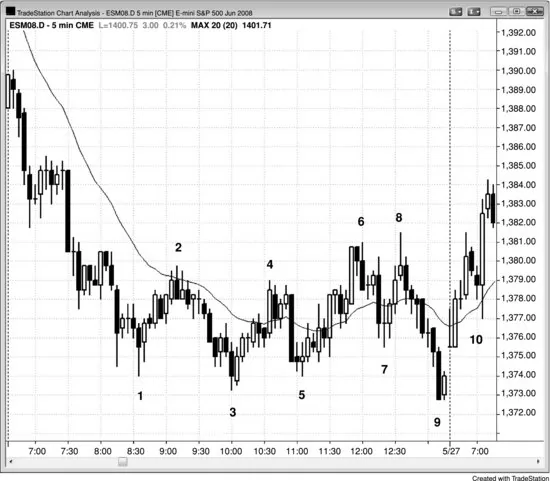
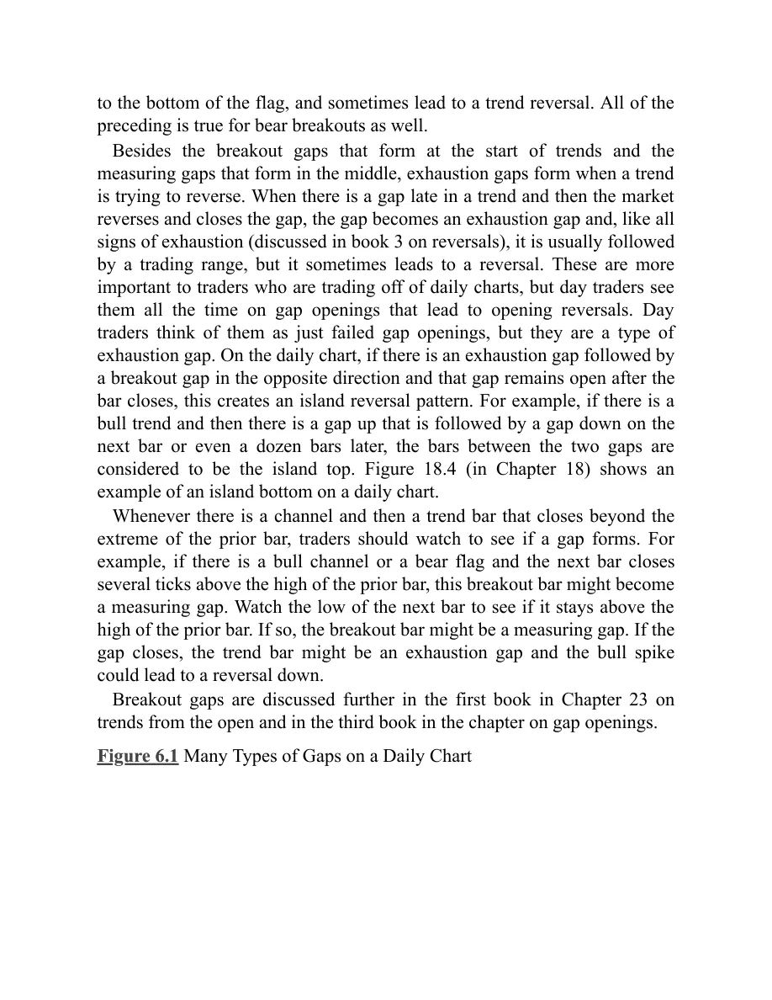
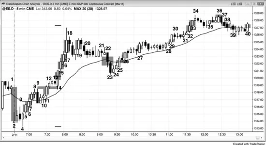
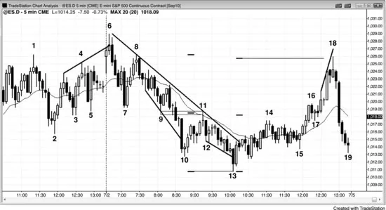
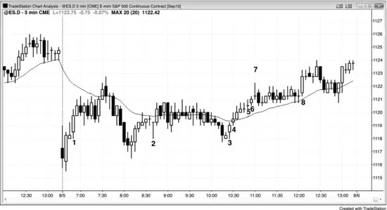

## Chapter 6: Gaps

<!-- Source PDF pages 159–179 -->

<!-- PDF page 159 -->

Chapter 6
Gaps
A gap is simply space between two prices. On daily, weekly, and monthly
charts, traditional gaps are easy to spot. For example, if the market is in a
bull trend and today's low is above the high of yesterday, then today gapped
up. These traditional gaps are called breakaway or breakout gaps when they
form at the start of a trend, measuring gaps when they are in the middle of a
trend, and exhaustion gaps when they form at the end of a trend. When a
gap forms at other times, like within the spike phase of a trend or within a
trading range, it is simply called a gap. Traders usually cannot classify a
gap until after they see what the market does next. For example, if the
market is breaking out of the top of a trading range on the daily chart and
the breakout bar is a large bull trend bar with a low above the high of the
prior bar, traders will see the gap as a sign of strength and will think of it as
a potential breakaway gap. If the new bull trend continues for dozens of
bars, they will look back at the gap and definitively call it a breakaway gap.
If instead the market reverses down into a bear trend within a few bars, they
will call it an exhaustion gap.
If the bull trend goes for five or 10 bars or so and gaps again, traders will
think that this second gap might become the middle of the bull trend. They
will see it as a possible measuring gap, and many traders will look to take
profits on their longs once the market makes a measured move up. The
measured move is based on the height from the bottom of the bull trend to
the middle of the gap, and this height is added to the middle of the gap. This
type of gap usually is in the spike phase of a trend, and it gives traders
confidence to enter at the market or on small pullbacks because they believe
that the market will work its way toward a measured move target.
After the bull trend has gone on for dozens of bars, reaches a resistance
area, and is beginning to show signs of a possible reversal, traders will pay
attention to the next gap up, if there is one. If one forms, they will see it as a

<!-- PDF page 160 -->

potential exhaustion gap. If, before going much higher, the market trades
back down to below the high of the bar before the gap, traders will see that
as a sign of weakness and will think that the gap might represent
exhaustion, which is a type of buy climax. They will often not look to buy
again until after the market has corrected for at least 10 bars and two legs.
Sometimes an exhaustion gap forms before a trend reversal, and because of
that, whenever there is a possible exhaustion gap, traders will look at the
overall price action to see if the trader's equation warrants a short position.
If there is a reversal, the trend bar that creates it is then a breakout gap (a
bar can function like a gap) and a possible start of a trend in the opposite
direction.
Because all trend bars are gaps, traders can see intraday equivalents of the
traditional gaps that are so common on daily charts. If there is a bull trend
that is at a resistance area and is likely to reverse down (reversals are
discussed in book 3), but has one final breakout, that bull trend bar might
become an exhaustion gap. The bar is sometimes a very large bull trend bar
that closes near its high, and occasionally the final breakout will be made of
two very large bull trend bars. This is a potential buy climax, and it alerts
astute traders to sell. The bulls sell to grab profits, since they believe that
the market will likely trade down for a couple of legs and about 10 bars,
possibly allowing them to buy again much lower. They also are aware of
the possibility of an exhaustive buy climax and trend reversal, and do not
want to risk giving back any of their profits. Aggressive bears are aware of
this as well, and they will sell to initiate shorts. If a strong bear trend bar
forms within the next few bars and the always-in direction flips to down,
that final bull trend bar becomes a confirmed exhaustion gap, and the bear
trend bar becomes a breakout gap. The bull trend bar followed by the bear
trend bar is a climactic reversal, and a two-bar reversal. If there are one or
more bars between the two trend bars, those bars form an island top. The
bottom of that island top is the top of the bear breakout gap and, like all
gaps, might get tested. If it does and the market turns down again, that
breakout test forms a lower high. If the initial reversal down was strong,
both bulls and bears will sell as the market tests the island top and as the
market turns down again, since both are more confident that the market will
fall for about 10 or more bars. The bulls will sell to lock in profits or to

<!-- PDF page 161 -->

minimize losses, if they bought higher as the bull trend breakout bars were
forming. The bears will sell to initiate shorts. Once the market trades down
for many bars, profit takers (bears buying back their shorts) will come in
and create a pullback or a trading range. If the market again has a bear trend
bar that breaks below the trading range, that bar is then a possible
measuring gap, and traders will try to hold onto part of their shorts until the
market approaches that target.
As the market turns down, traders will look at the strength of the bear
bars. If there are one or two large bear trend bars closing near their lows,
traders will assume that the always-in direction might be flipping to short.
They will watch the next few bars to see if a high 1 buy signal bar develops.
If one forms and it is weak (relative to the selloff), like a small bull doji or a
bear bar, more traders will look to short above its high than to buy.
Remember, this is a high 1 pullback in what has been a bull trend, but now
traders are looking for about 10 bars sideways to down, so more will look to
short above the high 1 buy signal bar than to buy. If they are right, the high
1 buy signal will fail and form a lower high. If the reversal down is strong,
traders will also short below the lower high and below the high 1 buy signal
bar. If the market goes more sideways to down and then forms a high 2 buy
setup, the bears will assume that it, too, will fail, and will place limit orders
at and above its high to go short. Other bears will place stop orders to go
short below the high 2 buy signal bar, because that is where the bulls who
bought the high 2 will have their protective stops. Once these bulls get
stopped out, they will likely not look to buy again for at least a couple of
bars, and the absence of bulls and the presence of bears can lead to a bear
breakout. If it is weak, the bulls might be able to create a wedge bull flag (a
high 3 buy setup). If the breakout is strong, the move down will likely go
for at least a couple of small legs, and reach a measured move, based on the
height of the trading range (the bull high to the bottom of the high 2 bull
signal bar). The breakout bar then becomes a measuring gap. If the bulls are
successful in turning the market up at the high 3 (a wedge bull flag), then
the bear measuring gap will close and become an exhaustion gap.
This process happens many times a day on every chart, and traders are
always asking themselves whether a breakout will likely succeed (and turn
the breakout bar into a measuring gap), or will it more likely fail (and turn

<!-- PDF page 162 -->

the trend bar that formed the breakout into an exhaustion gap). The labels
are not important, but the implications are. This is the single most important
decision that traders make, and they make it whenever they consider any
trade: Will there be more buyers or sellers above and below the prior bar?
Whenever they believe that there is an imbalance, they have an edge. In the
case of that bull breakout, when there finally is a signal bar for a failed
breakout, traders will decide if there will be more buyers or sellers below
that bar. If they think that the breakout is strong, they will assume that there
will be more buyers, and they will buy below the bar. Others will wait to
see if the next bar only falls for a few ticks. If so, they will place stop orders
to buy above it, and they will consider it to be a breakout pullback buy
setup. The gap will then likely become a measuring gap. The bears will see
that signal bar for the failed breakout as a strong sell signal, and they will
short below its low. If they are right, the market will sell off, and close the
bull gap (turning it into an exhaustion gap), and soon move below the low
of the bull breakout bar, and they hope that it will continue much lower.
“All gaps will get filled” is a saying that you sometimes hear, but this
saying only rarely helps traders. The market is always coming back to test
prior prices, so the saying would be more precise if it were “all prior prices
get tested.” However, enough traders pay attention to gaps so that they act
as magnets, especially when the pullback gets close to them. The closer the
market gets to any magnet, the stronger the magnetic field and the more
likely the market will reach the magnet (this is the basis for buy and sell
vacuums). For example, if there is a gap up in a bull trend, once there is
finally a correction or a reversal, the market might be only slightly more
likely to go below the high of the bar before the gap (and therefore fill the
gap) than it is to go below the high of any other bar in the rally. However,
since gaps are magnets, traders can look for trading opportunities as the
market approaches them, just as they should as the market approaches any
magnet.
Gaps where the low of a bar is above the high of the prior bar, or where
the high of a bar is below the low of the prior bar, are rare on an intraday
chart of a highly liquid instrument, except on the first bar of the day, when
they are common. However, if one uses a broad definition, gaps of other
types occur many times every day on a 5 minute chart, and they can be

<!-- PDF page 163 -->

useful in understanding what the market is doing and in setting up trades.
Occasionally, the open of a bar on a 5 minute chart will be above the close
of the prior bar, and this is often a subtle indication of strength. For
example, if there are two or three of these gaps on consecutive bull trend
bars, the bulls are likely strong. All of these gaps have the same
significance on daily, weekly, and monthly charts as well.
Because gaps are important elements of price action, intraday traders
should use a broad definition of a gap and look at trend bars as an intraday
equivalents because they are functionally identical. If the volume was thin
enough, there would be actual gaps on every intraday chart whenever there
was a series of trend bars. Remember, all trend bars are spikes, breakouts,
and climaxes, and a breakout is a variant of a gap. When there is a large gap
up on the first bar of the day on the Emini, there will be a large bull trend
bar on the Standard & Poor's (S&P) 500 cash index. That is an example of
how a gap and a trend bar represent the same behavior. When there is a
large trend bar at the start of a trend, it creates a breakout gap. For example,
if the market is reversing up from a low or breaking out of a trading range,
the high of the bar before the trend bar and the low of the bar after it create
the breakout gap. You can simply think of the entire trend bar's body as the
gap as well, and there may be other recent swing highs that some traders
will consider as the bottom of the gap. There is often not a single choice,
but that does not matter. What does matter is that there is a breakout, which
means that there is a gap, even though a traditional gap is not visible on the
chart. The market will often dip a tick or two below the high of the bar
before the trend bar, and traders will still think that the breakout is in effect
as long as the pullback does not fall below the low of the trend bar. In
general, if the market falls more than a couple of ticks below the high of the
bar before it, traders will lose confidence in the breakout and there might
not be much follow-through, even if there is no reversal.
Whenever there is a trend bar in a potential bull breakout, always look at
the high of the bar before it and the low of the bar after it. If they do not
overlap, the space between them might function as a measuring gap. If the
trend continues up, look for profit taking at the measured move (based on
the low of the bull leg to the middle of the gap). Sometimes the bottom of
the gap will be a swing high that formed several bars earlier, or a high

<!-- PDF page 164 -->

within the spike, but a couple of bars before the trend bar. The low of the
gap might be a swing low that forms many bars after the breakout bar. The
same is true of a bear trend bar that is breaking out in a bear leg. Always
look for potential measuring gaps, the most obvious one being the one
between the low of the bar before the bear trend bar and the high of the bar
after it.
If the bull trend has been going on for 5 to 10 or more bars and then there
is another bull trend bar, it might become just an unremarkable gap, a
measuring gap, or an exhaustion gap. Traders will not know until they see
the next several bars. If there is another strong bull trend bar, the odds of a
measuring gap are greater and bulls will continue to buy with the
expectation of the rally continuing up for about a measured move, based on
the middle of the gap.
Another common gap is between the high or low of a bar and the moving
average. In trends, these can set up good swing trades that test the extreme
of the trend, and in trading ranges, they often set up scalps to the moving
average. For example, if there is a strong bear trend and the market finally
rallies above the moving average, the first bar in that rally that has a low
above the moving average is a first moving average gap bar. Traders will
place a sell stop order at one tick below the low of that bar to go short,
looking for a test of the bear market low. If the stop is not triggered, they
will keep moving the stop up to one tick below the low of the bar that just
closed until their short is filled. Sometimes they will get stopped out by the
market moving above the signal bar, and if that happens, they will try one
more time to reenter their shorts at one tick below the low of the prior bar.
Once filled, the signal bar is a second moving average gap bar short signal.
Moving average gaps happen many times a day every day, and most of
the time they occur in the absence of a strong trend. If traders are selective,
many of these gap bars can set up fades to the moving average. For
example, assume that the day is a trading range day and that the market has
been above the moving average for an hour or so. If it then sells off to
below the moving average but is followed by a strong bull reversal bar with
a high that is below the moving average, traders will often go long above
that bar if there enough room between the high of that bar and the moving
average for a long scalp.

<!-- PDF page 165 -->

Breakouts on all time frames, including intraday and daily charts, often
form breakout gaps and measuring gaps that are different from the
traditional versions. The space between the breakout point and the first
pause or pullback after the breakout is a gap, and if it appears early in a
possible strong trend, it is a breakaway gap and is a sign of strength.
Although it will lead to a measured move from the start of the leg, the target
is usually too close for traders to take profits and they should therefore
ignore the measured move projection. Instead, they should look at the gap
as only a sign of strength and not a tool to use to create a target for taking
profits. For example, if the average daily range in the Emini has been about
12 points and after about an hour into the day the range is only three points,
the gap formed by a breakout would lead to a target that would result in a
range for the day of only six points. If a trend is just beginning, it is more
likely that the range will reach about the average of 12 points and not just
six points, and therefore traders should not be taking profits at the measured
move target.
When the distance from the start of the leg to the breakout gap
(breakaway gap) is about a third to a half of an average daily range, its
middle often leads to a measured move projection where traders might take
profits or even reverse their positions. For example, if the market is in a
trading range and then the market forms a large bull trend bar that breaks
out above the trading range, the swing high at the top of the range is the
breakout point. If the market moves sideways or up on the next bar, the low
of that bar is the first price to consider as the breakout test; the midpoint
between its low and the breakout point often becomes the middle of the bull
leg, and the gap is a measuring gap. If the range is about a third to a half of
the recent average daily range, use the bottom of the leg as the starting point
for the measured move; measure the number of ticks between that low and
the middle of the measuring gap, and project that same number of ticks up
above that midpoint. Then look to see how the market behaves if it moves
up to a tick or so of the measured move. If within a few bars of the breakout
the market pulls back into the gap but then rallies, use that pullback low as
the breakout test, and then the measuring gap is between that low and the
breakout point. This is a sign of strength. Once the market rallies to the
measured move projection, many traders will take partial or total profits on

<!-- PDF page 166 -->

their longs. If the move up was weak, some traders might even place limit
orders to short at the measured move target, although only very experienced
traders should consider this.
Elliott Wave traders see most of these gaps as being formed by a small
wave 4 pullback that is staying above the high of wave 1, and expect a
wave 5 to follow. Not enough volume is being traded based on Elliott Wave
Theory to make this a significant component of the price action, but
whenever a pullback does not fall below the breakout point, all traders see
this as a sign of strength and expect a test of the trend high. The pullback is
a breakout test.
If the pullback falls a little below the breakout point, this is a sign of a
lack of strength. You can still use the middle between that low and the
breakout point even though the pullback is below the breakout. When that
happens, I refer to this type of gap as a negative gap, since the mathematical
difference is a negative number. For example, in a bull breakout, if you
subtract the high of the breakout point from the low of the breakout test bar,
the result is a negative number. Negative measuring gaps lead to projections
that are less reliable, but still can be very accurate and therefore are worth
watching. Incidentally, stairs patterns have negative gaps after each new
breakout.
Small measuring gaps can also form around any trend bar. These micro
measuring gaps occur if the bar before and the bar after the trend bar do not
overlap and, like any gap, can lead to a measured move. The measured
move will usually be more accurate if the trend bar was acting as a
breakout. For example, look at any strong bull trend bar in any bull leg
where the trend bar is breaking into a strong bull leg. If the low of the bar
after it is at or above the high of the bar before it, the space between is a gap
and it can be a measuring gap. Measure from the start of the leg to the
middle of the gap, and project up to see how high the market would have to
go if the gap was in the middle of the leg. This is an area where longs might
take profits. If there are other reasons to short up there, bears will short
there as well. When these micro gaps occur in the first several bars of a
trend, the market will usually extend much further than a measured move
based on the gap. Don't use the gap to find an area in which to take profits,
because the market will likely go much further and you don't want to exit

<!-- PDF page 167 -->

early in a great swing. However, these gaps are still important in the early
stages of a trend because they give trend traders more confidence in the
strength of the trend.
Breakouts occur many times every day, but most of them fail and the
market reverses. However, when they succeed, they offer a potential reward
that can be several times as large as the risk with an acceptable probability
of success. Once a trader learns how to determine if a breakout is likely to
be successful, these trades should be considered. There are other examples
of measuring gaps in Chapter 8 on measured moves.
Using this broad definition of a gap allows traders to discover many
trading opportunities. A very common type of gap occurs in any three
consecutive trending bars on any chart. For example, if these three bars are
trending up and the low of bar 3 is at or above the high of bar 1, there is a
gap and it can act as a measuring gap or a breakaway gap. The high of bar 1
is the breakout point and it is tested by the low of bar 3, which becomes the
breakout test. On a smaller time frame chart, you can see the swing high at
the top of bar 1 and the swing low at the bottom of bar 3. It is easy to
overlook this setup, but if you study charts you will see that these gaps
often get tested within the next many bars but not filled, and therefore
become evidence that the buyers are strong.
A related gap occurs after the market has been trending for many bars but
now has an unusually large trend bar. For example, if the market has been
going up for the past couple of hours but now suddenly forms a very large
bull trend bar with a close near its high, especially if the high of this bar or
that of one of the next couple of bars extends above a trend channel line,
one or more important gaps with one or more breakout points and breakout
tests are created. Rarely, this bar is the start of a new, even steeper bull
trend, but much more commonly it represents a buy climax in an overdone,
exhausted bull trend and will be followed within a few bars by a sideways
to down correction that could last about 10 bars or so, and may even
become a trend reversal. Experienced traders wait for these bars, and their
waiting removes sellers from the market and creates a buy vacuum that
sucks the market up quickly. Once they see it, the bulls take profits and the
bears short on the close of the bar, above the bar, on the close of the next
bar or two if they are weak, or on a stop below those bars. Look at the bars

<!-- PDF page 168 -->

before and after the buy climax bar. The first gap to consider is that between
the low of the bar after it and the high of the bar before it. If the market
continues to go up for a few bars and then pulls back and rallies again, the
breakout test is now the low of that pullback. If the market trades down
below the high of the bar before the buy climax bar, the gap is then closed
(filled). If the market continues down into a large leg down, the gap
becomes an exhaustion gap.
Also, look at the bars before the bull breakout for other possible breakout
points. These usually are swing highs and there might be several to
consider. For example, there might have been a small swing high a few bars
earlier but another couple of higher swing highs that formed even a couple
of hours earlier. If the breakout bar broke strongly above all of them, they
are all possible breakout points that could lead to a measured move up and
you might have to consider the projections up from the midpoint of each of
these gaps. If there is a confluence of resistance at one of the projections,
like a trend channel line, a higher time frame bear trend line, or a couple of
other measured move targets based on other calculations, like the height of
the trading range, profit takers will come in at that level and there will also
be some shorts. Some of the shorts will be scalping, but others will be
establishing swings and will add on higher.
There is a widely held belief that most gaps get filled or at least the
breakout point gets tested, and this is true. Whenever something is likely to
happen, there is a trading opportunity. When there is a bear spike and
channel, the market often corrects back up to the top of the channel, which
is the bottom of the gap, and tries to form a double top for a test down.
When there is a buy climax bar that breaks out above a significant swing
high, there will usually be a pullback that tests that swing high, so traders
should look for short setups that could lead to the test. However, do not be
too eager, and make sure that the setup makes sense and that there is other
evidence that the pullback is likely to be imminent. This might be a
sideways bull flag that breaks out and runs for a couple bars and then has a
strong reversal bar, turning that bull flag into a possible final flag. Final
flags usually are followed by at least a two-legged correction that tests the
bottom of the flag; they often drop for a measured move down from the top

<!-- PDF page 169 -->

to the bottom of the flag, and sometimes lead to a trend reversal. All of the
preceding is true for bear breakouts as well.
Besides the breakout gaps that form at the start of trends and the
measuring gaps that form in the middle, exhaustion gaps form when a trend
is trying to reverse. When there is a gap late in a trend and then the market
reverses and closes the gap, the gap becomes an exhaustion gap and, like all
signs of exhaustion (discussed in book 3 on reversals), it is usually followed
by a trading range, but it sometimes leads to a reversal. These are more
important to traders who are trading off of daily charts, but day traders see
them all the time on gap openings that lead to opening reversals. Day
traders think of them as just failed gap openings, but they are a type of
exhaustion gap. On the daily chart, if there is an exhaustion gap followed by
a breakout gap in the opposite direction and that gap remains open after the
bar closes, this creates an island reversal pattern. For example, if there is a
bull trend and then there is a gap up that is followed by a gap down on the
next bar or even a dozen bars later, the bars between the two gaps are
considered to be the island top. Figure 18.4 (in Chapter 18) shows an

example of an island bottom on a daily chart.
Whenever there is a channel and then a trend bar that closes beyond the
extreme of the prior bar, traders should watch to see if a gap forms. For
example, if there is a bull channel or a bear flag and the next bar closes
several ticks above the high of the prior bar, this breakout bar might become
a measuring gap. Watch the low of the next bar to see if it stays above the
high of the prior bar. If so, the breakout bar might be a measuring gap. If the
gap closes, the trend bar might be an exhaustion gap and the bull spike
could lead to a reversal down.
Breakout gaps are discussed further in the first book in Chapter 23 on
trends from the open and in the third book in the chapter on gap openings.
Figure 6.1 Many Types of Gaps on a Daily Chart

<!-- PDF page 170 -->

Traditional gaps on a daily chart are classified as breakout gaps (breakaway
gaps), measuring gaps, exhaustion gaps, and just ordinary gaps. For the
most part, the classification is not important, and a gap that appears as one
type initially can be seen as a different type later on. For example, gap 5 on
the daily chart of AAPL shown in Figure 6.1 might have been a measuring
gap but ended up as an exhaustion gap. Also, when a market is in a strong
trend, it often has a series of gaps and any can become a measuring gap.
Traders need to be aware of each possibility. For example, gaps 4, 21, 25,
26, 27, and 45 were potential measuring gaps. Gap 4 was a measuring gap,
and the bar 6 high was almost a perfect measured move. The bar 2 bottom
of the leg to the middle of the gap had about as many ticks as the middle of
the gap to the top of bar 6, where profit takers came in, as did new strong
bears. Profit taking came in just below the targets based on gaps 26 and 45.
Breakout gaps often flip the always-in direction and therefore are an
important sign of strength. Most traders would classify the following as
breakout gaps: gaps 3, 7, 11, 15, 18, 29, 32, 36, 44, and 47. When there is a
breakout and a gap, look at the gap as a sign of strength and not as a tool to
create a measured move target. When a trend is just beginning, it is a
mistake to take profits too early. Do not use a reasonable candidate for a
breakout gap as a measuring gap.
The rally to bar 22 broke out above the bar 6 high, and the pullbacks to
bars 23 and 24 were breakout tests. The space between the bar 24 low,
where the market turned up again, and the bar 6 high is the breakout gap.

<!-- PDF page 171 -->

Here, because the bar 24 low was below the bar 6 high, the breakout gap
was negative. Since it was a breakout from a large trading range, it had a
good chance of also being a measuring gap.
Some experienced traders would have faded the breakout and shorted
below bar 22, looking for a test of the breakout point and a quick scalp
down. The bulls were looking for the same thing and were ready to eagerly
buy at the market or on limit orders when the pullback tested into the gap.
The bulls originally bought the breakout in the move up to bar 22, and their
eagerness to buy again at the same price enabled the new bull trend to
resume and go for at least some kind of measured move up (for example, it
might have been based on the height of the pullback from the bar 22 high to
the bar 23 low).
After a trend has gone on for a while, traders will begin to look for a
deeper pullback. A gap often appears before the correction, and that gap is
an exhaustion gap, like gaps 5, 16, 27, 33, and 45.
When a gap occurs as part of a series in a spike or within a trading range,
it is usually not classified and most traders refer to it simply as a gap, like
gaps 19, 20, 37, and 38.
Figure 6.2 Trend Bars Are the Same as Gaps

Traditional gaps on intraday charts can usually be seen on 5 minute charts
only if the volume is extremely light. Figure 6.2 shows two related
exchange-traded funds (ETFs). The FAS on the left traded 16 million shares

<!-- PDF page 172 -->

today, and the RKH on the right traded only 98,000 shares. All of the gaps
on the RKH chart were trend bars on the FAS chart, and many of the large
trend bars on the FAS chart were gaps on the RKH chart, demonstrating that
a trend bar is a variant of a gap.
Figure 6.3 Trend Bars Are Gaps

Intraday charts have their own versions of gaps. Every trend bar is a spike,
a breakout, and a climax, and since every breakout is a variant of a gap,
every trend bar is a type of gap. Gaps on the open are common on most 5
minute charts. In Figure 6.3, bar 2 gapped beneath the low of the final bar
of yesterday, creating an opening gap.
The market reversed up on bar 5, and at the time of the reversal, the odds
of it being the start of a bull trend were good, given the strong bottom.
Because it was the start of a bull trend, it was a breakout gap. Some traders
saw its body as the gap, and others thought that the gap was the space
between the high of bar 4 and the low of bar 6.
Bar 6 and bar 7 were also trend bars and therefore also gaps. It is common
for trends to have gaps along the way and are a sign of strength.
Bar 11 was a breakout of the bull flag from bar 9 to bar 10 and a breakout
above the opening range. Since the opening range was about half of the size
of an average daily range, traders were looking for a doubling of the range,
and that made bar 11 a likely measuring gap as well as a breakout gap.

<!-- PDF page 173 -->

The market hesitated for three bars between bar 12 and bar 13, in the area
of yesterday's high, going into the close. Some traders saw this as the top of
today's opening range. Bar 13 was a bear reversal bar, and since the market
might have traded below it, the bears saw it as a signal bar for a failed
breakout (of both the bar 9 high and the high of yesterday's close). Since the
breakout was so strong, far more traders assumed that the failed breakout
sell signal would not succeed, and therefore placed limit orders to buy at
and below its low. Those aggressive bulls were able to turn the market up
quickly on bar 14. The low of 14 then formed the top of the measuring gap,
and the high of bar 9 was the bottom. Since bar 14 was an outside up bar, it
was a breakout pullback buy entry that triggered the buy as the market went
above the high of the prior bar (bar 13). The bull trend went far beyond the
measured move target. Had the bears succeeded in reversing the market
down, bar 11 would have become an exhaustion gap instead of a measuring
gap. As long as the pullback did not fall more than a tick or so below the
bar 9 high, traders would have still looked at the gap as a measuring gap,
and they would have considered taking partial profits at the measured move
target (the market raced up so sharply that many would not have exited at
the target). If the market fell further, traders would not have trusted any
measured move up based on the bar 11 gap, and instead would have looked
for other ways to calculate measured move targets. At that point, referring
to bar 11 as either a measuring or exhaustion gap would have been
meaningless, and traders would no longer have thought of it in those terms.
As long as the selloff did not fall below the bar 10 high, the bulls would
have considered the breakout to be successful. If it fell below the high of
bar 10, or the low of bar 10, traders would have then saw the market as in a
trading range, or possibly even a bear trend, if the selloff was strong. Bar 14
was a breakout test of the bar 11 gap. It missed the bar 9 breakout point by a
tick and turned back up. By not letting the market fall below the bar 9 high
or the bar 12 low, the bulls were showing their strength.
The market broke out again on bar 15, which meant that bar 15 was a
breakout gap and a potential measuring gap. Some traders would have used
the height of the opening range for the measured move (the bar 4 low to the
bar 13 high), and others would have used the middle of the gap between the
bar 13 breakout point and the bar 15 pullback.

<!-- PDF page 174 -->

Bars 15 and 16 were also gaps in a bull trend, and therefore signs of
strength.
Bar 17 was an especially large bull trend bar in a trend that had gone on
for 10 or 20 bars, and therefore it was likely to function as an exhaustion
type of trend bar and a possible exhaustion gap. Buy climaxes sometimes
lead to reversals but more often just lead to corrections that last about 10
bars and often have two legs.
Bar 19 was another potential breakout gap, since it was the breakout
above a small bull flag, but after a buy climax, more of a correction was
likely.
Bar 20 was an attempt at a bear breakout gap, but the body was too small;
the bar did not break below the bottom of the developing trading range (the
low of the bar before bar 19).
Bar 22 was a breakout gap, and the bears hoped that it would lead to a
measured move down (and therefore become a measuring gap). It had a
large bear body and it broke below a five-bar ledge and the bottom of the
trading range. However, in a strong bull trend, it could simply have been
part of a test of the moving average, and it might simply have been due to a
sell vacuum, with strong bulls and bears just waiting for slightly lower
prices. The bulls were waiting to buy to initiate new longs, and the bears
were waiting to take profits on their shorts.
Bar 23 extended the breakout, but there was no follow-through, and like
most reversal attempts and most bear breakout attempts in bull trends, it
failed. Most traders wanted to see one more bear trend bar before they
would have considered the market as having flipped to always-in short.
This is a common situation, which is why aggressive bulls buy the closes of
bars like 23, expecting that the bears would be unable to flip the market to
short. This allows those bulls to get long near the very bottom of the
correction.
Bar 24 was a bull moving average gap bar and a signal bar for the end of
two legs down from the bar 17 buy climax. Although bar 22 could be
considered to be an exhaustion gap, since it was the end of a small bear
trend, most traders still saw the market as always-in long and the trend as
still up, so there was no significant bear trend to exhaust. This was a

<!-- PDF page 175 -->

pullback in a bull trend and not a new bear trend. Bar 22 was therefore just
a failed breakout.
Bar 25 was another breakout, since the market was reversing up from a
pullback in a bull trend and therefore breaking above a bull flag (the bull
inside bar after bar 23 was the signal bar for the bull flag entry). Bar 25 was
a potential bear flag after the bear spike down to bar 23. Once bar 25 closed
well above the bar 24 high, the bears probably gave up on their premise that
a second leg down would follow. That close created the possibility that bar
25 was a measuring gap, which it was once bar 26 turned the market up
again after a one-bar pause. The rally went well above the measured move
target and 25 became a breakaway gap.
Some traders still wondered whether a bear channel might be underway,
but when bar 26 went above the bear trend bar before it and above the top
of bar 22 (the bear breakout gap), the bear theory was untenable for most
traders.
Bars 27, 29, 32, and 40 were also bull breakout gaps.
Bar 36 was a breakout gap but the next bar reversed down. Some traders
then saw bar 36 as an exhaustion gap and a possible end of the rally and the
start of either a trading range or a larger correction.
Bars 37, 38, and 39 were bear gaps and signs of strength on the part of the
bears (selling pressure).
Figure 6.4 Intraday Gaps

<!-- PDF page 176 -->

This 5 minute Emini chart in Figure 6.4 illustrates a number of gaps. The
only traditional gap occurred on the open when the low of the first bar of
the day gapped above the high of the final bar of yesterday. However, since
the first bar did not gap above the high of yesterday, there was no gap on
the daily chart.
The market trended down to bar 13 and then rallied above the moving
average, breaking the bear trend line. Notice how the low of bar 14 is above
the moving average and it is the first such bar in over a couple of hours.
This is a moving average gap, and these gaps often lead to a test of the bear
low and then a two-legged move up, especially if the move up to the gap
bar breaks above the bear trend line as it did here. Here, it led to a higher
low trend reversal at bar 15 and then a second leg up to bar 18.
Bar 6 broke out above the highs of bars 1 and 4, which became breakout
points. The space between those highs and the low of bar 6 was a gap, and
it was filled on the bar after bar 6. Day traders think of this as simply a gap
up and an opening reversal down, but it is a form of an exhaustion gap.
The bear trend bar before bar 10 opened near its high, closed near its low,
and had a relatively large range. Since it formed after the market had
trended down for many bars, it was a sell climax where there was a last
gasp of selling with no one left who would be willing to sell until after a
pullback, which often has two legs. That breakout bar broke below many
swing lows (bars 2, 3, 5, 7, and 9), and bar 11 became the breakout test.
There was also a large gap between the bar 10 high and the moving
average, and that gap was filled by a two-legged move that formed a low 2
short setup.
The middle of the gap between the bar 9 breakout point and the bar 11
breakout test led to a measured move down from the bar 8 top of the
channel down to bar 9. The hash mark below and one bar to the right of the
bar 10 low is the projection down from the two higher hash marks. This gap
became a measuring gap. Instead of reversing up, as is common after a
reversal up from a trend channel line overshoot, the market broke to the
downside and the bottom was at the measured move to the tick. Since you
never know in advance which, if any, of the possible measured move targets
will work, it is good to draw all that you can see and look for a reversal at
any of them. These are reasonable areas to take profits on shorts. If there

<!-- PDF page 177 -->

are other reasons to initiate a long, the chance of a profitable reversal trade
increases if it occurs at a measured move. Here, for example, the market
broke below a trend channel line and the prior low of the day and reversed
up at an exact measured move.
Although the rally to bar 11 was close to the bars 7 and 9 breakout points,
the gap was not filled. That is a sign that the bears were strong, and it was
followed by a new bear low.
Bar 13 was another big bear bar after a protracted bear trend and therefore
a second sell climax. The next bar filled the gap below the bar 10 low.
Bar 14 was a second breakout test of the bars 7 and 9 double bottom,
which was the breakout point. However, instead of the market falling, it
went sideways to bar 15 and formed a wedge bull flag. This led to a rally
and a closure of the gap, and the breakout below bars 7 and 9 failed. The
day tried to become a reversal day, as trending trading range days
sometimes do, but the bull trend could not maintain control late in the day.
Bar 17 was a breakout pullback that tested the high of the bar 14 breakout
point and led to a strong rally that stopped two ticks above the measured
move from the bottom of bar 13 to the top of bar 11. The measured move
hash marks are just to the right of the bar 13, and the distance from the
bottom one to the middle one led to the projection up to the top one.
Bar 18 is another example of a large moving average gap, and the gap
was filled within a couple of bars.
There are many other minor gaps as well, like between the low of bar 6
and the high bar 8. Even though that high is at the same price as the low of
bar 6, it is a gap and it is the breakout test of the breakout below bar 6.
Similarly, the bar 15 reversal bar high was the breakout point for the
breakout test bar that occurred two bars later.
Note that the three bars with the largest bodies, bar 7, the bar before bar
10, and two bars before bar 18, all led to reversals. Remember, most
breakouts fail to go very far and usually reverse, at least into a pullback.
When a large trend bar occurs after a trend has been going for a while, it
usually represents capitulation or exhaustion. For example, that large bull
trend bar that formed two bars before bar 18 was in a very strong bull leg.
Shorts were desperate to get out and were worried that the market might go
much higher before a pullback would come and let them out at a lower

<!-- PDF page 178 -->

price. Other traders who were flat were panicking, afraid that they were
missing a huge trend into the close, so they were buying at the market, also
afraid that a pullback would not come. This intense buying was caused by
traders with tremendous urgency, and after they bought, the only traders left
who were willing to buy were traders who would only buy a pullback. With
no one left to buy at these high prices, the market could only go sideways or
down.
There were several micro measuring gaps. For example, the bear trend
bar after bar 6 set up one, as did the bull trend bar after bar 10 and the bull
trend bar after bar 15. All of the moves went beyond the measured move
targets.
The low of the bar after bar 6 and the high of the bar before bar 7 formed
a micro measuring gap, and the bar 7 low was an exact measured move
down. The trend bar in the middle was a breakout to a new low of the day
and a strong bear trend bar, closing on its low.
The bar after bar 15 broke out of a small wedge bull flag. The low of the
bar after it tested the high of bar 15, which was the breakout point. The test
was exact, and as long as the low of the breakout test does not fall more
than a tick or so below the breakout point, the test is a sign of strength. If
the breakout test fell more, it would be a sign that the breakout was not
strong and was more likely to fail. The space between the breakout point
and the breakout test is a micro gap. Since it is a breakout gap, it should be
used only as an indication of the strength of the breakout and not as a basis
for a measured move. Initial breakouts generally lead to big moves, and
traders should not be looking to take profits prematurely. Micro gaps are
often negative gaps, meaning that the low of the breakout test bar is a tick
or two below the low of the breakout point bar. Once the breakout bar
closes, an aggressive trader can place a limit order to buy one tick above the
high of the prior bar and risk just three ticks or so. The chance of success
might be only about 40 percent, but the reward is many times the risk, so
the trader's equation is very favorable.
Figure 6.5 Gap between the Open of a Bar and the Close of the Prior Bar

<!-- PDF page 179 -->

If the open of the bar is above or below the close of the prior bar, there is a
gap. Sometimes it can be entirely due to low volume (for example, when
there are many dojis), but other times it can signify strength. Seven of the
eight gaps in Figure 6.5 were bullish; only on bar 2 was the gap to the
downside. When there are two or more successive gaps in the same
direction and the bars have trending bodies, it is a sign of strength. In those
seven bull gaps, a large number of traders placed market orders on the close
of the bar and the orders got filled at the offer, indicating that the market
had to go up to find enough sellers to fill those orders. If sellers are only
willing to sell higher and bulls are willing to buy the offer, the market will
likely continue up, at least for a while.
Bar 1 set up a micro measuring gap with the high of the bar before it and
the low of the bar after it. The move up to the 7:35 a.m. PST swing high
was an exact measured move from the open of the second bar of the day.
Measured moves often begin with the open of the first trend bar of a spike.
If the market goes above that target, then use the bottom of the spike to see
if the market begins to correct at that target.
The downside gap reversed up on the second bar and it was therefore an
exhaustion gap. Day traders would instead just think of it as a failed gap
down opening and an opening reversal up.
