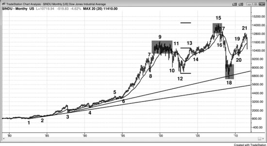
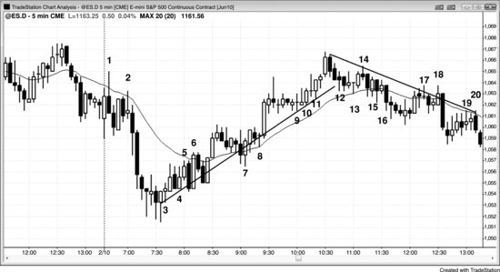

# Part II: Magnets: Support and Resistance

<!-- Source PDF pages 180–193 -->

<!-- PDF page 180 -->

Part II
Magnets: Support and Resistance
There are two types of magnets: support and resistance. When a magnet is
below the market, it is a support level, which means that it is an area where
bulls will initiate positions and bears will take profits on their shorts. When
a magnet is above the market, it is a resistance level, which means that it is
an area where bulls will take profits on their longs and bears will initiate
shorts. Support and resistance are magnets that draw the market toward
them. When you become aware of a magnet not too far from the current
price, trade only in the direction of the magnet until after it is reached. At
that point, you will have to decide if it looks like the market will reverse, go
sideways, or ignore the magnet and keep trending. Magnets tell you the
likely destination, but not the path, and there may be big pullbacks along
the way. Also, the market might be in a trading range for dozens of bars, but
within striking distance of a magnet. Although you should be aware of the
magnet, there still can be reliable trades in both directions as the market
decides if it will test the magnet and how it will get there.
Traders are constantly looking at support and resistance. The market has
inertia and a strong propensity to continue what it has been doing. When it
is trending, most attempts to reverse the trend will fail. For example, if the
market is trending down, most support levels will fail to hold or reverse the
market. However, all bull reversals happen at support levels (and all bear
reversals happen at resistance levels), so if the market begins to reverse up,
the potential reward is often many times larger than the risk. Even though
the probability of success is often only 40 percent, the trader's equation is
still positive and the reversal trade is therefore mathematically sound.
Inertia also means that when the market is in a trading range, most attempts
to break out will fail, and the market will repeatedly reverse up from the
support created by the bottom of the range, and reverse down from the
resistance at the top. Even though most attempts to reverse a trend will fail,

<!-- PDF page 181 -->

all trend reversals and all pullbacks begin at support and resistance levels,
so knowing where they are can lead traders to take profits and to enter
reversal trades at optimal locations.
Most Emini trading is done by computers, and their algorithms are based
on logic and numbers. When they buy a falling market or sell a rally, they
are doing so because they calculated that the particular price was a logical
location for them to place their trades. If enough algorithms are using
similar prices, the market can reverse, at least for a bar or two, and often
enough for a profitable trade. Although some algorithms use numbers that
are not directly based on the Emini price chart (for example, they might use
data based on the options markets or other related markets), unless many
programs are coming up with similar numbers, it is unlikely that there will
be enough force to change the direction of the market. When the market
reverses, it always does so at support and resistance levels; with practice, an
individual trader can usually spot them. Because some of these reversals
lead to profitable trades, and because these levels are sensible areas to take
profits, it is useful to know where possible turning points are.
One of the important reasons to look for magnets is that they are logical
areas to take partial or full profits. You should always be faster to take
profits on a trade than you should be to look for an entry in the opposite
direction. This means that you need a stronger setup to initiate a trade in the
opposite direction than you need to take profits. If the move toward the
magnet is weak and if it is against the direction of a larger trend, you can
also look to initiate a trade in the opposite direction, expecting a reversal.
The market will usually overshoot the magnet, at least by a small amount,
and if the move toward the magnet is not a strong trend, the market will
usually reverse, at least for a bar or two. If the trend resumes and goes even
further past the magnet and then reverses a second time, this is usually a
reliable setup for a trade in the opposite direction, especially if there is a
strong reversal bar.
Any significant type of price action can form support or resistance, and
common examples include:
Trend lines.
Trend channel lines.
Any type of moving average on any time frame.

<!-- PDF page 182 -->

Measured move targets.
Prior swing highs or lows.
Bull entry bar lows and bear entry bar highs.
Bull signal bar highs and bear signal bar lows.
Yesterday's high, low, open, and close.
The high, low, open, or close of any bar, especially if the bar is a
large trend bar.
Daily pivots.
Fibonacci retracement levels and projections.
Any type of band.
Support and resistance are terms created by traders to describe any price
as having enough of a mathematical edge for a trader to place a profitable
trade. These terms were created by traders to help them spot trades. The
high of every bar on every time frame is at some resistance level, the low of
every bar is at support, and the close is where it is and not one tick higher or
lower because computers put it there for a reason. The support and
resistance may not be obvious, but since computers control everything and
they use logic, everything has to make sense, even if it is often difficult to
understand. Every price on the chart has some mathematical edge, but the
edges are usually too small to be tradable except by high-frequency trading
(HFT) programs, many of which are designed to scalp for a penny of profit.
By definition, a price is support or resistance only if it has a directional
probability imbalance. For example, if a market falls to a level of support,
traders believe that there is about a 60 percent chance or better that there
will be at least a bounce big enough for a scalp, which is every trader's
minimal trade. If the chance was only 52 or 53 percent, traders would
probably not consider that high enough to use the term and instead would
just consider the price as unremarkable. If the market is in the middle of a
trading range, the low of the prior bar is always at least a minimal area of
support in the general sense of the word, but that does not mean the
expected bounce is big enough to place a profitable trade. If the expected
bounce is only a couple of ticks, it is not support from a trader's perspective.
If the current bar is still forming and it is on its low and is one tick above
the low of the prior bar, there might be a 53 percent chance of the market
bouncing two ticks before it falls two ticks. However, that is too small an

<!-- PDF page 183 -->

edge and too small a price movement for traders to place a trade (although a
high-frequency program might make that trade), and therefore traders
would not call it support. The opposite is true for resistance.
Support and resistance exist because the market has memory. Once the
market returns to a prior price, it will tend to do the same thing that it did
the last time it was there. For example, if the market falls through the
bottom of a trading range and then rallies back to the bottom of the range, it
will usually sell off again because that's what it did when it was last at that
price level. The traders who failed to exit their longs and rode through the
bear leg will be eager to get a second chance to exit them with a smaller
loss, and they will hold until the market rallies back and tests the breakout.
At that point, they will sell out of their longs and this will create selling
pressure. Also, the shorts who took profits at the bottom of the sell-off will
be eager to short again on the rally. The combined selling by the bears and
the liquidating bulls will create resistance to a further rally and usually
drive the market back down.
When the market falls back to a price and hits it several times and
bounces each time, it is finding support at that price level. If the market
rallies to a price level and keeps falling back, the area is resistance. Any
area of support or resistance acts as a magnet, drawing the market to the
price. As the market approaches, it enters the magnetic field, and the closer
it gets, the stronger the magnetic pull is. This increases the odds of the
market touching the price. That greater magnetic pull in part is generated by
the vacuum effect. For example, if the market is having a bear rally toward
a bear trend line but has not yet hit it, the sellers will often step aside and
wait for the test. If they believe the market will touch the line, it does not
make sense for them to sell just below the line when they can soon sell
higher. The absence of selling creates a buy imbalance and therefore a
vacuum effect that quickly sucks the market up. The result is often a bull
trend bar. Then, the bull scalpers sell out of their longs for a profit and the
bears sell to initiate new shorts. Since there was no clear bull reversal at the
low, most of the bulls bought for scalps, expecting only a pullback and then
a resumption of the bear trend.
Once the market gets to the target, traders think that the market will now
more likely go down far enough to place a profitable trade, and they appear

<!-- PDF page 184 -->

out of nowhere and short aggressively and relentlessly, driving the market
down. The weak bulls who bought at the top of that strong bull trend bar are
stunned that there is no follow-through, but they misunderstood the
significance of the bull trend bar. They thought that traders were suddenly
convinced that the market was going to break above the trend line and a
bull leg would begin. They were oblivious to the vacuum effect and did not
consider that the bears were just waiting for the market to get a little higher.
The strong bull trend bar was due to the bears briefly stepping aside rather
than the bears buying back their shorts. The bulls who kept buying needed
to find bears to take the other side of their trades and they could only find
them higher, where the bears thought the market would begin to reverse.
The market will continue down to an area of neutrality and usually beyond
to the point that the bulls now have a mathematical edge. This is because
the market never knows that it has gone far enough until it goes too far.
Then it trades up and down above the area of neutrality, which becomes
tighter and tighter as the bulls and bears are better able to define it. At some
point, both perceive that the value is wrong and the market then breaks out
again and begins a new search for value.
Every countertrend spike should be considered to be a vacuum effect
pullback. For example, if there is a sharp bear spike on the 5 minute chart
and then the market suddenly reverses into a bull leg, there was an area of
support at the low, whether or not you saw it in advance. The bulls stepped
aside until the market reached a level where they believed that value was
considerable, and the opportunity to buy at this great price would be brief.
They came in and bought aggressively. The smart bears were aware of that
magnet, and they used it as an opportunity to take profits on their shorts.
The result was a market bottom on the 5 minute chart. That bottom, like all
bottoms, occurred at some higher time frame support level, like a bull trend
line, a moving average, or a bear trend channel line at the bottom of a large
bull flag. It is important to remember that if the 5 minute reversal was
strong, you would buy based on that reversal, regardless of whether you
saw support there on the daily or 60 minute chart. Also, you would not buy
at that low, even if you saw the higher time frame support, unless there was
evidence on the 5 minute chart that it was forming a bottom. This means
that you do not need to be looking at lots of different charts in search of that

<!-- PDF page 185 -->

support level, because the reversal on the 5 minute chart tells you that it is
there. If you are able to follow multiple time frames, you will see support
and resistance levels before the market reaches them, and this can alert you
to look for a setup on the 5 minute chart when the market reaches the
magnet. However, if you simply follow the 5 minute chart carefully, it will
tell you all that you need to know.
In general, if the market tests an area of support four or five times, the
likelihood of breaking through that support increases and, at some point, the
breakout becomes more likely than not. If the buyers who lifted the market
at this level fail repeatedly to do so again, they will give up at some point
and be overwhelmed by sellers. For example, if the market is resting above
a flat moving average, traders will buy every touch of the moving average,
expecting a rally. If instead the market continues sideways and they don't
even get enough of a rally to allow for a profitable scalp, at some point they
will sell their longs, thereby creating selling pressure. They will also stop
buying touches of the moving average. This absence of buying will increase
the probability that the market will fall through the moving average. The
bulls have decided that the moving average was not enough of a discount
for them to buy aggressively, and they will do so only on a further discount.
If it does not find those buyers within 10 to 20 bars after falling below the
moving average, the market will usually either trend down or continue in a
trading range, but now below the moving average. Traders will begin
shorting rallies to the moving average, which will increase the chances that
the market will begin to form lower highs and that the moving average will
start to trend down. Once the market falls through support, it usually
becomes resistance; and once the market breaks above resistance, it usually
becomes support.
This can also happen with a trend line or a trend channel line. For
example, if a bull market pulls back to a trend line four or more times and it
does not rally far above the trend line, at some point the bulls will stop
buying tests of the trend line and they will begin to sell their longs, creating
selling pressure. This is added to the selling of the bears, and since the bulls
have stopped buying, the market will fall through the trend line. Sometimes,
however, the market will instead suddenly accelerate to the upside and the

<!-- PDF page 186 -->

bears will stop shorting every small bounce and instead will buy back their
shorts, driving the market higher.
Institutional trading is done by discretionary traders and computers, and
computer program trading has become increasingly important. Institutions
base their trading on fundamental or technical information, or a
combination of both, and both types of trading are done by traders and by
computers. In general, most of the discretionary traders base their decisions
primarily on fundamental information, and most of the computer trades are
based on technical data. Since the majority of the volume is now traded by
HFT firms, and most of the trades are based on price action and other
technical data, most of the program trading is technically based. In the late
twentieth century, a single institution running a large program could move
the market, and the program would create a micro channel, which traders
saw as a sign that a program was running. Now, most days have a dozen or
so micro channels in the Emini, and many have over 100,000 contracts
traded. With the Emini currently around 1200, that corresponds to $6
billion, and is larger than a single institution would trade for a single small
trade. This means that a single institution cannot move the market very far
or for very long, and that all movement on the chart is caused by many
institutions trading in the same direction at the same time. Also, HFT
computers analyze every tick and are constantly placing trades all day long.
When they detect a program, many will scalp in the direction of the
program, and they will often account for most of the volume while the
micro channel (program) is progressing.
The institutions that are trading largely on technical information cannot
move the market in one direction forever because at some point the market
will appear as offering value to the institutions trading on fundamentals. If
the technical institutions run the price up too high, fundamental institutions
and other technical institutions will see the market as being at a great price
to sell out of longs and to initiate shorts, and they will overwhelm the
bullish technical trading and drive the market down. When the technical
trading creates a bear trend, the market at some point will be clearly cheap
in the eyes of fundamental and other technical institutions. The buyers will
come in and overwhelm the technical institutions responsible for the selloff
and reverse the market up.

<!-- PDF page 187 -->

Trend reversals on all time frames always happen at support and
resistance levels, because technical traders and programs look for them as
areas where they should stop pressing their bets and begin to take profits,
and many will also begin to trade in the opposite direction. Since they are
all based on mathematics, computer algorithms, which generate 70 percent
of all trading volume and 80 percent of institutional volume, know where
they are. Also, institutional fundamental traders pay attention to obvious
technical factors. They see major support and resistance on the chart as
areas of value and will enter trades in the opposite direction when the
market gets there. The programs that trade on value will usually find it
around the same areas, because there is almost always significant value by
any measure around major support and resistance. Most of the programs
make decisions based on price, and there are no secrets. When there is an
important price, they all see it, no matter what logic they use. The
fundamental traders (people and machines) wait for value and commit
heavily when they detect it. They want to buy when they think that the
market is cheap and sell when they believe it is expensive. For example, if
the market is falling, but it's getting to a price level where the institutions
feel like it is getting cheap, they will appear out of nowhere and buy
aggressively. This is seen most dramatically and often during opening
reversals (the reversals can be up or down and are discussed in the section
on trading the open in book 3). The bears will buy back their shorts to take
profits and the bulls will buy to establish new longs. No one is good at
knowing when the market has gone far enough, but most experienced
traders and programs are usually fairly confident in their ability to know
when it has gone too far.
Because the institutions are waiting to buy until the market has become
clearly oversold, there is an absence of buyers in the area above a possible
bottom, and the market is able to accelerate down to the area where they are
confident that it is cheap. Some institutions rely on programs to determine
when to buy and others are discretionary. Once enough of them buy, the
market will usually turn up for at least a couple of legs and about 10 or
more bars on whatever time frame chart where this is happening. While it is
falling, institutions continue to short all the way down until they determine
that it has reached a likely target and it is unlikely to fall any further, at

<!-- PDF page 188 -->

which point they take profits. The more oversold the market becomes, the
more of the volume is technically based, because fundamental traders and
programs will not continue to short when they think that the market is cheap
and should soon be bought. The relative absence of buyers as the market
gets close to a major support level often leads to an acceleration of the
selling into the support, usually resulting in a sell vacuum that sucks the
market below the support in a climactic selloff, at which point the market
reverses up sharply. Most support levels will not stop a bear trend (and most
resistance levels will not stop a bull trend), but when the market finally
reverses up, it will be at an obvious major support level, like a long term
trend line. The bottom of the selloff and the reversal up is usually on very
heavy volume. As the market is falling, it has many rallies up to resistance
levels and selloffs down to support levels along the way, and each reversal
takes place when enough institutions determine that it has gone too far and
is offering value for a trade in the opposite direction. When enough
institutions act around the same level, a major reversal takes place.
There are fundamental and technical ways to determine support (and
resistance). For example, it can be estimated with calculations, like what the
S&P 500 price earnings multiple should theoretically be, but these
calculations are never sufficiently precise for enough institutions to agree.
However, traditional areas of support and resistance are easier to see and
therefore more likely to be noticed by many institutions, and they more
clearly define where the market should reverse. In the crashes of both 1987
and 2008–2009, the market collapsed down to slightly below the monthly
trend line and then reversed up, creating a major bottom. The market will
continue up, with many tests down, until it has gone too far, which is
always at a significant resistance level. Only then can the institutions be
confident that there is clear value in selling out of longs and selling into
shorts. The process then reverses down.
The fundamentals (the value in buying or selling) determine the overall
direction, but the technicals determine the actual turning points. The market
is always probing for value, which is an excess, and is always at support
and resistance levels. Reports and news items at any time can alter the
fundamentals (the perception of value) enough to make the market trend up
or down for minutes to several days. Major reversals lasting for months are

<!-- PDF page 189 -->

based on fundamentals and begin and end at support and resistance levels.
This is true of every market and every time frame.
It is important to realize that the news will report the fundamentals as still
bullish after the market has begun to turn down from a major top, and still
bearish after it has turned up from a major bottom. Just because the news
still sees the market as bullish or bearish does not mean that the institutions
do. Trade the charts and not the news. Price is truth and the market always
leads the news. In fact, the news is always the most bullish at market tops
and most bearish at market bottoms. The reporters get caught up in the
euphoria or despair and search for pundits who will explain why the trend is
so strong and will continue much longer. They will ignore the smartest
traders, and probably do not even know who they are. Those traders are
interested in making money, not news, and will not seek out the reporters.
When a reporter takes a cab to work and the driver tells him that he just
sold all of his stocks and mortgaged his house so that he could buy gold, the
reporter gets excited and can't wait to find a bullish pundit to put on the air
to confirm the reporter's profound insight in the gold bull market. “Just
think, the market is so strong that even my cabbie is buying gold! Everyone
will therefore sell all of their other assets and buy more, and the market will
have to race higher for many more months!” To me, when even the weakest
traders finally enter the market, there is no one left to buy. The market
needs a greater fool who is willing to buy higher so that you can sell out
with a profit. When there is no one left, the market can only go one way,
and it is the opposite of what the news is telling you. It is difficult to resist
the endless parade of persuasive professorial pundits on television who are
giving erudite arguments about how gold cannot go down and in fact will
double again over the next year. However, you have to realize that they are
there for their own self-aggrandizement and for entertainment. The network
needs the entertainment to attract viewers and advertising dollars. If you
want to know what the institutions are really doing, just look at the charts.
The institutions are too big to hide and if you understand how to read
charts, you will see what they are doing and where the market is heading,
and it is usually unrelated to anything that you see on television.
Most major tops do not come from climaxes made of huge bars and
volume, which are more common at major bottoms. More often, a top

<!-- PDF page 190 -->

comes from a trading range, like a double top or a head and shoulders top,
followed by a breakout in the form of a bear spike. However, tops can be
climactic, and bottoms can be trading ranges.
The chapters on trading ranges (further on) and channels (in book 1)
describe how to use support and resistance to place trades. For example,
traders will buy near the bottom of a channel or other type of trading range
and short near the top, and then take profits and reverse on the test of the
other side of the channel or trading range.
In a strong trend, the market extends beyond most magnets. For example,
in a bull trend, beginning traders will discover that the rally continues up far
beyond every measured move target and trend channel line that they draw.
These beginners will mistakenly be shorting at every perceived resistance
level, finding their losses growing all day long. They incorrectly keep
shorting tops that look great but are bad, and refuse to buy pullbacks that
look bad but are great. However, once there finally is a pullback or a
reversal, it will always occur at a resistance level. Even in strong trends,
measured move targets often work precisely to the tick. Obviously, this is in
part because computers can calculate them accurately. Computers control
the market and their profit taking has to be at some calculated level, which
is always at some magnet. Additionally, if a trade is minimally “good,”
meaning that the strategy is profitable, the reward has to be at least as large
as the risk to create a positive trader's equation. This usually results in some
profit taking once the reward reaches the size of the risk, because this is the
minimum level that the market has to reach to make the strategy profitable.
Minor swings often end precisely at measured move projections, and many
strong trends end exactly at, or within a tick, of a significant measured
move target, as the price gets vacuumed to the magnet.
Figure PII.1 Dow Jones Industrial Average Monthly Chart

<!-- PDF page 191 -->

The monthly chart of the Dow Jones Industrial Average (Figure PII.1)
shows several types of support and resistance (all are magnets).
Trend lines and trend channel lines are important support and resistance
areas. The bar 18 bottom of the 2009 crash reversed up from below a
monthly trend line drawn from the 1987 crash low to the October 1990
pullback. It also was at the trend channel line created by bars 8 and 12
(creating a dueling lines pattern, discussed in a later section). All major
reversals up from bear markets occur at support and all tops occur at
resistance, but most support and resistance do not stop trends. However, if
there is a strong reversal pattern and it forms at a support or resistance level,
institutions will take profits and many will even enter in the other direction.
Market bottoms more often come from sell climaxes, like the crashes of
1987 and 2009. Market tops more often come from trading ranges, like
around bars 9 and 15.
The bar 15 high was close to a measured move up based on the height of
the bar 12 to bar 13 bull spike.
The moving average repeatedly acted as support, like at bars 3, 4, 6, 8, 14,
and 20, and resistance, like at bars 11 and 17.
Trading ranges act as support and resistance. The breakout below the bar
9 trading range was resistance to the bar 11 rally, and the bar 15 trading
range was resistance to the bar 17 rally. Once the market rallied up to bar
15, bar 16 found support at the top of the bar 9 trading range.

<!-- PDF page 192 -->

Swing highs and lows act as support and resistance. Bar 12 found support
at the bar 8 low and formed a double bottom. Bar 13 formed a double top
with bar 11, but the market went sideways and soon broke above that
resistance.
Figure PII.2 Support Can Become Resistance, and Resistance Can Become

Support
Support became resistance and resistance became support in the 5 minute
Emini chart shown in Figure PII.2. This was true for both the moving
average and for trend lines.
Bars 1, 2, 5, 6, 17, 18, 19, and 20 found sellers on rallies to the moving
average, and bars 7, 8, 13, 15, and 16 found buyers on minor pullbacks to
the moving average.
Bars 12, 13, 15, and 16 were repeated tests of the moving average, and
the buyers were not getting rewarded and soon stopped buying the
pullbacks. The market then fell below the moving average and the bears
began to short small rallies up to the moving average, creating a series of
lower highs and lows.
The bull trend line was a best fit line drawn with the objective of having
as many bars as possible test it. Buyers were clearly buying in the area of
the trend line, and it was tested more than a dozen times without a sharp
rally away from the trend line. This lack of acceleration made the bulls
more cautious over time, and eventually they became unwilling to buy in

<!-- PDF page 193 -->

the area of the trend line. Once the market fell below the trend line, bulls
became even more hesitant to buy, and began to sell out of their longs, and
bears became more aggressive. Lower highs and lows formed and traders
began to draw bear trend lines where they shorted rallies.
Incidentally, any upward-sloping channel should be thought of as a bear
flag, even if it is part of a bull market, because eventually there will be a
break below the trend line and the market will behave as if the channel was
a bear flag for trading purposes. Likewise, any downward-sloping channel
should be thought of as a bull flag and its eventual breakout should be
traded as if a bull leg is underway.
