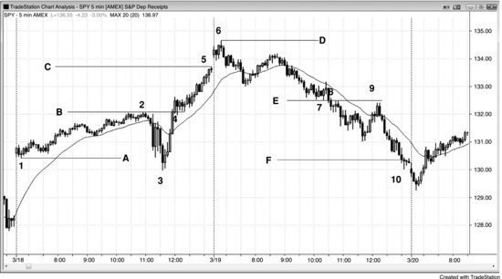
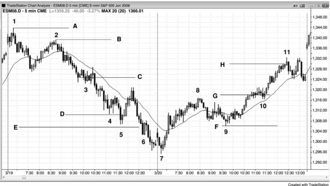
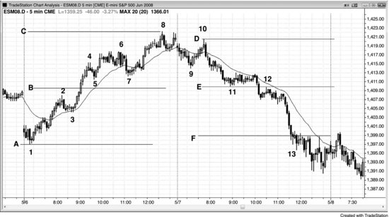

## Chapter 8: Measured Moves Based on Gaps and Trading Ranges

<!-- Source PDF pages 207–214 -->

<!-- PDF page 207 -->

Chapter 8
Measured Moves Based on Gaps and
Trading Ranges
Gaps are common on daily charts where the low of one bar is above the
high of the prior bar or the high of a bar is below the low of the prior bar. If
there is conviction about the direction of the market, the middle of the gap
often becomes the middle of the trend. As the market gets near the
measured move target, traders will look carefully at the exact target and
often take partial or total profits in that area, and some traders will begin to
take positions in the opposite direction. This often leads to a pause, a
pullback, or even a reversal.
When a breakout occurs on an intraday chart, only rarely will this kind of
gap appear. However, there is often something just as reliable, which is a
gap between the breakout point and the first pause or pullback. For
example, if the market breaks out above a swing high and the breakout bar
is a relatively large bull trend bar and the low of the next bar is above the
breakout point, then there is a gap between that low and the breakout point
and that often becomes a measuring gap. If the bar after the breakout is also
a large bull trend bar, then wait for the first small bull trend bar, bear trend
bar, or doji bar. Its low is then the top of the gap. If the breakout point or the
breakout pullback is unclear, the market will often just use the middle of the
breakout bar as the middle of the gap. In this case, the measured move is
based on the start of the rally to the middle of the breakout bar. The market
would then be expected to rally for about the same number of ticks above
that level.
If the market pulls back within a few bars of breaking out and the low of
the pullback is in the gap, then the gap is now smaller but its midpoint still
can be used to find a measured move target. If the market pulls back further,
even to a little below the gap, the midpoint between the breakout point and

<!-- PDF page 208 -->

that pullback can still be used for the projection. Since the difference
between the breakout pullback and the breakout point is then a negative
number, I call this a negative gap. Measured move projections are less
reliable when they are based on a negative gap.
On a Market Profile, these intraday measuring gaps where the market
moves quickly are thin areas between two distributions, and represent prices
where the market is one-sided. The distributions are “fat” areas and are
simply trading ranges where there is two-sided trading taking place. A
trading range is an area of agreement on price, and its middle is the middle
of what bulls and bears think is fair. A gap is also an area of agreement. It is
an area where the bulls and bears agree that no trading should take place,
and its middle is the midpoint of that area. In both cases, on a simplistic
level, if those prices are a midpoint of agreement between bulls and bears,
then they are a rough guide to the midpoint of the leg that contains them.
Once they form, swing part or all of your with-trend entries. As the target is
approached, consider countertrend entries if there is a good setup. Most
traders use the height of the prior trading range for measuring, which is fine
because the exact distance is only approximate no matter how you do it
(unless you are a Fibonacci or Elliott Wave trader and have the uncanny
ability to convince yourself that the market almost always creates perfect
patterns, despite the overwhelming evidence to the contrary). The key is to
trade only with the trend, but once the market is in the area of the measured
move, you can begin to look for countertrend entries. However, the best
countertrend trades only follow an earlier countertrend move that was
strong enough to break the trend line.
If the market pauses after the measured move is reached, the two strong
trend legs might be simply the end of a higher time frame correction, and if
that appears to be the case, then swing part of any countertrend entry. Two
legs often complete a move, and the move is usually followed by at least a
protracted countertrend move that has at least two legs, and it sometimes
becomes a new, opposite trend. The countertrend move will often test all
the way back to the breakout point.
Sometimes the projections are exact to the tick, but most of the time the
market undershoots or overshoots the target. This approach is only a
guideline to keep you trading on the correct side of the market.

<!-- PDF page 209 -->

Figure 8.1 Measuring Gap

The middle of a gap often leads to a measured move. In Figure 8.1, the
Emini had a gap up at bar 3, above the bar 2 high of the previous day, and
the middle of that gap was a possible middle of the move up. Traders
measured from the bar 1 bottom of the rally to the middle of the gap and
then projected that same number of points upward. Bar 4 came within a
couple of ticks of the projection, but many traders believe that a target in
the Emini has not been adequately tested unless the market comes to within
one tick of it. This gave traders confidence to buy the sharp sell-off on the
open of the next day down to bar 5. The high of the day was two ticks
above the measured move projection. The market sold off on the next day
down to bar 7 but rallied again to test just below the target. On the
following day, the bulls gave up and there was a large gap down and then a
sell-off. There were certainly news announcements that the television
pundits used to explain all of the moves, but the reality was that the moves
were based on math. The news was just the excuse for the market to do
what it was already going to do.
Figure 8.2 Measuring Gaps

<!-- PDF page 210 -->

Figure 8.2 shows two days that have measured moves based on thin areas.
A thin area is a breakout area where there is very little overlap of the bars.
The market had a sharp move up from bar 3 on the Federal Open Market
Committee (FOMC) report at 11:15 a.m. PST, and broke above the bar 2
high of the day. The flag at bar 4 tested the breakout with a two-legged
sideways correction, and there was a small negative gap between the top of
bar 2 and the bottom of the bar 4 breakout test. If you subtract the high of
the bar 2 breakout point from the low of the bar 4 pullback, you get a
negative number for the height of the gap. Although the middle of a
negative gap sometimes yields a perfect measured move, more commonly
the end of the measured move will be equal to the top of the breakout point,
here the bar 2 high, minus the bottom of the initial trading range, here the
bar 1 low. You could also use the low of bar 3 to calculate the measured
move, but it is always better to look at the nearest target first and to
consider further targets only if the market trades through the lower ones.
The market reached the line C target from the line A (bar 1) to line B
measured move exactly on the last bar of the day, and poked above the line
D target using the bar 3 to line B projection on the open of the next day.
Even though bar 1 is higher than bar 3, it can still be considered the bottom
of the measured move by thinking of the sell-off to bar 3 as just an
overshoot of the bar 1 actual low of the leg.

<!-- PDF page 211 -->

On the second day, there was a gap below bar 7 and above bar 8, and the
line F target was exceeded just before the close.
Incidentally, there was also a double top bear flag at bars 8 and 9.
Figure 8.3 Profit Taking at Measured Move Targets

Apple (AAPL) was in a strong bull trend on the monthly chart shown in
Figure 8.3. Whenever there is a trend, traders look for logical levels where
they can take partial or full profits. They usually turn to measured moves.
Bar 13 was just above the measured move based on the strong rally from
bar 4 to bar 5.
Bar 10 was a bull trend bar that broke out above the bar 9 pullback from
the attempted breakout above bar 5. Every trend bar is a breakout bar and a
gap bar, and here bar 10 functioned as a breakout gap and a measuring gap.
Although bar 11 spiked below bar 10, the move down was unlikely to have
much follow-through as a failed breakout bar, because the signal bar was
the third consecutive strong bull trend bar. This was too much momentum
to be a reliable short. The market tested into the gap above bar 9 again at
bar 12, and this pullback gave traders a potential measuring gap. The
market turned down at bar 13, about 3 percent below the target based on the
move up from the bar 8 low to the middle of that gap. It might be in the
process of forming a two-bar reversal, which could lead to a deeper
correction that could have a couple of legs and last for 10 or more bars.
Since bar 13 was the sixth consecutive bull trend bar, the momentum up

<!-- PDF page 212 -->

was still strong. When this much strength occurs after a protracted bull
trend, it sometimes represents a climactic exhaustion of the trend and is
followed by a large correction. This is a reasonable area to take partial or
full profits on longs, but not yet a strong enough setup for traders to be
initiating shorts based on this monthly chart. However, since there is not yet
a clear top, the market might have another push up to the measured move
target based on the bar 10 gap.
Although it is too early to tell, traders might be using the bar 8 low to the
bar 9 high to create a measured move target. Although not shown, that
target is just slightly below the target based on the bar 4 to bar 9 bull spike,
which the market already exceeded. Traders need to see more bars before
they know whether the high is in or it will reach the target based on the bar
10 gap. If it does, it may or may not find profit takers and shorts, but since
it is a clear measured move magnet, it is a logical area for both to be
present.
Figure 8.4 Measured Moves

As shown in Figure 8.4, the move down to the breakout pullback bear flag
around bar 3 was steep, and a reasonable target for a measured move down
is from the top of the leg (bar 2) to the approximate middle of the flag (line
C). This projected to line D, which was overshot and led to a moving
average test. You could also have used the bar 1 high for a measurement,
but you should generally look at the start of the current leg for your first

<!-- PDF page 213 -->

target. After the line D target was reached, the line E target based on the bar
1 starting point was hit soon afterward. Note that the move down to bar 4
from bar 2 was a strong bear trend with no significant trend line break, so it
was best to stick to with-trend setups.
The small wedge bear flag around bar 4 was mostly horizontal and
therefore a possible final bear flag, but since there had yet to be a sharp
rally (like a gap bar above the exponential moving average), countertrend
trades had to be scalps (if you took them at all). You should take them only
if you are a good enough trader to then switch to with-trend trades as soon
as one developed. If you are not, you should not be trading countertrend and
instead you should be working hard to take with-trend entries. Just being in
the area of a measured move is not enough reason for a countertrend entry.
You need some earlier countertrend strength.
On the second day, there was a flag around bar 10, after the breakout
above bar 8. This breakout above the double bottom bull flag projected up
to line H. The first bottom was the one-bar pullback in the spike up from
bar 7. If instead you used the bar 7 low of the day, the target would have
been reached shortly after the gap up on the following day.
Once there is a breakout flag, it is wise to swing part of your with-trend
trade until the measured move is reached. At that point, consider a
countertrend trade if there is a good setup.
Figure 8.5 Measuring Gaps

<!-- PDF page 214 -->

As shown in Figure 8.5, line B is the midpoint of the thin area in between
the breakout (the high of bar 2) and the low of the first pullback (the low of
bar 5). The measured move was hit to the exact tick at bar 8.
Line E was the midpoint of a thin area and the market greatly overshot its
line F projection. The breakout from the bar 12 bear flag had a huge thin
area down to bar 13, but it was so late in the day that a measured move
from its midpoint was unlikely to be reached. However, at that point the day
was clearly a bear trend day and traders should only be shorting unless there
was a clear and strong long scalp (there were a couple in the final hour).
The five-bar spike down to bar 13 led to a measured move down, and the
low of the day missed it by a tick.
Incidentally, the move to bar 7 broke a trend line, indicating that the bears
were getting stronger, and the move to bar 9 broke a major trend line,
setting up the bar 10 lower high test of the trend extreme (bar 8), and the
subsequent bear trend that followed.
