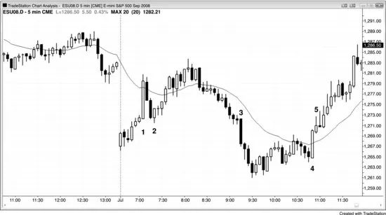

## Chapter 10: Other Magnets

<!-- Source PDF pages 219–221 -->

<!-- PDF page 219 -->

Chapter 10
Other Magnets
There are many other price magnets that will tend to draw the market
toward them for a test. Here is a list of some. Many of these are discussed
elsewhere in the books. When a market is trending toward a magnet, it is
prudent to trade with the trend until the magnet is tested and preferably
overshot. Do not trade countertrend at the magnet unless there has been
some prior countertrend strength like a trend line break, or unless the move
is a pullback in a higher time frame trend.
Trend lines.
Trend channel lines.
Any measured move target including a leg 1 = leg 2 projection.
Spike and channel: the start of the channel is usually tested before
long.
High, low, open, and close of yesterday.
Swing highs and lows of the past few bars or even days, often
setting up double bottom bull flags and double top bear flags.
Breakout points.
Gaps of any kind, including moving average gaps.
The extreme of a trend after every type of pullback (see Chapter
11 on the first pullback sequence).
Trading ranges from earlier in the day or prior days, including
tight trading ranges and barbwire: the extremes and the middle
often get tested.
The approximate middle of the range on a trading range day,
especially if there is an intraday trading range in that area (a fat
area).
Final flags: after the breakout from the flag, the market comes
back to the flag and usually breaks out of the other side.

<!-- PDF page 220 -->

Barbwire.
Entry bar and signal bar protective stops.
Entry price (breakout test).
Huge trend bar opposite extreme (the low of a huge bull trend bar
and the high of a huge bear trend bar).
Common profit targets for scalp and swing positions: in AAPL, 50
cents and a dollar; in the 5 minute Emini, five to six ticks for a
four-tick scalp, and three, four, and 10 points for a swing.
A move equal to the size of the required protective stop: if an
Emini trade required you to use a 12-tick protective stop to avoid
getting stopped out, expect the move to ultimately reach 12 ticks
in your favor.
Daily, weekly, and monthly swing highs and lows, bar highs and
lows, moving averages, gaps, Fibonacci retracements and
extensions, and trend lines.
Round numbers like hundreds in stocks (e.g., AAPL at $300) and
thousands in the Dow Jones Industrial Average (Dow 12,000). If a
stock quickly moves from $50 to $88, it will likely try to test $100
and usually go to $105 or $110 before pulling back.
Figure 10.1 Big Trend Bar Extremes Are Magnets

<!-- PDF page 221 -->

When there is a huge trend bar with small tails, traders who enter on the bar
or soon afterward will often put their protective stops beyond the bar. It is
fairly common for the market to work its way to those stops and then
reverse back in the direction of the trend bar.
Bar 1 in Figure 10.1 is a huge bull trend bar with a shaved bottom. The
market reversed down off the bear inside bar that followed and formed a
higher low, but not before running the protective stops below the low of the
trend bar. Smart traders would have shorted the inside bar, but they were
ready to go long above the bar 2 bull reversal bar that hit the stops and then
turned the market back up.
Bars 3 and 4 were also huge trend bars with small tails, but neither was
followed by an immediate pullback that ran stops.
