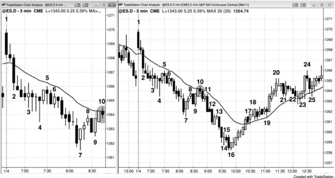
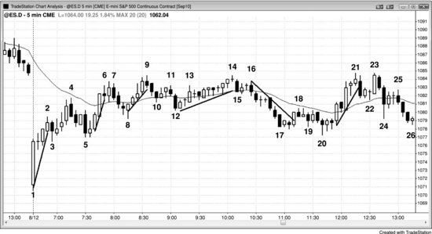

# Part III: Pullbacks: Trends Converting to Trading Ranges

<!-- Source PDF pages 222–246 -->

<!-- PDF page 222 -->

Part III
Pullbacks: Trends Converting to Trading
Ranges
Even when a chart is in a strong trend, it will have periods of two-sided
trading, but as long as traders believe that the trend will resume, these are
only pullbacks. These trading ranges are small enough for traders to view
them as just brief pauses in the trend, rather than the dominant feature of the
chart. All pullbacks are small trading ranges on the chart that you are
viewing, and all trading ranges are pullbacks on higher time frame charts.
However, on the chart in front of you, most attempts to break out of a
trading range fail, but most attempts to break out of a pullback succeed. On
higher time frame charts, the trading range is a simple pullback, and if you
are trading on that chart, you can trade it like any other pullback. Since the
bars are larger on a higher time frame chart, your risk is greater, and you
have to reduce your position size. Most traders prefer to trade off a single
time frame and not switch back and forth taking different-sized positions
and using different-sized stops and profit targets depending on the time
frame.
If the market is in a strong trend and everyone expects the trend to
continue, why would a pullback ever happen? To understand why, consider
the example of a bull trend. The reversal down into the pullback is due to
profit taking by the bulls and, to a lesser extent, scalping by the bears. Bulls
will take profits at some point because they know that it is the
mathematically optimal thing to do. If they hold forever, the market will
almost always work back down to their entry price and will eventually go
far below, creating a large loss. They never know for certain where the
optimum place is to take profits, and they use resistance levels as their best
estimate. These levels may or may not be obvious to you, but because they
offer opportunities to traders, it is important to look for them constantly.

<!-- PDF page 223 -->

Trend scalpers and swing traders, as well as countertrend scalpers, expect
the pullback and trade accordingly. When the market reaches a target where
enough bulls think that they should take profits, their lack of new buying
and their selling out of their longs will cause the market to pause. The target
can be any resistance level (discussed in the chapters on support and
resistance in Part II of this book), or a certain number of ticks above an
important signal bar (like six, 10, or 18 in the Emini). The bar might have a
bull body that is smaller than the bull body of the prior bar, it might have a
tail on the top, or the next bar might be a small bar with a bear body. These
are all signs that the bulls are less willing to buy at the top of the swing, that
some bulls are taking profits, and that bears are beginning to short for
scalps. If enough bulls and bears sell, the pullback will become larger and
the current bar might fall below the low of the prior bar. In a strong bull
spike, traders will expect that the bull trend will immediately resume, so
both the bulls and bears will buy around the low of the prior bar. This
creates a high 1 buy signal and is usually followed by a new high. As a bull
trend matures and weakens, more two-sided trading will develop, and both
the bulls and the bears will expect a pullback to fall for more ticks and last
for more bars. The market might form a high 2 buy signal, a triangle, or a
wedge bull flag. This creates a small downtrend, and when it reaches some
mathematical target, the bulls will begin to buy again, and the bears will
take profits and buy back their shorts. Neither will sell again until the
market rallies far enough for the process to repeat.
Some of the buying also begins to dry up as bulls become unwilling to
continue buying only one- to three-tick dips. They grow cautious and
suspect that a larger pullback is imminent. Because they believe that they
will be able to buy six to 10 ticks or more below the high, there is no
incentive for them to buy any higher. Also, there is an incentive for them to
take partial or full profits because they believe that the market will soon be
lower, where they can buy again and make additional profits as the market
rallies to test the most recent high. Momentum programs sense the loss of
momentum and will also take profits and not enter again until momentum in
either direction returns. Bears also see the weakening of the trend and begin
to sell above the highs of bars and above swing highs for scalps, and they

<!-- PDF page 224 -->

scale in higher. Once they see more selling pressure, they will also short
below the lows of bars, expecting a deeper pullback.
Most bulls will exit their longs on a weaker sell signal than they would
need to take short positions. They initially look to take profits on strength,
like above a swing high or the high of the prior bar or on the close of a large
bull trend bar. After taking profits on strength, they will then look to take
profits on the remainder of their positions on weakness, and begin to sell
out of their longs below bear reversal bars; they suspect that the pullbacks
will become larger. Most will not join the bears in shorting, because most
traders are unable to reverse a trade consistently well. They have been
thinking that the market was going up, and usually need to get out of their
longs for several minutes before they can convince themselves that they
should take a trade in the opposite direction. If they believe that the market
is only pulling back and not reversing, they will instead look to buy back
their longs once they think that the pullback has ended. Since most cannot
or will not reverse, they don't want to be short when they are looking to buy.
If they took the short scalp, they would most likely not be able to reverse
back to long, and they would find themselves trapped out of a bull swing
because they tried to make a small bear scalp. It does not make
mathematical sense to try to make one point on a low-probability short and
end up missing two to four points on a high-probability long.
In a bull trend, there is a series of higher highs and higher lows. When the
trend is strong, bulls will buy for any reason, and many will trail their
protective stops. If the market makes a new high, they will raise their stops
to below the most recent higher low. If enough bears short and enough bulls
take profits, the reversal can be stronger than what traders initially
expected. This often happens later in a trend, after several prior pullbacks
were followed by new bull highs. However, both the bulls and the bears
believe that the market will turn back up above the most recent swing low,
and both will usually buy at or above that low. This results in either a
double bottom bull flag or another higher low. The sell-off can be sharp, but
as long as enough traders believe that the bull trend is intact, traders will
buy and the market will test the old high, where bulls will take partial or
full profits, and the bears will short again.

<!-- PDF page 225 -->

As the bull trend matures, traders will only look to buy a deeper
correction, and they expect the market to make two-legged corrections,
where the second leg falls below the low of the first. The price action tells
traders when a deeper correction like this is likely, and when they believe
that it is, they will no longer trail their protective stops below the most
recent swing low. They will look to take profits higher, like above the most
recent swing high, and then look to buy again around that low,
reestablishing their longs. It does not make sense for them to rely on a stop
below the most recent higher low once they believe that the market is likely
to have a two-legged correction and, therefore, fall below that low. They
will exit most or all of their position before that happens, but still remain
bullish. The bull trend is no longer forming higher highs and higher lows.
However, this lower low is usually still above the most recent higher low on
a higher time frame chart, so the larger bull trend is still intact. This twolegged pullback is a large high 2 buy setup, and as the trend matures, these
pullbacks get larger and have subdivisions. If the trend has truly reversed,
there will be a series of lower highs and lows, but there is usually a clear
reversal (reversals are discussed in book 3). In the absence of a clear
reversal, a two-legged down move is just a type of bull flag and is usually
followed by a new bull high. For example, the first leg down might be a
small bear spike and the second leg down is a small bear channel. If the
move down is strong, even if it is in a tight, complex channel and is not a
bear spike, traders will expect it to be the first of at least two legs down.
Bulls who bought the pullback will take profits below the trend high, and
bears will begin to short aggressively below the old high, expecting a lower
high and second leg down.
Once the market begins to make lower highs, the bulls will usually only
look to buy deeper pullbacks, and their absence of buying helps to create
those deeper pullbacks. The bears see the same price action, and transition
to holding on to their shorts for larger profits, expecting the sell-offs to
become larger. The market repeatedly sells off around (slightly above, at, or
below) the old high, but continues to rally from around the old low. Upside
and downside breakout attempts fail, and the market loses its direction,
creating near-term uncertainty. This is the hallmark of a trading range.
There will be repeated attempts by the bulls to resume the trend and by the

<!-- PDF page 226 -->

bears to reverse the trend, and 80 percent of both fail. Since a trading range
in a bull trend is just a bull flag on a higher time frame chart, the odds favor
an upside breakout. There will always be some pattern that the bulls and
bears will recognize as a sign that the bull trend is about to resume. When a
credible one appears, fewer bears will be willing to scalp shorts on the rally,
and the bulls will begin to continue to buy toward the top of the range. With
fewer bears willing to short and fewer bulls willing to sell out of their longs,
the rally will break above the trading range. If the breakout is strong, the
bears who were building a swing position, expecting a larger correction or a
reversal, will buy back their shorts and not look to short again for at least
several more bars. With neither the scalping nor the swinging bears now
shorting and the bulls not taking profits, the market usually runs for about a
measured move up, equal to about the height of the trading range. Bulls will
then begin to take profits and bears will again short. If the selling is strong,
there will be a pullback, a trading range, or even a reversal down.
The opposite happens in a bear trend. The pullbacks are initially due to
bears taking profits on new lows, but there is always some buying by
aggressive bulls who think that the market will rally far enough for them to
make a profitable scalp. Once the market has rallied to some resistance
level, usually in a low 2 or low 3 pattern, the bulls will sell out of their
longs as they take profits, and the bears will short again. The bears want the
market to continue to make lower highs and lows. Whenever they see a
sharp rally, they will aggressively short when it approaches the most recent
lower high. They sometimes don't short heavily until the market reaches the
most recent swing high, which is why double top bear flags are so common.
As long as the market continues to make lower highs, they know that most
traders will see the bear trend as being intact, and therefore likely to be
followed by another lower low, where they can take partial or full profits on
their shorts. Eventually a pullback will evolve into a trading range, and
there will be some rallies above the most recent lower highs. On a higher
time frame chart, there will still be lower highs and lows, but on the chart
that you are trading, this higher high is a sign that the bear trend has lost
some of its strength. As bear trends mature and weaken, they often form
two-legged rallies where there is both a higher low and a higher high, but
the bear trend is still intact. This is the basis for a low 2 short setup, which

<!-- PDF page 227 -->

is simply a two-legged rally. There will be some pattern within the range
that will tell both bulls and bears that the bear trend is likely to resume, and
it will always be at a resistance level, like a measured move or a trend line.
This will make bulls less willing to buy near the bottom of the range and
bears more willing to continue to sell all the way to the bottom. The market
then breaks to the downside, the bull scalpers stop buying, and the bull
swing traders sell out of their longs. The market then falls for about a
measured move, where the bears will begin to take profits and the
aggressive bulls will once again begin to buy. If the buying by the bulls and
the bears is strong enough, there will be a pullback, a trading range, or a
trend reversal up.
The final leg of a pullback is often a micro channel against the trend (a
bear micro channel at the end of a bull flag or a bull micro channel at the
end of a bear flag). The breakout of a micro channel usually only goes for a
bar or two before there is a pullback, especially if the micro channel has
four or more bars. If the trend is strong, there is often no pullback and
therefore entering on the breakout of the micro channel is a reasonable
trade. When the trend is not very strong, the breakout from the micro
channel usually has a failure attempt within a bar or two. As is the case with
all breakouts, traders have to assess the strength of the breakout compared
to the strength of the signal bar for the failed breakout. If the breakout is
significantly stronger, especially if the underlying trend is strong, the
reversal attempt will likely fail and lead to a breakout pullback setup that
will give traders a second chance to enter in the direction of the breakout. If
the breakout is relatively weak, like a small trend bar with big tails, and the
reversal bar is strong, especially if the context is likely to lead to a reversal
(like a bull flag just below the top of a trading range), the reversal attempt
will probably succeed and traders should take the reversal entry. If the
breakout and reversal are about equally strong, and there is no strong
underlying trend, traders will assess the strength of the next bar. For
example, if there is a bull flag in the middle of a trading range, and the bull
trend bar that breaks out of the flag is followed by an equally strong bear
reversal bar, and the market trades below the low of that bar, traders will
evaluate the appearance of that bear entry bar. If it becomes a bull reversal
bar, they will assume that the market is just forming a pullback from the

<!-- PDF page 228 -->

breakout of the bull flag, and will buy above the high of the bar. If instead it
is a strong bear trend bar, especially if it closes on its low and below the low
of the bull breakout bar, traders will see the pattern as a bear breakout and
look to get short, if they did not already short below the bear reversal bar.
In the strictest sense, a pullback is a bar that moves against the trend
enough to take out the prior bar's extreme. In a bull trend, a pullback is a
move where a bar extends at least one tick below the low of the prior bar.
However, a broader definition is more useful, and any pause (including an
inside bar, an opposite trend bar, or a doji bar) in a trend's momentum
should be considered to be a pullback, even though there may be only
sideways action and not an actual move backward. As even the strongest
trend progresses, it at some point begins to give evidence of how deep a
pullback will be. Most commonly, it will be an area of two-sided trading.
For example, after the spike in a spike and channel bull trend, the market
has a pause or pullback that creates the start of the channel. Once the trend
channel ends and a sell-off (pullback) begins, it will usually test down to the
bottom of the channel. That is where bears started selling, and as the bull
channel goes above their short entry price, they begin to worry. They and
other bears sell more as the bull trend advances, but once the trend turns
down into a pullback, those bears will be very happy to exit all of their
entries at their earliest and lowest short entry price, which was the start of
the channel. Once they are flat, they will not look to sell in that area,
because they saw how far the market rallied after their earlier short trade.
However, if they are still bearish, they will short again on a rally. If the rally
ends below the prior high, it will create a lower high and usually leads to a
second leg down. If the bears are particularly strong, that lower high could
be the start of a new bear trend and not just a second pullback in an
incipient trading range.
The same is true for a wedge at the end of a trend. If a bear trend forms a
downward-sloping wedge, the market will try to correct to the top of the
wedge where the earliest bulls began to buy. If the market can reach their
earliest entry price, then they can exit that trade at breakeven and with a
profit on all of their lower entries, and they will likely not want to buy until
the market falls again. They learned from their first trade that they bought at
too high a price; they did not like riding through the open losses of their

<!-- PDF page 229 -->

long positions as the market continued to fall and do not want to experience
that again. This time, they will wait for a pullback and hope the market
forms a higher low or even a lower low. They expect that the original low
of the wedge will be support on any subsequent pullback and that buying
near that level with a stop a little below that price gives them an entry with
a defined and limited risk, and they like that.
The tendency of the market in a trend to test the earliest area of two-sided
trading allows perceptive traders to anticipate when a pullback might form
and how far it will likely extend. They won't want to enter countertrend at
the first sign of two-sided trading, but that two-sided trading tells them that
countertrend traders are beginning to take positions and at some point
before too long the market will likely pull back to that price level. After the
trend channel or wedge or stairs pattern begins to develop signs of a
reversal (see the chapter on trend reversals in book 3), they will take
countertrend trades and look to exit with a profit in the area where the twosided trading began (the start of the channel).
Since a pullback is a trend, even though it is usually small compared to
the larger trend from which it is pulling back, like all trends it will
commonly have at least two legs. One-legged and three-legged pullbacks
are also common, as are small channels and triangles, but all pullbacks are
relatively brief, and traders will expect the trend to resume soon. Sometimes
the legs are visible only on a smaller time frame chart, and other times they
are large and each leg breaks down into smaller legs, each of which also has
two legs. Because traders expect the major trend to resume soon, they will
fade breakouts in a pullback. For example, if there is a strong bear trend
that finally has a pullback with two legs up, there will usually be far more
bears than bulls as the market breaks out above the high of the first leg up.
Even though the market is breaking out above a swing high in a bull trend,
the bulls buying the breakout will usually be overwhelmed by bears who
will short it, because they expect the breakout to fail and for the bear trend
to resume very soon. They will short on limit and market orders at and
above the swing high. They see this breakout as a brief opportunity to
reestablish shorts at a high price. Since 80 percent of attempts to reverse a
trend will fail, the odds strongly favor the bears. This is especially true for
the first two-legged pullback in a strong trend.

<!-- PDF page 230 -->

Any move that has two legs should be traded as if it is a pullback, even if
it is with the trend. Sometimes the final leg in a trend is a two-legged, withtrend move to a higher or lower high in a bull trend or a lower or higher low
in a bear trend. For example, if there is a bull trend that has a sell-off that
falls through the bull trend line and this trend line breakout is followed by a
two-legged pullback, that pullback simply tests the prior extreme and can
even exceed the old extreme. This means that the pullback from that trend
line breakout can result in either a lower high or even a higher high and still
be part of a transition into a new bear trend. Strictly speaking, the bear trend
does not begin until after the final high, but that final high is often just a
higher high pullback from the breakout below the bull trend line.
What qualifies as two legs? You can create a line chart based on closes
and often clearly see a two-legged move. If you are using bar or candle
charts, the easiest two-legged move to see is one in which there is a
countertrend move, then a smaller with-trend move, and then a second
countertrend move (a textbook ABC pullback). So why does the move often
reverse after the second leg? Look at a two-legged pullback in a bull trend
as an example. Bulls will buy the new low (the C leg), thinking that the
second leg down will be the end of the trend. Also, short scalpers who were
looking for a two-legged correction will be buying back their shorts.
Finally, aggressive bulls who bought the low of the first leg down (the A
leg) will now be adding to their long positions on the move to a lower low.
If all of these buyers overwhelm the new bears who shorted on the breakout
below the first leg down, a rally will ensue and it will usually test the old
high at a minimum.
However, oftentimes the two legs are clearly visible only on a smaller
time frame chart and have to be inferred on the chart that you are viewing.
Since it is easier to use a single chart for trading than to be checking
multiple charts all day long, traders have an advantage if they can see the
two legs on the chart in front of them, if only by inference.
In a bull market, when there is a series of bull trend bars, a bear trend bar
can be assumed to be the first leg of a pullback (the A leg) even if the low
of the bar is above the low of the prior bar. If you examined a smaller time
frame chart, a countertrend leg would likely be evident. If the next bar has a
with-trend close but a high below that of the bar that ended the bull swing,

<!-- PDF page 231 -->

then this is the B leg. If there is then a bear bar or a bar with a low below
the low of the prior bar, this will create the second leg down (the C leg).
The more that has to be inferred, the less reliable is the pattern, since
fewer traders will see it or have confidence in it. Traders will likely commit
less capital and be quicker to exit.
There is an obvious point here. If the trend that is now pulling back ended
in a climax or any significant trend reversal pattern, the trend has changed
and you should not be looking to enter pullbacks in the old trend. It is over,
at least for maybe 10 bars or so and maybe for the rest of the day. So after a
strong rally, if there is a wedge top or a lower low after a break of the bull
trend line, you should now be looking for setups to short and not pullbacks
in the old bull trend to buy. When it is not clear that there was a probable
trend reversal, setups in both directions are likely to work, at least for
scalps. The more likely it is that a trend reversal has taken place, the more
important it becomes to avoid trades in the old direction, since it is now
likely that there will be at least two legs in the new direction. Also, the
amount of time and number of points in this move will usually be roughly
proportional to the clarity of the reversal. When you have a great reversal
setup, you should swing part or, rarely, even all of your position.
All pullbacks begin with a reversal pattern of some type. It is usually
strong enough to entice countertrend traders into taking a position against
the trend, but not strong enough to be a reliable countertrend setup. Since
the setup and the pullback are not strong enough to change the direction of
the always-in trade, traders should not be looking for a countertrend trade.
Instead, they should be looking for a setup that signifies a possible end of
the pullback and then enter in the direction of the trend. However, since the
pullback began with a reversal, many traders would be overly cautious and
talk themselves out of a great trade. You are never going to be 100 percent
certain of any trade, but when you are reasonably confident that a trade
looks good, you have to trust the math, take the trade, and simply accept the
reality that you will lose some of the time. That is just the nature of the
business, and you cannot make a living as a trader unless you are willing to
take losses. Remember, a major league baseball hitter who fails 70 percent
of the time is considered to be a superstar and makes millions off that other
30 percent.

<!-- PDF page 232 -->

When the market is in a weak trend, or in the early stages of transitioning
from a trading range into a trend, it will sometimes have a flag, and then a
flag breakout, and then a pullback, and that pullback becomes another flag.
The market will sometimes do this several times before a strong breakout
materializes.
One- and two-bar pauses are more difficult to trade than pullbacks that
last many bars and actually pull back from the extreme. For example, if
there is a strong bull move in which the last bar was a small bar with a high
just a tick or two below the prior bar's high and that bar was a large bull
trend bar and followed one or two other large bull trend bars, if you buy one
tick above this bar, you are buying at the high of the day. Since lots of
institutions fade every new high, there is a substantial risk that the move
might reverse and hit your stop before your profit target is reached.
However, if the trend is very strong, this is an important trade to take. Part
of what makes this trade so difficult is that you have very little time to
analyze the strength of the trend and to look for possible trend channel line
overshoots or other reasons why the trade might fail.
An even more difficult pause is a small doji with a high one tick above
the high of the prior strong bull trend bar. Buying above the high of the doji
is sometimes a good trade, but for most traders, it is too difficult to assess
risk quickly enough and it is better to wait for a clearer setup. A reason
against buying a pause bar breakout is if the last trend bar or two had fairly
large tails, which indicates that countertrend traders were able to assert
some influence. Also, if the prior with-trend entry followed a larger
pullback, like a high 2, you should be hesitant since each pullback usually
gets deeper, not shallower. However, if the market just broke out and had
three bull trend bars with closes near their highs, then the chance of a
successful scalp when you buy above the pause bar that follows these bars
is good. In general, these high 1 longs (or low 1 shorts in bear trends) in the
early stages of a strong bull trend are the only pause bars entries that most
traders should consider. Also, remember that a pause bar after a one-bar
breakout is just as likely to be an entry in the opposite direction, since onebar breakouts often fail, especially if they are countertrend.
If a pullback is small compared to the trend, it is usually safe to enter as
soon as it ends. If it is large enough to be a tradable, strong countertrend

<!-- PDF page 233 -->

move, it is better to wait until a second signal sets up. For example, if there
is a protracted bear channel in a strong bull trend, rather than buying the
first reversal back up, it is safer to wait for a pullback from that breakout
and buy the breakout pullback.
All bull pullbacks end for a reason, and that reason always is that the
market has reached some kind of support. Sometimes they end quietly and
other times with strong trend bars against the main trend and come close to
reversing the trend. This is true of large pullbacks, and one- or two-bar
pullbacks from breakouts of small flags. Even the 1987 and 2009 stock
market crashes ended at the monthly bull trend line, and were therefore just
pullbacks in a bull trend. Most end at a cluster of support levels, even
though many traders may not see some or all of them. Some traders will
buy a pullback in a bull trend because they are focused on one support
level, whether it is a bull trend line, a channel line along the bottom of the
bull flag, a prior high or low, some moving average, or any other type of
support, and others will buy because they see a different support level in the
same area. Once there are enough buyers coming in to overwhelm the
bears, the trend will resume. The same is true of bear pullbacks. They
always end at a cluster of resistance levels, although it is often easy to not
see the resistance that the market is seeing. Once the market gets close to
the key price, the vacuum effect often dominates. For example, if buyers
believe that the market is getting close to an important support level, they
will often step aside and wait for that level to be hit. This can result in a
very strong bear spike, but once the support is hit, the bulls come in and buy
aggressively and relentlessly. The same is true for the bears who created the
pullback. They, too, see the support level, and the closer the market gets to
it, the more confident they are that the market will get there. The result is
that they sell aggressively and relentlessly until the level is reached, and
then they suddenly stop selling and quickly buy back their shorts. The
pullback can end with a large bear trend bar that looks like it might flip the
always-in trade to short, but the follow-through selling over the next bars
does not develop. Instead, the bull trend resumes, sometimes slowly at first.
With both the bulls and the bears buying, the reversal can be sharp and go a
long way. The vacuum effect is always present, even during the most
dramatic reversals, like the 1987 and the 2009 stock market crashes. In both

<!-- PDF page 234 -->

instances, the market was in a free fall, but strongly reversed up once the
market fell a little below the monthly trend line. As dramatic as both
crashes were, they were just examples of the vacuum effect at work.
This same behavior happens on a one- or two-bar pullback from the
breakout of a flag. For example, if there is a low 2 bear flag at the moving
average in a strong bear trend and it triggers a short, the entry bar might be
followed by a bull trend bar. This represents a failed breakout and could be
the start of a bull trend or a larger bear rally. However, it usually fails, and
when a failure fails, it becomes a pullback in the larger trend. Here, it
becomes a breakout pullback short setup. Traders will expect it to fail, and
aggressive bears will short on its close and just below and above its high.
More conservative traders will wait for confirmation that this bear trend bar
is just a pullback from the breakout of the bear flag. They will short on a
stop below the low of the bear bar, or the next bar or two, if the pullback
continues a little longer.
Since a pullback is only a pause in a trend and not a reversal, once you
identify what you believe is a pullback, you believe that the trend will
resume and there will be a test of the trend's extreme. For example, if there
is a bull trend and then the market sells off for several bars and if you see
that sell-off as a buying opportunity, then you believe that it is just a
pullback in the bull trend. You are expecting a test of the bull trend's high. It
is important to note that the test does not have to reach a new high. Yes, it is
often a higher high, but it can be a double top or a lower high. After the test,
you will then decide whether the bull trend is intact or has transitioned into
a trading range or even a bear trend.
Pullbacks are often strong spikes that make traders wonder if the trend
has reversed. For example, in a bull trend, there might be a large bear trend
bar or two that break below the moving average and maybe several ticks
below a trading range. Traders will then wonder if the always-in direction is
in the process of flipping to down. What they need to see is follow-through
selling in the form of maybe just one more bear trend bar. Everyone will
watch that next bar closely. If it is a large bear trend bar, most traders will
believe that the reversal has been confirmed and will start shorting at the
market and on pullbacks. If the bar instead has a bull close, they will
suspect that the reversal attempt has failed and that the sell-off is just a

<!-- PDF page 235 -->

brief, but sharp, markdown in price and therefore a buying opportunity.
Beginning traders see the strong bear spike and ignore the strong bull trend
in which it is occurring. They sell the close of the bear trend bar, below its
low, any small bounce over the next few bars, and below any low 1 or low 2
sell setup. Smart bulls are taking the opposite side of those trades because
they understand what is happening.
The market is always trying to reverse, but 80 percent of those reversal
attempts fail and become bull flags. At the time the reversal attempt is
occurring, the two or three bear bars can be very persuasive, but without
follow-through selling, the bulls see the sell-off as a great opportunity to get
long again near the low of a brief sell climax. Experienced bulls and bears
wait for these strong trend bars and sometimes step aside until one forms.
Then they come into the market and buy because they view it as the
climactic end of the selling. The bears buy back their shorts and the bulls
reestablish their longs. This is the opposite of what happens at the end of a
trend when the strong traders are waiting for one large trend bar. For
example, in a strong bear trend near a support area, there will often be a late
breakout in the form of an unusually large bear trend bar. Both the bulls and
the bears stopped buying until they saw it form. At that point, both buy the
sell climax, because the bears see it as a great price to take profits on their
shorts and the bulls see it as a brief opportunity to buy at a very low price.
If traders see what they believe is just a pullback, then they believe that
the trend is still intact. When they are evaluating the trader's equation, the
probability is never known with certainty, but since they are making a trade
in the direction of the trend, they can assume that the directional probability
of an equidistant move is 60 percent. It might be higher but it is unlikely to
be much lower. Otherwise, they would have concluded that the pullback
had lasted so long that it had lost its predictive value and had become an
ordinary trading range, which has about an equal probability of the eventual
breakout being up or down. Once they determine their risk, they can then
set a profit target that is at least as large as the risk and reasonably assume
that they have about a 60 percent chance or better of being successful. For
example, if they are buying a breakout of a bull flag in Goldman Sachs
(GS) and their protective stop is below the bull flag, about 50 cents below
their entry, they can assume that they have at least a 60 percent chance of

<!-- PDF page 236 -->

making at least a 50 cent profit on their long. Their profit target might be a
test of the bull high. If it is and that high is $2.00 above their entry, they
likely still have about a 60 percent chance of success, but now their
potential reward is four times their risk, and this creates a very favorable
result from the trader's equation.
Once you believe that the market has reversed, it usually will pull back to
test the prior trend's extreme before the new trend unfolds. For example,
assume that there is a bear trend and that the prior pullback was strong
enough to break above the bear trend line and now the market is reversing
up from a lower low test of the bear trend's bottom. This is a possible trend
reversal into a bull trend. If that first leg up is in the form of a strong spike,
you then believe that the odds of a reversal are now even greater. The
pullback from that first strong leg up will usually result in a higher low, but
it can also result in a double bottom with the bear's low or even a lower low.
How can it be that you believe that the trend has reversed up into a bull
trend, yet the market has now fallen to a lower low? A lower low is one of
the hallmarks of a bear trend, and it can never be a part of a bull trend. Yes,
that is the conventional wisdom, but you stand to make more money as a
trader if you use broader definitions. You might stop yourself out of your
long if the market falls below the old bear low, but you might still believe
that the bulls really control the market. That spike up was a breakout of the
old bear trend and converted the market into a bull trend. It does not matter
if the pullback from the breakout falls below the bear low. Suppose the
market stopped exactly at the old low instead of going one tick lower. Do
you really think that is of major importance? Sometimes it is but usually
close is close enough. If two things are similar, they will behave the same. It
also does not matter if you consider the bottom of the bull spike or the
pullback to the lower low as the start of the bull trend. Strictly speaking, the
spike was the first attempt at a reversal and it failed once the market fell
below the bottom of the spike. However, it was still the breakout that
showed that the bulls took control over the market, and it really does not
matter that the pullback fell to a lower low and that the bears briefly
regained control. All that matters is that the bulls are in control and will
likely be so for many bars, so you need to be looking to buy pullbacks, even
that first pullback to the lower low.

<!-- PDF page 237 -->

Pullbacks to lower lows in bull trends or higher highs in bear trends are
common in the small legs that take place on every chart. For example,
assume that there is a bear trend and then there is a tight channel rally to the
moving average that lasts about eight bars. Since the channel is tight, it is
strong and this means that the first bear breakout will likely fail, even
though it is in the direction of the trend. Traders usually wait for a pullback
back up before looking to short. However, that pullback will often be in the
form of a higher high, creating an ABC pullback in the bear trend. They
will short below the low of the prior bar, confident that a low 2 short at the
moving average is a great trade in a strong bear trend. Many traders do not
think of this ABC as a bear breakout (the B leg is the breakout below the
channel that constitutes the A leg) and then a breakout pullback to a higher
high (the C leg), but that is what it actually is, if you think about it.
There is a special type of higher high or lower low pullback that is
common in major trend reversals, which are discussed in book 3. For
example, if there is a bull trend that has a strong move down below the bull
trend line, and then a weak rally (for example, a wedge) to a new high, this
higher high is sometimes the start of a new bear trend. If the trend then
reverses down into a bear trend, this weak rally to the higher high is simply
a pullback from the bear spike that broke the bull trend line. That bear spike
was the actual start of the bear trend, even though the pullback from the
spike rallied to above the top of the bear spike and created a new high in the
bull trend. After the bear trend has gone on for 20 or more bars, most
traders will look back at the higher high and see it as the start of the bear
trend, and that is a reasonable conclusion. However, as the trend was
forming, astute traders were wondering if the market had reversed into a
bear trend, and they did not care if the rally up from the bear spike tested
the bull high as a lower high, a double top, or a higher high. From a strictly
technical perspective, the trend began once the bears took control of the
market during the bear spike and not with the test of the bull high. The
confirmation of the trend reversal came once the market sold off strongly
from the higher high. Although the higher high is actually simply a pullback
from the bear spike, it does not matter which of the two highs you think is
the start of the bear trend, because you would trade the market the same
way and look to short below the higher high. The same is true when a bear

<!-- PDF page 238 -->

trend reverses into a bull trend from a lower low after a strong rally breaks
above the bear trend line. The bulls took control of the market on the spike
that broke above the bull trend line, but most traders would say that the new
bull began with the lower low. However, that lower low was simply a
pullback from the strong bull spike.
Any trend that covers a lot of points in very few bars, meaning that there
is some combination of large bars and bars that overlap each other only
minimally, will eventually have a pullback. These trends have such strong
momentum that the odds favor resumption of the trend after the pullback
and then a test of the trend's extreme. Usually the extreme will be exceeded,
as long as the pullback does not turn into a new trend in the opposite
direction and extend beyond the start of the original trend. In general, the
odds that a pullback will get back to the prior trend's extreme fall
substantially if the pullback retraces 75 percent or more. For a pullback in a
bear trend, at that point, a trader is better off thinking of the pullback as a
new bull trend rather than a pullback in an old bear trend.
The most frustrating thing about waiting for a pullback is that sometimes
it never seems to come. For example, when there is a rally and you are now
confident that it would be smart to buy a pullback, the market goes up bar
after bar and does not pull back until it has gone so far that now you think it
might reverse instead of pulling back. Why is that? Every bull trend is
created by buy programs that use every imaginable algorithm, and strong
trends occur when many firms are running programs in the same direction.
Once you are confident that the bull trend is strong, so is everyone else.
Experienced traders understand what is going on, and they realize that any
pullback will almost certainly be bought and it will be followed by a new
high. Because of that, instead of waiting for a pullback, they are doing just
what the institutions are doing. They are buying at the market and on tiny
pullbacks that are not evident on the chart in front of them. Maybe they are
buying on a one- or two-tick pullback. The programs will keep buying
because the probability is that a trend will continue until it reaches some
technical level. At that point, the math will favor a reversal. In other words,
the math overshot neutrality and now favors a reversal, and because it does,
the firms will aggressively trade in the opposite direction and the new trend

<!-- PDF page 239 -->

will continue until once again it overshoots neutrality and the odds again
favor a move in the opposite direction.
For example, if AAPL is up $4.00 at $280 and it has gone up for seven
straight bars on the 5 minute chart, it will probably go up for the eighth bar
and even more. Traders are willing to buy at $280 because they understand
the logic of the directional probability of an equidistant move. Since they
are confident that at some point soon the market will be higher than it is
right now and they are not confident that it will be lower soon, they buy at
the market and on small dips. Although they may not think in terms of
directional probability, all trend trading is based on it. When AAPL is
trending up strongly, they would rather buy at $280 because they believe
that the market will reach $281 before it falls back to $279. They also likely
believe that it will reach $282 and maybe $283 before it falls back one
dollar. They may not think of this in terms of math and the exact probability
is never certain, but in this situation, there is probably about a 70 percent
chance that AAPL will go two or three dollars higher before it pulls back
one dollar. That means that if you take this trade 10 times, you will make
two dollars in seven cases for $14 profit and you will lose one dollar three
times. Your net profit is $11, or more than a dollar per trade.
If instead they wait for the $1.00 pullback, it might not come until AAPL
is at $283. They then could buy it at $282, but that is two dollars worse than
what they could have paid earlier if they just bought at the market.
If after they bought at $280, AAPL fell to $279, many traders would buy
more because they believe that the odds are probably better than 70 percent
that it would rally to a new high and they could get out of their first long at
breakeven and have a dollar profit on their lower entry.
This is important for traders who are waiting to enter on pullbacks. When
the trend is strong, it is often better to enter at the market than to wait for a
pullback.
Figure PIII.1 Pullbacks Begin with Reversals

<!-- PDF page 240 -->

All pullbacks begin with a reversal, and it is often strong enough so that
traders are too afraid to take the with-trend signal when it finally develops.
In Figure PIII.1, the chart on the left shows what the 5 minute chart looked
like at the time of the bar 10 low 2 sell setup at the moving average, and the
chart on the right shows the entire day. Bar 7 was a strong bull reversal bar,
and it was followed by a strong two-bar reversal and higher low at bar 9.
However, the market had not touched the moving average in more than 20
bars, so the bear trend was strong and the bears were likely going to look to
short a two-legged rally to the moving average, especially if there was a
bear signal bar. When the perfect setup finally formed, many beginners
were so focused on bars 7 and 9 that they ignored the bear trend that
preceded them, and the reality that a low 2 short at the moving average
where there is a bear signal bar is a reliable sell setup. The rally was created
by profit-taking bears and scalping longs, and both planned to sell into
strength on a two-legged pullback to around the moving average. The longs
took profits and the bears reestablished their shorts. Nothing is ever going
to be 100 percent certain, but a low 2 at the moving average in a bear trend
where there is a bear signal bar is usually at least 60 percent likely to be a
successful short for bears who shorted on a stop at one tick below bar 10. In
this particular case, the signal bar was only three ticks tall, so a bear would
have been risking five ticks for a test of the bear low, which was about two
points lower. Many bears shorted this first pullback to the moving average
with a limit order located one tick below the moving average. Other bears

<!-- PDF page 241 -->

saw this as the first two-legged bear rally, and therefore expected it to fail.
When they saw the bar 9 bull reversal, they placed limit orders to short at or
above the bar 8 high and were filled on the rally to bar 10. They expected
any reversal to be the start of a bear flag and thought that any breakout to
the upside would be a brief opportunity to reestablish shorts at a higher
price; they aggressively seized that opportunity, overwhelming bulls who
bought the breakout above bar 8.
The bar 10 low 2 bear flag broke out with a strong bear trend bar, but was
followed by a bar with a bull body. This was an attempt to have the
breakout fail. The bulls wanted the market to form a failed low 2 and then a
rally, and flip to always-in long. However, traders know that most reversal
attempts fail, and many shorted the bull close and had limit orders to short
above its high. Because the bears did not know whether the market would
trade above the high of this bull bar, if they were hoping to short at or above
the bar but wanted to guarantee getting short even if their limit orders up
there did not get filled, many also placed stop orders at one tick below its
low. If their limit orders at the high of the bar were filled, many would have
canceled their stop entry orders. If their limit orders were not filled, the stop
below the bar would have ensured that they got short. Most would have
already shorted the low 2 breakout, but some would have added on as the
market went their way. This is particularly true of computerized program
trading where many programs continue to short as the market continues to
fall.
Incidentally, one of the cardinal rules about trading reversals is to exit on
the market's second attempt to resume the trend. In this case, it was
premature to expect bar 7 to be a lasting bottom. Once the market formed a
low 2 at the moving average, and especially with the bar 10 signal bar
having a bear body, all the longs must exit. Very few had the ability to
reverse to short, and those who did not have that ability exited their small
long scalps and missed a big short trade. It is far better to wait patiently to
short a rally to the moving average in a bear trend than it is to scalp a long.
Once the bull trend was clear, traders expected the first two-legged
pullback to fail. When they saw the bull trend bar after bar 21, they placed
buy limit orders at the bar 21 low, since they expected that the breakout
below bar 21 would fail. It would have been the first two-legged move

<!-- PDF page 242 -->

down in a strong bull trend, and most firsts against a strong trend fail. They
also believed that the moving average would be support and that there
would be aggressive buyers there. Their buy limit orders were filled as the
market fell to the moving average. Other bulls entered on a buy stop above
the bar 23 high, since it was a high 2 buy setup in a bull trend with a bull
signal bar at the moving average, which is a very strong buy setup.
The bar 24 bear reversal bar had a tail on the bottom and was slightly less
strong than the bull breakout of the bear micro channel from bar 20 to the
bar before bar 23. The breakout bar was a large bull trend bar, and it
followed two bull bars. Some traders shorted below bar 24, expecting the
bull breakout to fail. Others waited to see what the next couple of bars
would look like. The short entry bar was a strong bear bar but held above
the low of the bull breakout bar, so the market did not yet flip to always in
short. The next bar had a bull body, and therefore did not confirm the
selling. Bulls bought above its high, believing that it was a reasonable
breakout pullback buy setup at the moving average in a bull trend, or in a
bull leg in a developing trading range.
Figure PIII.2 Every Pullback Begins with a Reversal

Every pullback begins with some kind of reversal setup. The reversal is
needed for many with-trend traders to begin to take profits, and for
countertrend trades to initiate trades. Yes, institutions create the reversal
pattern as the with-trend institutions take profits and the countertrend

<!-- PDF page 243 -->

institutions begin to scale into reversal trades. However, lots of other
institutions and traders wait for the early signs of a reversal before initiating
their trades, and the cumulative effect of all traders creates the pullback. If
the trend is strong and the reversal setup is weak, the pullback sometimes
lasts only a bar or two, like at bars 3, 9, and 19 in Figure PIII.2. Sometimes
it is just a pause and creates a sideways pullback, like bar 7.
There was a four-bar bear spike down to bar 2, but the third and fourth
bars had shrinking bear bodies, indicating a loss of momentum. The tails on
bar 2 are a sign of two-sided trading. Some traders thought that this could
be signaling an opening reversal and the low of the day and they bought
above bar 2.
The five-bar bull spike up from bar 5 was enough to make most traders
believe that the always-in trade had flipped to long. They expected higher
prices, and they believed that any sell-off would be bought aggressively and
result in a higher low. However, there were three pushes up to bar 8, and
this wedge top could have two legs down. This resulted in a one-bar
pullback that was followed by another strong leg up. Since the rally up from
bar 5 was so strong, many traders believed that any pullback would be
bought.
Once everyone believes that there are strong buyers below, they just buy
at the market. They don't know if the market will pull back soon but they do
believe that whether or not it does, it will soon be higher. Rather than risk
missing too much of the trend, they start buying at the market, and they
keep buying until they think that the market might finally be starting to pull
back.
Bar 10 had a couple of doji bars after a parabolic move in a spike and
climax bull trend. The five bars up from bar 5 formed the bull spike. It was
also a new high of the day. Some traders began to short what they thought
could be the high of the day, but it resulted in only another pullback.
Some traders saw bar 18 as a possible double top with bar 10, and they
shorted below the inside bar signal bar. Since there were seven consecutive
bull bodies, most traders expected more uptrend so they bought below the
low of that signal bar instead of shorting there.
Bar 26 was a bear reversal bar and a possible lower high after a reversal
down through the bar 16 bottom of the trading range. However, more

<!-- PDF page 244 -->

traders believed that the day was a strong bull trend day and they bought at
and below the low of bar 26.
Figure PIII.3 Breakout Pullbacks

When a channel is steep, it is better not to enter a reversal trade on the
breakout through the trend line and instead wait to see if there is a breakout
pullback that sets up a second signal. In Figure PIII.3, the spike up to bar 2
was too steep to short the first breakout below the trend line. Instead,
traders should consider shorting only if there is a breakout pullback that
tests the high of the spike. The test can be a lower high, a double top, or a
higher high. Here, there was a higher high just below the moving average at
the bar 4 bear reversal bar.
The spike up to bar 6 was also too strong to short on the breakout below
bar 6. The bears were hoping for a successful breakout below the bull trend
line with good follow-through to the downside. Instead, traders should wait
for a breakout pullback before considering going short. Here, the bar after
bar 6 became an outside up bar, and it was a higher high test of the high of
the tight channel from bar 5 up to bar 6. It was followed by a bear inside
bar, forming an ioi (inside-outside-inside) higher high short setup.
The channel from bar 8 up to bar 9 had four consecutive bull trend bars
and was therefore too strong to short the first breakout below the channel.
Instead, traders should wait to see what the breakout pullback looked like. It

<!-- PDF page 245 -->

was a lower high at bar 11, and they could go short at one tick below its
low.
The bull channel from bar 12 to bar 14 was very tight and therefore
traders should not short the breakout below the trend line. Instead, they
should wait to see if there was a good breakout pullback short setup. Bar 16
formed a lower high test of the channel high, and traders could short as bar
16 fell below the low of the prior bar and became an outside down bar.
Alternatively, they could wait for the bar to close. Once they saw that it had
a bear body and it closed below the low of the prior bar, they could short
below the low of the bar 16 outside down bar, which is a higher-probability
short since that bear close gave them additional confirmation that the bears
were strong.
The sell-off down to bar 17 was in a tight channel and there were seven
bars without a bull close. This is too strong to buy the first attempt to break
out to the upside. The breakout pullback was to a lower low at bar 20, and
the buy setup was an ii (inside-inside) pattern.
The rally to bar 21 was in a steep bull channel with seven bars with
higher lows and highs. This is too strong to short the first breakout below
the bull channel. The breakout pullback to bar 23 formed a double top with
the bar 21 channel high. The following bar was a strong bear inside bar,
which was a good signal bar for the breakout pullback short.
The move down to bar 5 was a bull flag, and it was followed by a
breakout and then a pullback to bar 8, which was at the bottom of another
bull flag. It then broke out to bar 9 and formed another pullback to bar 12,
which was another bull flag buy setup. The market often has breakouts that
lead to pullbacks that become flags. This usually happens in weaker trends
and in trading ranges, as it did here.
Although bars 5 and 12 were strong bear trend bars and attempts to flip
the always-in position to short, they did what most such attempts do—they
failed. The bears needed one more strong bear trend bar before they could
convince traders that the short-term trend was down and lower prices were
likely over the next several bars. When it became clear that the bulls were
buying relentlessly and the bears could not push the market down, they
bought back their shorts. Their buying, combined with the continued buying
by the bulls who saw the strong bear trend bars as great opportunities to buy

<!-- PDF page 246 -->

at a low price, resulted in the resumption of the bull trend. Bulls like to see
strong bear trend bars into support. They know that they represent attempts
by the bears to reverse the trend and that most will be brief and fail. They
often step aside and wait for one to form, and they see it as a likely end of
the pullback. This gives them a brief opportunity to buy at a low price.
Experienced traders can buy at the close of the bear trend bar, at and below
its low, and at the close of the next couple of bars. Most traders should
instead wait for a bull reversal bar and buy above its high, or wait for the
reversal up, and then buy above a pullback from the breakout of the bull
flag (like above the two-bar sideways pullback that followed the bar 13
breakout of the bar 12 high 2 bull flag).
