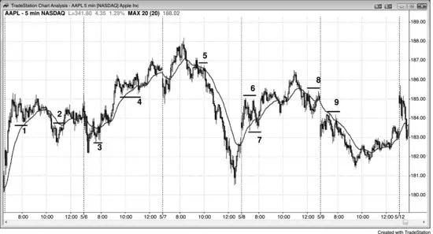
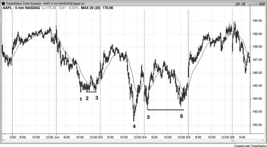
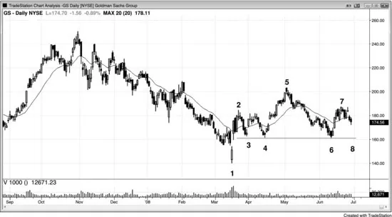
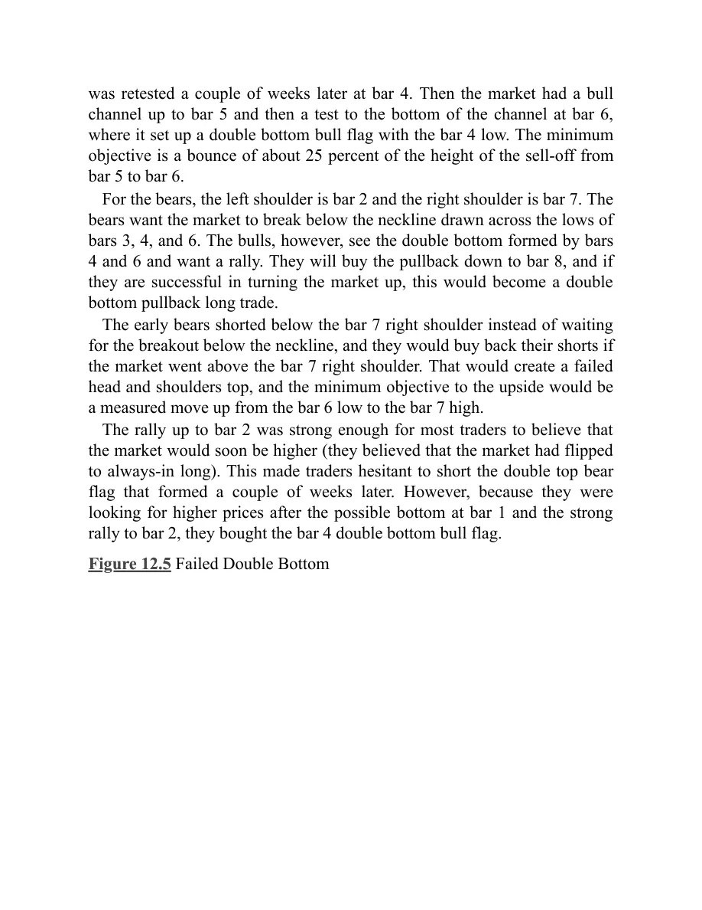
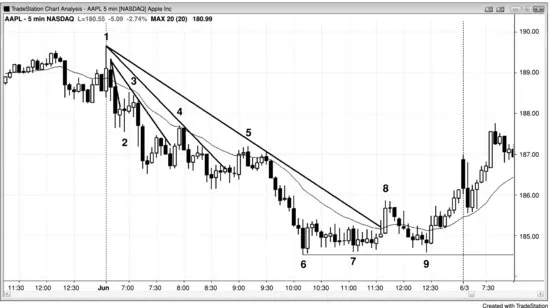
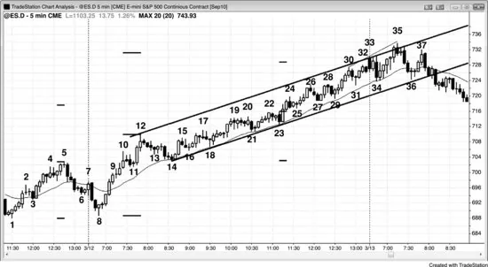
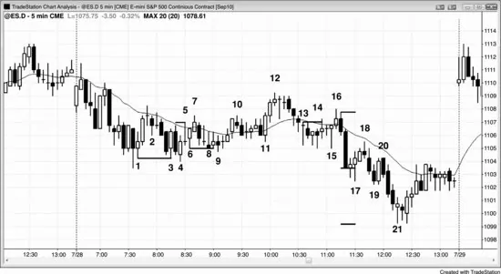

## Chapter 12: Double Top Bear Flags and Double Bottom Bull Flags

<!-- Source PDF pages 256–271 -->

<!-- PDF page 256 -->

Chapter 12
Double Top Bear Flags and Double Bottom
Bull Flags
A bull trend often ends with a double top, and a bear trend often ends with a
double bottom. Since a pullback in a bull trend is a small bear trend, this
small bear trend can end in a double bottom. Because it is a pullback in a
bull trend, it is a bull flag and can be referred to as a double bottom bull
flag. It is two legs down in a bull trend, and therefore a high 2 buy setup. It
is a particularly reliable type of high 2 buy setup, so I generally refer to it as
a double bottom to distinguish it from other high 2 patterns. Likewise, a
pullback in a bear trend is a bear flag and it is a small bull trend, and that
small bull trend can end with a double top. If it does, that double top is a
double top bear flag.
In a bull trend, bulls often trail their protective stops below the most
recent higher low, because they want the trend to continue to make higher
lows and higher highs. A double bottom bull flag is, in part, due to bulls
defending their trailing stops below the most recent swing low. If the
market falls below the most recent swing low, traders will see the bull trend
as weaker, and possibly over. That would be a lower low, and they would be
concerned that it might be followed by a lower high instead of a new high.
If so, the market might be forming a two-legged correction (a large high 2
buy setup), or even a trend reversal. Because of this, if the bulls have a lot
of conviction in the trend, they will buy heavily at and just above the most
recent swing low, creating a double bottom bull flag. The opposite is true in
a bear trend, where the bears want the market to keep forming lower highs
and lows. Many will trail their protective stops just above the most recent
lower high, and strong bears often short aggressively on any rally up to that
most recent lower high. This can result in a double top bear flag.

<!-- PDF page 257 -->

Any pullback in a bull or bear trend can turn into either a double bottom
bull flag or a double top bear flag. Sometimes both are present within the
same pullback, and then this small trading range puts the market in breakout
mode. If the market breaks to the upside, traders will see the pattern as a
double bottom bull flag, and if it breaks to the downside, they will see it as
a double top bear flag. If there is significant momentum up or down before
the pattern, that momentum increases the odds that the trading range will
just be a continuation pattern. For example, if there was a strong move up
just before the trading range, an upside breakout is more likely and traders
should look to buy the reversal up from a double bottom at the bottom of
the range. If there is then an upside breakout, traders will see the pattern as
a double bottom bull flag. If instead the market was in a bear spike just
before the trading range, traders should look to sell the reversal down from
a double top within the pattern and expect a downside breakout. If that
happens, traders will see the trading range as a double top bear flag.
When there is a bull trend and then a two-legged pullback where either of
the down legs is a bear spike, which might appear unremarkable, the bears
will want the market to stay below the lower high that followed the first leg
down. They will short in an attempt to reverse the trend into a bear trend.
The bulls always want the opposite because trading is a zero-sum game—
what's good for the bears is bad for the bulls and vice versa. The rally up
from the second leg down often will stall at or just below the lower high.
The bulls want the rally to go above the lower high, run the protective stops
of the bears, and then reach a new high. The bears will short aggressively to
keep that from happening and are often willing to short heavily at a tick or
two below the lower high and at the lower high. This is why the rally often
goes all the way up to the lower high before the market turns down. It is the
final defense of the bears, and they will be at their absolute strongest at the
lower high. If the bears win and the market turns down, this creates a
double top bear flag, and a bear channel often follows. After the lower high
and the double top test of the lower high, the bears next want a lower low
and then a series of lower highs and lows.
Whether or not the rally up from the second leg down stalls at the lower
high, above it, or below it, if the market then sells off again, it can form a
double bottom with the bottom of the pullback. If there is a reasonable buy

<!-- PDF page 258 -->

setup, traders will buy it, looking for this double bottom to be a bull flag
that will be followed by a new high in the bull trend. Many bulls who
bought at the bottom of the two legs down will have their protective stops
just below the pullback. If the market starts up and comes back down again,
the bulls will buy aggressively at a tick or two above the bottom of the first
leg down in an attempt to turn the market up. They don't want the market to
create a lower low after the lower high, because this is a sign of strength by
the bears and it would increase the chances that the market would trade
either further down or sideways instead of up. If they succeed, they might
be able to resume a bull trend. If the market falls a tick or two below the
bottom of that first leg down, it might run the protective stops of the bulls
and then break out into a measured move down.
Two-legged pullbacks are common in any trend, and they are often
horizontal with both legs ending around the same price. Sometimes the
pullback can last for dozens of bars before the trend resumes. The sideways
move often begins and ends with small legs that have extremes that are very
close in price (the second spike can slightly overshoot or undershoot the
first one). The trend resumption from each of the legs is an attempt to
extend the trend. For example, if there is a bear trend and then a pullback,
and then the market sells off again, the bears are pushing for a lower low
and an extension of the bear trend. However, if instead the market finds
more buyers than sellers above the bear low and forms a higher low, the
bears have failed to drive the market down to a new low. If this second leg
up does not result in a new bull trend and the bears are able to regain
control and create a low 2 short entry, they will drive the market down
again in an attempt to have the market break out to a new low. If again the
bulls overwhelm the bears around the same price as they did earlier, the
bears will have failed twice at the same price level. When the market fails
twice in an attempt to do something, it usually then tries to do the opposite.
Those two pushes down that ended around the same price, just above the
bear low, create a double bottom bull flag. It is a higher low that has two
bottoms instead of one. It is a type of failed low 2, and is a reliable buy
signal in this situation.
Similarly, if there is a sell-off in a bull trend but then the bulls regain
control of the market and try to rally it up beyond the old high and fail, then

<!-- PDF page 259 -->

the bears were successful in driving the market down again and they created
a lower high. If the bulls once again take control and once more push the
market up as they try for a new bull high, and again the bears overwhelm
them around the same price as they did earlier, there will be a double top.
Since the market twice tried to break out to a new bull high and failed, it
will likely try to go in the opposite direction. There aren't enough bulls near
the old high to create a new high, so the market will have to go lower to
find more bulls. Instead of being a successful ABC pullback (a high 2 buy
setup) in the bull trend, the pullback failed to find enough bulls to create a
new high and the result was a lower high, which was made of a double top.
A common form of this occurs in spike and channel trends. For example,
if there is a spike up and then a pullback that leads to a bull channel, the
market usually eventually corrects down to test the bottom of the channel,
where it tries to turn up again. This test of the bottom of the channel creates
a double bottom with the bottom of the channel, which might have been
dozens of bars earlier, and since it is in a bull trend (a spike and channel
bull trend), it is a double bottom bull flag.
A head and shoulders continuation pattern is another variation, with the
spikes on either side of the right shoulder forming a double top or bottom.
Unlike a double top that is a reversal pattern at the top of a bull move, a
double top bear flag is a continuation pattern in a bear trend that is already
underway. Both double tops lead to a sell-off. Since a double top bear flag
functions like any other double top, many traders simply call it a double top
and think of it as the top of a corrective move up in a market that has
already turned down. Similarly, a double bottom bull flag is a continuation
pattern in a move up and not a reversal pattern at the bottom of a bear trend.
A double bottom bull flag is simply a double bottom, and like all double
bottoms, it is a buy setup.
The first higher low in a new bull trend often takes the form of a double
bottom bull flag, and the first lower high of a new bear trend often is a
double top bear flag.
When a double top bear flag or a double bottom bull flag fail and the
market breaks out in the wrong direction, watch to see if the breakout is
successful. If it is not and it fails within a bar or two, the market usually sets
up a variation of a wedge flag. For example, if a double bottom bull flag

<!-- PDF page 260 -->

sets up but the market immediately reverses and falls below the double
bottom, there might be a downside measured move based on the height of
the failed double bottom. This is often a short setup where traders enter on a
sell stop at one tick below the double bottom. However, if the downside
breakout fails within a bar or two and the market trades above the high of
the prior bar, then this is a three-push bottom entry (functionally the same
as a wedge). The two bars that formed the double bottom formed the first
two pushes down, and the failed breakout is the final push down. The
critical feature of any wedge is the three pushes, not a perfect wedge shape.
Figure 12.1 Bull Flags

A with-trend bull flag sets up a long entry on a buy stop order at one tick
above the high of the previous bar, and the initial protective stop is one tick
below the low of that signal bar. After the entry bar closes, the stop is
moved to one tick below the entry bar if it is a trend bar. If it is a small bar,
don't tighten the stop until there is a trend bar in your direction.
Although double bottoms are well-known reversal patterns at the bottom
of bear markets, these flags are with-trend setups in bull markets. By ending
the pullback, which is a small bear trend, they are reversing it, but it is
better to think of them as with-trend patterns.
As shown in Figure 12.1, the double top bear flag at bar 2 failed and
resulted in a tradable long (and became a small head and shoulders bottom).

<!-- PDF page 261 -->

Bar 7 was a setup for a double bottom bull flag within a small trading
range that had just formed a double top bear flag. Since the momentum
leading up to the trading range was strongly up, the odds favored that the
pattern would break to the upside and become a double bottom bull flag,
instead of breaking to the downside and becoming a double top bear flag.
The minimum target after the breakout up or down is a measured move
based on the height of the small trading range.
Figure 12.2 Double Bottom Bull Flag

As shown in Figure 12.2, Goldman Sachs (GS) had a bull spike up from bar
3 to bar 4 and then a pullback to bar 5. This was followed by a channel up
to bar 6 and a pullback to around the bottom of the channel. This created a
double bottom bull flag with bars 5 and 7, even though there was the bar 6
higher high in between. Bar 5 was the last higher low of the bull trend, and
bar 7 was possibly the first swing low of a bear trend or trading range. In
this situation, the market could have formed a head and shoulders top if bar
6 was not exceeded by the rally off bar 7. In any case, a double bottom bull
flag is a reliable setup for at least a scalp. Also, since most head and
shoulders tops, like all tops, turn into failures and become continuation
patterns, it is always wise to keep buying near the bottom of any trading
range in a bull trend. In a trend, most reversal patterns fail and most
continuation patterns succeed.

<!-- PDF page 262 -->

There was also a small double bottom bull flag after the bar 3 low formed
by the third and seventh bars that followed bar 3. This was a failed low 2
short setup, which often becomes a double bottom bull flag.
Deeper Discussion of This Chart
Bar 1 in Figure 12.2 was a strong bull reversal bar that reversed the breakout below the
moving average and the small trading range into yesterday's close. There was a two-bar bear
spike down to bar 3 and then the market went sideways as the bulls and bears fought over
the direction of the channel. Because the bull spike was bigger (some traders saw the spike
ending at the high of bar 1 and others saw it as ending at bar 2), the odds favored that the
bulls would create a bull channel and that the bears would fail in their attempt to get followthrough after their spike down. The double bottom bull flag after bar 3 was a higher low buy
setup that led to a wedge channel that ended at bar 6. Since it was a wedge, two legs down
were likely, and since it was a bull spike and channel, a test of the bar 3 area where the
channel began was also likely. Sometimes the test takes more than a day, but once it forms,
the market usually tries to form a double bottom with the low of the channel. Because the
spikes up to bar 2 and to bar 6 were so strong, the market might not come down to the bar 3
area, and instead might form a wedge bull flag with bars 5 and 7 being the first two pushes
down. In fact, that is what happened, and GS gapped up on the following day.
Figure 12.3 Double Bottom Bull Flags

Bars 2 and 3 and bars 5 and 6 formed double bottom bull flags in Figure
12.3. Both bars 3 and 6 slightly undershot their first legs, but patterns are
rarely perfect.

<!-- PDF page 263 -->

When the double bottom forms right near the trend low as it did with bars
2 and 3, the pattern is often a small spike up and trading range, and it is
often an ii pattern on a higher time frame chart.
The move up from bar 4 was almost vertical and therefore a spike. The
move up from bar 5 was the channel, even though it also was nearly
vertical. This is a spike and climax type of spike and channel bull trend.
After the channel phase of a bull spike and channel pattern, the market
usually tests to the bottom of the channel and sets up a double bottom bull
flag, as it did here, at bar 6. From there, the market usually bounces up to at
least about a quarter of the trading range. After that, the pattern has played
out and traders should look for the next pattern.
The move up from bar 5 stalled around the top of the move up from bar 4.
Some traders saw this as a double top bear flag and shorted. The market
then sold off and found support at bar 6 around the level of the bar 5
pullback. Many of the double top shorts took profits on the test of the bar 5
low, and strong bulls defended that low by buying aggressively. This set up
a double bottom bull flag signal. The upside breakout went for an
approximate measured move up.
Figure 12.4 Head and Shoulders Top or Double Bottom

The daily chart of GS was forming either a head and shoulders bear flag or
a possible double bottom pullback, as shown in Figure 12.4. The market
had a spike up to bar 2 and then a pullback to a higher low at bar 3, which

<!-- PDF page 264 -->

was retested a couple of weeks later at bar 4. Then the market had a bull
channel up to bar 5 and then a test to the bottom of the channel at bar 6,
where it set up a double bottom bull flag with the bar 4 low. The minimum
objective is a bounce of about 25 percent of the height of the sell-off from
bar 5 to bar 6.
For the bears, the left shoulder is bar 2 and the right shoulder is bar 7. The
bears want the market to break below the neckline drawn across the lows of
bars 3, 4, and 6. The bulls, however, see the double bottom formed by bars
4 and 6 and want a rally. They will buy the pullback down to bar 8, and if
they are successful in turning the market up, this would become a double
bottom pullback long trade.
The early bears shorted below the bar 7 right shoulder instead of waiting
for the breakout below the neckline, and they would buy back their shorts if
the market went above the bar 7 right shoulder. That would create a failed
head and shoulders top, and the minimum objective to the upside would be
a measured move up from the bar 6 low to the bar 7 high.
The rally up to bar 2 was strong enough for most traders to believe that
the market would soon be higher (they believed that the market had flipped
to always-in long). This made traders hesitant to short the double top bear
flag that formed a couple of weeks later. However, because they were
looking for higher prices after the possible bottom at bar 1 and the strong
rally to bar 2, they bought the bar 4 double bottom bull flag.
Figure 12.5 Failed Double Bottom

<!-- PDF page 265 -->

In Figure 12.5, the market formed a five-bar bear spike that was followed
by a two-bar bull spike at bar 2.
Bar 4 attempted to form a double bottom bull flag with the bar before bar
3 and with the bull entry bar after bar 2. Bars 5 and 6 also tried to complete
the base. Often the market breaks below the first bottom by a tick or so,
trapping bulls out and bears in, as was the case at bar 5. Bar 6 was an exact
test of the bar 5 false breakout of the bar 4 low, and was an outside up entry
bar or signal bar for a double bottom bull flag. It led to the bar 7 breakout of
the top of the range, which quickly failed in a two-bar reversal.
The market made a second one-tick breakout below the trading range at
bar 8. It is important to realize that if the market falls below that low by
even a tick, traders will start to assume that the bears are taking control.
They will see this as effectively a failed attempt at a wedge bottom, where
bar 4 was the first push down, the one-tick breakout at bar 5 was the
second, and the next one-tick breakout at bar 8 was the third. Once the
market fell below bar 8, the target was an approximate measured move
down using either the height of the wedge (the bar 6 low to the bar 3 high)
or the height of the trading range (the bar 8 low to the bar 7 high). This type
of three-push pattern can take place in any market, and the downside
breakouts don't have to be exactly one tick. For example, in a stock that is
trading around $200, the breakouts that are comparable to bars 5 and 8 in
this chart might be 20 cents or more.

<!-- PDF page 266 -->

Some traders would see the reversal up from bar 6 as a failed breakout of
the bottom of the range, and then bar 7 as a failed breakout of the top of the
range. Many would short below the two-bar reversal at the top, where bar 7
was the first bar, because they know that trading ranges often have strong
breakouts that quickly fail. Some would exit at breakeven on the rally to bar
9 but then would have taken the second entry short below the lower high at
bar 9.
Other traders would trade the market in breakout mode, looking to sell on
a stop below bar 6 and buy on a stop above bar 7. There were trapped bears
on the failed downside breakout and then trapped bulls on the failed upside
breakout, and when there are trapped bulls and bears, the next breakout
usually results in a decent swing. Although the rally to bar 9 was strong, the
bears would short below it because they would see it as a pullback from the
bar 8 breakout.
Compare this to Figure 11.1 in Chapter 11, where there was a similar

trading range after an early strong bear spike, but the potential trend
resumption bear day failed and the market reversed up.
Figure 12.6 Double Bottom Bull Flag and a Measured Move Up

A double bottom followed by a sharp move off the second low and then a
pause after the breakout often leads to a very strong trend. Even though the
chart in Figure 12.6 does not show it, yesterday was a bull trend day.
Although the expectation for the behavior is the same for any double

<!-- PDF page 267 -->

bottom whether it is a reversal or a continuation pattern as it was here, bars
1 and 8 formed a double bottom bull flag. The move up to bar 10 was much
stronger than the move down to bar 8, with every bar's open, close, high,
and low above those of all of the prior bars. This strength alerted traders
that this double bottom bull flag could lead to a strong move up. After
breaking out above bar 5, the market went sideways instead of pulling back,
and this setup is very strong and fairly common. After the spike up to bar
12, there was a pullback to bar 14 and it formed a double bottom bull flag
with bar 11. This was followed by a bull channel that lasted for the rest of
the day.
Bar 18 formed a double bottom bull flag with bar 16. Remember, the lows
don't have to be exactly the same. If a pattern resembles a textbook setup, it
will likely behave in a similar way. Bar 29 formed another with bar 27, and
again set up a high 2 buy in a strong bull channel. A high 2 is simply a twolegged pullback, which all double bottoms are.
Deeper Discussion of This Chart
As shown in Figure 12.6, yesterday closed with a strong bull run and then a pullback to just
below the moving average, where bulls would be looking for a higher low and then a second
leg up. The channel down to bar 6 was steep enough so that traders should not buy the bar 7
outside up breakout on the open. Bar 8 was a strong bull reversal bar, as well as a higher low
and a high 2 in a large trading range. It was also a reversal up from consecutive sell
climaxes. The first sell climax was the three-bar bear spike that followed the bar 5 bull
channel, and the second sell climax was formed by the two strong bear trend bars that
followed the bar 7 attempt to reverse up. Consecutive climaxes are usually followed by at
least a two-legged countertrend move and often a reversal. Since this was occurring within
the first hour, it could be setting up the low of the day and bulls should swing much of their
long position.
The spike up to bar 10 was followed by a large bull trend bar, creating a spike and climax
type of spike and channel bull trend. The market corrected down to the bar 14 start of the
brief channel, where it formed the expected double bottom bull flag.
The protracted bull channel from bar 14 followed a bull spike. Some traders saw the spike as
the move from bar 8 to bar 10 and the pullback as the move from bar 10 to bar 11, where a
micro trend line high 1 long set up. The small breakout below that tight channel down to bar
11 was followed by a higher high pullback to bar 12 and then a second leg down to bar 14.
Other traders, especially those using a higher time frame chart, saw the move from bar 8 to
bar 12 as the spike, and the two-legged moving average test at bar 14 as the pullback that led
to the large bull channel.

<!-- PDF page 268 -->

The short below bar 12 was also a reversal from the bar 11 final flag, and a second reversal
from yesterday's high.
There was a large bear trend bar two bars before bar 14, and this was therefore a spike
down. Since it followed a spike up relatively soon (nine bars earlier), it created a buy climax
(a bull trend bar followed by a bear trend bar). Although it may not be obvious, you could
look at different time frames and find one where this entire pattern is just a two-bar reversal
(in fact, it was one on the 30 minute chart). This is never necessary because you can infer it
from the 5 minute chart. Whenever there is any climax, the market soon becomes uncertain
because both the bulls and bears will add to their positions as they attempt to create a
channel in their direction. Uncertainty means that the market is in a trading range, and some
traders saw the two-legged move up from bar 14 to the slightly higher high at bar 17 as
simply a higher high pullback from the bar 14 bear spike. This is a plausible interpretation,
given that the move had many doji bars. The bulls, however, created a two-bar bull spike up
from bar 14, and this created a sell climax with the bear bar that formed two bars before bar
14. Again, a bear trend bar followed soon after by a bull trend bar is a sell climax, and you
can find some time frame where it is a two-bar reversal up.
Bar 18 set up a failed low 2 buy, and then traders had to evaluate the momentum of the
upside breakout to determine whether it was more likely to have at least two more legs up or
simply to have one more push up and form a wedge top (a low 3). Since the price action
since bar 10 has been two-sided, this was trading range behavior and it was reasonable to be
looking for low 2 short setups (you should not do that in a strong bull trend).
The market had a large bull trend bar breakout up to bar 19, and this increased the odds of at
least two legs up from the bar 18 failed low 2. The bull channel from bar 18 to bar 19 was
tight, with six consecutive bull bodies. When the channel is strong, it is better not to look to
short the breakout below the channel, which means that it was better not to look to short a
low 3 (a wedge top) and instead look to see if there was a breakout pullback that looked like
a good short setup. A breakout pullback would be a second-entry short signal. The move up
to bar 20 could have been that setup but it, too, was too strong, since it had five consecutive
bull trend bars. At this point, most traders would see the move up from bar 14 as a strong
bull trend, even though it was still in a channel, and they would trade it like any strong bull
channel, buying for any reason and not getting trapped out by pullbacks.
Whenever there is a strong spike, you should expect follow-through and you can use
measured move projections to find reasonable locations for profit taking. Since they are so
often reliable, the institutions must be using them as well. The first measurements should be
based on the double bottom. Look for a possible profit-taking area by adding the height from
bar 1 to bar 5, or from bar 5 to bar 8, to the high of bar 5. Both of these projections were
exceeded at bar 24. Since the channel was still steep at that point, more of a rally was likely
so bulls should still hold some of their longs and should be looking for opportunities to buy
more. They can buy using the techniques described in the section on channels in book 1.
The next higher target comes from doubling the height of the spike, using either bar 10 or
bar 12 as the top of the spike. If you add the number of points from bar 8 to bar 12 to the top
of bar 12, that projection was minimally exceeded on the first hour of the next day and it
was followed by a 16-point pullback over the next couple of hours.
Bar 24 was the fourth push up in the channel, and when the market failed to reverse on the
low 4 after bar 24, it broke out to the upside. In general, traders should not be using the low
4 terminology here since this is a bull market and not a trading range or a bear trend, but the

<!-- PDF page 269 -->

breakout after bar 23 indicates that there were many traders who used the failed low 4 as a
reason to cover their longs. The breakout created a gap between the breakout point at the bar
22 high and the breakout pullback at the bar 25 low. A gap that occurs after a strong move
often becomes a measuring gap, as it did here. The current leg began at the bar 24 channel
low and you can take the number of points from that low to the middle of the gap and add it
to the middle of the gap to find the measured move projection where bulls might take
profits. The market missed the target by two ticks on the rally to the close, but turned down
briefly from it on the open of the next day.
Traders should be looking for trend lines and trend channel lines and redrawing them as the
channel progresses. If you see a failed breakout of the top of the channel, it can lead to a
reversal. A second failed breakout is an even more reliable short setup. if you draw a bull
trend line from the bar 14 to bar 23 lows and create a parallel that you then anchor to the top
of the bar 12 spike, you then have a channel that contains the price action. Bar 35 was a
second failed breakout of the top of the range and a reasonable short setup. The minimum
objective is a poke below the bottom of the channel and then a measured move down using
the height of the channel and subtracting it from the location of the breakout below the
channel.
Channels often correct after a third push. Bars 15, 17, and 19 were three pushes, but the
channel was so steep that you should look for a short trade only if there first was a strong
downside breakout and then a pullback. The same is true for the three pushes up at bars 24,
26, and 28. The failure to reverse set up the high 2 long above bar 29, which was followed
by five bull trend bars that formed a spike.
Bars 30, 33, and 35 set up another three-push top pattern, and this one was worth taking for
a possible high of the day. In the first hour, a reversal can be the high of the day, so you
should be willing to be more aggressive. The move down to bar 34 had two strong bear
trend bars, so the bears were getting stronger. Bar 35 was a strong bear reversal bar and the
second reversal down from a breakout of the top of the bull channel, and it was a little above
a measured move up using the height of the bar 8 to bar 12 spike.
Today is a good example of how strong trend channels can have lots of two-sided trading,
and pullbacks never look quite strong enough to buy. It had lots of bear trend bars that
trapped bears into shorts as they looked for a second leg down. However, buyers returned on
every test of the moving average and there was never a good breakout pullback to short.
This told experienced traders to only look to buy. There were only a couple of countertrend
scalps, but traders should consider taking them only if they then get right back in on the long
side with the next buy setup. If they miss that next buy, they are not good enough to be
shorting a day like this, because they are likely missing too many long winners as they wait
and wait for a rare profitable short scalp. They are on the wrong side of the math and are not
maximizing their profit potential because of a lack of discipline.
The entire channel was so steep that you should assume that the spike formed a large spike
up on a higher time frame chart as well (in fact, it formed a strong, eight-bar bull spike on
the 60 minute chart), and should therefore be followed by a higher time frame bull channel.
This means that there would likely be follow-through buying on the 5 minute chart over the
next two or three days, and there was. When a 5 minute channel is part of a higher time
frame spike, the pullback that eventually follows usually tests only the channel low on the
higher time frame chart but not the channel low on the 5 minute chart.

<!-- PDF page 270 -->

There were many breakout tests that tested the earlier breakout to the tick, running stops on
traders using a breakeven stop on their swing portion of their long trades. For example, if
traders bought the bar 11 high 2 and held long through the bar 12 failed flag (not
recommended, because this was a decent short setup at this point of the day), they would
have been stopped out to the tick if they used a breakeven stop. However, traders who
recognized this strong double bottom pattern would have used a wider stop on the swing
portion of their trades after going long above the bar 14 two-legged moving average test,
expecting a strong bull trend day. Look at the moving average. There were no closes below
it after the initial bull spike to bar 10, so do not use a tight stop out of fear of losing a tick or
two on your trade. In fact, a trader should be ready tomorrow to buy the first close below the
moving average, and then buy again above the first moving average gap bar below the
moving average.
Figure 12.7 Failed Double Bottom Breakout Is a Wedge Variant

If a double bottom bull flag breaks to the downside but immediately
reverses back up, it becomes a variant of a wedge bull flag. In Figure 12.7,
bar 3 formed a double bottom with the bar 1 signal bar, but the market
immediately reversed down. However, the breakout below the bottom of the
double bottom failed and the market reversed up again at bar 4, creating a
wedge bull flag (you could also call it a triangle). The three pushes down
are the tails at the bottom of bar 1, bar 3, and bar 4. In this particular case,
bar 2 is also an acceptable first push down. Since the market was in a
trading range between bars 1 and 3, it was risky to buy at the top of bar 1
because it was so tall that you would be buying near the top of a trading
range. A large bull reversal bar does not function as a reversal bar when it is

<!-- PDF page 271 -->

in a trading range where there is nothing to reverse. In situations like this, it
is always better to wait to see if there is a breakout pullback and then a
second-entry opportunity. Bar 4 was a pullback to a lower low and a safer
signal bar for a long.
Bars 6 and 8 tried to set up a double bottom bull flag but it never
triggered. Instead, it broke to the downside at bar 9 and then reversed back
up a couple of bars later. This is another wedge bull flag, and the three
pushes down are bars 6, 8, and 9. However, the bear bar after bar 7 was an
alternative first push down. For any wedge, it does not matter if there are
multiple choices as long as there are at least three pushes down.
Bars 13 and 14 set up a double top, even though bar 14 was one tick
higher. The market reversed up at bar 15 but the upside breakout failed and
bars 13, 14, and 16 became a wedge bear flag short setup.
Deeper Discussion of This Chart
The bars 13 and 14 double top in Figure 12.7 formed in barbwire just below the moving
average. Bear barbwire often has a failed low 2, and traders can buy below the low 2 signal
bar in anticipation of the downside breakout failing. This is a scalp. Since the first trend bar
to break out of barbwire usually fails, traders could look to short below bar 16.
Bar 19 was arguably a high 2 long setup (it was a two-bar bull reversal, but the market never
traded above the bull bar), but since the market might now be in a bear trend on the strong
breakout below the trading range, you should not be looking for high 2 buy setups, which
are setups only in bull trends and in trading ranges. The trading range was mostly below the
moving average, and since the market was falling before entering the trading range, a
downside breakout was more likely (trend resumption). Traders would expect the high 2 buy
to fail and trap bulls, and these traders would then look to short below the bar 20 low 2
setup, where the trapped bulls would sell out of their longs.
The bear channel ended with a third push down to bar 21 and the next day gapped up well
above the bar 18 start of the bear channel. The channel was preceded by a strong two-bar
bear spike after bar 16. There was a perfect measured move down, using the height of the
spike and projecting down from the bottom of the spike.
Bar 19 was another two-bar spike down, and it led to the bear channel down from bar 20 to
bar 21. The channel was parabolic because it had an acceleration phase in the form of a large
bear bar and then a deceleration phase in the form of bodies that became smaller, and the
final one even had an up close. The three bear trend bars starting at bar 20 formed a bear
spike, which is a sell climax. It was the third consecutive sell climax, and this is usually
followed by at least a two-legged correction that lasts at least 10 bars. The two-bar bear
spike after bar 16 was the first sell climax, and the three-bar bear spike that ended with bar
19 was the second sell climax.
