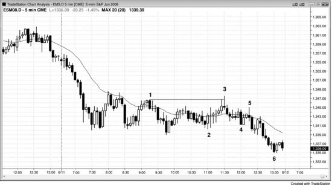
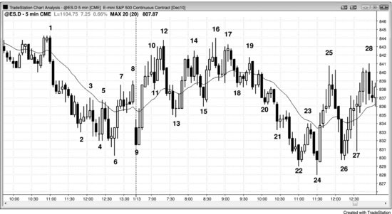
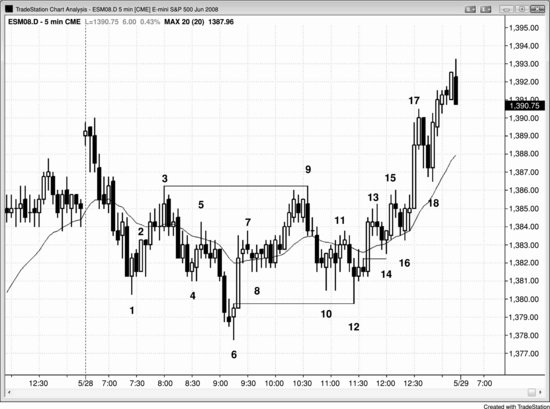

## Chapter 15: Key Inflection Times of the Day That Set Up Breakouts and Reversals

<!-- Source PDF pages 281–285 -->

<!-- PDF page 281 -->

Chapter 15
Key Inflection Times of the Day That Set Up
Breakouts and Reversals
The market often breaks out or reverses within a bar before or after 7:00
a.m. and 7:30 a.m. PST on economic reports, at 11:30 a.m. PST, and less
often around 11 a.m. and noon PST. Very commonly on strong trend days
there will be a strong countertrend panic move that will scare people out of
their positions, and this normally happens between 11:00 and 11:30 a.m.,
although it can come earlier or later. Once it is clear that you were fooled by
a strong countertrend move, the trend will usually have gone a long way
back toward its old extreme, and you and the other greedy traders who were
trapped out will chase it, making it go further. What causes the move?
Institutions benefit from the sharp countertrend spike because it allows
them to add on at much better prices, expecting the trend to resume into the
close. If you were an institutional trader who wanted to load up going into
the close and you wanted to enter at much better prices, you would be
looking to create or contribute to any rumor that could cause a brief panic
that ran stops and briefly caused the market to spike beyond some key level.
It doesn't matter what the rumor or news item is or whether some institution
spreads it to make some money. All that matters is that the stop run gives
traders who understand what is going on an opportunity to piggyback on the
institutions and make a profit off the failed trend reversal.
The stop-run pullback usually breaks a significant trend line, so the run to
the new extreme (a higher high or lower low test following a trend line
break) prompts smart traders to look for a trade in the opposite direction in
the first hour of the next day.
This type of trap is common on trading range days as well, where the
market has been hovering near one extreme for a couple of hours in what
appears to be an incipient breakout, only to make a sharp move to take out

<!-- PDF page 282 -->

the other extreme, and this opposite breakout often fails around 11:30 a.m.
PST. This traps out the earlier traders who were positioning themselves for
the breakout in one direction and traps in the new breakout traders who
entered on the breakout in the other direction. Most trading range days close
somewhere in the middle.
Figure 15.1 Late Stop Runs

In Figure 15.1 there are two 20 gap bar setups that formed on late stop runs.
Bar 5 was the entry after the 11:25 a.m. PST stop run, and it was also a
second entry on a moving average gap setup (a second moving average gap
bar long setup, after the first entry above the bar after the bar 4 bear spike).
Notice how strong the bear trend bar was with a large body and a close near
its low. This bear breakout bar made the weak hands think that the market
had turned into a bear trend. Smart traders looked at this as a great buying
opportunity and expected it to be an exhaustive sell climax and a failed
breakout. This type of stop run usually breaks the major trend line, and,
since it is usually followed by a new extreme in the trend, it often sets the
stage for a trade in the opposite direction in the first hour of the next day
(here, a higher high after the break of the bull trend line). It formed a double
bottom bull flag with the bar 2 start of the bull channel.
On both days, the moving average gap fades developed after two or more
tests of the moving average. After the countertrend traders were able to
bring the market back to the moving average multiple times, they developed

<!-- PDF page 283 -->

the confidence to press their bets, resulting in a gap bar beyond the moving
average. However, the first such breakout beyond the moving average
usually fails and provides a great fade for the expected trend resumption.
On the first day, the market tried to reverse down at 7 a.m., presumably
on a report. Since the day was a trend from the open bull trend at that point,
the one-bar sell-off was the first pullback in a trend from the open day, and
therefore a buy setup. The failed reversal was followed by a three-bar bull
spike and then a channel.
On the second day, the 7 a.m. reversal succeeded and became a three-bar
bear spike that was followed by a bear channel.
On the second day the market tried to reverse up from a final bear flag at
noon, but the reversal failed at the bar 10 moving average gap short setup.
Figure 15.2 Late Bull Trap

On a bear trend from the open in Figure 15.2, followed by an inability to get
above the moving average, traders were expecting an 11:30 a.m. PST bull
trap, and it occurred today exactly on time. Bar 3 was also the first moving
average gap bar in a bear trend. Usually, the trap is a strong countertrend
leg, getting hopeful longs to buy aggressively, only to get forced into
liquidation as the market quickly reverses back down. Today, however, the
rally from bar 2 was composed of large overlapping dojis, indicating that
traders were nervous in both directions. If there was no conviction, then
how could traders get trapped? Well, the bar before bar 3 attempted to form

<!-- PDF page 284 -->

a double top bear flag, and bar 3 spoiled it by going above the bar 1 high.
This made many traders give up on the bear case, forcing the shorts to
liquidate, and it trapped some bulls into longs on the breakout. The
momentum leading to the breakout was weak, so there were probably not
too many trapped bulls. However, by failing to form a perfect double top
with bar 1, it trapped bears out. Since it was a trap, there was fuel for the
short side as those bears who were trapped out now had to short lower and
chase the market down, and those trapped bulls had to sell out of their
longs. The weakness of the down leg from bar 3 is consistent with the
weakness of the up leg from bar 2, but the result was as expected—a close
on the low of the day. This was a bear trend resumption day, but since the
resumption started so late and it followed a tight trading range with strong
two-sided trading (large, overlapping bars with big tails), it resulted in a
smaller leg than the sell-off at the open.
Figure 15.3 Late Trap on Trading Range Day

There is often an 11:30 a.m. PST trap on trading range days as well (see
Figure 15.3). Here, after spending a couple of hours in the upper half of the
day's range, the market ran through the low of the day, trapping out the
bulls and trapping in new shorts. The market gave a second entry high 2
long above bar 24 on the 11:35 a.m. bar. The market made two attempts to
break out below the bar 9 low of the day and failed, so it was likely to try

<!-- PDF page 285 -->

the opposite direction. Most trading range days close somewhere in the
middle.
The day opened as a trend from the first bar bull trend and pulled back
below the bar 10 signal bar at 7:00 a.m., which was likely on some kind of
report. Since there were three large sideways bars with prominent tails, this
represented a small trading range and buying above it was risky. So the
market broke briefly to the downside on the report, trapping bears in, and
then it broke to the upside above bar 11, trapping bulls in and bears out; it
then turned down a second time at bar 12. When there are trapped bulls and
bears, in or out, the next signal is usually good for at least a scalp.
Deeper Discussion of This Chart
The rally into yesterday's close in Figure 15.3 was a reversal up from a wedge bottom and
was likely to have at least two legs. The higher low reversal up at bar 9 was close enough to
be a double bottom, and the bar 13 higher low at 7:40 a.m. PST was a double bottom
pullback. Since the rally off the open was a strong spike up, the market was likely to try to
form a channel after a pullback, but it failed with the bar 12 double top with bar 1. This was
followed by several bear spikes over the next hour and ultimately a bear channel that
reversed up at bar 24 at 11:30 a.m. The bar 22 reversal attempt at 11:00 a.m. failed. The
market was in too steep a bear channel, so the first breakout of the channel was likely to be
followed by a breakout pullback and a higher-probability long, and bar 24 was the signal
bar. It was also the second attempt to reverse up from a new low of the day.
The push up to bar 12 created a wedge bear flag, with bars 5 and 8 being the first two pushes
up. The market was too steeply up to short the bar 11 breakout of the tight bull channel up
from bar 9, but shorting the breakout pullback to the bar 12 higher high was reasonable. It
would be safer to wait for the bar 12 outside down bar to close, to see if the bears could own
the bar. The close near the low confirmed the strength of the bears, so shorting below it on
the beginning of the follow-through was a good entry.
