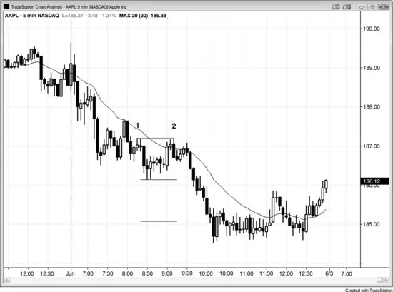

## Chapter 16: Counting the Legs of Trends and Trading Ranges

<!-- Source PDF pages 286–289 -->

<!-- PDF page 286 -->

Chapter 16
Counting the Legs of Trends and Trading
Ranges
Trends often have two legs. If the momentum on the first leg after the
reversal is strong, both the bulls and the bears will wonder if it will be the
first of possibly many legs, creating a new trend. Because of this, both bulls
and bears will expect that a test of the old trend's extreme will fail and the
with-trend (with the old trend) traders will be quick to exit. For example, if
there is a strong move up after a protracted bear trend, and this up move
goes above the moving average and above the last lower high of the bear
trend and contains many bull trend bars, both the bulls and the bears will
assume that there will be a test of the low that will hold above the bear low.
Once the momentum of this first up leg wanes, bulls will take partial or full
profits and bears will short, just in case the bears are able to maintain
control of the market. The bears are not certain if their trend is over and will
be willing to initiate new short positions. The market will work down since
buyers will be reluctant to buy until there is more bullish price action. As
bulls come back in on the pullback that is testing the low, the new bears will
be quick to exit because they don't want to take a loss on the trade. The
buying by the bears covering their shorts will add to the upward pressure.
The market will then form a higher low. The bears will not consider
shorting again unless this leg falters near the top of the first up leg (a
possible double top bear flag). If it does, the new bulls will be quick to exit
because they won't want a loss, and the bears will become more aggressive
since they will sense that this second leg up has failed. Eventually, one side
will win out. This kind of trading goes on all day long in all markets and
creates a lot of two-legged moves.
In fact, after the market makes a move of any size in one direction, it will
eventually try to reverse that move and will often make two attempts at the

<!-- PDF page 287 -->

reversal. This means that every trend and every countertrend move has a
good chance of breaking down into two legs, and every leg will try to
subdivide into two smaller legs.
When you are looking for a two-legged move and see one but the two
legs are in a relatively tight channel of any kind, such as a wedge, they
might in fact be subdivisions of the first leg and the channel may actually
be only the first of two legs. This is especially true if the number of bars in
each of the two legs looks inadequate compared to the pattern it is
correcting. For example, if there is a wedge top that lasts for two hours and
then a three-bar bear spike and then a three-bar channel, it is likely that the
spike and channel together will be only the first leg down, and traders will
be reluctant to buy heavily until after they see at least one more leg down.
Figure 16.1 Two-Legged Moves

In Figure 16.1, the bear trend down to bar 6 occurred in two legs and the
second leg subdivided into two smaller legs. The move up to bar 9 was also
in two legs, as was the move down to bar 12. All spike and channel patterns

<!-- PDF page 288 -->

are two-legged moves by definition, because there is a high-momentum
spike phase and then a lower-momentum channel phase.
Bar 12 was a perfect breakout test of the start of the bull move. Its low
exactly equaled the high of the bar 6 signal bar, running the breakeven stops
of the bar 6 longs by one tick. Whenever there is a perfect or near-perfect
breakout test, the odds are high that the market will make about a measured
move (expect the move up from the bar 12 low to be equal in points to the
move from bars 6 to 9).
There was a two-legged move up to bar 15, but when its high was
surpassed, the market ran up quickly in a bull spike as the new shorts had to
buy back their positions from the failed low 2 off the bar 15 short setup. Bar
9 had formed a double top bear flag with bar 3, and its failure on the rally
up from bar 16 also contributed to the bull breakout.
Figure 16.2 Double Top Bear Flag

Apple (AAPL) was a well-behaved stock on the 5 minute chart shown in
Figure 16.2. It formed a double top bear flag at bar 2 (1 cent below the high
of bar 1), and the move down more than met the approximate target of

<!-- PDF page 289 -->

twice the height of the trading range. Bar 2 was also the top of a two-legged
move up to the moving average in a bear trend, forming a bear low 2 short
at the moving average, which is a reliable entry in a trend. Trends in many
stocks are very respectful of the moving average, which means that the
moving average provides opportunities all day long to enter in the direction
of the trend with limited risk. Four bars after bar 2 set up a double top
pullback short.
Figure 16.3 Wedge Top

In Figure 16.3, the SPY had a wedge top created by bars 4, 6, and 10, which
is usually followed by a two-legged sideways to down correction. There
was a three-bar bear leg that ended at bar 11 and a second leg down that
ended at bar 13. This move was in a channel and would be just a single leg
on a higher time frame chart. It was comparable in size to the leg up from
bar 7 to bar 10 and therefore most traders would not be confident that it
contained enough bars to adequately correct the large wedge. The market
had a second sideways corrective leg to bar 15, slightly above the bar 13
low, creating a double bottom that was followed by a bull spike and channel
up to a new trend high.
