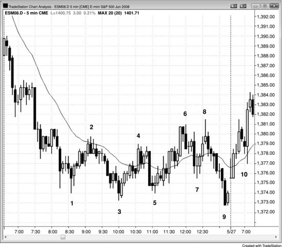
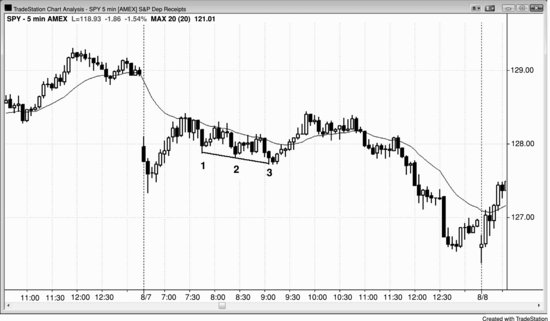
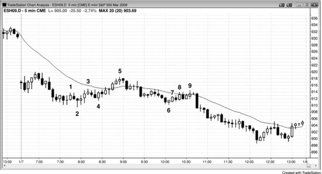
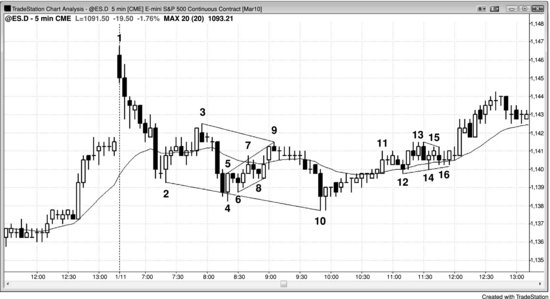
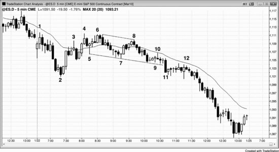

## Chapter 18: Wedge and Other Three-Push Pullbacks

<!-- Source PDF pages 333–343 -->

<!-- PDF page 333 -->

Chapter 18
Wedge and Other Three-Push Pullbacks
When a pullback forms in a bull trend, it is a bull flag, and when it occurs in
a bear trend, it is a bear flag. It is often contained between a converging
trend line and trend channel line. When this is the case and it is horizontal,
it is a triangle, which can break out in either direction. However, when it is
falling in a bull trend or rising in a bear trend, it is called a wedge, and, like
all pullbacks, it will usually break out in the direction of the trend. Like
other types of triangles, it has at least five legs, but unlike a typical triangle,
the second leg often exceeds the prior swing point. It can be just a simple
three-push wedge pattern or a channel after a spike. It can also assume an
irregular shape that looks nothing like a wedge but has three countertrend
pushes, which is all that is needed to qualify as a triangle, or, if it is sloping,
a wedge type of triangle, or simply a wedge.
A wedge pullback is a with-trend setup, and traders can enter on the first
signal, as soon as the market reverses back into the direction of the trend.
Wedges can also be reliable reversal patterns, but unlike a wedge pullback,
a wedge reversal is a countertrend setup and it is therefore usually better to
wait for a second entry. For example, unless a wedge top is extremely
strong, traders should wait for the bear breakout and then assess its strength.
If it is strong, they can then look to see if there is a breakout pullback short
setup, which they can short. The pullback can come as either a higher high
or a lower high. If the breakout is weak, traders should expect it to fail and
then look for a buy setup, so they can enter on the failed bear breakout for a
resumption of the bull trend.
If a wedge reversal forms in a bull trend, the wedge is pointed up, unlike
a wedge pullback in a bull trend, which is pointed down. A wedge bottom
in a bear trend is pointed down, unlike a wedge bear flag, which is pointed
up. Also, wedge flags are usually smaller patterns and most last about 10 to
20 bars. Since they are with-trend setups, they don't have to be perfect, and

<!-- PDF page 334 -->

many are subtle and look nothing like a wedge or any other type of triangle,
but have three pullbacks. A reversal usually needs to be at least 20 bars long
and have a clear trend channel line to be strong enough to reverse a trend.
Wedges can also form in trading ranges, and when they do they usually
share characteristics of wedge flags and wedge reversals. If the wedge is
strong and there is clear two-sided trading, entering on the first signal is
usually profitable. However, whenever you have any reasonable doubt, wait
for a second signal. Wedge reversals are discussed in detail in the chapter
on trend reversals in book 3.
When a wedge occurs as a pullback in a trend and the trend then resumes,
its breakout reverses the countertrend action back into the direction of the
trend. Remember, a wedge is usually the end of a trend, and a pullback is a
small trend (but it is in the opposite direction of the larger trend), so it
makes sense to view a wedge pullback as similar to a wedge reversal. In
general, if a wedge is sloping up and to the right, whether it is a pullback in
a bear trend or a top in a bull trend, it can be thought of as a bear flag even
if there was no prior bear trend, since it will usually break out to the
downside. This is because the behavior of its breakout and the followthrough after the breakout are indistinguishable from those of bear flags in
strong bear trends. If it is sloping down and to the right, it can be thought of
as a bull flag whether it is an actual bull flag or at the bottom of a bear
trend, and it usually results in an upside breakout. As is discussed later, a
low 3 is functionally the same as a wedge top and in fact often is an actual
wedge, and a high 3 should be traded like a wedge bottom.
A strong trend sometimes has a three-legged pullback midday that lasts a
couple of hours and lacks much momentum. Sometimes it is a spike and
channel pattern, which is a common type of wedge pullback. The channel
often has parallel lines instead of a wedge shape, but it still is a reliable
with-trend setup. It does not matter whether you call it a pullback, trading
range, triangle, flag, pennant, wedge, or anything else because the exact
shape is irrelevant and all of these pullback variations have the same
significance. What is important is that the third swing traps countertrend
traders into a bad trade because they mistakenly assumed that the third leg
was the start of a new trend. This is because most pullbacks end with two

<!-- PDF page 335 -->

legs and whenever there is a third leg, traders wonder if the trend has
reversed.
Figure 18.1 Wedge Bear Flag and Expanding Triangle

A strong trend is often followed by a three-swing pullback that typically has
low momentum. In Figure 18.1, bars 4, 6, and 8 are the tops of the three
pullbacks after the bar 3 new low, and each was a bull trending swing
(higher lows and highs). Since there were many bars that overlapped the
prior bars, many bars with tails, and many bear trend bars, the upward
momentum was weak. This will make traders short each new high.
There was also an expanding triangle (bars 1, 2, 3, 8, and 9). The long
entry setup was the inside bar after bar 9, but this was the final bar of the
day. However, the next day gapped up above the signal bar (don't buy on
the gap up; take an entry only if the entry bar opens below the high of the

<!-- PDF page 336 -->

signal bar and then trades through your buy stop), so there was no entry
until the bar 10 breakout pullback the next day.
Figure 18.2 Wedge Bear Flag

As shown in Figure 18.2, bars 9, 15, and 22 formed a large bear flag and
formed the middle leg of a three-swing sequence in the 5 minute QQQQ,
which unfolded over three days (a bear trend, followed by a three-push
rally, and then a test of the bear trend's low). Even though the upward
momentum was good, it was actually minor compared to the size of the
prior bear trend, whose low almost certainly would be tested. The test of the
low occurred on the open of the third day. The wedge up to bar 22 was just
a large bear flag and it could easily be seen as such on a 15 or 60 minute
chart.
The wedge reversal attempt at bar 4 was too small to lead to a major
reversal, and traders could have only scalped it and only after a higher low.
However, the bar 6 higher low occurred too late in the day to trade.
As the market entered the large trading range, there were many wedge
pullbacks that led to tradable scalps. Since the market was in a trading
range, traders could enter on the reversal and they would not have to wait
for a second signal. However, when a wedge is steep, it is usually better to
wait. For example, the bars 11, 13, and 15 wedge was in a fairly tight bull
channel and some traders might have preferred to wait to short below the
bar 17 high for the expected second leg down.

<!-- PDF page 337 -->

Bars 14, 16, and 18 formed a wedge bull flag after the strong rally to bar
15, and traders could have bought above bar 18. However, since it was the
seventh down bar in a row, other traders would have preferred to wait to
buy above the bar 20 higher low.
Figure 18.3 Gap Up and Wedge Bull Flag

As shown in Figure 18.3, the large gap up in Apple (AAPL) was effectively
a steep bull leg (a bull spike). This was followed by three pullbacks, the
third of which was a failure swing (it failed to go below the prior low). It
can be called a wedge for simplicity's sake, although it does not have a good
wedge shape. The gap up was the spike, and the sideways move to bar 3
was the pullback that led to the bull channel. This is a variant of a trend
resumption day where here the first bull leg was the gap opening.
Deeper Discussion of This Chart
As shown in Figure 18.3, traders should swing part or all of their longs from the bar 3 entry,
expecting approximately a measured move up equal to about the height of the gap spike (the
low of the last bar of yesterday to the high of the first bar of today). The measured move
could also be a leg 1 = leg 2 type, with bar 3 being the bottom of the second leg up.
Figure 18.4 Wedge Bear Flag

<!-- PDF page 338 -->

In Figure 18.4, Lehman Brothers Holdings (LEH) had a large reversal day
at bar 1, which was on huge volume and was widely reported as strong
support and a long-term bottom.
Bar 8 was the end of a wedge pullback (bars 4, 6 or 7, and 8) and of a
small three-push pattern (bars 6, 7, and 8). It was also a double top bear flag
with bar 2 (bar 8 was 24 cents higher, but close enough on a daily chart).
Bar 1 was a sell climax, which is a spike down followed by a spike up.
The market often then goes sideways as the bulls continue to buy and
attempt to generate a bull channel, and the bears continue to sell as they try
to create a bear channel. Here, the bears won and the bulls had to sell out of
their longs, adding to the selling pressure. The stock soon traded below the
huge bar 1 reversal bar, and LEH, the third largest investment bank in the
country, went out of business within a few months.
Bar 1 is an example of a one-bar island bottom, where there was an
exhaustion gap before it and a breakout gap after it.
Figure 18.5 Higher High Breakout Pullback from Wedge Bear Flag

<!-- PDF page 339 -->

As shown in Figure 18.5, there was a two-legged correction up to bar 6 and
the first leg ended at bar 5. Bar 5 was a wedge, but, as is often the case, it is
effectively two legs, with the second one being made of two smaller legs
(bars 4 and 5). The move to bar 1 was a small spike and then bars 2, 4, and
5 were three pushes up in a channel. The sell-off from bar 5 was a breakout
below the bull channel, and the pullback from that breakout was the higher
high at bar 6.
There was a second three-legged correction up from bar 7. It doesn't
matter if you see this as a triangle or as two legs, one from bars 7 to 8 and
the other from bars 9 to 11 with the second leg being made of two smaller
legs. Three-legged corrections are common in trends, and sometimes they
are really just two legs with the second leg having two smaller legs. When it
gets this hard to think about it, stop thinking about anything other than the
trend and the market's inability to get much above the moving average.
Look for short entries and don't worry too much about counting legs if those
thoughts are giving you an excuse to avoid placing orders.
Figure 18.6 Spike and Channel as Wedge Bull Flag

<!-- PDF page 340 -->

Sometimes a pullback can be a small spike and channel pattern, creating a
wedge bull flag (see Figure 18.6). Here, there was a bull move up and then
a small spike down to bar 1, which was the first push of the spike down,
and it was followed by two more pushes down. Channels after spikes often
end with three pushes, and this one became a wedge bull flag and a higher
low on the day. There was a second push up from bar 3, and it was about
the same size as the rally off the low of the open (a leg 1 = leg 2 measured
move).
Do not be too eager to buy the high 2 after the second leg down when
both the first and second pushes down have strong momentum. A strong
first spike down often means that you should allow for a possible wedge
correction. Wait for a pullback from the breakout above the high 2 signal
bar (here, the two-bar reversal at bar 2). That second-entry setup can be a
higher low or, as it was here, a lower low, which formed a wedge bull flag.
As with all spike and channel patterns, the minimum target is the start of
the channel, which was the high following bar 1, and there was enough
room for at least a long scalp. The market exceeded the minimum target and
tested the high of the opening rally where it formed a large double top bear
flag, which led to a bear trend into the close.
Figure 18.7 Wedge Flags

<!-- PDF page 341 -->

Three-push pullbacks often set up reliable with-trend entries (see Figure
18.7).
Bar 1 was a low 2, and it became the first of three pushes up in a bear
rally. It does not matter that bar 2 was below the low of the bar that led to
the bar 1 push up, and in fact this is a common occurrence when a final flag
evolves into a larger pattern. Here, that larger pattern was a three-push-up
bear rally that ended in a first moving average gap bar at bar 5. It was also a
small spike and channel bull trend where the move to bar 3 was the spike
and the rally from bar 4 to bar 5 was the channel. A small spike and channel
is often a two-legged rally, and since it followed the bar 1 push up, those
two legs were the second and third legs of a wedge bear flag.
The gap down on the open was a bear spike, and the move down to bar 2
was the channel. Bar 5 tested the top of the channel and formed a double
top with it.
Bars 7 to 9 formed a three-push pullback that was a slightly rising tight
channel that stalled at the moving average. In general, only very
experienced traders should consider placing trades in tight trading ranges
because they are difficult to interpret and that lowers the odds of any
successful trade.
Bar 9 formed a double top bear flag with the fourth bar before bar 6,
which was the start of a bear channel after a bear spike.
Figure 18.8 Three-Push Patterns

<!-- PDF page 342 -->

There are several wedge pullbacks in the 5 minute Emini chart presented in
Figure 18.8. The three pushes down on bars 2, 4, and 10 created a typical
wedge reversal pattern, but since it was a large correction in a bull trend
that topped out at bar 1, it was a wedge pullback. The pullback lasted long
enough to constitute a small bear trend, but that bear trend was just a
pullback in a larger bull trend.
Bars 5, 7, and 9 were three pushes up in a channel and formed a
correction of the brief strong move down from bar 3 to bar 4. You can use
the extremes of the bars or the tops or bottoms of the bodies to draw the
lines. Since the shapes of wedge pullbacks are so often irregular, inexact
trend lines and trend channel lines are the rule and not the exception.
Bars 12, 14, and 16 formed three pushes down in a sideways correction in
the rally up from bar 10. Triangles are a form of three-push pattern. Note
that the high of bar 13 exceeded the bar 11 high. The rally after the first
push down often exceeds the swing high that just preceded it.
Once bar 9 became a bear reversal bar, you could have drawn a best fit
trend channel line with the bar 5 high, and it does not matter that the bar 7
high was above the line. Similarly, once the market formed the bull inside
bar after bar 10 and set up the wedge bottom buy, you could have connected
the bottoms of bars 2 and 10 to highlight the wedge, and it is irrelevant that
the bar 4 second push down was below the line.
Figure 18.9 Failed Wedge Bull Flag

<!-- PDF page 343 -->

In Figure 18.9, the 5 minute Emini tried to form a wedge bull flag but
failed. Bars 5, 7, and 9 were three pushes down, setting up a wedge bull flag
long, but there was no reliable signal bar to go long around bar 9. This
would have created a double bottom with the pullback after bar 3. Instead
of forming a strong bull reversal setup, the market entered a small, tight
trading range. The bar 11 downside breakout signaled the failure of the
wedge bottom and set up the possibility of about a measured move down.
Bar 11 became the spike for a protracted bear channel into the close.
