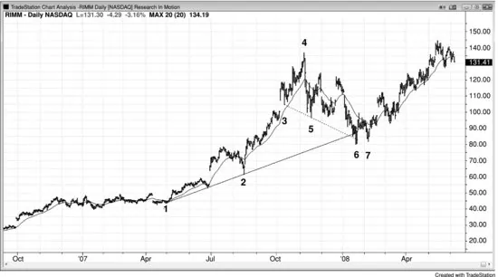
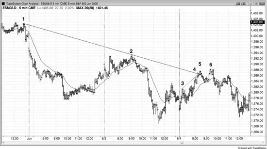
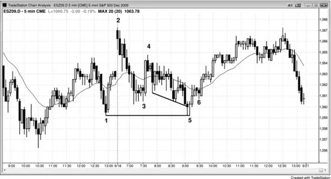

## Chapter 19: Dueling Lines: Wedge Pullback to the Trend Line

<!-- Source PDF pages 344–347 -->

<!-- PDF page 344 -->

Chapter 19
Dueling Lines: Wedge Pullback to the
Trend Line
When a pullback is contained by a trend channel line and it ends at a higher
time frame support or resistance line, this is a dueling lines pattern, and it
often results in a reliable trade in the direction of the larger trend. It is a
short-term trend (a pullback) ending at the long-term trend's support (in a
bull trend) or resistance (in a bear trend). All pullbacks end in dueling lines
patterns, although the support or resistance line is not always obvious. Any
type of support or resistance can be the area where strong hands will come
in and put an end to the pullback. Whenever traders see a pullback
approaching a trend line, a trend channel line, a moving average, a prior
swing low or high, or any other key price level, they should be alert for a
setup that will lead to the end of the pullback and the resumption of the
trend. When they see the setup, they are in a position to make a great trade.
Remember, trading is becoming increasingly controlled by mathematics,
and pullbacks end for a reason. A pullback in a bull trend always ends at a
support level, and a pullback in a bear trend always ends at a resistance
level, and therefore all pullbacks are dueling lines patterns. However, I
reserve the term for those pullbacks where the support or resistance is seen
by the trader, so that he can anticipate the possible trend resumption and
place a trade. The most reliable form is when the pullback is in a channel
and it has a wedge shape or three pushes, and the signal bar for the end of
the pullback is a bar that pokes through the trend line and reverses. For
example, if there is a bull trend and it is having a wedge bull flag pullback
that is ending at the bull trend line, the trend channel line below the wedge
bull flag is falling and it is intersecting the rising bull trend line exactly as
the pullback is setting up a buy signal. The support line could be a
horizontal line, like across a prior swing low, and this could set up a double

<!-- PDF page 345 -->

bottom buy signal as the wedge is ending. The support could also come in
the form of the moving average. When this happens, look to enter in the
direction of the trend if there is an adequate setup.
As another example, look at a bear channel to see if there is a leg up
within the channel. If so, look to see if that leg has three pushes. If the small
bear rally is testing the bear trend line as it is also testing the trend channel
line drawn across its highs, the odds are good that the leg up will end and
the market will reverse down to test the lower end of the channel. If the
market does turn down at this point, it is doing so because of the
simultaneous testing of two resistance lines, even though one is rising and
the other is falling, and having two types of resistance affecting the market
at the same time increases the chance of a profitable trade.
Figure 19.1 Dueling Lines Pullback

All pullbacks end in dueling lines patterns, even if the long-term support is
not readily seen. A pullback is a small trend in the opposite direction from
the larger trend. All pullbacks always end for a reason, and a bull pullback
always ends at some longer-term support, like a trend line, a measured
move, or a prior swing high or low. In Figure 19.1, a bear trend channel line
drawn between bars 3 and 5 created support for bar 6. All swing points
should be considered when drawing trend lines and trend channel lines,
even those from a prior trend. Bar 3 was a swing low in a bull trend, and bar
5 was a swing low in the correction of a possible new bear trend. The move

<!-- PDF page 346 -->

down to bar 6 became just a large two-legged correction in the bull market.
There were dueling lines at bar 6 (a bull trend line and a bear trend channel
line of opposite slopes) and the market reversed up at the intersection, as is
common. Since the move down to bar 6 was steep, it was reasonable to wait
for the second entry at the bar 7 higher low, buying on a stop at one tick
over its high.
A bear trend channel line could also have been based on a trend line
drawn across the two swing highs that followed the bar 4 high, and then
anchored to bar 5. The goal is to look at the overall shape and then choose
any trend channel line that contains the price action. Then, watch how the
market reacts after penetrating the line.
Deeper Discussion of This Chart
Bar 6 was a wedge bull flag in Figure 19.1. There was also a double top bear flag before the
move down to bar 6, and a double top bear flag after a bull top can be thought of as a lower
high that has two peaks.
Figure 19.2 Dueling Lines

As shown in Figure 19.2, bar 5 tested the bear trend line and as it did there
was an overshoot of a smaller bull trend channel line (from bar 3 to bar 4),
resulting in a short scalp off the dueling lines pattern. There was a second
entry at the bar 6 nominal higher high. Since the move up to bar 5 was so

<!-- PDF page 347 -->

strong, it is not surprising that after the market broke below the steep bull
channel and tested the moving average, it had a breakout pullback to the
higher high at bar 6. The channel is not shown, but it is the one that
followed the bull spike up to bar 3.
Figure 19.3 Dueling Lines Variant

Figure 19.3 is a variant of dueling lines where the long-term support came
in the form of a horizontal line at a prior swing low and the result was a
double bottom. This led to a reversal up from the new low of the day on this
trading range day. The sell-off on the open was a bear spike, and the move
from bar 4 to bar 6 was a channel.
Deeper Discussion of This Chart
The market broke out above a swing high in Figure 19.3, but the first bar of today was a
bear trend bar and set up a failed breakout short. This was also an expanding triangle top,
using either yesterday's 11:05 or 11:55 a.m. PST bar for the first push up. There was a spike
up to bar 4, followed by a lower low pullback to bar 5, which formed a double bottom bull
flag with bar 1. This led to a three-hour rally (the channel up from bar 5 after the bar 4 bull
spike) and then a sell-off into the close. Even though it was a trading range day, it appears as
a bear trend day on the daily chart because it opened near the high and closed near the low.
