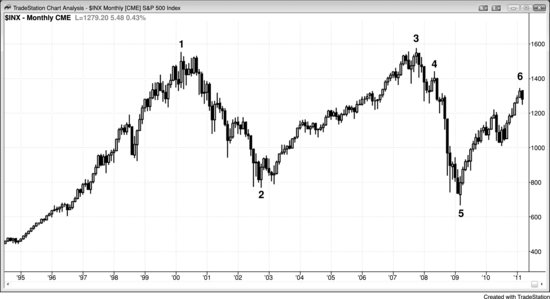
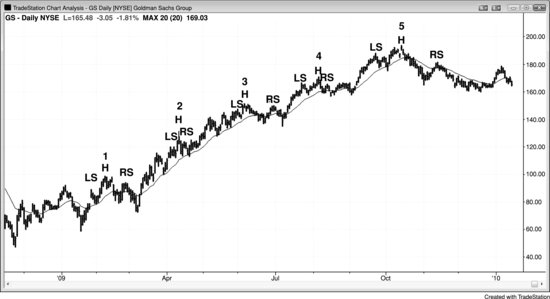
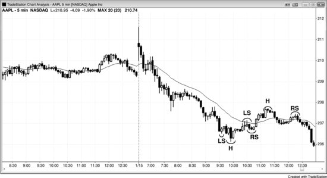

## Chapter 20: “Reversal” Patterns: Double Tops and Bottoms and Head and Shoulders Tops and Bottoms

<!-- Source PDF pages 348–353 -->

<!-- PDF page 348 -->

Chapter 20
“Reversal” Patterns: Double Tops and
Bottoms and Head and Shoulders Tops and
Bottoms
Since trends are constantly creating reversal patterns and they all fail except
the final one, it is misleading to think of these commonly discussed patterns
as reversal patterns. It is far more accurate to think of them as continuation
patterns that rarely fail but, when they do, the failure can lead to a reversal.
It is a mistake to see every top or bottom as a great reversal setup, because
if you take all of those countertrend entries, the majority of your trades will
be losers and your occasional wins will not be enough to offset your losses.
However, if you are selective and look for other evidence that a trend might
reverse, these can be effective setups.
All head and shoulders tops and bottoms are really head and shoulders
continuation patterns (flags) because they are trading ranges and, like all
trading ranges, they are much more likely to break out in the direction of
the trend and only rarely reverse the trend. The same is true for double tops
and bottoms. For example, if there is a head and shoulders top in a bull
market, a breakout below the neckline will usually fail and the market will
most likely then reverse up and have a with-trend breakout to the upside,
above the right shoulder. The pattern becomes a triangle if it is mostly
horizontal or a wedge bull flag if it is slightly sloping down. The three
pushes down are the down legs after the left shoulder, the head, and the
right shoulder. The right shoulder is an attempt to form a lower high after
the move down from the head breaks the bull trend line. Since the move
down from the head usually breaks below the bull trend line, the right
shoulder becomes a lower high breakout pullback. Also, if there is a bear
market that is forming a trading range and that trading range assumes the

<!-- PDF page 349 -->

shape of a head and shoulders top, a break below the neckline is a withtrend breakout of a bear flag and is likely to lead to lower prices.
Similarly, head and shoulders bottoms also are with-trend setups. A head
and shoulders bottom in a bear trend is usually a triangle or a wedge bear
flag and should break out to the downside, below the right shoulder. A head
and shoulders bottom in a bull market is a bull flag and should break out to
the upside, above the neckline.
Figure 20.1 Monthly S&P Cash Index in a 12-Year Trading Range

There was a large double top in the monthly Standard & Poor's (S&P) cash
index as shown in Figure 20.1. In the summer of 2007 when the market
tested the 2000 high, all of those traders who had bought in the area of bar 1
wanted their money back. They had ridden through devastating losses down
to bar 2. However, by bar 3 they had recovered those losses and did not
want to risk another sell-off. They exited their positions and did not want to
buy again until after a significant pullback. With a large block of buyers out
of the market, short sellers took control and drove the market down. As so
often happens, when traders want to buy a pullback, the pullback is so deep
and violent that they change their minds, and this absence of buying
sometimes causes the selling to accelerate. The cause is obviously much
more complicated than this because there are countless participants acting
for countless reasons, but this is a component.

<!-- PDF page 350 -->

The market often finds support in the area of the previous low. Here, the
shorts who sold in the area of bar 2 were now back to around breakeven,
and their exit led to a bounce. At this point the market was in a trading
range, which could last a short or long time. Once a breakout arrived, it
could be up or down. The standard entry of a double top is on a sell stop
just below the low of the dip between the two tops. However, that is rarely
successful because 80 percent of breakouts fail. That dip was bar 2 and the
breakout below its low came six years later and failed. With the rally from
bar 5, it was clear that the double top was leading to a trading range and not
a bear breakout. Very few traders who saw this as a large double top waited
to short below bar 2. Most would have shorted around bar 3 or around the
bar 4 lower high and low 2 that formed seven months later.
Over the next few years, the market could test down to around bar 5 after
a double top pullback short setup, or even a head and shoulders top where
the left shoulder is only slightly below the head. Since most tops fail, it is
likely that it would then be followed by a rally, and the entire pattern would
be a large wedge bull flag. This would then be followed by a breakout of
the top of the pattern and an approximate measured move up over the next
decade or two.
Incidentally, there were a couple of successful small double tops. The
lower high that followed the bar 1 wedge formed a double top with bar 1.
Also, the second push up to the bar 3 wedge was a double top with bar 3,
even though it was a little lower than the bar 3 high.
Figure 20.2 Most Head and Shoulders Tops Are Bull Flags

<!-- PDF page 351 -->

There were multiple head and shoulders tops on the Goldman Sachs (GS)
daily chart shown in Figure 20.2. Head and shoulders formations have
likely cost more beginning traders money than just about any other pattern,
and this is probably due to so many pundits calling them reversal patterns
when they are almost always continuation patterns. Head and shoulders tops
are really triangles or wedge bull flags and are reliable buy setups. They are
wedges because they have three pushes down, one after the left shoulder, a
second after the head, and the third after the right shoulder. Since they are
horizontal trading ranges in a bull trend, it makes sense that they should
behave like any other trading range in a bull trend and lead to a bull
breakout. Sometimes, like all continuation patterns, they fail to lead to a
with-trend breakout and a reversal follows, and it is therefore misleading to
attach terms like top, bottom, or reversal to them. These terms make traders
look to do the opposite of what they should be doing, and it is therefore
better not to use them. When you see one setting up in a bull trend, it is
better to think of it as a wedge bull flag and call it that, because then you
are looking to buy a pause in a bull trend, which is a profitable strategy. You
should not call it a head and shoulders top since it is almost certainly not a
top. Likewise, if you see a head and shoulders bottom forming in a bear
trend, it is more accurate to instead call it a triangle or a wedge bear flag
because this will make you look to short, which is the best way to make
money in a bear trend.

<!-- PDF page 352 -->

The market is always trying to reverse, and the reversal attempts usually
end when they are on the verge of reversing the always-in direction. All of
the head and shoulders tops above are perfect examples. Many broke to the
downside, but that is not enough for traders to believe that the trend has
reversed. Traders also want to see follow-through. Since experienced
traders know that most downside breakouts will not have follow-through,
they look at these bear breakouts as great buying opportunities. Just as
overly eager weak bears are shorting the strong bear trend bars that break
below the necklines, triggering the head and shoulders top “reversal,” the
strong bulls step in and buy aggressively, correctly believing that the bear
reversal will likely fail and simply become a bull flag.
Figure 20.3 Head and Shoulders Top and Bottom Bear Flag

There was a failed head and shoulders bottom and a head and shoulders top
bear flag in Apple (AAPL), as shown in Figure 20.3. The market was in a
trend from the open bear trend and attempted to form a head and shoulders
bottom (left shoulder, head, right shoulder), which, as expected, failed to
reverse the market and instead evolved into a larger bear flag. The third
push up of the wedge bear flag became the head of a head and shoulders top
bear flag. The head of that head and shoulders top was the end of a twolegged rally that ended at a first moving average gap bar at 11:15 a.m. PST.
The market tried to form a higher low after that head, but it failed and the
small rally became the right shoulder, which was a breakout pullback from

<!-- PDF page 353 -->

the channel up to the head. The breakout led to the test of the bear low,
which was expected after a first moving average gap bar in a strong bear
trend.
