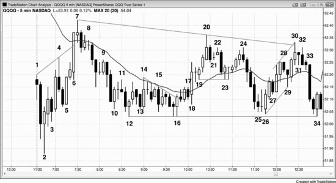

## Chapter 21: Example of How to Trade a Trading Range

<!-- Source PDF pages 398–408 -->

<!-- PDF page 398 -->

Chapter 21
Example of How to Trade a Trading Range
When the market is in a trading range, traders should be guided by the
maxim “Buy low, sell high.” Also, think of your trades as scalps and not
swings. Plan to take small profits and do not hold on hoping for a breakout.
The rallies to the top usually look like they will become successful
breakouts into a bull trend, but 80 percent of them fail, and 80 percent of
the strong sell-offs to the bottom of the range fail to break out into a bear
trend. Try to keep your potential reward at least as large as your risk so your
winning percentage does not have to be 70 percent or higher. Since the
market is two-sided, there will often be pullbacks after you enter and before
you exit, so do not take a trade if you are unwilling to sit through a
pullback. If the market has been going up for five to 10 bars in a trading
range, it is usually far better to look only for shorts and to take profits on
longs. If it has been going down for a while, look to buy or to take profits
on shorts. Rarely enter on stops in the middle of the range, but it is
sometimes reasonable to enter on limit orders there.
Among the best trade setups, beginners should focus on entries that use
stops so that the market is going in their direction when they enter:
Buying a high 2 near the bottom of the range. These are often
second attempts to reverse the market up from the bottom, like a
double bottom.
Selling a low 2 near the top of the range. These are often second
attempts to reverse the market down from the top, like a double
top.
Buying at the bottom of a trading range, especially if it is a second
entry after a break above a bear trend line.
Shorting at the top of a trading range, especially if it is a second
entry after a break below the bull trend line.
Buying a wedge bull flag near the bottom.

<!-- PDF page 399 -->

Selling a wedge bear flag near the top.
Buying a bull reversal bar or reversal pattern like a final flag
(discussed in book 3) after a break below a swing low at the
bottom of the range.
Selling a bear reversal bar or reversal pattern like a final flag
(discussed in book 3) after a break above a swing high at the top
of the range.
Buying a breakout pullback after an upside breakout near the
bottom of the range (for example, if the market starts up and pulls
back, look to buy above the high of the prior bar).
Selling a breakout pullback after downside breakout near the top
of the range (for example, if the market starts down and pulls
back, look to sell below the low of the prior bar).
Entering using limit orders requires more experience reading charts,
because the trader is entering in a market that is going in the opposite
direction to the trade. Some traders trade smaller positions and scale in if
the market continues against them; but only successful, experienced traders
should ever attempt this. Here are some examples of limit or market order
trade setups:
Buying a bear spike at the market or on a limit order at or below
the low of the prior swing low at the bottom of the range (entering
in spikes requires a wider stop and the spike happens quickly, so
this combination is difficult for many traders).
Selling a bull spike at the market or on a limit order at or above
the high of the prior swing high at the top of the range (entering in
spikes requires a wider stop and the spike happens quickly, so this
combination is difficult for many traders).
Buying at the close or below the low of a large bear trend bar near
the bottom of the range, since it is often an exhaustive sell climax
and the end of the sell-off in a trading range.
Selling at the close or above the high of a large bull trend bar near
the top of the range, since it is often an exhaustive buy climax and
the end of the rally in a trading range.
Buying at or below a low 1 or 2 weak signal bar on a limit order at
the bottom of a trading range.

<!-- PDF page 400 -->

Shorting at or above a high 1 or 2 weak signal bar on a limit order
at the top of a trading range.
Buying a bear close at the start of a strong bull swing.
Selling a bull close at the start of a strong bear swing.
Figure 21.1 Fading Extremes for Scalps in Trading Ranges

There are many ways to trade a trading range day like the one in QQQ
shown in Figure 21.1, but, in general, traders should look to fade the
extremes and only scalp. Although there are many signals, traders should
not worry about catching all of them or even most of them. All a trader
needs is a few good setups a day to begin to become profitable.
I have a friend who has traded for many decades and who does extremely
well on days like this. I have watched him trade the Emini in real time, and
he would take about 15 profitable one-point scalps on a day like this, all
based on fades. For example, in the bar 10 to bar 18 area, he would try to
buy with limit orders below everything, like as the market fell below bar 10,
as bar 13 went below the bear bar before it, and as bar 15 fell below the bar
before it, and he would have added on as it fell below bar 13. He would
have bought more as the market dipped below bar 15, and he would have
tried to buy if the market fell below bar 12. It is important to remember that
he is a very experienced trader and has the ability to spot trades that have a
70 to 80 percent chance of success. Very few traders have that ability, which
is why beginners should not be scalping for one point while risking about

<!-- PDF page 401 -->

two points. At a minimum, they should take trading range trades only where
they believe the probability of success of an equidistant move is at least 60
percent. Since they would have to risk about two points on this chart, they
should trade only if they are holding for at least a two-point profit. That
means that they should look to buy near the bottom of the range and short
near the top.
If traders bought near the bottom of the range, they should look to take
profits near the top of the range. They should also look to initiate shorts
near the top of the range and take profits on those shorts when the market
moves toward the bottom of the range. Reversing is too difficult for most
traders, and instead they should use profit targets for exits and then look for
a trade in the opposite direction. For example, if they bought on bar 16 as it
went above the high of the prior bar and triggered the double bottom bull
flag entry, they could have a sell limit order to exit with a 10, 15, or 20 cent
profit on the move up to bar 20. After they exited, they could then look for
a short setup, like below the bar 22 lower high or below the bar 24 lower
high. The latter was a better setup because it had a strong bear reversal bar
and it was a double top bear flag with bar 22.
So when did traders conclude that this was a trading range day? Everyone
is different, but there are often clues early on, and as more accumulate,
traders become more confident. There were signs of two-sided trading right
from the first bar, and other signs accumulated on just about every
following bar. The first bar of the day was a doji, and that increased the
chances of a trading range day. The market reversed up at bar 3 but had
weak follow-through on the move up to bar 4. The first three bars had tails
at their lows, and bar 2 overlapped about half of the prior bar. Bar 3 was a
reversal down immediately after the long entry, and the next bar was a
reversal up. The market reversed down again at bar 4 and up again at bar 5,
and down again at bar 7 at the moving average. Whenever the market has
four or five reversals in the first hour, the odds of a trading range day
increase.
Bar 6 was a strong bull trend bar but there was no follow-through. It
stalled at the moving average, and the next bar was a doji instead of another
strong bull trend bar with a close well above the moving average. The next
bar was a bear trend bar, and the two bars after also failed to close above the

<!-- PDF page 402 -->

moving average. The bulls were not in control, despite a strong rally, so the
market was two-sided.
Bar 2 was the start of a two-bar bull spike, and it was followed by a threepush bull channel up to bar 7. Since bar 2 was a strong bull reversal bar
after a gap down and a sell-off, it was a good opening reversal and a
possible low of the day. The day could have become a strong bull trend day
but instead went sideways. However, it never dropped below the entry bar
low.
Bar 2 was the first bar of a two-bar bull spike, and bars 4 and 7 were the
second and third pushes up in a wedge channel after the spike. A channel in
a spike and channel pattern is the first leg of a trading range, so most traders
assumed at this point that the market would be in a trading range for at least
the next 10 to 20 bars and maybe for the rest of the day. They looked to buy
a two-legged sell-off that would test the bar 3 or bar 5 low, since those bars
formed the bottom of the bull channel. Even if they believed that the day
might become a trend day, they saw it as a trading range for the time being
and were therefore only scalping. Their scalping reinforced the trading
range, because when lots of traders are selling near the high and buying
near the low, it is very difficult for the market to break out into a trend.
Traders would have bought above bar 2 for at least a test of the moving
average. Some traders would have shorted the bar 4 bear reversal bar at the
new high of the day, but most would have assumed that the buying pressure
from the bar 2 reversal bar, the two-bar bull spike, and the bull bar before
bar 4 was strong enough for the market to test the moving average, even if
there was a pullback. Because of this, many traders placed limit orders to
buy at and below the bar 4 low, and they would have put their protective
stops below the long entry bar after bar 2 or even below the bar 2 signal bar
low. Some would have used a money stop, like around the height of an
average bar so far today, maybe 10 to 15 cents. Some traders might have
thought that the bears could have made a 10 cent scalp down from bar 4.
That would require a 12 cent move below bar 4, so they might have used a
13-tick stop. They would have assumed that the short would have been a
scalp, and therefore the bears would have had limit orders to buy back their
shorts at 11 cents below the bar 4 low so that they could scalp out 10 cents
on the shorts that they had entered on a stop at one tick below bar 4.

<!-- PDF page 403 -->

Alert traders would have placed a stop order to go long above the bear
entry bar after bar 4 since they knew that the bar 4 signal bar was strong
enough to entice shorts, and those shorts would be worried about a reversal
up to the moving average. They would have their protective stops above
their entry bar and not look to short again until the market reached the
moving average. This made buying above that entry bar a great long scalp.
The bulls doubted that the bar after bar 5 was a reliable short, so they
placed orders to buy one tick above, at, and below its low, expecting it to be
a failed lower high. Only the long limit orders at one tick above the low got
filled, which means that the bulls were very aggressive. The result was a
strong bull trend bar up to the moving average. This was a strong bull
breakout, but traders wondered why it stopped at the moving average
instead of going far above. They needed to see immediate follow-through or
they would suspect that this was going to be a failed breakout above the
opening high. Maybe bar 6 was just a buy vacuum caused by the strong
traders temporarily stepping aside. If they assumed that the market was
going to test the moving average, it made no sense for them to sell just
below the moving average. The absence of strong bulls and bears allowed
the market to race up. However, once the market reached the area where
they thought it was likely to stop, they appeared out of nowhere and sold
aggressively, overwhelming the weak bulls. The strong bulls sold out of
their longs for a profit, and the strong bears sold to initiate new shorts.
Bears who saw the day as a likely trading range day would have had limit
orders to sell as bar 6 moved above the moving average, while others would
have shorted its close. Some would have been willing to scale in higher,
especially after the weak follow-through on the next bar.
As the market traded down, it was clear to most traders that both the bulls
and the bears were strong and that the market was likely to remain twosided as both sides fought for control. This meant that a trading range was
likely. When the market got near the top, the bulls became concerned that it
was too expensive to buy and the bears saw it as a great value to short. This
made the market fall. The bears who were eager to short near the top were
not interested in shorting near the bottom, so selling dried up. The bulls
who were willing to buy in the middle saw the bottom of the range as an

<!-- PDF page 404 -->

even better value; they bought there aggressively, lifting the market back
up.
Bears were willing to short below the bar 7 test of the moving average. If
the bulls were strong, there should have been a strong move above the
moving average and not this stall. Bar 7 made bar 6 look more like
exhaustion than a strong breakout. Other bears shorted below the bar 8 ii
pattern or below the bear bar that followed bar 7. The two-bar bear spike
from the ii was reasonably strong, but it had a tail at its low, indicating
some buying. At this point, the market had a strong spike up from the low
of the day to bar 7 and now a strong spike down. Traders were expecting a
trading range.
Bar 9 was a bull trap. Most traders saw the doji inside bar before it as a
bad buy signal after the bear spike, and many placed limit orders to go short
at the high of the doji bar. They were looking for a pullback to the area of
the bottom of the bull channel around the bar 5 low. This was also in the
area of the bar 2 signal bar high, which was a magnet for a breakout test.
The bulls wanted a double bottom bull flag to develop in the bar 3 or bar 5
low area, but they also wanted the original entry bar low to hold (the low of
the bar after bar 2). Otherwise, they would have probably given up on the
belief that there was still a chance of a bull trend day.
Bar 10 was the third push down from the bar 7 high, and it was a strong
bull trend bar. Bulls were concerned that the move down was in a tight
channel and that the first breakout attempt might fail. Many bulls would
have waited for a breakout pullback before buying. Some who did buy
bought a smaller position, in case the market traded down closer to the bar 3
low, and they planned to buy more on a second signal up, which they got at
bar 12. Others thought that many traders would have a 10 cent stop on their
longs, so they placed a limit order to buy more 10 cents down, exactly
where those weak bulls would be exiting. They then would put a protective
stop on their entire position at maybe 10 more cents down, below the entry
bar after bar 2, or even below bar 2. The traders who were willing to risk to
a new low of the day might have traded even smaller to allow for a second
scaled-in long about 10 cents below their first.
The bar 12 bull reversal bar was an approximate double bottom with the
bar 3 or bar 5 low, and it was a second signal. This made it a high 2 near the

<!-- PDF page 405 -->

bottom of the trading range. It was the fourth push down from the high of
the day, and some traders saw it as a high 4 bull flag. The bear spike down
after bar 8 was the first push down for many traders, and bar 12 was the
third. Many spike and channel patterns end in a third push like this and then
try for a two-legged rally to test the top of the bear channel, which was
around the bar 9 high. Some traders thought that the move down to bar 12
was in too tight a channel to buy, and they would have waited for a clear
second signal. Many would not have bought until they got a relatively small
bar near the bar 12 low. These traders could have bought on bar 16 for the
double bottom bull flag. Bar 14 was strong enough to break above the bear
channel, and then the market had a two-legged pullback. Bar 16 was also
the entry for a wedge bull flag where bar 10 was the first push down and
bar 12 was the second. Others saw bar 13 as the first push down and bar 15
as the second. It was also a descending triangle, and bar 16 was the
breakout to the upside. Since it was a strong breakout bar, traders were
looking to buy a breakout pullback. They would have limit orders to buy at
or below the low of the prior bar and they would have been filled on bar 18.
Others would have bought the close of the bear bar 17 since they thought
that a breakout pullback and a higher low were more likely than a failed
breakout and a move below the bar 16 bottom of the trading range.
Traders used that same logic and bought below the bar after bar 12,
believing that it was a bad low 2 short since it was at the bottom of the
trading range, and it was after the second reversal up where both reversals
had good buying pressure (good bull reversal bars). Some would have
bought on the close of the bear bar after bar 12 or on the bear close of bar
13, expecting the bar 12 low to hold. Others would have bought above bar
13, thinking that there were trapped bears and therefore the market could
move up quickly as the bears covered.
Since this was a tight trading range, it was an area where both the bulls
and the bears saw value. Both were comfortable initiating trades there. In an
established area of value for both the bulls and the bears, breakouts usually
cannot go too far before the market gets pulled back into the range. It has a
strong magnetic pull, and bears will short more heavily above, while bulls
will buy more heavily below.

<!-- PDF page 406 -->

Bar 18 was a large bull trend bar that broke out above the trading range of
the past hour or so. However, since the overall day was in a larger trading
range and the market was now in the middle of that larger range, traders
were hesitant to buy. This resulted in the ii pattern. Some traders bought the
bar 12 close and the breakout above bar 12. Others bought during the ii and
above the bar 19 bull inside bar. Traders tried to buy on limit orders at and
below the low of the inside bar after bar 18 but they did not get filled. This
made them more willing to buy the breakout above bar 19. They saw that
their buy orders did not get filled below and thought that this was a sign of
urgency by the bulls.
The bar 18 breakout spike was followed by a small parabolic climax to
bar 20 where a two-bar reversal down set up. The entry was below the
lower of the two bars and it was not triggered until three bars later. Traders
who believed that the day was a trading range day were looking to short a
strong rally to near the high of the day. Bar 21 was a small doji and
therefore a weak high 1 buy setup, especially after a buy climax. Bears
shorted above its high. Others shorted below bar 22, where the bulls were
selling out of their longs. They had bought at the top of a trading range,
hoping for a bull breakout, and when it did not happen, they were quick to
exit. As they did, they triggered the two-bar reversal short at the bar 20
high.
The market fell to the moving average and formed a high 2 buy signal
with a bull reversal bar. This is a very reliable setup in a bull trend, but most
traders still saw the day as a trading range day. Many bought above bar 23
with the hope that the day would become a bull trend, but they planned to
exit quickly if there was not a strong bull breakout. They were concerned
that the bar after bar 23 was a doji inside bar, because they wanted a sense
of urgency, not hesitation.
They exited their longs, and bears shorted below the bar 24 bear reversal
bar, which formed a double top bear flag with bar 22. Some saw it as a low
2 short with bar 22 and others saw it as a wedge top where bar 20 was the
first push up and bar 22 was the second.
There was a strong bear spike to the bottom of the trading range, but bar
25 had a small bear body, indicating hesitation. The bulls were unable to
create a breakout, and the result was only a trading range. The trading range

<!-- PDF page 407 -->

failed to resist the magnetic pull of the bar 10 to 16 tight trading range. If
this was a strong bear trend, the market would not have hesitated once it got
back into the tight trading range from earlier in the day. Instead, it would
have fallen below it in a series of strong bear trend bars. This told traders
that the bears were not strong and that this might just be a sell vacuum.
Strong traders might have stepped aside, expecting a test of the bottom of
the range. Once the market got there, they began buying aggressively and
relentlessly, the bulls initiating new longs and the bears taking profits on
their shorts. They were determined to keep the market above the trading
range low. Bar 26 was a high 2 at the bottom of the trading range and a
strong bull reversal bar. Bar 25 was the high 1 setup. The bars 25 and 26
area formed a double bottom bull flag with the bars 12 to 16 area. This
second bottom was also the breakout pullback from the bar 10 to bar 17
tight trading range.
Bar 26 had good follow-through on the next bar, and traders expected this
test down to fail. Some bought the close of the bar 27 bear trend bar. Others
placed limit orders to buy at and below the bar 27 low. The buying was so
aggressive that the market could not even get to the bar 27 low. Alert
traders saw this and quickly placed orders to buy on a stop above the bar 27
high. This resulted in a breakout formed by two bull trend bars.
Bar 28 was a bear inside bar, but the move up from bar 26 was in a tight
channel so the first attempt down should fail. Bulls placed limit orders to
buy at and below the low of bar 28. The move down to bar 26 was a large
two-legged move where bar 23 ended the first leg. This was a large bull
flag, and the move up to bar 28 was the breakout. Bar 29 was the pullback
from that breakout, and it was also the failed breakout of the bottom of the
micro channel from bar 26 to bar 28.
Bar 30 was a dueling lines pattern, and bulls took profits as the market
went above the two lines, creating the tail at the top. Others exited on the
weak close and still others below the bar 31 two-bar reversal top.
Bar 31 was a doji and therefore a weak high 1 signal bar. Also, the spike
from bar 26 to bar 30 was not strong enough to be buying a second high 1
(bar 29 was the first), and the day was a trading range day, not a clear bull
trend day. Bears saw this as a bad high 1 at the top of a trading range and
they shorted at the bar 31 high.

<!-- PDF page 408 -->

Other bears shorted below the bar 32 bear reversal bar. Some saw bars 30
and 31 as a two-bar reversal and others ignored bar 31 and saw bars 30 and
32 as a two-bar reversal. It was also a micro double top. The market went
up on bar 30, down on bar 31, then up again on bar 32, and then down by
the close of the bar. The market also made three pushes up on the day where
bars 7 and 20 were the first two, so the day was a large triangle. The entry
bar after bar 32 broke below the bull trend line from bars 26 and 29
(although not shown), and the market sold off sharply into the close on the
second bar below the trend line.
There were many bull triangles between bars 10 and 16. Since the pattern
was forming above the bottom of the bull spike up to bar 7, many traders
thought that there might be a channel up that would test the bar 7 high at a
minimum. There were also several bull spikes in this trading range, creating
buying pressure and evidence for the bulls that the market was trying to
form a higher low. Since none of the triangles was perfectly clear, not all
traders agreed that any one was strong enough to make the market alwaysin long. Bars 10, 12, and 16 were three pushes down and formed a
descending triangle. Bars 13, 15, and 16 were also three pushes down and a
triangle. Some traders thought of it as a wedge bull flag. Another wedge
bull flag was formed by the bear bar that formed two bars after bar 14, bar
15, and bar 16.
