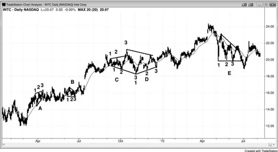

## Chapter 23: Triangles

<!-- Source PDF pages 439–444 -->

<!-- PDF page 439 -->

Chapter 23
Triangles
Triangles are trading ranges and therefore channels, since they are an area
of price action contained between two lines. The minimum requirement for
a trading range to be called a triangle is that it has three pushes up or down.
Since they have either higher lows or lower highs, or both in the case of an
expanding triangle, they also have some trending behavior. Wedges are
triangles that are either rising or falling. When they are just barely sloped,
traders refer to them as triangles, but when the slope is greater, they usually
call them wedges. A bull or bear flag can be a wedge and will usually just
become a continuation pattern. Wedges can also occur at the end of a trend
and form a reversal pattern. Because they behave more like flags or reversal
patterns than like traditional triangles, they are discussed in those sections
rather than here.
An expanding triangle is contained between two diverging lines, both of
which are technically trend channel lines because the upper line is above
the highs in a bull trend (higher highs) and the lower line is below the lows
in a bear trend (lower lows). An oo (outside-outside) pattern, where an
outside bar is followed by a larger outside bar, is a small expanding triangle.
A contracting triangle is contained between two trend lines, since the
market is in both a small bear trend and a small bull trend. An ii pattern is
usually a small triangle on a lower time frame chart. An ascending triangle
has a resistance line above and a bull trend line below; a descending
triangle has a support line below and a bear trend line above. A wedge is an
ascending or descending channel where the trend line and trend channel line
converge, and it is a variant of a triangle and therefore also a type of
channel. All triangles have at least three legs in one direction and at least
two in the other, and every pattern that has three legs and is sideways or
sloped and shaped like a wedge is a triangle. Unlike trend channels and
trading ranges that can extend indefinitely, when the market is in a triangle,

<!-- PDF page 440 -->

it is in breakout mode, meaning that a breakout is imminent. The breakout
can be strong or weak; it can have follow-through and result in a trend, or it
can fail and reverse, or it can simply go sideways and evolve into a larger
trading range.
Like all trading ranges, a triangle is a pause in a trend, and the breakout is
usually in the direction of the trend that preceded it. A triangle in a bull
trend usually breaks out to the upside, and a bear triangle usually breaks out
to the downside. Wedges can be more complicated. A bear wedge is a
downward-sloping wedge and, like all bear channels, is a bull flag. When a
downward-sloping wedge occurs within a larger bull trend, an upside
breakout is in the direction of the larger trend, as expected. However, a
large bear wedge can fill the entire screen, in which case the bars on the
screen are in a bear trend. The upside breakout is then a reversal and a
breakout against the trend on the screen. Whether or not there is a clear,
large bull trend just off the left side of the screen is irrelevant. Any down
wedge will behave like a large pullback in a bull trend, which means that it
will behave like a bull flag. An upside breakout is a reversal out of the bear
trend on the screen, but it is in the expected direction, since every bear
channel, whether or not the lines converge and create a wedge, functions
like a bull flag and should be thought of as a bull flag. Most, in fact, are bull
flags on a larger time frame chart.
Every trading range with three pushes is functionally identical to a
triangle. Most are triangles, but some don't have a clear triangle shape.
However, since they behave exactly like triangles, they should be traded as
if they were perfect triangles. Because they are more complex than onepush pullbacks (high 1 and low 1 pullbacks) and two-push pullbacks (high
2 and low 2 pullbacks), they represent stronger countertrend pressure. Since
traders in the opposite direction are getting stronger, these patterns tend to
occur late in trends and swings, and often become final flags. If a triangle
has more than three pushes, most traders begin to refer to the correction as a
trading range.
If a pattern is sloping and has three pushes, many traders erroneously see
it as a wedge and look for a reversal. However, as discussed in Chapter 18
on wedges, if the three-push pattern is in a tight channel, the pattern will
usually function like a channel and continue indefinitely, and not function

<!-- PDF page 441 -->

like a wedge and reverse. If a wedge has three pushes, that alone is not a
reason to trade in the opposite direction, however. When traders are not
certain if the wedge is about to reverse, they should not enter on the
breakout. For example, if there is a down channel that is fairly steep and the
trend and trend channel lines are convergent but fairly close together,
traders should not buy the first reversal up or the bull breakout of the
wedge. They should wait until the bull breakout occurs and then evaluate its
strength. If the breakout is strong (the characteristics of strong breakouts are
discussed in Chapter 2), they should wait for a pullback and then enter at
the end of the pullback (a breakout pullback buy). If there is no pullback for
several bars, then the market is forming a strong bull spike and has almost
certainly become always-in long in the eyes of most traders. They can then
trade it like they would any other strong breakout. They might buy the close
of a bar, buy above the high of the prior bar, buy any small pullback on a
limit order, or wait for a pullback.
Since most triangles are relatively horizontal, the bulls and the bears are
in balance, which means that they both see value at this price level. Because
of this, breakouts often do not go very far before reversing back into the
range, and triangles are often the final flag in a trend. If the breakout fails,
the market usually gets drawn back into the trading range and sometimes
breaks out of the opposite side and becomes a two-legged correction or
even a trend reversal. This trading range behavior is discussed more in the
Part IV discussion on trading ranges.
Since ascending, descending, and symmetrical triangles have the same
trading implications, it is not necessary to distinguish one from another, and
they can all be referred to as triangles. All of these triangles are mostly
horizontal. They tend to break out slightly more often in the direction of the
trend that preceded them, but not enough to place a trade on that basis
alone. Since each is a type of trading range, each is an area of uncertainty,
and it is better to wait for the breakout before placing a trade. However,
when the pattern is tall enough, you can trade it like a trading range and
fade the extremes, looking to buy near the bottom and sell near the top. The
breakouts often fail and, like breakouts from any channel, if the market
reverses back into the channel, it usually tests the opposite side. If it breaks
out in either direction, the breakout usually leads to a measured move

<!-- PDF page 442 -->

approximately equal in points to the height of the channel. If it goes beyond
that, the market is likely in a trend.
Expanding triangles can be reversal patterns at the end of a trend or
continuation patterns within a trend. Once they break out, the breakout
often fails and the market then reverses, breaks out of the other side, and
forms an even larger expanding triangle. The expanding triangle reversal
then becomes a continuation pattern, and an expanding triangle
continuation pattern then becomes a reversal. For example, if there is an
expanding triangle at the bottom of a bear trend, it is a reversal pattern.
Once the market rallies and breaks out of the top of the triangle, the
breakout often fails and the market then turns down again. The result is a
large expanding triangle bear flag. Sometimes an expanding triangle can
lead to a major reversal, but usually it behaves more like a trading range
and evolves into some other pattern. They are discussed more in the chapter
on trend reversal patterns in book 3.
Figure 23.1 There Are Many Ways to Draw Triangles

Most traders think of a triangle as simply a trading range that has three or
more pushes up or down. If it starts to have more than five pushes, most
traders stop using the term triangle and just call the pattern a trading range.
It does not matter what you call it, because all trading ranges behave
similarly.

<!-- PDF page 443 -->

Most ii patterns, like at bar 5, bar 24, and the bar before 25 in Figure 23.1,
should be thought of as small triangles, since most are triangles on smaller
time frame charts.
The lows of bars 4, 7, and 9 were three pushes down in a sideways pattern
and formed a triangle. The highs of bars 4, 6, and 8 formed three pushes up
and therefore also created a triangle.
The lows of bars 3, 11 (or either of the two bars before it), and either 13,
15, or 18 formed three pushes down, and some traders saw each as a
triangle. Bar 26 was a two-bar reversal breakout pullback buy setup from
the bar 24 breakout of the large triangle from bar 3 to bar 18.
The lows of bar 18, bar 19, and the bar after bar 20 formed three pushes
down. The high of the doji bar after bar 18, the bull bar after bar 19, and bar
20 formed three pushes up and created a triangle. Bar 23 was the pullback
from the bar 22 breakout above the triangle.
Figure 23.2 Triangles

The daily chart of Intel (INTC) presented in Figure 23.2 had many
triangles, which are rarely ever perfect. Triangle A was a rising wedge. The
breakout had no momentum, and the pattern evolved into a tight trading
range. When the market breaks out of a rising wedge in a rally but goes
sideways instead of down, it is a sign of strength, and the bulls are likely to
return. If the bears see a rising wedge in a bull trend and they are unable to
reverse the market down, they will soon buy back their shorts and wait

<!-- PDF page 444 -->

before shorting again. This makes the market one-sided, and the upside
breakout continues to a price where the bears are willing to short once again
and where the bulls will be comfortable taking profits by selling some or all
of their longs.
Triangles B and E were both descending triangles, and B broke out to the
upside. Triangle E first broke out to the upside, and the breakout failed. It
then broke out to the downside, and again the breakout failed.
Triangle C was an expanding triangle. Traders could have shorted at the
bar 3 high. Expanding triangle tops usually evolve into expanding triangle
bottoms and vice versa, and this one did as well. Traders could buy above
the bar 3 low.
Triangle D was an imperfect symmetrical triangle. Since symmetrical
triangles are just trading ranges, traders could have looked to buy tests of
the bull trend line below and short tests of the bear trend line above.
