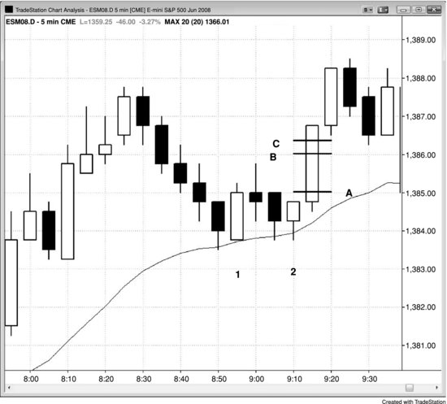

## Chapter 27: Entering on Stops

<!-- Source PDF pages 533–534 -->

<!-- PDF page 533 -->

Chapter 27
Entering on Stops
A price action trader is looking for a reason to enter, and the bar that
completes the setup is called a signal bar. The bar when you actually enter
is called the entry bar. One of the best ways to trade using price action is to
enter on a stop, because you are being carried into the trade by the market's
momentum and therefore are trading in the direction of at least a tiny trend
(at least one tick long). This is the single most reliable entry approach, and
beginners should restrict themselves to it until they become consistently
profitable. For example, if you are shorting a bear trend, you can place an
order to sell short at one tick below the low of the prior bar, which becomes
your signal bar after your order is filled. A reasonable location for a
protective stop is at one tick above the high of the signal bar. After the entry
bar closes, if it has a strong bear body, tighten the stop to one tick above the
entry bar. Otherwise, keep the stop above the signal bar until after the
market begins to move strongly in your direction.
Figure 27.1 Need a Six-Tick Move to Make Four Ticks

<!-- PDF page 534 -->

It usually takes a six-tick move beyond the signal bar to net a four-tick scalp
and a ten-tick move to make an eight-tick scalp in the Eminis. In Figure
27.1, the entry buy stop was one tick above the bar 2 signal bar's high at
line A, where you would have been filled. Your limit sell order to take four
ticks’ profit on your scalp was four ticks above that, at line B. Your limit
order usually won't get filled unless the market moves one tick beyond it.
This was line C, and it was six ticks above the high of the signal bar.
