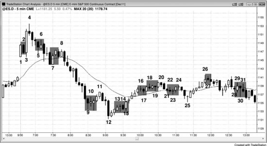

## Chapter 32: Getting Trapped In or Out of a Trade

<!-- Source PDF pages 618–620 -->

<!-- PDF page 618 -->

Chapter 32
Getting Trapped In or Out of a Trade
An entry stop can get you trapped into a bad trade, and a protective stop can
get you trapped out of a good trade. It is reasonable to wonder how this can
happen if most of the volume is generated by institutional computer orders
—how can the institutional computers get it wrong so often? Those
programs are often complex, and all of the institutions are using different
methods. Some of the stop runs will be due to hedging or partial profit
taking, while others will be due to scaling into a position, and most will
have nothing to do with a 5 minute chart. It is simplistic to think that they
are all getting it wrong and were trapped by a stop, or that the stop run was
due to the relatively small volume that comes from individual traders. What
appears on the chart is the distilled product of a huge number of traders who
are basing their decisions on a huge number of different and unknowable
reasons. The result is that individual traders sometimes get trapped into or
out of the market. Most institutions are not trading tick by tick, and they are
not concerned by these little moves because they know that the math behind
their models is sound. They don't see these moves as traps; it is likely that
most don't see them at all and instead rely on their models and on the orders
that their customers want them to fill. High-frequency trading (HFT) firms,
however, try to capitalize on any small move.
Figure 32.1 Trapped Traders

<!-- PDF page 619 -->

As shown in Figure 32.1, today was filled with setups that trapped traders
into bad trades and out of good trades, but if you had carefully read the
price action, you could have profited off each of these traps by placing limit
orders to bet on the opposite direction.
Bar 2 was a bear trend bar on a gap up open and a possible high of the
day, but with bar 1 being as strong as it was, it was probably better to wait
for more information before shorting. Once the short triggered, alert traders
would have bought above bar 2 on a stop, both because there were trapped
bears and because the market went above a strong bull trend bar on a gap up
day and the day could become a trend from the open bull trend day.
Bar 5 was the third bear bar in a spike down from a possible high of the
day, so even if the market were to trade above its high, a lower high and a
second leg down to the moving average were likely. A trader could have
placed a sell limit order to go short at the bar 5 high and used a protective
stop either at the high of the day or above the bear entry bar that followed
the bar 4 sell signal.
The bear channel down to bar 7 was steep, so even though it was a high 2
pullback to the moving average and a bull trend bar, bulls would have been
wise to wait for a breakout pullback before going long. Aggressive traders
would have shorted with a limit order at the bar 7 high for a scalp.
The move down to bar 9 was very strong, so buying the first attempt to
rally was a bad trade. Traders could instead have placed a limit order to

<!-- PDF page 620 -->

short at the bar 9 high, expecting a new low within the next few bars.
Bar 12 was a large bear trend bar and therefore a sell climax, and it
followed the sell climax down to bar 9. The low 2 at bar 11 might have
been the final flag in the bear trend before a larger correction ensued. Bar
13 was a low 1 short setup, but, since the market was no longer in a strong
bear spike, this was a bad short. Traders could instead have placed a limit
order to buy at the bar 13 low for a scalp.
Bar 14 was a weak low 2 short, since a correction lasting at least 10 bars
was likely after the consecutive sell climaxes. Bulls could have bought the
low of bar 14, expecting a failed low 2 and a breakout to the upside. Bar 15
became an outside up bar, trapping bears into the low 2 short. Because the
bar was so quick to form, many bulls did not have time to understand what
had taken place; they were trapped out and forced to chase the market up.
Bar 16 was a low 1 short setup after five bull trend bars and therefore
likely to fail. Bulls would have bought at the low of the bar.
Bar 17 was a high 1 long setup, but the bull spike had bars with small
bodies and tails. This was not a strong bull spike, and therefore the high 1
should fail. Bears shorted with limit orders at the high of bar 17.
Bar 18 was a low 2 short setup, but the market was still in a strong bull
channel and now was going sideways for six bars. This low 2 was likely to
fail, so bulls bought its low for a scalp.
Bar 19 was a failed low 2 and therefore a buy setup, but the market was
beginning to go sideways and have small bars, and this would have made
the third push up. Bears shorted at its high.
Bar 23 was a high 1 buy setup, but this was not a strong bull spike, so
bears shorted at its high.
Bar 27 was a high 1 buy setup, but again the spike was not strong. The
bars were small and the tails were prominent. Bears shorted at its high.
Bar 28 was a high 1 and a higher low in the middle of a trading range, and
it formed after a strong bear reversal bar one bar earlier. Bears shorted at its
high.
Bar 30 was a large doji bear reversal bar and a high 2 buy setup, but it
was in the middle of a trading range and the large signal bar forced traders
to buy near the top, which is never good. The doji bar was a weak signal
bar. Bears shorted at its high.
