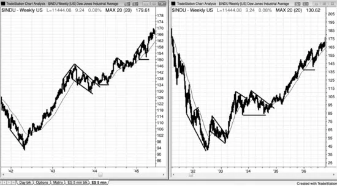
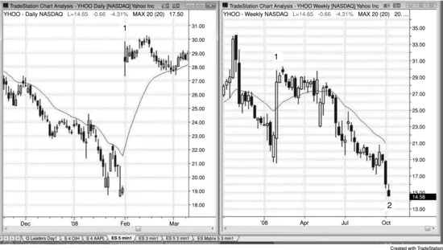
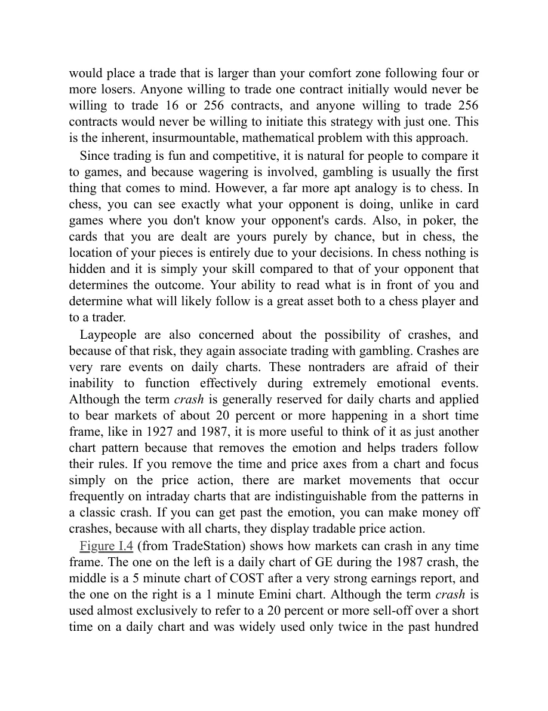

# 导论

<!-- Source PDF pages 31–59 -->

<!-- PDF page 31 -->

导论
之所以没有别的交易者写出全面讲述价格行为的书，是有原因的。这需要数千小时的投入，而经济回报与交易本身相比微不足道。不过，我的三个女儿如今都在读研究生，我有了空缺要填补，而这个项目一直非常令人满足。我最初计划更新《Reading Price Charts Bar by Bar》（John Wiley & Sons，2009）第一版，但深入之后，我决定改为详细阐述我如何看待并交易市场。我在隐喻地教你如何拉小提琴。靠它谋生所需的一切都在这几本书里，但花无数小时学会这门手艺则取决于你自己。在 www.brookspriceaction.com 上回答交易者数千个问题一年之后，我认为我找到了更清晰表达想法的方式，这几本书应比那一本更好读。前一本书聚焦于读懂价格行为，而本系列则以如何用价格行为交易市场为中心。由于书稿增长到第一本书四倍以上的字数，John Wiley & Sons 决定将其拆成三本。第一本讲价格行为基础与趋势。第二本讲震荡区间、订单管理与交易数学，最后一本讲趋势反转、日内交易、日线图、期权，以及所有时间框架上的最佳形态。许多图表也出现在《Reading Price Charts Bar by Bar》中，但大多已更新，对图表的讨论也基本重写。那本书约 12 万词中只有大约 5% 出现在本新系列约 57 万词里，因此读者会发现重复很少。
我写这三本系列的目标，是描述我为何认为经过仔细挑选的交易提供了出色的风险/回报比，并给出从这些形态中获利的方法。我呈现的材料希望对职业交易者与商学院学生都有兴趣，也希望即便刚起步的交易者也能找到一些有用的想法。人人都看价格图，但通常只是短暂地、带着特定或有限的目标。然而，每张图都有海量

<!-- PDF page 32 -->

信息可用于做盈利交易，但其中许多只有在交易者花时间仔细理解图上每一根K线在告诉他们机构资金在做什么时，才能有效使用。
大型市场中 90% 或更多的交易由机构完成，这意味着市场本质上就是机构的集合。几乎所有机构长期都是盈利的，少数不盈利的很快就会出局。既然机构是盈利的，而它们就是市场，你每一笔交易对面都有一个盈利的交易者（机构集合的一部分）在接你的单。没有一个机构愿意做一边、另一个机构愿意做另一边，交易就不可能发生。个人的小成交量交易，只有在机构也愿意做同一笔交易时才会发生。若你想在某价位买入，除非一个或多个机构也想在该价买入，否则市场到不了那个价。你也无法在任何价位卖出，除非一个或多个机构愿意在那里卖，因为市场只能到达既有机构愿意买、又有机构愿意卖的价位。若 Emini 在 1,264，你做多且保护性卖出止损在 1,262，除非也有机构愿意在 1,262 卖出，否则你的止损不会被打到。这对几乎所有交易都成立。
若你交易 200 张 Emini 合约，你就是在做机构级成交量，实际上就是机构，有时能把市场推动一两个 tick。但大多数个人交易者无论交易多么愚蠢，都没有能力推动市场。市场不会专门去扫你的止损。市场可能测试你保护性止损所在的价位，但那与你的止损无关。只有当一个或多个机构认为在那里卖出在财务上合理，而其他机构认为在那里买入有利可图时，它才会测试那个价。在每一个 tick，都有机构在买、也有机构在卖，而且它们都有已被证明能通过下这些单赚钱的系统。你应始终顺着机构资金多数的方向交易，因为它们控制着市场的去向。
一天结束时，当你看当日图表打印件时，如何判断机构当天做了什么？答案很简单：每当市场上涨，机构资金的主体在买入，

<!-- PDF page 33 -->

每当市场下跌，更多资金进入卖出。只要看图表中任何上涨或下跌的一段，研究每一根K线，你很快就会注意到许多可重复的形态。随着时间推移，你会开始在实时中看到这些形态展开，这将给你下单的信心。有些价格行为很微妙，因此要对每一种可能性保持开放。例如，有时市场在上行过程中，某根K线会跌破前一根低点，但趋势仍继续走高。你必须假定大资金在那根前K线的低点及下方在买入，而许多有经验的交易者也在这样做。他们正好买在弱势交易者被迫止损离场亏损的地方，或买在其他弱势交易者做空、以为市场开始下跌的地方。一旦你接受强趋势常有回撤、且大资金在买回撤而不是卖回撤这一想法，你就能做出一些你以前以为完全错误的绝佳交易。不要想得太复杂。若市场在上涨，机构在持续买入，即便在你觉得应该止损离场多单的时候也是如此。你的工作是跟随它们的行为，不要用过多逻辑去否认眼前正在发生的事。它是否看起来反直觉并不重要。重要的是市场在上涨，因此机构主要在买入，你也应如此。
机构通常被视为聪明资金，意思是它们足够聪明，能靠交易谋生，并且每天交易大量成交量。电视仍用「机构」一词指传统机构，如共同基金、银行、券商、保险公司、养老基金和对冲基金；这些公司过去占大部分成交量，且大多按基本面交易。它们的交易控制着日线与周线图上的方向以及许多大的日内波段。大约十年前，多数交易决策与交易本身由非常聪明的交易者完成，但如今越来越多由计算机完成。它们有程序能即时分析经济数据并立刻据此下单，整笔交易中甚至没有人参与。此外，其他公司通过

<!-- PDF page 34 -->

基于价格行为统计分析的计算机程序交易巨大成交量。计算机生成的交易如今可占当日成交量的 70%。
计算机非常擅长做决策，下象棋和在 Jeopardy! 中获胜比交易股票更难。多年来 Gary Kasparov 做出了世界上最好的象棋决策，但一台计算机在 1997 年做出了更好的决策并击败了他。Ken Jennings 被誉为有史以来最伟大的 Jeopardy! 选手，但一台计算机在 2011 年摧毁了他。计算机被广泛接受为机构交易的最佳决策者，只是时间问题。
由于程序使用客观的数学分析，支撑与阻力区域应趋于更加清晰界定。例如，随着更多成交量基于精确数学逻辑交易，等幅运动投射应变得更精确。此外，随着程序在日线图上买入小回撤，可能出现更持久的窄通道倾向。然而，若足够多的程序在同一关键价位平多或做空，抛售可能变得更大、更快。变化会剧烈吗？大概不会，因为在一切都由人工完成时，同样的总体力量已在运作，但随着更多情绪从交易中被移除，应会有某种向数学完美的移动。随着这些其他公司对市场运动贡献越来越大，且传统机构越来越多地用计算机分析并下单，「机构」一词变得模糊。对个人交易者来说，更好的是把机构想成任何成交量足够大、能对价格行为做出显著贡献的不同主体。
由于这些买卖程序产生了大部分成交量，它们是每张图外观的最重要贡献者，并为个人投资者创造了大多数交易机会。是的，知道思科（CSCO）财报强劲并在上涨很好；若你是想持股数月的投资者，就做传统机构在做的事，买入 CSCO。然而，若你是日内交易者，忽略新闻并看图表，因为程序会创造出纯基于统计、与基本面无关的形态，却提供绝佳的交易

<!-- PDF page 35 -->

机会。基于基本面下单的传统机构决定股票未来数月的方向与大致目标，但越来越多地，用统计分析做日内与其他短线交易的公司决定通向该目标的路径以及该波段的最终高点或低点。即便在宏观层面，基本面充其量也只是近似。看看 1987 与 2009 年的崩盘。两者都有剧烈抛售与反弹，但基本面并未在同样短的时间内剧烈变化。在这两种情况下，市场都被略微吸到月趋势线下方并由此急剧反转向上。市场因被感知的基本面而下跌，但下跌的幅度由图表决定。
有一些大形态在所有时间框架与所有市场中反复出现，如趋势、震荡区间、高潮与通道。也有许多较小的可交易形态，仅基于最近几根K线。这几本书是全面指南，帮助交易者理解他们在图上看到的一切，给他们更多做盈利交易、避免亏损交易的机会。
我能传达的最重要信息是：专注于绝对最好的交易，避开绝对最差的形态，使用至少与保护性止损（风险）一样大的利润目标（回报），并努力增加你交易的股数/合约数。我坦然承认，我对每个形态背后的每一个理由都只是我的看法，我对某笔交易为何有效的推理可能完全错误。然而，那无关紧要。重要的是，阅读价格行为是非常有效的交易方式，而我对某些事情为何如此发生想得很多。我对自己的解释感到自在，它们在我下单时给我信心；然而，它们与我下单无关，因此对我来说它们是否正确并不重要。正如我能在瞬间扭转对市场方向的看法，若我遇到更合逻辑的理由或发现自己逻辑中的缺陷，我也能扭转对某一形态为何有效的看法。我提供这些看法是因为它们看起来合理，可能帮助读者更自在地交易某些形态，也可能在思想上有刺激，但做任何价格行为交易都不需要它们。

<!-- PDF page 36 -->

这几本书非常详细且难读，面向想尽可能多地学习读懂价格图的认真交易者。然而，这些概念对所有水平的交易者都有用。书中涵盖 Robert D. Edwards 与 John Magee（《Technical Analysis of Stock Trends》，AMACOM，第 9 版，2007）及其他人描述的许多标准技术，但更聚焦于单根K线，以说明它们提供的信息如何能显著提高交易的风险/回报比。大多数书在一张图上只指出三、四笔交易，暗示图上其余部分不可理解、无意义或风险过大。我相信，一天中发生的每一个 tick 都有可学之处，且每张图上远不止那少数几笔明显交易那么多绝佳交易；但要看见它们，你必须理解价格行为，不能把任何K线当作不重要而忽略。我从在显微镜下做数千台手术中学到，有些最重要的东西可以非常小。
我逐根K线读图，寻找每一根K线告诉我的任何信息。它们都很重要。在每一根K线结束时，多数交易者问自己：「刚才发生了什么？」对多数K线，他们得出结论：此刻没有值得交易的东西，因此不值得费力去理解。他们选择等待更清晰、通常也更大的形态。就好像他们相信那根K线不存在，或把它当作个人交易者无法交易的机构程序活动而打发掉。在这些时候他们不觉得自己是市场的一部分，而这些时候构成了一天的绝大部分。然而，若他们看成交量，他们忽略的那些K线与他们用作交易基础的K线成交量一样大。显然发生了大量交易，但他们不理解那如何可能，本质上假装它不存在。但这是否认现实。交易始终在发生，作为交易者，你有责任理解它为何发生，并想办法从中赚钱。学习市场在告诉你什么非常耗时且困难，但它给你成为成功交易者所需的基础。
与大多数蜡烛图书不同——那里多数读者觉得必须背形态——我的这三本书提供了

<!-- PDF page 37 -->

为何特定形态对交易者是可靠设置的理由。有些术语对市场技术分析师有特定含义，但对交易者含义不同，而我完全从交易者的视角来写。我确信许多交易者已经理解这几本书中的一切，但很可能不会用我同样的方式描述价格行为。成功的交易者之间没有秘密；他们都知道常见形态，许多人给每一个都有自己的名字。他们都差不多在同一时间买卖，捕捉同一波段，并各有自己入场的理由。许多人凭直觉交易价格行为，从不觉得需要清楚说出某一形态为何有效。我希望他们喜欢阅读我对价格行为的理解与视角，并因此获得一些能改进其本已成功交易的洞见。
多数交易者的目标是通过与自己性格相容的风格最大化交易利润。没有那种相容性，我相信几乎不可能长期盈利交易。许多交易者想知道需要多久才能成功，并愿意在一段时间内、甚至几年亏钱。然而，我花了超过 10 年才有能力成功交易。我们每个人都有许多顾虑与分心，因此时间会有所不同，但交易者必须克服多数障碍之后才能持续盈利。我有几个必须纠正的主要问题，包括抚养三个出色的女儿，她们总让我满脑子想着她们以及作为父亲我需要做什么。随着她们长大、更独立，这解决了。然后我花了很长时间才接受许多性格特质是真实且不可改变的（或至少我得出结论我不愿意改变它们）。最后还有信心问题。我在许多事情上一直自信到近乎傲慢的程度，认识我的人会惊讶这对我竟然困难。然而，在内心深处，我相信自己真的永远想不出一套我会乐意用很多年的持续盈利方法。相反，我买了许多系统，编写并测试了无数指标与系统，读了许多书刊，参加研讨会，请过导师，加入聊天室。我与那些把自己呈现为成功交易者的人交谈，但我从未看过他们的账户对账单

<!-- PDF page 38 -->

，并怀疑多数人能教、但很少有人（如果有的话）能交易。通常在交易中，懂的人不说，说的人不懂。
这一切都极其有帮助，因为它展示了在我成功之前需要避开的所有东西。任何非交易者看一张图都会不可避免地认为交易一定极其容易，而这正是吸引力的一部分。在一天结束时，任何人都可以看任何图并看到非常清晰的进出场点。然而，在实时中做要难得多。人们有一种自然倾向：想买在精确的最低点，且交易绝不再回来。若它回来了，新手会止损离场以避免更大亏损，导致一连串亏损交易，最终爆掉账户。用更宽的止损在某种程度上能解决这点，但交易者迟早会碰到几次大亏损，使他们进入亏损状态，并吓得不敢继续用那种方法。
你是否应担心：把这几本书中的信息公开会造就大量优秀的价格行为交易者，所有人在同一时间做同样的事，从而拿走把市场推到你目标价所需的后来入场者？不，因为机构控制着市场，它们已拥有世界上最聪明的交易者，而那些交易者已经知道这几本书中的一切，至少凭直觉知道。在每一刻，都有一个极其聪明的机构多头在接一个极其聪明的机构空头的单。既然最重要的参与者已经知道价格行为，有更多人知道也不会使天平向一边或另一边倾斜。因此我不担心我所写的会让价格行为停止有效。由于那种平衡，任何人拥有的任何优势始终会极其微小，而任何小错误都会导致亏损，无论一个人读图多好。虽然不理解价格行为很难靠交易赚钱，但仅有那知识还不够。在交易者学会读图之后，还要花很长时间学习如何交易，而交易与读图一样难。我写这几本书是为了帮助人们更好地读图、更好地交易，若你两者都做得好，你就有资格从别人的账户把钱拿进自己的账户。
我们都看到的形态之所以如其所是地展开，是因为那是高效市场中的外观，其中

<!-- PDF page 39 -->

无数交易者因成千上万不同理由下单，但控制性成交量基于健全逻辑交易。它就是那个样子，并且一直如此。同样的形态在全世界所有市场的所有时间框架上展开，要在如此多不同层面上被即时全部操纵，简直不可能。价格行为是人类行为的表现，因此实际上有遗传基础。在我们进化之前，它很可能大体保持不变，正如我审阅过的 80 年图表中它一直未变一样。程序化交易可能略微改变了外观，尽管我找不到证据支持该理论。如果说有什么，它会使图表更平滑，因为它没有情绪，并大大增加了成交量。如今大部分成交量由计算机自动交易且成交量如此巨大，非理性与情绪化行为是市场中可忽略的成分，图表是人类倾向的更纯粹表达。
由于价格行为来自我们的 DNA，在我们进化之前它不会改变。当你看图 I.1 中的两张图时，你的第一反应是它们只是几张普通图，但看看底部的日期。这些来自大萧条时期与二战时期的道琼斯工业平均指数周线图，具有我们今天在所有图上看到的同样形态，尽管如今大部分成交量由计算机交易。

图 I.1 价格行为并未随时间改变

<!-- PDF page 40 -->

若人人突然变成价格行为剥头皮交易者，较小形态可能暂时略有变化，但长期来看，高效市场会胜出，所有交易者的投票会被提炼成标准价格行为形态，因为那是无数人逻辑行为不可避免的结果。此外，现实是要交易得好非常难，尽管基于价格行为交易是健全方法，但在实时中成功做仍然非常难。不会有足够多的交易者在同一时间做得足够好，从而对形态产生任何显著的长期影响。看看 Edwards 与 Magee。世界上最好的交易者几十年来一直在用那些想法，而它们继续有效，再次出于同样原因——图表之所以看起来那样，是因为那是充满大量聪明人、使用大量方法与时间框架、全都试图赚尽可能多钱的高效市场不可改变的指纹。例如，Tiger Woods 没有隐藏他在高尔夫中做的任何事，任何人都可以自由复制他。然而，很少有人能把高尔夫打到足以谋生的程度。交易也是如此。一个交易者可以几乎知道一切该知道的，却仍然亏钱，因为以持续赚钱的方式运用那所有知识非常难。
为何如此多商学院继续推荐 Edwards 与 Magee，而他们的书本质上很简单，主要使用趋势线、突破与回撤作为交易基础？因为它们有效，

<!-- PDF page 41 -->

而且一直有效，也将永远有效。如今几乎所有交易者都有计算机并能获得日内数据，许多那些技术可以适配到日内交易。此外，蜡烛图提供关于谁在控制市场的额外信息，从而带来更及时、风险更小的入场。Edwards 与 Magee 的焦点在整体趋势。我使用同样的基本技术，但对图上单根K线给予更密切关注以提高风险/回报比，并把相当多注意力放在日内图上。
对我来说显然：若一个人能把图读得足够好，能在行情起飞且不再回来的精确时刻入场，那么那个交易者将拥有巨大优势。该交易者会有很高的胜率，而少数亏损会很小。我决定以此为起点，而我发现什么都不必添加。事实上，任何添加都是导致更低盈利的分心。这听起来如此明显且容易，以至于多数人难以相信。
我是一个完全依赖日内 Emini S&P 500 期货图价格行为的日内交易者，我相信读好价格行为对所有交易者都是无价技能。初学者常常反而有一种根深蒂固的信念：还需要更多，或许某个很少有人使用的复杂数学公式会给他们所需的那一点优势。高盛如此富有且精密，其交易者一定有超级计算机与强大软件，给他们确保所有个人交易者注定失败的优势。他们开始看各种指标，摆弄输入以定制指标使它们恰到好处。每个指标有时都有效，但对我来说，它们模糊而不是阐明。事实上，甚至不用看图，你就可以挂买单，并有 50% 的机会是对的！
我并非因对指标与系统的细节无知而否定它们。这些年我花了超过 10,000 小时编写并测试指标与系统，那可能远多于多数人的经验。这段与指标与系统的广泛经验是我成为成功交易者的必要部分。指标对许多交易者有效，但最佳成功来自交易者找到一种

<!-- PDF page 42 -->

与自己性格相容的方法。我对指标与系统最大的单一问题是，我从未完全信任它们。在每一个形态处，我都看到需要测试的例外。我总想从市场中榨出最后一分钱，若我能加入一个新花样使系统更好，我从不满足于系统的回报。你可以不断优化，但由于市场总在从强趋势到窄幅震荡区间再回来之间变化，而你的优化基于最近发生的事，当市场过渡到新阶段时它们很快会失败。我在控制欲、强迫性、不安、观察力与不信任方面太极端，无法长期靠指标或自动化系统赚钱，但我在许多方面处于极端，多数人没有同样的问题。
许多交易者，尤其是初学者，被指标吸引（或任何其他更高权力、大师、电视名嘴或他们想相信会保护他们、并通过给他们很多钱来显示对他们作为人的爱与认可的时事通讯），希望指标告诉他们何时入场。他们没有意识到的是，绝大多数指标基于简单的价格行为，而当我下单时，我根本无法想得足够快以处理几个指标可能在告诉我的东西。若有多头趋势、回撤，然后反弹至新高，但反弹有大量重叠K线、许多空头实体、几次小回撤，以及K线顶部显著影线，任何有经验的交易者都会看到这是对趋势高点的弱势测试，若多头趋势仍强，这本不该发生。市场几乎肯定在过渡到震荡区间，也可能进入空头趋势。交易者不需要振荡指标来告诉他们这些。此外，振荡指标往往使交易者寻找反转，并较少关注价格图。在多数有两三次持续一小时或更久反转的日子里，这些可以是有效工具。问题出在市场强趋势时。若你过度关注指标，你会看到它们整天在形成背离，可能发现自己反复逆势入场并亏钱。等你终于接受市场在趋势时，一天中已没有足够时间弥补亏损。相反，若你只看K线或蜡烛图，你会看到市场显然在趋势，

<!-- PDF page 43 -->

不会被指标诱惑去寻找趋势反转。最常见的成功反转先以强动量突破趋势线，然后回撤测试极端；若交易者过度关注背离，他们常常会忽略这一基本事实。在没有先出现突破趋势线的逆势动量浪涌的情况下因背离而交易，是亏损策略。等待趋势线突破，然后看对旧极端的测试是反转还是旧趋势恢复。你不需要指标告诉你这里的强反转是高概率交易，至少对剥头皮如此，而且几乎肯定会有背离，那为何要把指标加入你的计算把事情复杂化？
有些名嘴推荐时间框架、指标、波浪计数与斐波那契回撤与延伸的组合，但到真正下单时，他们只有在有好的价格行为形态时才会做。此外，当他们看到好的价格行为形态时，他们开始寻找显示背离的指标、不同时间框架的移动平均线测试、波浪计数或斐波那契形态来确认眼前所见。实际上，他们是价格行为交易者，只在一张图上专门按价格行为交易，但觉得承认这一点不舒服。他们把交易复杂化到一定程度，以至于肯定错过许多许多交易，因为过度分析占用太多时间无法下单，被迫等待下一个形态。把简单变得如此复杂，逻辑上说不通。显然，加入任何信息都能带来更好的决策，许多人在决定是否下单时或许能处理大量输入。仅因简单意识形态而忽略数据是愚蠢的。目标是赚钱，交易者应尽一切所能最大化利润。我在准确下单所需的时间内无法很好地处理多个指标与时间框架，对我来说，仔细阅读单张图远更有利可图。此外，若我依赖指标，我发现自己在价格行为阅读上变得懒惰，并常常错过显而易见的东西。价格行为远比任何其他信息重要，若你牺牲它告诉你的某些内容以换取别的东西，你很可能在做糟糕的决定。

<!-- PDF page 44 -->

对刚起步的交易者来说，最令人沮丧的事情之一是一切都如此主观。他们想找到一套保证利润的清晰规则，并讨厌某一形态在某一天有效、在另一天失败。市场非常高效，因为无数非常聪明的人在玩零和游戏。交易者要赚钱，必须持续比大约一半的其他交易者更好。由于多数竞争者是盈利的机构，交易者必须非常优秀。每当存在优势，它很快被发现并消失。记住，必须有人接你交易的另一边。他们用不了多久就会搞清你的神奇系统，一旦搞清，他们就会停止把钱给你。交易吸引力的一部分在于它是优势非常小的零和游戏，能发现并利用这些微小、短暂的机会在智识上令人满足且在财务上有回报。这可以做到，但非常辛苦，需要不懈的纪律。纪律简单意味着做你不想做的事。我们都有求知欲，并有尝试新或不同事物的自然倾向，但最优秀的交易者抵制这种诱惑。你必须坚持规则并避免情绪，必须耐心等待只做最好的交易。当你在一天结束时看打印图表时，这一切看起来容易做，但在实时中一根K线一根K线、有时一小时一小时地等待时非常难。一旦绝佳形态出现，若你分心或陷入自满，你会错过它，然后被迫等得更久。但若你能培养耐心与纪律来遵循健全系统，利润潜力是巨大的。
有无数方法交易股票与 Emini 赚钱，但都需要运动（好吧，除了做空期权）。若你学会读图，你每天会捕捉大量这些盈利交易，而从未知道是哪个机构启动了趋势，也从未知道任何指标在显示什么。你不需要这些机构的软件或分析师，因为它们会向你展示它们在做什么。你要做的只是搭它们交易的便车，你就会盈利。价格行为会告诉你它们在做什么，并允许你以紧止损早期入场。

<!-- PDF page 45 -->

我发现，通过最小化下单时需要考虑的内容，我持续赚得远更多。我只需要笔记本电脑上的一张图，除 20 周期指数移动平均线（EMA）外没有指标，它不需要太多分析，每天澄清许多好形态。有些交易者也看成交量，因为异常大的成交量尖峰有时出现在空头趋势末端附近，接下来的一两个新摆动低点常常提供盈利的多头剥头皮。成交量尖峰有时也出现在日线图上抛售过度时。然而，它不够可靠，不值得我关注。
许多交易者仅在交易背离与趋势回撤时考虑价格行为。事实上，多数使用指标的交易者除非有强信号K线否则不会交易，且若背景合适，即便没有背离，许多人也会在强信号K线上入场。他们喜欢看到大反转K线上的强收盘，但实际上这相当罕见。理解价格行为最有用的工具是趋势线与趋势通道线、先前高点与低点、突破与失败突破、蜡烛实体与影线的大小，以及当前K线与前几根K线的关系。特别是，当前K线的开、高、低、收与前几根K线行为的比较，能大量告诉你接下来会发生什么。图表提供的关于谁在控制市场的信息，比多数交易者意识到的多得多。几乎每一根K线都提供市场去向的重要线索，把任何活动当作噪音打发掉的交易者每天都在错过许多盈利交易。这几本书中的多数观察直接与下单相关，但少数与简单的好奇价格行为倾向有关，其可靠性不足以作为交易基础。
我个人主要依赖蜡烛图做 Emini、期货与股票交易，但多数信号在任何类型的图上也可见，许多甚至在简单线图上也很明显。我主要聚焦 5 分钟蜡烛图来说明基本原则，但也讨论日线与周线图。由于我也交易股票、外汇、国债期货与期权，我讨论如何用价格行为作为这类交易的基础。

<!-- PDF page 46 -->

作为交易者，我看一切都是灰色的，并不断按概率思考。若某一形态在形成且不完美，但与可靠形态相当相似，它很可能表现也相似。接近通常就够接近了。若某物像教科书形态，交易很可能以与教科书形态交易相似的方式展开。这是交易的艺术，需要数年才能在灰色地带交易得好。人人都想要具体、清晰的规则或指标，以及聊天室、时事通讯、热线或导师精确告诉他们何时入场以最小化风险、最大化利润，但长期来看这些都不奏效。你必须对自己的决定负责，但你首先必须学会如何做决定，这意味着你必须习惯在灰色迷雾中运作。没有什么像黑白那么清晰，我做这行足够久，足以体会到任何事，无论多不可能，都可能且会发生。就像量子物理。每一个可想象的事件都有概率，你尚未考虑的事件也有。它不带情绪，某事为何发生的理由无关紧要。今天看美联储是否降息是浪费时间，因为美联储做的任何事都既有多头也有空头解读。关键是看市场做什么，而不是美联储做什么。
若你想一想，交易是零和游戏，不可能有规则始终有效的零和游戏。若它们有效，人人都会用它们，然后交易对面就不会有人。因此交易不可能存在。指引非常有帮助，但可靠规则不可能存在，这对想相信交易是只要想出一套正确规则就能非常赚钱的游戏的起步交易者来说通常非常令人不安。所有规则有时都有效，且通常刚好足够频繁让你相信只需稍加调整就能始终有效。你在试图创造一个会保护你的交易之神，但你在自欺，在为只有艰苦方案才奏效的游戏寻找轻松方案。你在与世界上最聪明的人竞争，若你足够聪明想出一套万无一失的规则集，他们也是，然后人人都面临零和游戏困境。你不能靠交易赚钱，除非你灵活，因为你需要

<!-- PDF page 47 -->

去市场要去的地方，而市场极其灵活。它可以向每个方向弯曲，比多数人能想象的久得多。它也可以每几根K线反复反转，持续很久很久。最后，它能并会做其间的一切。永远不要因此沮丧，只把它接受为现实，并作为游戏之美的一部分来欣赏。
市场被吸引向不确定性。一天中的大部分时间，每个市场都有约 50–50 的方向概率：等距上行或下行。我的意思是，若你甚至不看图就买入任何股票，然后挂一张二选一（OCO）单，在入场上方 X 美分止盈限价出场，或在入场下方 X 美分保护性止损出场，你大约有 50% 的机会是对的。同样，若你在一天中任何时候不看图就卖出任何股票，然后挂下方 X 美分止盈限价与上方 X 美分保护性止损，你大约有 50% 的机会赢、50% 的机会亏。明显的例外是 X 相对于股价过大。你不能在 50 美元股票上让 X 为 60 美元，因为你有 0% 的机会亏 60 美元。你也不能让 X 为 49 美元，因为亏 49 美元的几率也会微乎其微。但若你为 X 选一个在你时间框架内合理可达的值，这大体成立。当市场是 50–50 时，它是不确定的，你无法理性地对方向有看法。这是震荡区间的标志，因此每当你不确定时，假定市场处于震荡区间。图上有短暂时段方向概率更高。在强趋势中，它可能是 60 甚至 70%，但那不能持续太久，因为它会被吸引向不确定性与 50–50 市场，在那里多头与空头都觉得有价值。当有趋势且有一定程度方向确定性时，市场也会被吸引向支撑与阻力区域，那通常是某种等幅运动距离之外，而那些区域总是不确定性回归、震荡区间至少短暂形成的地方。
在交易日中永远不要看新闻。若你想知道某一新闻事件意味着什么，你面前的图表会告诉你。记者相信新闻是世界上最重要的东西，发生的一切都必须由他们当天最大的新闻故事引起。由于

<!-- PDF page 48 -->

记者身处新闻业，新闻必须是宇宙中心、是金融市场中发生的一切的原因。当股市在 2011 年 3 月中旬抛售时，他们将其归因于日本地震。对他们来说市场在三周前、在买盘高潮之后就开始抛售并不重要。当我在日线图上看到漫长多头运行之后连续 15 根多头趋势K线时，我在 2 月底告诉聊天室成员市场很可能有显著修正。这是异常强的买盘高潮，是市场的重要声明。我不知道几周后会发生地震，反正也不需要知道。图表在告诉我交易者在做什么；他们准备平多并启动空单。
电视专家也毫无用处。每当市场大动，记者总会找到某个自信、有说服力的专家曾预测到它并采访他或她，让观众相信这位名嘴有非凡预测市场的能力，尽管未言明的现实是这位名嘴在过去 10 次预测中都错了。然后名嘴做某个未来预测，天真的观众会赋予其意义并让它影响他们的交易。观众可能没有意识到的是，有些名嘴 100% 时间看多，有些 100% 时间看空，还有些总是全力挥棒、做耸人听闻的预测。记者只是冲向与当天新闻一致的那个，这对交易者完全无用，事实上是有害的，因为它能影响他们的交易，让他们质疑并偏离自己的方法。没有人在这些重大预测上能持续正确超过 60% 的时间，名嘴有说服力并不使他们可靠。有同样聪明且有说服力的人持相反看法但没被听到。这与只听辩护方论点看审判一样。只听一方总是有说服力、总是误导，很少比 50% 更可靠。
机构多头与空头始终在下单，这就是为何市场方向始终存在不确定性。即便没有突发新闻，商业频道全天都在播放采访

<!-- PDF page 49 -->

，每位记者为她的报道选一位名嘴。你必须意识到的是，就未来一小时左右的市场方向而言，她有 50–50 的机会选对那个。若你决定依赖名嘴做交易决定，而他说市场午后会下跌，但市场却继续上涨，你要寻找做空吗？你应该相信华尔街顶级公司之一这位非常有说服力的首席交易员吗？他显然年薪超过百万，除非他能正确且持续预测市场方向，否则他们不会付他那么多。事实上，他很可能能，且他很可能是好的选股者，但他几乎肯定不是日内交易者。相信他能年赚 15% 管理资金的能力就能正确预测未来一两小时的市场方向是愚蠢的。做数学。若他有那种能力，他会一天赚 1% 两三次，或许一年 1,000%。既然他没有，你就知道他没有那种能力。他的时间框架是数月，你的是数分钟。既然他无法靠日内交易赚钱，你为何要基于一个已被证明是失败日内交易者的人做交易？他通过简单的事实——他不是成功的日内交易者——向你表明他无法靠日内交易赚钱。那立刻告诉你：若他做日内交易，他会亏钱，因为若他在那方面成功，他会选择做那件事，并赚远比现在多。即便你持股数月试图复制他基金的结果，听从他的建议仍然愚蠢，因为他下周可能改变主意而你永远不会知道。一旦你入场，管理交易与下单一样重要。若你跟随名嘴并希望像他一样一年赚 15%，你需要跟随他的管理，但你没有能力这样做，长期用这种策略你会亏。是的，你会偶尔做一笔绝佳交易，但你也可以通过随机买任何股票做到。关键是该方法在 100 笔交易上是否赚钱，而不是前一两笔。听从你给孩子的建议：不要自欺以为电视上看到的是真的，无论它看起来多么精致、有说服力。

<!-- PDF page 50 -->

正如我所说，会有名嘴把新闻看成多头，也有人看成空头，记者为她的报道选一个。你要让记者为你做交易决定吗？那太疯狂了！若那个记者能交易，她会是交易者，赚比她当记者多几百倍的钱。你为何要让她影响你的决策？你可能只因对自己能力缺乏信心，或或许在寻找会爱护并保护你的父亲形象。若你容易受记者决定影响，你不应做那笔交易。她选的名嘴不是你的父亲，他不会保护你或你的钱。即便记者选的名嘴方向正确，那个名嘴也不会陪你管理交易，你很可能会在回撤时止损离场亏损。
财经新闻台的存在不是为了提供公共服务。它们是为了赚钱，这意味着它们需要尽可能大的观众以最大化广告收入。是的，它们想报道准确，但首要目标是赚钱。它们完全意识到，只有好看才能最大化观众规模。这意味着它们必须有有趣的嘉宾，包括会做耸人听闻预测的人、像教授般安抚人的人，以及只是外表吸引人的人；他们多数必须有某种娱乐价值。虽然有些嘉宾是伟大的交易者，但他们帮不了你。例如，若他们采访世界上最成功的债券交易者之一，他通常只会笼统谈论未来数月的趋势，且只在他已下单数周之后才说。若你是日内交易者，这帮不了你，因为月线图上的每一个多头或空头市场，在日内图上几乎都有一样多的上行与下行，每天都会有多头与空头交易。他的时间框架与你非常不同，他的交易与你在做的无关。他们也常采访大型华尔街公司的图表分析师，其资历虽好，却基于周线图形成意见，而观众却想在几天内止盈。对图表分析师来说，他推荐买入的那个多头趋势，即便市场在未来一两个月跌 10%，仍将完好。

<!-- PDF page 51 -->

观众却会在那之前就止损，永远不会从三个月后的新高中受益。除非图表分析师针对你的具体目标与时间框架，否则他说的任何话都无用。当电视改为采访日内交易者时，他会谈他已经做过的交易，信息太晚，帮不了你赚钱。等他上电视时，市场可能已经在反方向走。若他在仍持有日内交易时谈话，他会在两分钟采访结束后很久才继续管理交易，且不会在直播时管理。即便你进入他在的交易，当市场不可避免地转向对你不利、或市场朝你方向走而你在考虑止盈时，他不会在那里。在任何情况下——甚至在非常重要的报告之后——看电视找交易建议都是亏钱的必由之路，你永远不该这样做。
只看图表，它会告诉你需要知道的。图表会给你钱或从你这里拿走钱，因此它是你交易时唯一应考虑的东西。若你在场内，你甚至不能信任最好的朋友在做什么。他可能在大量报出橙汁看涨期权，却秘密让经纪人在市场下方买入 10 倍数量。你的朋友只是试图制造恐慌把市场打下去，以便通过代理人以好得多的价格建仓。
朋友与同事会自由提供意见让你忽略。偶尔交易者会告诉我他们有绝佳形态，想与我讨论。当我告诉他们我不感兴趣时，我无一例外会惹恼他们。他们立刻把我看成自私、固执、封闭，而在交易方面，我全都是，或许还更多。让你赚钱的技能对门外汉来说通常被看作缺陷。我为何不再读关于交易的书或文章，或与其他交易者谈他们的想法？正如我所说，图表告诉我需要知道的一切，任何其他信息都是分心。有几个人被我的态度冒犯，但我想部分来自我拒绝他们呈现为对我有帮助的东西，而实际上他们在做一种献祭，希望我会

<!-- PDF page 52 -->

以某种辅导作为回报。当我告诉他们我不想听任何别人的交易技术时，他们变得沮丧与愤怒。我告诉他们，我甚至还没掌握自己的，可能永远不会，但我有信心：完善我已经知道的，会比试图把非价格行为方法融入我的交易赚远更多钱。我问他们：若 James Galway 给 Yo-Yo Ma 一支漂亮的长笛并坚持让 Ma 开始学长笛，因为 Galway 靠吹长笛赚那么多钱，Ma 应该接受吗？显然不。Ma 应继续拉大提琴，这样做他会赚远比他也开始吹长笛更多的钱。我不是 Galway 或 Ma，但概念一样。价格行为是我唯一想演奏的乐器，我强烈相信通过掌握它我会赚远比融入其他成功交易者想法更多的钱。
告诉你机构如何解读新闻的是图表，而不是电视上的专家。
昨天，Costco 当季盈利上涨 32%，高于分析师预期（见图 I.2）。COST 开盘跳空高开，在第一根K线测试缺口，然后在 20 分钟内上涨超过一美元。然后它缓慢下行测试昨日收盘。它有两次突破空头趋势线的反弹，两次都失败了。这创造了双顶（K线 2 与 3）空头旗形或三重顶（K线 1、2 与 3），然后市场暴跌 3 美元，跌破前一日低点。若你不知道那份报告，你会在 K线 2 与 3 的失败空头趋势线突破处做空，并在 K线 4 下方再卖，那是昨日低点下方突破之后的回撤。你会在 K线 5 的大反转K线翻多，那是第二次试图反转昨日低点下方的突破，也是对陡峭空头趋势通道线底部突破的高潮式反转。

图 I.2 忽略新闻

<!-- PDF page 53 -->

或者，你可能因看多报告而买入开盘，然后担心为何股票在崩塌而不是像电视分析师预测的那样飙升，你很可能在第二次下探至 K线 5 时以 2 美元亏损平掉多单。
任何在很少几根K线内覆盖很多点数的趋势——意味着有大K线与彼此重叠极少的K线的某种组合——最终都会有回撤。这些趋势有如此强的动量，几率偏向回撤之后趋势恢复，然后测试趋势极端。通常极端会被越过，只要回撤不演变成反方向新趋势并延伸超过原趋势起点。总体而言，若回撤回撤 75% 或更多，回撤回到先前趋势极端的几率大幅下降。对空头趋势中的回撤，在那一点，交易者最好把回撤想成新多头趋势，而不是旧空头趋势中的回撤。K线 6 大约是 70% 回撤，然后市场在次日开盘测试高潮空头低点。
市场因新闻跳空高开，并不意味着它会继续上涨，无论新闻多么看多。
如图 I.3 所示，在两张雅虎（YHOO）图上 K线 1 开盘之前（左为日线，右为周线），新闻报道微软有意以每股 31 美元收购雅虎，市场跳空几乎涨到那个价。许多交易者假定这一定是

<!-- PDF page 54 -->

板上钉钉，因为微软是世界上最好的公司之一，若它想买雅虎，肯定能做到。不仅如此——微软现金如此充裕，若需要很可能愿意提高报价。好吧，雅虎 CEO 说他的公司更值每股 40 美元左右，但微软从未还价。交易慢慢蒸发，连同雅虎的价格。到 10 月，雅虎比交易宣布前低 20%，比宣布当天低 50%，并继续下跌。所谓强基本面与来自严肃买家的收购要约，不过如此。对价格行为交易者来说，空头市场中的巨大上涨很可能只是空头旗形，除非该运动后跟一系列更高低点与更高高点。它可能后跟多头旗形然后更多反弹，但在多头趋势被确认之前，你必须意识到更大的周线趋势更重要。
图 I.3 市场可在看多新闻中下跌
唯一如其所是的是图表。若你搞不清它在告诉你什么，就不要交易。等待清晰。它总会到来。但一旦清晰在那里，你必须下单、承担风险并遵循计划。不要切到 1 分钟图并收紧止损，因为你会亏。1 分钟图的问题是它用大量入场、更小K线因而更小风险来诱惑你。然而，你无法全部做，反而会挑拣，

<!-- PDF page 55 -->

而这会导致你账户的死亡，因为你不可避免地会挑太多坏樱桃。当你在 5 分钟图上入场时，你的交易基于你对 5 分钟图的分析，对 1 分钟图长什么样毫无概念。因此你必须依赖你的五分钟止损与目标，并接受现实：1 分钟图会反向对你，并频繁打到一分钟止损。若你看 1 分钟图，你就不会把全部注意力放在 5 分钟图上，好的交易者会把你的钱从你的账户拿进他的账户。若你想竞争，你必须最小化一切分心以及除你面前图表之外的一切输入，并相信若你这样做你会赚很多钱。这会显得不真实，但它非常真实。永远不要质疑它。只把事情保持简单并遵循你的简单规则。持续一致地做简单的事极其困难，但在我看来，这是最好的交易方式。最终，随着交易者对价格行为理解越来越好，交易变得压力小得多，实际上相当无聊，但利润高得多。
虽然我从不赌博（因为赔率、风险与回报的组合对我不利，我从不想与数学作对），但有一些与赌博的相似之处，尤其在不交易的人的头脑中。赌博是机会游戏，但我更愿把定义限制在赔率略对你不利、长期你会输的情况。为何有此限制？因为没有它，每一项投资都是赌博，因为总有运气成分与全损风险，即便你买投资房地产、买房、创业、买蓝筹股，甚至买国债（政府可能选择使美元贬值以降低我们债务的实际规模，这样做时，你从那些债券拿回的美元购买力会远低于你最初买债券时）。
有些交易者使用简单博弈论，在一次或多次亏损交易后增加交易规模（这称为交易的鞅方法）。二十一点算牌者与震荡区间交易者非常相似。算牌者试图确定数学何时朝一个方向走得太远。特别是，他们想知道牌组中剩余牌是否可能过度集中面牌。当计数表明这很可能时，他们基于

<!-- PDF page 56 -->

不成比例数量的面牌即将出现、从而提高获胜几率的概率下单（下注）。震荡区间交易者在寻找他们认为市场在一个方向走得太远的时候，然后在相反方向下单（fade）。
我试过几次在线扑克，不用真钱，以寻找与交易的相似与不同。我很早就发现对我来说有一个交易破坏者：我因运气带来的固有不公而持续焦虑，我从不想让运气成为我成功几率的大成分。这是巨大差异，使我把赌博与交易视为根本不同，尽管公众看法相反。在交易中，人人拿到同样的牌，因此游戏始终公平，长期来看，你完全因作为交易者的技能而得到奖励或惩罚。显然，有时你可以交易正确却仍亏，且由于所有可能结果的概率曲线，这可能连续发生几次。有真实但微观的机会：你可以交易得好却连续亏 10 次甚至 100 次或更多；但我记不起上次看到连续四个好信号失败是什么时候，因此这是我愿意承担的机会。若你交易得好，长期应赚钱，因为它是零和游戏（除佣金外，若你选合适的经纪人，佣金应很小）。若你比多数其他交易者更好，你会赢他们的钱。
有两种赌博不同于纯机会游戏，两者都与交易相似。在体育博彩与扑克中，赌徒试图从其他赌徒而不是庄家那里拿钱，因此若他们显著优于竞争者，他们可以创造对自己有利的赔率。然而，他们支付的「佣金」可能远大于交易者支付的，尤其在体育博彩中，vig 通常是 10%，这就是为何像 Billy Walters 那样极其成功的体育赌徒如此罕见：他们必须比竞争者至少好 10% 才能打平。成功的扑克玩家更常见，正如电视上所有扑克节目所见。然而，即便最好的扑克玩家赚的也比不上最好的交易者，因为他们交易规模的实际限制小得多。

<!-- PDF page 57 -->

我个人觉得交易没有压力，因为运气因素如此之小，不值得考虑。然而，有一件事交易与打扑克共有，那就是耐心的价值。在扑克中，若你耐心等待只在最好的手牌上下注，你会赚远更多；交易者在有耐心等待最好形态时也赚更多。对我来说，这种漫长的空档在交易中容易得多，因为我在慢的时候能看到所有其他「牌」，寻找微妙的价格行为现象在智识上有刺激。
赌博中有一句重要格言在所有努力中都成立：在你有好牌之前不应下注。在交易中也是如此。在下单之前等待好的形态。若你没有纪律、没有健全方法交易，那么你在依赖运气与希望获利，你的交易毫无疑问是一种赌博。
一个不幸的比较来自非交易者，他们假定所有日内交易者，以及就此而言所有市场交易者，都是上瘾的赌徒，因此有精神疾病。我怀疑许多人上瘾，意思是他们更多为兴奋而不是利润在做。他们愿意下低概率赌注并亏大笔钱，因为偶尔赢时的巨大快感。然而，多数成功交易者本质上是投资者，就像买商业地产或小生意的投资者一样。与任何其他类型投资的唯一真正区别是时间框架更短、杠杆更大。
不幸的是，初学者偶尔赌博很常见，且无一例外让他们亏钱。每个成功交易者都基于规则交易。每当交易者因任何理由偏离那些规则，他们就是在基于希望而不是逻辑交易，然后就是在赌博。初学者常常在连亏几笔之后发现自己在赌博。他们急于回本，并愿意冒一些险让那发生。他们会做通常不会做的交易，因为他们急于拿回刚亏的钱。由于他们现在在做他们认为是低概率的交易，且因对亏损的焦虑与悲伤而做，他们现在在赌博而不是交易。在赌输之后，他们感觉更

<!-- PDF page 58 -->

糟。他们不仅当日亏得更远，还特别难过，因为他们面对现实：他们没有纪律坚持系统，而他们知道纪律是成功的关键要素之一。
有趣的是，神经金融研究者发现，即将做交易的交易者的脑扫描图像，与即将吸毒的瘾君子无法区分。他们发现滚雪球效应与继续下去的增强欲望，无论其行为结果如何。不幸的是，面对亏损时，交易者承担更多而不是更少风险，常常导致账户死亡。不了解神经科学，沃伦·巴菲特清楚地理解这个问题，正如他的话所示：「一旦你有普通智力，你需要的是控制那些让别人在投资中陷入麻烦的冲动的性情。」伟大的交易者控制情绪并持续遵循规则。
关于赌博的最后一点：有一种自然倾向假定没有什么能永远持续，每种行为都向均值回归。若市场有三、四笔亏损交易，下一笔当然几率偏向赢家。就像抛硬币，不是吗？不幸的是，市场不是那样表现的。当市场在趋势时，多数反转尝试失败。当它处于震荡区间时，多数突破尝试失败。这与抛硬币相反，后者几率始终是 50–50。在交易中，几率更像 70% 或更高：刚发生的事会一次又一次继续发生。由于抛硬币逻辑，多数交易者在某个时点开始考虑博弈论。
鞅技术在理论上有效但在实践中无效，因为数学与情绪之间的冲突。那就是鞅悖论。若你在每次亏损时加倍（甚至三倍）仓位并反向，理论上你会赚钱。虽然若你仔细选交易，在 5 分钟 Emini 图上连续四次亏损不常见，但它们会发生，也会连续十二次或更多，尽管我不记得见过。无论如何，若你舒适交易 10 张合约，但只从 1 张开始并计划在每次亏损时加倍并反向，四次连续亏损会要求下一笔 16 张，八次连续亏损会要求 256 张！你不太可能

<!-- PDF page 59 -->

在四次或更多亏损之后下超过舒适区的单。任何愿意最初交易 1 张的人永远不会愿意交易 16 或 256 张，任何愿意交易 256 张的人永远不会愿意只从 1 张开始这套策略。这是该方法固有的、不可克服的数学问题。
由于交易有趣且有竞争性，人们自然会把它与游戏比较，又因为涉及赌注，赌博通常是首先想到的。然而，更恰当得多的类比是国际象棋。在国际象棋中，你能准确看到对手在做什么，不像纸牌游戏你不知道对手的牌。此外，在扑克中，你拿到的牌纯属运气，但在国际象棋中，你棋子的位置完全由于你的决定。在国际象棋中没有隐藏，只是你的技能与对手的比较决定结果。你读懂眼前并判断接下来很可能发生什么的能力，对棋手与交易者都是巨大资产。
门外汉也担心崩盘的可能性，因那风险，他们再次把交易与赌博联系。崩盘在日线图上是非常罕见的事件。这些非交易者害怕自己在极端情绪事件中有效运作的无能。虽然「崩盘」一词通常保留给日线图，并用于在短时间内发生约 20% 或更多的空头市场，如 1927 与 1987 年，更有用的是把它想成只是又一种图表形态，因为那移除情绪并帮助交易者遵循规则。若你从图上去掉时间与价格轴，只关注价格行为，日内图上频繁发生的市场运动与经典崩盘中的形态无法区分。若你能越过情绪，你可以从崩盘中赚钱，因为与所有图表一样，它们显示可交易的价格行为。
图 I.4（来自 TradeStation）显示市场可在任何时间框架崩盘。左边是 1987 年崩盘期间 GE 的日线图，中间是 COST 在非常强劲财报后的 5 分钟图，右边是 1 分钟 Emini 图。虽然「崩盘」一词几乎专门用来指日线图上短时间内约 20% 或更多的抛售，且在过去一百年中只被广泛使用两次，

