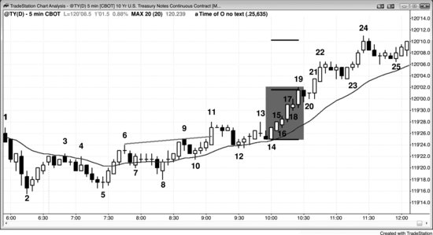
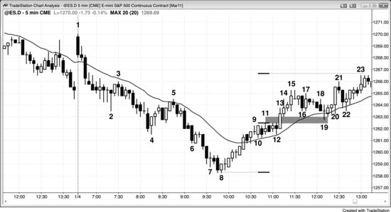

## 第 1 章：如何交易突破的示例

<!-- Source PDF pages 94–101 -->

<!-- PDF page 94 -->

第 1 章
如何交易突破的示例
许多初学者觉得突破难交易，因为市场移动快，需要快速决策，且常有大K线，意味着风险更大，交易者于是必须减小仓位。然而，若交易者学会识别很可能成功的突破，交易者公式可以非常强。
图 1.1 突破是可靠形态

当图表讨论长达多页时，请记住你可以到 Wiley 网站（www.wiley.com/go/tradingranges）查看或打印图表，这样读本书中的说明时不必反复翻回看图。
成功的突破，如图 1.1 中的多头突破，数学极佳，但在情绪上可能非常难交易。它们发生得很快，交易者本能知道风险在尖峰底部（他们把保护性止损放在多头尖峰最低那根K线低点下方 1 tick，如 K线 14 下方），这常常超过他们通常的 <!-- PDF page 95 --> 风险承受度。他们想等回撤，但知道它很可能要等市场更高才来，又害怕市价买入，因为他们是在尖峰顶部买入。若市场在下一个 tick 反转，他们就买在了尖峰顶部，而保护性止损非常远。然而，他们常常未能领会的是，数学站在他们一边。一旦出现像这样的强尖峰突破，基于尖峰高度至少走出等幅上行的概率至少是 60%，有时甚至可能是 80%。这意味着他们至少有 60% 的机会赚到至少等于初始风险的利润；若入场后尖峰继续长大，风险保持不变，而等幅运动目标却越来越高。例如，若交易者在图 1.1 中 10 年期美国国债期货 5 分钟图上的 K线 15 收盘买入，他们会把止损放在两K线尖峰底部下方 1 tick（1/64 点），即 K线 14 低点下方 1 tick，或入场价下方 7 tick。此时，由于交易者相信市场始终做多，他们认为在几根K线内更高的概率至少是 60%。他们也应假定至少会有等幅上行。由于尖峰高 6 tick，市场至少有 60% 的机会在跌到保护性止损之前至少上行 6 tick。
在 K线 19 收盘时，尖峰已长到 17 tick 高，且它仍是突破尖峰，因此仍至少有 60% 的机会至少等幅上行。若交易者此时空仓，本可以市价买入小仓位，止损放在尖峰底部 K线 14 下方 1 tick，即 18 tick，以赚取 16 tick（若市场再高 17 tick，他们可以 16 tick 利润出场）。在 K线 15 收盘买入的交易者仍只冒到 K线 14 低点下方的 7 tick 风险，但现在有 60% 的机会市场交易到 K线 19 高点上方 17 tick，大约是 28 tick 利润（14 个 1/32）。一旦下一根是空头内包K线而非另一根强多头趋势K线，尖峰在 K线 19 结束。这是多头趋势通道阶段一系列回撤中的第一个。K线 24 越过了等幅运动目标，市场在大约一小时后交易得更高。
实践中，大多数交易者会在尖峰长大时收紧止损，因此他们冒的风险会小于刚才讨论的。许多 <!-- PDF page 96 --> 在 K线 15 收盘买入的交易者，一旦 K线 17 收盘，可能已把止损上移到其下方，因为他们不希望市场跌破如此强的多头趋势K线。若跌破，他们会认为自己的前提错了，不想冒更大亏损。当 K线 19 收盘且交易者看到它是强多头趋势K线时，许多人可能已把保护性止损放在 K线 17 突破形成的微型度量缺口中。K线 18 的低点高于 K线 16 的高点，这个缺口是强势迹象。交易者希望市场继续上行，而不是跌破 K线 18 进入缺口，因此有些交易者会把止损跟踪到 K线 18 低点下方。许多有经验的交易者利用尖峰加压交易。他们在尖峰继续上行时加多，因为他们知道尖峰有出色的交易者公式，且绝佳机会会很短暂。当市场提供交易者公式很强的交易时，交易者需要积极。当没有时——如在窄幅震荡区间中——他需要少交易或根本不交易。
从 K线 5 起的多头尖峰对大多数交易者把市场翻转为始终做多。当市场越过 K线 11 楔形空头旗形高点时，很可能大约有等幅上行。K线 15 是连续第二根强多头趋势K线，在许多交易者心中确认了突破。K线 14 与 15 都是实体够大、没有显著影线的强多头趋势K线。从 K线 5 低点一路上行有良好买盘压力，表现为许多强多头趋势K线、重叠很少、只有少数空头趋势K线，以及没有连续的强空头趋势K线。市场可能处于多头趋势早期，聪明的交易者在寻找多头突破。一旦 K线 14 与 15 突破，他们急于做多，并一路分批持续买入到 K线 19 高点。
交易者必须强迫自己做的最重要的事——通常很难——是：一旦他们相信有可靠的突破尖峰，就必须至少建立小仓位。当他们感到自己希望回撤却害怕许多根K线内都不会来时，应假定突破很强。他们必须决定最坏情况下的保护性止损在哪里——通常相当远——并用它作为止损。由于止损会很大，若入场较晚，初始 <!-- PDF page 97 --> 仓位应很小。一旦市场朝他们的方向运动且他们可以收紧止损，他们可以考虑加仓，但绝不应超过正常风险水平。当人人都想要回撤时，它通常很久都不会来。这是因为人人相信市场不久会更高，但他们并不一定相信市场不久就会更低。聪明的交易者知道这一点，因此开始分批买入。由于他们必须把风险放到尖峰底部，他们买得很少。若风险是正常的三倍，他们只买通常仓位的三分之一，以把绝对风险控制在正常范围内。当强多头持续分批小量买入时，这种买盘压力不利于回撤形成。强空头看到趋势，也相信市场不久会更高。若他们认为不久会更高，就会停止寻找做空。对他们来说，若认为再过几根K线可以在更好价格做空，现在做空没有意义。因此强空头不在做空，强多头在分批小量买入，以防很久都没有回撤。
结果是什么？市场继续走高。由于你需要做聪明交易者在做的事，你需要至少市价或在 1–2 tick 回撤时买入少量，并把风险放到尖峰底部。即便回撤从下一个 tick 开始，几率是它不会跌太远，聪明的多头就会把它看作价值并积极买入。记住，人人都在等回撤买入，因此当它终于到来时只会很小且不会持久。所有那些一直在等买入的交易者会把它看作他们想要的机会。结果是你的仓位很快会再次盈利。一旦市场足够高，你可以考虑部分止盈，也可以考虑在回撤时再买，而那很可能是在高于你原始入场的价格。重要的是：一旦你认定买入回撤是好主意，你就应完全做强多头在做的事，至少市价买入小仓位。
有些交易者喜欢在市场越过先前摆动高点时买入突破，在旧高上方 1 tick 用买入止损入场。总体而言，在回撤处入场时，回报更大、风险更小、成功概率 <!-- PDF page 98 --> 更高。若交易者买入这些突破，他们通常随后必须扛过回撤才能赚到多少利润。通常买入回撤比买入突破更好。例如，与其在市场上行至 K线 9 时在 K线 6 上方买入，交易者公式对在 K线 10 回撤上方买入可能更强。
对 K线 11 越过 K线 9 也是如此。对每一次突破，交易者必须决定它会成功还是失败。若他们相信会成功，他们会寻找买入突破或跟随K线的收盘、在前一根低点处及下方买入、以及在前一根高点上方买入。若他们相信会失败，他们不会买入；若他们持多，会离场。若他们相信失败会下行到足以剥头皮，他们可能做空剥头皮。若他们认为失败会导致趋势反转，他们可能寻找波段做空。在这个具体情况下，当市场强劲越过 K线 9 与 K线 11 双顶时，买入突破是合理的，但在 K线 15 收盘买入的交易者以大约相同价格入场，并有更扎实的交易理由（在强多头尖峰中买入强多头趋势K线的收盘）。
若任何多头趋势或突破看起来还不够强，不适合在尖峰顶部附近买入——例如在最近一根的收盘——则交易者改为等待买入回撤时，交易者公式更强。K线 22 是 ii 形态突破的第二根，因此是可能的最后旗形反转形态的开始。这很可能是小买盘高潮（在第三册关于高潮反转的章节中讨论）。此时，买入回撤比买入 K线 22 收盘的交易者公式更强。对 K线 24 也是如此。随着趋势变得更加双边，更好的是寻找买入回撤。一旦双边交易足够强，且先前回撤更深、持续超过大约五根K线，交易者可以开始做空剥头皮，如在 K线 24 的两K线反转处（在随后空头K线低点下方做空）。在市场过渡到震荡区间之后，空头会开始做空波段，预期更深回撤与可能的趋势反转。

<!-- PDF page 99 -->

这个多头趋势中突破回撤买入形态的其他例子包括：K线 8 的 High 2 多头旗形（对上行至 K线 6 的回撤，该上行突破了从 K线 3 到 K线 5 的空头通道）、移动平均线处 K线 12 的 High 2（K线 11 突破了震荡区间并突破了 K线 10 的 High 1 多头旗形；第一段下推是 K线 11 后两根的空头K线）、K线 14 向上外包K线（交易者本可以在它向上外包时买入，但在 K线 14 上方买入成功概率更高，因为它是多头趋势K线）、K线 20 的 ii、K线 23 的 High 2（K线 23 是入场K线），以及 K线 25 的 High 2（所有双底都是 High 2 形态）。当信号K线有多头实体时更可靠。
总体而言，每当趋势刚变得强烈始终做多后出现初始回撤时，交易者应立刻挂买入止损，在尖峰高点上方买入。这是因为许多交易者害怕在前一根低点下方或 High 1 上方买入，认为市场可能有两段式回撤。然而，若他们等待两段式回撤，会错过许多最强的趋势。为防止自己被困在强趋势之外，交易者需要养成挂那张最后防线买入止损的习惯。若他们买入 High 1，可以取消买入止损。但若他们错过更早入场，至少会进入趋势，而这是他们需要做的。到 K线 19，趋势显然非常强，很可能基于尖峰高度继续上行大约等幅运动。一旦市场给出可能回撤的迹象，交易者需要在尖峰高点上方挂最坏情况的入场买入止损。K线 19 之后是空头趋势K线，可能是回撤的开始。他们需要在 K线 19 高点上方 1 tick 挂买入止损，以防趋势迅速恢复。若他们改为买入 K线 20 的 ii High 1 形态，会取消 K线 19 上方的买入止损。然而，若他们因任何原因错过买入 High 1，至少会在市场运行到新高时被带入趋势。他们的初始保护性止损会在最近的小回撤下方，即 K线 20 低点。
K线 24 是两K线多头尖峰，也是没有修正的连续第三次买盘高潮。当日剩余时间不足以完成 10 根K线、两段式修正，因此愿意做空它的空头不多，尤其是因为从 K线 5 与 12 起的上行卖盘压力如此之少。

<!-- PDF page 100 -->

然而，一些多头把它用作止盈机会，事实证明这是合理决定，因为当日剩余时间市场没有再回到高点上方。
交易者知道大多数反转趋势的尝试会失败，许多人喜欢对尝试做逆势交易。K线 12 前一根是大空头趋势K线，是跌破趋势线，并试图从 K线 11 多头突破向下反转。多头买入空头趋势K线的收盘，预期回到其高点，并很可能有等于该K线高度的等幅上行。一旦他们看到 K线 12 有多头收盘，他们买入 K线 12 的收盘及其高点上方。成功的空头突破通常后跟另一根空头趋势K线或至少十字星；若反而有多头实体，即便很小，失败突破尝试的几率就会更高，尤其当该K线在多头趋势中位于移动平均线处时。空头希望在空头尖峰之后有空头通道或其他类型的空头趋势，但多头把空头尖峰看作短暂打折时的买入机会。空头尖峰，尤其在日线图上，可能由新闻引起，但大多数没有跟随，更长期的多头基本面占上风，导致失败的空头突破与多头趋势恢复。空头因糟糕新闻而兴奋并满怀希望，但新闻通常是一日小事件，与全部基本面之和相比微不足道。
图 1.2 突破回撤

<!-- PDF page 101 -->

图 1.2 显示，当多头波段有向上突破时，市场通常会回测进入突破缺口。市场下跌至 K线 8 然后向上反转。K线 12 是第二次入场均线缺口K线做空，但失败了。市场没有测试空头低点，而是在 K线 13 向上突破。突破K线之后那根的低点与 K线 11 突破点的高点形成突破缺口。其中点或上行至 K线 11 第一段的高点，都可能导致向上等幅运动。K线 13 尖峰上行之后，有一个结束于 K线 15 的窄四K线通道，然后向下测试通道底部。K线 19 的测试也测入突破缺口，在这些情况下通常会发生。
从 K线 5 到 K线 8 的抛售没有回撤，K线 8 之后是第一根交易到前一根高点上方的K线。为什么有经验的交易者会在强趋势中第一次回撤通常会失败时回补高度盈利的空单？他们已学会应始终寻找部分或全部止盈的理由，尤其当利润很大时，因为那些利润可能迅速消失，尤其在可能的卖盘高潮之后。这里有连续三次卖盘高潮（下行至 K线 6、7 与 8），K线 7 之后的内包K线是潜在最后旗形（这些形态在第三册讨论）。市场很可能向上修正大约 10 根K线，可能到移动平均线、K线 4 低点，甚至 K线 5 高点。空头把这看作在 K线 8 附近锁定利润的绝佳机会，预期至少 10 根K线的反弹，然后在高得多的位置若有做空形态再寻找做空。上行如此强劲，以至于没有做空形态，空头很高兴自己明智地止盈，也不担心没有另一次好的做空机会。若他们持有空单，所有利润都会变成亏损。止盈是任何强趋势中第一次回撤的原因。错过抛售的空头希望有回撤让他们做空，但他们从未得到那个机会。
错过下行至 K线 4 的抛售、或在 K线 4 止盈并希望在回撤时再做空的空头，在移动平均线处的 K线 5 Low 2 得到了机会。它有空头实体，也是二十缺口K线做空形态（本书后面讨论）。
